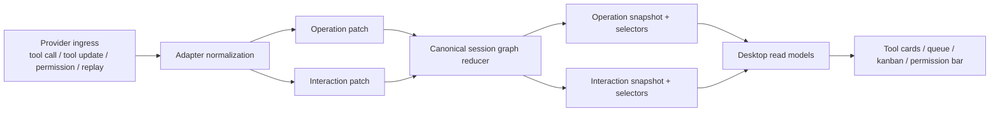

# refactor: canonical operation state model

> Superseded by `docs/plans/2026-04-25-002-refactor-final-god-architecture-stack-plan.md`. This plan remains as historical operation-state research; the final GOD stack is the active endpoint. Session identity closure is documented in `docs/solutions/architectural/provider-owned-session-identity-2026-04-27.md`.

## Overview

Deepen the revisioned session graph architecture in `docs/plans/2026-04-19-001-refactor-canonical-session-state-engine-plan.md` so **operations** become the canonical owner of runtime work semantics, including partial evidence and later enrichment. This is not a new architecture beside the graph-first plan; it is a refinement of that plan's existing `operations` lane so tool calls, permission blocks, replay hydration, and later provider signals all converge on one canonical operation record.

## Problem Frame

The parent graph-first plan already establishes the correct top-level shape: one backend-owned revisioned session graph covering transcript, operations, interactions, lifecycle, capabilities, and metadata. The remaining gap is that the current operation model is still too close to transport-shaped tool events.

Today, the system still thinks too much in terms of:

- `tool_call`
- `tool_call_update`
- `session/request_permission`
- frontend repair or association glue

That leaves the graph with a weaker concept than the product actually needs. Sparse ACP payloads can create an operation with little semantic information, then later permission-side or replay-side payloads arrive with richer evidence. The current architecture preserves some of that truth in separate lanes, but it does not consistently model all of those signals as **patches on one operation node**.

The desired end state is stricter:

1. Transcript remains the canonical owner of user/assistant conversation items.
2. Operations become the canonical owner of runtime work semantics: tool execution, blocked execution state, plan/apply execution state, retries, and similar non-transcript activity.
3. Provider ingress is normalized into **operation patches**, not desktop-facing product objects.
4. Interactions remain canonical reply-lifecycle records, but they reference and enrich an operation rather than owning a parallel semantic truth about the same runtime work.
5. The desktop renders selectors derived from operations and interactions; it does not repair missing tool semantics from transport payload timing.

## Requirements Trace

- R1. Operations are first-class canonical graph nodes with identity, lifecycle, strict semantic fields, and an evidence/fallback bag.
- R2. `tool_call`, `tool_call_update`, permission requests, replay hydration, and persisted history merge into one operation record keyed by canonical identity.
- R3. Interaction records remain canonical reply-routing state, but operation execution truth and blocked/running/completed semantics live on the operation node. One operation may reference at most one canonical interaction record for the same reply/permission event, including across reconnect and replay.
- R4. Snapshot, delta, open, reconnect, and refresh materialize the same operation state and evidence without frontend reconstruction.
- R5. Shared frontend code reads operation selectors such as display title, command, permission-blocked state, and raw evidence instead of merging tool payloads directly.
- R6. Provider quirks stay backend-owned inside adapters, reducers, and projection builders.
- R7. Existing graph-first invariants stay intact: transcript remains separate, replay stays internal, and the desktop does not become a semantic repair owner again.

## Scope Boundaries

- In scope is deepening the parent graph-first plan's `operations` lane so one operation record can carry both strict semantics and partial/fallback evidence.
- In scope is re-centering tool/permission/replay merging around canonical operation patches and selectors.
- In scope is preserving interaction records for reply lifecycle while removing their role as a second owner of operation semantics.
- In scope is deleting remaining frontend tool/permission stitching whose only purpose is to compensate for weak canonical operation state.
- Not in scope is redesigning transcript storage or collapsing transcript entries into operations.
- Not in scope is removing the interaction model entirely; interactions still matter for reply routing, approval, and answer state.
- Not in scope is a broad UI redesign; this plan changes authority and read models, not presentation shells.
- Not in scope is generalizing the evidence-bag concept to every future graph entity in the same slice; this plan proves it on operations first.

## Parent Plan Sequencing Gate

This child plan depends on the still-open parent graph-first work in Units 8-10.

- Child Units 1-3 must **adopt**, not redefine, the dual-frontier contract that parent Unit 8 introduces in `packages/desktop/src-tauri/src/acp/session_state_engine/protocol.rs`, `packages/desktop/src-tauri/src/acp/session_state_engine/bridge.rs`, and related TypeScript mirrors.
- Treat `packages/desktop/src-tauri/src/acp/session_open_snapshot/mod.rs`, `packages/desktop/src/lib/acp/session-state/session-state-query-service.ts`, and `packages/desktop/src/lib/acp/store/operation-store.svelte.ts` as joint-ownership files with the parent plan until Units 8-10 stabilize.
- Do not begin child Unit 1 until the parent Unit 8 frontier shape is stable enough that this child plan can build on it instead of competing with it.
- Do not execute child Units 3-5 until parent Units 9-10 land, because they touch overlapping files (`protocol.rs`, `bridge.rs`, `session-state-query-service.ts`, `tool-call-manager.svelte.ts`, `session-entry-store.svelte.ts`) and should deepen that work rather than fork it.

## Context & Research

### Relevant Code and Patterns

- `docs/plans/2026-04-19-001-refactor-canonical-session-state-engine-plan.md` is the parent architecture plan this work deepens rather than replaces.
- `packages/desktop/src-tauri/src/acp/projections/mod.rs` already materializes `OperationSnapshot`, proving the graph already has a canonical operation lane.
- `packages/desktop/src/lib/acp/store/operation-store.svelte.ts` is already the desktop read model for canonical operations, but it currently mirrors a thinner operation shape than the product needs.
- `packages/desktop/src-tauri/src/acp/inbound_request_router/permission_handlers.rs` already converts permission requests into canonical interaction updates plus synthetic tool-call context. That is the right seam to convert transport signals into operation patches instead of leaking them forward as separate semantic owners.
- `packages/desktop/src-tauri/src/acp/task_reconciler.rs` already proves same-ID tool calls can merge and emit canonical updates instead of duplicate rows.
- `packages/desktop/src/lib/acp/components/tool-calls/resolve-tool-operation.ts` already routes tool UI through canonical operation lookup, which makes it the right consumption seam once operations carry richer evidence.

### Institutional Learnings

- `docs/solutions/architectural/provider-owned-semantic-tool-pipeline-2026-04-18.md` — provider reducers and shared projectors own tool semantics; the UI must not invent or repair them.
- `docs/solutions/logic-errors/operation-interaction-association-2026-04-07.md` — operation and interaction association must live below the UI boundary; ownership beats clever matching.
- `docs/solutions/best-practices/deterministic-tool-call-reconciler-2026-04-18.md` — backend classification must be deterministic and explicit; ambiguity belongs in canonical fallback state, not in UI heuristics.

### External References

- None. Local plans, learnings, and current code already define the relevant architectural posture.

## Key Technical Decisions

- **Keep this as a child plan, not a replacement plan.** The Apr 19 graph-first plan already owns the top-level architecture; this plan deepens its operation model.
- **Operations own execution truth; interactions own reply lifecycle.** Permission/question/plan-approval records remain canonical interactions, but blocked/running/completed execution truth and evidence merge onto the referenced operation.
- **Add a canonical operation evidence/fallback bag.** Strict semantic fields remain typed and narrow, while provider-observed evidence such as titles, raw input/output, content, locations, and derived details live in canonical operation state for selectors to use.
- **Operations need an explicit execution lifecycle separate from transport-era assumptions.** The canonical operation contract must be able to represent `blocked` execution state directly, not infer it indirectly from the presence of an interaction.
- **Normalize ingress into operation patches.** Provider tool events, permission requests, replay hydration, and persisted history should all become patches against one operation node rather than separate product-shaped objects.
- **Evidence fields are monotonically enriching.** A later operation patch may populate empty evidence fields or upgrade partial evidence to richer values, but it must never clear a field already populated by an earlier richer patch.
- **Selectors derive presentation from canonical state.** Derived fields such as display title, known command, blocked-by-permission state, and raw evidence summaries come from backend/read-model selectors, not tool-card-specific frontend heuristics.
- **Interactions reference operations explicitly.** `InteractionSnapshot` and corresponding TS types must carry a stable `operation_id` so the frontend never has to reconstruct the relationship from tool-call IDs alone.
- **Freeze evidence categories before reducer work starts.** Unit 1 must lock the evidence-bag categories and their TS-generated contract before Unit 2 begins wiring patches through the reducer.
- **`Operation` derives from canonical operation snapshots, not transcript tool-call types.** `ToolCall` remains a transcript-layer DTO; `Operation` must derive from `OperationSnapshot` once the contract deepening lands.
- **Delete parallel semantic merge owners after proof.** `tool-call-manager.svelte.ts`, permission association helpers, and related frontend glue should end this plan thinner than they started.
- **Provider-agnostic means stable category schema, not provider-free payloads.** Provider-derived evidence may populate canonical categories when it represents durable product truth, but the graph contract should not expose provider-specific ad hoc field names.

## Open Questions

### Resolved During Planning

- **Should this replace the Apr 19 graph-first plan?** No. This work is a child plan that deepens the existing `operations` lane.
- **Should transcript become part of the same operation model?** No. Transcript remains the canonical owner of conversation items; this plan only deepens non-transcript runtime operations.
- **Should interactions disappear?** No. Interactions remain canonical reply-routing state, but they stop being a second semantic owner of execution truth.

### Deferred to Implementation

- **Exact evidence bag shape.** The plan locks the responsibilities and required data categories, but the final field names and serialization details should be decided while touching the real reducer/projection code.
- **How much evidence is mirrored into desktop-generated TS types versus held backend-only.** The implementation should keep only what selectors and durable snapshots truly need, rather than front-loading a large public wire contract without proof.
- **Whether operation snapshots need separate derived presentation fields or only raw evidence plus selectors.** This should be finalized where snapshot size and selector ergonomics can be evaluated together.
- **Minimum evidence categories to account for.** At minimum, the evidence design must intentionally account for `locations`, `skillMeta`, `normalizedQuestions` / `normalizedTodos`, `questionAnswer`, `awaitingPlanApproval` / `planApprovalRequestId`, and `startedAtMs` / `completedAtMs` — the current fields that live `Operation` records know about but snapshot replacement leaves unset today.

## High-Level Technical Design

> *This illustrates the intended approach and is directional guidance for review, not implementation specification. The implementing agent should treat it as context, not code to reproduce.*

Directional operation shape:

| Concern | Canonical owner |
|---|---|
| User/assistant message content | Transcript |
| Execution lifecycle (`pending`, `blocked`, `running`, `completed`, `failed`) | Operation |
| Typed semantic fields (`read.filePath`, `execute.command`, `search.query`) | Operation |
| Partial/fallback evidence (`title`, raw input/output, content, locations, derived detail) | Operation |
| Reply routing / approval / answers | Interaction |

## Observable Outcomes

After this slice lands, Acepe should not show:

- duplicate tool/operation rows for one logical action,
- a permission-pending action disappearing and reappearing during reconnect,
- a tool card reopening with a thinner or different title/command than it had while live.

Those user-visible invariants are acceptance criteria for the plan, not just nice-to-have side effects.

## Implementation Units

- [ ] **Unit 1: Strengthen the canonical operation contract**

**Goal:** Extend the graph contract so operations are first-class nodes with both strict semantic fields and canonical fallback evidence.

**Requirements:** R1, R4, R6, R7

**Dependencies:** None

**Files:**
- Modify: `packages/desktop/src-tauri/src/acp/session_state_engine/graph.rs`
- Modify: `packages/desktop/src-tauri/src/acp/session_state_engine/protocol.rs`
- Modify: `packages/desktop/src-tauri/src/acp/projections/mod.rs`
- Modify: `packages/desktop/src/lib/services/acp-types.ts`
- Modify: `packages/desktop/src/lib/services/converted-session-types.ts`
- Modify: `packages/desktop/src/lib/acp/types/operation.ts`
- Test: `packages/desktop/src-tauri/src/acp/projections/mod.rs`
- Test: `packages/desktop/src/lib/services/acp-types.test.ts`

**Approach:**
- Deepen `OperationSnapshot` and related graph/protocol types so an operation can carry:
  - identity
  - explicit execution lifecycle (`pending`, `blocked`, `running`, `completed`, `failed`)
  - strict typed arguments
  - canonical evidence/fallback state
- Add an explicit `operation_id` bridge on interaction snapshots/types so interactions can reference operations without frontend join reconstruction.
- Freeze the evidence-bag field categories and their TS-generated stubs in this unit. Later units may populate values, but they must not add new categories without amending the plan.
- Make the Unit 1 contract explicitly account for the currently missing snapshot-path fields: `locations`, `skillMeta`, `normalizedQuestions` / `normalizedTodos`, `questionAnswer`, `awaitingPlanApproval` / `planApprovalRequestId`, and `startedAtMs` / `completedAtMs`.
- Keep the evidence bag provider-agnostic in **schema category** at the graph boundary even when provider-owned adapters populate those categories with durable evidence.
- Preserve the parent plan's graph-first rule: this remains one graph materialization, not a new desktop-facing event family.

**Patterns to follow:**
- `docs/plans/2026-04-19-001-refactor-canonical-session-state-engine-plan.md`
- `packages/desktop/src-tauri/src/acp/projections/mod.rs`

**Test scenarios:**
- Happy path: a canonical operation snapshot can represent a sparse execute/search/read tool call plus later evidence without widening typed arguments into provider-specific blobs.
- Happy path: an interaction with a known tool call carries a non-null `operation_id` in both Rust snapshot types and generated TypeScript mirrors.
- Happy path: an operation can represent `blocked` execution directly in canonical state without waiting for a separate interaction lookup.
- Edge case: an operation with no typed command/query/path still carries evidence fields sufficient for later selectors without forcing fake typed values.
- Integration: generated TypeScript mirrors preserve the same operation contract as the Rust snapshot types.
- Error path: missing evidence stays explicit `None`/`null` rather than triggering fallback semantic invention in type generation or projection code.

**Verification:**
- One shared Rust/TypeScript contract can express strict operation semantics, explicit blocked lifecycle, and partial evidence without adding a second operation model. Evidence-bag categories are frozen before Unit 2 begins.

- [ ] **Unit 2: Merge provider ingress into operation patches**

**Goal:** Make backend reducers the only place that merge tool events, permission requests, replay hydration, and persisted history into one operation record.

**Requirements:** R2, R3, R6, R7

**Dependencies:** Unit 1

**Files:**
- Modify: `packages/desktop/src-tauri/src/acp/task_reconciler.rs`
- Modify: `packages/desktop/src-tauri/src/acp/inbound_request_router/permission_handlers.rs`
- Modify: `packages/desktop/src-tauri/src/acp/inbound_request_router/mod.rs`
- Modify: `packages/desktop/src-tauri/src/acp/client_loop.rs`
- Modify: `packages/desktop/src-tauri/src/acp/providers/cursor_session_update_enrichment.rs`
- Modify: `packages/desktop/src-tauri/src/acp/projections/mod.rs`
- Modify: `packages/desktop/src-tauri/src/history/commands/session_loading.rs`
- Modify: `packages/desktop/src-tauri/src/acp/ui_event_dispatcher.rs`
- Test: `packages/desktop/src-tauri/src/acp/task_reconciler.rs`
- Test: `packages/desktop/src-tauri/src/acp/client_loop.rs`
- Test: `packages/desktop/src-tauri/src/history/commands/session_loading.rs`

**Approach:**
- Convert permission-side enrichment from "another semantic owner" into an operation patch that updates the existing canonical operation for the same `tool_call_id`.
- Keep interactions canonical for reply routing, but make them reference an already-enriched operation instead of carrying the only useful evidence.
- Delete `SyntheticToolCallContext` and its downstream desktop-facing consumption so permission ingress emits only canonical operation/interation patches, not a parallel synthetic tool-call semantic event.
- Ensure persisted history and replay hydrate the same operation patch model instead of restoring a thinner shape than live sessions receive. The actual restore parity target is `import_thread_snapshot` / `upsert_tool_call_projection` in `packages/desktop/src-tauri/src/acp/projections/mod.rs`, not `session_loading.rs` alone.
- Enforce the monotonic evidence rule inside the reducer/patch merge path so sparse late-arriving updates cannot clear richer evidence already present on the operation.

**Execution note:** Start with failing backend coverage for a sparse tool call followed by a richer permission-side update for the same operation.

**Patterns to follow:**
- `packages/desktop/src-tauri/src/acp/inbound_request_router/permission_handlers.rs`
- `packages/desktop/src-tauri/src/acp/task_reconciler.rs`
- `docs/solutions/logic-errors/operation-interaction-association-2026-04-07.md`

**Test scenarios:**
- Happy path: a sparse execute tool call followed by a permission request for the same `tool_call_id` yields one canonical operation with merged lifecycle and evidence.
- Happy path: a sparse read/search tool call followed by later replay or persisted-history evidence yields one canonical operation instead of duplicate rows.
- Edge case: repeated tool-call patches with the same ID merge without regressing terminal status or richer prior evidence.
- Error path: a permission request that names an unknown operation fails closed as an unresolved interaction instead of fabricating a second semantic owner.
- Integration: reopen/replay path and live path produce equivalent operation state for the same logical action.
- Integration: a permission request produces zero synthetic desktop `ToolCall` events after the reducer change; only canonical operation/interation patches reach the shared desktop boundary.

**Verification:**
- Backend ingress has one semantic merge owner for operations, permission-side enrichment no longer depends on frontend stitching, and synthetic tool-call dual ownership is gone.

- [ ] **Unit 3: Materialize operation evidence through snapshots and selectors**

**Goal:** Ensure snapshots, deltas, and read models expose operation evidence and derived selectors as part of the graph-first architecture.

**Requirements:** R4, R7

**Dependencies:** Unit 2

**Files:**
- Modify: `packages/desktop/src-tauri/src/acp/session_state_engine/bridge.rs`
- Modify: `packages/desktop/src-tauri/src/acp/session_open_snapshot/mod.rs`
- Modify: `packages/desktop/src-tauri/src/acp/commands/session_commands.rs`
- Modify: `packages/desktop/src-tauri/src/acp/domain_events.rs`
- Modify: `packages/desktop/src/lib/acp/session-state/session-state-query-service.ts`
- Modify: `packages/desktop/src/lib/services/acp-types.ts`
- Modify: `packages/desktop/src/lib/acp/store/operation-store.svelte.ts`
- Test: `packages/desktop/src-tauri/src/acp/commands/tests.rs`
- Test: `packages/desktop/src/lib/acp/store/__tests__/operation-store.vitest.ts`
- Test: `packages/desktop/src/lib/acp/store/__tests__/session-store-projection-state.vitest.ts`

**Approach:**
- Make operation evidence available through the same snapshot/open/delta path the parent plan already established for graph state.
- Expand the live `operation_upserted` domain-event payload so operation evidence reaches the desktop during streaming without relying on raw tool-call transport payloads as a parallel semantic carrier.
- Add or strengthen selectors for:
  - display title
  - known command
  - blocked-by-permission state
  - raw evidence availability
- Keep selector logic read-only and derived; do not let desktop stores become merge owners again. This unit prepares the data and selector layer; the actual shared-frontend consumption requirement is completed in Unit 4.

**Patterns to follow:**
- `packages/desktop/src-tauri/src/acp/session_open_snapshot/mod.rs`
- `packages/desktop/src/lib/acp/store/operation-store.svelte.ts`

**Test scenarios:**
- Happy path: opening a persisted session produces the same operation evidence/selectors as attaching live to the same session state.
- Edge case: snapshot fallback after stale lineage preserves operation evidence instead of collapsing to a thinner placeholder state.
- Integration: snapshot replacement followed by in-flight deltas for the same operation ID converges to one canonical operation-store entry with the richest evidence, not two entries and not a regression to the thinner delta shape.
- Integration: operation-store read models expose the same command/title/blocking state regardless of whether the source was snapshot hydration or live delta application.
- Integration: live `operation_upserted` events carry enough evidence that `tool-call-manager.svelte.ts` no longer needs raw transport payloads as a semantic fallback.
- Error path: sessions with sparse historical evidence remain renderable without frontend heuristics manufacturing missing semantics.

**Verification:**
- Graph materializations carry operation evidence as a first-class part of canonical state, and the desktop can read that state without special-case repair.

- [ ] **Unit 4: Replace frontend semantic repair with operation selectors**

**Goal:** Move tool-card, permission, and operation-association consumers onto canonical operation selectors rather than transport-shaped tool payload repair.

**Requirements:** R5, R6, R7

**Dependencies:** Unit 3

**Files:**
- Modify: `packages/desktop/src/lib/acp/store/services/tool-call-manager.svelte.ts`
- Modify: `packages/desktop/src/lib/acp/store/operation-association.ts`
- Modify: `packages/desktop/src/lib/acp/store/permission-store.svelte.ts`
- Modify: `packages/desktop/src/lib/acp/components/tool-calls/resolve-tool-operation.ts`
- Modify: `packages/desktop/src/lib/acp/components/tool-calls/permission-visibility.ts`
- Test: `packages/desktop/src/lib/acp/store/services/__tests__/tool-call-manager.test.ts`
- Test: `packages/desktop/src/lib/acp/store/__tests__/operation-association.test.ts`
- Test: `packages/desktop/src/lib/acp/components/tool-calls/__tests__/permission-visibility.test.ts`
- Test: `packages/desktop/src/lib/acp/components/tool-calls/__tests__/resolve-tool-operation.test.ts`

**Approach:**
- Pre-condition: the parent graph-first plan's Unit 5 already removed transport-payload merge authority from `tool-call-manager.svelte.ts`. This unit must audit that post-parent state first and only remove the remaining operation-evidence/title/command inference that survived the earlier thinning.
- Reduce `tool-call-manager.svelte.ts` to transcript-entry mutation glue plus operation-store upsert, not semantic merge ownership.
- Move permission visibility and route decisions onto canonical operation state and operation/interation association selectors.
- Keep compatibility fallback narrow and explicit; do not allow component-local title/command guessing to grow further.
- The reduced `tool-call-manager.svelte.ts` survives this unit only as a transcript-entry adapter plus operation-store forwarding seam. Any final deletion or absorption is explicitly deferred to the parent graph-first plan's frontend-repair cleanup, not left ambiguous inside this child plan.

**Execution note:** Add characterization coverage around existing permission/tool rendering before deleting merge heuristics.

**Patterns to follow:**
- `packages/desktop/src/lib/acp/store/operation-store.svelte.ts`
- `packages/desktop/src/lib/acp/components/tool-calls/resolve-tool-operation.ts`
- `docs/solutions/logic-errors/operation-interaction-association-2026-04-07.md`

**Test scenarios:**
- Happy path: a pending permission attached to a sparse execute operation renders from operation selectors without needing direct raw transport inspection in the component.
- Edge case: read/search operations with incomplete typed arguments still route to the correct card and metadata display via canonical evidence selectors.
- Integration: transcript tool row, permission bar, queue, and operation association all resolve the same underlying operation state.
- Error path: missing operation evidence falls back to a selector-owned minimal display (`resolved kind label` when available, otherwise a standardized `Unknown action` placeholder) instead of reviving component-local repair heuristics.

**Verification:**
- Tool and permission UI surfaces consume canonical selectors and no longer own semantic reconciliation.

- [ ] **Unit 5: Delete mixed-authority tool/permission seams**

**Goal:** Remove redundant product-state owners once canonical operation patches and selectors are proven.

**Requirements:** R5, R6, R7

**Dependencies:** Unit 4

**Files:**
- Modify: `packages/desktop/src/lib/acp/store/services/transcript-snapshot-entry-adapter.ts`
- Modify: `packages/desktop/src/lib/acp/store/session-entry-store.svelte.ts`
- Modify: `packages/desktop/src/lib/acp/components/tool-calls/tool-call-router.svelte`
- Modify: `packages/desktop/src-tauri/src/acp/ui_event_dispatcher.rs`
- Modify: `packages/desktop/src-tauri/src/acp/domain_events.rs`
- Test: `packages/desktop/src/lib/acp/store/__tests__/session-entry-store-streaming.vitest.ts`
- Test: `packages/desktop/src/lib/acp/store/__tests__/tool-call-event-flow.test.ts`
- Test: `packages/desktop/src-tauri/src/acp/commands/tests.rs`

**Approach:**
- Delete or downgrade any remaining desktop or transport bridge paths that still behave as semantic owners for tool/permission state.
- Preserve transcript rows as transcript, but make sure transcript snapshot rehydration does not down-convert or replace richer canonical operation state.
- Keep domain events aligned with operation truth so downstream consumers do not need transport-era compatibility branching.
- This unit owns tool/permission semantic authority removal in `transcript-snapshot-entry-adapter.ts`, `session-entry-store.svelte.ts`, and `tool-call-router.svelte`. The parent graph-first plan still owns broader legacy open/live bridge cleanup in overlapping files such as `ui_event_dispatcher.rs` and `domain_events.rs`; do not treat this child plan as a substitute for that parent deletion gate.

**Patterns to follow:**
- `docs/plans/2026-04-19-001-refactor-canonical-session-state-engine-plan.md`
- `packages/desktop/src/lib/acp/store/session-entry-store.svelte.ts`

**Test scenarios:**
- Happy path: transcript snapshot replacement preserves richer canonical operation state for the same tool/operation ID.
- Edge case: live sparse tool rows followed by richer operation snapshots do not regress title, command, or evidence fields.
- Integration: a live delta received after a snapshot-sourced operation does not downgrade evidence fields already populated by the richer snapshot.
- Integration: no shared desktop flow mutates operation semantics from raw permission/tool payloads after canonical state has been applied.
- Error path: cleanup does not remove explicit failure surfaces for missing operation or missing interaction state.
- Error path: non-tool domain events such as lifecycle or capability updates continue to route correctly through `ui_event_dispatcher.rs` and `domain_events.rs` after tool/permission semantic authority is removed.

**Verification:**
- Shared product paths no longer contain parallel owners for tool/permission semantics.

- [ ] **Unit 6: Prove canonical operation behavior end-to-end**

**Goal:** Prove that one canonical operation record survives reopen, reconnect, permission-active, and replay-heavy flows.

**Requirements:** R2, R3, R4, R5, R7

**Dependencies:** Unit 5

**Files:**
- Test: `packages/desktop/src-tauri/src/acp/commands/tests.rs`
- Test: `packages/desktop/src-tauri/src/history/commands/session_loading.rs`
- Test: `packages/desktop/src/lib/acp/store/services/session-connection-manager.test.ts`
- Test: `packages/desktop/src/lib/acp/store/__tests__/session-event-service-streaming.vitest.ts`
- Test: `packages/desktop/src/lib/acp/components/tool-calls/__tests__/operation-interaction-parity.contract.test.ts`
- Create: `docs/solutions/architectural/revisioned-session-graph-contract-2026-04-20.md`

**Approach:**
- Extend the parent proof posture to cover the canonical operation model explicitly.
- Prove equivalence across:
  - fresh sessions
  - restored sessions
  - reconnect during blocked or in-progress work
  - permission/question flows
  - replay/persisted-history hydration
- During reconnect, the desktop must hold and continue to display the last-known canonical operation state, including blocked/permission-pending state, until a successful fresh snapshot or post-frontier delta stream replaces it. Reconnect is not allowed to clear operation state mid-window.
- Update the contributor-facing architecture reference so the graph-first contract explicitly documents operations as first-class canonical nodes with evidence/fallback state.

**Patterns to follow:**
- `docs/plans/2026-04-19-001-refactor-canonical-session-state-engine-plan.md`
- `docs/solutions/architectural/provider-owned-semantic-tool-pipeline-2026-04-18.md`
- `packages/desktop/src/lib/acp/store/__tests__/session-store-projection-state.vitest.ts`

**Test scenarios:**
- Happy path: one logical execute action remains one canonical operation across live tool start, permission block, completion, and reopen.
- Happy path: one sparse read/search action that gains richer replay-side evidence still resolves to one operation record after reopen.
- Integration: reconnect during an active permission or question flow preserves one operation and one interaction reference instead of diverging rows.
- Integration: a reconnect window that lasts long enough to be visible keeps the last-known blocked/permission-pending operation state rendered for the entire window instead of clearing and re-adding it.
- Error path: failed reconnect or stale-lineage refresh keeps the last canonical operation state intact rather than reconstructing from raw transport payloads.

**Verification:**
- Reopen/reconnect/permission-active flows all preserve one canonical operation record and one interaction association model.

## Parent Plan Alignment

| Parent unit | Deepening focus | Delivered by child unit(s) |
|---|---|---|
| Unit 1 | Strengthen the graph contract so operations carry identity, lifecycle, strict semantics, and evidence/fallback state | Unit 1 |
| Unit 2 | Make the reducer the only merge owner for tool events, permission requests, replay, and persisted history | Unit 2 |
| Unit 3 | Ensure snapshots and deltas naturally materialize operation evidence because operations already live in the graph | Unit 3 |
| Unit 4 | Keep provider quirks inside adapters and backend-owned merge logic | Unit 2 |
| Unit 5 | Expose operation selectors for title, command, blocked state, and raw evidence instead of frontend payload merge | Unit 4 |
| Unit 6 | Delete tool/permission stitching as semantic owners once selectors and graph state are proven | Unit 5 |
| Unit 7+ | Prove reopen/reconnect/permission-active flows preserve one canonical operation record | Unit 6 |

## System-Wide Impact

- **Interaction graph:** Permission, question, and plan-approval flows keep their own lifecycle records, but now enrich and reference a canonical operation rather than competing with it.
- **Error propagation:** Sparse or incomplete provider payloads should surface as partial operation evidence, not as a reason for frontend semantic repair.
- **State lifecycle risks:** The main risks are duplicate operation identity, evidence regression during snapshot replacement, and replay/live divergence. This plan addresses all three by moving merge ownership into the backend graph and canonical read models.
- **API surface parity:** Rust snapshot/projection types, specta-generated TypeScript types, operation-store read models, and tool-card resolvers must remain in parity.
- **Integration coverage:** Reconnect, permission-active, persisted reopen, and stale-lineage refresh need cross-layer proof because unit tests alone cannot prove parity.
- **Unchanged invariants:** Transcript remains the only owner of conversation content, replay remains backend-internal, and provider-specific policy stays behind adapters/runtime seams.

## Risks & Dependencies

| Risk | Mitigation |
|------|------------|
| Operation and interaction responsibilities blur again during implementation | Keep execution truth on operations, reply lifecycle on interactions, and require tests that prove both surfaces reference the same logical action |
| Snapshot/open paths preserve a thinner operation shape than live reducers | Add parity tests that compare open/reconnect/live outcomes for the same logical session history |
| Frontend cleanup regresses current card routing or permission visibility | Characterize existing tool/permission UI behavior before deleting merge heuristics and route consumers through operation selectors incrementally |
| Evidence bag grows into provider-specific junk drawer | Keep the graph boundary provider-agnostic and require rationale for every persisted evidence field |
| Child Units 1-3 collide with parent Units 8-10 in shared contract files | Coordinate the parent Unit 8 dual-frontier contract cut before deepening operations into `session_state_engine/protocol.rs`, `session_state_engine/bridge.rs`, and related TypeScript mirrors; treat child Units 3-5 as blocked until parent Units 9-10 settle the overlapping files |

## Documentation / Operational Notes

- Update `docs/solutions/architectural/revisioned-session-graph-contract-2026-04-20.md` once the child plan lands so contributors see operations as a first-class part of the graph-first architecture.
- Any follow-on work that generalizes the evidence-bag pattern beyond operations should be a separate plan after this slice proves the model in production-critical tool/permission flows.

## Sources & References

- **Parent plan:** `docs/plans/2026-04-19-001-refactor-canonical-session-state-engine-plan.md`
- Related code: `packages/desktop/src-tauri/src/acp/projections/mod.rs`
- Related code: `packages/desktop/src/lib/acp/store/operation-store.svelte.ts`
- Related code: `packages/desktop/src-tauri/src/acp/inbound_request_router/permission_handlers.rs`
- Institutional learning: `docs/solutions/architectural/provider-owned-semantic-tool-pipeline-2026-04-18.md`
- Institutional learning: `docs/solutions/logic-errors/operation-interaction-association-2026-04-07.md`
- Institutional learning: `docs/solutions/best-practices/deterministic-tool-call-reconciler-2026-04-18.md`
