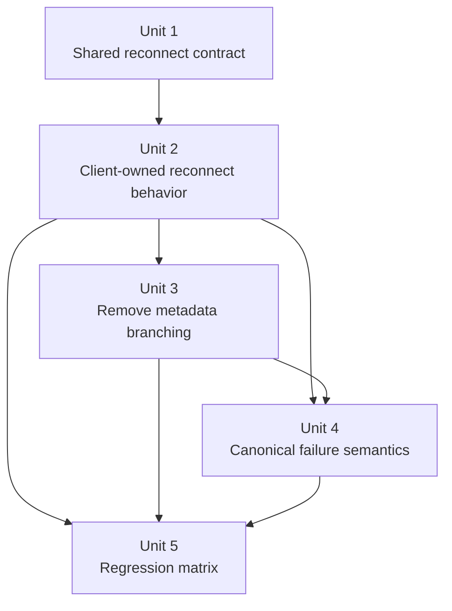
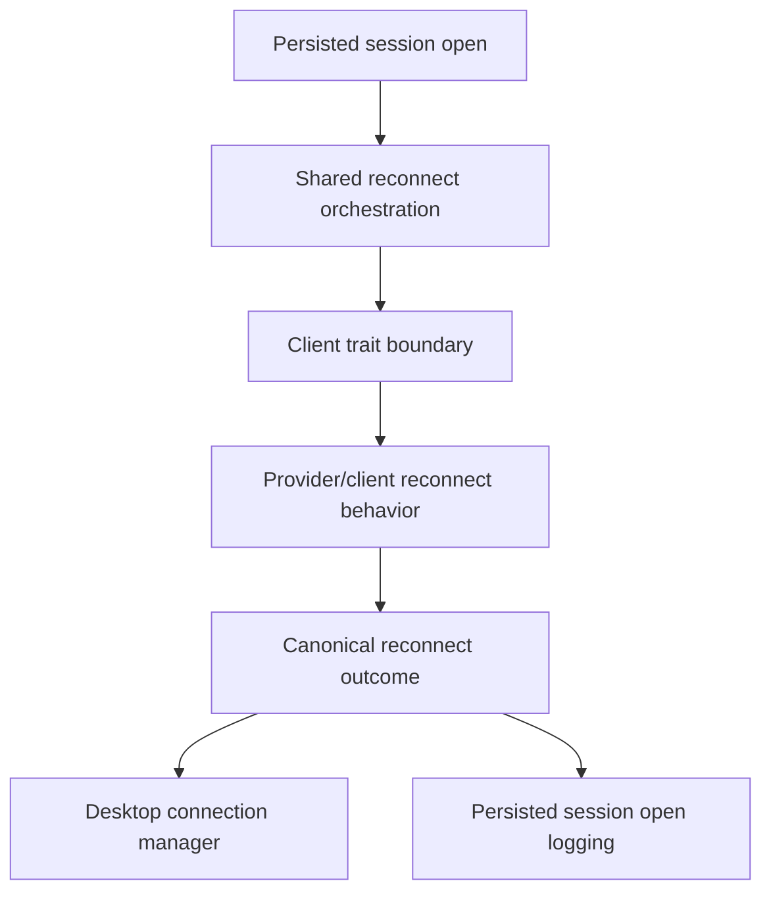

# refactor: provider-owned reconnect behavior

## Overview

Remove shared reconnect-verb branching from Acepe's runtime and make reconnect semantics provider/client-owned behavior.

Today the backend reconnect path decides between `session/resume` and `session/load` by reading a shared capability enum. That is better than hardcoded Copilot logic, but it still leaks provider behavior into shared orchestration. The result is a fragile architecture where a wrong metadata value can route an entire provider through the wrong reconnect path, as happened with Copilot.

This plan moves reconnect from **provider-described branching** to **provider-owned behavior** so the shared runtime calls one reconnect entrypoint and the provider/client layer decides how to attach, load, resume, or fail.

Known baseline: this failure mode already caused at least one production-facing restore bug (Copilot), and the same shared reconnect-policy surface still exists for every reconnect-capable provider plus future additions. The do-nothing cost is not hypothetical cleanliness debt; it is a proven failure class with remaining blast radius.

## Problem Frame

Acepe's stated architecture trend is agent-agnostic, backend-owned, and edge-contained: provider quirks should stop at adapters and runtime edges. Reconnect is not there yet.

The current reconnect path in `packages/desktop/src-tauri/src/acp/commands/client_ops.rs` branches on `ReconnectSessionMethod`, which is currently sourced from provider capabilities and surfaced through shared traits. That means shared code still knows that some providers are "Load" providers and others are "Resume" providers. The recent Copilot bug proved the weakness of that model: one wrong capability value made the runtime call `session/resume` against a backend that only supported `session/load`, and the frontend then surfaced a misleading read-only error.

The cleaner architecture is stricter:

1. Shared runtime asks the client to reconnect a session.
2. The provider/client layer owns how reconnect is performed.
3. Shared runtime does not branch on reconnect verbs, protocol affordances, or provider reconnect semantics.
4. Failures are reported as canonical reconnect outcomes, not as leaked transport-method assumptions.

This is a cross-cutting refactor because reconnect behavior touches persisted-session open, client lifecycle, provider capabilities, backend error semantics, and frontend failure messaging.

## Requirements Trace

- R1. Shared runtime reconnect flow must use one provider/client-owned reconnect entrypoint instead of branching on a shared reconnect-method enum.
- R2. Provider-specific reconnect behavior must remain confined to provider/client layers; shared command/runtime code must not decide between `session/load`, `session/resume`, or provider-specific attach variants.
- R3. Existing provider behavior must remain intact: providers that require replay/load semantics still reconnect correctly, and providers that support direct resume still use their correct transport path.
- R4. Reconnect failure semantics must be canonical and user-meaningful; the frontend must not translate transport-method mismatches into misleading "agent does not support resume" messaging.
- R5. Regression coverage must verify that Copilot, Cursor, OpenCode, Claude Code, and Codex still reconnect through their correct provider-owned semantics after shared reconnect branching is removed.

## Scope Boundaries

- In scope is reconnect behavior for persisted-session open and live client reattachment.
- In scope is removing shared reconnect-method branching from backend runtime orchestration.
- In scope is updating provider/client abstractions and the failure surface that reaches the frontend.
- In scope is keeping current provider semantics intact while relocating ownership.
- Not in scope is redesigning broader session-open canonical snapshot architecture.
- Not in scope is changing provider transport protocols beyond what is needed to express provider-owned reconnect behavior.
- Not in scope is UI redesign beyond correcting reconnect failure semantics.

## Context & Research

### Relevant Code and Patterns

- `packages/desktop/src-tauri/src/acp/commands/client_ops.rs` currently owns the shared `Load` vs `Resume` branch.
- `packages/desktop/src-tauri/src/acp/client_trait.rs` exposes `ReconnectSessionMethod` and a shared `reconnect_method()` contract.
- `packages/desktop/src-tauri/src/acp/client/trait_impl.rs`, `packages/desktop/src-tauri/src/acp/client/cc_sdk_client.rs`, `packages/desktop/src-tauri/src/acp/client/codex_native_client.rs`, and `packages/desktop/src-tauri/src/acp/opencode/http_client/agent_client_impl.rs` are the client seams that can absorb reconnect behavior without leaking it upward.
- `packages/desktop/src-tauri/src/acp/client_factory.rs` shows the current runtime split: Claude Code, Copilot, and Cursor all instantiate the shared cc-sdk client; OpenCode uses the HTTP client; Codex uses the native Codex client.
- `packages/desktop/src-tauri/src/acp/client/session_lifecycle.rs` already contains verb-specific transport helpers for `session/resume` and `session/load`; those should become internal client implementation details instead of shared orchestration decisions.
- `packages/desktop/src-tauri/src/acp/provider.rs` and `packages/desktop/src-tauri/src/acp/parsers/provider_capabilities.rs` currently carry reconnect semantics as provider metadata, including the adjacent `seeds_resume_launch_mode` flag that still drives a reconnect-phase preflight from shared code.
- `packages/desktop/src-tauri/src/acp/commands/tests.rs` already has reconnect-path regression coverage and is the right place to pin the shared orchestration contract.
- `packages/desktop/src/lib/acp/store/services/session-connection-manager.ts` currently surfaces the misleading "Session is read-only (agent does not support resume)" fallback when reconnect fails.
- `packages/desktop/src/lib/components/main-app-view/logic/open-persisted-session.ts` is the desktop entrypoint that logs reconnect failures and should continue to see canonical backend outcomes rather than transport-specific mismatches.
- Current resume-capable providers are `claude-code` and `codex`; current load-style providers are `copilot`, `cursor`, and `opencode`.

### Institutional Learnings

- `docs/solutions/best-practices/provider-owned-policy-and-identity-not-ui-projections-2026-04-09.md` — provider policy belongs in backend/provider contracts, not UI repair logic.
- `docs/solutions/best-practices/autonomous-mode-as-rust-side-policy-hook-2026-04-11.md` — when a shared behavioral flag leaks provider semantics into shared orchestration, the durable fix is to delete the flag and move enforcement behind provider-owned hooks.
- `docs/solutions/architectural/provider-owned-semantic-tool-pipeline-2026-04-18.md` — semantic ownership should sit at provider reducers/edges, not in shared orchestration or UI code.
- `docs/solutions/logic-errors/worktree-session-restore-2026-03-27.md` — restore failures should be corrected at the earliest identity/state boundary, not papered over downstream.
- `docs/solutions/best-practices/deterministic-tool-call-reconciler-2026-04-18.md` — deterministic backend-owned semantics beat heuristic UI interpretation.

### External References

- None. This plan is grounded in recent repo-local architecture work and live bug evidence.

## Key Technical Decisions

| Decision | Rationale |
|---|---|
| Replace `ReconnectSessionMethod`-driven shared branching with one `reconnect_session(...)` client entrypoint. | Shared code should not decide reconnect verbs; behavior should live where protocol knowledge already exists. |
| Keep `session/load` and `session/resume` helpers as internal client implementation details where needed. | The transport verbs are real, but they are provider/client internals, not shared architecture concepts. |
| Remove reconnect semantics from shared orchestration surfaces and public provider metadata contracts. | Shared runtime must not read reconnect behavior from a capability table or trait accessor; if static provider data remains for cold-start resolution, it should stay encapsulated below the shared orchestration boundary. |
| Internalize launch-mode reconnect preflight together with reconnect ownership. | `seeds_resume_launch_mode` and `seed_client_launch_mode(...)` are currently part of Copilot's reconnect contract; leaving them in shared orchestration would preserve a second reconnect-policy leak after the verb enum is removed. |
| Make reconnect failures canonical at the backend boundary. | The desktop should receive "cannot reconnect this session" semantics, not transport-method leaks like "resume unsupported." |
| Preserve existing provider semantics exactly while moving ownership. | This refactor is architectural containment, not a product behavior redesign. |
| Keep reconnect behavior synchronously resolvable from stable provider identity at cold start. | Persisted-session restore cannot require an already-live connection just to decide how reconnect works. |
| Treat cc-sdk branching as acceptable only when it stays private and provider-identity-local. | Claude Code, Copilot, and Cursor currently share one cc-sdk client implementation, so any surviving divergence must remain inside private client internals and must not be exposed through shared traits, shared metadata, or orchestration-time switches. |

## Open Questions

### Resolved During Planning

- **Should reconnect ownership move to the frontend?** No. The correct end state is backend/provider-owned behavior, not desktop-side reconnect policy.
- **Should shared code keep a provider capability enum but hide it better?** No. That still leaves shared code branching on provider semantics.
- **Should Copilot-specific logic be added to shared runtime?** No. The bug proves shared runtime should know less, not more.
- **Can `session/load` and `session/resume` helpers still exist?** Yes, but only as client-internal transport helpers.
- **Should frontend text still talk about unsupported resume after this refactor?** No. That message is transport-specific leakage.
- **Should launch-mode seeding remain a shared reconnect preflight?** No. If a provider requires launch-mode seeding to reconnect correctly, that requirement belongs inside provider/client-owned reconnect behavior alongside the reconnect transport choice.

### Deferred to Implementation

- **Exact trait shape for the new reconnect entrypoint** — naming and helper factoring can follow implementation ergonomics, but the contract must carry the state already required by reconnect today: session identity, cwd, and optional launch-mode seed for providers whose reconnect path depends on it.
- **Whether some clients share a helper wrapper around verb-specific reconnect internals** — acceptable if the shared wrapper remains below the shared orchestration boundary and does not reintroduce top-level semantic branching.
- **Canonical reconnect error naming** — variant names can follow implementation ergonomics as long as the plan's outcome categories remain intact.

## Alternative Approaches Considered

| Approach | Why not chosen |
|---|---|
| Keep the enum and just correct Copilot to `Load`. | Correct but not durable; the same class of bug remains expressible. |
| Move reconnect-method branching into a different shared helper. | A smaller helper is still shared semantic branching. |
| Encode reconnect semantics in frontend metadata and let the UI choose the right flow. | Violates the backend-owned architecture and worsens provider leakage. |
| Collapse all providers onto one reconnect verb. | Not realistic across providers with different transport contracts. |

## High-Level Technical Design

> *This illustrates the intended approach and is directional guidance for review, not implementation specification. The implementing agent should treat it as context, not code to reproduce.*

```text
persisted-session open / reconnect request
                |
                v
      shared backend orchestration
                |
                v
      client.reconnect_session(...)
                |
        +-------+--------+------------------+
        |                |                  |
        v                v                  v
   cc-sdk client    opencode client   codex/native client
        |                |                  |
        v                v                  v
 provider/client-owned transport decision + attach setup
        |                |                  |
        v                v                  v
  session/load      HTTP/SSE load      provider-native reconnect
  or resume as      or provider load   or resume semantics
  internal detail
                |
                v
     canonical reconnect outcome
                |
                v
           desktop UI
```

Canonical reconnect outcomes to preserve across Rust and desktop:

| Outcome category | Meaning | Desktop contract |
|---|---|---|
| `reconnected` | Provider/client successfully reattached using its owned reconnect path. | Normal `connectionComplete` / hydrated open flow. |
| `session_unavailable` | The stored session cannot be reopened anymore (missing history, deleted remote session, or equivalent provider-owned absence). | User-visible reconnect failure that explains the session cannot be reopened, without mentioning load/resume verbs. |
| `reconnect_unsupported` | The provider/session combination cannot be reattached from persisted state. | User-visible reconnect failure that explains reopen is unsupported for this session/provider combination. |
| `transport_failure` | Reconnect failed because the provider transport/bridge failed, timed out, or rejected the request. | User-visible reconnect failure with provider-neutral wording and existing retry/new-session recovery paths. |

## Implementation Units



- [ ] **Unit 1: Define a single shared reconnect entrypoint**

**Goal:** Replace shared reconnect-method branching with one explicit reconnect operation on the backend client surface.

**Requirements:** R1, R2

**Dependencies:** None

**Files:**
- Modify: `packages/desktop/src-tauri/src/acp/client_trait.rs`
- Modify: `packages/desktop/src-tauri/src/acp/commands/client_ops.rs`
- Modify: `packages/desktop/src-tauri/src/acp/client/trait_impl.rs`
- Test: `packages/desktop/src-tauri/src/acp/commands/tests.rs`

**Approach:**
- Introduce one reconnect entrypoint on the client trait that shared orchestration can call without knowing whether the underlying provider uses load, resume, or another attach strategy.
- Remove the top-level reconnect-method checks in shared command/runtime code, including the current `match`-based dispatch and any second boolean/flag checks derived from the same shared policy.
- Remove the now-stale `use_load_session` diagnostic/log field in shared reconnect orchestration when deleting the old reconnect-method path so Unit 1 lands without compile-only reconnect metadata leftovers.
- Keep shared orchestration responsible for retries, timeouts, and canonical error wrapping, but not transport selection.

**Patterns to follow:**
- `packages/desktop/src-tauri/src/acp/commands/client_ops.rs` for the current orchestration boundary
- `packages/desktop/src-tauri/src/acp/client/trait_impl.rs` for the shared trait-to-client delegation pattern

**Test scenarios:**
- Happy path — a reconnect request in shared command code calls the single reconnect entrypoint and returns the resumed session response.
- Error path — a reconnect failure still propagates through shared orchestration as a reconnect failure without exposing verb-specific branching in the shared path.
- Integration — the shared command path no longer depends on `ReconnectSessionMethod` or `use_load_session`-style reconnect diagnostics to decide or describe which reconnect transport helper is used.

**Verification:**
- Shared reconnect orchestration contains one reconnect call path and no shared `Load` vs `Resume` switch.

- [ ] **Unit 2: Push reconnect behavior into each client implementation**

**Goal:** Make each client implementation own its reconnect semantics internally.

**Requirements:** R1, R2, R3

**Dependencies:** Unit 1

**Files:**
- Modify: `packages/desktop/src-tauri/src/acp/client/cc_sdk_client.rs`
- Modify: `packages/desktop/src-tauri/src/acp/client/codex_native_client.rs`
- Modify: `packages/desktop/src-tauri/src/acp/opencode/http_client/agent_client_impl.rs`
- Modify: `packages/desktop/src-tauri/src/acp/client/session_lifecycle.rs`
- Modify: `packages/desktop/src-tauri/src/acp/client_factory.rs`
- Test: `packages/desktop/src-tauri/src/acp/commands/tests.rs`
- Test: `packages/desktop/src-tauri/src/acp/opencode/http_client/tests.rs`

**Approach:**
- For each client family, move reconnect transport choice into the client implementation, using existing load/resume helpers as internal details where appropriate.
- Keep provider-specific behavior inside the provider/client layer; the shared runtime should only know that reconnect succeeded, failed, or is unsupported.
- Ensure cc-sdk-backed providers can still diverge internally where needed without reintroducing shared enum-driven branching above the client layer.
- Preserve cold-start reconnect determinism by making the provider/client reconnect path resolvable from already-known provider identity and existing static/cached configuration, not from a live transport probe.
- Move Copilot-style launch-mode seeding into the provider/client-owned reconnect path so reconnect preflight and reconnect transport selection cross the boundary together.

**Execution note:** Start with characterization coverage for the current provider matrix, especially Copilot's load-plus-launch-mode reconnect path, before deleting the shared reconnect-method path.

**Patterns to follow:**
- `packages/desktop/src-tauri/src/acp/client/session_lifecycle.rs` for existing reconnect helper behavior
- `packages/desktop/src-tauri/src/acp/opencode/http_client/agent_client_impl.rs` for provider-owned client behavior already exposed through concrete client methods
- `packages/desktop/src-tauri/src/acp/client_factory.rs` for the current provider-family-to-client mapping that constrains where divergence can legitimately live

**Test scenarios:**
- Happy path — Copilot reconnect uses load semantics and returns the expected resume payload.
- Happy path — Cursor and OpenCode reconnect continue to use load-style reconnect semantics successfully.
- Happy path — Claude Code and Codex still reconnect through their direct resume semantics.
- Error path — a provider-specific reconnect failure is surfaced as a reconnect failure without requiring shared orchestration to know the failed verb.
- Integration — the command-layer reconnect regression still passes across mixed provider families after removing shared branching and moving launch-mode seeding below the shared boundary.

**Verification:**
- Client implementations own reconnect transport choice, and provider behavior remains correct for all supported reconnect-capable providers.

- [ ] **Unit 3: Internalize reconnect semantics below shared provider surfaces**

**Goal:** Remove reconnect behavior from shared orchestration and public provider contracts while preserving any internal static provider data needed for cold-start correctness.

**Requirements:** R2, R3

**Dependencies:** Unit 2

**Files:**
- Modify: `packages/desktop/src-tauri/src/acp/provider.rs`
- Modify: `packages/desktop/src-tauri/src/acp/parsers/provider_capabilities.rs`
- Test: `packages/desktop/src-tauri/src/acp/commands/tests.rs`
- Test: `packages/desktop/src-tauri/src/acp/parsers/tests/future_provider_composition.rs`

**Approach:**
- Remove reconnect-method fields and trait accessors that exist only to let shared runtime choose provider behavior.
- Remove `seeds_resume_launch_mode` from shared provider metadata in the same slice, since it is part of provider-owned reconnect preflight rather than portable frontend metadata.
- If static provider reconnect data remains useful for client-internal cold-start routing, keep it private to the provider/client layer rather than exposing it through shared orchestration or general provider metadata contracts.
- Preserve provider metadata that still materially serves frontend presentation, history replay, or launch configuration, but sever reconnect transport semantics from that shared metadata layer.
- Update tests so the contract being protected is "provider-owned reconnect behavior exists" rather than "the shared table advertises the right enum."

**Patterns to follow:**
- `packages/desktop/src-tauri/src/acp/provider.rs` for provider-owned policy surfaces that remain valid
- `packages/desktop/src-tauri/src/acp/parsers/provider_capabilities.rs` for shrinking shared metadata when ownership moves elsewhere

**Test scenarios:**
- Happy path — reconnect-related provider tests pass without shared orchestration reading a reconnect-method capability or trait accessor.
- Edge case — removing reconnect metadata does not break unrelated provider capability lookups still used for frontend projection or parser ownership.
- Integration — the reconnect command regression remains green after metadata deletion.

**Verification:**
- Shared provider metadata no longer carries reconnect verb semantics as product truth.

- [ ] **Unit 4: Canonicalize reconnect failure outcomes**

**Goal:** Ensure reconnect failures are surfaced as canonical backend outcomes rather than transport-specific resume/load leaks.

**Requirements:** R4

**Dependencies:** Units 2-3

**Files:**
- Modify: `packages/desktop/src-tauri/src/acp/commands/client_ops.rs`
- Modify: `packages/desktop/src/lib/acp/store/services/session-connection-manager.ts`
- Modify: `packages/desktop/src/lib/components/main-app-view/logic/open-persisted-session.ts`
- Test: `packages/desktop/src/lib/acp/store/__tests__/session-event-service-streaming.vitest.ts`
- Test: `packages/desktop/src/lib/components/main-app-view/tests/open-persisted-session.test.ts`

**Approach:**
- Tighten backend reconnect error mapping so the desktop receives canonical reconnect failure semantics.
- Remove or rewrite frontend fallback text that currently assumes a failed reconnect means "agent does not support resume."
- Keep frontend logic thin: it should present the backend reconnect outcome, not reinterpret transport details.
- If reconnect payloads remain string-based at this boundary, leave generated Specta output alone; only regenerate generated frontend types if this unit introduces a new exported Rust reconnect type.

**Patterns to follow:**
- `packages/desktop/src/lib/acp/store/services/session-connection-manager.ts` for existing reconnect wait/error handling
- `packages/desktop/src/lib/components/main-app-view/logic/open-persisted-session.ts` for persisted-session restore logging and handoff

**Test scenarios:**
- Happy path — a successful reconnect still yields `connectionComplete` and normal hydrated open behavior.
- Error path — an unsupported reconnect or transport failure surfaces a canonical reconnect error without embedding `session/resume` or `session/load` assumptions in the user-visible message.
- Integration — persisted-session open logs and state transitions remain correct when reconnect fails after the backend change.

**Verification:**
- Desktop reconnect failures describe actual reconnect outcomes rather than leaked transport-method assumptions, do not mention `resume`/`load`, and preserve the existing recovery path the UI offers after reconnect failure.

- [ ] **Unit 5: Lock the architecture with regression coverage**

**Goal:** Prove the new ownership boundary so reconnect-method drift cannot reappear silently.

**Requirements:** R5

**Dependencies:** Units 2, 3, 4

**Files:**
- Modify: `packages/desktop/src-tauri/src/acp/commands/tests.rs`
- Modify: `packages/desktop/src-tauri/src/acp/parsers/provider_capabilities.rs`
- Modify: `packages/desktop/src-tauri/src/acp/opencode/http_client/tests.rs`
- Modify: `packages/desktop/src/lib/components/main-app-view/tests/open-persisted-session.test.ts`
- Modify: `packages/desktop/src/lib/acp/store/__tests__/session-event-service-streaming.vitest.ts`

**Approach:**
- Replace enum-specific expectations with behavior-specific regressions.
- Add at least one regression that proves Copilot reconnect succeeds through the provider-owned path that previously failed.
- Ensure coverage spans both backend routing and the frontend-facing failure/success contract so the architectural boundary is protected from both sides.

**Patterns to follow:**
- Existing reconnect regression tests in `packages/desktop/src-tauri/src/acp/commands/tests.rs`
- Existing persisted-session open tests in `packages/desktop/src/lib/components/main-app-view/tests/open-persisted-session.test.ts`

**Test scenarios:**
- Happy path — Copilot persisted-session reconnect follows the provider-owned reconnect path and no longer depends on shared resume semantics.
- Happy path — Cursor/OpenCode regressions still prove load-style reconnect remains intact.
- Happy path — Claude Code and Codex regressions still prove resume-style reconnect remains intact.
- Error path — reconnect failures still produce the expected canonical failure envelope and desktop state transition.
- Integration — changing a provider reconnect detail requires touching provider/client behavior tests, not a shared enum table expectation or shared reconnect preflight flag.

**Verification:**
- The regression matrix would fail if reconnect behavior were re-expressed as shared branching again.

## System-Wide Impact



- **Interaction graph:** Persisted-session open, command-layer reconnect orchestration, provider/client lifecycle helpers, and desktop reconnect failure handling all move together because they currently share the leaked reconnect-method assumption.
- **Error propagation:** Reconnect failures should propagate as backend-owned reconnect outcomes rather than transport-method mismatches; this affects both Rust error shaping and frontend messaging.
- **State lifecycle risks:** A partial refactor could leave shared code no longer branching on the enum while some client family still depends on the deleted metadata path, or could move reconnect choice behind a dynamic check that is unavailable during cold-start restore.
- **API surface parity:** All reconnect-capable providers need to honor the new client-owned reconnect contract; mixed treatment would reintroduce architecture drift.
- **Integration coverage:** Backend-only tests are insufficient; persisted-session open must be covered so frontend behavior stays aligned with the new canonical reconnect failure contract.
- **Unchanged invariants:** Canonical session-open hydration, `connectionComplete` / `connectionFailed` lifecycle events, and provider-specific transport verbs remain real — only their ownership boundary changes.
- **Landing safety:** Units 1-4 should land together in one implementation slice or with a compatibility shim kept intact until desktop failure semantics ship; do not ship a backend-only partial cut that changes reconnect failure meaning before the frontend follows.

## Risks & Dependencies

| Risk | Mitigation |
|------|------------|
| One provider silently still depends on shared reconnect metadata. | Characterization-first coverage across provider families before deleting the shared path. |
| Error handling improves in Rust but frontend still shows stale resume-specific wording. | Include desktop failure-surface updates in scope rather than treating them as cleanup. |
| Shared helper refactors reintroduce reconnect branching under a different abstraction. | Lock behavior with regression tests that assert ownership boundaries, not enum values. |
| cc-sdk-backed providers need divergent reconnect semantics inside a shared client implementation. | Allow provider/client-internal branching inside the client layer while keeping shared runtime blind to that detail. |
| Reconnect strategy becomes dynamically discoverable only after a live connection exists. | Keep reconnect choice resolvable from stable provider identity and static/cached provider data so persisted-session restore stays deterministic at cold start. |
| Backend reconnect semantics and desktop failure copy drift during rollout. | Land Units 1-4 together or preserve a temporary compatibility shim until both sides ship in lockstep. |
| Graph-first session-state work and this reconnect refactor touch the same restore surfaces. | Treat the canonical session-state plan as a parallel upstream context and implement this work on the latest mainline state of `open-persisted-session.ts` and `session-connection-manager.ts`. |

## Documentation / Operational Notes

- If this refactor lands cleanly, document the pattern in `docs/solutions/` so future provider additions do not reintroduce shared reconnect-method metadata.
- The resulting GitHub issue should be assignable as a backend-heavy refactor with a thin frontend correction slice, not as a UI bug.

## Sources & References

- Related plan: `docs/plans/2026-04-19-001-refactor-canonical-session-state-engine-plan.md`
- Related plan: `docs/plans/2026-04-08-002-refactor-provider-lifecycle-reply-routing-plan.md`
- Related plan: `docs/plans/2026-04-13-002-fix-copilot-restart-replay-plan.md`
- Related requirements: `docs/brainstorms/2026-04-12-async-session-resume-requirements.md`
- Related requirements: `docs/brainstorms/2026-04-19-unified-agent-runtime-resolution-requirements.md`
- Related code: `packages/desktop/src-tauri/src/acp/commands/client_ops.rs`
- Related code: `packages/desktop/src-tauri/src/acp/client_trait.rs`
- Related code: `packages/desktop/src-tauri/src/acp/client/session_lifecycle.rs`
- Related code: `packages/desktop/src/lib/components/main-app-view/logic/open-persisted-session.ts`
