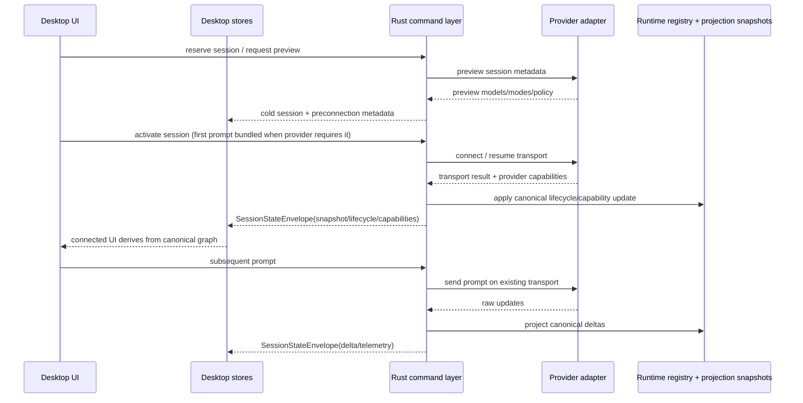
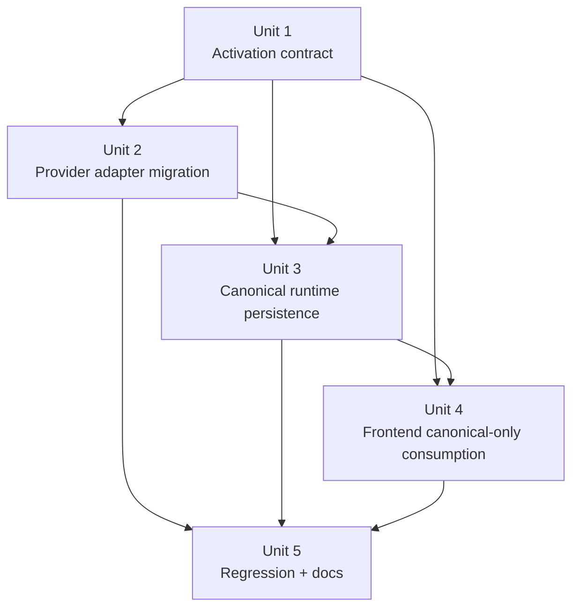
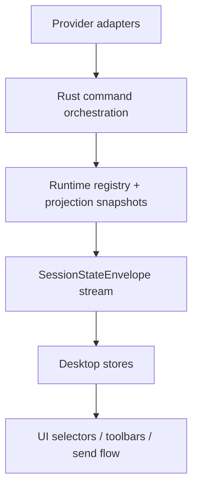

# refactor: Centralize canonical session lifecycle authority

> Superseded by `docs/plans/2026-04-25-002-refactor-final-god-architecture-stack-plan.md`. This plan remains as historical lifecycle-authority research; the final GOD stack is the active endpoint. Session identity closure is documented in `docs/solutions/architectural/provider-owned-session-identity-2026-04-27.md`.

## Overview

Migrate Acepe's session connection lifecycle onto one backend-owned canonical path so providers act as transport adapters, the backend owns lifecycle/capability **activation**, and the frontend trusts only canonical session-state envelopes.

This plan is driven by two facts:

1. the concept docs already define that intended architecture, and
2. the current Copilot deferred first-prompt path proves the code still has a split-brain seam.

## Problem Frame

Acepe's concept docs define a single durable authority path:

`provider signal -> backend projection -> canonical session graph -> desktop stores -> UI selectors`

Current code still violates that intent in one critical place: `packages/desktop/src-tauri/src/acp/client/cc_sdk_client.rs` lets a newly created session connect implicitly inside `send_prompt_fire_and_forget()`. That path streams the first turn successfully, but it bypasses the canonical lifecycle activation path used by `acp_resume_session`. The runtime registry therefore never records `ready`, checkpointed runtime remains `idle`, and the frontend later hydrates a disconnected-looking canonical session.

That bug is the symptom. The deeper architectural issue is that session lifecycle responsibility is still split across:

- provider clients that sometimes self-connect a transport,
- Rust command handlers that sometimes own lifecycle publication,
- frontend code that still consumes preview data and hot-state to behave "connected enough."

This overhaul removes that ambiguity so create, first prompt, resume, reconnect, and fork all speak the same lifecycle model.

The cost of inaction is not just architectural drift. The current seam produces user-visible breakage: a session can answer the first message, then later hydrate as disconnected, lose connection status plus model/mode controls, and fail the second send by taking an unnecessary reconnect path.

## Requirements Trace

### Backend lifecycle authority

- R1. All session entry flows (`new`, first prompt, `resume`, `reconnect`, `fork`) must activate lifecycle and capabilities through one backend-owned canonical path.
- R2. Provider-specific policy and identity may remain at the adapter edge, but provider clients must not be the durable authority for session lifecycle truth.

### Frontend consumption

- R3. Frontend connection status, model/mode availability, and reconnect behavior must derive from canonical session-state envelopes and persisted runtime snapshots only.
- R4. Reopen, reconnect, refresh, and second-message flows must restore from canonical state first and persist enough runtime/capability state to continue without guessing.

### Architectural invariants

- R5. The migration must preserve Acepe's agent-agnostic architecture: shared UI/store code must not grow provider-specific reconnect or lifecycle branches.

### Verification

- R6. Regression coverage must prove the architecture, especially for brand-new sessions whose first prompt performs transport connection.

## Scope Boundaries

- This plan does **not** redesign transcript, operation, or interaction concepts beyond the lifecycle/activation seams they depend on.
- This plan does **not** add new end-user features; it changes ownership and invariants under existing flows.
- This plan does **not** solve unrelated streaming UX issues unless they are caused by the lifecycle authority migration.
- This plan does **not** require removing every provider-specific transport optimization; it requires moving authority for lifecycle truth out of those optimizations.

## Context & Research

### Relevant Code and Patterns

- `docs/concepts/session-graph.md` — canonical authority rule and runtime lifecycle ownership.
- `docs/concepts/reconnect-and-resume.md` — restore model and "what should not happen" guidance.
- `packages/desktop/src-tauri/src/acp/commands/session_commands.rs` — current canonical lifecycle emission path via `acp_resume_session` and `emit_lifecycle_event(...)`.
- `packages/desktop/src-tauri/src/acp/commands/client_ops.rs` — shared reconnect/session-client orchestration that the new activation path should reuse.
- `packages/desktop/src-tauri/src/acp/session_state_engine/runtime_registry.rs` — lifecycle is only promoted on `ConnectionComplete` / `ConnectionFailed`.
- `packages/desktop/src-tauri/src/acp/client/cc_sdk_client.rs` — current deferred first-prompt connect path and `pending_options` behavior; this is the known violating adapter.
- `packages/desktop/src-tauri/src/acp/client_trait.rs` — shared provider client contract that currently mixes preview, connect, and reconnect responsibilities.
- `packages/desktop/src-tauri/src/acp/client/session_lifecycle.rs` — generic ACP client lifecycle path; useful baseline for eager connect behavior.
- `packages/desktop/src-tauri/src/acp/client/codex_native_client.rs` — eager `new_session()` / `resume_session()` path that already opens the underlying thread during session creation.
- `packages/desktop/src-tauri/src/acp/opencode/http_client/agent_client_impl.rs` — OpenCode eager session creation/resume path that does not use cc-sdk's deferred first-prompt cache.
- `packages/desktop/src-tauri/src/acp/provider.rs` — provider capability/policy seam where activation requirements should remain typed rather than inferred in UI code.
- `packages/desktop/src-tauri/src/acp/commands/interaction_commands.rs` — prompt send path that currently assumes a ready client already exists.
- `packages/desktop/src/lib/acp/store/session-event-service.svelte.ts` — canonical connection waiter already expects canonical session-state envelopes, not raw updates.
- `packages/desktop/src/lib/acp/store/session-store.svelte.ts` — frontend lifecycle application and disconnect-on-idle behavior.
- `packages/desktop/src/lib/acp/store/services/session-connection-manager.ts` — current create/connect/reconnect orchestration split between preview state and canonical ready state.
- `packages/desktop/src-tauri/src/db/repository.rs` — projection/transcript snapshot persistence.
- `packages/desktop/src-tauri/src/history/commands/session_loading.rs` — existing canonical "materialization" terminology for transcript/projection persistence; the new lifecycle-connect concept must avoid colliding with this name.

### Institutional Learnings

- `docs/solutions/architectural/revisioned-session-graph-authority-2026-04-20.md` — revisioned session graph must be the only product-state authority.
- `docs/solutions/architectural/provider-owned-semantic-tool-pipeline-2026-04-18.md` — provider-specific meaning belongs at the edge, but shared wire/product contracts are produced once.
- `docs/solutions/best-practices/provider-owned-policy-and-identity-not-ui-projections-2026-04-09.md` — shared code should consume typed provider metadata and identity, not infer policy from UI-facing projections.

### External References

- None. Local concept docs and current code paths are sufficiently specific for this plan.

## Key Technical Decisions

| Decision | Rationale |
| --- | --- |
| Introduce an explicit backend **session activation** stage distinct from session reservation/preview. | Today `new_session()` and deferred first-prompt connect blur "session exists" and "session is canonically connected." Splitting those stages makes lifecycle truth explicit and portable across providers while avoiding confusion with the existing `session_loading.rs` materialization terminology. |
| Make `acp_new_session` the reservation/preview command and add a new frontend-facing `acp_activate_session` command backed by a shared Rust activation helper. | This resolves the load-bearing API boundary at planning time. `acp_send_prompt` should stop activating implicitly; activation becomes an explicit step that can optionally carry the first prompt payload. |
| Keep provider adapters responsible for transport operations, preview metadata, provider identity policy, and provider-specific resume/load semantics — but not canonical lifecycle publication. | This preserves agent-agnostic boundaries while preventing providers from becoming hidden product-state authorities. |
| Route first-prompt connection through the same lifecycle activation pipeline as resume/reconnect instead of allowing provider clients to self-connect without canonical publication. | The current Copilot bug exists because the first-prompt path bypasses `ConnectionComplete`. The architecture fix is to remove the bypass, not teach the frontend to tolerate it. |
| Treat preview capabilities from `new_session()` as preconnection data only. Frontend "connected" state begins only when canonical lifecycle reaches `ready`. | This removes optimistic connectedness as a second authority path and aligns the desktop with the concept docs' restore model. |
| Persist runtime lifecycle and capability envelopes uniformly across create-first-prompt, resume, reconnect, and fork. | Reopen/refresh must not care which entry path created the live transport; the stored runtime contract must be identical. |
| Enforce the authority invariant structurally at the command boundary: provider clients may return preview/resume data, but only the shared activation orchestrator publishes `ConnectionComplete` / `ConnectionFailed`. | This replaces an unverifiable "no hidden code paths" aspiration with a concrete rule that can be enforced by API shape, tests, and module ownership. |

## Open Questions

### Resolved During Planning

- **Should providers become completely passive?** No. They still own provider-specific transport behavior, identity policy, preview capabilities, and reconnect semantics. The change is that lifecycle truth is promoted and persisted by shared backend orchestration.
- **Must the "connect with initial prompt" optimization disappear?** Not necessarily. It may remain as an adapter capability, but it must execute inside the backend activation pipeline so canonical lifecycle reaches `connecting`/`ready` before the frontend treats the session as live.
- **What is the clean contract shape?** `acp_new_session` remains reservation/preview only. A new `acp_activate_session` command owns initial transport activation and canonical lifecycle publication. `acp_resume_session` and fork flows should reuse the same shared Rust activation helper rather than inventing parallel lifecycle publication paths.
- **What happens when activation is called without a prompt?** For newly reserved sessions, activation without an initial prompt is valid only when the provider declares promptless eager-connect support. Deferred-first-prompt providers such as cc-sdk require the first prompt to be bundled into activation. Resume/reconnect/fork activation may remain promptless because those flows restore an already identified session.
- **Do non-cc-sdk providers need the same behavioral migration?** Current repo evidence says no. `codex_native_client.rs` and `opencode/http_client/agent_client_impl.rs` already open or bind their provider session during `new_session()` / `resume_session()`, so Unit 2 should treat them as contract-conformance consumers unless deeper audit reveals hidden lifecycle publication paths elsewhere.
- **Should the frontend special-case `idle + canReconnect` as connected?** No. That would preserve split authority instead of removing it.

### Deferred to Implementation

- Whether preview capabilities should be modeled as a separate response type or remain on `NewSessionResponse` with stricter frontend semantics.
- Exact Rust helper/type names for the reservation/activation split after the command boundary is settled.
- Whether to encode `ReservedSession` -> `ActivatedSession` as distinct Rust types in this migration or reserve that compile-time enforcement as a follow-up once the runtime contract stabilizes.
- Whether reserved-but-never-activated sessions need expiry/cleanup semantics beyond current session-list behavior.

## High-Level Technical Design

> *This illustrates the intended approach and is directional guidance for review, not implementation specification. The implementing agent should treat it as context, not code to reproduce.*

## Alternative Approaches Considered

| Approach | Why not chosen |
| --- | --- |
| Patch the frontend to keep `idle` sessions looking connected. | Hides the split-brain bug and weakens the concept-doc authority model. |
| Emit a Copilot-only synthetic `ConnectionComplete` from `cc_sdk_client.rs` without changing the broader contract. | Better than the status quo, but still leaves provider clients as ad hoc lifecycle publishers and does not fix the architecture for other providers or future flows. |
| Keep current reservation/preview behavior and allow shared frontend code to infer "connected enough" from `new_session()` results. | Reintroduces a second read-side authority and keeps reconnect/refresh behavior provider-path dependent. |
| Encode `ReservedSession` and `ActivatedSession` as distinct Rust types from the start. | This is likely the cleanest long-term enforcement, but the immediate migration already requires command-boundary and trait reshaping across heterogeneous provider clients. The plan keeps this as a possible follow-up once the shared activation contract is stabilized. |

## Success Metrics

- A brand-new session that connects on first prompt persists canonical `ready` lifecycle and capability state before any later refresh/reopen/reconnect path consumes it.
- The same reconnect/resume UI logic works for create-first-prompt, resume, reconnect, and fork flows without provider-specific frontend branches.
- Session toolbars, model selectors, mode selectors, and second-message send behavior derive only from canonical state.
- First-prompt activation latency (time from send to first token delivery) is not measurably worse than the current cc-sdk deferred-connect baseline.
- `ConnectionComplete` / `ConnectionFailed` publication is emitted only by the shared backend activation orchestrator, not directly by provider adapters.

## Implementation Units

- [ ] **Unit 1: Introduce backend-owned session activation**

**Goal:** Create one shared backend path that owns lifecycle/capability activation for create-first-prompt, resume, reconnect, and fork.

**Requirements:** R1, R2, R4, R5

**Dependencies:** None

**Files:**
- Modify: `packages/desktop/src-tauri/src/acp/client_trait.rs`
- Modify: `packages/desktop/src-tauri/src/acp/commands/client_ops.rs`
- Modify: `packages/desktop/src-tauri/src/acp/commands/session_commands.rs`
- Modify: `packages/desktop/src-tauri/src/acp/commands/interaction_commands.rs`
- Modify: `packages/desktop/src-tauri/src/acp/types.rs`
- Test: `packages/desktop/src-tauri/src/acp/commands/tests.rs`

**Approach:**
- Define a clear split between **reservation/preview** and **activation/connect**.
- Add a new frontend-facing `acp_activate_session` command backed by a shared Rust activation helper reused by `acp_resume_session` and fork flows.
- Move lifecycle publication responsibility to the command layer so every successful connection flows through the same canonical `ConnectionComplete` / `ConnectionFailed` path.
- Ensure `acp_send_prompt` never activates implicitly. Newly reserved sessions must be activated first, with the first prompt bundled when the provider requires deferred-first-prompt transport semantics.
- Document idempotency and per-session concurrency rules in the activation helper so repeated or parallel activation attempts do not emit duplicate lifecycle events or cross-session runtime state.

**Execution note:** Start with a failing characterization test for a brand-new session whose first prompt currently leaves runtime checkpoint state at `idle`.

**Patterns to follow:**
- `packages/desktop/src-tauri/src/acp/commands/session_commands.rs` `acp_resume_session(...)`
- `packages/desktop/src-tauri/src/acp/commands/session_commands.rs` `emit_lifecycle_event(...)`

**Test scenarios:**
- Happy path — reserving a new session then activating it with an initial prompt produces canonical `ready` lifecycle plus non-empty capabilities for that session.
- Happy path — resume and reconnect still emit canonical `ConnectionComplete` through the same shared activation path.
- Error path — transport connect failure emits canonical `ConnectionFailed` and leaves no stale `ready` runtime snapshot behind.
- Edge case — first-prompt activation preserves launch-mode/autonomous intent instead of dropping it during the reservation-to-connect handoff.
- Edge case — activating an already-connecting or already-ready session returns the existing lifecycle state without opening a second transport or emitting duplicate `ConnectionComplete`.
- Edge case — two sessions activate concurrently and each produces correctly keyed lifecycle state in the runtime registry without interleaving.
- Integration — activation with an initial prompt persists checkpointable runtime state that matches the envelope delivered to the frontend.
- Verification — first-prompt activation latency remains within the accepted baseline budget relative to the current cc-sdk deferred-connect flow.

**Verification:**
- No session entry flow reaches a live transport without shared backend lifecycle publication.

- [ ] **Unit 2: Reduce provider clients to transport and preview responsibilities**

**Goal:** Make provider adapters conform to the new reservation/activation boundary without owning durable lifecycle truth.

**Requirements:** R1, R2, R5

**Dependencies:** Unit 1

**Files:**
- Modify: `packages/desktop/src-tauri/src/acp/provider.rs`
- Modify: `packages/desktop/src-tauri/src/acp/client/cc_sdk_client.rs`
- Modify: `packages/desktop/src-tauri/src/acp/client/codex_native_client.rs`
- Modify: `packages/desktop/src-tauri/src/acp/client/session_lifecycle.rs`
- Modify: `packages/desktop/src-tauri/src/acp/opencode/http_client/agent_client_impl.rs`
- Modify: `packages/desktop/src-tauri/src/acp/client/tests.rs`

**Approach:**
- Keep provider-specific policy, identity, preview-capability discovery, and provider-native resume/load behavior behind typed adapter contracts.
- Remove or isolate any adapter path that implicitly turns preview state into durable lifecycle state.
- For cc-sdk specifically, eliminate the hidden "connect inside `send_prompt_fire_and_forget()` without canonical publication" authority path.
- Treat Codex and OpenCode as conformance consumers of the new contract, not as root-cause migrations, because their `new_session()` / `resume_session()` paths already connect eagerly today.

**Execution note:** Implement test-first around cc-sdk because it currently proves the contract violation; then update other adapters only as needed to satisfy the same contract without widening frontend branches.

**Patterns to follow:**
- `docs/solutions/best-practices/provider-owned-policy-and-identity-not-ui-projections-2026-04-09.md`
- `docs/solutions/architectural/provider-owned-semantic-tool-pipeline-2026-04-18.md`

**Test scenarios:**
- Happy path — cc-sdk new-session preview remains available before connect, but canonical ready state is absent until backend activation runs.
- Happy path — provider-owned reconnect/load semantics still resolve through typed provider policy rather than UI-facing metadata.
- Error path — adapters that cannot activate a saved session surface provider-specific transport failure, but shared lifecycle state still flows through canonical failure publication.
- Edge case — providers that keep a "connect with initial prompt" optimization do so without bypassing the backend activation contract.
- Integration — all concrete provider clients compile against the same reservation/activation boundary without requiring provider-specific frontend handling.

**Verification:**
- Provider clients no longer publish canonical lifecycle state directly; they feed transport facts into the shared activation path.

- [ ] **Unit 3: Make runtime persistence and restore invariant across entry paths**

**Goal:** Ensure projection snapshots and restore flows persist the same runtime/capability truth regardless of how a session first became live.

**Requirements:** R1, R3, R4, R6

**Dependencies:** Units 1-2

**Files:**
- Modify: `packages/desktop/src-tauri/src/acp/session_state_engine/runtime_registry.rs`
- Modify: `packages/desktop/src-tauri/src/acp/commands/session_commands.rs`
- Modify: `packages/desktop/src-tauri/src/acp/ui_event_dispatcher.rs`
- Modify: `packages/desktop/src-tauri/src/db/repository.rs`
- Modify: `packages/desktop/src-tauri/src/history/commands/session_loading.rs`
- Test: `packages/desktop/src-tauri/src/acp/commands/tests.rs`
- Test: `packages/desktop/src-tauri/src/db/repository_test.rs`

**Approach:**
- Tighten the invariant that persisted `SessionProjectionSnapshot.runtime` reflects the last canonical lifecycle/capability state, not whichever entry path happened to touch the transport.
- Verify reopen/refresh/open paths restore runtime from stored projection data first and only prefer live registry entries when they are newer canonical state.
- Remove any path where checkpointing can persist default `idle` runtime purely because lifecycle publication was skipped earlier.
- Keep the existing `session_loading.rs` "materialization" terminology scoped to canonical transcript/projection persistence; lifecycle activation should not reuse that name.

**Patterns to follow:**
- `docs/concepts/reconnect-and-resume.md`
- `docs/solutions/architectural/revisioned-session-graph-authority-2026-04-20.md`

**Test scenarios:**
- Happy path — a newly activated session that completed its first turn stores `ready` runtime lifecycle in projection snapshots and reopens as connected-capable state.
- Happy path — refresh/open prefers live runtime when newer, otherwise stored runtime, without losing capabilities.
- Error path — failed activation checkpoints canonical error lifecycle rather than silently reverting to default `idle`.
- Edge case — sessions with no live registry entry but valid stored runtime still reopen with the correct canonical lifecycle and capabilities.
- Integration — second-message send after reopen/refresh reuses canonical ready state instead of forcing reconnect for a session that should still be live-capable.

**Verification:**
- Stored runtime state is path-independent: create-first-prompt, resume, reconnect, and fork produce the same restore semantics.

- [ ] **Unit 4: Make desktop connection UX consume canonical state only**

**Goal:** Remove optimistic or preview-shaped frontend connectedness so connection waiters, toolbars, and reconnect behavior all follow canonical state.

**Requirements:** R3, R4, R5, R6

**Dependencies:** Units 1-3

**Files:**
- Modify: `packages/desktop/src/lib/acp/store/session-event-service.svelte.ts`
- Modify: `packages/desktop/src/lib/acp/store/services/session-connection-manager.ts`
- Modify: `packages/desktop/src/lib/acp/store/session-store.svelte.ts`
- Modify: `packages/desktop/src/lib/acp/store/session-connection-service.svelte.ts`
- Modify: `packages/desktop/src/lib/acp/store/__tests__/session-store-create-session.vitest.ts`
- Modify: `packages/desktop/src/lib/acp/store/__tests__/session-event-service-streaming.vitest.ts`
- Test: `packages/desktop/src/lib/acp/store/__tests__/session-store-projection-state.vitest.ts`
- Test: `packages/desktop/src/lib/acp/store/services/session-connection-manager.test.ts`

**Approach:**
- Reframe `newSession` results as preconnection preview data, not proof of a live connection.
- Keep connection waiters centered on canonical envelopes; raw updates may coordinate buffering/observability but must not decide durable connectedness.
- Ensure model/mode controls, connection status, and send behavior reflect canonical lifecycle and persisted runtime capability state only.

**Patterns to follow:**
- `packages/desktop/src/lib/acp/store/session-event-service.svelte.ts` canonical connection waiter
- `docs/concepts/session-graph.md`

**Test scenarios:**
- Happy path — after first-prompt activation, toolbar status/model/mode controls become available from canonical ready state.
- Happy path — second send on a canonically ready session does not invoke reconnect.
- Error path — canonical error lifecycle disables live controls and surfaces reconnect affordances without relying on preview caches.
- Edge case — preview metadata for a reserved but not activated session does not cause the desktop to treat the session as connected.
- Integration — reopen/refresh hydration plus subsequent send uses canonical runtime state consistently across store, connection service, and input UI.

**Verification:**
- Desktop connection UX has no separate "connected enough" path outside canonical envelopes and graph-derived UI state.

- [ ] **Unit 5: Lock the architecture with regression coverage and doc alignment**

**Goal:** Encode the new authority boundary in tests and durable docs so later provider work cannot reintroduce split lifecycle ownership.

**Requirements:** R1, R2, R3, R4, R5, R6

**Dependencies:** Units 2-4

**Files:**
- Modify: `docs/concepts/reconnect-and-resume.md`
- Modify: `docs/concepts/session-graph.md`
- Modify: `packages/desktop/src-tauri/src/acp/commands/tests.rs`
- Modify: `packages/desktop/src-tauri/src/acp/client/tests.rs`
- Modify: `packages/desktop/src/lib/acp/store/__tests__/session-store-projection-state.vitest.ts`
- Modify: `packages/desktop/src/lib/acp/store/services/session-connection-manager.test.ts`
- Modify: `packages/desktop/src/lib/acp/store/__tests__/session-event-service-streaming.vitest.ts`

**Approach:**
- Add regression coverage that names the architectural invariant, not just the Copilot symptom.
- Update concept docs only where wording needs to distinguish reservation/preview from activation explicitly; code should otherwise move to match existing docs.
- Because the repo does not currently expose a single Rust+desktop integration harness for this seam, lock the behavior with paired contract tests: Rust command/client tests prove activation + checkpoint envelopes, and desktop store tests prove hydration + second-send semantics.
- Prefer tests that prove the backend and frontend each uphold their half of the authority contract.

**Patterns to follow:**
- `docs/solutions/architectural/revisioned-session-graph-authority-2026-04-20.md`
- existing canonical-state regression suites under `packages/desktop/src/lib/acp/store/__tests__/`

**Test scenarios:**
- Happy path — create-first-prompt, resume, reconnect, and fork all satisfy the same canonical lifecycle progression contract.
- Error path — activation failure never leaves stale ready runtime or preview-shaped connectedness in either backend snapshots or frontend stores.
- Edge case — provider-specific transport optimizations cannot publish durable lifecycle truth without going through backend canonical publication.
- Integration — a session reopened from stored projection snapshot exposes the same model/mode/send affordances as one that remained live continuously.

**Verification:**
- The architecture is defended by regression tests and concept docs that make split lifecycle ownership an explicit failure, not an accidental regression.

## System-Wide Impact

- **Interaction graph:** `acp_activate_session`, `acp_resume_session`, prompt send, session open/refresh, and frontend connection waiters all converge on the same lifecycle activation contract.
- **Error propagation:** connect/activation failures should become canonical `ConnectionFailed` lifecycle state before the desktop decides anything about reconnect UX.
- **State lifecycle risks:** reservation state, preview capabilities, live runtime, and persisted runtime snapshots must remain distinct; merging them loosely is what caused the current split-brain bug.
- **API surface parity:** `AgentClient` contract changes affect all provider implementations and every frontend call path that currently assumes `newSession` implies a live transport.
- **Integration coverage:** because there is no single existing Rust+desktop harness for this seam, the coverage strategy must pair backend contract tests with desktop store tests plus targeted manual Tauri QA for create-first-prompt and second-send flows.
- **Unchanged invariants:** operation/interactions/transcript authority stays canonical; this plan changes lifecycle ownership boundaries, not the higher-level session graph model.

## Risks & Dependencies

| Risk | Mitigation |
| --- | --- |
| Trait changes ripple across multiple provider clients and break unrelated adapters. | Land the reservation/activation split behind a narrow shared contract first, then adapt providers against that contract with compile-driven feedback and focused client tests. |
| Preview-model UX regresses while removing optimistic connectedness. | Keep preview metadata available as preconnection state and explicitly distinguish it from canonical ready state in the desktop stores. |
| Create-first-prompt optimization regresses latency if moved carelessly. | Preserve the ability to pass the first prompt into transport connect, but route it through the shared backend activation pipeline and measure regression against the existing baseline. |
| Restore semantics diverge between live runtime and stored snapshots. | Make runtime snapshot persistence a tested invariant across create, resume, reconnect, and fork. |
| Migration is treated as Copilot-specific and reintroduces provider branches in shared code. | Express all shared changes in provider-neutral terms and keep provider-specific behavior behind typed adapter contracts and provider metadata. |

## Phased Delivery

### Phase 1
- Define the shared activation contract and move first-prompt lifecycle publication into backend orchestration.

### Phase 2
- Adapt provider clients and runtime persistence to the new contract.

### Phase 3
- Remove optimistic frontend connectedness and complete regression/doc hardening.

## Documentation / Operational Notes

- If implementation changes the meaning of "new session" versus "activated session," update concept docs so the distinction is explicit and portable.
- The rollout should favor invariants over partial coexistence: once the canonical activation path exists, old bypass paths should be removed rather than left in parallel.
- This plan should be followed by `/document-review` before `/ce:work`, and execution should start with failing characterization tests around the create-first-prompt seam.

## Sources & References

- Related docs: `docs/concepts/README.md`
- Related docs: `docs/concepts/session-graph.md`
- Related docs: `docs/concepts/reconnect-and-resume.md`
- Related docs: `docs/solutions/architectural/revisioned-session-graph-authority-2026-04-20.md`
- Related docs: `docs/solutions/architectural/provider-owned-semantic-tool-pipeline-2026-04-18.md`
- Related docs: `docs/solutions/best-practices/provider-owned-policy-and-identity-not-ui-projections-2026-04-09.md`
- Related code: `packages/desktop/src-tauri/src/acp/commands/session_commands.rs`
- Related code: `packages/desktop/src-tauri/src/acp/commands/client_ops.rs`
- Related code: `packages/desktop/src-tauri/src/acp/client/cc_sdk_client.rs`
- Related code: `packages/desktop/src-tauri/src/acp/client/codex_native_client.rs`
- Related code: `packages/desktop/src-tauri/src/acp/opencode/http_client/agent_client_impl.rs`
- Related code: `packages/desktop/src-tauri/src/acp/client/session_lifecycle.rs`
- Related code: `packages/desktop/src/lib/acp/store/session-event-service.svelte.ts`
- Related code: `packages/desktop/src/lib/acp/store/session-store.svelte.ts`
