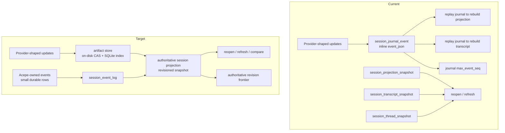
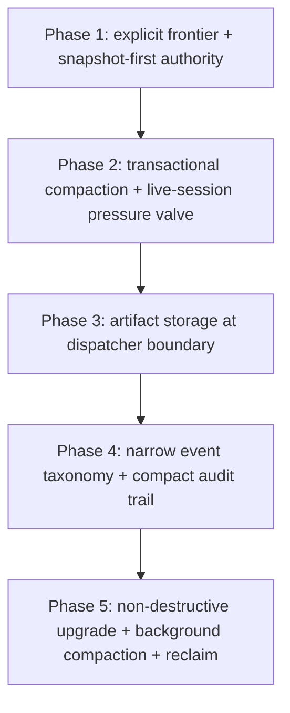
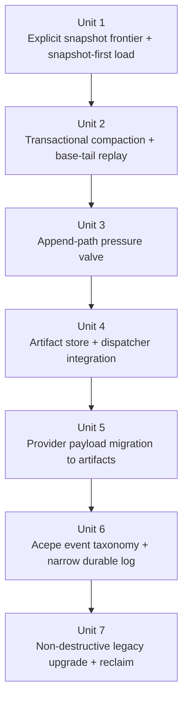
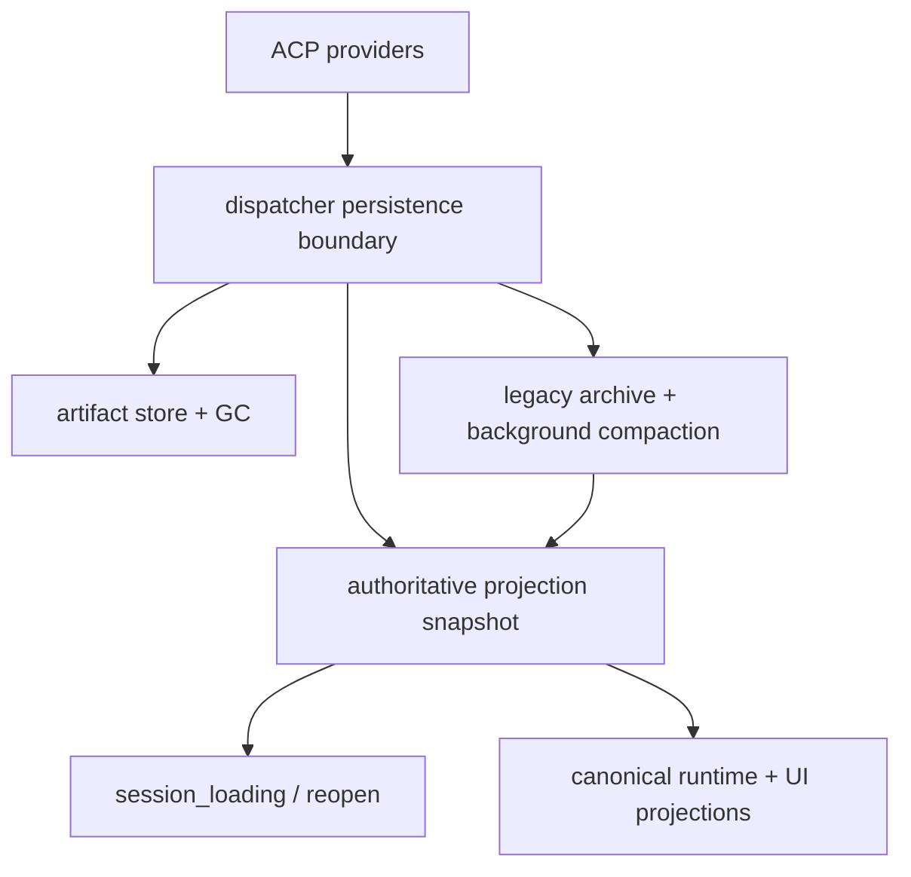

# Refactor session storage around authoritative projections and artifact-backed history

## Overview

Acepe's current ACP persistence model mixes three different concerns in one growth path:

1. durable Acepe product state,
2. replay metadata and revision tracking,
3. provider-shaped payload exhaust such as tool outputs and large serialized updates.

That design produced a catastrophic real-world failure: `session_journal_event` grew to 22 GB in under two weeks on an actively used machine, pushing the root volume to 1.7 GiB free and forcing manual database deletion.

This plan replaces the current "append everything forever" posture with a two-horizon architecture:

- **Horizon 1 — containment in the current model:** make runaway growth impossible in the existing SQLite layout through compaction, explicit revision tracking, append-path pressure valves for live sessions, and reclaim-friendly SQLite settings.
- **Horizon 2 — clean authority model:** move Acepe toward a stricter storage boundary where the authoritative session state is a single revisioned projection, Acepe-owned events stay small, and large provider payloads are stored in a content-addressed artifact store by reference rather than inline journal rows.

The target is not merely a smaller database. The target is a persistence architecture where multi-megabyte journal rows are structurally impossible.

## Problem Frame

The current persistence contract was introduced during the canonical runtime rollout and correctly moved authority away from frontend reconstruction and toward Rust-owned projections. That direction is sound.

What is not sound is the storage boundary chosen for the journal:

- `SessionJournalEventPayload::ProjectionUpdate` persists provider-shaped delta payloads inline in `session_journal_event`.
- `load_projection_from_journal(...)` and `load_transcript_from_journal(...)` replay those rows to rebuild state when snapshots are absent or stale.
- `SessionProjectionSnapshot`, `SessionTranscriptSnapshot`, and `SessionThreadSnapshot` all exist as overlapping persisted shapes, but none currently compacts the journal rows that created them.
- `SessionJournalEventRepository::max_event_seq(...)` treats the journal as the sole revision frontier, so retention is tightly coupled to correctness.
- SQLite reclaim is not configured, so even successful deletions would not be enough on their own.

The failure mode is therefore architectural, not incidental:

- large provider payloads are allowed into the same append-only table as durable state transitions,
- the journal has no retention contract,
- the authority model incentivizes keeping every delta forever,
- the database has no reclaim strategy.

## Requirements Trace

- R1. No Acepe session database may grow without an explicit architectural bound; multi-gigabyte silent growth must be prevented by design rather than cleanup.
- R2. Reopen, restore, refresh, and revision comparisons must remain correct after introducing retention and compaction.
- R3. The persistence contract must preserve the architectural direction in `docs/solutions/architectural/revisioned-session-graph-authority-2026-04-20.md`: one durable product-state authority.
- R4. Large provider payloads must no longer be stored inline in relational event rows once the structural migration lands.
- R5. Existing user databases must have a forward migration path that shrinks retained data instead of requiring manual deletion.
- R6. The plan must leave Acepe with explicit retention rules for every growth-bearing store involved in session persistence.

## Scope Boundaries

- This plan does not redesign the live ACP runtime protocol itself.
- This plan does not remove canonical projections or move authority back to the frontend.
- This plan does not attempt to compress every persisted blob in the application; it only touches session persistence surfaces implicated in the failure.
- This plan does not require provider-side API changes.
- This plan does not require eliminating all JSON storage immediately; it narrows where JSON is allowed and what kinds of data may live there.

## Context & Research

### Relevant Code and Patterns

- `packages/desktop/src-tauri/src/acp/session_journal.rs`
  - `SessionJournalEventPayload::ProjectionUpdate` currently stores replayable provider-shaped deltas.
  - `load_projection_from_journal(...)` and `load_transcript_from_journal(...)` rebuild state from the journal.
- `packages/desktop/src-tauri/src/db/repository.rs`
  - `SessionJournalEventRepository::append_session_update(...)` persists inline `ProjectionUpdate` rows.
  - `SessionJournalEventRepository::max_event_seq(...)` uses the journal as the sole revision frontier.
  - `SessionProjectionSnapshotRepository::set(...)` stores snapshot JSON but does not compact the journal.
- `packages/desktop/src-tauri/src/acp/ui_event_dispatcher.rs`
  - `dispatch_persistence_effects_inner(...)` is the actual live-session interception point where session updates are persisted.
- `packages/desktop/src-tauri/src/acp/session_open_snapshot/mod.rs`
  - open-time persistence is a secondary append/materialization path that must obey the same storage rules.
- `packages/desktop/src-tauri/src/history/commands/session_loading.rs`
  - staleness checks compare snapshot revision/frontier against `journal_max`.
  - lazy-upgrade materialization assumes the journal remains available as a replay source.
- `packages/desktop/src-tauri/src/db/mod.rs`
  - `init_db()` is the place where SQLite connect options, reclaim settings, and startup migration behavior are actually wired.
- `packages/desktop/src-tauri/src/db/migrations/m20260408_000001_create_session_projection_snapshots.rs`
- `packages/desktop/src-tauri/src/db/migrations/m20260408_000002_create_session_journal_events.rs`
- `packages/desktop/src-tauri/src/db/migrations/m20260416_000001_create_session_thread_snapshots.rs`
- `packages/desktop/src-tauri/src/db/migrations/m20260416_000002_create_transcript_snapshots.rs`
- `packages/desktop/src-tauri/src/db/repository_test.rs`
- `packages/desktop/src-tauri/src/history/commands/session_loading.rs` test module

### Institutional Learnings

- `docs/solutions/architectural/revisioned-session-graph-authority-2026-04-20.md`
  - the revisioned session graph should be the only durable product-state authority.
- `docs/solutions/architectural/provider-owned-semantic-tool-pipeline-2026-04-18.md`
  - provider-owned semantics should stay at provider boundaries and be projected once into stable Acepe-owned shapes.
- `docs/solutions/best-practices/provider-owned-policy-and-identity-not-ui-projections-2026-04-09.md`
  - ownership boundaries should live with the component that genuinely owns them, not in downstream presentation projections.

### External References

- None required for the architectural direction. The codebase and recent architectural docs already establish the relevant local intent.

## Key Technical Decisions

| Decision | Why |
|---|---|
| Make `SessionProjectionSnapshot` the explicit durable authority for current session state, and invert load priority to snapshot-first | Matches current architectural direction and prevents compacted journal tails from re-taking authority on reopen |
| Introduce an explicit revision frontier on both projection and transcript materializations instead of deriving freshness only from journal rows | Lets compaction preserve correctness without revision regression or split-brain stale checks |
| Keep a small Acepe-owned event log, but narrow it to durable product events and replay metadata only | Preserves auditability and state transitions without treating provider exhaust as first-class relational data |
| Store large provider payloads in an on-disk content-addressed artifact store indexed by SQLite metadata | Keeps multi-MB payloads out of SQLite row/WAL growth, preserves dedupe, and makes large-content GC explicit |
| Make live-session protection append-path driven at the dispatcher boundary, not open-time only | Long-lived active sessions caused the incident; open-time compaction alone is insufficient |
| Use non-destructive upgrade first, with archived legacy rows and background compaction instead of startup-blocking destructive migration | Protects user trust on disk-full / partially corrupted installs and avoids multi-minute startup stalls |
| Add immediate containment before full architecture migration | Existing installs need protection now; the clean model should not block shipping the fix |

## Open Questions

### Resolved During Planning

- **Should the journal be deleted entirely?** No. Acepe still benefits from a small durable event log for interaction transitions, barriers, checkpoints, and other Acepe-owned facts.
- **Should the fix be "just compress SQLite" or "just vacuum more"?** No. Reclaim settings are necessary but not sufficient; the real issue is what the schema allows into the journal.
- **Should provider payloads remain replayable from relational rows forever?** No. The authoritative rebuild path should be projection-first, with artifacts referenced as needed instead of inlined as journal rows.
- **Should this be a one-shot big-bang migration?** No. The plan deliberately stages containment first, then structural cleanup.
- **Which payload store should the clean architecture use?** On-disk content-addressed artifacts under app support, with SQLite metadata/index rows for references, ownership, and GC eligibility.
- **What is the authoritative load order after the fix?** `SessionProjectionSnapshot` first, then compacted tail replay on top of that base, with thread snapshot as an import/recovery path rather than a higher-priority authority.
- **What remains queryable in the durable event log?** Acepe-owned product facts only: interaction transitions, permission decisions, checkpoints, mode/config transitions, and compact tool audit summaries needed for reviewability. Large tool outputs, streamed content, and provider-exhaust payloads move to artifacts.

### Deferred to Implementation

- Exact byte thresholds for per-event caps and forced materialization. The plan defines the mechanism and guardrails; implementation should tune the values once representative event sizes are measured in tests.
- Whether transcript and thread snapshots should collapse into one persisted read model immediately or in a follow-up. The plan moves authority to the projection first and leaves optional further consolidation as a deliberate follow-up if it would otherwise destabilize the migration.

## High-Level Technical Design

> *This illustrates the intended approach and is directional guidance for review, not implementation specification. The implementing agent should treat it as context, not code to reproduce.*

### Current vs target authority model

### Planned migration shape

## Alternative Approaches Considered

| Approach | Why not chosen |
|---|---|
| Keep current schema and add only `VACUUM` / `auto_vacuum` | Reclaims holes but does not stop future multi-GB growth |
| Keep journaling everything forever, but zstd-compress `event_json` | Reduces bytes, but preserves the wrong ownership boundary and allows unbounded relational growth |
| Drop the journal entirely and rely only on snapshots | Loses durable event semantics that Acepe still benefits from and makes some transitions harder to audit |
| Fetch provider history on demand as the primary authority | Pushes product correctness onto external history APIs and weakens Acepe's own durable model |

## Implementation Units

- [ ] **Unit 1: Make the snapshot bundle own the durable frontier and load order**

**Goal:** Establish a durable revision authority outside the journal so retention can become correctness-safe.

**Requirements:** R1, R2, R3, R6

**Dependencies:** None

**Files:**
- Modify: `packages/desktop/src-tauri/src/db/entities/session_projection_snapshot.rs`
- Modify: `packages/desktop/src-tauri/src/db/entities/session_transcript_snapshot.rs`
- Modify: `packages/desktop/src-tauri/src/db/repository.rs`
- Modify: `packages/desktop/src-tauri/src/acp/session_journal.rs`
- Modify: `packages/desktop/src-tauri/src/history/commands/session_loading.rs`
- Create: `packages/desktop/src-tauri/src/db/migrations/m20260421_000001_add_projection_snapshot_frontier.rs`
- Test: `packages/desktop/src-tauri/src/db/repository_test.rs`
- Test: `packages/desktop/src-tauri/src/history/commands/session_loading.rs`

**Approach:**
- Add explicit frontier metadata to the persisted projection/transcript materialization bundle so the stored state declares its accepted revision without requiring the journal to remain complete forever.
- Invert `load_stored_projection(...)` to snapshot-first, then apply any compacted journal tail on top of that base state; thread snapshot becomes a recovery/import path, not a higher-priority authority.
- Replace stale-check reads that infer freshness only from embedded JSON or journal max with reads from the explicit persisted frontier.
- Preserve current JSON shape compatibility while making the row-level frontier the read-path authority.

**Execution note:** Start with characterization coverage around staleness detection and reopen behavior before changing revision reads.

**Patterns to follow:**
- `docs/solutions/architectural/revisioned-session-graph-authority-2026-04-20.md`
- `packages/desktop/src-tauri/src/history/commands/session_loading.rs`

**Test scenarios:**
- Happy path — when a projection snapshot is saved at revision `N`, reopening the session treats that snapshot as current even if earlier journal rows are later compacted.
- Edge case — when no snapshot exists yet, a fresh session still reports revision `0` / empty frontier behavior correctly.
- Error path — when the snapshot exists but metadata is missing or malformed after migration, open fails loudly instead of silently assuming a stale frontier.
- Integration — when `session_loading` compares cached transcript/projection state, it uses the stored persisted frontier rather than only `journal_max`, and snapshot-first load order remains stable even when a tail journal exists.

**Verification:**
- Revision comparisons no longer regress when old journal rows are removed.
- Reopen / restore logic can reason about freshness without requiring a full journal history, and the load path no longer lets journal-first replay reassert authority.

- [ ] **Unit 2: Compact projection journal rows transactionally and replay tails from a snapshot base**

**Goal:** Stop unbounded journal retention in the current schema by deleting projection rows that are already represented by the authoritative projection snapshot.

**Requirements:** R1, R2, R5, R6

**Dependencies:** Unit 1

**Files:**
- Modify: `packages/desktop/src-tauri/src/db/repository.rs`
- Modify: `packages/desktop/src-tauri/src/acp/session_journal.rs`
- Modify: `packages/desktop/src-tauri/src/history/commands/session_loading.rs`
- Create: `packages/desktop/src-tauri/src/db/migrations/m20260421_000002_add_journal_seq_uniqueness.rs`
- Test: `packages/desktop/src-tauri/src/db/repository_test.rs`
- Test: `packages/desktop/src-tauri/src/history/commands/session_loading.rs`

**Approach:**
- Make snapshot persistence, session metadata upsert, and projection-row compaction part of the same transactional boundary.
- Delete only `ProjectionUpdate` rows at or below the accepted snapshot frontier.
- Preserve `InteractionTransition`, `MaterializationBarrier`, and any other Acepe-owned durable facts.
- Ensure replay fallback semantics remain valid by treating the projection snapshot as the base state and the remaining compacted journal as incremental tail data applied to that base, never to an empty registry.
- Add a DB-level uniqueness constraint for `(session_id, event_seq)` so compaction boundaries are deterministic under concurrent appends.

**Execution note:** Implement new repository behavior test-first with integration-style repository tests that prove correctness after compaction.

**Patterns to follow:**
- `packages/desktop/src-tauri/src/db/repository.rs`
- `packages/desktop/src-tauri/src/acp/session_journal.rs`

**Test scenarios:**
- Happy path — after snapshot save at revision `N`, all `ProjectionUpdate` rows with `event_seq <= N` are removed while non-projection rows remain.
- Edge case — when concurrent updates append new journal rows during snapshot persistence, compaction removes only rows up to the captured frontier and leaves newer rows intact.
- Error path — if compaction fails after snapshot persistence begins, metadata, snapshots, and journal mutations all roll back together and leave no partial durable authority shift.
- Integration — deleting compacted rows does not break projection or transcript rebuilds because tail replay now starts from the stored snapshot base plus remaining rows.

**Verification:**
- Journal row count remains bounded by "unmaterialized tail" rather than "entire session lifetime".
- Reopen and stale-snapshot detection remain correct after compaction.

- [ ] **Unit 3: Add append-path oversize guards and forced materialization pressure valves**

**Goal:** Ensure the current architecture cannot admit multi-megabyte inline journal rows or unbounded pending tails even before the full artifact migration finishes.

**Requirements:** R1, R2, R6

**Dependencies:** Unit 2

**Files:**
- Modify: `packages/desktop/src-tauri/src/db/repository.rs`
- Modify: `packages/desktop/src-tauri/src/acp/session_journal.rs`
- Modify: `packages/desktop/src-tauri/src/acp/ui_event_dispatcher.rs`
- Modify: `packages/desktop/src-tauri/src/acp/session_open_snapshot/mod.rs`
- Test: `packages/desktop/src-tauri/src/db/repository_test.rs`
- Test: `packages/desktop/src-tauri/src/acp/session_journal.rs`

**Approach:**
- Enforce a hard maximum inline payload size for journal rows that remain in the current schema.
- Add a per-session tail budget based on row count and byte budget; exceeding the budget at the dispatcher append boundary triggers immediate materialization and tail compaction.
- Track the tail budget with per-session in-memory counters seeded once at open, not aggregation queries on every append.
- Fail loudly and observably on attempted oversized inline persistence rather than silently degrading into disk exhaustion.
- Define failure semantics for live sessions: if forced materialization fails under pressure, the append path escalates to a structured error before allowing unbounded growth.

**Execution note:** Add characterization coverage for current append behavior before introducing the new rejection/force-materialize path.

**Patterns to follow:**
- `packages/desktop/src-tauri/src/db/repository.rs`
- `packages/desktop/src-tauri/src/acp/session_journal.rs`
- `packages/desktop/src-tauri/src/acp/ui_event_dispatcher.rs`

**Test scenarios:**
- Happy path — normal-sized updates still append and replay as before.
- Edge case — a burst of many small updates triggers forced materialization once the tail budget is reached.
- Error path — an oversized update is rejected or rerouted through the new pressure valve path with a structured warning instead of creating a giant row.
- Integration — after forced materialization, session loading sees the new frontier and only the compacted tail remains replayable.

**Verification:**
- Inline journal rows are hard-bounded in size.
- Long-running sessions cannot accumulate an unlimited unmaterialized tail.
- Basic growth observability ships here: structured logs expose tail bytes, compaction events, and pressure-valve activations before the architectural migration lands.

- [ ] **Unit 4: Introduce artifact storage at the dispatcher boundary**

**Goal:** Move large provider-shaped data out of relational journal rows and into deduplicated on-disk artifacts referenced by stable identifiers.

**Requirements:** R1, R3, R4, R5, R6

**Dependencies:** Unit 3

**Files:**
- Create: `packages/desktop/src-tauri/src/db/entities/session_artifact.rs`
- Create: `packages/desktop/src-tauri/src/db/migrations/m20260421_000003_create_session_artifacts.rs`
- Modify: `packages/desktop/src-tauri/src/db/entities/mod.rs`
- Modify: `packages/desktop/src-tauri/src/db/entities/prelude.rs`
- Modify: `packages/desktop/src-tauri/src/db/repository.rs`
- Modify: `packages/desktop/src-tauri/src/acp/session_journal.rs`
- Modify: `packages/desktop/src-tauri/src/acp/ui_event_dispatcher.rs`
- Modify: `packages/desktop/src-tauri/src/acp/session_open_snapshot/mod.rs`
- Modify: `packages/desktop/src-tauri/src/history/commands/session_loading.rs`
- Test: `packages/desktop/src-tauri/src/db/repository_test.rs`
- Test: `packages/desktop/src-tauri/src/acp/session_journal.rs`

**Approach:**
- Introduce content-addressed artifact persistence keyed by content hash, stored on disk under app support, with SQLite metadata/index rows for references, ownership, and GC eligibility.
- Deduplicate repeated provider payloads automatically through the content-addressed key.
- Integrate the artifact write path at the centralized dispatcher/session-open append boundary rather than touching individual providers.
- At the end of this unit, `ProjectionUpdate` rows may still exist, but oversized payload bytes must be replaced by artifact references rather than inline content.
- Define the retention contract now: an artifact is eligible for GC when zero live projection snapshots, zero active journal tail rows, and zero archived legacy migration rows reference it.

**Execution note:** Implement new persistence contracts test-first at the repository boundary, then thread the provider adapters through the new reference path.

**Technical design:** *(directional guidance, not implementation specification)*
- provider update arrives
- oversized payload is normalized into an artifact record keyed by hash
- projection state stores a stable reference, not the full payload bytes
- replay resolves referenced artifacts only when needed

**Patterns to follow:**
- `docs/solutions/architectural/provider-owned-semantic-tool-pipeline-2026-04-18.md`
- `packages/desktop/src-tauri/src/acp/ui_event_dispatcher.rs`

**Test scenarios:**
- Happy path — a large provider payload is stored once as an artifact and referenced from the durable session state.
- Edge case — identical payloads across multiple updates or sessions deduplicate to one artifact record with correct reference tracking.
- Error path — if artifact persistence fails, the surrounding state transition fails atomically rather than leaving a broken reference.
- Integration — session reopen resolves artifact-backed state correctly without reintroducing giant journal rows, and artifact resolution stays encapsulated behind repository/session loading boundaries.

**Verification:**
- Provider payloads above the configured threshold no longer appear inline in `session_journal_event`.
- Duplicate large payloads do not multiply storage usage, and artifact GC eligibility is mechanically derivable from references.

- [ ] **Unit 5: Migrate remaining provider payload categories to artifacts**

**Goal:** Finish the artifact-backed migration so provider-shaped payloads stop being persisted inline even when they are below the initial containment thresholds.

**Requirements:** R1, R3, R4, R6

**Dependencies:** Unit 4

**Files:**
- Modify: `packages/desktop/src-tauri/src/acp/ui_event_dispatcher.rs`
- Modify: `packages/desktop/src-tauri/src/acp/session_open_snapshot/mod.rs`
- Modify: `packages/desktop/src-tauri/src/db/repository.rs`
- Modify: `packages/desktop/src-tauri/src/acp/session_journal.rs`
- Modify: `packages/desktop/src-tauri/src/history/commands/session_loading.rs`
- Test: `packages/desktop/src-tauri/src/db/repository_test.rs`
- Test: `packages/desktop/src-tauri/src/history/commands/session_loading.rs`

**Approach:**
- Extend the artifact/reference path from oversize containment into the remaining provider-shaped payload categories that still travel inline after Unit 4.
- Preserve the post-Unit-4 invariant: `ProjectionUpdate` rows may still exist, but they refer to payload artifacts rather than inline bytes.
- Guarantee that snapshot persistence is always available before removing the last inline replay dependency from any provider-shaped payload category.

**Execution note:** Treat this as a continuation of Unit 4's storage contract, not a fresh abstraction hunt.

**Patterns to follow:**
- `packages/desktop/src-tauri/src/acp/ui_event_dispatcher.rs`
- `packages/desktop/src-tauri/src/acp/session_journal.rs`

**Test scenarios:**
- Happy path — small provider-shaped payloads that previously remained inline now persist by reference through the same artifact path.
- Edge case — a live session with zero prior snapshots still persists enough authoritative state to restore correctly after inline provider payloads are removed.
- Error path — artifact/reference migration never leaves a replay path that requires a removed inline payload but lacks a stored snapshot base.
- Integration — a journal tail containing artifact-referencing `ProjectionUpdate` rows reopens correctly before Unit 6 narrows the event taxonomy further.

**Verification:**
- Provider-shaped payload bytes no longer appear inline in `session_journal_event`, regardless of size threshold.
- Replay contracts remain intact while the plan transitions from inline rows to reference-backed rows.

- [ ] **Unit 6: Narrow the durable event log to Acepe-owned product facts**

**Goal:** Align the journal boundary with Acepe's true domain ownership so the event log records durable product facts, not provider exhaust.

**Requirements:** R2, R3, R4, R6

**Dependencies:** Unit 5

**Files:**
- Modify: `packages/desktop/src-tauri/src/acp/session_journal.rs`
- Modify: `packages/desktop/src-tauri/src/db/repository.rs`
- Modify: `packages/desktop/src-tauri/src/acp/commands/session_commands.rs`
- Modify: `packages/desktop/src-tauri/src/history/commands/session_loading.rs`
- Test: `packages/desktop/src-tauri/src/acp/session_journal.rs`
- Test: `packages/desktop/src-tauri/src/history/commands/session_loading.rs`

**Approach:**
- Recast the durable event log as Acepe-owned events only.
- Adopt and document this taxonomy:
  - **Acepe-owned durable events:** interaction transitions, permission grants/denials, checkpoints, mode/config transitions, compact tool audit summaries required for reviewability.
  - **Artifact-backed provider exhaust:** streamed content, large tool outputs, provider raw payloads, replay-only provider deltas.
- Stop treating provider-shaped projection deltas as relational first-class events once the projection and artifact path can carry the state durably.
- Adjust replay/open flows so the authoritative projection is the base, and the event log is a tail of Acepe-owned state transitions layered on top.
- Force a final materialization/migration of any remaining `ProjectionUpdate` tail before removing that event type from the write path.

**Execution note:** Add characterization coverage for restore/reopen flows before narrowing replay responsibilities.

**Technical design:** *(directional guidance, not implementation specification.)*
- after Unit 5, journal rows may still carry artifact references for provider-shaped deltas
- Unit 6 performs a final materialization at the current frontier
- then the durable log contract narrows to Acepe-owned facts plus audit summaries only
- reopen always starts from authoritative projection, then applies the Acepe-owned tail

**Patterns to follow:**
- `docs/solutions/architectural/revisioned-session-graph-authority-2026-04-20.md`
- `packages/desktop/src-tauri/src/history/commands/session_loading.rs`

**Test scenarios:**
- Happy path — reopen restores from authoritative projection and applies only the remaining Acepe-owned event tail.
- Edge case — sessions with no event tail still reopen entirely from the projection snapshot.
- Error path — if a referenced artifact is missing during replay, the load path surfaces a clear failure instead of silently dropping state.
- Integration — interaction transitions still replay correctly when projection deltas are no longer journal event types, and audit summaries remain queryable for review surfaces.

**Verification:**
- The event log contains only small, Acepe-owned durable facts.
- Projection correctness no longer depends on forever-retaining provider-shaped deltas inline.

- [ ] **Unit 7: Migrate existing installs non-destructively, reclaim storage, and add permanent observability guards**

**Goal:** Give current users a forward path out of the broken schema and make future growth regressions visible before they become catastrophic.

**Requirements:** R1, R5, R6

**Dependencies:** Units 2, 3, 4, 5, 6

**Files:**
- Modify: `packages/desktop/src-tauri/src/db/migrations/mod.rs`
- Create: `packages/desktop/src-tauri/src/db/migrations/m20260421_000004_compact_existing_session_journals.rs`
- Create: `packages/desktop/src-tauri/src/db/migrations/m20260421_000005_create_legacy_session_archives.rs`
- Modify: `packages/desktop/src-tauri/src/db/repository.rs`
- Modify: `packages/desktop/src-tauri/src/history/commands/session_loading.rs`
- Modify: `packages/desktop/src-tauri/src/db/mod.rs`
- Test: `packages/desktop/src-tauri/src/db/repository_test.rs`
- Test: `packages/desktop/src-tauri/src/history/commands/session_loading.rs`

**Approach:**
- Use migrations only for schema shape and bookkeeping tables; do not perform per-session full replay/materialization inline during blocking startup.
- Archive legacy `ProjectionUpdate` source rows into a durable legacy table or archive namespace before destructive compaction; retain that archive for at least one release cycle so upgrade is non-destructive on first pass.
- Run compaction and artifact migration as a resumable background job after startup, one session at a time, with a persisted progress cursor/checkpoint.
- Validate each migrated session by comparing the migrated frontier against the archived journal frontier before marking archived rows eligible for deletion.
- Configure reclaim settings in `db/mod.rs` for new databases, and use bounded post-startup reclaim for upgraded installs rather than silent foreground `VACUUM`.
- Add structured metrics/logging for per-session journal bytes, artifact bytes, archive bytes, snapshot frontier, and compaction activity so future regressions are operationally obvious.
- Artifact GC runs on session deletion and a bounded startup/background orphan sweep; an artifact becomes collectible only when no live snapshot, no journal tail, and no legacy archive row references it.

**Patterns to follow:**
- existing migration modules under `packages/desktop/src-tauri/src/db/migrations/`
- repository integration tests in `packages/desktop/src-tauri/src/db/repository_test.rs`

**Test scenarios:**
- Happy path — an upgraded database with pre-existing projection rows is archived, compacted in the background, and reopened successfully with much smaller retained size.
- Edge case — a partially populated legacy install with missing transcript or thread snapshots still upgrades without losing the authoritative projection.
- Error path — when migration hits corrupt or truncated legacy rows, the archive remains available and destructive deletion is blocked with diagnostic context.
- Integration — interrupted migration resumes from its persisted checkpoint, reclaim settings reduce on-disk size after compaction, and observability surfaces journal/artifact/archive growth on subsequent sessions.

**Verification:**
- Existing users can upgrade without manually deleting the database.
- Existing users do not lose the only copy of session history during first-pass migration.
- Storage growth becomes measurable and bounded instead of silent and open-ended.

## System-Wide Impact

- **Interaction graph:** dispatcher persistence, session journal decoding, artifact reference resolution, repository persistence, migration flow, reopen materialization, and UI-facing canonical state all participate in the change.
- **Error propagation:** persistence failures must remain explicit; artifact write failures, migration corruption, and missing references should fail loudly and stop partial state publication.
- **State lifecycle risks:** snapshot write plus compaction must be transactional; artifact references must not outlive their content; upgraded installs need bounded reclaim instead of startup stalls; archived legacy rows must remain available until migration validation succeeds.
- **API surface parity:** all ACP providers that currently emit replayable updates must flow through the same storage boundary so no provider becomes a loophole for inline giant rows.
- **Integration coverage:** reopen after migration, replay after compaction, and upgrade of partially materialized sessions need integration-style tests across repository and session loading code.
- **Unchanged invariants:** canonical Rust-owned projection authority remains intact; this plan changes persistence boundaries, not product behavior or frontend ownership.

## Risks & Dependencies

| Risk | Mitigation |
|------|------------|
| Compaction regresses reopen correctness | Introduce explicit snapshot frontier first, then prove reopen behavior with characterization and integration tests before deleting rows |
| Artifact indirection recreates unbounded growth in a new store | Define artifact GC eligibility and run orphan cleanup on session deletion plus bounded sweeps |
| Artifact indirection makes replay harder to reason about | Hide artifact reads behind repository/helpers and keep the authoritative projection as the normal reopen path |
| Migration of existing user DBs becomes slow, brittle, or destructive | Stage migration work in the background, archive legacy rows first, checkpoint progress, and fail loudly on corruption instead of silently mutating data |
| Scope balloons into a total persistence rewrite | Keep Horizon 1 and Horizon 2 explicit; containment ships first, structural narrowing follows behind tests |

## Phased Delivery

### Phase 1 — Stop the bleeding

- Unit 1
- Unit 2
- Unit 3

This phase is the minimum shippable answer to future recurrence. It should make "database fills disk again in normal use" impossible under the current schema for new growth. It does **not** compact already-bloated installs; existing-user relief lands in Phase 3.

**Emergency checkpoint:** Units 1 + 2 are the first correctness-safe emergency ship point. Unit 3 is hardening that should follow immediately, but the plan explicitly allows shipping after Unit 2 if disk-pressure urgency requires it.

### Phase 2 — Install the clean authority model

- Unit 4
- Unit 5
- Unit 6

This phase makes the architecture clean rather than merely safe by separating provider payload artifacts from Acepe-owned durable events. User-visible wins: long sessions reopen without dragging giant payload rows through SQLite, duplicate large payloads stop multiplying disk usage, and review surfaces keep compact audit facts queryable while heavy content moves to artifact references.

### Phase 3 — Upgrade existing users and keep it observable

- Unit 7

This phase turns the redesign into a responsible migration story rather than a new-install-only fix.

## Documentation Plan

- Add a new architectural solution doc after implementation describing the final authority boundary between:
  - authoritative projection state,
  - Acepe-owned durable events,
  - provider payload artifacts.
- Refresh any stale solution docs that still imply the journal is a forever-replay source for full provider-shaped deltas.

## Operational / Rollout Notes

- Existing local databases may already be severely bloated; rollout should archive and background-compact legacy rows before relying on reclaim expectations.
- Startup migration should avoid unbounded `VACUUM` work and avoid per-session replay in the foreground without clear progress/error surfacing.
- Observability should emit warnings before any single session approaches a suspicious retained byte threshold.

## Sources & References

- Related code:
  - `packages/desktop/src-tauri/src/acp/session_journal.rs`
  - `packages/desktop/src-tauri/src/acp/ui_event_dispatcher.rs`
  - `packages/desktop/src-tauri/src/db/repository.rs`
  - `packages/desktop/src-tauri/src/db/mod.rs`
  - `packages/desktop/src-tauri/src/history/commands/session_loading.rs`
- Related solution docs:
  - `docs/solutions/architectural/revisioned-session-graph-authority-2026-04-20.md`
  - `docs/solutions/architectural/provider-owned-semantic-tool-pipeline-2026-04-18.md`
  - `docs/solutions/best-practices/provider-owned-policy-and-identity-not-ui-projections-2026-04-09.md`
