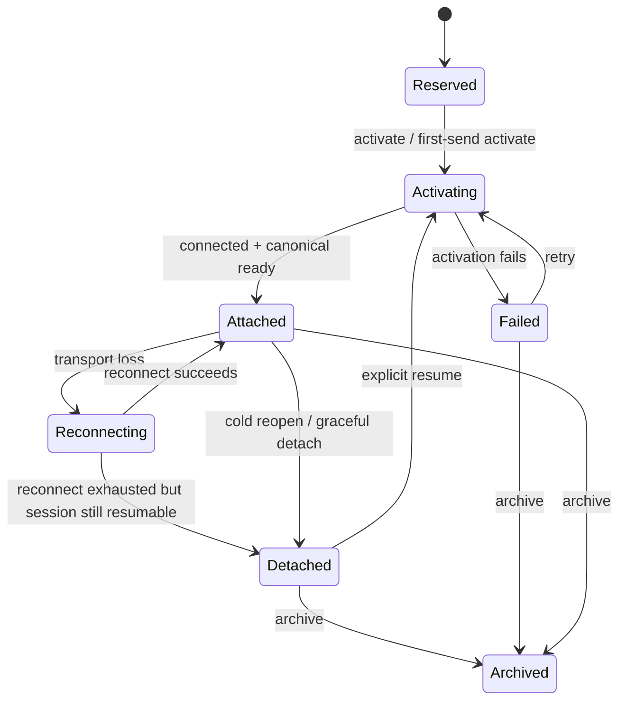

# refactor: Session authority rewrite with detached resumable state

## Overview

Rewrite Acepe's session lifecycle around a single backend-owned **SessionAuthority** so provider transports report facts, the backend owns durable lifecycle and dispatchability, and the frontend renders only canonical authority snapshots.

This alternate plan targets the same goal as the existing pure rewrite plan, but it makes one different architectural bet: a previously-live session that is currently non-live should not be modeled as a flavor of `Failed`. Instead, the canonical model should introduce an explicit **detached but resumable** state so "recoverable but not attached" is distinct from "activation or reconnect actually failed."

## Problem Frame

Acepe's current failure mode is split lifecycle authority:

- a provider transport can connect implicitly on first prompt,
- canonical backend lifecycle may never promote that connection to durable `ready`,
- persisted runtime and frontend state can later disagree with what actually happened,
- the frontend still carries secondary hot-state such as `isConnected`,
- reopen, resume, reconnect, and second-send flows must guess whether a session is truly live,
- prompt dispatch can still depend on indirect reachability rather than one canonical backend gate.

The current repo already contains the intended authority direction in concept docs and solution docs:

`provider signal -> backend projection -> canonical session graph -> desktop stores -> UI selectors`

The rewrite goal is therefore not to patch one provider bug. It is to make that authority chain the only possible path.

This alternate plan keeps the same core direction as the existing roadmap — backend authority, dumb transports, canonical frontend trust — but changes the lifecycle model so **detached/resumable** is first-class instead of being encoded under `Failed`.

## Requirements Trace

- R1. Backend-owned session authority must be the only writer of canonical lifecycle truth.
- R2. Provider adapters must report transport facts and provider policy only; they must not publish canonical lifecycle transitions directly.
- R3. Prompt dispatch must be legal only through one authority-owned readiness gate.
- R4. Reopen, resume, reconnect, and second-send behavior must restore from canonical persisted state before any UI or dispatch path assumes liveness.
- R5. A session that is not currently transport-attached but is still recoverable must have an explicit canonical state distinct from irrecoverable failure.
- R6. Frontend connection status, affordances, model/mode availability, and reconnect UI must derive only from canonical backend state, not `SessionHotState`.
- R7. The first-prompt cc-sdk path must stop being a hidden authority bypass.
- R8. The final contract must remain provider-agnostic across cc-sdk, Codex native, ACP subprocess, and OpenCode HTTP adapters.

## Scope Boundaries

- This plan does **not** redesign transcript, operation, or interaction concepts outside the lifecycle authority seam they depend on.
- This plan does **not** introduce a full event-sourced runtime if a snapshot plus append-only lifecycle journal proves sufficient.
- This plan does **not** preserve old hot-state semantics for compatibility if they conflict with canonical authority.
- This plan does **not** add new end-user features; it changes the ownership model beneath existing create, reopen, reconnect, and send flows.

## Context & Research

### Relevant Code and Patterns

- `packages/desktop/src-tauri/src/acp/client/cc_sdk_client.rs` — current deferred first-prompt connect path and known authority bypass.
- `packages/desktop/src-tauri/src/acp/commands/session_commands.rs` — current lifecycle command entry points and canonical publication seam.
- `packages/desktop/src-tauri/src/acp/commands/client_ops.rs` — shared reconnect/session client orchestration.
- `packages/desktop/src-tauri/src/acp/session_open_snapshot/mod.rs` — open-token and graph-revision bootstrap guarantee that any replacement must preserve.
- `packages/desktop/src-tauri/src/acp/session_state_engine/runtime_registry.rs` — current runtime cache that should become projection/cache instead of authority.
- `packages/desktop/src-tauri/src/acp/session_state_engine/envelope.rs` — canonical lifecycle/capability envelope contract owned by Rust.
- `packages/desktop/src/lib/acp/store/session-event-service.svelte.ts` — waiter and pending-event buffering that already assumes canonical lifecycle events are authoritative.
- `packages/desktop/src/lib/acp/store/session-store.svelte.ts` — explicit proof of dual-state through hot-state writes plus reconciliation from canonical graph.
- `packages/desktop/src/lib/acp/store/services/session-connection-manager.ts` — create/connect/reconnect orchestration and current hot-state operational guards.
- `packages/desktop/src/lib/acp/store/services/session-open-hydrator.ts` — frontend bootstrap/hydration path that already respects `graphRevision` and `openToken`.

### File Responsibility Map

| Area | Responsibility |
|---|---|
| `src-tauri/src/acp/lifecycle/` | New authority-owned lifecycle model, state transitions, runtime lease, restore semantics |
| `src-tauri/src/acp/commands/` | Public command surface only; delegates to shared authority instead of owning lifecycle truth |
| `src-tauri/src/acp/client/` and `opencode/http_client/` | Provider adapters and transport fact emission only |
| `src-tauri/src/acp/session_state_engine/` | Canonical envelope and graph contract exported to the desktop |
| `src/lib/acp/store/` | Canonical projection consumption, no independent lifecycle truth |
| `src/lib/services/acp-types.ts` | Generated Specta output only; never hand-edited |

### Institutional Learnings

- `docs/concepts/session-graph.md` — canonical authority belongs in the backend session graph, not the UI.
- `docs/concepts/reconnect-and-resume.md` — restore must be snapshot-first, not live-registry-first.
- `docs/solutions/architectural/revisioned-session-graph-authority-2026-04-20.md` — strongest authority document; defines the legacy paths that must die.
- `docs/solutions/best-practices/provider-owned-policy-and-identity-not-ui-projections-2026-04-09.md` — providers own policy/identity at the edge, not UI projections.
- `docs/brainstorms/2026-04-12-async-session-resume-requirements.md` — resume should be fire-and-forget with one authoritative timeout and canonical completion events.

### External References

- `https://raw.githubusercontent.com/obra/superpowers/main/skills/writing-plans/SKILL.md` — used as inspiration for higher context density, stronger file responsibility mapping, and more implementer-complete unit definitions. This plan still follows Acepe's local planning rules, so it intentionally omits embedded code snippets and shell-command choreography.

## Key Technical Decisions

- **Adopt a detached/resumable canonical state instead of overloading `Failed`.** A session can be non-live yet still valid and resumable; that should be modeled directly.
- **Represent authority as a backend `SessionAuthority` with a runtime lease/generation.** This makes stale transport callbacks and stale prompt dispatch rejectable without UI guesses.
- **Split lifecycle truth from transport condition.** Lifecycle answers "what the product believes is true"; transport answers "what the adapter reports right now."
- **Keep persistence as snapshot + append-only lifecycle journal.** This is lighter than full event sourcing but still gives replay, auditability, and deterministic restore.
- **Make `open`, `resume`, `reconnect`, and `send` distinct command surfaces.** They may reuse internal helpers, but the semantics must stay separate at the API level.
- **Keep generated TypeScript contracts Rust-owned.** Any lifecycle/status additions land in Rust and regenerate `acp-types.ts`; the generated file is never the source of truth.

## Open Questions

### Resolved During Planning

- **Should detached-but-resumable be a true state?** Yes. This is the defining difference of this alternate plan.
- **Should the architecture be fully event-sourced?** Not initially. Snapshot + append-only lifecycle journal is sufficient if restore remains deterministic and auditable.
- **Should prompt dispatch be guarded structurally or only at runtime?** Both where practical: a sealed authority API plus runtime lease/generation checks.
- **Should cc-sdk keep the first-prompt optimization?** Yes, but only inside authority-owned activation, never inside a provider-side hidden path.

### Deferred to Implementation

- Exact Rust naming for the detached state (`Detached`, `Resumable`, or `ReadyDetached`) once the surrounding state names are implemented and tested.
- Whether the lifecycle journal lives in the existing projection snapshot payload or a closely related persistence record.
- Whether typestate handles should be phantom types or named newtypes after the authority API is stabilized.

## High-Level Technical Design

> *This illustrates the intended approach and is directional guidance for review, not implementation specification. The implementing agent should treat it as context, not code to reproduce.*

The important distinction is:

- `Detached` = valid session history and resumable identity exist, but there is no active transport
- `Failed` = activation/reconnect or provider interaction failed in a way that requires explicit error handling, not just resume intent

## Alternative Approaches Considered

- **Keep the current pure rewrite plan's `Failed { reconnect_required }` model** — simpler state count, but it keeps "recoverable but offline" inside a failure family that many reviewers and clean-room agents found semantically overloaded.
- **Keep frontend hot-state as a temporary bridge** — easier migration, but it preserves the same second-authority seam that caused the bug class.
- **Make providers fully passive and policy-free** — too pure; provider identity mapping, reconnect semantics, and preview capability policy still belong at the adapter edge.
- **Adopt full event sourcing immediately** — stronger audit story, but too much surface area for this rewrite unless snapshot + lifecycle journal prove insufficient.

## Success Metrics

- A previously-live session reopened after restart is shown as explicitly resumable/detached rather than generic failed/disconnected.
- A brand-new cc-sdk session reaches canonical attached/ready state through authority-owned activation before any later refresh or second send occurs.
- The frontend no longer derives connection truth from `SessionHotState`.
- `sendPrompt` succeeds only when authority state and runtime lease both allow dispatch.
- Resume and reconnect no longer require provider-specific frontend logic.

## Phased Delivery

### Phase 1 — Canonical authority model

- establish detached/resumable semantics,
- add authority snapshot and lease model,
- preserve open-token/bootstrap ordering.

### Phase 2 — cc-sdk proving slice

- move the hidden first-prompt connect behind authority-owned activation,
- prove reopen/resume/second-send behavior on the root failing provider.

### Phase 3 — frontend and provider convergence

- remove hot-state authority,
- converge the remaining providers on the shared contract,
- lock the architecture with regression tests and docs.

## Implementation Units

- [ ] **Unit 1: Define the authority snapshot and detached/resumable lifecycle model**

**Goal:** Introduce the canonical lifecycle shape that distinguishes detached/resumable from true failure.

**Requirements:** R1, R4, R5

**Dependencies:** None

**Files:**
- Create: `packages/desktop/src-tauri/src/acp/lifecycle/mod.rs`
- Create: `packages/desktop/src-tauri/src/acp/lifecycle/state.rs`
- Create: `packages/desktop/src-tauri/src/acp/lifecycle/snapshot.rs`
- Modify: `packages/desktop/src-tauri/src/acp/session_state_engine/envelope.rs`
- Modify: `packages/desktop/src-tauri/src/acp/session_state_engine/protocol.rs`
- Test: `packages/desktop/src-tauri/src/acp/lifecycle/lifecycle_state_tests.rs`

**Approach:**
- Define canonical lifecycle states with an explicit detached/resumable state.
- Carry `statusReason` alongside lifecycle so the frontend can distinguish detached, retryable failure, and archived outcomes without guesswork.
- Keep transport condition separate from lifecycle status in the canonical snapshot to avoid repeating today's ambiguity in a different shape.

**Execution note:** Start with failing lifecycle-state tests that demonstrate detached and failed are not interchangeable.

**Patterns to follow:**
- `docs/concepts/session-graph.md`
- `packages/desktop/src-tauri/src/acp/session_state_engine/envelope.rs`

**Test scenarios:**
- Happy path — attached/ready session can transition to detached on cold reopen without becoming failed.
- Edge case — reconnect exhaustion produces detached when the session remains resumable, not failed by default.
- Error path — activation failure still produces failed with an explicit reason distinct from detached.
- Integration — the generated TypeScript lifecycle contract exposes the new state and reason fields through Specta.

**Verification:**
- The canonical contract can represent offline-but-resumable and true-failure cases without overloading one state family.

- [ ] **Unit 2: Introduce `SessionAuthority` and runtime lease/generation ownership**

**Goal:** Create one backend authority that owns lifecycle transitions, dispatchability, and runtime lease validity.

**Requirements:** R1, R3, R4

**Dependencies:** Unit 1

**Files:**
- Create: `packages/desktop/src-tauri/src/acp/lifecycle/authority.rs`
- Create: `packages/desktop/src-tauri/src/acp/lifecycle/runtime_lease.rs`
- Modify: `packages/desktop/src-tauri/src/acp/commands/session_commands.rs`
- Modify: `packages/desktop/src-tauri/src/acp/commands/client_ops.rs`
- Modify: `packages/desktop/src-tauri/src/main.rs`
- Test: `packages/desktop/src-tauri/src/acp/lifecycle/authority_tests.rs`

**Approach:**
- Make `SessionAuthority` the only path that can advance canonical lifecycle and assign runtime lease generations.
- Keep stale callback rejection simple: any transport callback or dispatch attempt carrying an old generation is ignored or rejected.
- Convert existing runtime registry behavior into a cache/projection of authority state rather than an independent authority.

**Execution note:** Characterization-first for current runtime registry behavior before redirecting writes through `SessionAuthority`.

**Patterns to follow:**
- `packages/desktop/src-tauri/src/acp/commands/session_commands.rs`
- `packages/desktop/src-tauri/src/acp/session_state_engine/runtime_registry.rs`

**Test scenarios:**
- Happy path — a newly activated session gets a lease generation and canonical dispatchability.
- Edge case — stale transport callback from a replaced lease does not mutate canonical state.
- Error path — authority write failure does not partially advance lifecycle or lease state.
- Integration — runtime registry no longer persists lifecycle truth independently of authority.

**Verification:**
- There is one backend writer of lifecycle truth and one authority for lease-valid dispatch.

- [ ] **Unit 3: Split the public command surface into open, resume, reconnect, and send**

**Goal:** Remove ambiguous lifecycle verbs by making public session commands semantically distinct.

**Requirements:** R3, R4, R5

**Dependencies:** Units 1-2

**Files:**
- Modify: `packages/desktop/src-tauri/src/acp/commands/session_commands.rs`
- Modify: `packages/desktop/src-tauri/src/acp/session_open_snapshot/mod.rs`
- Modify: `packages/desktop/src/lib/acp/store/api.ts`
- Modify: `packages/desktop/src/lib/acp/store/services/session-open-hydrator.ts`
- Modify: `packages/desktop/src/lib/acp/store/session-event-service.svelte.ts`
- Test: `packages/desktop/src/lib/acp/store/services/__tests__/session-open-hydrator.test.ts`
- Test: `packages/desktop/src/lib/acp/store/__tests__/session-event-service-streaming.vitest.ts`

**Approach:**
- Preserve the existing `openToken` / `graphRevision` guarantee as the bootstrap boundary.
- Keep `open` as history/bootstrap only.
- Make `resume` the only path from detached to activating.
- Keep `reconnect` reserved for repairing an already-live lease when that is semantically different from detached resume.

**Patterns to follow:**
- `packages/desktop/src-tauri/src/acp/session_open_snapshot/mod.rs`
- `packages/desktop/src/lib/acp/store/session-event-service.svelte.ts`

**Test scenarios:**
- Happy path — open hydrates a detached session without auto-attaching transport.
- Happy path — resume from detached transitions through activation and resolves through canonical lifecycle events.
- Edge case — waiter registers before invoke and still resolves when ready/failure arrives during hydrate.
- Error path — invalid resume from archived or irrecoverable failure returns a typed rejection.

**Verification:**
- Open, resume, reconnect, and send are no longer aliases of one another in the public contract.

- [ ] **Unit 4: Move the cc-sdk first-prompt path behind authority-owned activation**

**Goal:** Eliminate the hidden provider-side connect-on-send path that currently bypasses canonical lifecycle truth.

**Requirements:** R1, R3, R7

**Dependencies:** Units 2-3

**Files:**
- Modify: `packages/desktop/src-tauri/src/acp/client/cc_sdk_client.rs`
- Modify: `packages/desktop/src-tauri/src/acp/commands/interaction_commands.rs`
- Modify: `packages/desktop/src-tauri/src/acp/client/tests.rs`
- Test: `packages/desktop/src-tauri/src/acp/client/tests.rs`

**Approach:**
- Keep the first-prompt optimization if desired, but only when `SessionAuthority` owns the activation and lease transition.
- Remove any provider path that can make a session effectively live before canonical readiness is recorded.
- Use cc-sdk as the proving slice before broader provider convergence.

**Execution note:** Start with a failing regression test for a brand-new session whose first prompt currently leaves canonical runtime state non-ready.

**Patterns to follow:**
- `packages/desktop/src-tauri/src/acp/client/cc_sdk_client.rs`
- `docs/solutions/architectural/revisioned-session-graph-authority-2026-04-20.md`

**Test scenarios:**
- Happy path — first send on a reserved session triggers authority-owned activation and reaches ready/attached canonically.
- Edge case — second send reuses the existing lease and does not reconnect unnecessarily.
- Error path — failed activation leaves the session detached or failed according to the authority rules, not pseudo-connected.
- Integration — no provider-owned direct lifecycle publication remains in the cc-sdk path.

**Verification:**
- The root bug path no longer exists.

- [ ] **Unit 5: Persist authority snapshots and deterministic restore metadata**

**Goal:** Make restore deterministic by persisting enough canonical authority data to rebuild detached, attached, and failed states without UI guesses.

**Requirements:** R4, R5, R8

**Dependencies:** Units 1-4

**Files:**
- Modify: `packages/desktop/src-tauri/src/acp/projections/mod.rs`
- Modify: `packages/desktop/src-tauri/src/db/repository.rs`
- Modify: `packages/desktop/src-tauri/src/acp/session_open_snapshot/mod.rs`
- Test: `packages/desktop/src-tauri/src/acp/lifecycle/restore_tests.rs`

**Approach:**
- Persist the authority snapshot, status reason, lease-relevant recovery metadata, and any lifecycle journal needed to distinguish detached from failed after restart.
- Keep restore snapshot-first and only then allow live transport recovery to improve freshness.
- Do not let the absence of a live transport imply failure if the session remains resumable.

**Patterns to follow:**
- `docs/concepts/reconnect-and-resume.md`
- `packages/desktop/src-tauri/src/acp/projections/mod.rs`

**Test scenarios:**
- Happy path — previously attached session reopens as detached/resumable after restart.
- Edge case — abandoned in-flight activation restores with a reason distinct from detached steady-state.
- Error path — irrecoverable provider/session mismatch restores as failed, not detached.
- Integration — restore does not depend on the live runtime registry being populated first.

**Verification:**
- Reopen behavior is deterministic from persisted canonical data alone.

- [ ] **Unit 6: Remove frontend lifecycle hot-state and render only canonical authority**

**Goal:** Make the desktop a projection consumer rather than a second lifecycle authority.

**Requirements:** R3, R6

**Dependencies:** Units 1-5

**Files:**
- Modify: `packages/desktop/src/lib/acp/store/session-store.svelte.ts`
- Modify: `packages/desktop/src/lib/acp/store/services/session-connection-manager.ts`
- Modify: `packages/desktop/src/lib/acp/store/services/session-messaging-service.ts`
- Modify: `packages/desktop/src/lib/acp/store/session-event-service.svelte.ts`
- Modify: `packages/desktop/src/lib/acp/store/types.ts`
- Modify: `packages/desktop/src/lib/acp/store/session-state.ts`
- Modify: `packages/desktop/src/lib/acp/components/agent-input/agent-input-ui.svelte`
- Delete or absorb: `packages/desktop/src/lib/acp/store/session-hot-state-store.svelte.ts`
- Test: `packages/desktop/src/lib/acp/store/__tests__/session-store-lifecycle-projection.vitest.ts`
- Test: `packages/desktop/src/lib/acp/store/services/session-connection-manager.test.ts`

**Approach:**
- Replace `isConnected`-style lifecycle truth with canonical fields such as lifecycle status, transport condition, dispatchability, and status reason.
- Keep UI-local draft/focus state local, but remove lifecycle authority from the store hot-state path.
- Ensure the composer and toolbar behaviors distinguish detached (resume available) from failed (error handling/retry required).

**Patterns to follow:**
- `packages/desktop/src/lib/acp/store/session-event-service.svelte.ts`
- `packages/desktop/src/lib/acp/logic/session-ui-state.ts`

**Test scenarios:**
- Happy path — attached/ready is the only state that enables dispatch.
- Edge case — detached session shows resumable UI without claiming to be connected.
- Error path — failed session shows error/retry UI distinct from detached/resumable UI.
- Integration — second-send and reconnect behaviors derive from canonical authority state, not hot-state booleans.

**Verification:**
- The frontend no longer contains an independent lifecycle truth path.

- [ ] **Unit 7: Converge remaining providers, docs, and regression coverage**

**Goal:** Make the detached-state authority contract provider-agnostic and durable.

**Requirements:** R1-R8

**Dependencies:** Units 1-6

**Files:**
- Modify: `packages/desktop/src-tauri/src/acp/client/session_lifecycle.rs`
- Modify: `packages/desktop/src-tauri/src/acp/client/codex_native_client.rs`
- Modify: `packages/desktop/src-tauri/src/acp/opencode/http_client/agent_client_impl.rs`
- Modify: `docs/concepts/session-graph.md`
- Modify: `docs/concepts/reconnect-and-resume.md`
- Create: `docs/solutions/architectural/session-authority-detached-state-2026-04-22.md`
- Test: `packages/desktop/src-tauri/src/acp/client/tests.rs`
- Test: `packages/desktop/src/lib/acp/store/__tests__/session-event-service-streaming.vitest.ts`

**Approach:**
- Converge remaining providers on the shared authority contract.
- Update concept docs so detached/resumable semantics are explicit and not left as implementation folklore.
- Name the new invariants directly in tests so regression is obvious from test names alone.

**Patterns to follow:**
- `docs/solutions/architectural/revisioned-session-graph-authority-2026-04-20.md`
- `docs/solutions/best-practices/provider-owned-policy-and-identity-not-ui-projections-2026-04-09.md`

**Test scenarios:**
- Happy path — all providers can represent non-live-but-resumable sessions without frontend special casing.
- Edge case — provider-specific reconnect/load semantics remain edge-owned while lifecycle truth remains shared.
- Error path — transport loss plus exhausted reconnect yields detached or failed according to canonical rules, not provider-specific UI behavior.
- Integration — concept docs, regression tests, and runtime behavior all describe the same authority chain.

**Verification:**
- The lifecycle authority contract is documented, tested, and shared across providers.

## System-Wide Impact

- **Interaction graph:** session commands, provider adapters, runtime persistence, open/bootstrap, and desktop stores all participate in the authority rewrite.
- **Error propagation:** provider errors become authority inputs; authority decides whether they mean detached, reconnecting, or failed.
- **State lifecycle risks:** stale transport callbacks, stale dispatch attempts, and cold-open ambiguity are all explicitly addressed through authority snapshots and runtime leases.
- **API surface parity:** `open`, `resume`, `reconnect`, and `send` semantics must stay aligned between Rust commands and TypeScript client APIs.
- **Integration coverage:** open-token bootstrap ordering, first-send activation, and restore-before-refresh behavior all require cross-layer testing.
- **Unchanged invariants:** transcript, operations, and interactions remain canonical backend-owned concepts; this plan changes lifecycle authority, not those domains.

## Risks & Dependencies

| Risk | Mitigation |
|------|------------|
| Detached state increases lifecycle complexity | Keep the state count low and require every new state to carry a distinct user-meaningful contract |
| Restore semantics drift from concept docs | Update concept docs and name the new invariants in tests during Unit 7 |
| Provider adapters leak lifecycle authority back in | Restrict providers to transport facts and keep the authority write seam narrow and testable |
| Frontend migration surface is larger than expected | Use a repo-wide sweep for `SessionHotState`, `isConnected`, and hot-state guard assumptions before closing Unit 6 |

## Documentation / Operational Notes

- Update the concept docs immediately when the detached/resumable model lands so the architecture does not fork between code and docs.
- Preserve the existing fire-and-forget resume invoke plus canonical waiter pattern; it is load-bearing and should remain the operational model.

## Sources & References

- Related plan: `docs/plans/2026-04-21-001-refactor-canonical-session-lifecycle-authority-plan.md`
- Related plan: `/tmp/2026-04-21-002-refactor-pure-session-lifecycle-supervisor-plan.md`
- Related docs: `docs/concepts/session-graph.md`
- Related docs: `docs/concepts/reconnect-and-resume.md`
- Related docs: `docs/solutions/architectural/revisioned-session-graph-authority-2026-04-20.md`
- Related docs: `docs/solutions/best-practices/provider-owned-policy-and-identity-not-ui-projections-2026-04-09.md`
- External planning reference: `https://raw.githubusercontent.com/obra/superpowers/main/skills/writing-plans/SKILL.md`
