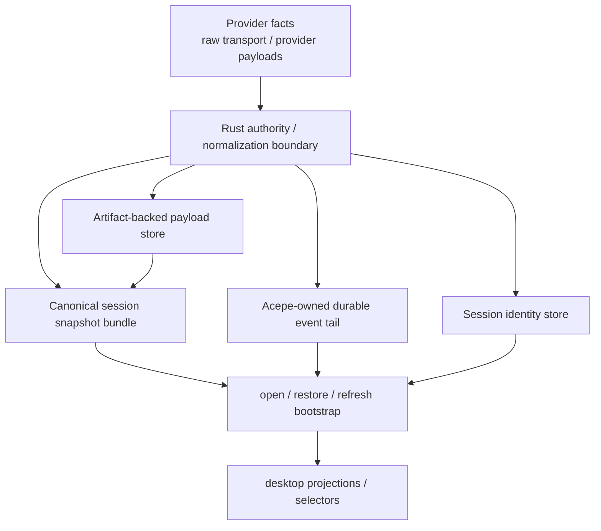
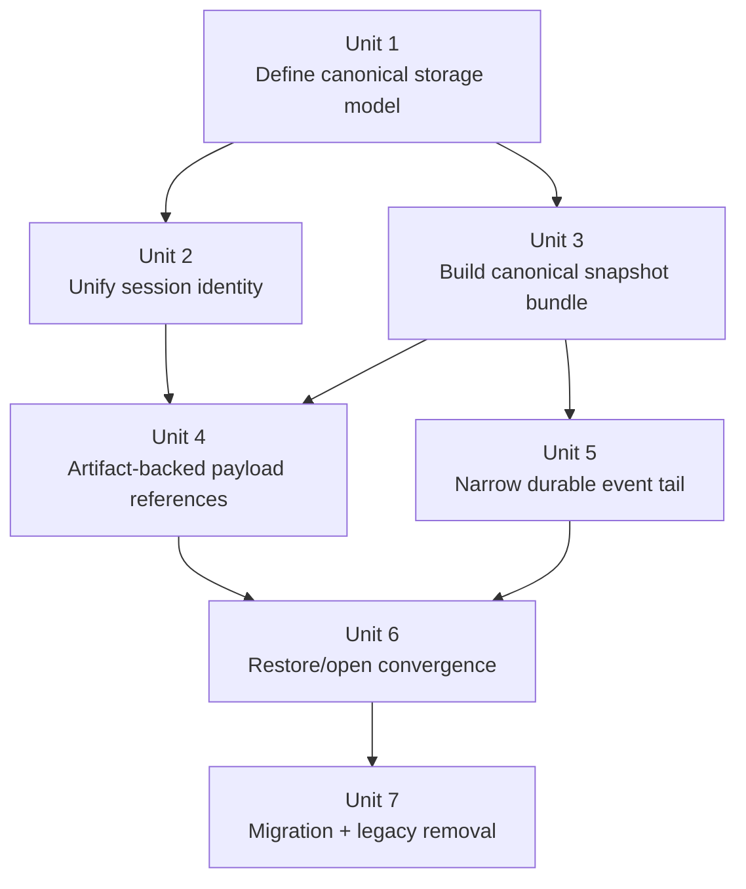
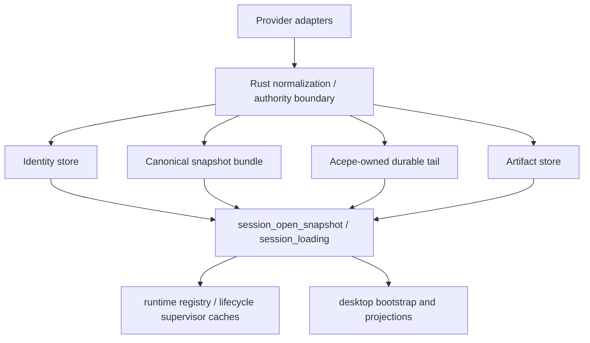

# refactor: Canonical session storage seam architecture

## Overview

Define the **God architecture** for Acepe's storage seam so durable session state has one backend-owned storage authority, large provider payloads are never inline relational truth, and restore/reopen paths can rebuild canonical state without depending on live transports, UI projections, or compatibility fallbacks.

This plan is **not** the emergency bounded-growth fix. That containment slice is already implemented separately. This document defines the clean long-horizon storage architecture that should remain once the bandaids and legacy compatibility layers are removed.

## Problem Frame

Acepe's current storage seam still reflects a transitional architecture:

- `session_metadata` and `acepe_session_state` both own pieces of session identity and lifecycle-adjacent facts,
- `session_projection_snapshot`, `session_transcript_snapshot`, and `session_thread_snapshot` overlap as persisted read models,
- `session_journal_event` mixes replay metadata, Acepe-owned durable facts, and provider-shaped payload exhaust,
- open/restore code still carries fallback logic whose job is to compensate for those overlapping authorities.

The containment work stopped the catastrophe:

- journal rows are bounded,
- compaction runs,
- pressure valves exist,
- oversized updates no longer create multi-megabyte SQLite rows.

But that work did **not** finish the God architecture. The deeper architectural problem remains: the storage seam still contains transitional shapes and implicit authority sharing that make the system harder to reason about, harder to migrate, and too tolerant of "raw provider payloads as quasi-durable truth."

The clean target must match the same authority philosophy as the new lifecycle plans:

`provider facts -> backend authority -> canonical persisted state -> desktop projections -> UI`

For storage, that means:

- one durable identity record,
- one canonical session-state snapshot bundle,
- one narrow Acepe-owned durable event tail,
- one artifact-backed store for provider exhaust,
- zero legacy fallback stores masquerading as authority.

## Requirements Trace

- R1. The storage seam must expose exactly one durable authority for each class of session truth: identity, canonical graph state, durable event tail, and large payload artifacts.
- R2. Reopen, restore, reconnect bootstrap, and second-send preconditions must be satisfiable from canonical persisted state plus the narrow durable event tail, without depending on live registry state.
- R3. Provider-shaped payloads must never be relational first-class authority; they must be normalized into canonical records or stored as artifact-backed references.
- R4. Transitional compatibility stores that preserve split authority (`acepe_session_state`, `session_thread_snapshot`, overlapping snapshot semantics) must have an explicit removal path.
- R5. The architecture must remain aligned with the revisioned session graph / lifecycle-authority direction already defined in the session graph and session lifecycle docs.
- R6. Existing installs must have a realistic migration path from the current schema into the clean storage model without manual DB deletion.

## Scope Boundaries

- This plan does **not** redefine lifecycle semantics such as `Detached` vs `Failed`; that belongs to the lifecycle-authority plans.
- This plan does **not** redesign provider transports or frontend selectors except where they cross the storage boundary.
- This plan does **not** preserve current compatibility layers if they conflict with single-authority storage.
- This plan does **not** broaden the emergency containment work into "every persisted JSON blob in the app."
- This plan does **not** require full event sourcing if a canonical snapshot bundle plus narrow durable tail is sufficient.

## Context & Research

### Relevant Code and Patterns

- `packages/desktop/src-tauri/src/db/entities/session_metadata.rs`
  - current primary persisted identity record
- `packages/desktop/src-tauri/src/db/entities/acepe_session_state.rs`
  - Acepe-owned overlay that duplicates identity/state fields from `session_metadata`
- `packages/desktop/src-tauri/src/db/entities/session_projection_snapshot.rs`
  - persisted canonical projection checkpoint today
- `packages/desktop/src-tauri/src/db/entities/session_transcript_snapshot.rs`
  - persisted transcript checkpoint
- `packages/desktop/src-tauri/src/db/entities/session_thread_snapshot.rs`
  - legacy JSONL-derived compatibility checkpoint that should not survive the clean model
- `packages/desktop/src-tauri/src/db/entities/session_journal_event.rs`
  - append-only durable event table
- `packages/desktop/src-tauri/src/db/repository.rs`
  - current monolithic repository containing identity, journal, snapshot, and upgrade logic that should be split by durable authority boundary
- `packages/desktop/src-tauri/src/acp/session_journal.rs`
  - event taxonomy, replay, and current load fallback chain
- `packages/desktop/src-tauri/src/acp/session_open_snapshot/mod.rs`
  - canonical open/restore contract and the correct orchestration seam for storage reads
- `packages/desktop/src-tauri/src/acp/lifecycle/supervisor.rs`
  - today couples lifecycle checkpoint persistence to projection writes
- `packages/desktop/src-tauri/src/acp/session_state_engine/runtime_registry.rs`
  - materialized runtime cache that must remain non-authoritative

### Institutional Learnings

- `docs/solutions/architectural/revisioned-session-graph-authority-2026-04-20.md`
  - the revisioned session graph is the only durable product-state authority
- `docs/concepts/session-graph.md`
  - one authority chain, many projections; no UI reconstruction of durable truth
- `docs/concepts/reconnect-and-resume.md`
  - restore is snapshot-first and history-first, never fake-live
- `docs/solutions/architectural/provider-owned-semantic-tool-pipeline-2026-04-18.md`
  - provider quirks belong at the edge; downstream consumers read projected records, they do not re-classify
- `docs/solutions/best-practices/provider-owned-policy-and-identity-not-ui-projections-2026-04-09.md`
  - identity/policy must be stored explicitly, not reconstructed from presentation data
- `docs/solutions/logic-errors/worktree-session-restore-2026-03-27.md`
  - identity fields dropped at the persistence boundary create restore-time races and wrong-session recovery

### External References

- None required. The repo's recent architectural docs already define the desired authority model and the anti-patterns this plan must remove.

## Key Technical Decisions

| Decision | Why |
|---|---|
| Treat the clean storage seam as **four durable nodes** — identity record, canonical snapshot bundle, narrow durable event tail, artifact store | Makes ownership explicit and eliminates today's overlapping persisted shapes |
| Make the **canonical snapshot bundle** the normal restore authority, with the event tail applied only as an incremental extension | Matches the session graph / restore philosophy and keeps reopen independent from full-history replay |
| Unify `session_metadata` and `acepe_session_state` into one authoritative identity store | Split identity ownership is a structural bug source, not a migration detail |
| Replace file-path sentinels with explicit identity/provenance fields in the unified store | Today synthetic `file_path` prefixes and zeroed file stats carry hidden lifecycle and visibility meaning; the clean model must store those facts directly |
| Remove `session_thread_snapshot` from durable authority while explicitly separating that from the provider history acquisition contract | The DB fallback must die as a restore authority, but the provider-facing history/import type may survive temporarily until its own contract is replaced |
| Keep a small **Acepe-owned** durable event tail for checkpoints, interaction transitions, permission decisions, lifecycle checkpoint facts, compact audit summaries, and similar product facts | Preserves auditability and revision progression without retaining provider exhaust as relational truth |
| Move provider-shaped large content behind an **artifact-backed reference contract** stored in a filesystem content-addressed store with SQLite metadata only | Prevents relational bloat and preserves the provider-at-the-edge ownership boundary without recreating the SQLite blow-up in BLOB form |
| Split `db/repository.rs` into seam-specific repositories/modules | The monolithic repository currently hides authority overlap and makes migration sequencing opaque |
| Force lifecycle checkpoint persistence out of the projection snapshot blob by routing it through a named Acepe-owned durable tail fact before lifecycle convergence finishes | The clean model must not preserve hidden lifecycle truth piggybacked inside projection persistence, and the lifecycle/storage seam needs one explicit interim contract |
| Replace dual-source `sequence_id` allocation atomically during migration | Sequence generation cannot depend on both old and new stores at once without collisions or semantic drift |
| Use coordinated snapshot tables/sections with a shared frontier instead of one opaque bundle blob | Keeps section ownership reviewable, lets migration validate each section independently, and avoids recreating hidden overlap inside a single JSON column |

## Open Questions

### Resolved During Planning

- **Should this plan update yesterday's storage plan in place?** No. Yesterday's plan intentionally mixed containment with clean architecture. This new plan is a fresh clean-target architecture document.
- **Should the God architecture keep journal replay as the primary restore source?** No. The canonical snapshot bundle is the primary restore source; the durable event tail is incremental and subordinate.
- **Should provider raw payloads remain durable relational records if they are "small enough"?** No. The clean model keeps provider exhaust behind canonical normalization or artifact references, not as first-class relational truth.
- **Should `session_thread_snapshot` survive as a tertiary fallback for safety?** No. That would preserve the same overlap this plan is trying to remove.
- **What persisted shape should the canonical snapshot bundle use?** Coordinated tables/sections with one shared frontier, not one generic blob row.
- **What physical backend should the artifact store use?** A filesystem content-addressed store rooted under Acepe application data, with SQLite holding only typed metadata and references.
- **How should destructive legacy cleanup stay recoverable?** Migration is additive first and destructive later: cleanup runs only after canonical restore has already been proven against migrated data.

### Deferred to Implementation

- Exact field-level encoding of artifact references inside snapshot/tail records should be decided after validating the minimum data needed for reviewability, replay diagnostics, export/import, and filesystem portability.

## High-Level Technical Design

> *This illustrates the intended approach and is directional guidance for review, not implementation specification. The implementing agent should treat it as context, not code to reproduce.*

### Current vs target storage authority

| Storage concern | Current reality | God-architecture target |
|---|---|---|
| Session identity | split across `session_metadata` and `acepe_session_state` | one authoritative identity record |
| Canonical state | overlapping projection/transcript/thread snapshots | one canonical snapshot bundle with explicit frontier |
| Replay / durability tail | `session_journal_event` mixes provider deltas and Acepe facts | narrow Acepe-owned durable event tail only |
| Provider exhaust | inline or transitional payload storage | artifact-backed references only |
| Restore authority | fallback chain with compatibility paths | canonical snapshot first, then apply event tail |

The design consequence is:

1. if a fact is durable product truth, it belongs in the identity store, canonical snapshot bundle, or Acepe-owned event tail,
2. if a fact is provider exhaust or large payload content, it belongs behind an artifact reference,
3. if a fact only exists in a runtime registry, UI store, or compatibility snapshot, it is not storage authority.

## Alternative Approaches Considered

| Approach | Why not chosen |
|---|---|
| Keep the bounded-growth architecture as the long-term design | It solved the catastrophe, but it still preserves transitional stores and mixed authority |
| Treat the journal as the true source of record forever and snapshots as caches only | Preserves replay-first thinking and keeps provider-shaped deltas too close to durable truth |
| Collapse everything into one giant JSON snapshot row with no durable event tail | Simpler mechanically, but loses clean revision/audit semantics and makes recovery/migration less observable |
| Keep `session_thread_snapshot` as a "safe fallback" | That preserves a second storage authority path and guarantees drift over time |

## Success Metrics

- Reopen/restore can be explained as "load identity + canonical snapshot bundle + apply Acepe-owned tail" with no compatibility caveats.
- No provider-shaped payload bytes are durable relational authority.
- There is exactly one persisted place to read session identity facts, exactly one persisted canonical state bundle, and no tertiary compatibility snapshot in the restore path.
- The new lifecycle-authority plans can store their canonical state without piggybacking on legacy storage overlap.
- A developer can reconstruct persisted session truth from the SQLite metadata plus the artifact store without needing legacy fallback tables.

## Phased Delivery

### Phase 1 — Define the clean seam

- create the new storage domain model,
- decide the authoritative persisted nodes,
- align naming and contracts with the lifecycle-authority work.

### Phase 2 — Build the replacement path

- add the new identity/snapshot/artifact repositories,
- move restore/open onto the new canonical storage path,
- preserve migration safety while the old path still exists.

### Phase 3 — Remove transitional authority

- migrate existing installs,
- delete overlap stores and compatibility fallbacks,
- lock the architecture with tests and docs.

## Implementation Units

Units 3-5 are intentionally **serial**, not parallel, because they all rewrite the same journal/storage boundary, each touches `packages/desktop/src-tauri/src/acp/session_journal.rs`, and Unit 4 depends on Unit 3's canonical snapshot-bundle contract.

- [ ] **Unit 1: Define the canonical storage domain model**

**Goal:** Establish the clean durable nodes and storage contracts before moving any existing write/read path.

**Requirements:** R1, R3, R5

**Dependencies:** None

**Files:**
- Create: `packages/desktop/src-tauri/src/acp/storage/mod.rs`
- Create: `packages/desktop/src-tauri/src/acp/storage/contracts.rs`
- Modify: `packages/desktop/src-tauri/src/acp/mod.rs`
- Modify: `packages/desktop/src-tauri/src/acp/session_open_snapshot/mod.rs`
- Test: `packages/desktop/src-tauri/src/acp/storage/contracts_test.rs`

**Approach:**
- Define explicit storage contracts for:
  - session identity,
  - canonical snapshot bundle,
  - Acepe-owned durable event tail,
  - artifact-backed payload references.
- Name which node is authoritative for each category of truth and which runtime structures are caches only.
- Keep this unit conceptual and contract-level: it should create the seam the later units implement, not prematurely move every repository.
- The `session_open_snapshot/mod.rs` touch in this unit is contract-only: wire the new storage seam types into the orchestration layer without changing active restore behavior yet.

**Execution note:** Start with contract-level tests and assertions that encode the authority split.

**Patterns to follow:**
- `docs/concepts/session-graph.md`
- `docs/solutions/architectural/revisioned-session-graph-authority-2026-04-20.md`

**Test scenarios:**
- Happy path — a canonical storage contract can express identity, snapshot, event tail, and artifact-reference concerns without overlap.
- Edge case — a field category that currently exists in multiple persisted places is assigned to exactly one durable authority in the new model.
- Error path — contract validation fails when a new node would duplicate an already-owned storage concern.
- Integration — open/restore orchestration code can depend on the new storage contracts without needing legacy table knowledge.

**Verification:**
- The storage seam has a named, explicit authority model that later units can implement without inventing ownership ad hoc.

- [ ] **Unit 2: Unify session identity into one authoritative store**

**Goal:** Remove split identity ownership by converging `session_metadata` and `acepe_session_state` into one durable identity record.

**Requirements:** R1, R2, R4

**Dependencies:** Unit 1

**Files:**
- Create: `packages/desktop/src-tauri/src/db/repositories/mod.rs`
- Create: `packages/desktop/src-tauri/src/db/repositories/session_identity_repository.rs`
- Modify: `packages/desktop/src-tauri/src/db/entities/session_metadata.rs`
- Modify: `packages/desktop/src-tauri/src/db/entities/acepe_session_state.rs`
- Modify: `packages/desktop/src-tauri/src/db/entities/mod.rs`
- Modify: `packages/desktop/src-tauri/src/db/entities/prelude.rs`
- Modify: `packages/desktop/src-tauri/src/db/repository.rs`
- Create: `packages/desktop/src-tauri/src/db/migrations/m20260422_000001_unify_session_identity_store.rs`
- Test: `packages/desktop/src-tauri/src/db/repository_test.rs`

**Approach:**
- Start the repository split here by carving out the identity repository/module first; later units extend the same seam-specific module layout instead of deepening the monolith.
- Promote one identity record as the only persisted owner of session identifiers, project/worktree facts, provider session binding, and Acepe-managed metadata.
- Remove query-time reconciliation logic that merges duplicate columns across two tables.
- Preserve explicit provenance for imported/discovered vs Acepe-created sessions without forcing a second table to become authoritative.
- Replace sentinel `file_path` prefixes and `file_mtime` / `file_size` lifecycle inference with explicit stored identity/provenance fields.
- Replace dual-source `sequence_id` reads/writes in one migration step so sequence allocation never depends on both old and new stores at once; during the non-destructive migration window, legacy sequence columns become read-only tombstones and all new allocation/uniqueness checks query only the unified identity store.
- Preserve canonical session IDs while rebasing session-keyed secondary records such as `session_review_state` so identity convergence does not orphan downstream tables.

**Patterns to follow:**
- `packages/desktop/src-tauri/src/db/entities/session_metadata.rs`
- `docs/solutions/logic-errors/worktree-session-restore-2026-03-27.md`

**Test scenarios:**
- Happy path — an Acepe-created session persists all identity facts in one durable row and restores them without reconciliation.
- Edge case — an imported/discovered session and an Acepe-managed session both round-trip identity fields without losing project/worktree/provider bindings.
- Edge case — reserved sessions preserve hidden/visible list semantics through explicit persisted state rather than `acepe_session_state.relationship` fallback behavior.
- Error path — migration refuses to silently choose conflicting identity values when old rows disagree; it surfaces a deterministic migration failure or conflict rule.
- Integration — descriptor resolution and open bootstrap read one identity source only.

**Verification:**
- No open/restore/read path needs to merge `session_metadata` with `acepe_session_state` to reconstruct canonical identity.

- [ ] **Unit 3: Build the canonical session snapshot bundle**

**Goal:** Replace today's overlapping projection/transcript/thread snapshot authority with one canonical restore bundle plus explicit frontier metadata.

**Requirements:** R1, R2, R5

**Dependencies:** Unit 1

**Files:**
- Modify: `packages/desktop/src-tauri/src/db/entities/session_projection_snapshot.rs`
- Modify: `packages/desktop/src-tauri/src/db/entities/session_transcript_snapshot.rs`
- Modify: `packages/desktop/src-tauri/src/db/entities/session_thread_snapshot.rs`
- Modify: `packages/desktop/src-tauri/src/db/repository.rs`
- Modify: `packages/desktop/src-tauri/src/acp/session_journal.rs`
- Modify: `packages/desktop/src-tauri/src/acp/lifecycle/supervisor.rs`
- Modify: `packages/desktop/src-tauri/src/history/commands/session_loading.rs`
- Create: `packages/desktop/src-tauri/src/db/migrations/m20260422_000002_create_canonical_session_snapshot_bundle.rs`
- Test: `packages/desktop/src-tauri/src/db/repository_test.rs`
- Test: `packages/desktop/src-tauri/src/history/commands/session_loading.rs`

**Approach:**
- Define the canonical persisted restore bundle that carries the accepted graph frontier and all state required for history-first restore.
- Remove `session_thread_snapshot` from durable authority; if the type survives temporarily, it survives only as a migration/import helper and not as a normal restore authority.
- Absorb transcript checkpoint concerns into the canonical snapshot bundle as a subordinate section with explicit frontier semantics; `session_transcript_snapshot` survives only as a migration source until Unit 7 removes the legacy table.
- Ensure the canonical snapshot bundle is sufficient for restore before any durable event tail is applied.
- Keep transcript/projection coherence explicit rather than relying on implicit replay from old deltas.
- Use the coordinated-table snapshot shape chosen during planning: one shared frontier plus explicit section ownership for projection, transcript, and any lifecycle-adjacent snapshot state that still belongs in the bundle.
- Do not change supervisor persistence to a new destination until the named lifecycle checkpoint tail fact exists; Unit 3 removes blob piggybacking only by moving toward that explicit contract, not by dropping persistence on the floor.
- Populate canonical bundles for sessions whose last durable state exists only in legacy thread snapshots before removing the normal restore fallback.

**Execution note:** Add characterization coverage around current restore/open behavior before deleting any compatibility fallback.

**Technical design:** *(directional guidance, not implementation specification)*
- identity row says *what session this is*
- snapshot bundle says *what canonical state is true at frontier N*
- durable event tail says *what Acepe-owned facts happened after frontier N*
- no third snapshot type is consulted during normal restore

**Patterns to follow:**
- `packages/desktop/src-tauri/src/acp/session_open_snapshot/mod.rs`
- `docs/concepts/reconnect-and-resume.md`

**Test scenarios:**
- Happy path — reopen loads the canonical snapshot bundle and returns complete state without consulting legacy thread snapshot storage.
- Edge case — a session with an empty post-snapshot tail still restores fully from the snapshot bundle.
- Error path — a malformed or incomplete bundle fails loudly instead of falling through to a hidden compatibility authority.
- Integration — `session_loading` and open bootstrap both use the same canonical bundle semantics.

**Verification:**
- Restore/reopen has one snapshot authority path and no normal-path dependence on `session_thread_snapshot`.

- [ ] **Unit 4: Move provider exhaust behind an artifact-backed reference contract**

**Goal:** Make provider-shaped payloads durable only through canonical references and artifact storage, never as relational authority.

**Requirements:** R1, R3, R6

**Dependencies:** Units 1, 2, 3

**Files:**
- Create: `packages/desktop/src-tauri/src/db/entities/session_artifact.rs`
- Modify: `packages/desktop/src-tauri/src/db/entities/mod.rs`
- Modify: `packages/desktop/src-tauri/src/db/entities/prelude.rs`
- Modify: `packages/desktop/src-tauri/src/db/repository.rs`
- Modify: `packages/desktop/src-tauri/src/acp/session_journal.rs`
- Modify: `packages/desktop/src-tauri/src/acp/ui_event_dispatcher.rs`
- Modify: `packages/desktop/src-tauri/src/acp/session_open_snapshot/mod.rs`
- Create: `packages/desktop/src-tauri/src/db/migrations/m20260422_000003_create_session_artifact_store.rs`
- Test: `packages/desktop/src-tauri/src/db/repository_test.rs`
- Test: `packages/desktop/src-tauri/src/acp/session_journal.rs`

**Approach:**
- Add a content-addressed filesystem artifact store for large or provider-shaped durable payload content, with SQLite metadata rows and typed references as the only relational surface.
- Persist only canonical references from the snapshot bundle or durable tail, not provider exhaust as first-class relational rows.
- Keep dedupe, reference ownership, and GC eligibility explicit in metadata rather than hidden in file layout conventions.
- Integrate the reference write path at the centralized backend persistence boundary, not in per-provider ad hoc logic.
- Make the durability contract explicit: write artifact content to a temp path, fsync + atomic rename into the content-addressed store, then commit the surrounding metadata/reference transaction; if the transaction aborts after the artifact becomes durable, orphan collection is handled by explicit GC metadata rather than silent best-effort cleanup.

**Patterns to follow:**
- `docs/solutions/architectural/provider-owned-semantic-tool-pipeline-2026-04-18.md`
- `packages/desktop/src-tauri/src/acp/ui_event_dispatcher.rs`

**Test scenarios:**
- Happy path — a provider payload that exceeds inline reviewable size persists once as an artifact and is referenced from canonical state.
- Edge case — repeated identical payloads deduplicate while preserving correct reference accounting across sessions.
- Edge case — when the last referencing session state is deleted or migrated away, artifact GC eligibility becomes mechanically derivable and the orphan becomes collectible.
- Error path — artifact write failure aborts the surrounding durable state transition instead of leaving a dangling reference.
- Integration — reopen resolves artifact-backed canonical state without restoring raw provider payloads into relational storage.

**Verification:**
- Provider exhaust is no longer durable relational authority, and canonical state remains restorable through references.

- [ ] **Unit 5: Narrow the durable event log to Acepe-owned facts**

**Goal:** Keep the journal as a small durable tail of Acepe-owned product facts instead of a replay log for provider-shaped deltas.

**Requirements:** R1, R2, R3

**Dependencies:** Units 3, 4

**Files:**
- Modify: `packages/desktop/src-tauri/src/acp/session_journal.rs`
- Modify: `packages/desktop/src-tauri/src/db/entities/session_journal_event.rs`
- Modify: `packages/desktop/src-tauri/src/db/repository.rs`
- Modify: `packages/desktop/src-tauri/src/acp/commands/session_commands.rs`
- Modify: `packages/desktop/src-tauri/src/history/commands/session_loading.rs`
- Test: `packages/desktop/src-tauri/src/acp/session_journal.rs`
- Test: `packages/desktop/src-tauri/src/history/commands/session_loading.rs`

**Approach:**
- Recast the durable event log as Acepe-owned facts only: checkpoints, interaction transitions, permission decisions, lifecycle checkpoint facts, compact audit summaries, and similar canonical product events.
- Eliminate provider-shaped `ProjectionUpdate` rows from the clean write path once snapshot bundle + artifact references can preserve the same information.
- Preserve revision ordering and restore correctness by applying the event tail on top of the canonical snapshot bundle, not by replaying provider deltas from zero.
- Remove provider-scoped `with_agent(...)` deserialization from the steady-state journal read path once provider-shaped deltas are no longer durable journal event types.
- Treat the lifecycle checkpoint fact as the temporary storage/lifecycle handshake: the lifecycle-authority plan can later project or relocate it without reintroducing hidden storage authority in the snapshot blob.

**Execution note:** Treat this as a contract-narrowing exercise, not a replay-preservation exercise; the snapshot bundle must already be sufficient before this unit lands.

**Patterns to follow:**
- `docs/solutions/architectural/revisioned-session-graph-authority-2026-04-20.md`
- `packages/desktop/src-tauri/src/acp/session_journal.rs`

**Test scenarios:**
- Happy path — restore loads canonical snapshot state and applies a small Acepe-owned tail to reach the current frontier.
- Edge case — a session with no tail rows still restores correctly from the snapshot bundle alone.
- Error path — missing artifact-backed evidence for a tail record fails with explicit diagnostics rather than silently dropping state.
- Integration — interaction/audit records remain queryable after provider-shaped deltas are removed from the durable event taxonomy.

**Verification:**
- `session_journal_event` contains only Acepe-owned durable facts and compact reviewable summaries.

- [ ] **Unit 6: Converge session open/restore onto the clean storage seam**

**Goal:** Make `session_open_snapshot` and related bootstrap code read only from the new storage authorities and remove compatibility fallback logic.

**Requirements:** R2, R4, R5

**Dependencies:** Units 2, 3, 4, 5

**Files:**
- Modify: `packages/desktop/src-tauri/src/acp/session_open_snapshot/mod.rs`
- Modify: `packages/desktop/src-tauri/src/acp/session_descriptor.rs`
- Modify: `packages/desktop/src-tauri/src/acp/provider.rs`
- Modify: `packages/desktop/src-tauri/src/acp/providers/claude_code.rs`
- Modify: `packages/desktop/src-tauri/src/acp/providers/copilot.rs`
- Modify: `packages/desktop/src-tauri/src/acp/providers/codex.rs`
- Modify: `packages/desktop/src-tauri/src/acp/providers/cursor.rs`
- Modify: `packages/desktop/src-tauri/src/acp/providers/opencode.rs`
- Modify: `packages/desktop/src-tauri/src/session_converter/claude.rs`
- Modify: `packages/desktop/src-tauri/src/session_converter/codex.rs`
- Modify: `packages/desktop/src-tauri/src/session_converter/cursor.rs`
- Modify: `packages/desktop/src-tauri/src/session_converter/fullsession.rs`
- Modify: `packages/desktop/src-tauri/src/session_converter/mod.rs`
- Modify: `packages/desktop/src-tauri/src/session_converter/opencode.rs`
- Modify: `packages/desktop/src-tauri/src/copilot_history/mod.rs`
- Modify: `packages/desktop/src-tauri/src/copilot_history/parser.rs`
- Modify: `packages/desktop/src-tauri/src/codex_history/parser.rs`
- Modify: `packages/desktop/src-tauri/src/opencode_history/commands.rs`
- Modify: `packages/desktop/src-tauri/src/opencode_history/parser.rs`
- Modify: `packages/desktop/src-tauri/src/history/commands/scanning.rs`
- Modify: `packages/desktop/src-tauri/src/session_jsonl/parser/convert.rs`
- Modify: `packages/desktop/src-tauri/src/history/commands/session_loading.rs`
- Modify: `packages/desktop/src-tauri/src/acp/lifecycle/supervisor.rs`
- Modify: `packages/desktop/src-tauri/src/acp/session_state_engine/runtime_registry.rs`
- Test: `packages/desktop/src-tauri/src/acp/session_open_snapshot/mod.rs`
- Test: `packages/desktop/src-tauri/src/history/commands/session_loading.rs`

**Approach:**
- Rebuild open/restore orchestration around the clean authority order:
  1. read identity,
  2. read canonical snapshot bundle,
  3. apply durable event tail,
  4. restore runtime cache from canonical persisted state,
  5. hand canonical state to desktop/bootstrap consumers.
- Remove fallback logic whose only purpose is to compensate for legacy overlapping stores.
- Keep runtime registries and supervisors explicitly cache/coordinator-only at restore time.
- Replace provider-history acquisition assumptions that currently depend on `SessionThreadSnapshot` as a durable compatibility store; provider parsers/converters may still produce import/history types, but normal restore no longer depends on that contract.
- Replace the contract-only `session_open_snapshot` seam wiring added in Unit 1 with the full canonical read sequence; Unit 6 owns the behavior change, not the earlier seam stub.

**Patterns to follow:**
- `packages/desktop/src-tauri/src/acp/session_open_snapshot/mod.rs`
- `docs/concepts/reconnect-and-resume.md`

**Test scenarios:**
- Happy path — cold-open restores a canonical session from identity + snapshot bundle + event tail with no legacy fallback usage.
- Edge case — a session with no live registry entry still restores runtime-facing state correctly from persisted canonical data.
- Edge case — Claude/Copilot/Codex/Cursor/OpenCode history import paths all reopen through the clean storage seam without requiring `SessionThreadSnapshot` as a durable restore source.
- Error path — when a required canonical storage node is missing, open fails deterministically rather than consulting a hidden compatibility source.
- Integration — restore/open/bootstrap flow remains revision-ordered and ready for the lifecycle-authority plans to consume.

**Verification:**
- The open/restore path is explainable entirely in terms of the clean storage nodes.

- [ ] **Unit 7: Migrate existing installs and remove transitional storage authority**

**Goal:** Move existing users onto the clean storage model and delete the legacy authority seams once migration is validated.

**Requirements:** R4, R6

**Dependencies:** Units 2, 3, 4, 5, 6

**Files:**
- Modify: `packages/desktop/src-tauri/src/db/entities/mod.rs`
- Modify: `packages/desktop/src-tauri/src/db/entities/prelude.rs`
- Modify: `packages/desktop/src-tauri/src/db/migrations/mod.rs`
- Create: `packages/desktop/src-tauri/src/db/migrations/m20260422_000004_migrate_legacy_session_storage.rs`
- Create: `packages/desktop/src-tauri/src/db/migrations/m20260422_000005_remove_legacy_session_storage_paths.rs`
- Modify: `packages/desktop/src-tauri/src/db/mod.rs`
- Modify: `packages/desktop/src-tauri/src/db/repository.rs`
- Modify: `packages/desktop/src-tauri/src/db/entities/session_review_state.rs`
- Delete: `packages/desktop/src-tauri/src/db/entities/acepe_session_state.rs`
- Delete: `packages/desktop/src-tauri/src/db/entities/session_thread_snapshot.rs`
- Delete: `packages/desktop/src-tauri/src/db/entities/session_transcript_snapshot.rs`
- Test: `packages/desktop/src-tauri/src/db/repository_test.rs`
- Test: `packages/desktop/src-tauri/src/acp/session_open_snapshot/mod.rs`
- Test: `packages/desktop/src-tauri/src/db/migrations/m20260422_000004_migrate_legacy_session_storage_test.rs`

**Approach:**
- Migrate old identity/state/snapshot records into the new durable nodes with explicit validation checkpoints.
- Keep migration resumable and non-destructive until canonical restore succeeds under the new model; `m20260422_000004` is additive/populate-and-validate only, and `m20260422_000005` is a later cleanup gate that must not run on installs that have not already completed canonical validation successfully.
- Once migration is proven, remove:
  - `acepe_session_state` as an authority path,
  - `session_thread_snapshot` as an authority path,
  - legacy read/write branches in the open/load logic.
- Make the removal phase explicit so the clean architecture does not leave permanent transitional seams behind.
- Preserve canonical session IDs through migration so `session_review_state` and other session-keyed secondary records do not orphan silently.
- Preserve `ReadOnly` and discovered-session populations by either upgrading them into canonical identity when facts are recoverable or carrying them forward as explicit read-only tombstones with migration diagnostics; they are never silently dropped.

**Execution note:** Add migration characterization coverage for representative legacy shapes before destructive cleanup rules are enabled.

**Patterns to follow:**
- existing migration modules under `packages/desktop/src-tauri/src/db/migrations/`
- `packages/desktop/src-tauri/src/db/repository_test.rs`

**Test scenarios:**
- Happy path — an existing install migrates into the new identity/snapshot/artifact/tail model and reopens sessions successfully.
- Edge case — partially populated legacy sessions migrate without losing canonical identity or requiring live-provider contact.
- Edge case — legacy provider-specific thread snapshot blobs migrate with the correct provider parse context instead of generic deserialization.
- Edge case — `ReadOnly` descriptor populations are either upgraded into canonical identity or explicitly reported as non-migratable, not silently dropped.
- Error path — corrupt or conflicting legacy records block destructive cleanup and preserve enough state for diagnosis/retry.
- Integration — once migration is complete, old authority seams are no longer reachable from normal restore/open code.

**Verification:**
- Existing users can land on the clean storage model without manual DB deletion, and legacy authority seams are actually removed.

## System-Wide Impact

- **Interaction graph:** provider adapters, normalization boundaries, repositories, open/restore orchestration, runtime caches, and desktop bootstrap all participate in the change.
- **Error propagation:** artifact-write failures, migration conflicts, and missing canonical nodes must fail explicitly rather than falling through to hidden compatibility sources.
- **State lifecycle risks:** identity conflicts, partial migration, `ReadOnly` descriptor populations, reserved-session visibility semantics, stale artifact references, and lingering legacy fallback paths are the main durability risks.
- **API surface parity:** lifecycle-authority plans depend on this storage seam remaining backend-owned and canonical; the two plans must not diverge on what "stored authority" means.
- **Integration coverage:** open after migration, restore with artifact references, and runtime restore with no live registry entry all require cross-layer coverage beyond repository unit tests.
- **Unchanged invariants:** the backend still owns canonical truth, providers still own only edge-specific facts, the frontend remains a projection consumer rather than a storage authority, and canonical session IDs survive migration.

## Risks & Dependencies

| Risk | Mitigation |
|------|------------|
| The plan drifts back into yesterday's containment architecture | Keep containment explicitly out of scope and define the target in terms of durable authority seams, not thresholds or guardrails |
| Lifecycle and storage plans diverge on what must be persisted | Reference the session graph and lifecycle docs directly and keep lifecycle-specific state decisions deferred only where they truly depend on the proving slice |
| Migration leaves old seams permanently "temporary" | Give legacy removal its own unit and explicit verification criteria |
| Artifact indirection hides important reviewability data | Keep compact Acepe-owned audit summaries in the durable tail and make artifact references explicit, typed, and queryable |
| The snapshot bundle becomes another generic blob that reintroduces hidden overlap | Define ownership by concern up front and require explicit frontier/authority semantics in the bundle contract |

## Documentation / Operational Notes

- This plan should eventually supersede the clean-target sections of `docs/plans/2026-04-21-001-refactor-session-storage-authority-plan.md`, which now serves primarily as the containment/bounded-growth plan.
- When implemented, the resulting architecture should update:
  - `docs/concepts/session-graph.md`
  - `docs/concepts/reconnect-and-resume.md`
  - a new architectural solution doc naming the final storage seam and the legacy seams removed

## Sources & References

- Related plan: `docs/plans/2026-04-21-001-refactor-session-storage-authority-plan.md`
- Related plan: `docs/plans/2026-04-22-001-refactor-session-authority-detached-state-plan.md`
- Related plan: `docs/plans/2026-04-22-002-refactor-session-lifecycle-convergence-after-proof-plan.md`
- `docs/concepts/session-graph.md`
- `docs/concepts/reconnect-and-resume.md`
- `docs/solutions/architectural/revisioned-session-graph-authority-2026-04-20.md`
- `docs/solutions/architectural/provider-owned-semantic-tool-pipeline-2026-04-18.md`
- `docs/solutions/best-practices/provider-owned-policy-and-identity-not-ui-projections-2026-04-09.md`
- `docs/solutions/logic-errors/worktree-session-restore-2026-03-27.md`
