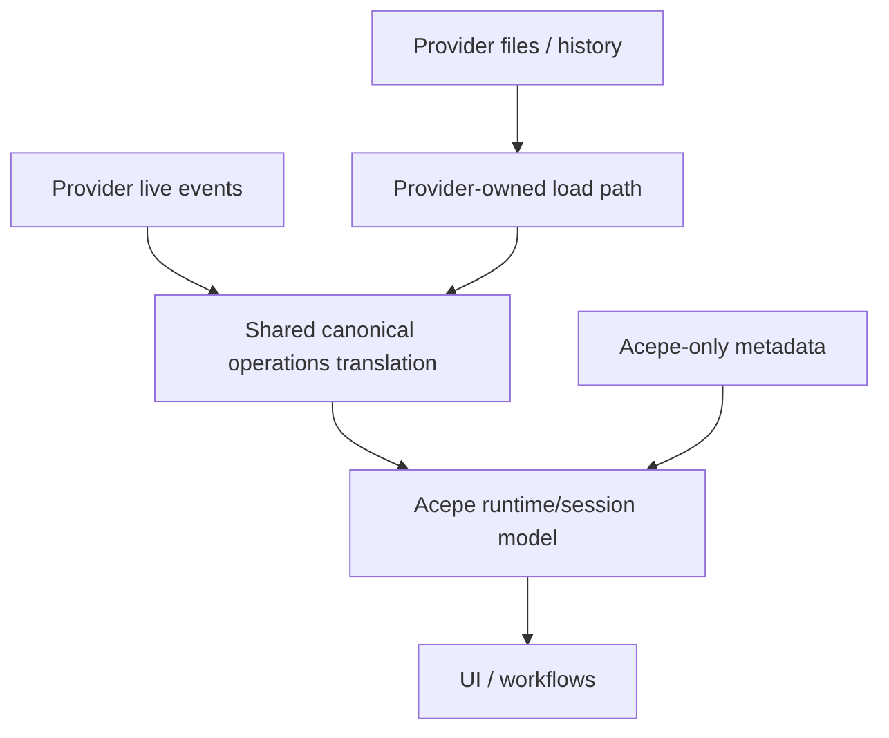
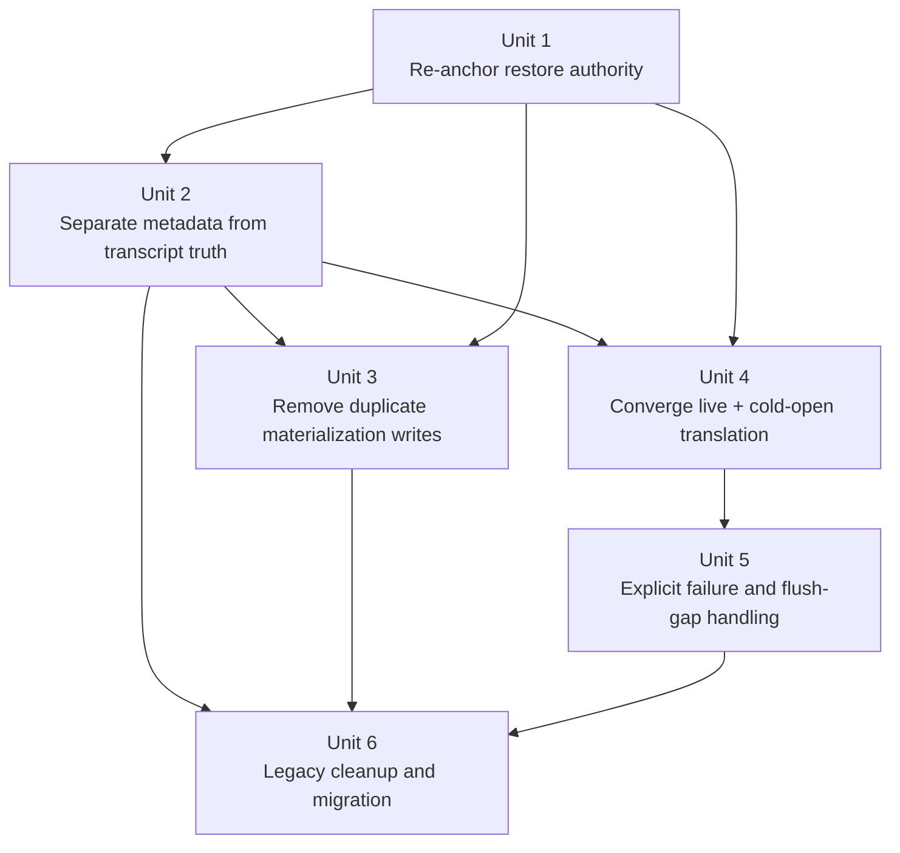

# refactor: Provider-authoritative session restore

## Overview

Replace the just-reviewed storage-seam premise with a thinner architecture: provider-owned files and live provider events remain the restore authority for session content, while Acepe owns only translation into its canonical operations/runtime model plus Acepe-specific metadata such as review state and local annotations.

This plan intentionally supersedes the premise behind `docs/plans/2026-04-22-003-refactor-canonical-session-storage-seam-plan.md`. That plan assumed Acepe should own canonical durable session truth. The origin requirements document rejects that boundary.

## Problem Frame

Today the backend still contains a storage-first architecture:

- `acp/session_open_snapshot/mod.rs` assembles open state from persisted projection and transcript snapshots,
- `history/commands/session_loading.rs` materializes provider-owned sessions into local transcript/projection/thread snapshot stores,
- `db/repository.rs` and the snapshot entities encode multiple durable transcript/session copies,
- `session_review_state` is mixed into the same local DB as transcript-derived stores even though it is genuinely Acepe-owned metadata.

That architecture solved some restore and replay problems, but it also created the disk-growth and duplicate-authority problem that triggered this work. The requirements document locks in a different product boundary: provider history is the restore authority, Acepe is the translation/co-ordination layer, and local durable storage should shrink to Acepe-owned metadata plus strictly subordinate caches.

## Requirements Trace

- R1. Provider-owned files/logs/JSONL are the cold-open restore authority. (see origin: `docs/brainstorms/2026-04-22-provider-authoritative-session-restore-requirements.md`)
- R2. Provider live events are the attached-session authority.
- R3. Cold-open and live-session translation must converge on one canonical operations/runtime model.
- R4. Local transcript/session persistence must not become a second restore authority.
- R5. Local durable storage must shrink to Acepe-owned metadata only.
- R6. Any local cache must be subordinate, purgeable, rebuildable, and must not store full transcript payloads.
- R7. Large provider payloads must not be duplicated across local durable stores.
- R8. Completed operations must converge between cold-open and live-session paths.
- R9. Acepe-only metadata-driven workflows must survive the removal of duplicated transcript truth.
- R10. Missing or unparseable provider history must fail explicitly, not silently.

## Scope Boundaries

- This plan does **not** redesign provider file formats or eliminate parser maintenance; it assumes ongoing reverse engineering remains part of the product cost.
- This plan does **not** promise offline restore when provider-owned history is unavailable.
- This plan does **not** remove all local persistence; it narrows it to Acepe-owned metadata and does not introduce a new durable transcript cache.
- This plan does **not** redesign cache infrastructure; this slice chooses to remove duplicate transcript durability first and leaves any future acceleration cache as a separate follow-on.
- This plan does **not** broaden into frontend redesign beyond wiring explicit restore-failure outcomes through the existing session-open/session-hydration surfaces.

## Context & Research

### Relevant Code and Patterns

- `packages/desktop/src-tauri/src/history/commands/session_loading.rs`
  - already contains a `HistoryReplayFamily::ProviderOwned` seam and provider-specific `load_provider_owned_session(...)` path, but still persists canonical materializations into local transcript/projection stores.
- `packages/desktop/src-tauri/src/acp/provider.rs`
  - defines `history_replay_policy()` and `load_provider_owned_session(...)`, which is the correct provider-boundary seam for cold-open authority.
- `packages/desktop/src-tauri/src/acp/parsers/provider_capabilities.rs`
  - all current providers are already marked `HistoryReplayFamily::ProviderOwned`, so the repo has already chosen provider-owned replay as the behavioral direction.
- `packages/desktop/src-tauri/src/acp/session_open_snapshot/mod.rs`
  - currently assembles open results from persisted projection/transcript snapshots and journal cutoffs; this is the main storage-first contract that must be re-anchored.
- `packages/desktop/src-tauri/src/db/repository.rs`
  - contains `SessionMetadataRepository`, `SessionReviewStateRepository`, `SessionProjectionSnapshotRepository`, `SessionTranscriptSnapshotRepository`, and `SessionThreadSnapshotRepository` in one monolithic store boundary.
- `packages/desktop/src-tauri/src/storage/commands/review_state.rs`
  - proves there is already a clean Acepe-only metadata surface worth preserving independently of transcript storage.
- `packages/desktop/src-tauri/src/db/entities/session_review_state.rs`
  - stores genuine Acepe-owned review progress keyed by session ID.

### Institutional Learnings

- `docs/solutions/logic-errors/worktree-session-restore-2026-03-27.md`
  - restore identity bugs happen when the persistence boundary drops source/worktree facts; the thin-wrapper model still needs stable identity metadata.
- `docs/solutions/architectural/provider-owned-semantic-tool-pipeline-2026-04-18.md`
  - provider quirks belong at the edge; downstream consumers should consume canonical projected records rather than re-classify raw provider payloads.
- `docs/concepts/reconnect-and-resume.md`
  - restore should be explicit about where truth comes from and should not fake-live its way through missing authority.

### External References

- None required. The repo already contains the provider-owned replay seam and the main question is architectural alignment, not missing framework knowledge.

## Key Technical Decisions

- **Provider-owned history remains the sole restore authority for session content**: no local transcript, snapshot, or cache can become a fallback authority.
- **Acepe keeps one canonical operations/runtime model in memory for both cold-open and live events**: the canonical model is for consistent behavior, not durable transcript ownership.
- **`session_metadata` and `session_review_state` survive as local metadata surfaces; transcript-derived stores do not**: this is the durable boundary between Acepe-owned facts and provider-owned session truth.
- **No new durable translation cache is introduced in this plan**: removing duplicate authority takes precedence over preserving cold-open acceleration.
- **Missing or unparseable provider history is an explicit failure mode**: the product degrades honestly instead of silently restoring stale or partial local copies.

## Open Questions

### Resolved During Planning

- **Should this update the 2026-04-22 storage-seam plan in place?** No. That document is still useful historical context, but this plan replaces its core premise.
- **Should Acepe persist a canonical durable transcript copy for safety?** No. Provider history remains the sole authority for session content.
- **Should this plan introduce a new durable subordinate cache?** No. This plan removes duplicate transcript durability first and treats acceleration as a separate future concern.
- **Should missing provider history fall back to local transcript state?** No. Explicit failure is the intended behavior.
- **Which `session_metadata` fields are still valid Acepe-owned metadata?** Keep local identity/discovery fields (`id`, `display`, `title_overridden`, `timestamp`, `project_path`, `agent_id`, `provider_session_id`, `worktree_path`, `pr_number`, `is_acepe_managed`, `sequence_id`, and normalized source-path binding). Legacy file-size/file-mtime sentinel semantics are storage-first residue and should be removed once no caller depends on them.

### Deferred to Implementation

- How should detach/crash recovery behave while waiting for completed operations to flush into provider-owned history?
- What parser-failure diagnostics are sufficient to make restore failures actionable without expanding this refactor into a larger observability project?

## High-Level Technical Design

> *This illustrates the intended approach and is directional guidance for review, not implementation specification. The implementing agent should treat it as context, not code to reproduce.*

The core shape is:

1. provider adapters load and parse provider-owned history,
2. both historical and live inputs flow through the same canonical operations/runtime translation path,
3. local metadata layers on top,
4. this refactor does not add a new durable translation cache.

## Implementation Units

- [ ] **Unit 1: Re-anchor restore/open on provider authority**

**Goal:** Make the cold-open contract explicitly provider-authoritative instead of snapshot-authoritative.

**Requirements:** R1, R2, R3, R4, R10

**Dependencies:** None

**Files:**
- Modify: `packages/desktop/src-tauri/src/acp/provider.rs`
- Modify: `packages/desktop/src-tauri/src/acp/parsers/provider_capabilities.rs`
- Modify: `packages/desktop/src-tauri/src/acp/session_open_snapshot/mod.rs`
- Modify: `packages/desktop/src-tauri/src/history/commands/session_loading.rs`
- Modify: `packages/desktop/src-tauri/src/acp/commands/session_commands.rs`
- Modify: `packages/desktop/src-tauri/src/acp/session_state_engine/snapshot_builder.rs`
- Modify: `packages/desktop/src-tauri/src/acp/session_state_engine/runtime_registry.rs`
- Modify: `packages/desktop/src-tauri/src/acp/session_state_engine/graph.rs`
- Test: `packages/desktop/src-tauri/src/acp/commands/tests.rs`

**Approach:**
- Treat `load_provider_owned_session(...)` plus provider replay context as the authoritative cold-open entry point for session content.
- Keep the existing three-outcome `SessionOpenResult` contract, but replace the storage-first bootstrap behind it: `assemble_session_open_result` and its callers must assemble `SessionOpenFound` from provider-translated content instead of reading persisted projection/transcript snapshots as the source of truth.
- Remove the "lazy-upgrade tier" and any other local-thread-snapshot shortcut that bypasses provider-owned replay for normal cold open.
- Keep `SessionOpenFound.transcript_snapshot` as a populated open-contract field, but build it from provider-authoritative translation at open time rather than from local transcript tables.
- Preserve the existing alias/identity behavior from `SessionReplayContext` and `SessionMetadataRow`; this unit changes restore authority, not session identity semantics.

**Patterns to follow:**
- `packages/desktop/src-tauri/src/history/commands/session_loading.rs`
- `packages/desktop/src-tauri/src/acp/provider.rs`

**Test scenarios:**
- Happy path — opening a provider-owned session routes through the provider load path and returns canonical operations without consulting local transcript snapshots as authority.
- Edge case — a provider alias session ID resolves to the canonical local session ID and still restores through provider-owned history.
- Error path — when provider history is missing, the open contract returns an explicit missing/error outcome rather than falling back to a local transcript copy.
- Integration — `assemble_session_open_result` and the session command entry points expose the same provider-authoritative restore behavior.

**Verification:**
- The main cold-open path is explainable as "provider history -> translate -> open result," not "snapshot table -> optional provider repair."

- [ ] **Unit 2: Separate Acepe-owned metadata from transcript-derived storage**

**Goal:** Define and preserve the local data Acepe still owns after transcript truth moves back to providers.

**Requirements:** R5, R9

**Dependencies:** Units 1, 2

**Files:**
- Modify: `packages/desktop/src-tauri/src/db/repository.rs`
- Modify: `packages/desktop/src-tauri/src/db/entities/session_metadata.rs`
- Modify: `packages/desktop/src-tauri/src/db/entities/session_review_state.rs`
- Modify: `packages/desktop/src-tauri/src/storage/commands/review_state.rs`
- Modify: `packages/desktop/src-tauri/src/acp/session_descriptor.rs`
- Test: `packages/desktop/src-tauri/src/db/repository_test.rs`

**Approach:**
- Classify `session_metadata` fields into durable Acepe-owned metadata (identity, source/worktree binding, provider session alias, local display/indexing facts) versus storage-first residue that should no longer be treated as transcript authority.
- Produce that classification as a concrete reviewed list before any legacy table deletion or column cleanup runs; Unit 6 depends on this artifact, not just on Unit 2 code existing.
- Preserve `session_review_state` and related Acepe-owned metadata surfaces as first-class local durable state.
- Make descriptor and discovery flows read only the metadata they truly own instead of expecting transcript-derived stores to fill gaps.
- Reroute session discovery/title derivation paths that currently read `SessionThreadSnapshot` to metadata-backed behavior.

**Patterns to follow:**
- `packages/desktop/src-tauri/src/storage/commands/review_state.rs`
- `docs/solutions/logic-errors/worktree-session-restore-2026-03-27.md`

**Test scenarios:**
- Happy path — review state and metadata for a session persist and reload without requiring any local transcript snapshot.
- Edge case — worktree/source-path identity survives metadata-only reload for a provider-owned session.
- Error path — metadata lookup for a session with no provider-restorable history does not fabricate transcript state.
- Integration — descriptor resolution still supports project/worktree/session listing after transcript duplication is removed.

**Verification:**
- The surviving local DB contract is clearly metadata-only and still supports Acepe-owned workflows.

- [ ] **Unit 3: Remove duplicate transcript materialization writes**

**Goal:** Stop writing provider-owned session content into local transcript/projection/thread stores as normal durable behavior.

**Requirements:** R4, R6, R7

**Dependencies:** Unit 1

**Files:**
- Modify: `packages/desktop/src-tauri/src/history/commands/session_loading.rs`
- Modify: `packages/desktop/src-tauri/src/acp/session_journal.rs`
- Modify: `packages/desktop/src-tauri/src/db/repository.rs`
- Modify: `packages/desktop/src-tauri/src/db/entities/session_projection_snapshot.rs`
- Modify: `packages/desktop/src-tauri/src/db/entities/session_transcript_snapshot.rs`
- Modify: `packages/desktop/src-tauri/src/db/entities/session_thread_snapshot.rs`
- Modify: `packages/desktop/src-tauri/src/db/migrations/mod.rs`
- Test: `packages/desktop/src-tauri/src/db/repository_test.rs`
- Test: `packages/desktop/src-tauri/src/history/commands/session_loading.rs`
- Test: `packages/desktop/src-tauri/src/acp/session_journal.rs`

**Approach:**
- Remove or narrow `persist_canonical_materialization` and related write paths so provider-owned sessions do not persist full translated transcript/projection copies as durable truth.
- Do not introduce a new durable subordinate cache in this plan. Remove duplicate materialization writes first; any future acceleration cache must be planned separately.
- Remove journal-driven transcript reconstruction as a normal restore path for provider-owned sessions so `session_journal.rs` cannot continue acting as an unnamed transcript authority.
- Treat this as a characterization-first unit because the current write path is large and legacy; prove what still depends on these tables before removing writes.

**Execution note:** Add characterization coverage before cutting any legacy materialization path.

**Patterns to follow:**
- `packages/desktop/src-tauri/src/history/commands/session_loading.rs`
- `packages/desktop/src-tauri/src/db/repository_test.rs`

**Test scenarios:**
- Happy path — loading provider-owned history no longer writes a full transcript/projection duplicate into local storage.
- Edge case — removing the lazy-upgrade tier still routes previously-opened sessions through provider-authoritative restore instead of local thread snapshots.
- Error path — removing journal-backed/local snapshot reconstruction never blocks provider-authoritative restore for sessions whose provider history is present.
- Integration — repeated opens do not grow local storage by accumulating duplicate transcript bodies.

**Verification:**
- Normal session opens stop creating new local transcript-truth copies.
- No normal-path restore code can reconstruct transcript truth from local snapshot or journal stores for provider-owned sessions.

- [ ] **Unit 4: Converge live and cold-open translation on one canonical operations model**

**Goal:** Ensure both provider history replay and live provider updates feed the same canonical operations/runtime semantics.

**Requirements:** R2, R3, R8, R9

**Dependencies:** Units 1, 2, 3

**Files:**
- Modify: `packages/desktop/src-tauri/src/acp/ui_event_dispatcher.rs`
- Modify: `packages/desktop/src-tauri/src/acp/projections/mod.rs`
- Modify: `packages/desktop/src-tauri/src/acp/session_open_snapshot/mod.rs`
- Modify: `packages/desktop/src-tauri/src/acp/transcript_projection/runtime.rs`
- Modify: `packages/desktop/src-tauri/src/acp/transcript_projection/snapshot.rs`
- Modify: `packages/desktop/src-tauri/src/acp/transcript_projection/delta.rs`
- Modify: `packages/desktop/src-tauri/src/acp/session_state_engine/runtime_registry.rs`
- Modify: `packages/desktop/src-tauri/src/acp/session_state_engine/snapshot_builder.rs`
- Modify: `packages/desktop/src-tauri/src/acp/providers/claude_code.rs`
- Modify: `packages/desktop/src-tauri/src/acp/providers/copilot.rs`
- Modify: `packages/desktop/src-tauri/src/acp/providers/codex.rs`
- Modify: `packages/desktop/src-tauri/src/acp/providers/cursor.rs`
- Modify: `packages/desktop/src-tauri/src/acp/providers/opencode.rs`
- Test: `packages/desktop/src-tauri/src/acp/client/tests.rs`
- Test: `packages/desktop/src-tauri/src/acp/parsers/tests/copilot_session_regression.rs`
- Test: `packages/desktop/src-tauri/src/acp/parsers/tests/claude.rs`

**Approach:**
- Make the canonical operations model the shared runtime contract, independent of whether entries arrive from provider-owned history or live event streams.
- Keep convergence scoped to completed, non-transient operations; do not inflate the refactor into reproducing every streaming intermediate state on cold-open.
- Preserve existing provider-specific parser seams at the edge while converging downstream runtime semantics.
- Do not redesign provider parsers or operation classification rules in this unit; if a provider output does not fit the shared runtime contract, adapt the downstream translation layer rather than broadening this refactor into parser rework.

**Patterns to follow:**
- `packages/desktop/src-tauri/src/acp/projections/mod.rs`
- `packages/desktop/src-tauri/src/acp/provider.rs`

**Test scenarios:**
- Happy path — a completed operation parsed from provider history produces the same canonical runtime representation as the same operation observed live.
- Edge case — transient streaming-only states remain live-only without breaking completed-operation parity on later cold-open.
- Error path — malformed live/provider updates fail before entering the shared canonical operations model.
- Integration — provider-specific loaders and live dispatchers feed one downstream operations/projection contract.

**Verification:**
- Completed operations no longer have separate "history form" and "live form" semantics.

- [ ] **Unit 5: Make failure and flush-gap behavior explicit**

**Goal:** Handle provider-unavailable restore and detach/crash timing honestly without reintroducing local fallback authority.

**Requirements:** R8, R10

**Dependencies:** Unit 4

**Files:**
- Modify: `packages/desktop/src-tauri/src/acp/session_open_snapshot/mod.rs`
- Modify: `packages/desktop/src-tauri/src/history/commands/session_loading.rs`
- Modify: `packages/desktop/src-tauri/src/acp/commands/session_commands.rs`
- Modify: `packages/desktop/src-tauri/src/acp/lifecycle/supervisor.rs`
- Modify: `packages/desktop/src/lib/acp/store/services/session-open-hydrator.ts`
- Modify: `packages/desktop/src/lib/acp/store/services/session-repository.ts`
- Modify: `packages/desktop/src/lib/components/main-app-view/tests/open-persisted-session.test.ts`
- Test: `packages/desktop/src-tauri/src/acp/lifecycle/supervisor_tests.rs`
- Test: `packages/desktop/src-tauri/src/acp/commands/tests.rs`
- Test: `packages/desktop/src/lib/acp/store/services/__tests__/session-open-hydrator.test.ts`

**Approach:**
- Explicitly surface provider-history missing/unparseable states in the open contract and any reconnect/bootstrap paths that currently assume local snapshots will cover gaps.
- Define the detach/crash window as a provider flush-timing concern, not a reason to persist durable transcript copies locally.
- During the flush gap, Acepe may persist only Acepe-owned metadata and minimal in-flight status markers needed to explain session state; it must not persist message text, operation payloads, tool arguments, or tool results as crash-recovery transcript data.
- Keep lifecycle/session supervision honest about whether a session is restorable yet instead of synthesizing stale content from local copies.
- Frontend scope for this unit is limited to existing session-open/session-hydration consumers so explicit restore failures and not-yet-restorable outcomes become visible without a broader UI redesign.

**Patterns to follow:**
- `packages/desktop/src-tauri/src/acp/session_open_snapshot/mod.rs`
- `docs/concepts/reconnect-and-resume.md`

**Test scenarios:**
- Happy path — a detached session whose completed operations have flushed to provider history reopens cleanly through the provider-authoritative path.
- Edge case — an immediate reopen before provider flush surfaces an explicit not-yet-restorable state instead of stale local content.
- Error path — parser failure or missing provider history produces a visible failure contract, not silent partial restore.
- Integration — lifecycle/reconnect flows respect the same explicit failure semantics as cold-open restore.

**Verification:**
- The system no longer hides provider-authority gaps behind local transcript fallback behavior.

- [ ] **Unit 6: Migrate and clean up legacy duplicate-authority stores**

**Goal:** Remove obsolete transcript-truth stores and paths after metadata-only parity is proven.

**Requirements:** R4, R5, R6, R7, R9

**Dependencies:** Units 2, 3, 5

**Files:**
- Modify: `packages/desktop/src-tauri/src/db/migrations/mod.rs`
- Create: `packages/desktop/src-tauri/src/db/migrations/m20260422_000001_remove_duplicate_session_truth.rs`
- Modify: `packages/desktop/src-tauri/src/db/entities/mod.rs`
- Modify: `packages/desktop/src-tauri/src/db/entities/prelude.rs`
- Modify: `packages/desktop/src-tauri/src/db/repository.rs`
- Modify: `packages/desktop/src-tauri/src/history/commands/scanning.rs`
- Delete: `packages/desktop/src-tauri/src/db/entities/session_projection_snapshot.rs`
- Delete: `packages/desktop/src-tauri/src/db/entities/session_transcript_snapshot.rs`
- Delete: `packages/desktop/src-tauri/src/db/entities/session_thread_snapshot.rs`
- Test: `packages/desktop/src-tauri/src/db/repository_test.rs`

**Approach:**
- Remove dead read/write paths for duplicated transcript authority once the provider-authoritative open path and metadata-only flows are proven.
- Keep cleanup phased and conservative: stop writes first, prove metadata-only and provider-authoritative restore behavior, then remove dead tables/files that no longer serve the thin-wrapper architecture.
- Preserve `session_review_state` and required metadata tables throughout cleanup.
- Route any remaining session discovery/title derivation code away from deleted snapshot entities before removing those files.

**Patterns to follow:**
- Existing migration modules under `packages/desktop/src-tauri/src/db/migrations/`
- `packages/desktop/src-tauri/src/db/entities/session_review_state.rs`

**Test scenarios:**
- Happy path — sessions still restore and metadata-driven workflows still work after duplicate-authority tables are removed from the normal path.
- Edge case — old installs with legacy snapshot data continue to preserve Acepe-owned metadata while transcript restore shifts to provider authority.
- Error path — migration never deletes Acepe-owned metadata when removing transcript-derived stores.
- Integration — project/session listing, review state, and open flows continue to work after legacy cleanup.

**Verification:**
- The codebase no longer carries a normal-path local transcript authority seam beside provider-owned history.

## System-Wide Impact

- **Interaction graph:** provider adapters, replay/loading, session open assembly, runtime projection, lifecycle supervision, metadata repositories, and review-state commands are all affected.
- **Error propagation:** provider-history load failures must propagate as explicit restore outcomes instead of being swallowed by local fallback paths.
- **State lifecycle risks:** detach-before-flush, stale caches, metadata/transcript boundary mistakes, and over-broad cleanup are the main failure modes.
- **API surface parity:** all providers already advertise `ProviderOwned` replay policy, so the plan must preserve consistent behavior across Claude, Copilot, Codex, Cursor, and OpenCode.
- **Integration coverage:** cold-open, live-session convergence, reconnect after detach, and metadata-only workflow preservation all need cross-layer coverage beyond repository tests.
- **Unchanged invariants:** provider adapters still own file-format parsing; Acepe-only metadata such as review state remains durable; reverse engineering provider formats remains acceptable product cost.

## Risks & Dependencies

| Risk | Mitigation |
|------|------------|
| Duplicate authority slips back in through a "temporary" local cache | Unit 3 explicitly forbids introducing a new durable cache in this refactor; any acceleration cache requires a separate plan |
| Provider flush timing creates a rough detach/reopen experience | Unit 5 makes the gap explicit and prevents local fallback from hiding it |
| Metadata cleanup accidentally removes genuine Acepe-owned state | Unit 2 classifies metadata first; Unit 6 only removes duplicate-authority stores after that boundary is proven |
| Existing restore/open code is deeply coupled to persisted snapshots | Unit 3 is characterization-first and Unit 1 re-anchors the contract before cleanup |

## Documentation / Operational Notes

- This plan supersedes the product premise of `docs/plans/2026-04-22-003-refactor-canonical-session-storage-seam-plan.md`.
- When implemented, update architecture docs that currently imply Acepe owns canonical durable session truth.
- The implementer should document the final metadata-only storage boundary and the removal of duplicate transcript stores in a new solution doc once the refactor lands.

## Sources & References

- **Origin document:** `docs/brainstorms/2026-04-22-provider-authoritative-session-restore-requirements.md`
- Related plan: `docs/plans/2026-04-22-003-refactor-canonical-session-storage-seam-plan.md`
- Related code: `packages/desktop/src-tauri/src/history/commands/session_loading.rs`
- Related code: `packages/desktop/src-tauri/src/acp/session_open_snapshot/mod.rs`
- Related code: `packages/desktop/src-tauri/src/acp/provider.rs`
- Related code: `packages/desktop/src-tauri/src/db/repository.rs`
- Learning: `docs/solutions/logic-errors/worktree-session-restore-2026-03-27.md`
- Learning: `docs/solutions/architectural/provider-owned-semantic-tool-pipeline-2026-04-18.md`
