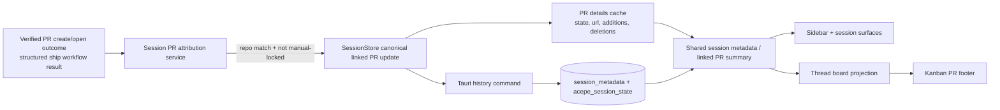

# feat: Canonical session PR linking and kanban footer

## Overview

Add one canonical session-to-PR link model that can be set automatically from verified PR create/open outcomes, overridden manually from session-level dropdown controls, and projected consistently into the sidebar, agent panel, and kanban. The kanban card will gain a dedicated bottom PR footer that shows linked PR state and diff stats, opens the Source Control PR panel on main click, and keeps the external GitHub action separate.

## Problem Frame

Acepe already persists a single `pr_number` for sessions and already knows how to open the Source Control panel to a specific PR, but the ownership model is incomplete. The current explicit ship workflow writes the link, while passive PR badge rendering does not. Kanban then has no access to the same session PR state and would need to invent a second detection path to show PR information. That would repeat the same split-brain problem Acepe has already fixed in other areas: one runtime truth in one place, multiple projections elsewhere. This plan keeps PR attribution below the UI boundary and makes kanban a projection of the shared linked-PR state rather than a new detector. (see origin: `docs/brainstorms/2026-04-23-session-pr-auto-link-and-kanban-pr-footer-requirements.md`)

## Requirements Trace

- R1. Sessions auto-link to a PR only from verified create/open outcomes.
- R2. Auto-link uses the balanced rule: explicit PR action plus concrete PR URL/number.
- R3. Mentions, badges, prose, and markdown shorthand never auto-link a PR.
- R4. Auto-link only accepts PRs from the session's current repository.
- R5. Latest valid automatic PR wins while the session remains automatically linked.
- R6. Users can manually override the linked PR from a session-level dropdown.
- R7. Manual override locks the link until the user changes it again.
- R8. Existing manual-link fallback remains available.
- R9. Sidebar, session surfaces, and kanban all read the same persisted session PR link.
- R10. Kanban shows PR UI only when the shared link exists.
- R11. The kanban PR footer opens the Source Control PR panel on main click.
- R12. The kanban PR footer includes a separate GitHub action that opens externally without triggering the main footer action.
- R13. Kanban PR diff stats come from the linked PR, not local diff tallies.
- R14. When the PR footer exists, the kanban header diff is removed.

## Scope Boundaries

- No auto-linking from passive PR mentions, rendered badges, or transcript-only parsing.
- No support for multiple simultaneous linked PRs per session.
- No automatic linking to PRs from a different repository than the session's current project.
- No redesign of Source Control panel behavior beyond opening the existing PR target from new surfaces.
- No persistence of full PR detail payloads in the database; only canonical link ownership and link mode become durable.

## Context & Research

### Relevant Code and Patterns

- `packages/desktop/src-tauri/src/db/repository.rs` already composes `session_metadata` plus `acepe_session_state`, and `set_title_override(...)` is the strongest local pattern for Acepe-owned overlay state that must survive transcript rescans.
- `packages/desktop/src-tauri/src/history/commands/session_loading.rs`, `packages/desktop/src-tauri/src/history/commands/scanning.rs`, and `packages/desktop/src-tauri/src/session_jsonl/types.rs` already thread persisted metadata into startup scans and hydrated session responses.
- `packages/desktop/src/lib/acp/store/session-store.svelte.ts` already owns a deduplicated PR details cache and updates ephemeral `prState` from `tauriClient.git.prDetails(...)`.
- `packages/desktop/src/lib/acp/components/agent-panel/services/agent-panel-ship-workflow.ts` is the current strong-signal path that writes `prNumber` after a verified PR create/open result.
- `packages/desktop/src/lib/acp/services/github-service.ts` already provides cached `getRepoContext(...)`, uncached `listPullRequests(...)`, and PR diff/repo helpers that can power repo verification and override selection.
- `packages/desktop/src/lib/components/ui/session-item/session-item.svelte` and `packages/desktop/src/lib/acp/components/agent-panel/components/agent-panel-header.svelte` already expose session-level dropdown menus that can host a shared override control.
- `packages/desktop/src/lib/components/main-app-view/components/content/kanban-view.svelte`, `packages/desktop/src/lib/acp/store/thread-board/thread-board-item.ts`, `packages/ui/src/components/kanban/types.ts`, `packages/ui/src/components/kanban/kanban-scene-types.ts`, `packages/ui/src/components/kanban/kanban-scene-board.svelte`, and `packages/ui/src/components/kanban/kanban-card.svelte` show the current kanban projection path and its single-footer limitation.

### Institutional Learnings

- `docs/solutions/logic-errors/operation-interaction-association-2026-04-07.md` — canonical ownership belongs below the UI boundary; projections should consume one resolved answer instead of re-matching raw transport artifacts.
- `docs/solutions/logic-errors/kanban-live-session-panel-sync-2026-04-02.md` — kanban remains stable only when it projects real canonical state instead of inventing a parallel model.
- `docs/solutions/best-practices/provider-owned-policy-and-identity-not-ui-projections-2026-04-09.md` — shared runtime code should consume typed domain metadata rather than infer behavior from UI projections.

### External References

- None. The repo already has direct local patterns for overlay persistence, PR detail caching, repo-context lookup, and projection-first kanban design.

## Key Technical Decisions

- **Persist link mode in the Acepe-owned session overlay:** keep one linked PR number per session, but extend `acepe_session_state` with explicit link mode so manual override survives rescans and startup restore.
- **Keep auto-link attribution in one shared service with an explicit day-one contract:** this phase accepts automatic candidates only from structured ship workflow results that already distinguish `created` vs `opened_existing`. Any future non-ship source must first normalize itself into the same verified create/open contract before it is allowed to auto-link. Markdown badge rendering, raw prose, and arbitrary tool output stay out of scope for automatic attribution in this phase.
- **Verify repo ownership before accepting a candidate using the existing repo-context cache:** reuse `getRepoContext(...)` as-is for the running app session, reject candidates on cache miss or lookup error, and treat remote rewrites during an active session as unsupported rather than inventing a second verification path.
- **Persist only link ownership, cache presentation details:** store `prNumber` and manual-vs-automatic link mode durably, but keep PR title/state/url/diff stats as ephemeral cached details refreshed from GitHub.
- **Use one compact PR picker flow everywhere:** the session row menu and agent panel header both open the same anchored popover picker (not a cascading submenu), with current-link summary, searchable open-PR list, explicit empty/error states, and mode-aware actions.
- **Manual mode can revert only to automatic, not to a permanent opt-out:** the picker exposes `Use automatic linking` when the session is manual-locked; choosing it clears the manual lock and clears the current linked PR until the next valid automatic candidate arrives. This phase does not add a separate "never auto-link this session" mode.
- **Model kanban PR summary as a dedicated bottom footer section, not a new mutually-exclusive footer variant:** question/permission/plan-approval footers must keep working, while PR summary renders as the final footer block and becomes the canonical diff location for linked sessions.
- **Keep automatic replacement silent:** when a later valid automatic candidate replaces an earlier automatic link, Acepe updates the linked PR in place without toast or activity noise; visibility comes from the updated badge, panel state, and kanban footer.
- **Define PR detail refresh and footer rendering now:** when a linked PR changes or a PR mutation action completes, Acepe refreshes that PR immediately; while refresh is in flight, surfaces keep the last known summary or show number/state with skeleton diff/title placeholders rather than blanking the footer.
- **Keep existing direct PR-open behavior intact:** PR badges and Git panel navigation remain valid entry points; the new work unifies state ownership rather than replacing those actions.

## Open Questions

### Resolved During Planning

- **Should passive PR mentions or rendered badges assign ownership?** No. Auto-link only from verified create/open outcomes with concrete PR identity. (R2, R3)
- **Should the override lock survive rescans and restart?** Yes. The lock is part of canonical session state, so it must live in persistent overlay data rather than in-memory UI state. (R6, R7)
- **Should kanban reuse the existing footer union for PR UI?** No. PR summary needs its own bottom footer section so it can coexist with interaction footers. (R10-R14)
- **Should PR diff stats be persisted?** No. They should reuse the existing PR details cache and refresh path so DB state only tracks ownership. (R9, R13)
- **Should the session-level override live in more than one surface?** Yes. Reuse one shared control in both the sidebar session row dropdown and the agent panel header overflow menu so session-level behavior is consistent. (R6, R9)
- **What satisfies the existing manual-link fallback requirement?** The direct user-initiated session PR selection path remains available at all times through the session-level override picker, even when there is no valid automatic candidate. (R8)
- **What exactly counts as a verified automatic signal in this phase?** Only the existing structured ship workflow result that reports `pr.status` of `created` or `opened_existing` with a concrete PR number for the current repo. Raw tool output, markdown badges, and passive transcript mentions do not auto-link in this phase. (R1-R4)
- **What is the override interaction model?** A dropdown item opens a compact anchored popover picker with a search box, a scrollable open-PR list, explicit `No open pull requests` empty state, explicit error state, and a `Use automatic linking` action when the current link is manual. (R6-R8)
- **What happens when a user leaves manual mode?** `Use automatic linking` clears the manual lock and clears the current linked PR immediately; the next valid automatic candidate becomes the active link. There is no separate permanent opt-out mode in this phase. (R6, R7)
- **What is the PR refresh cadence?** Load linked PR details on session hydration, immediately refresh when a link is created or manually changed, and force-refresh once after merge or other explicit PR mutation actions. Repeated reads within the current cache window reuse the existing dedupe/cache path. (R9, R13)
- **How are stale or loading PR details rendered?** Sidebar and panel surfaces keep their current badge behavior; kanban shows PR number/state immediately and uses last-known title/diff data when available, otherwise renders footer skeleton placeholders until the refresh completes. (R10-R14)
- **Should automatic replacement emit a notification?** No. Automatic link replacement stays silent unless the user manually opens the override picker. (R5)

## High-Level Technical Design

> *This illustrates the intended approach and is directional guidance for review, not implementation specification. The implementing agent should treat it as context, not code to reproduce.*



| Current link mode | Incoming signal | Outcome |
|---|---|---|
| unset / automatic | valid same-repo create/open result | persist candidate PR as automatic link |
| automatic | later valid same-repo create/open result | replace previous PR with latest valid candidate |
| manual | valid automatic candidate | ignore candidate and preserve manual selection |
| manual or automatic | user selects PR from override control | persist selected PR as manual link |
| manual | user chooses `Use automatic linking` | clear manual lock and clear current linked PR until the next valid automatic candidate |
| any | mention-only, malformed, or cross-repo candidate | no change |

## Alternative Approaches Considered

- **Assign the PR when the markdown badge renders:** rejected because it would make a UI projection the hidden authority for session identity and would create false positives from passive mentions.
- **Persist full PR details in the DB:** rejected because title/state/diff stats are refreshable GitHub presentation data; persisting them would add churn and staleness risk without changing canonical ownership.
- **Make PR the existing `KanbanSceneFooterData` union:** rejected because cards can already need question, permission, or plan-approval footers; PR summary needs to stack beneath those surfaces, not replace them.

## Implementation Units

- [ ] **Unit 1: Persist linked PR mode and lock state across restore**

**Goal:** Extend the canonical session persistence path so the linked PR number and manual-vs-automatic link mode survive rescans, startup hydration, and later writes.

**Requirements:** R5, R6, R7, R8, R9

**Dependencies:** None

**Files:**
- Create: `packages/desktop/src-tauri/src/db/migrations/m20260423_000002_add_pr_link_mode_to_acepe_session_state.rs`
- Modify: `packages/desktop/src-tauri/src/db/migrations/mod.rs`
- Modify: `packages/desktop/src-tauri/src/db/entities/acepe_session_state.rs`
- Modify: `packages/desktop/src-tauri/src/db/repository.rs`
- Modify: `packages/desktop/src-tauri/src/history/commands/session_loading.rs`
- Modify: `packages/desktop/src-tauri/src/history/commands/scanning.rs`
- Modify: `packages/desktop/src-tauri/src/session_jsonl/types.rs`
- Modify: `packages/desktop/src/lib/services/claude-history-types.ts`
- Modify: `packages/desktop/src/lib/acp/application/dto/session-metadata.ts`
- Modify: `packages/desktop/src/lib/acp/application/dto/session-summary.ts`
- Modify: `packages/desktop/src/lib/acp/store/services/session-repository.ts`
- Test: `packages/desktop/src-tauri/src/db/repository_test.rs`

**Approach:**
- Add explicit PR link mode to `acepe_session_state` alongside the existing single `pr_number`, with `manual` representing the override lock and `automatic` representing system-owned attribution.
- Keep the existing session metadata row and overlay composition pattern intact: `compose_session_metadata_row(...)` should read title override and PR link mode from the same Acepe-owned overlay layer.
- Extend the existing session PR history command/client contract rather than introducing a parallel persistence path, so ship workflow writes, auto-link writes, and manual override writes all use the same durable API.
- Thread the new metadata through startup scans and hydrated session types so the frontend knows whether a restored session is still eligible for automatic replacement.

**Patterns to follow:**
- `packages/desktop/src-tauri/src/db/repository.rs` (`set_title_override`, `compose_session_metadata_row`)
- `packages/desktop/src-tauri/src/db/migrations/m20260406_000001_create_acepe_session_state.rs`
- `packages/desktop/src-tauri/src/history/commands/session_loading.rs`

**Test scenarios:**
- Happy path — persisting an automatic link stores `pr_number` plus automatic mode and returns both on startup hydration.
- Happy path — persisting a manual override stores the selected PR plus manual mode and returns both on startup hydration.
- Edge case — a session that already has a manual override keeps that override after transcript rescan or metadata refresh.
- Edge case — existing sessions with a persisted PR number but no new link-mode field still hydrate with a compatible non-manual default.
- Integration — backend session loading and scanning surfaces expose the same linked PR number/mode that the repository composes from `acepe_session_state`.

**Verification:**
- Restarted sessions restore the same linked PR mode they had before shutdown, and rescans do not erase manual locks.

- [ ] **Unit 2: Add one canonical PR attribution service for verified automatic links**

**Goal:** Accept only strong, same-repo PR create/open outcomes and route them through one shared session-link update path that respects manual locks.

**Requirements:** R1, R2, R3, R4, R5, R7, R8, R9

**Dependencies:** Unit 1

**Files:**
- Create: `packages/desktop/src/lib/acp/store/services/session-pr-link-attribution.ts`
- Create: `packages/desktop/src/lib/acp/store/__tests__/session-pr-link-attribution.vitest.ts`
- Modify: `packages/desktop/src/lib/acp/store/session-store.svelte.ts`
- Modify: `packages/desktop/src/lib/acp/store/services/tool-call-manager.svelte.ts`
- Modify: `packages/desktop/src/lib/acp/components/agent-panel/services/agent-panel-ship-workflow.ts`
- Modify: `packages/desktop/src/lib/components/main-app-view.svelte`
- Test: `packages/desktop/src/lib/acp/store/__tests__/session-pr-link-attribution.vitest.ts`

**Approach:**
- Introduce a shared attribution service that evaluates candidate signals using explicit action type, concrete PR identity, and repo-context verification before returning accept/reject.
- In this phase, accept automatic candidates only from the structured ship workflow result path when it reports `created` or `opened_existing`; do not auto-link from generic execute output, markdown badge parsing, or any other passive content.
- Reuse `getRepoContext(...)` so same-repo verification is authoritative and consistent across accepted candidate producers; on repo-context lookup miss or error, reject the candidate and leave the session unchanged.
- Replace the current `onPrNumberFound` callback wiring in `main-app-view.svelte` with service-driven candidate application below the UI boundary; projections should react to the canonical link state, not produce it.
- Route accepted candidates through one `SessionStore` update method that handles in-memory update, persistence, and the automatic-vs-manual replacement rules.
- Keep the candidate evaluator fail-closed: mention-only markdown, bare `#123`, ambiguous numbers, and cross-repo links do nothing.
- Serialize accepted candidate application per session so a slower verification result cannot overwrite a newer accepted candidate after the fact.
- Preserve the existing explicit session PR-link fallback by routing that path through the same canonical session-link update method rather than leaving a second direct persistence write path in place.
- Do not emit toast or activity noise when one automatic link replaces another; the canonical linked PR simply updates in place while the session remains in automatic mode.

**Execution note:** Start with failing attribution tests that distinguish verified structured ship results from passive PR mentions before moving any existing write paths.

**Patterns to follow:**
- `packages/desktop/src/lib/acp/components/agent-panel/services/agent-panel-ship-workflow.ts`
- `packages/desktop/src/lib/acp/services/github-service.ts` (`getRepoContext`)
- `docs/solutions/logic-errors/operation-interaction-association-2026-04-07.md`

**Test scenarios:**
- Happy path — a verified PR creation result with explicit number/URL for the session repo auto-links the session.
- Happy path — an explicit "opened existing PR" result updates the session to that PR when the session is still in automatic mode.
- Edge case — when two valid automatic candidates appear over time, the later one replaces the earlier automatic link.
- Edge case — when the session is manual-locked, later automatic candidates are ignored.
- Error path — mention-only content, malformed PR payloads, or cross-repo URLs are rejected with no session link change.
- Error path — a repo-context lookup failure rejects the candidate and preserves the existing link state.
- Integration — slower verification of an older candidate cannot overwrite a newer accepted automatic link for the same session.
- Integration — ship workflow success and manual session-level override both call the same session-link application method rather than persisting PRs independently.

**Verification:**
- Automatic PR linking behaves the same regardless of which verified producer emitted the PR outcome, and no UI renderer or markdown badge path decides ownership.

- [ ] **Unit 3: Promote linked PR details to a shared session projection**

**Goal:** Expose one shared linked-PR summary on session metadata so sidebar, panel, and kanban surfaces can consume the same state/title/url/diff information without separate GitHub fetch logic.

**Requirements:** R9, R10, R13

**Dependencies:** Unit 1

**Files:**
- Create: `packages/desktop/src/lib/acp/application/dto/session-linked-pr.ts`
- Modify: `packages/desktop/src/lib/acp/application/dto/session-metadata.ts`
- Modify: `packages/desktop/src/lib/acp/application/dto/session-summary.ts`
- Modify: `packages/desktop/src/lib/acp/store/session-store.svelte.ts`
- Modify: `packages/desktop/src/lib/acp/types/thread-display-item.ts`
- Test: `packages/desktop/src/lib/acp/store/__tests__/session-store-pr-state-cache.vitest.ts`

**Approach:**
- Replace the current "PR state only" update with a richer shared linked-PR summary populated from the existing `prDetails` fetch path: number, state, URL, title, additions, deletions, and any other footer-needed fields that are already present in `PrDetails`.
- Keep the existing cache and in-flight dedupe strategy keyed by `projectPath::prNumber`, so multiple sessions pointing at the same PR reuse one fetch and one refresh result.
- Preserve the current non-invasive update behavior: refreshing PR details must not bump session `updatedAt`.
- Expose the linked-PR summary through session DTOs and display-item types so downstream UI surfaces do not call `tauriClient.git.prDetails(...)` directly.
- Refresh linked PR details at three moments only: on session hydration for sessions that already have a linked PR, immediately after a new automatic or manual link is persisted, and once after explicit PR mutation actions such as merge complete.
- While a refresh is in flight, keep the last known summary in memory; if no summary exists yet, expose a partial linked-PR model with number/state available and nullable title/diff fields so UI surfaces can render deterministic placeholders instead of disappearing content.

**Technical design:** *(directional guidance, not implementation specification)*

```text
SessionLinkedPr {
  prNumber: number
  state: "OPEN" | "CLOSED" | "MERGED"
  url: string | null
  title: string | null
  additions: number
  deletions: number
  isDraft: boolean
}
```

**Patterns to follow:**
- `packages/desktop/src/lib/acp/store/session-store.svelte.ts` (`prDetailsCache`, `refreshSessionPrState`)
- `packages/desktop/src/lib/acp/store/__tests__/session-store-pr-state-cache.vitest.ts`

**Test scenarios:**
- Happy path — fetching PR details populates shared linked-PR summary fields including state, URL, additions, and deletions.
- Happy path — two sessions linked to the same PR reuse the cached fetch and receive the same summary update.
- Edge case — a PR state change updates the linked summary without mutating the session's historical `updatedAt`.
- Edge case — a newly linked PR with no cached details yet exposes partial summary data so UI surfaces can render number/state plus placeholders.
- Error path — a failed PR details fetch keeps the persisted link number intact and does not clear the last known summary unexpectedly.
- Integration — a merge-complete action invalidates the current cache entry and triggers one forced refresh for that PR.
- Integration — sidebar/panel/kanban-ready session data can read linked PR details from session metadata without each surface issuing its own GitHub request.

**Verification:**
- The app has one shared linked-PR summary shape that all UI surfaces can project from, and PR detail caching remains deduplicated.

- [ ] **Unit 4: Add shared session-level manual override controls**

**Goal:** Let users override the linked PR from session-level dropdown controls in the sidebar and agent panel while preserving existing PR-open behavior.

**Requirements:** R6, R7, R8, R9

**Dependencies:** Units 1, 2, 3

**Files:**
- Create: `packages/ui/src/components/session-pr-link-menu/session-pr-link-menu.svelte`
- Create: `packages/ui/src/components/session-pr-link-menu/session-pr-link-menu.test.ts`
- Create: `packages/desktop/src/lib/acp/components/shared/session-pr-link-menu.svelte`
- Create: `packages/desktop/src/lib/acp/components/shared/session-pr-link-menu.vitest.ts`
- Modify: `packages/desktop/src/lib/components/ui/session-item/session-item.svelte`
- Modify: `packages/desktop/src/lib/acp/components/agent-panel/components/agent-panel-header.svelte`
- Modify: `packages/desktop/src/lib/acp/components/agent-panel/types/agent-panel-header-props.ts`
- Modify: `packages/desktop/src/lib/acp/components/agent-panel/components/agent-panel.svelte`
- Modify: `packages/ui/src/index.ts`
- Test: `packages/desktop/src/lib/acp/components/shared/session-pr-link-menu.vitest.ts`

**Approach:**
- Keep the desktop wrapper responsible for repo lookup and persistence, but move the picker shell itself into `@acepe/ui` so the new dropdown UI follows the existing presentational/controller package split.
- Build one shared session-scoped menu/picker flow and render it from both existing session dropdown surfaces rather than duplicating picker logic.
- Use `getRepoContext(...)` and `listPullRequests(...)` to populate the current repo's PR choices, fetch once per picker open, and persist the selected PR as a manual link through the same canonical session-link update method introduced in Unit 2.
- Keep the direct PR badge action unchanged; the new menu is for override/selection, not for replacing the existing "open linked PR" affordance.
- Reflect the current linked PR and its link mode in the menu state so the user knows whether they are replacing an automatic link or a previous manual choice.
- Keep the existing explicit manual-link fallback alive by reusing the same canonical session-link update method even when no automatic candidate exists.
- The picker interaction is fixed for this phase: a dropdown item opens a compact anchored popover with current-link summary at the top, a search input, a max-height scrollable list of open PRs, and footer actions.
- When the session is manual-locked, the picker shows `Use automatic linking`; selecting it clears the manual lock and clears the current linked PR so the next valid automatic candidate can relink the session. There is no separate permanent opt-out action in this phase.
- When `listPullRequests(...)` returns an empty array, the picker shows `No open pull requests in this repository` instead of a blank list.
- Keyboard and accessibility behavior is part of the contract: the picker is reachable from the dropdown by keyboard, arrow-key navigable within the list, closes on Escape, and returns focus to the invoking menu item.

**Patterns to follow:**
- `packages/desktop/src/lib/components/ui/session-item/session-item.svelte`
- `packages/desktop/src/lib/acp/components/agent-panel/components/agent-panel-header.svelte`
- `packages/desktop/src/lib/acp/services/github-service.ts` (`listPullRequests`)

**Test scenarios:**
- Happy path — selecting a PR from the override control updates the session immediately and persists manual mode.
- Happy path — the same shared control works from both the sidebar row menu and the agent panel header menu.
- Edge case — a session with no current linked PR can still select a PR manually from the dropdown flow.
- Edge case — selecting a different PR replaces the previous manual choice and keeps the session in manual mode.
- Edge case — selecting `Use automatic linking` from a manual session clears the manual lock and clears the current linked PR until a future automatic candidate arrives.
- Edge case — an empty open-PR result renders the explicit empty state instead of a blank menu.
- Error path — repository lookup or PR-list loading failure leaves the current session link unchanged and surfaces an explicit disabled/error state.
- Integration — keyboard open/close, Escape dismissal, and focus return behave the same in the sidebar menu and the agent panel header menu.
- Integration — after a manual override, a later automatic candidate is ignored until the user changes the linked PR again from the override control.

**Verification:**
- Users can change the linked PR from either session-level dropdown surface, and that manual choice survives reload and blocks automatic replacement.

- [ ] **Unit 5: Thread linked PR state into kanban and render the PR footer**

**Goal:** Project the shared linked PR into kanban cards and render a dedicated bottom PR footer that owns PR navigation and PR-based diff stats.

**Requirements:** R9, R10, R11, R12, R13, R14

**Dependencies:** Unit 3

**Files:**
- Modify: `packages/desktop/src/lib/acp/store/thread-board/thread-board-item.ts`
- Modify: `packages/desktop/src/lib/components/main-app-view/components/content/kanban-view.svelte`
- Modify: `packages/ui/src/components/kanban/types.ts`
- Modify: `packages/ui/src/components/kanban/kanban-scene-types.ts`
- Modify: `packages/ui/src/components/kanban/kanban-scene-board.svelte`
- Create: `packages/ui/src/components/kanban/kanban-scene-pr-footer.svelte`
- Create: `packages/ui/src/components/kanban/kanban-scene-pr-footer.test.ts`
- Modify: `packages/ui/src/components/kanban/kanban-card.svelte`
- Modify: `packages/ui/src/index.ts`
- Modify: `packages/desktop/src/lib/components/main-app-view/components/content/kanban-view.test.ts`
- Modify: `packages/desktop/src/lib/components/main-app-view/components/content/desktop-kanban-scene.test.ts`
- Test: `packages/ui/src/components/kanban/kanban-scene-pr-footer.test.ts`

**Approach:**
- Thread the shared linked-PR summary from session metadata into `ThreadBoardSource`/`ThreadBoardItem` as `linkedPr: SessionLinkedPr | null`, then into `KanbanSceneCardData`.
- Extend the kanban scene contract with `prFooter: KanbanScenePrFooterData | null` and `hideHeaderDiff: boolean` so `kanban-card.svelte` can stay presentational while rendering both an interaction footer and a dedicated PR footer.
- Add a second `bottomFooter` snippet slot to `kanban-card.svelte`; the existing `footer` slot continues to render question/permission/plan-approval content, and `bottomFooter` renders the PR block as the final section.
- Keep `KanbanScenePrFooterData` pure data; `kanban-scene-board.svelte` receives desktop-provided `onPrFooterOpen(cardId)` and `onPrFooterOpenExternal(cardId)` handlers and passes them into the presentational PR footer component.
- Use the main PR footer click to call the desktop-provided handler that opens the existing Source Control PR panel via the same `initialTarget.prNumber` flow the Git panel already supports.
- Add a separate GitHub action button that stops propagation and opens the external PR URL directly.
- Suppress the header `DiffPill` whenever `hideHeaderDiff` is true, and source footer diff stats from the linked PR summary rather than local session insertions/deletions.
- The kanban PR footer has three visual states in this phase: resolved (full title/state/diff data), refreshing (last-known data plus subtle loading treatment), and cold-start partial (PR number/state plus skeleton title/diff placeholders).
- Accessibility is explicit: the main footer region is keyboard-activatable with `Open PR #N in Source Control` labelling, and the external action is a separate button with its own `Open PR #N on GitHub` label that does not bubble to the parent click target.

**Technical design:** *(directional guidance, not implementation specification)*

```text
KanbanScenePrFooterData {
  prNumber: number
  state: "OPEN" | "CLOSED" | "MERGED"
  title: string | null
  url: string | null
  additions: number
  deletions: number
  isLoading: boolean
  hasResolvedDetails: boolean
}
```

**Patterns to follow:**
- `packages/desktop/src/lib/components/main-app-view/components/content/kanban-view.svelte`
- `packages/ui/src/components/kanban/kanban-scene-board.svelte`
- `packages/ui/src/components/kanban/kanban-card.svelte`
- `packages/desktop/src/lib/acp/components/git-panel/git-panel.svelte` (initial target PR navigation)
- `docs/solutions/logic-errors/kanban-live-session-panel-sync-2026-04-02.md`

**Test scenarios:**
- Happy path — a linked session card renders a PR footer with PR number, state icon, and PR diff stats from linked PR details.
- Happy path — clicking the main PR footer opens the Source Control PR view, while clicking the GitHub action opens the external URL without firing the main click handler.
- Edge case — a card with an existing question, permission, or plan-approval footer still renders that interaction footer plus the PR footer as the bottom-most section.
- Edge case — an unlinked session card still shows the local header diff pill and no PR footer.
- Edge case — a cold-start linked PR with no resolved details yet renders PR number/state plus skeleton title/diff placeholders.
- Edge case — a refreshing PR footer keeps last-known data visible while indicating that a refresh is in progress.
- Error path — when a linked PR lacks an external URL temporarily, the GitHub action is disabled or hidden without breaking the main Source Control navigation.
- Integration — keyboard activation and ARIA labelling distinguish the main Source Control action from the external GitHub action.
- Integration — the same linked PR selected automatically or manually appears in both the session row badge and the kanban footer for the same session.

**Verification:**
- Kanban renders the shared linked PR as a bottom footer projection, header diff is hidden only for linked sessions, and no new PR-detection path exists inside kanban.

## System-Wide Impact

- **Interaction graph:** verified PR outcome -> attribution service -> session store canonical update -> history command -> `acepe_session_state`/`session_metadata` -> linked PR summary cache -> sidebar / agent panel / thread board / kanban projections.
- **Error propagation:** repo-context failures, PR-list failures, and PR-detail failures should fail closed. They must not synthesize links from mentions or silently replace manual selections.
- **State lifecycle risks:** rescans and startup hydration must preserve manual locks; multiple sessions can share a PR details cache entry; merge/open actions may need forced refresh after mutating PR state.
- **Ordering risks:** per-session candidate application must stay serialized so a slower verification result cannot overwrite a newer accepted automatic candidate.
- **API surface parity:** frontend history client, generated history types, session DTOs, kanban scene types, and Tauri history commands all need the same new link-mode contract.
- **Integration coverage:** restore after restart, rescan after manual override, ship workflow success, manual override success, and kanban/footer click routing all cross store/UI boundaries and need explicit coverage.
- **Unchanged invariants:** one linked PR per session remains the model; passive mentions still never link; existing PR badge click behavior still opens the Source Control PR surface; Source Control remains the canonical detailed PR view.

## Risks & Dependencies

| Risk | Mitigation |
|------|------------|
| False-positive auto-link from ambiguous output | Accept only explicit create/open outcomes with concrete PR identity and same-repo verification; fail closed on mentions or malformed payloads. |
| Manual override lost after rescan or restart | Persist link mode in `acepe_session_state` and add restore/regression coverage at the repository and startup-loading layers. |
| Footer stacking breaks existing question/permission behavior | Model PR summary as a dedicated bottom footer slot and add scene contract tests for cards that need both interaction and PR surfaces. |
| Excess GitHub traffic from new kanban/footer consumers | Reuse the existing PR details cache and repo-context cache; keep kanban on the shared session summary instead of per-card fetches. |

## Documentation / Operational Notes

- Add a short `CHANGELOG.md` entry when this ships because it changes visible session and kanban behavior.
- The database change is local-only and should backfill existing rows safely; no cross-repo migration or rollout coordination is needed.
- No feature flag is required by current requirements, but implementation should keep the migration and UI projection changes separately testable so regressions are easy to isolate.

## Sources & References

- **Origin document:** `docs/brainstorms/2026-04-23-session-pr-auto-link-and-kanban-pr-footer-requirements.md`
- Related code: `packages/desktop/src-tauri/src/db/repository.rs`
- Related code: `packages/desktop/src/lib/acp/store/session-store.svelte.ts`
- Related code: `packages/desktop/src/lib/components/main-app-view/components/content/kanban-view.svelte`
- Related code: `packages/ui/src/components/kanban/kanban-card.svelte`
- Related solution: `docs/solutions/logic-errors/operation-interaction-association-2026-04-07.md`
- Related solution: `docs/solutions/logic-errors/kanban-live-session-panel-sync-2026-04-02.md`
- Related solution: `docs/solutions/best-practices/provider-owned-policy-and-identity-not-ui-projections-2026-04-09.md`
