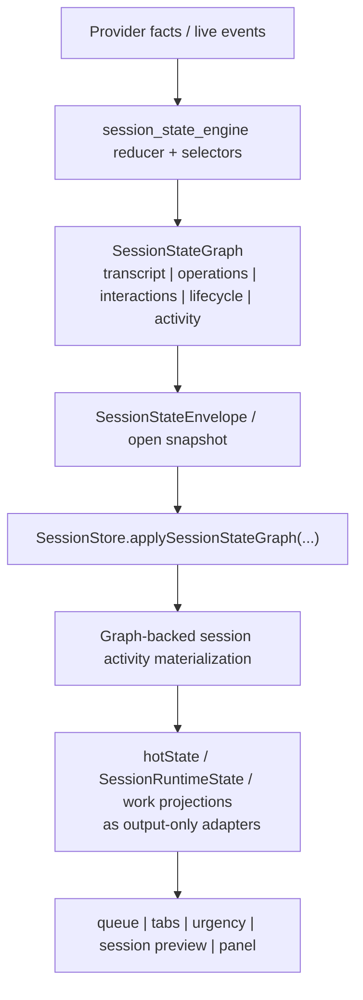
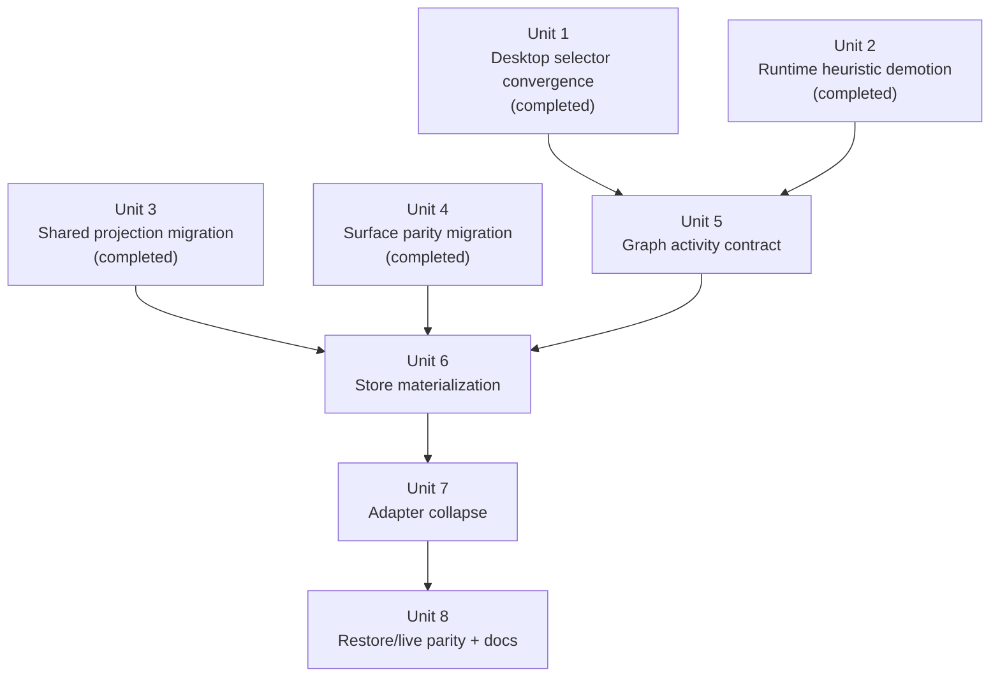

# refactor: Graph-authoritative session activity ownership

## Overview

The first implementation slice fixed app-wide drift like `"Planning next moves"` appearing while real tool or sub-agent work was still active by converging desktop surfaces onto one shared selector. That slice is useful, but it is still not the target architecture. Session activity is still assembled in desktop code from `runtimeState`, `hotState`, active tool-call state, and interaction snapshots instead of arriving through the revisioned session graph authority path.

This plan updates the existing work in place so the next slice finishes the architectural move: session activity should become graph-backed canonical state, materialized through `SessionStateEnvelope` and `SessionStore.applySessionStateGraph(...)`, with desktop stores and selectors consuming that authority rather than reconciling multiple desktop-side inputs.

## Problem Frame

Acepe's authority docs already define the desired shape:

- provider facts and live events remain restore authority (see origin: `docs/brainstorms/2026-04-22-provider-authoritative-session-restore-requirements.md`)
- the revisioned session graph is the only durable product-state authority (`docs/concepts/session-graph.md`, `docs/solutions/architectural/revisioned-session-graph-authority-2026-04-20.md`)
- desktop stores and selectors should materialize canonical graph state, not recreate it from transcript rows, hot-state, or raw timing (`docs/concepts/session-lifecycle.md`, `docs/concepts/operations.md`, `docs/concepts/interactions.md`)

The current PR-sized slice improved surface parity, but it still stops one level too high in the pipeline:

```text
current follow-on gap

SessionStateEnvelope / SessionStateGraph
  -> SessionStore
  -> runtimeState + hotState + currentStreamingToolCall + interactionSnapshot
  -> desktop canonical selector
  -> UI

target shape

SessionStateEnvelope / SessionStateGraph
  -> graph-backed activity authority
  -> SessionStore materialization
  -> thin adapters / UI projections
  -> UI
```

That remaining gap matters for exactly the reasons the architecture docs warn about:

- desktop code is still reconciling multiple semi-authoritative inputs
- `hotState` remains a compatibility bridge that can still shape activity truth
- concurrent sub-agent or child-operation activity is flattened to "some active tool call exists"
- restore and live paths are still not obviously using the same activity authority contract

The goal of this updated plan is therefore narrower and cleaner than "more selector cleanup": make session activity part of the graph-backed authority path for this pipeline, then let desktop surfaces consume that materialized result.

## Requirements Trace

- R1. Session activity authority must come from the revisioned session graph path (`provider facts -> SessionSupervisor -> canonical session graph -> desktop stores/selectors -> UI`) rather than from desktop recomputation over `runtimeState`, `hotState`, transcript history, or raw transport timing (`docs/concepts/session-graph.md` invariants 1, 4, 6).
- R2. Live attached sessions and cold-open / restore paths must expose the same activity contract for the same canonical graph state (origin R3, R8).
- R3. The activity contract must preserve operation topology well enough to distinguish "no active work" from "active work exists", including nested child work and multiple concurrent sub-agents or operations.
- R4. Transcript rows remain presentation history only; hot-state, `SessionRuntimeState`, `SessionState`, and `SessionStatus` may survive as compatibility adapters or caches but must not remain upstream activity authorities.
- R5. Queue, tabs, sidebar/session preview, urgency, and panel surfaces must all consume the same graph-backed activity answer.
- R6. Lifecycle-only or raw-event update paths must not become a second activity authority. If activity changes, the authoritative envelope path must carry or refresh the same graph-backed truth.
- R7. Regression coverage must prove parity across live, restore, nested-operation, multi-subagent, waiting-for-user, paused, idle, and error cases.

## Scope Boundaries

- This plan does **not** redesign provider transport, transcript rendering, or general runtime/capability architecture outside the session-activity authority seam.
- This plan does **not** require a user-visible copy rewrite. `"Planning next moves"` remains valid for true `awaiting_model`.
- This plan does **not** remove compatibility adapters immediately if they are still useful as output-only projections during migration.
- This plan does **not** require every UI component to understand operation graphs directly; shared store materializers and selectors remain the presentation boundary.
- This plan does **not** attempt to solve unrelated launch/runtime resolution work from `docs/brainstorms/2026-04-19-unified-agent-runtime-resolution-requirements.md`, though it follows the same "one authority, adapters at the edge" principle.

## Context & Research

### Relevant Code and Patterns

- `packages/desktop/src-tauri/src/acp/session_state_engine/graph.rs` defines the canonical `SessionStateGraph` contract that should become the upstream owner of activity truth.
- `packages/desktop/src-tauri/src/acp/session_state_engine/snapshot_builder.rs` seeds graph state during cold-open materialization, so any graph-backed activity contract must be present here to preserve restore/live parity.
- `packages/desktop/src-tauri/src/acp/session_state_engine/selectors.rs` already owns graph lifecycle and capabilities projections, making it the natural home for a graph-authoritative activity summary or selector output.
- `packages/desktop/src/lib/services/acp-types.ts` is the TypeScript contract mirror for `SessionStateGraph`, `SessionStateEnvelope`, and `SessionProjectionSnapshot`.
- `packages/desktop/src/lib/acp/session-state/session-state-command-router.ts` and `packages/desktop/src/lib/acp/store/session-store.svelte.ts` are the desktop authority bridge: envelopes become store commands, then `applySessionStateGraph(...)` materializes canonical state.
- `packages/desktop/src/lib/acp/store/live-session-work.ts` is still the compatibility seam that recomposes activity from `runtimeState`, `hotState`, active operation, and interaction snapshot. This is the primary non-authoritative bridge to remove or shrink.
- `packages/desktop/src/lib/acp/store/operation-store.svelte.ts` already owns canonical operation identity and parent/child structure. The updated plan should preserve that ownership while making session activity consume its graph-backed summary rather than desktop truthiness checks.
- `packages/desktop/src/lib/acp/store/operation-association.ts` already demonstrates the preferred pattern: store-layer deterministic association first, many surfaces consuming the same answer.

### Institutional Learnings

- `docs/solutions/architectural/revisioned-session-graph-authority-2026-04-20.md` makes the core rule explicit: transcript, runtime, operations, and interactions must all travel through the revisioned graph authority path.
- `docs/solutions/logic-errors/operation-interaction-association-2026-04-07.md` documents that blockers and live work should be resolved at the store/association layer, not inside components.
- `docs/solutions/logic-errors/kanban-live-session-panel-sync-2026-04-02.md` shows the same smell in another surface family: one runtime owner, many projections.
- `docs/solutions/best-practices/reactive-state-async-callbacks-svelte-2026-04-15.md` reinforces the broader rule: navigate and render from canonical state, not display labels or local derived booleans.

### External References

- None. The local architecture docs and current graph/envelope implementation are sufficient for planning this follow-on slice.

## Key Technical Decisions

- **Promote activity to the graph authority path**: session activity should become a graph-backed contract or graph-selector output emitted from the backend session-state engine, not a desktop-side selector over mixed compatibility inputs.
- **Keep operation identity and topology canonical**: the activity contract should summarize active work without replacing `OperationStore` as the owner of typed tool identity, parent/child structure, or operation details.
- **Make cardinality explicit, not boolean-only**: the new activity contract must be able to represent "multiple active operations/sub-agents exist" well enough that future UI can reason about more than `hasActiveOperation: boolean`.
- **Desktop stores materialize, not reconcile**: `SessionStore.applySessionStateGraph(...)` should hydrate activity authority directly from graph-backed data. `hotState`, runtime-state adapters, and live-session projections become outputs of that materialized truth.
- **No second authority from lifecycle-only envelopes**: if the backend continues sending lifecycle-only or delta payloads, those payloads must either carry authoritative activity updates or trigger a graph-consistent refresh path. Desktop code must not locally infer activity from lifecycle deltas alone.
- **Preserve the completed convergence slice**: the current PR remains valid as Phase 1. It removed UI drift and established vocabulary. The next phase should build on it, not throw it away.

## Open Questions

### Resolved During Planning

- **Should this remain the same plan file or become a new plan?** Update this plan in place. It is the same feature line, but the scope now explicitly expands from selector-level convergence to graph-authoritative ownership.
- **What is the correct target seam?** `SessionStateEnvelope -> routeSessionStateEnvelope(...) -> SessionStore.applySessionStateGraph(...)` is the authority path this plan should converge onto.
- **Should multiple sub-agents still collapse to a boolean?** No. The authoritative activity contract must preserve operation cardinality/topology summary, even if the first UI consumers only need a dominant activity family.

### Deferred to Implementation

- **Exact contract shape**: whether the graph-backed activity contract lands as a dedicated `activity` node on `SessionStateGraph` or as a tightly related selector payload nested under runtime is intentionally deferred, as long as it is authoritative and revisioned.
- **Exact envelope shape for incremental updates**: whether activity travels in widened lifecycle payloads, graph snapshots/deltas only, or a new payload kind is deferred. The architectural requirement is "no desktop recomputation from non-authoritative inputs," not a specific wire verb.
- **Exact adapter retirement order**: whether `live-session-work.ts` is fully deleted in this slice or retained as a thin compatibility wrapper depends on implementation blast radius.

## High-Level Technical Design

> *This illustrates the intended approach and is directional guidance for review, not implementation specification. The implementing agent should treat it as context, not code to reproduce.*



```text
directional contract sketch

SessionStateGraph
  lifecycle
  operations
  interactions
  activity
    kind: awaiting_model | running_operation | waiting_for_user | paused | error | idle
    dominant_operation_id?: ...
    active_operation_count: N
    active_subagent_count: N
    blocking_interaction_id?: ...
```

The important architectural change is not the field names. It is the ownership:

- the backend session-state engine computes activity from canonical graph inputs
- the graph/envelope path carries that answer
- desktop stores materialize it
- compatibility adapters render from it

## Implementation Units



- [x] **Unit 1: Establish desktop canonical selector convergence**

**Goal:** Remove cross-surface UI drift by routing desktop surfaces through one shared session-activity selector.

**Requirements:** R4, R5

**Dependencies:** None

**Files:**
- Create: `packages/desktop/src/lib/acp/logic/session-activity.ts`
- Create: `packages/desktop/src/lib/acp/logic/__tests__/session-activity.test.ts`
- Modify: `packages/desktop/src/lib/acp/store/live-session-work.ts`
- Modify: `packages/desktop/src/lib/acp/store/session-work-projection.ts`

**Approach:**
- Completed in PR `#173` as the proving slice.
- Established explicit activity vocabulary and cross-surface parity around one desktop selector.

**Patterns to follow:**
- `docs/concepts/session-graph.md`
- `docs/concepts/operations.md`

**Test scenarios:**
- Covered in the existing selector and live-session-work regression matrix added in PR `#173`.

**Verification:**
- The original app-wide "planning while tools are active" drift no longer reproduces in the desktop convergence slice.

- [x] **Unit 2: Demote transcript-driven runtime heuristics**

**Goal:** Re-establish `SessionRuntimeState` as lifecycle/actionability only, not an activity owner.

**Requirements:** R4

**Dependencies:** Unit 1

**Files:**
- Modify: `packages/desktop/src/lib/acp/logic/session-ui-state.ts`
- Modify: `packages/desktop/src/lib/acp/store/session-store.svelte.ts`
- Test: `packages/desktop/src/lib/acp/logic/__tests__/session-machine.test.ts`

**Approach:**
- Completed in PR `#173`.
- Removed `lastEntry` as an upstream activity authority and narrowed `showThinking` semantics.

**Patterns to follow:**
- `docs/concepts/session-lifecycle.md`

**Test scenarios:**
- Covered by the existing lifecycle/runtime characterization tests updated in PR `#173`.

**Verification:**
- Runtime state can be described in lifecycle/actionability language without transcript-order heuristics.

- [x] **Unit 3: Rewire shared projections and stores**

**Goal:** Make queue/tab/preview projections consume one desktop canonical activity answer.

**Requirements:** R5

**Dependencies:** Units 1, 2

**Files:**
- Modify: `packages/desktop/src/lib/acp/store/queue/utils.ts`
- Modify: `packages/desktop/src/lib/acp/store/tab-bar-utils.ts`
- Modify: `packages/desktop/src/lib/acp/components/activity-entry/activity-entry-projection.ts`

**Approach:**
- Completed in PR `#173`.
- Moved shared projection parity onto the desktop canonical selector.

**Patterns to follow:**
- `docs/solutions/logic-errors/operation-interaction-association-2026-04-07.md`

**Test scenarios:**
- Covered by the queue/tab/activity-entry parity tests updated in PR `#173`.

**Verification:**
- Queue, tab, and activity-entry projections no longer disagree because of surface-local heuristics.

- [x] **Unit 4: Migrate representative surfaces and rendered parity tests**

**Goal:** Remove remaining panel/surface leaks onto `runtimeState.showThinking`.

**Requirements:** R5

**Dependencies:** Unit 3

**Files:**
- Modify: `packages/desktop/src/lib/components/ui/session-item/session-item.svelte`
- Modify: `packages/desktop/src/lib/acp/components/agent-panel/components/agent-panel.svelte`
- Modify: `packages/desktop/src/lib/acp/components/agent-panel/components/agent-panel-content.svelte`
- Test: `packages/desktop/src/lib/acp/components/agent-panel/components/__tests__/agent-panel-content.svelte.vitest.ts`

**Approach:**
- Completed in PR `#173`.
- Removed the largest remaining panel-local activity leak and aligned the rendered surfaces with the selector-driven projections.

**Patterns to follow:**
- `packages/desktop/src/lib/acp/components/agent-panel/components/agent-panel.svelte`
- `packages/desktop/src/lib/components/ui/session-item/session-item.svelte`

**Test scenarios:**
- Covered by the rendered-surface and parity tests updated in PR `#173`.

**Verification:**
- Representative surfaces agree on when planning copy is valid.

- [x] **Unit 5: Add a graph-authoritative session activity contract**

**Goal:** Extend the session-state engine and graph contract so session activity becomes authoritative graph-backed state rather than a desktop-side reconciliation result.

**Requirements:** R1, R2, R3, R6

**Dependencies:** Units 1-4 (completed)

**Files:**
- Modify: `packages/desktop/src-tauri/src/acp/session_state_engine/graph.rs`
- Modify: `packages/desktop/src-tauri/src/acp/session_state_engine/selectors.rs`
- Modify: `packages/desktop/src-tauri/src/acp/session_state_engine/snapshot_builder.rs`
- Modify: `packages/desktop/src-tauri/src/acp/session_state_engine/envelope.rs`
- Modify: `packages/desktop/src-tauri/src/acp/session_state_engine/protocol.rs`
- Modify: `packages/desktop/src-tauri/src/acp/session_state_engine/runtime_registry.rs`
- Modify: `packages/desktop/src/lib/services/acp-types.ts`
- Test: `packages/desktop/src/lib/services/acp-types.test.ts`
- Test: `packages/desktop/src-tauri/src/acp/session_state_engine/snapshot_builder.rs`
- Test: `packages/desktop/src-tauri/src/acp/session_state_engine/selectors.rs`
- Test: `packages/desktop/src-tauri/src/acp/session_state_engine/runtime_registry.rs`

**Approach:**
- Add a graph-backed activity contract that is derived from canonical lifecycle, operations, interactions, and failure state inside the session-state engine rather than inside desktop Svelte code.
- Preserve `OperationStore` as the owner of typed operation identity, while letting the activity contract summarize dominant activity and active-work topology for session-level rendering.
- Include enough topology/cardinality data to avoid reducing "multiple concurrent sub-agents" to a boolean-only truthiness signal.
- Make the graph/open-snapshot contract capable of expressing the same activity truth for restore and live sessions.
- Update live runtime-registry envelope emission so attached sessions publish the same graph-backed activity authority that cold-open materialization reads from snapshots.

**Technical design:** *(directional guidance, not implementation specification)*

```text
backend selector inputs:
  lifecycle
  operations
  interactions
  active_turn_failure

backend selector output:
  graph activity summary
    - dominant activity kind
    - active operation cardinality/topology summary
    - dominant operation linkage
    - blocking interaction linkage
```

**Patterns to follow:**
- `docs/concepts/session-graph.md`
- `docs/concepts/operations.md`
- `docs/concepts/interactions.md`
- `docs/solutions/architectural/revisioned-session-graph-authority-2026-04-20.md`

**Test scenarios:**
- Happy path: a graph with no active operations and lifecycle waiting for model output materializes `awaiting_model`.
- Happy path: a graph with one running operation materializes `running_operation` with non-zero active-operation count.
- Edge case: parent task is terminal but a child/sub-agent operation remains active, and the graph still materializes active work.
- Edge case: multiple concurrent sub-agents or operations are active, and the graph contract preserves count/topology instead of flattening to a single boolean.
- Edge case: pending interaction plus active operation yields `waiting_for_user` while preserving linkage back to the blocked work.
- Edge case: paused lifecycle still dominates running operations.
- Error path: active turn failure or failed lifecycle dominates all non-error activity kinds.
- Integration: cold-open graph materialization and live envelope materialization produce the same activity contract for the same canonical state.

**Verification:**
- Session activity can be explained entirely from the graph contract without mentioning `hotState`, `runtimeState`, or transcript ordering.

- [x] **Unit 6: Materialize graph-backed activity in the desktop authority path**

**Goal:** Hydrate authoritative session activity through `SessionStore.applySessionStateGraph(...)` and envelope routing so desktop stores consume graph-backed truth directly.

**Requirements:** R1, R2, R4, R6

**Dependencies:** Unit 5

**Files:**
- Modify: `packages/desktop/src/lib/acp/store/session-store.svelte.ts`
- Modify: `packages/desktop/src/lib/acp/session-state/session-state-command-router.ts`
- Modify: `packages/desktop/src/lib/acp/store/session-event-service.svelte.ts`
- Modify: `packages/desktop/src/lib/acp/store/session-event-handler.ts`
- Modify: `packages/desktop/src/lib/acp/store/session-hot-state-store.svelte.ts`
- Test: `packages/desktop/src/lib/acp/store/__tests__/session-store-projection-state.vitest.ts`
- Test: `packages/desktop/src/lib/acp/store/__tests__/session-event-service-streaming.vitest.ts`

**Approach:**
- Materialize authoritative activity from graph/envelope data at the store boundary instead of recomputing it later from `hotState` and active tool selectors.
- Ensure open/snapshot, replace-graph, and incremental envelope paths all hydrate the same authority model.
- Reframe `SessionHotState` as a compatibility/output cache fed from graph-backed activity rather than an upstream activity input.
- Keep pending-session buffering and envelope ordering intact so activity truth remains revision-safe during registration and reconnect.

**Execution note:** Start with failing store-level parity tests for "same graph state through snapshot vs envelope path" before changing desktop materialization.

**Patterns to follow:**
- `packages/desktop/src/lib/acp/store/session-store.svelte.ts`
- `packages/desktop/src/lib/acp/session-state/session-state-command-router.ts`
- `docs/solutions/architectural/revisioned-session-graph-authority-2026-04-20.md`

**Test scenarios:**
- Happy path: snapshot materialization hydrates the same activity authority the UI later reads.
- Happy path: live envelope updates advance activity authority without requiring `hotState`-based recomputation.
- Edge case: pending session buffering delays activity side effects until session registration, then replays the same authoritative result.
- Edge case: reconnect / restore with no live runtime registry entry still hydrates the correct activity state from stored graph data.
- Error path: lifecycle error and active turn failure update graph-backed activity and compatibility caches consistently.
- Integration: `applySessionStateGraph(...)` and `applySessionStateEnvelope(...)` produce the same materialized activity for the same revisioned state.

**Verification:**
- The store authority path can answer "what is this session doing now?" without consulting `live-session-work.ts`.

- [x] **Unit 7: Collapse desktop adapters onto graph-backed activity**

**Goal:** Convert desktop compatibility layers into output-only adapters over authoritative graph-backed activity, then remove desktop-side activity reconciliation as an authority path.

**Requirements:** R1, R4, R5

**Dependencies:** Unit 6

**Files:**
- Modify: `packages/desktop/src/lib/acp/store/live-session-work.ts`
- Modify: `packages/desktop/src/lib/acp/store/session-work-projection.ts`
- Modify: `packages/desktop/src/lib/acp/logic/session-ui-state.ts`
- Modify: `packages/desktop/src/lib/acp/store/tab-bar-utils.ts`
- Modify: `packages/desktop/src/lib/acp/store/queue/utils.ts`
- Modify: `packages/desktop/src/lib/acp/components/activity-entry/activity-entry-projection.ts`
- Test: `packages/desktop/src/lib/acp/store/__tests__/live-session-work.test.ts`
- Test: `packages/desktop/src/lib/acp/store/__tests__/tab-bar-utils.test.ts`
- Test: `packages/desktop/src/lib/acp/store/queue/__tests__/queue-utils.test.ts`
- Test: `packages/desktop/src/lib/acp/components/activity-entry/__tests__/activity-entry-projection.test.ts`

**Approach:**
- Make `live-session-work.ts` either a thin adapter over graph-backed activity or remove it entirely as an authority seam.
- Prevent `SessionRuntimeState`, `hotState.status`, `currentStreamingToolCall`, and interaction snapshots from becoming parallel activity inputs once the graph-backed contract exists.
- Keep legacy outputs (`SessionState`, compact activity kind, `SessionStatus`) only as downstream projections from graph-backed activity.
- Preserve current-operation identity and interaction metadata as store-level selectors, but do not let them independently decide session-level activity.

**Execution note:** Add characterization coverage for any compatibility adapters that remain so implementers can shrink them safely.

**Patterns to follow:**
- `packages/desktop/src/lib/acp/store/live-session-work.ts`
- `packages/desktop/src/lib/acp/store/session-work-projection.ts`
- `docs/concepts/session-graph.md`

**Test scenarios:**
- Happy path: graph-backed `running_operation` projects to queue/tab/panel activity consistently.
- Happy path: graph-backed `awaiting_model` projects to planning/thinking states consistently.
- Edge case: multi-operation cardinality is preserved in the authority layer even when a downstream surface still renders only one dominant operation.
- Edge case: waiting-for-user, paused, idle, and error states all remain graph-driven and do not regress to hot-state heuristics.
- Error path: removing desktop reconciliation does not lose recoverable turn-failure or connection-error rendering.
- Integration: downstream projections keep working when `runtimeState` and `hotState` become output-only adapters.

**Verification:**
- Desktop code no longer needs a mixed-input selector to decide current session activity.

- [ ] **Unit 8: Lock restore/live parity, remove remaining non-authoritative bridges, and update architecture docs**

**Goal:** Finish the pipeline migration by proving restore/live parity, eliminating remaining activity authority leaks, and updating the written architecture to match the implementation.

**Requirements:** R2, R4, R5, R6, R7

**Dependencies:** Unit 7

**Files:**
- Modify: `packages/desktop/src/lib/acp/store/tab-bar-store.svelte.ts`
- Modify: `packages/desktop/src/lib/acp/store/urgency-tabs-store.svelte.ts`
- Modify: `packages/desktop/src/lib/components/ui/session-item/session-item.svelte`
- Modify: `packages/desktop/src/lib/acp/components/agent-panel/components/agent-panel.svelte`
- Modify: `packages/desktop/src/lib/acp/components/queue/queue-item.svelte`
- Modify: `docs/concepts/session-graph.md`
- Modify: `docs/concepts/session-lifecycle.md`
- Modify: `docs/concepts/operations.md`
- Modify: `docs/concepts/interactions.md`
- Test: `packages/desktop/src/lib/acp/store/__tests__/session-store-projection-state.vitest.ts`
- Test: `packages/desktop/src/lib/acp/store/__tests__/tab-bar-store.test.ts`
- Test: `packages/desktop/src/lib/acp/components/queue/__tests__/queue-item-display.test.ts`
- Test: `packages/desktop/src/lib/acp/components/agent-panel/components/__tests__/agent-panel-content.svelte.vitest.ts`

**Approach:**
- Sweep remaining callers that still derive activity from compatibility status fields instead of the graph-backed activity authority.
- Add restore/live parity scenarios that begin from canonical graph state rather than from desktop compatibility fixtures.
- Update the architecture docs so they explicitly describe session activity as part of the graph-backed authority path for this pipeline.
- Capture the completed migration as a `docs/solutions/` learning once the implementation lands.

**Execution note:** Start with failing restore/live parity tests so the final cleanup cannot quietly preserve a second authority path.

**Patterns to follow:**
- `docs/concepts/session-graph.md`
- `docs/solutions/architectural/revisioned-session-graph-authority-2026-04-20.md`
- `packages/desktop/src/lib/acp/store/__tests__/session-store-projection-state.vitest.ts`

**Test scenarios:**
- Happy path: opening a session from stored graph state and watching the same session live yield the same visible activity family.
- Happy path: true awaiting-model state still renders `"Planning next moves"` everywhere after authority migration.
- Edge case: concurrent sub-agent work never regresses to planning copy during restore or live replay.
- Edge case: pending interaction continues to dominate planning/working copy after reconnect.
- Edge case: paused and idle-with-review-cues states remain parity-safe across restore/live.
- Error path: failure and recovery affordances stay graph-authoritative after reconnect and cold-open.
- Integration: queue, tab, sidebar, preview, and panel surfaces all agree when driven from restore and live graph fixtures.

**Verification:**
- The authority story can be explained as "graph-backed activity comes through the revisioned session graph path, desktop stores materialize it, adapters render it," with no remaining caveat about desktop recomposition.

## System-Wide Impact

- **Interaction graph:** This work changes the authority edge from `runtimeState + hotState + currentStreamingToolCall + interactionSnapshot -> selector` to `SessionStateGraph / envelope -> SessionStore materialization -> adapters -> surfaces`.
- **Error propagation:** Activity authority must preserve existing error dominance so connection failures and turn failures continue to override planning/running states without requiring local surface heuristics.
- **State lifecycle risks:** Lifecycle-only envelopes, pending-session buffering, reconnect, and cold-open restore all become part of the activity-authority contract. Any one path left behind recreates split-brain behavior.
- **API surface parity:** `SessionStateGraph`, `SessionStateEnvelope`, `SessionProjectionSnapshot`, `SessionHotState`, `SessionRuntimeState`, `SessionState`, and `SessionStatus` all sit on the migration path. Reviewers should treat adapter fields as compatibility surfaces, not final authority.
- **Integration coverage:** Store-level tests alone are insufficient. This plan requires graph contract tests, store materialization tests, and cross-surface parity tests because the bug class emerges across layers.
- **Unchanged invariants:** Transcript rows remain presentation history, `OperationStore` remains the owner of operation identity/details, interactions remain canonical blockers, and provider quirks stay at the edge of the shared authority path.

## Risks & Dependencies

| Risk | Mitigation |
|------|------------|
| The plan adds a graph-backed activity field but desktop code still keeps reconciling `hotState` and `runtimeState`, leaving two authorities alive | Treat store materialization and adapter collapse as separate required units, and add restore/live parity tests that start from graph fixtures rather than compatibility inputs |
| Multi-operation/subagent topology is still collapsed to a boolean inside the new graph contract | Require explicit cardinality/topology fields in the authority contract and add dedicated multiple-active-operation tests before wiring surfaces |
| Lifecycle-only envelopes become a shadow activity authority again | Make "no second authority from lifecycle-only payloads" an explicit technical decision and test both snapshot and incremental envelope paths |
| Adapter removal breaks unrelated actionability or current-tool UI | Keep `OperationStore` ownership intact, characterize compatibility adapters first, and migrate one authority seam at a time |
| Restore/live parity remains implicit rather than proven | Require parity scenarios in store-level and rendered-surface tests, including reconnect and cold-open cases |

## Documentation / Operational Notes

- When this work lands, update `docs/concepts/session-graph.md`, `docs/concepts/session-lifecycle.md`, and `docs/concepts/operations.md` so the written architecture explicitly says session activity is graph-backed for this pipeline.
- Follow the implementation with a `docs/solutions/` write-up because this is a durable authority-pattern correction, not a one-off bug.
- No rollout flag is required. This is architectural correctness work for shared session-state authority.

## Sources & References

- **Origin document:** `docs/brainstorms/2026-04-22-provider-authoritative-session-restore-requirements.md`
- Concepts: `docs/concepts/session-graph.md`, `docs/concepts/session-lifecycle.md`, `docs/concepts/operations.md`, `docs/concepts/interactions.md`
- Related learnings: `docs/solutions/architectural/revisioned-session-graph-authority-2026-04-20.md`, `docs/solutions/logic-errors/operation-interaction-association-2026-04-07.md`, `docs/solutions/logic-errors/kanban-live-session-panel-sync-2026-04-02.md`
- Related requirements direction: `docs/brainstorms/2026-04-19-unified-agent-runtime-resolution-requirements.md`
- Authority seams: `packages/desktop/src-tauri/src/acp/session_state_engine/graph.rs`, `packages/desktop/src-tauri/src/acp/session_state_engine/selectors.rs`, `packages/desktop/src/lib/services/acp-types.ts`, `packages/desktop/src/lib/acp/store/session-store.svelte.ts`
- Related PRs: `flazouh/acepe#173`
