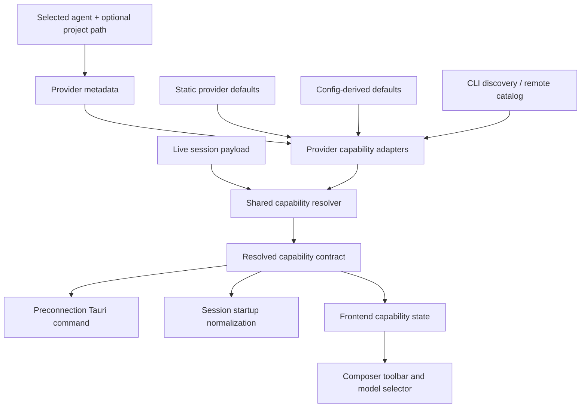
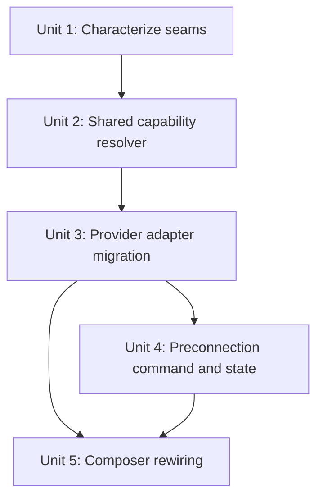

# refactor: Unified provider-owned capability resolution

## Overview

Replace the current split model/mode capability logic with one shared capability-resolution pipeline that every built-in agent uses before first connection and during session startup.

This plan intentionally targets the **capability-resolution slice** of the broader unified runtime-resolution requirements (see origin: `docs/brainstorms/2026-04-19-unified-agent-runtime-resolution-requirements.md`). The immediate user-visible outcome is that first-time agents no longer fall into the empty-state bug where the composer shows **no meaningful model** and **no mode picker**, but the architectural goal is larger: provider-specific capability sourcing moves behind one explicit adapter contract instead of remaining scattered across transport clients, config readers, and frontend caches.

**Product acceptance criterion:** for every supported built-in provider, selecting an agent in the composer must present a meaningful model selector and visible mode picker without requiring a prior session. “Meaningful” means at least one real resolved model choice or one explicitly configured current model plus a visible canonical mode set. Startup-global providers should normally satisfy this from warm preloaded capability state; project-scoped providers may show a loading state for up to the provider timeout budget, but never a blank capability area.

## Problem Frame

Today Acepe resolves models and modes through several parallel paths:

| Concern | Current owner(s) | Resulting drift |
|---|---|---|
| Live ACP capability shaping | `packages/desktop/src-tauri/src/acp/client/session_lifecycle.rs`, `packages/desktop/src-tauri/src/acp/client_session.rs` | ACP clients normalize modes and fill missing models after `session/new` / `session/resume`, but only after a session exists |
| Claude capability synthesis | `packages/desktop/src-tauri/src/acp/client/cc_sdk_client.rs`, `packages/desktop/src-tauri/src/acp/providers/claude_code.rs` | Models/modes are synthesized in the cc-sdk client instead of through a shared resolver |
| Codex capability synthesis | `packages/desktop/src-tauri/src/acp/client/codex_native_config.rs`, `packages/desktop/src-tauri/src/acp/client/codex_native_client.rs` | Codex builds its own model/mode contract in a separate native path |
| Cursor capability synthesis | `packages/desktop/src-tauri/src/acp/providers/cursor.rs`, `packages/desktop/src-tauri/src/acp/client/session_lifecycle.rs` | Cursor mixes live ACP capability shaping with discovery fallback, but that fallback is not available through one preconnection contract |
| Copilot capability defaults | `packages/desktop/src-tauri/src/acp/providers/copilot.rs`, `packages/desktop/src-tauri/src/acp/providers/copilot_settings.rs` | Copilot can inject cwd-aware config defaults, but that path is disconnected from the generic first-connection capability story |
| OpenCode capability shaping | `packages/desktop/src-tauri/src/acp/opencode/http_client/agent_client_impl.rs` | OpenCode fetches models from `/provider` and hardcodes modes in another separate path |
| Preconnection composer fallback | `packages/desktop/src/lib/acp/components/agent-input/agent-input-ui.svelte`, `packages/desktop/src/lib/acp/store/agent-model-preferences-store.svelte.ts` | First-time agents depend on stale-or-empty live-session caches, so supported providers can show no model and no mode picker before first connect |

Acepe already has the right architectural precedent for this problem. Preconnection slash commands now follow a provider-owned seam:

- provider metadata declares preconnection behavior,
- a shared backend command dispatches provider-owned loading,
- frontend state consumes one generic contract.

Model/mode capability resolution should follow the same pattern. The current split makes the product look agent-agnostic at the UI layer while still depending on provider-specific behavior hidden in transport clients and caches. That is exactly the class of drift the origin requirements document was trying to eliminate.

## Requirements Trace

**Pipeline and contract shape**

- R1. Introduce one shared capability-resolution pipeline for models and modes across every built-in provider in both preconnection and connected-session startup flows (see origin: R1, R13, R14).
- R2. The shared pipeline must emit one explicit capability contract containing available models, current model, available modes, current mode, provider metadata, and source/provenance metadata for resolved values (see origin: R2, R10, R11).

**Architecture ownership**

- R3. Provider-specific sourcing logic must live behind provider adapter hooks rather than inside `cc_sdk_client`, `session_lifecycle`, `codex_native_config`, or `opencode` HTTP client branches (see origin: R3, R6, R13).

**Runtime and UX behavior**

- R4. A selected built-in agent with no prior connected session must still provide a meaningful model selection and visible mode picker when the provider supports them.
- R5. Live ACP responses, static provider defaults, config-derived defaults, discovery commands, and remote catalogs must compose through one documented precedence chain instead of parallel normalization paths (see origin: R4, R5, R8).
- R6. Providers that cannot resolve capabilities before connection must return an explicit unsupported or partial capability state, not an ambiguous empty array that the frontend has to interpret heuristically.
- R6a. The composer must apply one documented frontend capability-source precedence order: live session capabilities -> `Resolved` preconnection snapshot -> persisted connected-session cache -> `Partial` preconnection snapshot -> `Failed` / `Unsupported` snapshot.

**Regression coverage**

- R7. Frontend and backend regression coverage must lock first-connection, post-connect override, and provider-specific resolution behavior across the supported providers.

## Scope Boundaries

- This plan covers **model/mode capability resolution** and the shared contracts consumed by the composer before and after connection.
- This plan does **not** redesign slash-command loading. It follows that architecture as a proven pattern.
- This plan does **not** redesign model selector visuals or the shared `@acepe/ui` toolbar shell beyond supplying authoritative capability data and a small presentational capability-status surface for loading/unsupported/error states.
- This plan does **not** introduce a generic manifest/spec system for arbitrary downloaded-agent schemas in this iteration.
- This plan does **not** deliver the full runtime inspector from the origin document. It carries capability provenance in the contract so later diagnostics surfaces can consume it without another resolver rewrite.

## Context & Research

### Relevant Code and Patterns

- `packages/desktop/src-tauri/src/acp/provider.rs` already exposes several partial capability hooks (`model_discovery_commands`, `default_model_candidates`, `visible_mode_ids`, `apply_session_defaults`, `model_fallback_for_empty_list`, `list_preconnection_commands`) but no unified capability contract.
- `packages/desktop/src-tauri/src/acp/client/session_lifecycle.rs` and `packages/desktop/src-tauri/src/acp/client_session.rs` already perform shared post-response normalization for ACP agents, especially `default_modes()` and provider mode normalization.
- `packages/desktop/src-tauri/src/acp/client/cc_sdk_client.rs` owns synthetic Claude model hydration through provider defaults and CLI discovery, bypassing a generic capability resolver.
- `packages/desktop/src-tauri/src/acp/client/codex_native_config.rs` and `packages/desktop/src-tauri/src/acp/client/codex_native_client.rs` build Codex model/mode responses entirely in the native client path.
- `packages/desktop/src-tauri/src/acp/opencode/http_client/agent_client_impl.rs` fetches OpenCode models from `/provider` and synthesizes modes in yet another path.
- `packages/desktop/src-tauri/src/acp/runtime_resolver.rs` already defines an `EffectiveRuntime` spawn-config type; this plan must avoid colliding with that existing name.
- `packages/desktop/src-tauri/src/acp/transport/events.rs` already defines transport-layer `CapabilityProvenance` and `TransportCapabilitySnapshot`, which must stay separate from the new capability-resolution contract.
- `packages/desktop/src/lib/acp/components/agent-input/agent-input-ui.svelte` currently resolves toolbar data as `live session capabilities -> persisted cache`, which is the direct cause of the first-connection empty-state bug.
- `packages/desktop/src/lib/acp/components/agent-input/logic/preconnection-remote-commands-state.svelte.ts` and `packages/desktop/src-tauri/src/acp/commands/preconnection_commands.rs` provide the exact architectural pattern this plan should mirror for generic preconnection capability loading.
- `packages/desktop/src/lib/services/acp-provider-metadata.ts` already carries provider-owned frontend metadata with explicit preconnection policy (`preconnectionSlashMode`) and built-in fallback metadata.

### Institutional Learnings

- `docs/solutions/best-practices/provider-owned-policy-and-identity-not-ui-projections-2026-04-09.md` reinforces the core rule for this refactor: shared UI/runtime code should consume provider-owned contracts directly instead of inferring behavior from display projection or ad hoc booleans.
- `docs/solutions/architectural/provider-owned-semantic-tool-pipeline-2026-04-18.md` shows the repo’s preferred pattern for this class of work: provider quirks live at the edge, shared code owns the deterministic reducer/projector contract.

### External References

- None. The codebase already has strong local patterns for this architectural seam.

## Key Technical Decisions

| Decision | Rationale |
|---|---|
| Introduce one shared `ResolvedCapabilities`-style contract for models and modes. | The composer, startup flows, and provider adapters need one authoritative capability shape instead of parallel arrays and fallback heuristics. |
| Reuse the same resolver before and after connection. | A preconnection-only API would fix the symptom but preserve drift. Live session payloads should be one input tier to the same resolver, not a separate owner. |
| Make the shared resolver a normalizer, not a fetch orchestrator. | Provider adapters own async discovery and raw capability input gathering; the shared resolver owns precedence, fallback, canonical shaping, provider metadata attachment, and provenance. This keeps the contract generic across CLI, config, HTTP, and native providers. |
| Replace the scattered capability hooks on `AgentProvider` with one capability adapter contract. | The current mix of `model_discovery_commands`, `default_model_candidates`, `visible_mode_ids`, `apply_session_defaults`, and fallback hooks is the fragmentation this plan is removing. During migration they may be consumed as lower-level primitives, but the end-state contract is singular. |
| Mirror the preconnection slash architecture. | Acepe already has a working pattern for provider metadata -> shared backend dispatch -> generic frontend state. Reusing it reduces conceptual surface area. |
| Allow OpenCode preconnection capability loading as a project-scoped runtime boot. | OpenCode does not have an offline model catalog, but Acepe already boots its project-scoped runtime pre-session for slash commands. The capability contract should make that behavior explicit instead of treating it as an accidental side path. |
| Keep a dedicated preconnection capability state/cache instead of overloading `agent-model-preferences-store`. | The existing store is a connected-session cache plus user preference storage. It is the wrong authority for first-time capability discovery. |
| Treat live session capabilities as the authoritative source once they exist. | Live session capabilities always win. Late preconnection results are dropped after live connection, and partial preconnection snapshots cannot displace a more complete persisted live cache during the pre-live phase. |
| Keep resolver provenance lightweight and distinct from transport freshness. | `ResolvedCapabilities` should carry only resolver-level winning-source metadata through a dedicated `CapabilitySourceKind` enum. It must not reuse transport-layer `CapabilityProvenance`, and it is intentionally shaped to embed into a future `EffectiveAgentContext` rather than become a competing top-level runtime contract. The existing `runtime_resolver::EffectiveRuntime` spawn-config type is out of scope for this refactor. |
| User-visible built-in providers implement the full contract now; hidden/internal providers plus custom/downloaded agents inherit an explicit unsupported adapter until they have a real capability contract. | The repo gets a clean generic interface immediately without inventing unsupported heuristics for providers that have no meaningful preconnection capability source yet. |
| Ship the full architecture in this slice rather than a temporary composer-only patch. | The user explicitly wants the god architecture now, and the origin requirements document is about eliminating fragmented ownership rather than adding another transitional layer. |

## Open Questions

### Resolved During Planning

- **Is this only a preconnection fix?** No. The empty-state bug is the forcing function, but the implementation should unify preconnection and session-start capability resolution.
- **Should the existing connected-session capability cache remain the source of truth?** No. It becomes a tertiary fallback and preference store, not the first-connection authority.
- **Should provider metadata own preconnection capability loading policy the same way it owns preconnection slash loading policy?** Yes. That keeps load strategy declarative and provider-owned.
- **Should built-in providers be allowed to keep constructing models/modes inside their transport clients?** No. Transport clients should request provider inputs and hand them to the shared resolver.
- **Should the shared resolver fetch provider data itself?** No. Provider adapters own async discovery and raw capability input gathering; the shared resolver normalizes and merges those inputs.
- **Should the plan replace the existing scattered capability hooks or layer on top of them?** Replace them with one capability adapter contract. During migration, existing hooks may survive as lower-level implementation primitives, but they are no longer the public architecture.
- **What wins when preconnection and live capability sources race?** Live session capabilities always win. If live data arrives, any later preconnection result is discarded. Before live connection, a partial preconnection snapshot cannot outrank a more complete persisted live cache.
- **Should OpenCode be treated as unsupported before connect?** No. OpenCode remains `projectScoped`, but that mode explicitly means Acepe may boot the OpenCode runtime before session creation in order to resolve capabilities, just as it already does for preconnection slash commands.
- **Does capability loading reuse `preconnectionSlashMode`?** No. Add a distinct `preconnectionCapabilityMode` field to backend and frontend provider metadata. Default it to `unsupported` for custom/downloaded agents. Built-in defaults are: Claude `startupGlobal`, Cursor `startupGlobal`, Codex `startupGlobal`, Copilot `projectScoped`, OpenCode `projectScoped`.
- **How does the new capability contract relate to existing runtime contracts?** `provider_capabilities.rs` remains the authoritative static provider composition registry; `capability_resolution.rs` owns dynamic per-request resolution. `ResolvedCapabilities` is the capability slice that future `EffectiveAgentContext` can embed, not a rival runtime contract, and this plan does not rename or expand the existing `runtime_resolver::EffectiveRuntime` spawn-config type.
- **How is completeness represented?** Use an explicit `ResolvedCapabilityStatus` enum with `Resolved`, `Partial`, `Unsupported`, and `Failed` variants. Unit 5 precedence logic keys off that typed status, not array length heuristics.
- **How is the resolver invoked?** Each provider adapter returns one bundled `RawCapabilityInputs` payload per request after gathering the inputs needed for that request. If slower discovery or remote sources do not settle before the provider-specific timeout budget, the adapter emits a single `Partial` or `Failed` result rather than a second follow-up bundle.
- **When does preconnection warmup start?** Startup-global capability warmup begins during agent-list/bootstrap so the first agent selection usually hits warm state. Project-scoped capability loading begins once the selected agent and project path are known. If either path is still loading when the composer renders, the capability area shows an explicit loading/skeleton state rather than a blank gap.
- **Does `projectScoped` need more enum variants?** No. `projectScoped` only means a cwd is required. Provider adapters remain responsible for whether that means a cheap project-config read (Copilot) or a runtime boot with timeout handling (OpenCode); the shared command stays generic and never branches on provider identity.
- **Should this land as a temporary user-visible patch first?** No. This plan intentionally lands the full shared architecture now.
- **Must this plan also ship the full runtime inspector from the origin doc?** No. This slice should preserve provenance in the capability contract and logs so the later diagnostics surface can reuse it.

### Deferred to Implementation

- Internal private helper naming beneath `capability_resolution.rs`; the public contract surface (`RawCapabilityInputs`, `ResolvedCapabilities`, `ResolvedCapabilityStatus`, `CapabilitySourceKind`, and the named status variants) is settled.

## Output Structure

```text
packages/desktop/src-tauri/src/acp/
├── mod.rs                                  # Registers shared capability resolution module
├── capability_resolution.rs                 # Shared capability resolver, RawCapabilityInputs, ResolvedCapabilities, ResolvedCapabilityStatus, CapabilitySourceKind
├── commands/
│   ├── mod.rs                              # Registers preconnection_capabilities module
│   ├── preconnection_commands.rs
│   └── preconnection_capabilities.rs       # New generic preconnection capability command
├── client/
│   ├── session_lifecycle.rs
│   ├── cc_sdk_client.rs
│   ├── codex_native_client.rs
│   └── codex_native_config.rs
├── client_session.rs
├── parsers/provider_capabilities.rs
├── opencode/http_client/agent_client_impl.rs
├── providers/
│   ├── claude_code.rs
│   ├── codex.rs
│   ├── copilot.rs
│   ├── cursor.rs
│   └── opencode.rs
└── provider.rs

packages/desktop/src-tauri/src/
├── lib.rs
├── commands/registry.rs
└── session_jsonl/export_types.rs

packages/desktop/src/lib/acp/components/agent-input/logic/
├── capability-source.ts                    # Shared frontend capability precedence helper
├── capability-source.vitest.ts
├── toolbar-state.ts
├── toolbar-state.vitest.ts
├── preconnection-remote-commands-state.svelte.ts
├── preconnection-capabilities-state.svelte.ts  # Module-level shared registry + per-consumer generation tokens
└── preconnection-capabilities-state.vitest.ts

packages/desktop/src/lib/utils/tauri-client/acp.ts
packages/desktop/src/lib/services/acp-types.ts
packages/desktop/src/lib/services/acp-provider-metadata.ts
packages/desktop/src/lib/services/command-names.ts         # Regenerated from Rust command metadata
packages/desktop/src/lib/services/tauri-command-client.ts  # Regenerated from Rust command metadata
packages/desktop/src/lib/acp/components/agent-input/agent-input-ui.svelte
packages/desktop/src/lib/acp/store/agent-model-preferences-store.svelte.ts
packages/desktop/src/lib/components/main-app-view/logic/managers/initialization-manager.ts
packages/ui/src/components/agent-panel/agent-input-capability-status.svelte
```

## High-Level Technical Design

> *This illustrates the intended approach and is directional guidance for review, not implementation specification. The implementing agent should treat it as context, not code to reproduce.*



Core invariants:

1. Shared UI code never branches on provider-specific model/mode sourcing rules.
2. Built-in providers implement one capability adapter surface instead of constructing capabilities in transport clients.
3. The resolver owns canonical mode fallback (`build` / `plan`), model fallback application, provider metadata attachment, and source/provenance recording.
4. Preconnection and live session startup consume the same contract, with live session payload treated as an input tier, not a parallel owner.



## Implementation Units

- [ ] **Unit 1: Characterize the current capability sources and first-connection regressions**

**Goal:** Lock the current per-provider capability behaviors and the specific empty-state regressions so the replacement architecture fixes the real bug without silently dropping provider-specific behavior.

**Requirements:** R4, R7

**Dependencies:** None

**Files:**
- Modify: `packages/desktop/src/lib/acp/components/agent-input/logic/toolbar-state.vitest.ts`
- Create: `packages/desktop/src/lib/acp/components/agent-input/logic/capability-source.vitest.ts`
- Modify: `packages/desktop/src/lib/acp/components/__tests__/model-selector-logic.test.ts`
- Modify: `packages/desktop/src-tauri/src/acp/client/cc_sdk_client.rs`
- Modify: `packages/desktop/src-tauri/src/acp/client/codex_native_client.rs`
- Modify: `packages/desktop/src-tauri/src/acp/client/codex_native_config.rs`
- Modify: `packages/desktop/src-tauri/src/acp/providers/copilot.rs`
- Modify: `packages/desktop/src-tauri/src/acp/providers/cursor.rs`
- Modify: `packages/desktop/src-tauri/src/acp/opencode/http_client/agent_client_impl.rs`

**Approach:**
- Add characterization around the current first-connection failure in the composer: built-in providers with no prior live cache should still have a resolvable mode/model contract.
- Lock the current provider-specific capability sources that must survive the refactor: Claude default/discovery behavior, Cursor discovery fallback, Copilot config-default injection, Codex config plus built-in catalog behavior, OpenCode remote-catalog behavior, and shared mode fallback behavior.
- Introduce a frontend helper-test seam (`capability-source`) before implementation so the final UI precedence path is asserted directly instead of only via monolithic Svelte behavior.

**Execution note:** Start with failing backend and frontend characterization tests for never-connected built-in agents before moving capability logic.

**Patterns to follow:**
- `packages/desktop/src/lib/acp/components/agent-input/logic/preconnection-remote-commands-state.vitest.ts`
- `packages/desktop/src/lib/acp/components/agent-input/logic/slash-command-source.vitest.ts`

**Test scenarios:**
- Happy path — a never-connected built-in agent resolves a non-empty model/mode capability state suitable for the toolbar.
- Happy path — Copilot and OpenCode characterization tests lock their current model source behavior before migration to the shared resolver.
- Happy path — Codex characterization locks current config-driven and client-constructed capability behavior before migration.
- Happy path — `resolveToolbarModeId` and `resolveToolbarModelId` continue preferring live values when they exist.
- Edge case — providers that synthesize modes with `default_modes()` still resolve `build` when no provider-native modes exist.
- Error path — discovery failures or missing discovery support do not panic and instead fall back to a typed partial or unsupported capability state.
- Integration — a first-time panel regression test proves the composer bug exists before the resolver is introduced.

**Verification:**
- The repo has failing characterization coverage that names the current empty-state bug and the provider-specific capability behaviors that must survive the refactor.

- [ ] **Unit 2: Introduce the shared backend capability contract and resolver**

**Goal:** Create one backend-owned capability DTO and resolution pipeline that can be consumed both preconnection and post-connection.

**Requirements:** R1, R2, R3, R5, R6, R6a

**Dependencies:** Unit 1

**Files:**
- Modify: `packages/desktop/src-tauri/src/acp/mod.rs`
- Create: `packages/desktop/src-tauri/src/acp/capability_resolution.rs`
- Modify: `packages/desktop/src-tauri/src/acp/provider.rs`
- Modify: `packages/desktop/src-tauri/src/acp/client_session.rs`
- Modify: `packages/desktop/src-tauri/src/acp/parsers/provider_capabilities.rs`
- Modify: `packages/desktop/src-tauri/src/session_jsonl/export_types.rs`
- Modify: `packages/desktop/src/lib/services/acp-types.ts`
- Modify: `packages/desktop/src/lib/services/acp-provider-metadata.ts`

**Approach:**
- Define a shared capability DTO carrying resolved models, current model id, resolved modes, current mode id, provider metadata, capability status, and provenance/source summaries.
- Define `ResolvedCapabilities` as the dynamic capability slice that future `EffectiveAgentContext` can embed. Keep it separate from transport-layer freshness contracts such as `TransportCapabilitySnapshot`.
- Add one provider capability adapter contract to `AgentProvider` that replaces the scattered public capability hooks and declares load policy plus raw capability input gathering.
- Each provider adapter returns one bundled `RawCapabilityInputs` payload per request after gathering the inputs needed for that request. If slower discovery or remote sources do not settle before the provider-specific timeout budget, the adapter emits a single `Partial` or `Failed` result rather than a second follow-up bundle.
- Introduce an explicit `ResolvedCapabilityStatus` enum with `Resolved`, `Partial`, `Unsupported`, and `Failed` variants. Unit 5 precedence consumes this enum directly; no completeness checks are inferred from empty arrays.
- Add a dedicated `CapabilitySourceKind` enum for resolver-level winning-source metadata (`StaticDefault`, `ConfigDerived`, `CliDiscovery`, `RemoteCatalog`, `LiveSession`, `Fallback`). Do not reuse transport-layer `CapabilityProvenance`, and do not represent frontend persisted-cache fallback in this backend enum.
- Extend provider metadata with a distinct `preconnectionCapabilityMode` field rather than reusing `preconnectionSlashMode`.
- Extend `parsers/provider_capabilities.rs` with the static capability-loading policy and provider-facing metadata needed by the new adapter contract so the existing provider composition registry remains the authoritative static source. Add `preconnectionCapabilityMode` to all built-in provider entries atomically.
- Add the same `preconnectionCapabilityMode` field to `acp-provider-metadata.ts` in the same unit so TypeScript stays buildable as soon as the generated types change.
- Give the new `AgentProvider` capability adapter hook a default unsupported implementation in Unit 2 so all providers remain buildable until Unit 3 migrates them.
- Keep the existing `client_session.rs` helpers callable until Unit 3 migrates their `session_lifecycle.rs` and `cc_sdk_client.rs` call sites, so the branch remains buildable across unit boundaries.
- Make the OpenCode contract explicit: `projectScoped` capability loading is allowed to boot the OpenCode runtime before session creation, while Copilot remains `projectScoped` only because it needs cwd-aware project config reads.
- Extend `session_jsonl/export_types.rs` both to export the new `ResolvedCapabilities` / `ResolvedCapabilityStatus` / `CapabilitySourceKind` TypeScript contracts and to add `preconnectionCapabilityMode` through `ACP_TYPES_COMPAT_HELPERS`, so `acp-types.ts` and session diagnostics stay aligned with the backend contract.

**Patterns to follow:**
- `packages/desktop/src-tauri/src/acp/commands/preconnection_commands.rs`
- `packages/desktop/src/lib/services/acp-provider-metadata.ts`
- `docs/solutions/best-practices/provider-owned-policy-and-identity-not-ui-projections-2026-04-09.md`

**Test scenarios:**
- Happy path — the resolver emits a canonical `build` / `plan` mode set when a provider returns no modes but supports default mode fallback.
- Happy path — the resolver attaches provider metadata and models-display-ready metadata without the caller reconstructing them.
- Happy path — adapter-fetched inputs from CLI discovery, config defaults, HTTP catalogs, and live session payloads normalize through the same shared resolver.
- Happy path — `ResolvedCapabilityStatus::Resolved` is emitted only when the bundled adapter payload is authoritative enough to outrank tertiary cache fallback.
- Edge case — a provider with no preconnection capability source returns an explicit unsupported capability status instead of empty arrays.
- Error path — malformed or contradictory provider inputs are surfaced as typed capability resolution failures instead of being silently normalized away.
- Error path — a `Failed` capability status preserves last-known-good tertiary cache precedence without masquerading as `Partial` or `Unsupported`.
- Integration — the generated TypeScript contract reflects the new backend DTO and can be consumed without provider-specific repair in the frontend.

**Verification:**
- The repo has one backend capability DTO and one resolver module that other paths can call directly for model/mode resolution.

- [ ] **Unit 3: Migrate provider and transport paths onto the shared resolver**

**Goal:** Remove ad hoc capability construction from built-in provider clients and make them feed the shared resolver through provider-owned adapter hooks.

**Requirements:** R1, R3, R5, R6, R7

**Dependencies:** Unit 2

**Files:**
- Modify: `packages/desktop/src-tauri/src/acp/client/session_lifecycle.rs`
- Modify: `packages/desktop/src-tauri/src/acp/client/cc_sdk_client.rs`
- Modify: `packages/desktop/src-tauri/src/acp/client/codex_native_client.rs`
- Modify: `packages/desktop/src-tauri/src/acp/client/codex_native_config.rs`
- Modify: `packages/desktop/src-tauri/src/acp/opencode/http_client/agent_client_impl.rs`
- Modify: `packages/desktop/src-tauri/src/acp/providers/claude_code.rs`
- Modify: `packages/desktop/src-tauri/src/acp/providers/codex.rs`
- Modify: `packages/desktop/src-tauri/src/acp/providers/cursor.rs`
- Modify: `packages/desktop/src-tauri/src/acp/providers/copilot.rs`
- Modify: `packages/desktop/src-tauri/src/acp/providers/opencode.rs`
- Modify: `packages/desktop/src-tauri/src/acp/providers/forge.rs`

**Approach:**
- Treat live ACP responses as capability inputs to the shared resolver rather than as the final normalized answer.
- Move Claude discovery/default-candidate behavior, Cursor discovery fallback, Copilot config-default injection, Codex config/catalog behavior, and OpenCode remote catalog behavior behind one adapter contract.
- Remove duplicated mode construction and model shaping from transport clients wherever the shared resolver can own it.
- Collapse the existing public capability hooks behind the new adapter contract so providers no longer expose multiple competing capability seams.
- Explicitly migrate both Claude discovery paths: the generic ACP discovery path and the independent cc-sdk transport loop path inside `cc_sdk_client.rs`.
- Treat Codex as a first-class cheap adapter: its capability inputs remain synchronous config reads wrapped by the async adapter contract, not a new subprocess or network fetch.
- Give hidden/internal Forge an explicit unsupported capability adapter so the trait migration is complete without inventing a visible preconnection UX for it in this slice.
- Keep transport/session mechanics where they are; only capability sourcing and shaping move.

**Execution note:** Unit 3 is the provider-migration checkpoint. Do not start Unit 5 until all user-visible built-in providers pass the characterization and parity coverage introduced in Unit 1 and Unit 3, and hidden/internal providers have explicit unsupported adapters. Land provider migrations in atomic commits so an individual provider path can be reverted cleanly if parity fails late in the unit.

**Patterns to follow:**
- `packages/desktop/src-tauri/src/acp/client/session_lifecycle.rs`
- `packages/desktop/src-tauri/src/acp/opencode/http_client/agent_client_impl.rs`
- `docs/solutions/architectural/provider-owned-semantic-tool-pipeline-2026-04-18.md`

**Test scenarios:**
- Happy path — Claude's generic ACP discovery path and cc-sdk transport path both resolve through the shared resolver instead of calling provider discovery hooks directly.
- Happy path — Cursor resolves models through the shared resolver when live ACP responses omit them but discovery succeeds.
- Happy path — Codex preconnection and new-session capability resolution produce the same models, current model id, and modes.
- Happy path — OpenCode project-scoped preconnection and resume flows use the same resolved model/mode contract from the shared resolver, even though preconnection boots the runtime manager before session creation.
- Edge case — Copilot config-derived model defaults are applied through the resolver without bypassing live session precedence.
- Error path — discovery command timeout or remote catalog failure produces a typed partial capability result rather than transport-specific empty state.
- Integration — identical provider inputs yield the same resolved capabilities whether they originated from preconnection loading or `session/new` / `session/resume`.

**Verification:**
- Built-in provider clients no longer own independent model/mode assembly logic; provider-specific capability behavior is reachable through the shared adapter contract and resolver tests.
- All user-visible built-in providers pass parity coverage before composer rewiring begins, and hidden/internal providers compile on explicit unsupported adapters.

- [ ] **Unit 4: Expose generic preconnection capabilities to the desktop**

**Goal:** Add one shared backend command and one frontend state object for preconnection capability loading, mirroring the preconnection slash-command pattern.

**Requirements:** R1, R2, R4, R6, R7

**Dependencies:** Unit 2, Unit 3

**Files:**
- Create: `packages/desktop/src-tauri/src/acp/commands/preconnection_capabilities.rs`
- Modify: `packages/desktop/src-tauri/src/acp/commands/mod.rs`
- Modify: `packages/desktop/src-tauri/src/lib.rs`
- Modify: `packages/desktop/src-tauri/src/commands/registry.rs`
- Modify: `packages/desktop/src/lib/utils/tauri-client/acp.ts`
- Modify: `packages/desktop/src/lib/services/acp-types.ts`
- Create: `packages/desktop/src/lib/acp/components/agent-input/logic/preconnection-capabilities-state.svelte.ts`
- Create: `packages/desktop/src/lib/acp/components/agent-input/logic/preconnection-capabilities-state.vitest.ts`
- Modify: `packages/desktop/src/lib/components/main-app-view/logic/managers/initialization-manager.ts`

**Approach:**
- Add a backend `acp_list_preconnection_capabilities` command that validates cwd according to provider-declared load policy and delegates to the shared capability resolver.
- Create a dedicated frontend preconnection capability state/cache keyed by agent and, when needed, project path.
- Keep `startupGlobal` and `projectScoped` loading generic and metadata-driven, just like preconnection slash loading.
- Startup-global providers warm in the background from `initialization-manager.ts` once the agent list is available. Project-scoped providers load once selected agent + cwd are known.
- For OpenCode, reuse the existing project-scoped manager boot pattern so capability resolution can start the runtime before session creation when the provider declares that as supported behavior.
- Use a module-level shared in-flight request registry keyed by `(agent, project)` plus a generation token per consumer context. Concurrent panels dedupe onto the same in-flight fetch; agent/project switches and live-session connection invalidate the generation so late results are discarded.
- Expose a `resetForTesting()` helper on the preconnection capability state module so Vitest can clear the module-level registry between scenarios.
- Where the underlying fetch path is cancellable, cancel it when invalidated. Where it is not cancellable (for example external process boot already in flight), treat the generation-token commit check as authoritative and drop the completed result on arrival.
- Add an explicit 5-second OpenCode preconnection boot timeout and map timeout or boot failure to `ResolvedCapabilityStatus::Failed`, not to an empty or guessed capability state.
- The OpenCode path must obtain `OpenCodeManagerRegistry` from app state inside `preconnection_capabilities.rs`, mirroring the existing session-start command path.
- After updating `commands/registry.rs`, regenerate `command-names.ts` and `tauri-command-client.ts` via the existing Rust command-metadata generation test rather than editing those files by hand.
- Return explicit unsupported/partial capability states through the Tauri contract so the frontend never has to infer meaning from missing arrays.

**Patterns to follow:**
- `packages/desktop/src-tauri/src/acp/commands/preconnection_commands.rs`
- `packages/desktop/src/lib/acp/components/agent-input/logic/preconnection-remote-commands-state.svelte.ts`

**Test scenarios:**
- Happy path — startup-global providers load preconnection capabilities without a project path and cache them per agent.
- Happy path — project-scoped providers load capabilities per `(agent, project)` and avoid duplicate fetches.
- Happy path — OpenCode project-scoped capability loading boots the runtime manager and resolves models before session creation.
- Happy path — if startup-global warmup is still in flight when the composer opens, the user sees a loading/skeleton capability state rather than a blank toolbar gap.
- Edge case — changing the project path invalidates only project-scoped capability cache entries.
- Edge case — switching selected agents or panels while a capability fetch is in flight does not leak stale loading state or stale results into the new agent context.
- Edge case — multiple panels requesting the same `(agent, project)` share a single in-flight fetch rather than spawning duplicate discovery work.
- Error path — fetch failures clear loading markers and preserve a recoverable state instead of wedging the UI.
- Error path — OpenCode boot timeout or runtime-start failure yields `Failed` capability status and a non-wedged composer state.
- Integration — the frontend consumes the generated Tauri DTO directly with no provider-specific branching.

**Verification:**
- The desktop has one generic preconnection capability fetch path and one generic state/cache wrapper analogous to the preconnection slash-command path.

- [ ] **Unit 5: Rewire the composer to one capability-source precedence path**

**Goal:** Make the composer and toolbar consume one authoritative capability source so first-time agents show meaningful model and mode selectors while connected sessions still win cleanly.

**Requirements:** R4, R5, R6, R6a, R7

**Dependencies:** Unit 3, Unit 4

**Files:**
- Modify: `packages/desktop/src/lib/acp/components/agent-input/agent-input-ui.svelte`
- Create: `packages/desktop/src/lib/acp/components/agent-input/logic/capability-source.ts`
- Create: `packages/desktop/src/lib/acp/components/agent-input/logic/capability-source.vitest.ts`
- Modify: `packages/desktop/src/lib/acp/components/agent-input/logic/toolbar-state.ts`
- Modify: `packages/desktop/src/lib/acp/components/agent-input/logic/toolbar-state.vitest.ts`
- Modify: `packages/desktop/src/lib/acp/store/agent-model-preferences-store.svelte.ts`
- Create: `packages/ui/src/components/agent-panel/agent-input-capability-status.svelte`

**Approach:**
- Introduce a helper that resolves effective capability source in one order: live session capabilities -> `Resolved` preconnection snapshot -> persisted connected-session cache -> `Partial` preconnection snapshot -> `Failed` / `Unsupported` snapshot.
- Feed resolved models, current model id, modes, and provider metadata into the existing toolbar/model-selector pipeline without adding provider branches in Svelte.
- `capability-source.ts` owns source precedence and cache-vs-live selection; `toolbar-state.ts` consumes the resolved capability set and remains responsible only for final toolbar ID resolution and projection.
- Keep `agent-model-preferences-store` for user defaults and tertiary fallback, but stop using it as the first-connection authority.
- Legacy persisted capability caches remain tertiary fallback only; if their shape is incomplete or stale, ignore the incompatible fields and refresh them on the next live session rather than introducing a one-off migration path.
- Ensure valid provisional selections survive the switch from preconnection to live session capabilities, while invalid provisional selections are cleared when authoritative live capabilities arrive. A provisional model selection is invalid if its model id is absent from the live resolved model list; the fallback is the live current model id.
- Drop late preconnection capability results once a live session has connected so the UI cannot regress to stale preconnection state.
- While capability loading is in flight and no effective snapshot exists yet, render a loading/skeleton capability state instead of an empty gap through a presentational `@acepe/ui` capability-status surface.
- When capability status is `Partial`, render whatever resolved selectors are available and show a passive loading indicator rather than hiding the controls.
- When capability status is `Unsupported`, hide the model selector and mode picker and replace them with inline helper copy supplied by provider metadata. Providers whose live session will later supply capabilities use copy equivalent to “Model and mode selection will appear once connected”; providers with no capability contract use copy equivalent to “This agent does not advertise supported models or modes.”
- When capability status is `Failed` and no better fallback source exists, show an inline error state with a manual retry affordance that re-runs preconnection capability loading for the current `(agent, project)` context rather than leaving a blank capability area.

**Patterns to follow:**
- `packages/desktop/src/lib/acp/components/agent-input/logic/slash-command-source.vitest.ts`
- `packages/desktop/src/lib/acp/components/agent-input/logic/preconnection-remote-commands-state.vitest.ts`

**Test scenarios:**
- Happy path — a never-connected built-in agent shows resolved model and mode selectors before a session exists; for built-in providers, “meaningful” means at least one real resolved model choice or one explicitly configured current model plus a visible canonical mode set.
- Happy path — once a session connects, live capabilities replace the preconnection snapshot without regressing valid user selections.
- Happy path — a partial capability snapshot renders available selectors plus a passive loading indicator instead of hiding the entire capability area.
- Edge case — a complete preconnection snapshot outranks persisted live cache, but a partial preconnection snapshot does not displace a more complete persisted live cache.
- Edge case — if live capabilities arrive before preconnection loading completes, the late preconnection result is ignored.
- Edge case — incompatible legacy persisted cache fields are ignored and never outrank new resolved preconnection snapshots.
- Error path — explicit unsupported capability state does not render misleading phantom selections.
- Error path — failed capability loading renders retryable inline feedback instead of an empty toolbar gap.
- Integration — switching selected agents in a panel swaps the effective capability source and updates the toolbar without requiring a session id.

**Verification:**
- The composer no longer depends on a previously connected-session cache to render meaningful model and mode selectors for supported built-in providers.
- A never-connected built-in agent renders non-empty model and mode selectors before any session exists.

## System-Wide Impact

- **Interaction graph:** provider adapters -> shared capability resolver -> preconnection Tauri command and session startup normalization -> frontend preconnection capability state -> composer toolbar/model selector.
- **Error propagation:** discovery or catalog failures should surface as typed partial/unsupported capability results, not as silent empty arrays that leak downstream as UI heuristics.
- **State lifecycle risks:** preconnection snapshots, live capabilities, and persisted live caches now have distinct roles; invalidation and precedence must stay explicit so stale cache does not outrank current context.
- **Concurrency control:** preconnection capability requests must dedupe by `(agent, project)` and invalidate by generation token so panel switches and live-session connection cannot commit stale results.
- **API surface parity:** preconnection capability loading and session startup must use the same canonical model/mode shaping rules or the UI will drift again.
- **Integration coverage:** first-connection panels, selected-agent switching, preconnection-to-live transitions, project-scoped capability loading, and provider-specific discovery/config cases all need cross-layer coverage.
- **Unchanged invariants:** slash-command sourcing remains a separate contract, provider metadata remains provider-owned, and shared `@acepe/ui` toolbar components remain presentational.

## Risks & Dependencies

| Risk | Mitigation |
|---|---|
| The new resolver duplicates or conflicts with the broader runtime-resolution work instead of fitting into it. | Keep the capability contract as a deliberate slice of the origin runtime-resolution architecture and carry provenance metadata so later runtime inspector work can reuse it. |
| Slow CLI discovery or remote catalog fetches make preconnection UI feel worse than today. | Keep loading policy explicit (`startupGlobal`, `projectScoped`, `unsupported`), cache snapshots, and preserve typed partial states instead of blocking the entire composer. |
| Provider-specific transport clients retain hidden fallback logic after the refactor. | Characterize current behaviors first, then migrate each built-in provider onto the shared adapter contract with resolver-focused tests. |
| Persisted live cache and preconnection snapshot precedence becomes ambiguous. | Introduce one frontend capability-source helper with explicit precedence and dedicated tests instead of open-coded fallback chains. |
| Full-architecture migration across five providers increases blast radius. | Treat Unit 3 as an explicit provider-parity checkpoint and do not begin composer rewiring until all providers pass parity verification. |
| Custom/downloaded agents may lose heuristic preconnection selectors during the refactor. | Treat that as an explicit behavioral change: these agents move to `Unsupported` preconnection state, show a helper message instead of phantom selectors, and gain real selectors only after live capability data exists or a future manifest contract lands. |

## Documentation / Operational Notes

- The implementation should update or add one follow-on solution doc in `docs/solutions/` once the resolver lands, because this is a reusable architectural boundary and future provider work will depend on it.
- Capability provenance fields should be logged with the same privacy posture as other runtime diagnostics: source presence and winner/loser metadata are useful, raw secrets are never needed.
- The implementation should regenerate `command-names.ts` and `tauri-command-client.ts` from Rust command metadata as part of this slice; do not hand-edit those generated files.

## Sources & References

- **Origin document:** `docs/brainstorms/2026-04-19-unified-agent-runtime-resolution-requirements.md`
- Related brainstorm: `docs/brainstorms/2026-03-28-preconnect-agent-skill-dropdown-requirements.md`
- Related code: `packages/desktop/src-tauri/src/acp/provider.rs`
- Related code: `packages/desktop/src-tauri/src/acp/client/session_lifecycle.rs`
- Related code: `packages/desktop/src/lib/acp/components/agent-input/agent-input-ui.svelte`
- Related code: `packages/desktop/src/lib/acp/components/agent-input/logic/preconnection-remote-commands-state.svelte.ts`
- Institutional learning: `docs/solutions/best-practices/provider-owned-policy-and-identity-not-ui-projections-2026-04-09.md`
- Institutional learning: `docs/solutions/architectural/provider-owned-semantic-tool-pipeline-2026-04-18.md`
