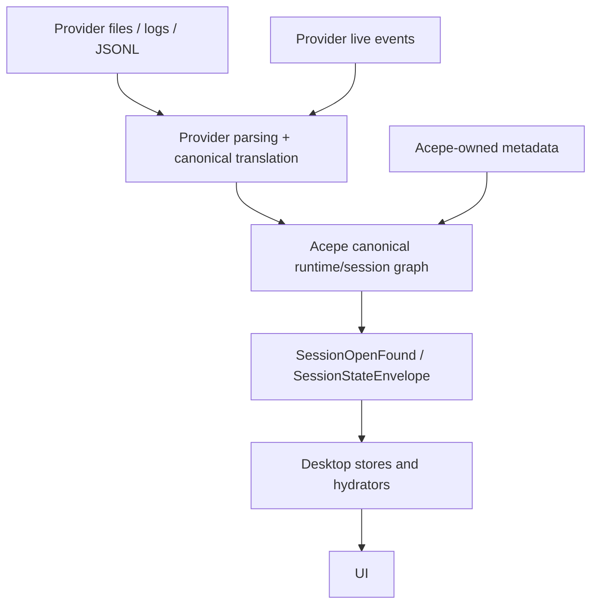
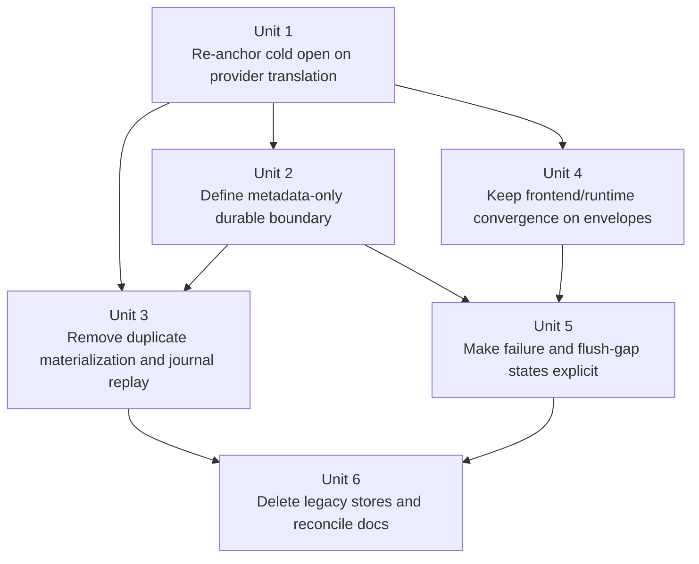

# refactor: Make provider-owned history the sole restore authority

> Superseded by `docs/plans/2026-04-25-002-refactor-final-god-architecture-stack-plan.md`. This plan remains as historical provider-restore research; the final GOD stack is the active endpoint. Session identity closure is documented in `docs/solutions/architectural/provider-owned-session-identity-2026-04-27.md`.

## Overview

Supersede `docs/plans/2026-04-22-004-refactor-provider-authoritative-session-restore-plan.md` with a stricter architecture that matches the origin requirements document and the actual state of `main`.

Current `main` already loads provider-owned history, but then re-promotes that translated content into Acepe-managed durable truth through:

- `history/commands/session_loading.rs` materializing provider history into `session_projection_snapshot`, `session_transcript_snapshot`, and `session_thread_snapshot`,
- `acp/session_open_snapshot/mod.rs` reopening sessions from those local snapshots and journal cutoffs,
- `acp/session_journal.rs` durably storing transcript/tool/permission/question payloads in `session_journal_event.event_json`.

The new target is narrower and cleaner:

- provider-owned files/logs/JSONL remain cold-open authority,
- provider live events remain attached-session authority,
- Acepe keeps one canonical in-memory/runtime model for behavior,
- local durable storage shrinks to Acepe-owned metadata only,
- any future cache is subordinate, purgeable, and explicitly not part of restore authority.

## Problem Frame

Acepe intended to move to provider-authoritative restore, but current `main` still behaves like a storage-first system. The biggest mismatch is not just the snapshot tables. The backend still treats `session_journal_event` as a replayable durable transcript seam by persisting `ProjectionUpdate` payloads that contain user chunks, assistant chunks, tool-call bodies, permission requests, question requests, and turn errors.

That leaves the codebase in a contradictory state:

- `provider_capabilities` says providers are `HistoryReplayFamily::ProviderOwned`,
- cold open still flows through local projection/transcript/thread materialization,
- reconnect/resume docs still describe canonical snapshot-first restore,
- the frontend already consumes revisioned `SessionStateEnvelope` and in-memory graph state, so the real conflict is backend restore/storage authority rather than UI architecture.

This refactor fixes the authority boundary instead of patching around it. Acepe should translate provider authority into canonical runtime state when opening or observing a session, not duplicate provider-owned transcript truth into its own durable replay model.

This is also an explicit product tradeoff: some sessions that currently reopen from stale local copies will instead surface `not-restorable` or `retry later` states until provider-owned history is available and parseable. The plan intentionally prefers honest availability semantics over silently restoring stale or partial transcript truth and accepts that tradeoff as the correct product behavior for this slice.

## Requirements Trace

- R1. Provider-owned files, logs, JSONL, and equivalent provider-native history are the source of truth for cold-open restore. (see origin: `docs/brainstorms/2026-04-22-provider-authoritative-session-restore-requirements.md`)
- R2. Provider live events are the source of truth for attached/live sessions.
- R3. Acepe must use one canonical operations/runtime model for both cold-open and live-session translation.
- R4. Acepe must not treat local transcript/session persistence as a restore authority for session content.
- R5. Local durable storage must shrink to Acepe-owned metadata only.
- R6. Any local cache must be subordinate, purgeable, rebuildable, and must not store full transcript payloads, message bodies, or tool-call bodies.
- R7. Large provider payloads must not be durably duplicated across journal/snapshot/cache layers in Acepe-managed storage.
- R8. Opening a transcript from disk and observing a live attached session must produce the same canonical operations model for completed, non-transient operations.
- R9. Acepe-only metadata-driven workflows must remain available without restoring duplicate transcript truth.
- R10. Missing or unparseable provider history must fail explicitly and must not appear as a successful restore.

## Scope Boundaries

- This plan does **not** redesign provider file formats or eliminate parser maintenance; provider reverse engineering remains product cost.
- This plan does **not** introduce a new durable translation cache. If performance work is needed later, it must be planned as a separate subordinate-cache slice.
- This plan does **not** require offline restore when provider-owned history is unavailable.
- This plan does **not** broaden into a frontend redesign; it only rewires existing open/hydration surfaces to consume provider-authoritative open results and explicit failure states.
- This plan does **not** preserve transitional snapshot/journal stores “for safety” once they conflict with provider-owned authority.

## Context & Research

### Relevant Code and Patterns

- `packages/desktop/src-tauri/src/history/commands/session_loading.rs`
  - `load_unified_session_content_with_context(...)` already reads provider-owned history, but `persist_canonical_materialization(...)` turns that into durable local transcript/projection/thread truth.
- `packages/desktop/src-tauri/src/acp/session_open_snapshot/mod.rs`
  - `assemble_session_open_result(...)` still treats persisted projection/transcript snapshots plus journal cutoff as the authoritative reopen contract.
  - `session_open_result_from_thread_snapshot(...)` preserves a second compatibility restore seam from `SessionThreadSnapshot`.
- `packages/desktop/src-tauri/src/acp/session_journal.rs`
  - `ProjectionJournalUpdate` and `SessionJournalEventPayload::ProjectionUpdate` durably store transcript/tool/interaction payloads that the requirements document says must stop being restore authority.
  - `load_projection_from_journal(...)` and `load_transcript_from_journal(...)` make the journal a second durable replay engine.
- `packages/desktop/src-tauri/src/acp/commands/session_commands.rs`
  - already shows one partial cleanup seam: `ensure_session_anchor_snapshots(...)` is a no-op, so the architecture has already started walking away from some snapshot assumptions.
- `packages/desktop/src/lib/acp/store/session-store.svelte.ts`
  - the frontend already applies `SessionStateEnvelope` into an in-memory canonical runtime graph; this should remain the live/cold-open convergence surface rather than a new durable store.
- `packages/desktop/src/lib/acp/store/services/session-open-hydrator.ts`
  - existing frontend open hydration seam that should keep consuming `SessionOpenFound`, but from provider-translated content instead of locally materialized truth.
- `packages/desktop/src-tauri/src/storage/commands/review_state.rs`
  - concrete example of Acepe-owned metadata that should survive the cleanup.

### Institutional Learnings

- `docs/solutions/architectural/provider-owned-semantic-tool-pipeline-2026-04-18.md`
  - provider-specific semantics belong at the edge; downstream consumers should operate on normalized Acepe-owned runtime records.
- `docs/solutions/logic-errors/worktree-session-restore-2026-03-27.md`
  - stable identity/source/worktree facts must survive at the persistence boundary even when transcript truth does not.
- `docs/concepts/session-graph.md`
  - still describes the session graph as durable authority and must be reconciled with provider-authoritative restore.
- `docs/concepts/reconnect-and-resume.md`
  - still describes canonical snapshot-first restore and must be updated so reconnect/resume no longer assumes local durable transcript truth.

### External References

- None required. This is a repo-boundary correction, not a missing framework-knowledge problem.

## Key Technical Decisions

| Decision | Why |
|---|---|
| Provider-owned history and provider live events are the only authority for session content | Matches the origin requirements and removes the current split-brain between provider replay and local materialization |
| Acepe keeps the canonical session graph as an in-memory/runtime behavioral model, not a second durable transcript source | Preserves shared behavior across cold-open and live paths without re-creating local restore authority |
| `session_journal_event` must stop storing transcript/tool/question/permission payload truth | Today the journal is still a hidden duplicate transcript authority even if snapshot tables are removed |
| Surviving durable storage is metadata-only: identity/discovery binding, review state, and other Acepe-owned facts | Keeps product-specific workflows without copying provider-owned session content |
| This slice does not introduce a durable subordinate cache | Avoids letting a “temporary acceleration cache” become the next hidden restore authority |
| Flush gaps and parser failures must surface as explicit restore states | Honest failure is required by R10 and prevents stale local fallback from masking provider-authority problems |
| No compatibility stubs survive the cleanup migration | Once provider-authoritative restore is proven, leaving empty snapshot-table shells adds migration complexity without preserving valid product behavior |
| The metadata-only durable event tail stays in the existing `session_journal_event` table during this slice | Narrowing semantics in place avoids unnecessary rename churn while the refactor is already changing authority, replay behavior, and table cleanup |

## Open Questions

### Resolved During Planning

- **Should this update the 2026-04-22 provider-authoritative plan in place?** No. That document is useful history, but it marked itself completed and underweights the remaining journal duplication problem.
- **Should snapshot-table cleanup alone count as finishing provider-authoritative restore?** No. `session_journal_event` must also stop storing replayable transcript/tool payload truth.
- **Should Acepe keep a durable transcript cache “just in case”?** No. That would violate the authority boundary this refactor is supposed to enforce.
- **Should the frontend canonical graph/store architecture be replaced?** No. The frontend already converges around revisioned envelopes and in-memory graph state; the mismatch is backend restore/storage authority.
- **Should missing provider history fall back to local copies for UX smoothness?** No. Explicit not-restorable/failure states are the intended behavior.
- **Can we trust provider-owned history to contain everything needed for restore?** Yes. This plan assumes provider-owned history has the full restore payload we need and does not add a pre-cleanup audit gate.
- **Is reopening from provider-owned history fast enough without a local snapshot fast path?** Yes. Rust parsing is treated as sufficiently fast for this slice, so the plan does not add a latency gate before cleanup.
- **Do historical sessions need a special preservation path before legacy snapshot storage is removed?** No. Historical sessions follow the same provider-authoritative open path as all other sessions; this slice adds no special-case preservation mechanism.
- **Should this plan design a subordinate cache or index now?** No. This slice introduces no cache. If the performance gate fails, Phase 3 cleanup stops and a separate planning cycle is required before any cache work begins.
- **What is the exact migration choreography for the legacy snapshot tables?** Keep all existing applied migrations, and use the Unit 6 cleanup migration slot (`m20260423_000001_move_runtime_checkpoint_to_acepe_session_state` in the implementation branch) to drop the snapshot tables outright after provider-authoritative restore is proven. Do not leave compatibility stubs.
- **Should the metadata-only durable event tail rename `session_journal_event` in this refactor?** No. Keep the existing table name and narrow its contents in place; renaming the table is unnecessary migration churn for this slice and does not change authority semantics.

## High-Level Technical Design

> *This illustrates the intended approach and is directional guidance for review, not implementation specification. The implementing agent should treat it as context, not code to reproduce.*

### Authority surfaces

| Concern | Current `main` | Target |
|---|---|---|
| Cold-open content authority | provider load -> local materialization -> reopen from local snapshots | provider load -> translate -> open result |
| Live-session content authority | provider live events -> runtime graph | unchanged |
| Durable transcript truth | snapshot tables + payload-bearing journal | none in Acepe-managed storage |
| Durable local state | metadata mixed with transcript-derived stores | metadata-only |
| Frontend canonical behavior | in-memory envelopes/graph | unchanged, fed by provider-authoritative open/live translation |

The contract after this refactor is:

1. provider history or provider live events produce canonical operations/runtime state,
2. Acepe may durably store only metadata it genuinely owns,
3. open/hydrate flows can still hand the frontend a transcript snapshot, but that snapshot is rebuilt from provider authority at open time rather than loaded from Acepe-managed durable transcript tables,
4. no local durable replay seam is allowed to reconstruct session content when provider authority is missing.

## Alternative Approaches Considered

| Approach | Why not chosen |
|---|---|
| Keep snapshot tables as a subordinate cache | The code already proved that “subordinate” snapshot stores quickly become real restore authority under pressure |
| Keep the journal payload-bearing but cap/compress it | Shrinks bytes but preserves the wrong ownership boundary and still duplicates provider-owned transcript truth |
| Move duplicate transcript truth into artifacts instead of SQLite | Still violates R4/R6/R7 because Acepe would continue durably owning provider session content |
| Keep the current docs and only change code | Leaves the repo teaching the wrong architecture and invites regressions back into storage-first thinking |

## Success Metrics

- Cold-open restore is explainable as “provider history -> translate -> open result -> hydrate,” with no local transcript authority caveat.
- `session_journal_event` no longer contains replayable transcript/tool/question/permission bodies as normal-path durable truth.
- Opening the same historical session repeatedly does not grow local durable storage by copying transcript content.
- Review state and other Acepe-owned metadata workflows still function after local transcript truth is removed.
- Missing or unparseable provider history produces explicit failure/not-restorable behavior instead of stale content or no-op retry UX.

## Execution Assumptions

- Provider-owned history is treated as complete enough for restore in this slice; implementation should not add a parallel validation gate before removing legacy fallback storage.
- Reopening by parsing provider-owned history in Rust is treated as fast enough for this slice; implementation should not add a performance gate before cleanup.
- Historical sessions receive no special preservation path; they are reopened through the same provider-authoritative flow as all other sessions.

## Phased Delivery

### Phase 1 — Re-anchor contracts

- move cold-open assembly onto provider-authoritative translation,
- define the surviving metadata-only storage contract,
- keep the frontend consuming the same open/hydration interfaces.

### Phase 2 — Remove duplicate durable truth

- stop snapshot/journal materialization writes,
- remove journal replay of transcript/tool payloads,
- keep lifecycle/reconnect behavior honest about flush gaps and parser failures.

### Phase 3 — Clean up and lock in

- delete legacy tables/entities/read paths,
- update conflicting docs,
- add regression coverage so provider-authoritative restore cannot silently drift back.

## Implementation Units

- [ ] **Unit 1: Re-anchor cold open on provider translation**

**Goal:** Make session open/load paths derive session content from provider authority instead of persisted projection/transcript/thread snapshots.

**Requirements:** R1, R3, R4, R8, R10

**Dependencies:** None

**Files:**
- Modify: `packages/desktop/src-tauri/src/history/commands/session_loading.rs`
- Modify: `packages/desktop/src-tauri/src/acp/session_open_snapshot/mod.rs`
- Modify: `packages/desktop/src-tauri/src/acp/commands/session_commands.rs`
- Modify: `packages/desktop/src-tauri/src/acp/provider.rs`
- Modify: `packages/desktop/src-tauri/src/acp/session_descriptor.rs`
- Test: `packages/desktop/src-tauri/src/acp/commands/tests.rs`
- Test: `packages/desktop/src-tauri/src/acp/client/tests.rs`

**Approach:**
- Keep `load_provider_owned_session(...)` as the cold-open ingress and remove the assumption that provider history must first be durably materialized before `SessionOpenFound` can be assembled.
- Replace `assemble_session_open_result(...)` and its thread-snapshot compatibility path with provider-translated content plus metadata lookup and event-hub reservation handling.
- Preserve the existing `SessionOpenResult` shape where possible so the frontend contract stays stable, but populate `transcript_snapshot`, operations, and interactions from provider-authoritative translation performed at open time.
- Preserve alias/canonical ID resolution from `SessionReplayContext`; this unit changes restore authority, not identity semantics.

**Execution note:** Start with characterization coverage for current open/load behavior before changing authority order.

**Patterns to follow:**
- `packages/desktop/src-tauri/src/history/commands/session_loading.rs`
- `packages/desktop/src-tauri/src/acp/provider.rs`

**Test scenarios:**
- Happy path — opening a provider-owned session reads provider history and returns a populated open result without consulting local transcript/projection snapshots as authority.
- Edge case — opening an alias session ID still resolves the canonical Acepe session identity and restores through provider-owned history.
- Error path — missing provider history returns an explicit missing/error open result instead of a locally reconstructed transcript.
- Integration — command entry points that open persisted sessions expose the same provider-authoritative behavior as direct history-loading code.

**Verification:**
- The main reopen path is explainable as provider-authoritative translation, not snapshot-first repair.

- [ ] **Unit 2: Define the metadata-only durable boundary**

**Goal:** Preserve Acepe-owned metadata while making local durable storage explicitly non-authoritative for session content.

**Requirements:** R5, R9

**Dependencies:** Unit 1

**Files:**
- Modify: `packages/desktop/src-tauri/src/db/repository.rs`
- Modify: `packages/desktop/src-tauri/src/db/entities/session_metadata.rs`
- Modify: `packages/desktop/src-tauri/src/db/entities/session_review_state.rs`
- Modify: `packages/desktop/src-tauri/src/storage/commands/review_state.rs`
- Modify: `packages/desktop/src-tauri/src/acp/session_descriptor.rs`
- Test: `packages/desktop/src-tauri/src/db/repository_test.rs`

**Approach:**
- Classify which persisted fields remain valid Acepe-owned metadata: identity, source/worktree/project binding, provider session aliasing, sequence/discovery facts, and review state.
- Remove or de-authorize metadata fields whose meaning only exists to support snapshot-first restore, including sentinel file-path/file-stat residue once no callers need it.
- Make descriptor and discovery flows consume metadata directly instead of relying on transcript-derived tables to fill gaps.
- Keep `session_review_state` and other genuine Acepe-owned workflows first-class throughout the cleanup.

**Patterns to follow:**
- `packages/desktop/src-tauri/src/storage/commands/review_state.rs`
- `docs/solutions/logic-errors/worktree-session-restore-2026-03-27.md`

**Test scenarios:**
- Happy path — session metadata and review state persist and reload correctly without any local transcript snapshot.
- Edge case — worktree/source-path identity survives metadata-only reload for provider-owned sessions.
- Error path — metadata lookup for a session with unavailable provider history does not fabricate transcript state.
- Integration — project/session listing and descriptor resolution still work after transcript-derived stores stop participating.

**Verification:**
- The surviving durable contract is clearly metadata-only and still supports Acepe-owned workflows.

- [ ] **Unit 3: Remove duplicate materialization and payload-bearing journal replay**

**Goal:** Stop Acepe from durably storing replayable transcript/session truth in snapshot tables or `session_journal_event`.

**Requirements:** R4, R6, R7

**Dependencies:** Units 1, 2

**Files:**
- Modify: `packages/desktop/src-tauri/src/history/commands/session_loading.rs`
- Modify: `packages/desktop/src-tauri/src/acp/commands/session_commands.rs`
- Modify: `packages/desktop/src-tauri/src/acp/session_journal.rs`
- Modify: `packages/desktop/src-tauri/src/db/repository.rs`
- Modify: `packages/desktop/src-tauri/src/acp/ui_event_dispatcher.rs`
- Test: `packages/desktop/src-tauri/src/db/repository_test.rs`
- Test: `packages/desktop/src-tauri/src/acp/commands/tests.rs`

**Approach:**
- Delete `persist_canonical_materialization(...)` and all normal-path writes that copy provider-owned thread/projection/transcript content into local durable tables.
- Refactor `ensure_canonical_session_materialized(...)` into a pure provider-load helper and remove resume/state-lookup callers in `session_commands.rs` that still rely on journal-backed transcript reconstruction.
- Remove `ProjectionJournalUpdate` as a durable replay mechanism for transcript/tool/question/permission payloads and narrow `session_journal_event` in place to Acepe-owned metadata events only; this unit does not introduce a new table or abstraction.
- Remove `load_projection_from_journal(...)`, `load_transcript_from_journal(...)`, and any caller assumptions that the journal can reconstruct session content after provider authority is gone.
- Keep only Acepe-owned lifecycle/interaction/review metadata events if they are still needed durably.

**Execution note:** Characterization-first. This unit cuts legacy write/replay behavior that currently spans multiple restore paths.

**Patterns to follow:**
- `packages/desktop/src-tauri/src/acp/session_journal.rs`
- `packages/desktop/src-tauri/src/acp/ui_event_dispatcher.rs`

**Test scenarios:**
- Happy path — loading or observing a provider-owned session no longer writes full transcript/projection/thread copies into local durable storage.
- Edge case — repeated opens of the same session do not accumulate transcript bodies or tool payloads in durable local stores.
- Error path — removing journal replay does not block provider-authoritative restore when provider history is present.
- Integration — live dispatcher persistence keeps only Acepe-owned metadata facts and never stores transcript/tool payload truth.

**Verification:**
- No normal-path durable store in Acepe can replay session content independently of provider authority.

- [ ] **Unit 4: Keep frontend/runtime convergence on envelopes and provider-translated open results**

**Goal:** Preserve the frontend’s canonical in-memory model while removing its dependence on storage-first backend assumptions.

**Requirements:** R2, R3, R8, R9, R10

**Dependencies:** Unit 1

**Files:**
- Modify: `packages/desktop/src/lib/acp/store/services/session-open-hydrator.ts`
- Modify: `packages/desktop/src/lib/acp/store/services/session-repository.ts`
- Modify: `packages/desktop/src/lib/acp/store/session-store.svelte.ts`
- Modify: `packages/desktop/src/lib/acp/store/services/transcript-snapshot-entry-adapter.ts`
- Test: `packages/desktop/src/lib/acp/store/services/__tests__/session-open-hydrator.test.ts`
- Test: `packages/desktop/src/lib/acp/store/__tests__/session-store-projection-state.vitest.ts`
- Test: `packages/desktop/src/lib/components/main-app-view/tests/open-persisted-session.test.ts`

**Approach:**
- Keep the frontend contract centered on `SessionOpenFound` plus revisioned `SessionStateEnvelope` application.
- Ensure hydration logic treats the open payload as provider-authoritative translated content, not evidence that a local snapshot store still exists.
- Preserve completed-operation parity between cold-open and live-session flows by continuing to route both into the same session graph/store semantics.
- Limit this unit to wiring and expectations; do not redesign panel architecture or introduce client-side durable caches.

**Patterns to follow:**
- `packages/desktop/src/lib/acp/store/session-store.svelte.ts`
- `packages/desktop/src/lib/acp/store/services/session-open-hydrator.ts`

**Test scenarios:**
- Happy path — opening a persisted provider-owned session hydrates entries and runtime state from the translated open result and subsequent envelopes.
- Edge case — live-only transient states are absent on cold open without breaking completed-operation parity.
- Error path — explicit provider-history failures surface through the existing open/hydration flow instead of crashing or yielding placeholder-ready state.
- Integration — cold-open hydration and live envelope application continue to converge in the same session store/runtime graph.

**Verification:**
- The frontend remains stable while backend restore authority changes underneath it.

- [ ] **Unit 5: Make provider failure and flush-gap states explicit**

**Goal:** Make retry/open behavior honest when provider history is missing, unparseable, or not yet flushed after detach/crash.

**Requirements:** R8, R10

**Dependencies:** Units 2, 4

**Files:**
- Modify: `packages/desktop/src-tauri/src/acp/session_open_snapshot/mod.rs`
- Modify: `packages/desktop/src-tauri/src/history/commands/session_loading.rs`
- Modify: `packages/desktop/src-tauri/src/acp/lifecycle/supervisor.rs`
- Modify: `packages/desktop/src-tauri/src/acp/commands/session_commands.rs`
- Modify: `packages/desktop/src/lib/acp/store/services/session-open-hydrator.ts`
- Modify: `packages/desktop/src/lib/components/main-app-view/tests/open-persisted-session.test.ts`
- Test: `packages/desktop/src-tauri/src/acp/lifecycle/supervisor_tests.rs`
- Test: `packages/desktop/src-tauri/src/acp/commands/tests.rs`
- Test: `packages/desktop/src/lib/acp/store/services/__tests__/session-open-hydrator.test.ts`

**Approach:**
- Define explicit open/retry outcomes for missing provider history, parser failure, and “not yet restorable because provider flush has not landed.”
- Treat detach/crash timing as a provider flush concern, not justification for local transcript fallback.
- Keep any persisted crash-gap state limited to Acepe-owned metadata and explicit status markers, never message bodies or tool payloads.
- Make retry surfaces meaningful by distinguishing retryable provider-unavailable states from hard failure and by ensuring the UI sees that distinction.
- Define the product contract for `not-yet-restorable`, `provider-history-missing`, and `parse-failure` states, including retryability, auto-retry expectations, and the user-visible meaning each state carries.

**Patterns to follow:**
- `packages/desktop/src-tauri/src/acp/lifecycle/supervisor.rs`
- `packages/desktop/src-tauri/src/acp/session_open_snapshot/mod.rs`

**Test scenarios:**
- Happy path — a detached session whose completed operations have flushed to provider history reopens normally.
- Edge case — immediate reopen before provider flush surfaces an explicit not-yet-restorable state instead of stale content.
- Error path — parser failure or missing provider history yields a visible failure contract rather than placeholder ready/empty transcript behavior.
- Integration — retry/open flows honor the same explicit failure semantics across backend commands and frontend hydration.

**Verification:**
- Provider-authority gaps become visible product states instead of hidden local fallback behavior.

- [ ] **Unit 6: Delete legacy duplicate-authority stores and reconcile docs**

**Goal:** Remove obsolete snapshot entities/read paths and update repo docs so the architecture no longer teaches storage-first restore.

**Requirements:** R4, R5, R6, R7, R9, R10

**Dependencies:** Units 3, 5

**Files:**
- Modify: `packages/desktop/src-tauri/src/db/migrations/mod.rs`
- Modify: `packages/desktop/src-tauri/src/db/repository.rs`
- Modify: `packages/desktop/src-tauri/src/db/entities/mod.rs`
- Modify: `packages/desktop/src-tauri/src/db/entities/prelude.rs`
- Delete: `packages/desktop/src-tauri/src/db/entities/session_projection_snapshot.rs`
- Delete: `packages/desktop/src-tauri/src/db/entities/session_transcript_snapshot.rs`
- Delete: `packages/desktop/src-tauri/src/db/entities/session_thread_snapshot.rs`
- Modify: `docs/concepts/session-graph.md`
- Modify: `docs/concepts/reconnect-and-resume.md`
- Modify: `docs/solutions/architectural/revisioned-session-graph-authority-2026-04-20.md`
- Test: `packages/desktop/src-tauri/src/db/repository_test.rs`

**Approach:**
- Remove dead entities, migrations, and repository paths only after provider-authoritative open behavior and metadata-only durability are proven.
- Keep the existing migration history intact and use the cleanup migration slot implemented in `m20260423_000001_move_runtime_checkpoint_to_acepe_session_state` to drop the snapshot tables outright; do not leave schema-only compatibility stubs.
- Reconcile architecture docs so they describe the session graph as canonical runtime behavior, not Acepe-owned durable transcript truth.
- Do not carry forward the local-only “recreate missing snapshot tables” symptom fix; that patch reinstates stores this plan intentionally removes.
- Ensure docs and tests lock in that provider-owned history is the restore authority and local durable storage is metadata-only.

**Patterns to follow:**
- existing migration cleanup patterns under `packages/desktop/src-tauri/src/db/migrations/`
- `docs/brainstorms/2026-04-22-provider-authoritative-session-restore-requirements.md`

**Test scenarios:**
- Happy path — sessions still open and metadata workflows still work after snapshot entities/tables are removed from the normal path.
- Edge case — existing installs preserve metadata while transcript/session restore shifts fully to provider authority.
- Error path — cleanup never deletes Acepe-owned metadata needed for review state or descriptor resolution.
- Integration — docs, repository surfaces, and restore behavior all agree on provider-authoritative restore after cleanup.

**Verification:**
- The repo no longer contains a normal-path Acepe-managed transcript authority seam beside provider-owned history.

## System-Wide Impact

- **Interaction graph:** provider loaders, session-open assembly, lifecycle supervision, dispatcher persistence, metadata repositories, frontend hydrators, and retry/open UX all move together.
- **Error propagation:** provider-history absence and parser failure must propagate as explicit open results and UI states instead of being absorbed by snapshot/journal fallback.
- **State lifecycle risks:** detach-before-flush, alias/canonical ID mix-ups, metadata/transcript boundary mistakes, and legacy migration cleanup are the main failure modes.
- **API surface parity:** all current providers already advertise `ProviderOwned` replay policy, so this refactor should converge shared behavior rather than adding per-provider storage exceptions.
- **Integration coverage:** cold open, attached live continuation, detach/reopen, retry after provider failure, and metadata-only workflows need cross-layer coverage beyond repository tests.
- **Unchanged invariants:** provider adapters still own parsing; the frontend still consumes open payloads plus revisioned envelopes; review state and other Acepe-owned metadata remain durable.

## Risks & Dependencies

| Risk | Likelihood | Impact | Mitigation |
|------|-----------|--------|------------|
| Journal payload duplication survives under a renamed helper or “temporary” event type | Medium | High | Unit 3 explicitly removes payload-bearing replay semantics and verifies that no durable store can reconstruct session content locally |
| Existing open/retry UX assumes local snapshots will always cover missing provider history | High | High | Unit 5 defines explicit failure/not-restorable states and wires them through existing hydration surfaces |
| Metadata cleanup accidentally drops identity/worktree/provider-session facts needed for resume/fork | Medium | High | Unit 2 classifies the metadata boundary before cleanup; Unit 6 depends on that classification being proven by tests |
| Performance regresses when snapshot-first reopen disappears | Medium | Medium | Keep this slice architecture-correct first; if measurement later shows a real issue, plan a subordinate purgeable cache separately |
| Dirty worktree symptom patches get accidentally kept during implementation | Medium | Medium | Unit 6 explicitly rejects the local snapshot-table recreation patch and aligns cleanup with the target architecture |

## Documentation Plan

- Update `docs/concepts/session-graph.md` so it describes canonical runtime behavior rather than Acepe-owned durable transcript truth.
- Update `docs/concepts/reconnect-and-resume.md` so reconnect/resume becomes provider-authoritative and explicit about not-restorable states.
- Refresh `docs/solutions/architectural/revisioned-session-graph-authority-2026-04-20.md` so it no longer conflicts with the provider-authoritative restore boundary.
- Add a new solution document after implementation describing the final metadata-only storage boundary and the removal of duplicate transcript persistence.

## Documentation / Operational Notes

- This plan supersedes `docs/plans/2026-04-22-004-refactor-provider-authoritative-session-restore-plan.md` and the older storage-first premise in `docs/plans/2026-04-22-003-refactor-canonical-session-storage-seam-plan.md`.
- The temporary local migration/test patch that recreates missing snapshot tables must be superseded by a later cleanup migration in Unit 6, not removed from migration history, because an applied migration cannot be safely “discarded” on existing installs.
- Implementation should treat any performance cache as out of scope for this slice; do not invent cache design during execution.

## Sources & References

- **Origin document:** `docs/brainstorms/2026-04-22-provider-authoritative-session-restore-requirements.md`
- Superseded plan: `docs/plans/2026-04-22-004-refactor-provider-authoritative-session-restore-plan.md`
- Related plan: `docs/plans/2026-04-22-003-refactor-canonical-session-storage-seam-plan.md`
- Related code: `packages/desktop/src-tauri/src/history/commands/session_loading.rs`
- Related code: `packages/desktop/src-tauri/src/acp/session_open_snapshot/mod.rs`
- Related code: `packages/desktop/src-tauri/src/acp/session_journal.rs`
- Related code: `packages/desktop/src/lib/acp/store/session-store.svelte.ts`
- Learning: `docs/solutions/architectural/provider-owned-semantic-tool-pipeline-2026-04-18.md`
- Learning: `docs/solutions/logic-errors/worktree-session-restore-2026-03-27.md`
