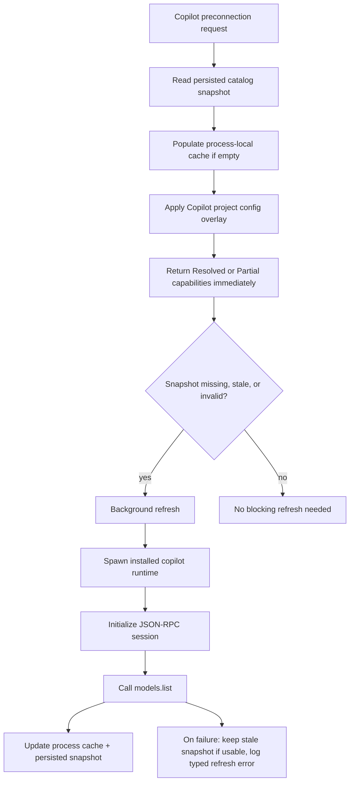

# refactor: Use authoritative Copilot model catalog

## Overview

Replace Copilot's preconnection model discovery hot path with an authoritative catalog fetch built from the installed Copilot runtime's `models.list` RPC, backed by Acepe-owned stale-while-revalidate caches.

The user-visible outcome is that selecting Copilot should no longer block on a multi-second history scan, while newly released Copilot models can appear even if the user has never selected them before. This plan keeps Copilot's provider-owned, project-scoped defaults behavior intact and moves the slow work entirely off the interactive picker path.

## Problem Frame

Acepe currently resolves Copilot preconnection models by synchronously scanning historical `events.jsonl` files in `packages/desktop/src-tauri/src/acp/providers/copilot.rs`. That has three product problems:

1. It is too slow for picker UX because the scan runs on the interactive preconnection path.
2. It is incomplete because history can only reveal models the user has already touched.
3. It drifts from Copilot's own runtime truth even though the installed Copilot CLI already exposes an authoritative `models.list` RPC.

The origin Copilot requirements document already established two important constraints (see origin: `docs/brainstorms/2026-03-30-github-copilot-cli-agent-requirements.md`):

- Acepe should treat the installed Copilot runtime as the authority instead of reverse-engineering unstable storage.
- Copilot model and mode data should flow through the same first-class ACP surfaces as the other built-in agents.

This plan also follows the active capability-resolution architecture (see related plan: `docs/plans/2026-04-23-001-refactor-unified-capability-resolution-plan.md`): provider-specific sourcing stays behind the provider adapter, shared UI code consumes typed capability data, and caches remain subordinate to the provider-owned source of truth.

## Requirements Trace

- R1. Use the installed Copilot runtime's authoritative model catalog for preconnection model discovery instead of treating history files as the primary source (see origin: R10, R11, R15, R18).
- R2. Keep Copilot picker latency off the multi-second interactive path by serving preconnection models from Acepe cache layers and background refresh rather than a full runtime fetch on selection.
- R3. Surface newly available Copilot models even when they do not yet exist in any local Copilot session history.
- R4. Preserve Copilot's project-scoped current-model overlay so project `.copilot/config.json` defaults still shape `current_model_id` and selector emphasis.
- R5. Keep Acepe's local cache subordinate and rebuildable: stale data may be served briefly for responsiveness, but provider-owned runtime results remain authoritative.
- R6. Preserve explicit capability semantics (`Resolved`, `Partial`, `Failed`) so the frontend never falls back to a blank or heuristic-only state.

## Scope Boundaries

- This plan changes Copilot model discovery and cache strategy only; it does not redesign generic capability resolution for all providers.
- This plan does not change Copilot's `preconnectionCapabilityMode`; Copilot remains project-scoped because project config overlay still matters.
- This plan does not introduce a new user-facing login flow; auth failures continue to surface as actionable runtime/preconnection errors.
- This plan does not require a permanently running Copilot helper daemon in the first slice; background refresh plus process/persisted caches are sufficient.
- This plan does not preserve full-history scanning on the interactive path. History may remain only as an off-hot-path salvage fallback if still needed after implementation.

## Context & Research

### Relevant Code and Patterns

- `packages/desktop/src-tauri/src/acp/providers/copilot.rs` currently owns `resolve_copilot_preconnection_capabilities()` and the slow `discover_copilot_history_models()` path that reads every historical `events.jsonl`.
- `packages/desktop/src-tauri/src/acp/providers/copilot_settings.rs` already overlays Copilot project/user config onto the resolved model state and should remain the authority for configured current-model selection, but only after the authoritative catalog has established which models are actually available.
- `packages/desktop/src-tauri/src/history/scan_cache.rs` is a useful reference for TTL/single-flight cache behavior, but it does not already provide the provider-owned persisted snapshot + stale-while-revalidate contract this plan needs.
- `packages/desktop/src-tauri/src/acp/provider.rs` contains the `CommandAvailabilityCache` prewarm pattern and `OnceLock`-backed shared cache setup that should inform Copilot warmup.
- `packages/desktop/src-tauri/src/acp/agent_installer.rs` already owns install/upgrade completion flow and is the right place to invalidate Copilot catalog snapshots after a successful runtime install.
- `packages/desktop/src-tauri/src/lib.rs` already hosts startup prewarm/background task patterns and is the right place to trigger non-blocking Copilot catalog refresh when the runtime is installed.
- `packages/desktop/src/lib/acp/components/agent-input/logic/preconnection-capabilities-state.svelte.ts` and `packages/desktop/src/lib/acp/components/agent-input/logic/capability-source.ts` already understand `Resolved` vs `Partial` preconnection snapshots; no new frontend heuristic layer should be introduced.

### Institutional Learnings

- `docs/solutions/best-practices/provider-owned-policy-and-identity-not-ui-projections-2026-04-09.md` applies directly: shared UI/runtime code should consume typed provider-owned capability contracts, not infer policy from labels or display groups.
- `docs/plans/2026-04-23-001-refactor-unified-capability-resolution-plan.md` already settled the architecture for capability-source precedence and provider-owned preconnection behavior; this plan should fit inside that seam rather than inventing a Copilot-specific UI path.

### External References

- Local runtime research against the installed Copilot CLI confirmed an authoritative server RPC `models.list` and bundled client method `listModels()`. Cold fetch is roughly 1.1s after client startup; warm repeated calls inside the same process are effectively free. This is the source-of-truth path the plan targets, but Acepe should speak to the installed Copilot binary directly from Rust rather than depend on the JS SDK as a runtime dependency.

## Key Technical Decisions

| Decision | Rationale |
|---|---|
| Use Copilot's authoritative `models.list` RPC as the primary catalog source. | History cannot reveal newly shipped models and is too slow on the hot path. |
| Keep Copilot `projectScoped` while making the model catalog cache global. | The model universe is global, but the selected/default model still depends on project config overlay. |
| Implement the authoritative fetcher in Rust by spawning the installed Copilot binary with `--acp --stdio` and issuing the minimal JSON-RPC handshake. | Acepe already owns the binary/runtime contract; this avoids depending on Node or the JS SDK in the product path. |
| Use a dedicated provider-owned Copilot catalog cache module instead of extending `history/scan_cache.rs`. | The lifecycle and invalidation rules are Copilot-specific and should not widen shared history-cache responsibilities. |
| Introduce a two-tier Acepe cache: small persisted snapshot plus process-local single-flight cache. | Persisted cache gives sub-10ms warm startup behavior across app relaunches; process-local cache removes repeated fetch cost within one run. |
| Persist `fetched_at`, Copilot runtime version, and an auth/account fingerprint with the snapshot; treat `<=4h` as fresh, `4h-48h` as stale-servable, and `>48h` or fingerprint/version mismatch as unusable. | Freshness and entitlement invalidation need deterministic behavior, not an implicit "somewhat stale is probably fine" policy. |
| Use stale-while-revalidate semantics with a bounded subprocess timeout. | Picker responsiveness matters more than waiting for a fresh remote catalog on every selection, but freshness must converge automatically in the background and hung subprocesses must not accumulate. |
| Remove full-history scanning from the interactive preconnection path. | The current path is the direct cause of the UX regression and should not remain as a hidden slow fallback on selection. |
| Keep a bounded rollout hedge for zero-model regressions outside the interactive path. | A one-release, off-hot-path salvage path de-risks the cutover without restoring the multi-second picker latency. |
| Preserve `copilot_settings.rs` as the owner of current-model overlay. | Catalog discovery and project config selection are separate concerns and should stay that way. |
| When config references a model absent from the authoritative catalog, authoritative availability wins; Acepe falls back to `auto` (or another known alias resolution) and records a typed diagnostic. | Stale project config should not silently fabricate a currently available model. |

## Open Questions

### Resolved During Planning

- **Should Acepe keep using history as the primary model source?** No. History becomes, at most, a non-interactive salvage fallback.
- **Should Copilot switch from `projectScoped` to `startupGlobal`?** No. The model catalog cache is global, but project config overlay still requires project-scoped resolution.
- **Should Acepe depend on the bundled JS SDK at runtime?** No. The JS SDK is a research aid that confirms the RPC shape; the production path should remain Rust -> installed Copilot binary.
- **Does this need a permanently running helper process to succeed?** No for the first slice. A persisted snapshot plus process-local cache is enough to hit the UX goal without adding a daemon lifecycle.
- **Should shared `history/scan_cache.rs` own this cache?** No. Copilot gets a dedicated provider-owned cache module that borrows the pattern, not the abstraction.
- **What is the rollout hedge while removing history scanning from the hot path?** Keep a bounded, off-hot-path salvage path for one release cycle, only when the authoritative path yields zero usable models and never on picker interaction itself.

### Deferred to Implementation

- Exact storage location and serialization format for the persisted snapshot, as long as it remains Acepe-owned, small, and purgeable.
- Exact shape of the auth/account fingerprint, as long as it is derived from Copilot auth status/account identity rather than storing raw tokens or secrets.

## Dependencies / Prerequisites

- This plan should land on top of the provider-owned capability resolution seam from `docs/plans/2026-04-23-001-refactor-unified-capability-resolution-plan.md`, or be rebased so Copilot continues to own its preconnection resolution end-to-end.
- Before implementation starts, capture and pin a raw minimal `initialize` + `models.list` transcript from the installed Copilot runtime so provider tests are grounded in the actual wire contract rather than only SDK-based research.

## High-Level Technical Design

> *This illustrates the intended approach and is directional guidance for review, not implementation specification. The implementing agent should treat it as context, not code to reproduce.*

## Implementation Units

- [ ] **Unit 1: Add an authoritative Copilot catalog fetcher and cache contract**

**Goal:** Introduce one provider-owned module that can fetch, normalize, and cache Copilot's authoritative model catalog without touching the UI path directly.

**Requirements:** R1, R2, R3, R5, R6

**Dependencies:** None

**Files:**
- Create: `packages/desktop/src-tauri/src/acp/providers/copilot_model_catalog.rs`
- Modify: `packages/desktop/src-tauri/src/acp/providers/mod.rs`
- Test: `packages/desktop/src-tauri/src/acp/providers/copilot_model_catalog.rs`

**Approach:**
- Add a provider-owned Copilot catalog module that speaks minimal JSON-RPC over the installed Copilot binary's stdio transport and calls `models.list`.
- Normalize the returned catalog into Acepe's existing `AvailableModel` shape, preserving `auto` and other runtime-exposed ids exactly as reported by Copilot.
- Capture the raw `initialize` + `models.list` wire contract once during implementation and pin a fixture so future tests guard against handshake drift.
- Layer cache responsibilities explicitly:
  - a process-local single-flight cache for the current app run,
  - a small persisted snapshot for cross-restart warm loads.
- Store only the metadata needed for validity decisions: `fetched_at`, Copilot runtime version, and an auth/account fingerprint. Treat `<=4h` as fresh, `4h-48h` as stale-servable, and anything older or mismatched as unusable.
- Bound each authoritative fetch with a hard subprocess timeout and explicit kill path so background refresh cannot leak hung Copilot children.

**Patterns to follow:**
- `packages/desktop/src-tauri/src/history/scan_cache.rs` (pattern reference only)
- `packages/desktop/src-tauri/src/acp/provider.rs`

**Test scenarios:**
- Happy path: authoritative `models.list` response with multiple models produces a normalized `AvailableModel` list in stable order.
- Happy path: a warm in-process cache hit returns without spawning a second Copilot subprocess.
- Edge case: persisted snapshot exists but is stale; the module still returns the snapshot immediately and schedules a refresh path.
- Edge case: persisted snapshot runtime version or auth/account fingerprint mismatches the current runtime state; the snapshot is treated as unusable and a refresh is required.
- Error path: Copilot runtime is unavailable or JSON-RPC negotiation fails; the module returns a typed failure result without crashing the caller.
- Error path: the authoritative subprocess exceeds the timeout; it is terminated and surfaced as a typed refresh failure.
- Integration: successful authoritative fetch writes a snapshot that a fresh process can read back into the same normalized model list.

**Verification:**
- A standalone catalog fetch path can produce authoritative Copilot model ids/names without reading session history files.
- The cache contract can serve a snapshot immediately, refresh it independently, and preserve explicit success/failure semantics for callers.

- [ ] **Unit 2: Replace Copilot hot-path history scanning with cached authoritative resolution**

**Goal:** Make Copilot preconnection capability resolution serve from the new catalog cache while preserving project-scoped config overlay and explicit capability status.

**Requirements:** R1, R2, R3, R4, R5, R6

**Dependencies:** Unit 1

**Files:**
- Modify: `packages/desktop/src-tauri/src/acp/providers/copilot.rs`
- Modify: `packages/desktop/src-tauri/src/acp/providers/copilot_settings.rs`
- Test: `packages/desktop/src-tauri/src/acp/providers/copilot.rs`

**Approach:**
- Rework `resolve_copilot_preconnection_capabilities()` to read from the authoritative cache instead of `discover_copilot_history_models()`.
- Keep `apply_copilot_session_defaults()` as the overlay that selects the configured current model after the base catalog is loaded, but only from models that remain present in the authoritative catalog (or from a known alias resolution that maps onto that catalog).
- Define clear status behavior:
  - cached authoritative catalog present -> `Resolved`
  - no usable catalog yet, but refresh is in flight or only `auto`/default alias is currently knowable -> `Partial`
  - authoritative refresh failed and no usable snapshot exists -> `Failed`
- If config references a model that no longer exists in the authoritative catalog, do not inject it as a live option. Fall back to `auto` (or another known alias target), and record an explicit unavailable-model diagnostic in logs/tests.
- Remove full-history scanning from the interactive path so picker latency is no longer tied to historical session size.
- Keep a temporary, off-hot-path rollout hedge: if the authoritative path yields zero usable models and the migration hedge is enabled, schedule background history salvage and, if it finds models, expose them only as `Partial`. This hedge never runs synchronously on picker interaction and is intended for one release cycle only.

**Execution note:** Start with failing provider-level tests that capture the current slow/incomplete behavior before deleting the history-scan hot path.

**Patterns to follow:**
- `packages/desktop/src-tauri/src/acp/providers/copilot.rs`
- `packages/desktop/src-tauri/src/acp/providers/copilot_settings.rs`

**Test scenarios:**
- Happy path: cached authoritative catalog plus project `.copilot/config.json` returns a resolved capability snapshot with the configured current model selected.
- Edge case: configured model absent from the cached catalog falls back to `auto` (or a known alias target) and emits an unavailable-model diagnostic without mutating the authoritative catalog list.
- Edge case: no project config exists; Copilot still returns a meaningful model list instead of only `auto`.
- Error path: authoritative fetch has not succeeded yet; provider returns `Partial`/`Failed` explicitly rather than an empty success-shaped response.
- Error path: the authoritative path yields zero models; the temporary salvage hedge can backfill a `Partial` result without restoring synchronous history scanning.
- Integration: selecting Copilot in a never-connected project resolves models from cache + config overlay without reading historical `events.jsonl`.

**Verification:**
- Copilot preconnection capability resolution no longer depends on history size.
- The returned capability snapshot preserves authoritative catalog coverage, project-specific current-model behavior, and explicit unavailable-model handling.

- [ ] **Unit 3: Warm, invalidate, and observe the catalog outside the interactive path**

**Goal:** Ensure the authoritative catalog is normally ready before the user opens the picker, and that installs/upgrades/auth changes converge without blocking the UI.

**Requirements:** R2, R3, R5, R6

**Dependencies:** Units 1-2

**Files:**
- Modify: `packages/desktop/src-tauri/src/lib.rs`
- Modify: `packages/desktop/src-tauri/src/acp/agent_installer.rs`
- Modify: `packages/desktop/src-tauri/src/acp/providers/copilot.rs`
- Test: `packages/desktop/src-tauri/src/lib.rs`

**Approach:**
- Add startup warmup that checks whether Copilot is installed and, if so, refreshes the catalog in the background only when the snapshot is missing, expired, or invalid for the current runtime/auth fingerprint.
- Ensure warmup writes only the global base catalog snapshot. Project-specific `current_model_id` overlay still happens at request time in `copilot.rs`, so startup work never persists project-specific selection state.
- Invalidate or refresh the snapshot when Copilot is installed/upgraded through Acepe so new runtime versions do not wait for organic picker usage.
- Route all background refresh entry points through the same single-flight primitive and bound the subprocess with the Unit 1 timeout/kill behavior.
- Add lightweight tracing around cache source selection, refresh reason, fallback usage, and refresh duration so regressions are visible in existing logs.
- Keep the frontend contract unchanged: the backend should deliver faster capability snapshots without asking the UI to learn a Copilot-specific fast path.

**Patterns to follow:**
- `packages/desktop/src-tauri/src/lib.rs`
- `packages/desktop/src-tauri/src/acp/provider.rs`
- `packages/desktop/src-tauri/src/acp/agent_installer.rs`

**Test scenarios:**
- Happy path: startup warmup schedules a refresh when Copilot is installed and leaves the rest of app initialization non-blocking.
- Happy path: an install/upgrade event invalidates the previous snapshot and triggers a refresh path.
- Edge case: Copilot is not installed; warmup is skipped cleanly.
- Edge case: startup sees a runtime-version or auth-fingerprint mismatch and forces refresh instead of serving a now-invalid snapshot.
- Error path: background refresh fails because the user is logged out or the runtime errors; stale snapshot remains usable and the failure is logged.
- Integration: concurrent refresh requests dedupe to one underlying authoritative fetch and one snapshot write.

**Verification:**
- Typical app usage reaches Copilot model selection with a warm snapshot already available.
- Runtime version changes, auth/account changes, and refresh failures are observable without reintroducing blocking behavior.

## System-Wide Impact

- **Interaction graph:** Copilot install state, startup warmup, provider preconnection resolution, and selector capability precedence all now depend on one provider-owned catalog cache instead of scattered history parsing.
- **Error propagation:** authoritative fetch failures must degrade to typed `Partial`/`Failed` capability states with stale snapshot reuse when available; they must not surface as empty `Resolved` payloads.
- **State lifecycle risks:** stale snapshot invalidation, concurrent refresh deduplication, install/upgrade transitions, and auth/account drift are the primary lifecycle edges.
- **API surface parity:** the returned payload must remain compatible with `ResolvedCapabilities` and existing frontend capability-source precedence; no Copilot-only frontend contract should be introduced.
- **Integration coverage:** backend tests must prove cache hit/miss, startup warmup, and config overlay together because unit tests on the fetcher alone will not catch status/preconnection regressions.
- **Unchanged invariants:** live connected-session capabilities remain authoritative after session start; `providerMetadata.preconnectionCapabilityMode` stays project-scoped for Copilot; model selector rendering logic continues to consume generic capability data only; the persisted snapshot never stores project-specific overlay state.

## Risks & Dependencies

| Risk | Mitigation |
|------|------------|
| The Copilot JSON-RPC handshake changes across CLI versions. | Pin the minimal `initialize` + `models.list` contract in focused tests and keep the fetcher provider-owned and version-aware. |
| Cached snapshots become stale after auth or plan entitlement changes. | Store freshness metadata plus an auth/account fingerprint, serve stale data only within the explicit TTL window, and force refresh on mismatch. |
| Startup warmup accidentally blocks app boot, duplicates refreshes, or leaks project-specific state. | Follow existing non-blocking warmup patterns, reuse the provider-owned single-flight primitive, and persist only the base global catalog. |
| Project config overlay gets lost while replacing the history scan. | Preserve `copilot_settings.rs` as the current-model owner and cover it with provider-level integration tests. |
| The new authoritative path returns zero usable models because of an implementation bug or upstream regression. | Keep a one-release, off-hot-path salvage hedge that can backfill a `Partial` result and emit explicit warning logs without restoring synchronous history scanning. |

## Documentation / Operational Notes

- No new user-facing documentation is required for the first slice.
- Debug logging should make it easy to distinguish `snapshot`, `fresh-authoritative`, `auth-mismatch-refresh`, `timeout`, `history-salvage-partial`, and `failure-with-stale-fallback` resolution paths during QA.

## Sources & References

- **Origin document:** `docs/brainstorms/2026-03-30-github-copilot-cli-agent-requirements.md`
- Related plan: `docs/plans/2026-04-23-001-refactor-unified-capability-resolution-plan.md`
- Related code: `packages/desktop/src-tauri/src/acp/providers/copilot.rs`
- Related code: `packages/desktop/src-tauri/src/acp/providers/copilot_settings.rs`
- Related code: `packages/desktop/src-tauri/src/history/scan_cache.rs`
- Related guidance: `docs/solutions/best-practices/provider-owned-policy-and-identity-not-ui-projections-2026-04-09.md`
