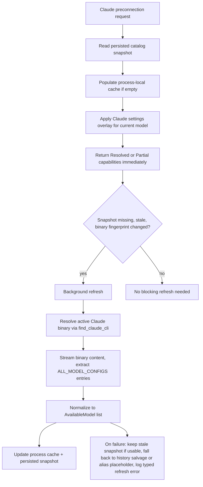

# refactor: Use authoritative Claude Code model catalog

## Overview

Replace Claude Code's preconnection model discovery (history scan + "current model" CLI probe) with an authoritative catalog extracted directly from the installed Claude Code runtime binary, backed by Acepe-owned stale-while-revalidate caches — mirroring the Copilot catalog pattern shipped in `docs/plans/2026-04-24-001-refactor-copilot-authoritative-model-catalog-plan.md`.

The user-visible outcome: Claude Code's model picker shows every model the installed runtime knows about (e.g. Opus 4.7, Sonnet 4.6, Haiku 4.5, including 1M-context variants where applicable) the first time the user ever opens the picker, and does not require any prior `claude` session history. New Claude Code releases that add a model become available in Acepe the moment the Claude binary is upgraded — no Acepe release, no API call, no user action required.

## Problem Frame

Acepe currently resolves Claude preconnection models via two mechanisms in `packages/desktop/src-tauri/src/acp/providers/claude_code.rs`:

1. `discover_claude_history_models()` scans `~/.claude/stats-cache.json` and `~/Library/Application Support/Claude/claude-code-sessions` for model IDs the user has already used.
2. `model_discovery_commands()` returns a `claude --no-session-persistence -p "Return only the exact current model id."` probe — which costs a real API call and returns only the currently-configured single model.

Neither source is a catalog. Consequences observed in production:

- On a fresh install (no prior Claude session history), the picker has effectively one model (the alias probe result).
- `claude-opus-4-7` does not appear for a user running Claude Code 2.1.119 who has never selected it, even though the Claude `/model` menu offers it natively.
- The "current model probe" spawns Claude for every preconnection attempt that triggers it, costs a billed API token roundtrip, and takes seconds.

Reverse engineering the Claude Code runtime (see "Context & Research" below) established a definitive source of truth: the full model catalog is a static constant (`ALL_MODEL_CONFIGS`) baked into the Claude binary. The Claude `/model` menu itself builds from that constant plus subscription tier + env + flags. There is no remote `/v1/models` call on the `/model` path. Acepe can extract the same constant from the installed binary without any network, OAuth, or API cost, and keep parity with whatever Claude Code version the user has.

This plan also lives inside the existing capability-resolution seam established in `docs/plans/2026-04-23-001-refactor-unified-capability-resolution-plan.md`: provider-specific sourcing stays behind the provider adapter, shared UI consumes typed capability data, and caches remain subordinate to provider-owned runtime truth.

## Requirements Trace

- R1. Use the installed Claude Code runtime binary as the authoritative source of the available model catalog instead of treating session history + current-model probes as the primary source.
- R2. Keep Claude picker latency off the interactive preconnection path; serve preconnection models from Acepe cache layers and background refresh rather than a `-p` subprocess on selection.
- R3. Surface newly released Claude models (e.g. Opus 4.7) even when they do not yet exist in the user's `~/.claude/stats-cache.json` or session files.
- R4. Preserve the existing `claude_code_settings.rs` current-model overlay so user/project-configured defaults (`"model": "sonnet"`, `ANTHROPIC_MODEL`, etc.) still shape `current_model_id` and selector emphasis.
- R5. Keep Acepe's local catalog cache subordinate and rebuildable: stale data may be served briefly for responsiveness, but runtime-derived results remain authoritative.
- R6. Preserve explicit capability semantics (`Resolved`, `Partial`, `Failed`) so the frontend never falls back to a blank or heuristic-only state.
- R7. Never make a billable Anthropic API call as part of catalog discovery; the catalog path must be purely local (binary read + filesystem).
- R8. Keep working when only alias probing is possible: if binary scan fails, continue to support a minimal fallback catalog derived from known aliases (`sonnet`, `opus`, `haiku`) without blocking the picker.

## Scope Boundaries

- This plan changes Claude Code model discovery and cache strategy only; it does not redesign generic capability resolution for all providers.
- This plan does not change Claude's `preconnectionCapabilityMode`; session/mode discovery stays as it is.
- This plan does not introduce a new user-facing login flow; Claude Max / API key auth continues to surface through the existing runtime error paths.
- This plan does not require a permanently running Claude helper daemon; persisted snapshot plus process-local cache is sufficient.
- This plan does not attempt to re-implement the subscription-tier-aware filtering that Claude's `modelOptions.ts` performs. Acepe exposes the full model catalog; selector UX decides which entries to emphasize. Tier gating would need separate provider-owned policy if desired.
- This plan does not preserve synchronous history scanning on the interactive path. History remains only as a non-interactive salvage fallback for one release cycle, matching the Copilot rollout hedge.
- This plan does not add marketing strings for 1M-context / Fast / Plan-mode variants as first-class picker entries. Those are tier- and flag-dependent in Claude's own picker and should be modeled later if user feedback demands parity.

## Context & Research

### Reverse engineering findings

- **Claude Code source mirror** (`oboard/claude-code-rev`, a runnable deobfuscated mirror) confirms:
  - `src/utils/model/configs.ts` holds `ALL_MODEL_CONFIGS` — a static map keyed by internal short names (`sonnet46`, `opus46`, `haiku45`, ...) with per-provider IDs (`firstParty`, `bedrock`, `vertex`, `foundry`).
  - `src/utils/model/modelOptions.ts` builds the `/model` picker from that constant plus `getAPIProvider()`, subscription tier flags (`isMaxSubscriber`, `isClaudeAISubscriber`, ...), 1M-context access, and env-var overrides.
  - `src/utils/model/aliases.ts` defines the closed alias set: `['sonnet', 'opus', 'haiku', 'best', 'sonnet[1m]', 'opus[1m]', 'opusplan']`.
  - New model launches land in this file; a comment marker `@[MODEL LAUNCH]` tracks the release surface.
- **Direct binary extraction** from the locally installed `~/.local/share/claude/versions/2.1.119` produces every entry from `ALL_MODEL_CONFIGS` via a single regex over `strings` output. Example line (verbatim):
  ```
  firstParty:"claude-opus-4-7",bedrock:"us.anthropic.claude-opus-4-7",vertex:"claude-opus-4-7",foundry:"claude-opus-4-7",anthropicAws:"claude-opus-4-7",mantle:"anthropic.claude-opus-4-7"
  ```
  All 12 canonical model configs present in the Claude 2.1.119 binary were recovered this way, including the newest Opus 4.7 that is currently missing from Acepe's picker. Marketing labels (`"Opus 4.7"`, `"Sonnet 4.6"`, `"Haiku 4.5"`) are also plain strings in the binary when a label is needed beyond what the canonical ID provides.
- No `/v1/models` traffic was observed during a `/model` menu open via a proxy using `CLAUDE_CODE_API_BASE_URL`. The only request captured for a single `-p` prompt was `POST /v1/messages?beta=true`, confirming that `/v1/models` is not Claude Code's catalog source.
- `claude --help` has no catalog-dump flag; `claude --model <alias> -p` resolves an alias but costs an API call and returns only a single model.

The binary-scan path therefore gives Acepe exact parity with whatever Claude Code release the user runs, at zero API cost.

### Relevant Code and Patterns

- `packages/desktop/src-tauri/src/acp/providers/claude_code.rs` currently owns both `resolve_claude_preconnection_capabilities()` and the slow `discover_claude_history_models()` path and the `model_discovery_commands()` API-billing probe.
- `packages/desktop/src-tauri/src/acp/providers/claude_code_settings.rs` already owns user/project model overlay and alias normalization (`apply_claude_session_defaults`, `compare_claude_model_ids`, `is_claude_model_id`, `resolve_claude_runtime_mode_id`). It should remain the authority for configured current-model selection, but only after the authoritative catalog has established which models are actually available.
- `packages/desktop/src-tauri/src/cc_sdk/transport/subprocess.rs::find_claude_cli()` already resolves the active Claude binary path the same way the CCSdk transport does. The catalog module should reuse this so "which binary are we reading?" is consistent between subprocess spawn and catalog scan.
- `packages/desktop/src-tauri/src/acp/providers/copilot_model_catalog.rs` is the direct structural precedent. The persisted snapshot, process-local cache, single-flight refresh, freshness windows, snapshot kinds (`Authoritative`, `HistorySalvage`, `Placeholder`), startup warmup, and post-install invalidation are all reusable patterns.
- `packages/desktop/src-tauri/src/acp/providers/copilot.rs` shows how preconnection capability resolution now delegates to the catalog module rather than scanning history on the hot path.
- `packages/desktop/src-tauri/src/acp/client/cc_sdk_client.rs` around the session-hydration call to `discover_models_from_provider_cli()` is where preconnection models are read at session open; it must read from the catalog cache instead of the `-p` probe.
- `packages/desktop/src-tauri/src/acp/capability_resolution.rs` handles `resolve_static_capabilities` / `failed_capabilities` and should stay untouched beyond being the downstream consumer.
- `packages/desktop/src-tauri/src/acp/agent_installer.rs` already invalidates Copilot catalog snapshots after install/upgrade and is the right place to add the Claude counterpart.
- `packages/desktop/src-tauri/src/lib.rs` already hosts startup prewarm patterns and is the right place to trigger non-blocking Claude catalog warmup when the runtime is installed.

### Institutional Learnings

- `docs/solutions/best-practices/provider-owned-policy-and-identity-not-ui-projections-2026-04-09.md` applies: shared UI/runtime code should consume typed provider-owned capability contracts, not infer policy from labels or history.
- `docs/plans/2026-04-24-001-refactor-copilot-authoritative-model-catalog-plan.md` established the authoritative-catalog pattern. This plan is the Claude mirror of that architecture, with the fetcher changed from "spawn Copilot and call `models.list`" to "read the installed Claude binary and extract the static catalog".
- `docs/plans/2026-04-23-001-refactor-unified-capability-resolution-plan.md` settled that provider-specific sourcing stays inside the provider adapter; we should fit inside that seam.

### External References

- Public deobfuscated Claude Code source: [`oboard/claude-code-rev`](https://github.com/oboard/claude-code-rev/blob/main/src/utils/model/configs.ts) (`src/utils/model/configs.ts`, `src/utils/model/modelOptions.ts`, `src/utils/model/aliases.ts`). Lags the latest launches (tops out at Opus 4.6) but is structurally identical to what ships today.
- `anthropics/claude-code` GitHub org (binary releases; no open catalog file). The binary itself is the canonical source, not the published source repos.
- Evidence captured during reverse engineering is summarized in the session checkpoint "Reverse engineering Claude model source".

## Key Technical Decisions

| Decision | Rationale |
|---|---|
| Use the installed Claude binary as the primary catalog source, extracting `ALL_MODEL_CONFIGS`-shaped entries by scanning for the stable `firstParty:"claude-...",bedrock:"...",vertex:"...",foundry:"..."` pattern. | Matches exactly what the `/model` picker builds from. Requires no network, no API cost, no auth. New Claude releases surface automatically when the binary is upgraded. |
| Treat the scan as a binary-content read, not an execution. | Faster, safer, zero billable side effects, and no risk of starting an interactive Claude session. |
| Resolve the target binary via `find_claude_cli()`, which returns Acepe's managed binary at `{os_cache}/cc-sdk/cli/claude`. Canonicalize the path before computing the fingerprint. | Identical rules to the runtime we actually spawn, so catalog parity with running Claude is guaranteed. |
| Use a dedicated provider-owned Claude catalog cache module instead of extending `copilot_model_catalog.rs`. | The fetch mechanism (binary scan) is fundamentally different from Copilot's JSON-RPC fetch; shared generalization would hide more than it helps. |
| Reuse the **cache shape** from `copilot_model_catalog.rs` (persisted snapshot + process-local single-flight + freshness window + snapshot kinds). | Two parallel implementations with the same structure make the pattern obvious and reviewable. |
| Cache key = absolute path to the resolved binary + its size + its mtime. Rescan only on mismatch. | Binary content cannot change without one of these changing. Avoids scanning a 40 MB file on every request. |
| Persist `fetched_at`, canonical binary path, binary `size + mtime` and Claude runtime version string; treat `<=4h` as fresh, `4h-48h` as stale-servable, anything older or with mismatched fingerprint as unusable. | Deterministic freshness policy, matches Copilot cache semantics, converges automatically after a Claude upgrade. |
| Define three snapshot kinds: `Authoritative` (from binary scan), `HistorySalvage` (from the existing stats-cache + session scan), `Placeholder` (aliases-only minimal seed). | Callers can tell whether a capability snapshot is safe to mark `Resolved` vs `Partial`. Extends Copilot's `{ Authoritative, HistorySalvage }` kinds with a Claude-specific `Placeholder` (aliases-only seed) for the deeper fallback hierarchy the binary-scan path requires. |
| Remove the `claude -p "Return only the exact current model id"` probe from `model_discovery_commands()`. | It costs billable API tokens per preconnection and returns a single model, not a catalog. It is also the main reason Opus 4.7 is invisible today. |
| Keep `discover_claude_history_models()` as an off-hot-path salvage hedge for one release cycle. | De-risks the cutover if binary scanning ever misses. Never synchronous on picker interaction. |
| Build marketing labels from canonical IDs (`claude-opus-4-7` -> `Opus 4.7`) as the default; only upgrade to string-scanned marketing labels if the default looks wrong in practice. | Canonical IDs already encode the needed semantics; the binary-scan format is stable because it comes from a static constant. |
| When a user/project config references a model absent from the authoritative catalog, authoritative availability wins; selection falls back to the alias target and records a typed diagnostic. | Stale config cannot silently fabricate a non-existent model. Same semantics as Copilot. |

## Open Questions

### Resolved During Planning

- **Should Acepe keep calling `claude -p "..."` to probe current model?** No. It costs real API tokens, returns a single model, and is the direct cause of Opus 4.7 being invisible.
- **Should Acepe fetch `/v1/models` with the user's OAuth token?** No. The `/model` picker does not source from `/v1/models`; the catalog is baked into the binary. Reading the binary avoids any auth/token handling.
- **Should Acepe depend on the `claude-code-rev` mirror at runtime?** No. The mirror is research evidence that the binary is the source of truth, not a production dependency.
- **Should Acepe ship a hardcoded fallback catalog?** Only as a minimal alias-derived `Placeholder` kind (e.g. the three alias families) used when binary scanning fails. Not a full catalog — that would drift.
- **Should we extend `copilot_model_catalog.rs` generically?** No. The fetch mechanism diverges; shared cache types would quickly accrete provider-specific flags.
- **Should we keep history scanning on the hot path?** No. History remains only as a non-interactive salvage hedge for one release cycle.
- **Does tier filtering (Max / Pro / Team / PAYG) belong here?** No. Acepe exposes the full catalog; tier-aware suppression is a UX decision handled separately if needed.

### Deferred to Implementation

- Exact regex vs. streaming parser approach for extracting `ALL_MODEL_CONFIGS` entries from the binary, as long as it handles Mach-O / ELF / PE binaries, ignores false-positive matches in embedded string literals inside error messages, and is resilient to minor formatting differences across Claude versions.
- Exact on-disk location for the persisted Claude catalog snapshot. Should live beside the Copilot snapshot under the existing catalogs directory to keep cache ops uniform.
- Whether to incorporate marketing strings from the binary (e.g. `"Opus 4.7 · Most capable for complex work"`) as `AvailableModel.description`, or derive descriptions from canonical IDs only. Start with canonical-derived labels and add binary-derived descriptions only if user feedback requires it.

## Dependencies / Prerequisites

- Lands on top of (or is rebased onto) the Copilot authoritative catalog module, because this plan reuses its cache shape and writes snapshots in the same directory.
- Before implementation starts, pin a test fixture: the raw extracted `firstParty:"..."` lines from at least two Claude binary versions (`2.1.118` and `2.1.119` on the current machine). Tests read these fixtures rather than shelling out to the installed runtime so CI stays deterministic.

## High-Level Technical Design

> *This illustrates the intended approach and is directional guidance for review, not implementation specification. The implementing agent should treat it as context, not code to reproduce.*



Shape of each extracted entry (normalized):
- `model_id`: canonical first-party ID, e.g. `claude-opus-4-7`.
- `name`: derived marketing label, e.g. `Opus 4.7`.
- `description`: optional; initially `None`.

## Implementation Units

- [ ] **Unit 1: Add an authoritative Claude catalog extractor and cache module**

**Goal:** Introduce one provider-owned module that can locate the active Claude binary, extract the baked-in model catalog, and cache it with the same snapshot contract used for Copilot.

**Requirements:** R1, R2, R3, R5, R6, R7, R8

**Dependencies:** None (but reuses patterns from `copilot_model_catalog.rs`)

**Files:**
- Create: `packages/desktop/src-tauri/src/acp/providers/claude_code_model_catalog.rs`
- Modify: `packages/desktop/src-tauri/src/acp/providers/mod.rs`
- Test: `packages/desktop/src-tauri/src/acp/providers/claude_code_model_catalog.rs`
- Test fixtures: pinned excerpts of `firstParty:"..."` lines from two Claude binary versions (stored as small `.txt` fixtures under `packages/desktop/src-tauri/src/acp/providers/fixtures/claude_catalog/`).

**Approach:**
- Resolve the active Claude binary via `cc_sdk::transport::subprocess::find_claude_cli()` (which returns Acepe's managed binary at `{os_cache}/cc-sdk/cli/claude`). Canonicalize the path before computing the fingerprint so cache keys stay stable across cosmetic path differences.
- Derive the cache key from `{canonical_path, binary_size, binary_mtime}`; if the key matches the persisted snapshot fingerprint, serve from cache without rescanning.
- On cache miss, stream the binary file chunk-by-chunk (do not allocate a 40+ MB Vec) and run a regex over UTF-8-decodable chunks. The primary anchor is `firstParty:"(claude-[A-Za-z0-9-]+)"`, found independently; each candidate is then validated by checking that the surrounding entry (within a bounded byte window) also contains `bedrock:"..."` and at least one of `vertex:"..."` / `foundry:"..."`. Do **not** assume `firstParty` is the first key — Bun/esbuild may re-order object keys between releases; the extractor must tolerate any key order.
- Apply a minimum-match sanity floor before writing an `Authoritative` snapshot: if fewer than 3 distinct `claude-...` IDs are recovered in a plausible scan, treat the scan as failed and fall through the fallback chain. Below the floor is indistinguishable from a regex-pattern break and should never produce a confidently-empty `Authoritative` snapshot.
- Validate each matched `model_id` against the known-shape pattern `claude-[a-z]+-[0-9]+` (at least one digit version component). Matches failing this shape are dropped and logged at debug level so the fixture-comparison test catches new ID families.
- Normalize each captured group into `AvailableModel { model_id, name, description: None }` where `name` is derived from the canonical ID. Derivation rule: strip any trailing date suffix matching `-[0-9]{8}$`, then map the leading family segment to a capitalized marketing word (`opus` -> `Opus`, `sonnet` -> `Sonnet`, `haiku` -> `Haiku`) and join the remaining numeric segments with a dot as the version (e.g. `claude-opus-4-7` -> `Opus 4.7`, `claude-haiku-4-5-20251001` -> `Haiku 4.5`, `claude-3-7-sonnet-20250219` -> `Sonnet 3.7`).
- Sort the output with the existing `compare_claude_model_ids` ordering so the picker is deterministic.
- Layer cache responsibilities exactly as Copilot does:
  - a process-local single-flight cache for the current app run,
  - a small persisted snapshot (JSON) for cross-restart warm loads.
- Persist: `fetched_at_ms`, `binary_path`, `binary_size`, `binary_mtime_ms`, `runtime_version_string` (read from a recognizable version string embedded in the binary; the path-suffix approach used by the native Claude auto-updater layout does not apply to Acepe's managed binary at `{os_cache}/cc-sdk/cli/claude`), `catalog_kind` in `{ Authoritative, HistorySalvage, Placeholder }`, and the `models` array.
- Freshness windows identical to Copilot: `<= 4h` fresh, `4h-48h` stale-servable, anything older or with mismatched fingerprint triggers refresh.
- Define a typed `ClaudeCatalogRefreshReason` enum covering `Missing`, `Stale`, `Expired`, `BinaryFingerprintMismatch`, `RuntimeVersionMismatch`, `SnapshotReadFailed`.
- On refresh failure (binary not found, regex produced zero matches, IO error), fall back in this order:
  1. most recent stale-but-usable authoritative snapshot,
  2. `HistorySalvage` snapshot built from the existing `discover_claude_history_models()` logic (which moves into this module as a private helper so the provider hot path no longer calls it directly),
  3. `Placeholder` snapshot containing the three alias targets Claude itself knows about (resolved via the closed alias set from `aliases.ts`).
- Bound IO with a hard read timeout; never read more of the binary than necessary (early-return once a reasonable number of matches have been captured or the scan budget is exhausted, since false positives become increasingly unlikely after the known region).

**Patterns to follow:**
- `packages/desktop/src-tauri/src/acp/providers/copilot_model_catalog.rs` (primary structural precedent)
- `packages/desktop/src-tauri/src/cc_sdk/transport/subprocess.rs` (binary resolution)

**Test scenarios:**
- Happy path: fixture containing the 12 canonical `firstParty:"..."` lines from Claude 2.1.119 produces 12 normalized `AvailableModel`s including `claude-opus-4-7`, sorted newest-first.
- Happy path: a warm in-process cache hit returns without re-reading the binary file.
- Happy path: marketing-label derivation from canonical IDs produces the expected labels (`Opus 4.7`, `Sonnet 4.6`, `Haiku 4.5`, `Opus 4.1`, `Sonnet 3.7`, `Haiku 3.5`).
- Edge case: persisted snapshot exists but the binary path / size / mtime differs; the snapshot is treated as unusable and a refresh is required.
- Edge case: binary is found but regex yields zero matches; the module falls back to `HistorySalvage`, then `Placeholder`, and records the refresh reason.
- Edge case: a duplicate `firstParty:` entry (same canonical ID appearing twice) is deduped to a single `AvailableModel`.
- Error path: `find_claude_cli()` returns an error; the module returns a typed `Failed` result without panicking.
- Error path: file IO fails mid-scan; the module surfaces a typed refresh failure and leaves any existing stale snapshot usable.
- Error path: the scan exceeds its read budget; it is aborted cleanly and a typed timeout-like refresh failure is surfaced.
- Integration: a successful extraction writes a snapshot a fresh process can read back into the same normalized model list.

**Verification:**
- The module can produce the full Claude 2.1.119 model list, including `claude-opus-4-7`, without any network call, without shelling out to `claude`, and without reading session history.
- The cache contract can serve snapshots immediately, refresh independently, and preserve explicit success/failure semantics for callers.

- [ ] **Unit 2: Replace Claude hot-path discovery with cached authoritative resolution**

**Goal:** Make Claude preconnection capability resolution and session hydration serve from the new catalog cache while preserving `claude_code_settings.rs` current-model overlay and explicit capability status.

**Requirements:** R1, R2, R3, R4, R5, R6, R7

**Dependencies:** Unit 1

**Files:**
- Modify: `packages/desktop/src-tauri/src/acp/providers/claude_code.rs`
- Modify: `packages/desktop/src-tauri/src/acp/providers/claude_code_settings.rs`
- Modify: `packages/desktop/src-tauri/src/acp/client/cc_sdk_client.rs`
- Test: `packages/desktop/src-tauri/src/acp/providers/claude_code.rs`

**Approach:**
- Rework `resolve_claude_preconnection_capabilities()` to read from the authoritative cache from Unit 1 instead of calling `discover_claude_history_models()` directly on the hot path.
- Remove the `claude -p "Return only the exact current model id"` probe from `ClaudeCodeProvider::model_discovery_commands()` (either return empty or route to a cheap no-API-cost path; the catalog is the catalog now).
- Replace the `discover_models_from_provider_cli()` method on the Claude cc-sdk client in `cc_sdk_client.rs` with a direct read from the Claude catalog cache module. It must no longer delegate to `crate::acp::capability_resolution::discover_models_from_provider_cli`; the command-list indirection exists specifically to run a CLI probe and is irrelevant once the catalog cache is authoritative. `capability_resolution.rs` itself is not modified — it remains a downstream consumer of capability snapshots for providers that still use CLI probes.
- Keep `apply_claude_session_defaults()` as the overlay that selects the configured current model, but only from models present in the authoritative catalog (or an alias resolution that maps onto it). Before looking up a user/project-configured model in the catalog, normalize Bedrock / Vertex / Foundry IDs (e.g. `us.anthropic.claude-opus-4-7`, `claude-opus-4-7@20250514`) to their firstParty equivalents using the per-provider mappings captured by the catalog module. Without this, a Bedrock/Vertex user's configured model would spuriously report as unavailable.
- Define clear status behavior:
  - `Authoritative` snapshot present -> `Resolved`.
  - only `HistorySalvage` or `Placeholder` snapshot available -> `Partial`.
  - no usable snapshot at all (extraction failed and history/placeholder empty) -> `Failed`.
- If user/project config references a model absent from the authoritative catalog, do not inject it as a live option. Fall back to the alias target (`sonnet` -> current default Sonnet from catalog) and record an explicit unavailable-model diagnostic.
- Remove full-history scanning from the interactive path so picker latency is no longer tied to historical session size.
- Preserve a temporary, off-hot-path rollout hedge: if the authoritative path yields zero usable models and the migration hedge flag is enabled, schedule background history salvage; expose the result only as `Partial`. Never runs synchronously on picker interaction. Remove after one release cycle.

**Execution note:** Start with failing provider-level tests capturing the current "opus 4.7 missing" behavior from fixture data before deleting the `-p` probe.

**Patterns to follow:**
- `packages/desktop/src-tauri/src/acp/providers/copilot.rs` (after Copilot catalog refactor)
- `packages/desktop/src-tauri/src/acp/providers/claude_code_settings.rs`

**Test scenarios:**
- Happy path: cached authoritative catalog plus a user settings `"model": "sonnet"` returns a resolved capability snapshot whose `current_model_id` is the Sonnet entry from the catalog.
- Happy path: a user with no prior Claude history and no explicit model setting still sees the full catalog, including `claude-opus-4-7`, on first preconnection.
- Edge case: settings reference `claude-opus-4-6` but the running binary only exposes `claude-opus-4-7`; resolution falls back to the `opus` alias target in the catalog and records an unavailable-model diagnostic without mutating the catalog list.
- Edge case: no settings exist; provider still returns a meaningful multi-model list rather than just the current default.
- Error path: binary scan succeeded but the snapshot is only `HistorySalvage`; provider returns `Partial`.
- Error path: no usable snapshot exists at all; provider returns `Failed` with a typed reason, not an empty success-shaped response.
- Integration: selecting Claude in a never-connected project resolves models from cache + settings overlay without shelling out to `claude -p`.

**Verification:**
- Claude preconnection capability resolution no longer depends on history size, does not make any API call, and shows Opus 4.7 for a user who has never selected it.
- The returned capability snapshot preserves authoritative catalog coverage, settings-based current-model behavior, and explicit unavailable-model handling.

- [ ] **Unit 3: Warm, invalidate, and observe the Claude catalog outside the interactive path**

**Goal:** Ensure the authoritative Claude catalog is normally ready before the user opens the picker, and that Claude installs/upgrades converge without blocking the UI.

**Requirements:** R2, R3, R5, R6, R7

**Dependencies:** Units 1-2

**Files:**
- Modify: `packages/desktop/src-tauri/src/lib.rs`
- Modify: `packages/desktop/src-tauri/src/acp/agent_installer.rs`
- Modify: `packages/desktop/src-tauri/src/acp/providers/claude_code.rs`
- Test: `packages/desktop/src-tauri/src/lib.rs`

**Approach:**
- Add startup warmup that checks whether Claude is installed (via `find_claude_cli()`) and, if so, refreshes the catalog in the background only when the snapshot is missing, expired, or has a stale binary fingerprint.
- Warmup writes only the global base catalog snapshot. Settings/project overlay still happens at request time, so startup work never persists project-specific selection state.
- Invalidate or refresh the snapshot when Claude is installed/upgraded through Acepe so new runtime versions do not wait for organic picker usage. Hook into the same site in `agent_installer.rs` that Copilot uses.
- Route all background refresh entry points through the same single-flight primitive and bound the scan with the Unit 1 budget.
- Add lightweight tracing around cache source (memory / disk / fresh scan), refresh reason, fallback kind, and refresh duration so regressions are visible in existing logs.
- Keep the frontend contract unchanged: the backend delivers faster, more complete capability snapshots without asking the UI to learn a Claude-specific fast path.

**Patterns to follow:**
- `packages/desktop/src-tauri/src/lib.rs`
- `packages/desktop/src-tauri/src/acp/provider.rs`
- `packages/desktop/src-tauri/src/acp/agent_installer.rs`

**Test scenarios:**
- Happy path: startup warmup schedules a refresh when Claude is installed and leaves the rest of app initialization non-blocking.
- Happy path: an install/upgrade event (e.g. transition from `2.1.118` to `2.1.119`) invalidates the previous snapshot and triggers a refresh path.
- Edge case: Claude is not installed; warmup is skipped cleanly.
- Edge case: startup sees a binary-fingerprint mismatch (same path, different size/mtime) and forces refresh instead of serving a now-invalid snapshot.
- Error path: background refresh fails because `find_claude_cli()` errors; stale snapshot remains usable and the failure is logged.
- Integration: concurrent refresh requests dedupe to one underlying authoritative scan and one snapshot write.

**Verification:**
- Typical app usage reaches the Claude model picker with a warm authoritative snapshot already available.
- Runtime version changes and refresh failures are observable without reintroducing blocking behavior on the picker.

## System-Wide Impact

- **Interaction graph:** Claude install state, startup warmup, provider preconnection resolution, and selector capability precedence all now depend on one provider-owned catalog cache instead of scattered history parsing and `-p` probes.
- **Error propagation:** binary-scan failures must degrade to typed `Partial`/`Failed` capability states with stale snapshot reuse when available; they must not surface as empty `Resolved` payloads.
- **State lifecycle risks:** stale snapshot invalidation, concurrent refresh deduplication, install/upgrade transitions, and binary fingerprint drift (e.g. Claude auto-updater swapping the symlink) are the primary lifecycle edges.
- **API surface parity:** the returned payload must remain compatible with `ResolvedCapabilities` and existing frontend capability-source precedence; no Claude-only frontend contract should be introduced.
- **Billing surface:** removal of `claude -p "..."` as a preconnection probe eliminates an unintentional per-preconnection API cost. This is a user-facing bill-reduction side effect that belongs in the PR description.
- **Integration coverage:** backend tests must prove cache hit/miss, startup warmup, and settings overlay together because unit tests on the extractor alone will not catch status/preconnection regressions.
- **Unchanged invariants:** live connected-session capabilities remain authoritative after session start; `providerMetadata.preconnectionCapabilityMode` stays unchanged for Claude; model selector rendering logic continues to consume generic capability data only; the persisted snapshot never stores project-specific overlay state.

## Risks & Dependencies

- **Binary format drift:** if Anthropic ever changes how `ALL_MODEL_CONFIGS` is serialized in the compiled Bun bundle (e.g. object-shorthand minification, key reordering, or moving to a non-constant representation), the regex breaks. Mitigations: pinned fixtures per version in tests; fallback chain (authoritative -> stale -> history salvage -> placeholder); explicit `Partial`/`Failed` status surfaces so callers don't silently lose the picker. Revisit if a future Claude release fails extraction.
- **Subscription-tier divergence:** Claude's native `/model` picker hides some models per tier (Max vs Pro vs PAYG). Acepe will show the full catalog. This is called out in Scope Boundaries; if user feedback requests tier-aware suppression, it becomes a follow-up plan that lives behind provider-owned policy, not UI heuristics.
- **1M-context / Fast / Plan-mode variants:** Claude's picker synthesizes entries like `Opus (1M context)` from flags, not from `ALL_MODEL_CONFIGS`. Acepe will surface only the base canonical models. Deferred to a follow-up plan if users ask for picker parity.
- **Acepe installer upgrade races:** Acepe's `agent_installer.rs` manages the Claude binary at `{os_cache}/cc-sdk/cli/claude` (returned by `find_claude_cli()`). When Acepe upgrades Claude to a new version it replaces this file, changing the mtime. Mitigation: the snapshot fingerprint is the resolved binary path + size + mtime; any mismatch triggers a refresh on the next read. Unit 3's install-event hook in `agent_installer.rs` also proactively invalidates the snapshot after an upgrade. Note: Claude's own external auto-updater (which manages `~/.local/share/claude/versions/`) does not affect Acepe's managed binary, so it is not a race source for this plan.
- **Coexistence with the rollout hedge:** while the history-salvage hedge remains enabled, a scenario where binary scan fails silently could leave users on a reduced picker. Tracing from Unit 3 must make fallback kind visible so regressions are caught within one release.

## Rollout Plan

- Land Unit 1 first; merge only after fixture-based tests prove extraction parity across `2.1.118` and `2.1.119`.
- Land Units 2-3 together so the hot path, session hydration, and warmup all flip atomically. Keep the history-salvage hedge enabled for the first release that ships this change.
- After one release cycle with no `HistorySalvage` fallback reports in CI integration test runs and no user-reported picker regressions, remove the hedge and delete `discover_claude_history_models()` along with the API-billing probe call site.
