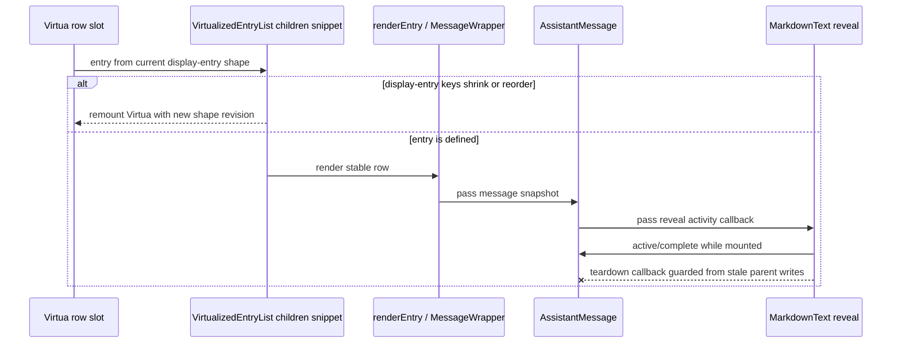

# fix: Prevent agent panel virtualized reveal teardown crashes

## Overview

The dev app crash is caused by a teardown-time interaction between Virtua row recycling, Svelte 5 snippet argument getters, and destructive changes to Acepe's projected display-entry list. The fix should make virtualizer ownership lifecycle-safe when display rows shrink or reorder, without weakening live streaming animation, thread-follow behavior, or final markdown rendering.

## Problem Frame

The live Tauri app reported repeated `Agent panel crashed` errors in the agent panel:

- `undefined is not an object (evaluating 'entry().message')`
- `undefined is not an object (evaluating '$.get(safeMessage).chunks')`
- `undefined is not an object (evaluating '$.get(groupedChunks).messageGroups')`

Tauri MCP console logs showed the first error at the virtualized list row boundary while the panel was rendering a conversation with two entries. The downstream `AssistantMessage` errors are derived-state cascade failures after the virtual row's `entry` getter becomes undefined.

The confirmed root causal chain is:

1. `buildVirtualizedDisplayEntries()` projects dense session entries into display entries that are not strictly append-only: consecutive assistant entries can merge into one row, and the synthetic thinking row can appear/disappear.
2. During active reveal teardown or session/list churn, that display-entry sequence can shrink or replace existing keys while the same Virtua instance still owns row components from the previous shape.
3. A stale Virtua row index can then re-enter `packages/desktop/src/lib/acp/components/agent-panel/components/virtualized-entry-list.svelte`'s `children` snippet against the new shorter/reordered `displayEntries` array.
4. Svelte compiled output reads the snippet parameter as `entry().message`; because the stale index resolves to `undefined`, the boundary crashes before `AssistantMessage`'s invalid-message fallback can run.
5. Existing `$derived` values in `AssistantMessage` then re-evaluate from a partially invalid prop graph, producing the secondary `safeMessage.chunks` and `groupedChunks.messageGroups` errors.

## Requirements Trace

- R1. Destructive display-entry shape changes must not let stale virtualizer row indexes instantiate or re-enter message components.
- R2. Markdown reveal completion must continue to update `AssistantMessage` while the message is mounted and active.
- R3. Markdown reveal teardown must not write into a parent that is being destroyed or into a stale virtualized row.
- R4. Live streaming, trailing-block hiding, final markdown rendering, thread-follow, detach, and send-time reveal behavior must not regress.
- R5. The fix must be covered by behavior tests that reproduce the crash seam, not structural tests that assert on source text.
- R6. The fix must stay in desktop-owned agent-panel/reveal components; shared `@acepe/ui` presentational components should not absorb desktop virtualization lifecycle policy.

## Scope Boundaries

- Do not replace Virtua or redesign the full agent-panel virtualization stack.
- Do not change provider session semantics, ACP chunk formats, or the session graph model.
- Do not push lifecycle/null-entry policy into `packages/ui`.
- Do not remove the streaming markdown reveal feature or bypass animation as the fix.
- Do not broadly rewrite existing `$effect` usage; make the affected cleanup paths idempotent and safe.

## Context & Research

### Relevant Code and Patterns

- `packages/desktop/src/lib/acp/components/agent-panel/components/virtualized-entry-list.svelte` already has defense-in-depth for missing rows: `getKey(entry, index)` handles `undefined`, `reportMissingVirtualizedEntry` logs diagnostics, and `renderEntry` has an `{#if entry}` guard.
- `packages/desktop/src/lib/acp/components/agent-panel/components/__tests__/virtualized-entry-list.svelte.vitest.ts` already has a `setUndefinedRenderedIndexes` harness and a churn test, but `AssistantMessage` is mocked, so it cannot catch this derived-teardown crash.
- `packages/desktop/src/lib/acp/components/messages/assistant-message.svelte` has `resolveAssistantMessage` and an invalid-prop test, but the crash happens before the prop reaches that guard.
- `packages/desktop/src/lib/acp/components/messages/markdown-text.svelte` reports reveal activity through `onRevealActivityChange` and also calls the callback from teardown.
- `packages/desktop/src/lib/acp/components/messages/__tests__/fixtures/content-block-router-growing-stub.svelte` already models active reveal and cleanup callback behavior for tests.

### Institutional Learnings

- `docs/solutions/best-practices/svelte5-unconditional-snippet-props-2026-04-12.md`: snippet boundaries are compile-time sensitive in Svelte 5; guards need to live at the boundary where optional values enter, not deep in a later branch.
- `docs/solutions/best-practices/reactive-state-async-callbacks-svelte-2026-04-15.md`: reactive values crossing delayed/lifecycle boundaries must be captured or guarded because the owner may have changed by callback time.
- `docs/solutions/logic-errors/thinking-indicator-scroll-handoff-2026-04-07.md`: virtualized/synthetic rows need separate ownership decisions for reveal targeting and resize/follow behavior; broad "force latest thing" fixes leak across frames.
- `docs/brainstorms/2026-04-15-streaming-markdown-during-reveal-requirements.md`: live markdown must preserve reveal timing, avoid re-animation/flicker, and hand off continuously to final rendering.
- `docs/brainstorms/2026-04-09-finished-session-scroll-performance-requirements.md`: changes in the virtualized thread must protect live follow/detach/send reveal behavior.
- `docs/brainstorms/2026-04-10-agent-panel-ui-extraction-reset-requirements.md`: desktop retains virtualization, scroll-follow, reveal behavior, and session-context wiring around shared UI components.

### External References

- External research is not needed for this plan. The issue is rooted in Acepe-specific Svelte 5/Virtua lifecycle integration and already has strong local patterns and tests.

## Key Technical Decisions

- Remount the Virtua instance when the ordered display-entry key sequence changes destructively: shrink or non-prefix key replacement. Normal appends must stay in-place to preserve auto-scroll/reveal behavior.
- Keep the Virtua `children` snippet boundary guard as defense-in-depth. The row slot is the first place a missing `entry` can enter Svelte compiled snippet code, but the root fix is preventing stale rows from reaching that boundary during destructive data-shape changes.
- Treat reveal teardown callbacks as lifecycle-boundary callbacks when Unit 1 confirms they participate in the failure. A cleanup callback is not the same as a genuine reveal-complete signal; the parent should only mutate reveal state for the current mounted message path.
- Prefer behavior regression tests over source-shape assertions. The crash is a runtime lifecycle interaction between Svelte, Virtua, and streaming reveal; tests must mount components and exercise churn/unmount behavior.
- Keep the fix local to desktop rendering/controller components. `packages/ui` receives already-resolved presentational data and should not know about Virtua row recycling or desktop reveal lifecycle.
- Preserve existing diagnostic logging. `reportMissingVirtualizedEntry` is useful evidence in development and should remain available after the guard moves closer to the VList boundary.

## Open Questions

### Resolved During Planning

- Should this be fixed in `AssistantMessage`'s invalid-message fallback? No. The first crash occurs while evaluating `entry().message` before the fallback can receive a candidate message.
- Should the fix replace Virtua? No. The bug is Acepe's ownership boundary around a projected display-entry array whose key sequence can shrink/reorder while the same Virtua instance is mounted.
- Should shared UI components handle missing entries? No. Desktop owns virtualization and reveal lifecycle policy.
- What should happen to trailing non-text blocks after keyed session navigation/remount during an active reveal? Reveal state does not carry across session boundaries; on return after a keyed VList remount, settled trailing blocks should be visible immediately without re-animation.

### Deferred to Implementation

- Exact reveal-lifecycle guard shape: decide after the failing teardown test is written whether the cleanest fix is in `MarkdownText` teardown, `AssistantMessage`'s callback handler, or the reveal controller's `destroy()` behavior. Unit 3 should not proceed unless Unit 1 confirms the reveal callback path participates in the failure after the VList boundary is guarded.
- Whether `reveal.destroy()` currently mutates reactive state in a way that double-fires `onRevealActivityChange(false)`: confirm with a focused test before changing it.

## High-Level Technical Design

> *This illustrates the intended approach and is directional guidance for review, not implementation specification. The implementing agent should treat it as context, not code to reproduce.*

## Implementation Units

- [x] **Unit 1: Add regression coverage for virtualized reveal teardown**

**Goal:** Prove the reported crash with behavior tests before changing implementation code.

**Requirements:** R1, R2, R3, R5

**Dependencies:** None

**Files:**
- Modify: `packages/desktop/src/lib/acp/components/agent-panel/components/__tests__/virtualized-entry-list.svelte.vitest.ts`
- Modify or create fixture: `packages/desktop/src/lib/acp/components/agent-panel/components/__tests__/fixtures/*`
- Modify: `packages/desktop/src/lib/acp/components/messages/assistant-message.svelte.vitest.ts`
- Modify: `packages/desktop/src/lib/acp/components/messages/markdown-text.svelte.vitest.ts`

**Approach:**
- Extend the existing virtualized-list test harness so at least one test uses the real `AssistantMessage` path or a fixture that preserves its reveal callback behavior instead of the current blanket mock.
- Add a virtualized churn scenario: render an assistant message whose text keeps reveal active, then simulate Virtua returning `undefined` for that rendered index or remove the assistant entry while the reveal subtree is active.
- Add direct message-level coverage for unmounting an active reveal subtree so the parent callback path is tested without Virtua.
- Add markdown-level coverage for active reveal unmount semantics so the fix can distinguish genuine reveal-complete from teardown cleanup.

**Execution note:** Start test-first. The first virtualized churn test should fail for the same class of error as the live Tauri MCP crash, not for unrelated fixture setup.

**Patterns to follow:**
- `setUndefinedRenderedIndexes` and the existing "ignores transient undefined rows from Virtua during data churn" test in `virtualized-entry-list.svelte.vitest.ts`.
- `[reveal-active]` behavior in `content-block-router-growing-stub.svelte`.
- Invalid-prop fallback tests in `assistant-message.svelte.vitest.ts`.

**Test scenarios:**
- Integration: render a virtualized list with one active assistant reveal, make Virtua return `undefined` for that row index, and expect no thrown error and no agent-panel crash UI.
- Integration: render an active assistant reveal, rerender the list with that assistant entry removed, and expect teardown to complete without re-reading `entry.message`.
- Edge case: switch `sessionId` while an assistant reveal is active and expect the keyed VList remount to complete without callback-driven crashes.
- Edge case: unmount `AssistantMessage` while reveal is active and expect no derived cascade from `safeMessage` or `groupedChunks`.
- Happy path: finish reveal normally and confirm trailing non-text blocks become visible only after genuine reveal completion.

**Verification:**
- The new tests fail before the implementation fix for the same lifecycle seam and pass after the fix.

- [x] **Unit 2: Remount Virtua on destructive display-entry shape changes**

**Goal:** Ensure stale virtual rows from a previous display-entry shape never instantiate or re-enter downstream message components.

**Requirements:** R1, R4, R5, R6

**Dependencies:** Unit 1

**Files:**
- Modify: `packages/desktop/src/lib/acp/components/agent-panel/components/virtualized-entry-list.svelte`
- Test: `packages/desktop/src/lib/acp/components/agent-panel/components/__tests__/virtualized-entry-list.svelte.vitest.ts`

**Approach:**
- Track the ordered display-entry key sequence.
- Increment a VList shape revision when the next sequence is shorter or no longer has the previous keys as a prefix.
- Include that shape revision in the keyed VList boundary so Virtua remounts for destructive shape changes.
- Do not remount for normal append-only transitions; existing auto-scroll and thinking-indicator reveal behavior depends on preserving the active VList instance during appends.
- Widen the VList `children` snippet argument to accept `VirtualizedDisplayEntry | undefined` only as defense-in-depth.
- Put the `entry` identity guard at the `children` snippet boundary before calling `renderEntry`.
- Preserve `reportMissingVirtualizedEntry(index)` for development diagnostics.
- Keep `renderEntry`'s own guard as defense-in-depth because native fallback and future call sites may still pass through it directly.
- Confirm the `getKey` fallback still produces stable enough behavior for transient missing rows and does not create a new remount loop.

**Patterns to follow:**
- Existing `getKey(entry, index)` and `reportMissingVirtualizedEntry(index)` behavior in `virtualized-entry-list.svelte`.
- `docs/solutions/best-practices/svelte5-unconditional-snippet-props-2026-04-12.md`: guard optional snippet values at the boundary.

**Test scenarios:**
- Edge case: a fixture that retains the previous rendered range after the display data shrinks should not produce a missing-row diagnostic; this proves the VList remounted before stale indexes reached the child snippet.
- Edge case: `setUndefinedRenderedIndexes([0])` with an assistant entry should render no assistant subtree for the missing row and should not throw; this keeps the boundary guard honest as defense-in-depth.
- Edge case: missing row diagnostics should remain limited/deduped in development mode.
- Edge case: a transient undefined row at index N followed by the same valid entry reappearing at index N does not cause repeated remounts or unstable keys.
- Integration: native fallback rendering should still render valid rows and skip no valid entries.

**Verification:**
- A destructive display-entry shape change remounts Virtua before a stale row index can reach `UserMessage`, `AssistantMessage`, `ToolCallRouter`, or `AgentPanelConversationEntry`.
- No `@acepe/ui` file is modified; lifecycle policy remains in desktop components only.

- [x] **Unit 3: Make reveal activity callbacks teardown-safe**

**Goal:** Stop cleanup-time reveal callbacks from mutating stale parent state while preserving genuine reveal activity and completion updates.

**Requirements:** R2, R3, R4, R5, R6

**Dependencies:** Unit 1, and Unit 2 before proceeding past diagnosis if Unit 2 alone prevents the reported crash.

**Files:**
- Modify (one or more, per Unit 1 results): `packages/desktop/src/lib/acp/components/messages/markdown-text.svelte`
- Modify (one or more, per Unit 1 results): `packages/desktop/src/lib/acp/components/messages/assistant-message.svelte`
- Modify if confirmed: `packages/desktop/src/lib/acp/components/messages/logic/create-streaming-reveal-controller.svelte.ts`
- Test: `packages/desktop/src/lib/acp/components/messages/markdown-text.svelte.vitest.ts`
- Test: `packages/desktop/src/lib/acp/components/messages/assistant-message.svelte.vitest.ts`
- Test if reveal controller changes: `packages/desktop/src/lib/acp/components/messages/logic/__tests__/create-streaming-reveal-controller.test.ts`

**Approach:**
- Treat `onRevealActivityChange(false)` from normal reveal completion as valid and keep it synchronous enough to unhide trailing blocks.
- Treat component teardown as a separate lifecycle case that must not re-enter stale parent state.
- Prefer a small liveness/version guard over broad fallbacks. The guard should be keyed to the specific rendered text group or mounted message lifecycle, not to global streaming state.
- Avoid adding new `$effect` blocks. If implementation needs a mounted/version flag, it must be a plain JavaScript `let`, not `$state` or `$derived`; writing reactive state during cleanup is the failure mechanism this unit is trying to avoid.
- Prefer `MarkdownText` ownership for any key/version guard because `_revealKey` is available where teardown originates. Capture the active reveal key or mount generation in a plain `let` and skip cleanup-time activity callbacks that no longer match the mounted instance. Move ownership to `AssistantMessage` only if tests prove the child cannot distinguish stale callbacks locally.
- Use these decision criteria after Unit 1 tests identify the callback path:
  - If the callback fires once from `MarkdownText` cleanup, guard in `MarkdownText` cleanup because that is the narrowest scope.
  - If the callback double-fires or the second write comes from `reveal.destroy()`, make `reveal.destroy()` timer/resource cleanup only and keep genuine completion on the existing synchronous reveal-complete path.
  - Do not guard in `AssistantMessage`'s callback handler unless both narrower locations are ruled out, because that handler owns trailing-block visibility.
- Confirm whether `reveal.destroy()` should only cancel timers/resources or whether state reset belongs before the teardown callback; make that change only if the focused markdown test proves it is part of the double-callback cascade.

**Patterns to follow:**
- `docs/solutions/best-practices/reactive-state-async-callbacks-svelte-2026-04-15.md`: capture or guard reactive state before lifecycle/async boundaries.
- `assistant-message.svelte` existing `visibleMessageGroups` behavior for hiding trailing non-text blocks during active reveal.
- `markdown-text.svelte` existing normal activity reporting semantics.

**Test scenarios:**
- Happy path: active streaming reveal reports `true`, genuine reveal completion reports `false`, and trailing non-text groups become visible.
- Edge case: unmount active `MarkdownText` during streaming and expect no parent state write that re-enters stale `entry.message`.
- Edge case: unmount `AssistantMessage` while `isMessageTextRevealActive` is true and expect no derived cascade crash.
- Integration: rerender with a different `revealMessageKey` while reveal is active and ensure stale callbacks do not affect the new message key.
- Integration: switch `sessionId` during active reveal, return after keyed VList remount, and confirm trailing non-text blocks are visible immediately without re-animation.

**Verification:**
- Reveal activity still controls trailing-block visibility during normal streaming, but teardown cannot crash a virtualized row or create a one-frame pop-in/flicker.
- No `@acepe/ui` file is modified; lifecycle policy remains in desktop components only.

**Implementation outcome:** No reveal-controller or `MarkdownText` code change was required for the immediate crash fix. The implementation confirmed `reveal.destroy()` only cleans timers/resources, while the VList shape revision prevents cleanup-time reactive pulses from re-entering message components through stale virtualizer row indexes. The snippet guard remains defense-in-depth, not the primary fix.

- [x] **Unit 4: Re-run thread-follow and streaming regression coverage**

**Goal:** Prove the crash fix did not regress adjacent live-thread behavior.

**Requirements:** R4, R5

**Dependencies:** Units 2 and 3

**Files:**
- Modify if needed: `packages/desktop/src/lib/acp/components/agent-panel/components/__tests__/virtualized-entry-list.svelte.vitest.ts`
- Modify if needed: `packages/desktop/src/lib/acp/components/agent-panel/logic/__tests__/thread-follow-controller.test.ts`
- Modify if needed: `packages/desktop/src/lib/acp/components/agent-panel/logic/__tests__/virtualized-entry-display.test.ts`

**Approach:**
- Reuse existing tests for send-time thinking indicator reveal, detached follow behavior, and virtualized resize observation.
- Add only the coverage needed if the implementation changes a shared follow/reveal seam.
- Keep reveal targeting and resize observation concepts separate.

**Patterns to follow:**
- `docs/solutions/logic-errors/thinking-indicator-scroll-handoff-2026-04-07.md`.
- Existing virtualized-list tests for `prepareForNextUserReveal`, thinking indicator, resize observers, and detached behavior.

**Test scenarios:**
- Integration: sending a new user message while waiting still reveals the trailing thinking indicator.
- Integration: a user who detached from the thread is not pulled back by ordinary assistant/tool growth.
- Integration: the latest non-thinking entry remains the resize-observed target while the thinking row remains revealable.

**Verification:**
- The crash fix is local to row/reveal lifecycle safety and does not alter the user-facing follow contract.

- [x] **Unit 5: Validate in the live Tauri dev app with MCP**

**Goal:** Confirm the fix resolves the reported dev-app failure path under the same runtime surface that exposed it.

**Requirements:** R1, R2, R3, R4

**Dependencies:** Units 2, 3, and 4

**Files:**
- Test expectation: none -- this is runtime verification of the integrated desktop app, not a source change.

**Approach:**
- Use the Tauri MCP bridge to observe console logs and app state after the implementation lands.
- Reproduce the original scenario: a conversation with streaming assistant output, active markdown reveal, and virtualized list churn/session switch/remount.
- Confirm no `boundary:agent-panel` errors, no `entry().message` errors, and no derived cascade errors.
- Confirm reveal still feels continuous and final markdown still renders through the full settled renderer.

**Patterns to follow:**
- The MCP evidence captured during this investigation: Tauri app `com.acepe.app`, debug build, console errors under `[boundary:agent-panel]`.

**Test scenarios:**
- Runtime: using the session that produced reference IDs `2bd9b4bf`, `36fcf7d1`, and `eb257a02`, open the session while assistant text is actively revealing, trigger a session switch or panel remount during active markdown reveal, return to the session, and let reveal complete.
- Runtime: trigger a keyed VList remount via `sessionId` switch while assistant text is mid-reveal and expect no agent-panel crash.
- Runtime: trigger retry or a new assistant response in the affected session and watch console logs while markdown reveal settles.
- Runtime: confirm no new `[boundary:agent-panel]`, `entry().message`, `safeMessage.chunks`, or `groupedChunks.messageGroups` errors appear for the same flow.

**Verification:**
- The dev app no longer crashes on the reported lifecycle path, and the agent panel remains usable after reveal teardown and virtualized row churn.

**Implementation outcome:** After retrying the stale crash boundary cards in the live dev app, the affected conversation rendered again and Tauri MCP console filtering showed no new `[boundary:agent-panel]`, `entry().message`, `safeMessage.chunks`, or `groupedChunks.messageGroups` errors from the validation window.

## System-Wide Impact

- **Interaction graph:** Virtua row slot -> `VirtualizedEntryList` snippet -> `MessageWrapper` -> `AssistantMessage` -> `ContentBlockRouter` -> `TextBlock` -> `MarkdownText` -> reveal activity callback.
- **Error propagation:** Destructive display-entry shape changes should remount Virtua before stale indexes can propagate as invalid `message` props or crash the agent-panel boundary. Missing-row guards remain as development diagnostics and fallback protection.
- **State lifecycle risks:** Cleanup callbacks can fire while parent props and snippet args are already stale. Guard lifecycle writes by mounted/current-message ownership instead of assuming callback order.
- **API surface parity:** No public ACP/session types change. No `@acepe/ui` component contracts change.
- **Integration coverage:** Component-level tests are required because the failure crosses list virtualization, Svelte snippet compilation, and markdown reveal cleanup.
- **Unchanged invariants:** Streaming reveal timing, final markdown renderer fidelity, thread-follow detach behavior, and thinking-indicator reveal targeting remain unchanged.

## Risks & Dependencies

| Risk | Mitigation |
|------|------------|
| Silencing teardown callback could leave `isMessageTextRevealActive` stuck true in a still-mounted message | Add direct AssistantMessage tests for genuine reveal completion and rerender/key-change paths. |
| Guarding only `AssistantMessage` could miss future missing-row crashes in user/tool rows | Own destructive shape changes at the VList/Virtua boundary and keep a row guard before any row type branches execute. |
| Changing reveal cleanup could regress final block visibility or create flicker | Preserve normal reveal-complete signal and test trailing non-text block visibility before and after settle. |
| Fixing virtualized row churn could disturb follow/detach behavior | Re-run existing virtualized-list/thread-follow tests and add integration assertions only if shared seams change. |
| Tests that use mocks could miss the real crash again | Add at least one test path that exercises the real callback chain or a fixture that faithfully preserves `AssistantMessage` reveal-state mutation. |

## Documentation / Operational Notes

- No user-facing docs are required for the fix.
- If implementation confirms a reusable Svelte 5 teardown pattern, document it under `docs/solutions/` after the fix so future component cleanup callbacks do not repeat this failure mode.
- The final PR should mention the live Tauri MCP evidence and the reference IDs from the crash cards for traceability.

## Sources & References

- Live Tauri MCP console evidence: `[boundary:agent-panel]` errors for reference IDs `2bd9b4bf-a6b2-4fe5-a887-95517e53e355`, `36fcf7d1-e331-4ab4-90e2-3ed07f2462e5`, and `eb257a02-ffc3-4dba-97fa-c1e7e762b8d3`.
- Related code: `packages/desktop/src/lib/acp/components/agent-panel/components/virtualized-entry-list.svelte`
- Related code: `packages/desktop/src/lib/acp/components/messages/assistant-message.svelte`
- Related code: `packages/desktop/src/lib/acp/components/messages/markdown-text.svelte`
- Related code: `packages/desktop/src/lib/acp/components/messages/logic/create-streaming-reveal-controller.svelte.ts`
- Related tests: `packages/desktop/src/lib/acp/components/agent-panel/components/__tests__/virtualized-entry-list.svelte.vitest.ts`
- Related tests: `packages/desktop/src/lib/acp/components/messages/assistant-message.svelte.vitest.ts`
- Related tests: `packages/desktop/src/lib/acp/components/messages/markdown-text.svelte.vitest.ts`
- Related tests: `packages/desktop/src/lib/acp/components/messages/logic/__tests__/create-streaming-reveal-controller.test.ts`
- Related requirements: `docs/brainstorms/2026-04-15-streaming-markdown-during-reveal-requirements.md`
- Related requirements: `docs/brainstorms/2026-04-09-finished-session-scroll-performance-requirements.md`
- Related requirements: `docs/brainstorms/2026-03-31-agent-thread-follow-redesign-requirements.md`
- Related learning: `docs/solutions/best-practices/svelte5-unconditional-snippet-props-2026-04-12.md`
- Related learning: `docs/solutions/best-practices/reactive-state-async-callbacks-svelte-2026-04-15.md`
- Related learning: `docs/solutions/logic-errors/thinking-indicator-scroll-handoff-2026-04-07.md`
