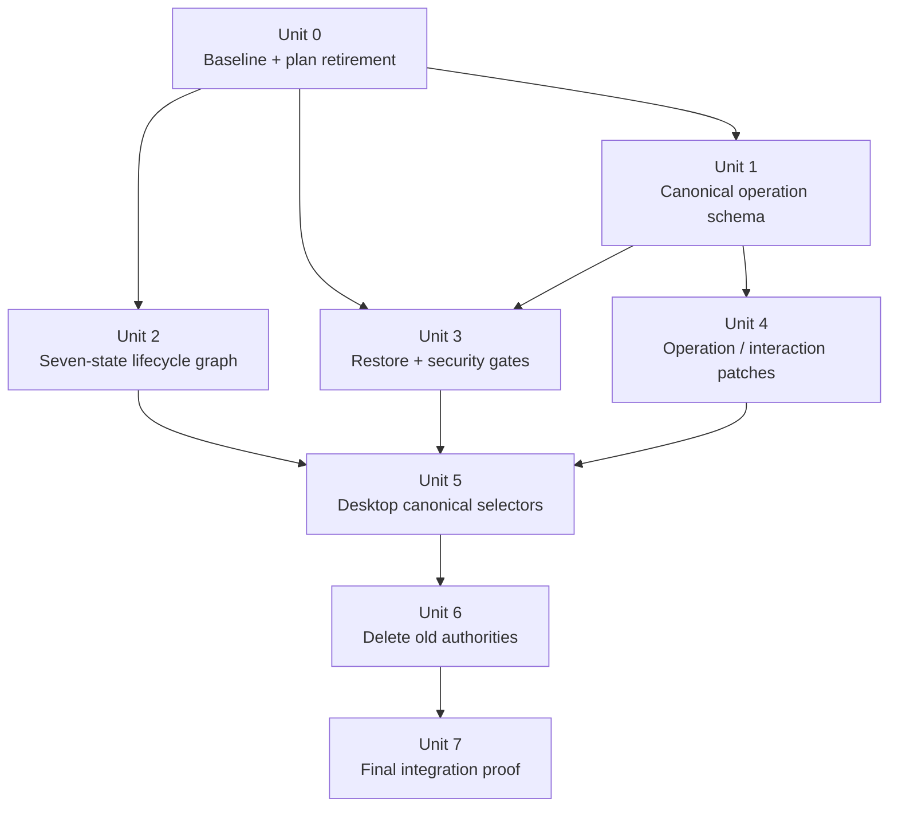
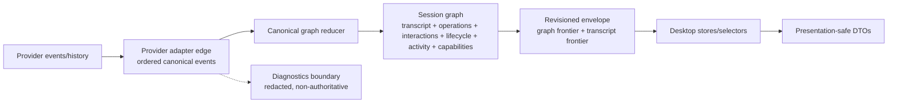

# refactor: Final GOD architecture stack

## Overview

Finish Acepe's GOD architecture as a final endpoint, not another convergence slice. The work replaces remaining alternate authorities with one backend-owned canonical session graph, then proves the old paths are deleted or diagnostics-only: `ToolCallManager` no longer owns operation truth, `SessionHotState` no longer owns lifecycle truth, raw session updates no longer own product semantics, and local journal/snapshot replay no longer owns restore truth.

This is a stack plan. It is intentionally split into dependency-ordered implementation units that can be delegated to separate agents during `/ce:work`, but the stack is not complete until the final integration gate verifies the merged state against the origin requirements.

## Problem Frame

The current app has most ingredients of the intended architecture: session graph envelopes, provider-owned restore direction, lifecycle supervisor state, operation and interaction stores, graph-backed activity, and presentational panel boundaries. But compatibility bridges still keep reintroducing split authority:

- Rust graph materializations still carry a four-state lifecycle compatibility shape instead of the seven-state supervisor lifecycle.
- `Operation` and `OperationSnapshot` are still ToolCall-shaped and keyed by provider `tool_call_id`.
- Interactions still bind through provider tool references instead of canonical `operationId`.
- Frontend hot-state and raw inbound events still influence lifecycle, permissions, questions, activity, and operation presentation.
- Journal/projection replay and diagnostics/security paths are not yet cleanly separated from product authority.

The final state must be explainable as:

```text
provider facts/history/live events
  -> provider adapter edge
  -> canonical session graph
  -> revisioned materializations
  -> desktop stores/selectors
  -> presentation-safe UI DTOs
```

## Requirements Trace

- R1-R4b: Establish one authority path, structural diagnostics boundary, provider-edge sequencing, and canonical graph ownership.
- R5-R9b: Make operations and interactions canonical graph nodes with stable operation identity, explicit evidence/state schemas, selector-driven UI, and the R9a operation state machine frozen in this plan before implementation.
- R10-R14: Promote seven-state lifecycle, actionability, capabilities, telemetry, and graph-backed activity into canonical selectors; remove hot-state authority; implement the R10a lifecycle transition graph frozen in this plan before implementation.
- R15-R18c: Keep provider-owned restore as content authority, remove local restore fallbacks, add explicit restore failure taxonomy, audit restore success, and measure cold-open performance.
- R19-R22a: Preserve graph/transcript frontiers as internal graph sub-frontiers and keep delivery mechanics non-semantic.
- R23-R26g: Make desktop/presentation projection-only while hardening diagnostics, credentials, destructive commands, SQL Studio, checkpoints, pasted content, and the agent-panel teardown class.
- R27-R30a: Provide deletion proof, R28/R28a test-seam coverage, plan retirement, and a final integration gate for the PR stack.

## Scope Boundaries

- This plan changes architecture and authority boundaries, not the visual design of the agent panel, kanban, queue, tab bar, settings, or composer.
- This plan introduces no provider-history cache. If cold-open P95 time-to-first-entry-render exceeds the Unit 0 baseline by more than 25%, cache design returns to requirements instead of being improvised.
- This plan does not preserve old compatibility bridges as acceptable endpoints.
- This plan does not redesign provider-native file formats.
- This plan does not require offline restore when provider-owned history is unavailable.
- Existing agent-panel teardown hardening remains a prerequisite safety fix, not the final architecture solution.

## Context & Research

### Relevant Code and Patterns

- `packages/desktop/src-tauri/src/acp/session_state_engine/graph.rs` holds `SessionStateGraph` for transcript, operations, interactions, lifecycle, activity, capabilities, and revision.
- `packages/desktop/src-tauri/src/acp/session_state_engine/revision.rs` already models graph and transcript sub-frontiers.
- `packages/desktop/src-tauri/src/acp/session_state_engine/frontier.rs` already decides stale lineage vs. snapshot fallback.
- `packages/desktop/src-tauri/src/acp/lifecycle/state.rs`, `transition.rs`, and `supervisor.rs` already contain the seven-state lifecycle and transition validation.
- `packages/desktop/src-tauri/src/acp/lifecycle/checkpoint.rs` still contains `compat_graph_lifecycle()`, collapsing the seven-state lifecycle to the four-state graph lifecycle.
- `packages/desktop/src-tauri/src/acp/session_state_engine/selectors.rs` still exposes `SessionGraphLifecycleStatus` as `idle | connecting | ready | error`.
- `packages/desktop/src-tauri/src/acp/projections/mod.rs` defines `OperationSnapshot` and `InteractionSnapshot`; both still lean on provider `tool_call_id`.
- `packages/desktop/src-tauri/src/acp/session_update/types/tool_calls.rs` has rich `ToolCallData` fields not fully promoted into `OperationSnapshot`.
- `packages/desktop/src/lib/acp/types/operation.ts` derives `OperationKind` and `OperationStatus` from `ToolCall`.
- `packages/desktop/src/lib/acp/store/operation-store.svelte.ts` has a rich live path from `ToolCall` and a sparse restore path from `OperationSnapshot`.
- `packages/desktop/src/lib/acp/store/services/tool-call-manager.svelte.ts` is still the live operation mutation/reconciliation adapter.
- `packages/desktop/src/lib/acp/logic/inbound-request-handler.ts` and `packages/desktop/src/lib/components/main-app-view.svelte` still feed raw permission/question events into stores.
- `packages/desktop/src/lib/acp/store/types.ts` defines `SessionHotState`, which still carries lifecycle, activity, capabilities, telemetry, config, and send-gating state.
- `packages/desktop/src/lib/acp/store/live-session-work.ts`, `session-work-projection.ts`, `queue/utils.ts`, `tab-bar-utils.ts`, and `session-messaging-service.ts` still consume hot-state or legacy status.
- `packages/desktop/src-tauri/src/acp/session_journal.rs` and journal call sites in `cc_sdk_client.rs` still rehydrate projection/interactions from local journal data.
- `packages/desktop/src-tauri/src/acp/streaming_log.rs` writes debug raw stream logs under the source tree and needs the R26 diagnostics boundary.

### Institutional Learnings

- `docs/solutions/architectural/revisioned-session-graph-authority-2026-04-20.md`: one revisioned graph should own product state; provider-owned history work removed snapshot tables but left some local restore seams to audit.
- `docs/solutions/architectural/provider-owned-semantic-tool-pipeline-2026-04-18.md`: provider semantics should be captured at the edge, then shared code consumes normalized projections.
- `docs/solutions/architectural/graph-backed-session-activity-authority-2026-04-23.md`: activity is already graph-backed and should be treated as a baseline to complete, not rebuilt.
- `docs/solutions/best-practices/deterministic-tool-call-reconciler-2026-04-18.md`: unclassified/degraded tool state should be explicit, not silently collapsed into generic fallback.
- `docs/solutions/logic-errors/operation-interaction-association-2026-04-07.md`: operation/interaction association belongs below UI boundaries.
- `docs/solutions/best-practices/provider-owned-policy-and-identity-not-ui-projections-2026-04-09.md`: typed provider metadata must flow from provider boundaries, not UI labels.
- `docs/solutions/best-practices/reactive-state-async-callbacks-svelte-2026-04-15.md` and `docs/solutions/best-practices/svelte5-unconditional-snippet-props-2026-04-12.md`: renderer safety requires stable props and teardown-safe guards, but not semantic invention.
- `docs/solutions/best-practices/telemetry-integration-tauri-svelte-privacy-first-2026-04-14.md`: diagnostics and telemetry need privacy-first opt-out and no secret logging.

### External References

- None. This is a repo-specific architecture refactor with sufficient local guidance.

## Key Technical Decisions

| Decision | Rationale |
|---|---|
| Treat this as a stack with a final integration gate | The scope is too broad for one atomic implementation slice, but each unit must reduce alternate authority and the final merged state must satisfy R27-R30. |
| Resolve operation identity before schema/delta work | Interaction rebinding and operation evidence depend on stable `operationId` vs. provenance-key semantics. |
| Use deterministic `operationId` from session identity plus operation provenance key for the first final implementation | It satisfies restore/live stability with lower storage complexity than reducer-assigned UUIDs. Provider `toolCallId` becomes provenance input, not the semantic identity exposed to UI. The helper must include `sessionId` in the hash/input, not merely prepend it for display. Unit 0/Unit 1 must produce a per-provider provenance-stability verdict before Unit 3 can delete journal replay for that provider. If a provider's provenance key is unstable across live stream, provider-history restore, and reconnect, that provider must supply a stronger edge provenance key before graph insertion. |
| Promote the seven-state Rust lifecycle into graph materializations | The supervisor already has the canonical state machine; the graph and desktop should stop consuming the four-state compatibility projection. |
| Keep diagnostic retention structurally separate from product stores | Diagnostics may exist for observability, but module/type/CI boundaries must prevent product imports. TypeScript product stores/selectors must be blocked from diagnostics imports by a test or lint gate; Rust diagnostics types must use `pub(crate)` or narrower visibility and must not appear in canonical reducer input types. |
| Run restore audit and latency baseline before deleting local restore fallbacks | Provider-owned restore is the target, but deletion proof needs measurable safety gates: a restore corpus, per-provider provenance-stability verdicts, validation failure taxonomy, and a cold-open P95 baseline with a 25% regression limit. |
| Retire conflicting plans by metadata, not deletion | Planning artifacts stay as institutional context while frontmatter/body points to this final architecture stack. |

## Open Questions

### Resolved During Planning

- **Should operation IDs be deterministic or reducer-assigned UUIDs?** Use deterministic IDs from `(sessionId, operationProvenanceKey)` in this stack. Persisting reducer-assigned UUIDs adds a new local metadata dependency before restore authority is settled. Deterministic IDs preserve cold-open rebinding while making provider identity explicitly provenance.
- **Should one plan cover all implementation?** Use one stack plan with delegation-ready units. A single final integration gate prevents per-unit PRs from claiming completion early.
- **Can old compatibility paths remain as diagnostics?** Only behind the observability boundary, with structural import restrictions and no product-store dependency.
- **What is the R18c performance threshold?** Cold-open P95 time-to-first-entry-render may not regress by more than 25% from the Unit 0 baseline on the same restore corpus. A larger regression sends cache design back to requirements.
- **What is the minimum restore audit corpus?** Unit 0 must cover each supported provider with at least one happy-path parseable history fixture, one missing-history case, and one unparseable-history case. If real samples are unavailable, Unit 0 must create synthetic provider-history fixtures through the existing provider-history loader seams before deletion gates can pass.
- **What is the interaction migration strategy?** Existing interaction records keyed by provider tool-call IDs migrate lazily during restore/open while journal data still exists. Successful rebinds write canonical `operationId`/provenance metadata; unresolvable records become explicit unresolved-interaction tombstones. Unit 3 cannot delete journal replay until these tests are green.
- **What is the baseline diagnostic redaction floor?** Unit 3 must redact at minimum field names matching `api_key`, `apiKey`, `token`, `accessToken`, `refreshToken`, `secret`, `authorization`, `password`, and environment-style names ending in `_API_KEY`, `_TOKEN`, or `_SECRET`; value patterns including `Bearer <token>`, `sk-...`, `ghp_...`, `glpat-...`, `xoxb-...`, and provider secret strings discovered in the audit; and oversized payload/file-content fields by truncation. The implementation audit may extend this list, not replace it.

### Deferred to Implementation

- Exact Rust/TypeScript names for new operation evidence structs, actionability structs, and diagnostic boundary modules.
- Exact fixture filenames and sample payloads for the R17b restore audit, after implementation inspects available local provider-history fixtures or session samples.
- Exact redaction helper names and module locations, after implementation audits current payload shapes and existing telemetry/privacy helpers.

## High-Level Technical Design

> *This illustrates the intended approach and is directional guidance for review, not implementation specification. The implementing agent should treat it as context, not code to reproduce.*





## Implementation Units

- [x] **Unit 0: Baseline gates and plan retirement**

**Goal:** Establish the measurement, audit, and documentation prerequisites that make the rest of the stack safe and final.

**Requirements:** R17a, R17b, R18b, R18c, R29, R29a, R30a

**Dependencies:** None

**Files:**
- Modify: `docs/plans/2026-04-12-002-refactor-god-clean-operation-model-plan.md`
- Modify: `docs/plans/2026-04-19-001-refactor-canonical-session-state-engine-plan.md`
- Modify: `docs/plans/2026-04-20-001-refactor-canonical-operation-state-model-plan.md`
- Modify: `docs/plans/2026-04-21-001-refactor-canonical-session-lifecycle-authority-plan.md`
- Modify: `docs/plans/2026-04-22-002-refactor-session-lifecycle-convergence-after-proof-plan.md`
- Modify: `docs/plans/2026-04-23-002-refactor-provider-owned-restore-authority-plan.md`
- Modify: `docs/concepts/session-graph.md`
- Modify: `docs/concepts/operations.md`
- Modify: `docs/concepts/interactions.md`
- Modify: `docs/concepts/session-lifecycle.md`
- Modify: `docs/concepts/reconnect-and-resume.md`
- Create: `docs/solutions/architectural/final-god-architecture-2026-04-25.md`
- Test: `packages/desktop/src-tauri/src/history/commands/session_loading.rs`
- Test: `packages/desktop/src-tauri/src/acp/session_open_snapshot/mod.rs`

**Approach:**
- Mark the six overlapping active plans as superseded by this requirements/plan stack while preserving them as research input.
- Add concept-doc language that names the final endpoint and removes "convergence" as an acceptable target.
- Build a provider-history restore audit harness around existing provider-owned history loaders. The audit should prove that present, parseable provider history produces a non-empty canonical graph/open result for each supported provider represented in the corpus.
- Establish a minimum restore corpus for each supported provider: one happy-path parseable history fixture, one missing-history case, and one unparseable-history case. If real samples are absent, create synthetic provider-history fixtures through existing provider-history loader seams before deletion gates can proceed.
- Add a per-provider provenance-stability audit. For each supported provider, record whether the chosen operation provenance key is stable across live stream, provider-history restore, and reconnect. Unit 3 journal deletion is blocked for any provider without a stable provenance verdict or stronger edge provenance key.
- Establish the cold-open P95 time-to-first-entry-render baseline on the same audit corpus before deleting local restore/cache paths.
- Record the initial timing sample that unblocks Units 1 and 2. The comparison target is the Unit 0 baseline plus no more than 25%.
- Record the current virtualized-entry-list teardown fix as prerequisite safety work, not the architectural solution.

**Execution note:** Start with characterization tests around current provider-history restore and cold-open timing seams before deleting any local restore fallback.

**Patterns to follow:**
- `packages/desktop/src-tauri/src/history/commands/session_loading.rs`
- `packages/desktop/src-tauri/src/acp/session_open_snapshot/mod.rs`
- `docs/solutions/architectural/revisioned-session-graph-authority-2026-04-20.md`

**Test scenarios:**
- Happy path — a supported provider history fixture with present parseable history restores into a non-empty open result.
- Error path — provider history missing is recorded as an explicit audit result, not empty success.
- Error path — provider history unparseable is recorded as an explicit audit result, not empty success.
- Edge case — inadequate real provider-history fixtures cause synthetic fixture generation before Unit 3 deletion gates may pass.
- Integration — provenance-key stability is recorded for each supported provider across live stream, provider-history restore, and reconnect.
- Integration — audit corpus records provider family, session identity, parse outcome, open-result outcome, and timing sample.
- Documentation — each superseded plan has a visible `superseded-by` pointer and does not remain an active endpoint.

**Verification:**
- The stack has measurable restore and latency gates before authority deletion.
- Reviewers can see which older plans are superseded and why.
- Unit 1 and Unit 2 may start only after the restore audit harness has at least one passing provider-history fixture, the characterization baseline exists, and an initial P95 sample has been recorded.

- [x] **Unit 1: Freeze canonical operation and interaction identity**

**Goal:** Define the stable operation/interaction schema that the graph reducer, restore path, desktop stores, and UI selectors will share.

**Requirements:** R5, R5a, R5b, R6, R6a, R7, R7a, R8, R8a, R8b, R9a, R9b, R27

**Dependencies:** Unit 0 restore audit harness with at least one passing provider-history fixture, an initial P95 timing sample, and a per-provider provenance-stability audit path. Full plan-retirement documentation is not required before this unit starts.

**Files:**
- Modify: `packages/desktop/src-tauri/src/acp/projections/mod.rs`
- Modify: `packages/desktop/src-tauri/src/acp/session_state_engine/graph.rs`
- Modify: `packages/desktop/src-tauri/src/acp/session_state_engine/protocol.rs`
- Modify: `packages/desktop/src-tauri/src/acp/session_state_engine/reducer.rs`
- Modify: `packages/desktop/src-tauri/src/acp/session_update/types/tool_calls.rs`
- Modify: `packages/desktop/src/lib/acp/types/operation.ts`
- Modify: `packages/desktop/src/lib/acp/types/interaction.ts`
- Modify: `packages/desktop/src/lib/acp/store/operation-store.svelte.ts`
- Modify: `packages/desktop/src/lib/acp/store/operation-association.ts`
- Test: `packages/desktop/src-tauri/src/acp/projections/mod.rs`
- Test: `packages/desktop/src-tauri/src/acp/session_state_engine/reducer.rs`
- Test: `packages/desktop/src/lib/acp/store/__tests__/operation-store.vitest.ts`
- Test: `packages/desktop/src/lib/acp/store/__tests__/operation-association.test.ts`

**Approach:**
- Add `operation_provenance_key` to canonical operation records. Provider `tool_call_id` may populate the provenance key, but desktop product code must use canonical `operationId`.
- Use deterministic `operationId = sessionId + operationProvenanceKey` as the first final implementation. The implementation should hide this formula behind shared helpers so the UI never rebuilds it independently.
- Treat provider history as untrusted input at the adapter edge. Validate provenance-key character set/length, field sizes, and maximum operation count before graph insertion; invalid input becomes a typed validation failure, not a graph mutation.
- Extend `OperationSnapshot` to include selector-needed evidence currently dropped from `ToolCallData`: locations, skill metadata, normalized questions, question answers, plan approval request identity, awaiting-plan-approval state, timing, source-entry linkage, and degradation reason.
- Introduce an explicit operation state enum independent of `ToolCallStatus`: pending, running, blocked, completed, failed, cancelled/abandoned, degraded/partial.
- Add `canonical_operation_id` to interaction snapshots and TypeScript interaction types. Existing records keyed by provider tool-call IDs rebind through the provenance key during migration/restore.
- Add unresolved interaction state for interaction decisions that cannot safely rebind to an operation.
- Remove `OperationKind = ToolCall["kind"]` and `OperationStatus = ToolCall["status"]` from TypeScript operation types.
- Migrate existing interaction records lazily during restore/open while journal data still exists. Rebound interactions write canonical `operationId`/provenance metadata; unresolvable records write explicit unresolved-interaction tombstones. This migration must complete for covered sessions before Unit 3 removes `load_stored_projection` or journal replay.

**Operation state machine:**

| From | To | Trigger | Guard / owner |
|---|---|---|---|
| none | `pending` | Provider adapter observes an operation declaration/history record without executable start evidence | Adapter edge validates provenance key and emits ordered canonical operation-created event; reducer accepts only if `operationId` is new. |
| `pending` | `running` | Provider tool-start/progress event or equivalent normalized provider fact | Adapter edge proves event order; reducer validates non-terminal prior state. |
| `pending` | `blocked` | Permission, question, or approval interaction is emitted before executable progress | Adapter edge links interaction to `operationId`; reducer validates the operation is not terminal. |
| `running` | `blocked` | Permission, question, or approval interaction blocks continuation | Interaction patch references `operationId`; reducer records blocked state and interaction evidence together. |
| `blocked` | `running` | User/provider decision is applied and provider resumes work | Decision patch resolves the blocking interaction; reducer requires the interaction to belong to the same `operationId`. |
| `pending`, `running`, or `blocked` | `completed` | Provider tool-result/success event | Adapter edge emits ordered completion; reducer rejects stale completion for terminal states. |
| `pending`, `running`, or `blocked` | `failed` | Provider tool-error/failure event or supervisor reports deterministic operation failure | Reducer records typed failure evidence; state is terminal. |
| `pending`, `running`, or `blocked` | `cancelled` | User abort, provider abort, session archive, or supervisor cancellation | Supervisor or adapter emits cancellation with reason; reducer records terminal cancellation/abandoned evidence. |
| `pending`, `running`, or `blocked` | `degraded` | Classification failure, impossible provider ordering, missing required evidence, or reconnect finds the in-flight operation absent from provider history | Adapter edge emits validation/edge error or supervisor emits recovery classification; reducer records explicit degraded/partial state with reason instead of dropping or inferring from local state. |

Terminal states are `completed`, `failed`, `cancelled`, and `degraded`. Terminal operations do not transition back to active states; later conflicting evidence becomes diagnostic evidence or a rejected stale patch, not state regression. The adapter edge owns provider ordering/validation; the graph reducer owns transition validation and idempotent merge semantics.

**Execution note:** Implement schema and identity test-first. This unit should not delete `ToolCallManager`; it prepares the canonical replacement.

**Patterns to follow:**
- `docs/solutions/best-practices/deterministic-tool-call-reconciler-2026-04-18.md`
- `docs/solutions/logic-errors/operation-interaction-association-2026-04-07.md`
- `packages/desktop/src-tauri/src/acp/reconciler/semantic.rs`

**Test scenarios:**
- Happy path — a live tool call and provider-history replay for the same provenance key produce the same canonical `operationId`.
- Happy path — `OperationSnapshot` preserves locations, skill metadata, normalized questions, todos, plan approval linkage, timing, and source-entry evidence.
- Edge case — sparse later operation evidence does not erase richer prior evidence.
- Edge case — a provider classification failure creates explicit degraded operation state with a degradation reason.
- Edge case — provider history with oversized fields or invalid provenance-key characters is rejected before graph insertion with a validation-failed restore/edge state.
- Error path — an interaction decision without a matching operation becomes unresolved instead of attaching by transcript timing.
- Error path — a terminal operation cannot be regressed by a stale later patch.
- Integration — cold-open operation and interaction snapshots rebind by canonical `operationId` or provenance key, never by visible prompt state.

**Verification:**
- Rust and TypeScript share a canonical operation/interactions contract that no longer derives product types from `ToolCall`.
- Interaction rebinding tests are green before Unit 3 removes journal replay authority.

- [x] **Unit 2: Promote canonical lifecycle, actionability, capabilities, and activity**

**Goal:** Make the canonical graph carry the seven-state lifecycle and user actionability so desktop surfaces stop consuming hot-state status.

**Requirements:** R4a, R10, R10a, R11, R12, R13, R13a, R14, R27

**Dependencies:** Unit 0 characterization baseline and initial P95 sample. This unit must complete before Unit 5 removes hot-state authority.

**Files:**
- Modify: `packages/desktop/src-tauri/src/acp/lifecycle/checkpoint.rs`
- Modify: `packages/desktop/src-tauri/src/acp/lifecycle/state.rs`
- Modify: `packages/desktop/src-tauri/src/acp/lifecycle/transition.rs`
- Modify: `packages/desktop/src-tauri/src/acp/lifecycle/supervisor.rs`
- Modify: `packages/desktop/src-tauri/src/acp/session_state_engine/graph.rs`
- Modify: `packages/desktop/src-tauri/src/acp/session_state_engine/selectors.rs`
- Modify: `packages/desktop/src-tauri/src/acp/session_state_engine/protocol.rs`
- Modify: `packages/desktop/src-tauri/src/acp/session_state_engine/runtime_registry.rs`
- Modify: `packages/desktop/src/lib/acp/store/session-capabilities-store.svelte.ts`
- Modify: `packages/desktop/src/lib/acp/logic/session-ui-state.ts`
- Modify: `packages/desktop/src/lib/acp/logic/session-activity.ts`
- Test: `packages/desktop/src-tauri/src/acp/lifecycle/tests.rs`
- Test: `packages/desktop/src-tauri/src/acp/lifecycle/supervisor_tests.rs`
- Test: `packages/desktop/src-tauri/src/acp/session_state_engine/selectors.rs`
- Test: `packages/desktop/src/lib/acp/logic/__tests__/session-activity.test.ts`
- Test: `packages/desktop/src/lib/acp/store/__tests__/session-store-capabilities-revision.vitest.ts`

**Approach:**
- Replace four-state `SessionGraphLifecycleStatus` graph materialization with the seven-state supervisor lifecycle.
- Add canonical actionability fields: send/resume/retry/archive availability, recommended action, recovery phase, retryability, and compact status copy.
- Move capabilities, config options, autonomous state, available commands, telemetry, and budget state into explicit canonical selectors/stores rather than hot-state fields.
- Ensure provider adapters emit facts and the supervisor/graph reducer emits lifecycle conclusions.
- Ensure runtime updates go through supervisor transition gates instead of `replace_checkpoint_for_compat`-style mutation.
- Make graph-backed activity the only activity truth; remove XState/hot-state fallback as an authority.
- Enforce exhaustive lifecycle handling in TypeScript selectors so new seven-state variants cannot silently fall through during the Unit 2 -> Unit 5 transition.

**Lifecycle transition graph:**

| From | To | Trigger / guard | User actionability after transition |
|---|---|---|---|
| `Reserved` | `Activating` | First send/open activation begins with valid activation options and canonical capabilities | Wait; no send while activation is in flight. |
| `Reserved` | `Archived` | User archives a never-activated session | Terminal read-only state; no actions. |
| `Activating` | `Ready` | Provider attach succeeds and canonical capabilities are available | Send, set model/mode where capability permits, archive. |
| `Activating` | `Failed` | Activation fails deterministically or requires explicit error handling | Retry only when failure reason is retryable; archive. |
| `Ready` | `Reconnecting` | Live transport disconnects and supervisor recovery policy starts | Wait; no new send unless canonical actionability explicitly offers it. |
| `Ready` | `Archived` | User archives a live or idle session | Terminal read-only state; no actions. |
| `Reconnecting` | `Ready` | Reconnect succeeds within policy bounds | Send and live actions restored from canonical capabilities. |
| `Reconnecting` | `Detached` | Retry budget exhausted, user stops waiting, or provider requires explicit resume | Resume and archive; no send until resume/activation succeeds. |
| `Reconnecting` | `Failed` | Deterministic reconnect fault or provider/session mismatch | Retry only when failure reason is retryable; archive. |
| `Detached` | `Activating` | User resumes a resumable session with valid activation context | Wait; no send until `Ready`. |
| `Detached` | `Archived` | User archives a detached session | Terminal read-only state; no actions. |
| `Failed` | `Activating` | User retries and the failure reason permits retry | Wait; no send until `Ready`. |
| `Failed` | `Archived` | User archives a failed session | Terminal read-only state; no actions. |

`Archived` is terminal. `Detached` is recoverable through explicit resume. `Failed` is recoverable only when the canonical failure reason marks retry as available. Provider adapters report transport/provider facts; the supervisor owns lifecycle conclusions and transition guards; the graph reducer materializes ordered lifecycle conclusions without recomputing policy.

**Execution note:** Start with characterization tests against the frozen transition table above, then replace compatibility output with the canonical seven-state shape.

**Patterns to follow:**
- `packages/desktop/src-tauri/src/acp/lifecycle/transition.rs`
- `docs/concepts/session-lifecycle.md`
- `docs/solutions/architectural/graph-backed-session-activity-authority-2026-04-23.md`

**Test scenarios:**
- Happy path — reserve -> activate -> ready emits the seven-state lifecycle plus canonical actionability.
- Happy path — ready -> reconnecting -> ready preserves actionability and activity from graph fields.
- Edge case — detached exposes resume/archive but not send.
- Error path — failed exposes retry only when retryability allows it.
- Error path — illegal lifecycle transitions are rejected by the supervisor/graph path and do not materialize in desktop selectors.
- Edge case — TypeScript lifecycle selectors exhaustively handle `Reconnecting` and do not fall through to stale four-state behavior.
- Integration — capability revisions and lifecycle/actionability can update independently without hot-state rollback logic.
- Integration — graph-backed activity is used for panel, tab, queue, and status projections with no fallback from hot-state status.

**Verification:**
- The graph/envelope protocol exposes lifecycle, actionability, capabilities, telemetry, and activity without four-state compat lifecycle.

- [x] **Unit 3: Restore authority and security/data handling**

**Goal:** Finish provider-owned restore boundaries and harden sensitive diagnostics/storage surfaces so local data never becomes hidden session authority or unsafe payload exposure.

**Requirements:** R2, R3, R3a, R15-R18c, R26a-R26g, R27

**Dependencies:** Unit 0 restore audit and performance baseline for deletion gates; Unit 1 interaction rebinding and provenance-stability schema proven before removing `load_stored_projection` or journal replay authority.

**Files:**
- Modify: `packages/desktop/src-tauri/src/acp/session_open_snapshot/mod.rs`
- Modify: `packages/desktop/src-tauri/src/acp/session_journal.rs`
- Modify: `packages/desktop/src-tauri/src/acp/commands/session_commands.rs`
- Modify: `packages/desktop/src-tauri/src/acp/client/cc_sdk_client.rs`
- Modify: `packages/desktop/src-tauri/src/acp/streaming_log.rs`
- Modify: `packages/desktop/src-tauri/src/storage/commands/session_files.rs`
- Modify: `packages/desktop/src-tauri/src/storage/commands/settings.rs`
- Modify: `packages/desktop/src-tauri/src/storage/commands/reset.rs`
- Modify: `packages/desktop/src-tauri/src/sql_studio/commands/helpers/connectivity.rs`
- Modify: `packages/desktop/src-tauri/src/sql_studio/commands/query/execute.rs`
- Modify: `packages/desktop/src-tauri/src/checkpoint/commands.rs`
- Modify: `packages/desktop/src-tauri/capabilities/default.json`
- Create: `packages/desktop/src/lib/acp/diagnostics/__tests__/diagnostics-import-boundary.vitest.ts`
- Test: `packages/desktop/src-tauri/src/acp/session_open_snapshot/mod.rs`
- Test: `packages/desktop/src-tauri/src/acp/session_journal.rs`
- Test: `packages/desktop/src-tauri/src/acp/commands/session_commands.rs`
- Test: `packages/desktop/src-tauri/src/acp/streaming_log.rs`
- Test: `packages/desktop/src-tauri/src/storage/commands/reset.rs`
- Test: `packages/desktop/src-tauri/src/sql_studio/commands/query/execute.rs`
- Test: `packages/desktop/src-tauri/src/db/repository_test.rs`

**Approach:**
- Expand restore failure taxonomy to retryable provider unavailable, provider missing, provider unparseable, provider validation failed, and stale-lineage recovery.
- Remove empty-success restore fallback when provider history is missing.
- Remove `load_stored_projection` and journal replay from product restore authority only after the Unit 0 audit, Unit 1 interaction rebinding replacement, and per-provider provenance-stability verdicts are in place.
- Keep only Acepe-owned metadata in durable local storage, such as permission decisions, review state, identity binding, and annotations.
- Move streaming logs to OS-managed app log/data paths, add redaction/truncation, purge logs with session deletion, and keep logs outside product-store imports. Verify old in-tree log patterns are git-ignored, new resolved log paths are outside `CARGO_MANIFEST_DIR`/app resource dirs, and tracked source files contain no diagnostic log artifacts.
- Apply the baseline diagnostic redaction floor from Resolved During Planning before any diagnostic disk write; implementation audits may add patterns but may not weaken the floor.
- Stop plaintext API keys from entering frontend product stores, emitted events, graph state, or diagnostics. Audit credential-returning IPC commands and either remove them or gate them behind a narrowly scoped credentials-read capability restricted to the settings surface; the main app webview must not receive a broad plaintext-credential grant.
- Add backend-issued confirmation tokens for destructive bulk operations. Tokens must be cryptographically random 128-bit-or-stronger values from OS randomness, scoped to the exact destructive operation and target, stored only in a short-lived in-memory backend map with a TTL of 30 seconds or less, consumed on first use, and rejected on reuse. Frontend code must request a fresh token per destructive invocation and must not store tokens in Svelte stores or long-lived component state.
- Enumerate commands in `session_files.rs`, `settings.rs`, and `reset.rs` into a destructive-command scope table: requires confirmation token, requires session-scoped user intent, or non-destructive/excluded. Any command that irreversibly deletes or overwrites data across multiple sessions requires a confirmation token.
- Prevent SQL Studio from connecting to Acepe's own app database by canonicalized path and file identity. The guard must canonicalize user-supplied and app DB paths, block WAL/journal/SHM siblings, compare resolved file identity on Unix where available, and reject symlink aliases. If a target does not exist yet, allow creation only when it cannot resolve to an app DB sibling and record a diagnostic attempt.
- Audit all Tauri IPC commands and frontend stores that read, hold, or return pasted content or checkpoint file snapshots. Document storage format, max retention size, cross-session access possibility, and in-memory purge behavior before hardening deletion.
- Keep diagnostics structurally separate: TypeScript diagnostics modules must not be re-exported from product barrels, product store/selector files must fail the import-boundary test if they import diagnostics paths, and Rust diagnostics types must remain `pub(crate)` or narrower and must not be accepted by canonical graph reducer public inputs.

**Execution note:** Treat this as security-sensitive work. Add failing tests for destructive-command and self-DB access gaps before implementation.

**Patterns to follow:**
- `docs/solutions/best-practices/telemetry-integration-tauri-svelte-privacy-first-2026-04-14.md`
- `packages/desktop/src-tauri/src/db/repository.rs`
- `packages/desktop/src-tauri/src/storage/commands/reset.rs`

**Test scenarios:**
- Happy path — provider-owned history restores session content without reading local projection snapshots.
- Error path — missing provider history returns explicit provider-history-missing state, not an empty transcript success.
- Error path — unparseable provider history returns explicit unparseable state with safe diagnostics affordance.
- Error path — provider history with oversized fields, invalid provenance keys, or excessive operation count returns explicit validation-failed state before graph insertion.
- Edge case — retryable provider unavailable exposes retryable restore state.
- Security — raw streaming log redacts credential-pattern data and truncates large payloads before disk write.
- Security — streaming logs are written under OS app data/log paths and purged on session delete.
- Security — every command classified as destructive in the scope table rejects calls without a fresh backend-issued one-time confirmation token.
- Security — a reused, expired, wrong-operation, or wrong-target confirmation token is rejected with a typed invalid-token error.
- Security — credential-returning IPC is removed or gated by an explicit credentials-read capability that is not granted broadly to the main webview.
- Security — SQL Studio rejects a direct app DB path, symlink alias, and WAL/journal/SHM sibling path for Acepe's app database.
- Security — product store/selector files cannot import diagnostics modules and Rust reducer inputs cannot accept diagnostic-only types.
- Integration — session delete removes checkpoints, file snapshots, diagnostic logs, pasted content, and in-memory cached sensitive content for that session.

**Verification:**
- Local restore fallbacks no longer reconstruct provider content, and sensitive diagnostics/storage surfaces have explicit boundaries.
- `load_stored_projection` and journal replay deletion does not begin until Unit 1 interaction rebinding tests are green.

- [x] **Unit 4: Canonical operation and interaction delivery path**

**Goal:** Deliver live and restored operation/interaction changes through canonical graph patches so raw tool, permission, question, and approval paths are no longer product authority.

**Requirements:** R1-R4b, R5-R9b, R19-R22a, R27, R28

**Dependencies:** Unit 1; Unit 2 lifecycle/actionability spec for recovery semantics.

**Files:**
- Modify: `packages/desktop/src-tauri/src/acp/session_state_engine/protocol.rs`
- Modify: `packages/desktop/src-tauri/src/acp/session_state_engine/reducer.rs`
- Modify: `packages/desktop/src-tauri/src/acp/session_state_engine/bridge.rs`
- Modify: `packages/desktop/src-tauri/src/acp/projections/mod.rs`
- Modify: `packages/desktop/src-tauri/src/acp/task_reconciler.rs`
- Modify: `packages/desktop/src-tauri/src/acp/inbound_request_router/permission_handlers.rs`
- Modify: `packages/desktop/src-tauri/src/acp/client_loop.rs`
- Modify: `packages/desktop/src/lib/acp/store/operation-store.svelte.ts`
- Modify: `packages/desktop/src/lib/acp/store/interaction-store.svelte.ts`
- Modify: `packages/desktop/src/lib/acp/store/permission-store.svelte.ts`
- Modify: `packages/desktop/src/lib/acp/store/question-store.svelte.ts`
- Modify: `packages/desktop/src/lib/acp/logic/inbound-request-handler.ts`
- Modify: `packages/desktop/src/lib/components/main-app-view.svelte`
- Test: `packages/desktop/src-tauri/src/acp/session_state_engine/reducer.rs`
- Test: `packages/desktop/src-tauri/src/acp/projections/mod.rs`
- Test: `packages/desktop/src/lib/acp/store/__tests__/operation-store.vitest.ts`
- Test: `packages/desktop/src/lib/acp/store/__tests__/permission-store.vitest.ts`
- Test: `packages/desktop/src/lib/acp/store/__tests__/question-store.vitest.ts`
- Test: `packages/desktop/src/lib/acp/store/__tests__/operation-association.test.ts`

**Approach:**
- Add operation and interaction patches to canonical graph deltas.
- Make patch merge idempotent and evidence-monotonic.
- Treat operation `blocked` as independent from session lifecycle. A blocked operation patch must be emittable before seven-state lifecycle materialization is consumed; lifecycle-linked actionability is resolved through the Unit 2 actionability model.
- Preserve provider-edge ordering responsibility: the adapter edge emits ordered canonical events or a canonical edge error; the graph reducer validates order and never repairs or reorders provider facts.
- Convert permission/question/plan-approval ingress into operation/interaction patches, not raw store writes.
- Remove `permissionStore.add()` and `questionStore.add()` raw inbound request paths after graph patches prove equivalent behavior.
- Teach `OperationStore` and `InteractionStore` to consume canonical patches/snapshots as the sole product input.
- Keep raw inbound events only if needed for diagnostics/coordination behind the R3a boundary.

**Execution note:** Start with failing store integration tests for pending permission/question surviving reconnect without raw re-add.

**Patterns to follow:**
- `packages/desktop/src/lib/acp/store/interaction-store.svelte.ts`
- `packages/desktop/src-tauri/src/acp/session_state_engine/reducer.rs`

**Test scenarios:**
- Happy path — live tool call emits canonical operation patch and hydrates `OperationStore`.
- Happy path — permission request emits canonical interaction patch linked to `operationId`.
- Edge case — repeated tool patches with the same provenance key are idempotent.
- Edge case — stale completion update cannot regress a terminal operation.
- Error path — provider facts arriving out of canonical sequence emit a canonical edge error; the graph reducer does not reorder or repair them, and desktop stores surface a typed restore/connectivity failure.
- Error path — permission request for unknown operation becomes unresolved interaction.
- Error path — reconnect when an in-flight operation is absent from provider history degrades that operation with retryable/recovery actionability, not a silent drop or local-state inference.
- Integration — pending question/permission survives reconnect/refresh without raw inbound store writes.
- Integration — provider replay and live stream produce equivalent operation/interaction graph state for completed operations.

**Verification:**
- Raw ACP inbound events no longer mutate permission/question/operation product stores directly.

- [x] **Unit 5: Desktop canonical selectors and presentation-safe DTOs**

**Goal:** Replace desktop hot-state, legacy status, and ToolCall-shaped presentation dependencies with canonical selectors and DTOs.

**Requirements:** R9, R12-R14, R23-R26, R27, R28

**Dependencies:** Units 1, 2, 3, and 4. Unit 3 restore/security boundaries must be in place before hot-state removal proceeds.

**Files:**
- Modify: `packages/desktop/src/lib/acp/store/types.ts`
- Modify: `packages/desktop/src/lib/acp/store/session-hot-state-store.svelte.ts`
- Modify: `packages/desktop/src/lib/acp/store/session-store.svelte.ts`
- Modify: `packages/desktop/src/lib/acp/store/session-state.ts`
- Modify: `packages/desktop/src/lib/acp/store/session-work-projection.ts`
- Modify: `packages/desktop/src/lib/acp/store/live-session-work.ts`
- Modify: `packages/desktop/src/lib/acp/store/services/session-messaging-service.ts`
- Modify: `packages/desktop/src/lib/acp/store/queue/utils.ts`
- Modify: `packages/desktop/src/lib/acp/store/tab-bar-utils.ts`
- Modify: `packages/desktop/src/lib/acp/store/urgency-tabs-store.svelte.ts`
- Modify: `packages/desktop/src/lib/acp/components/tool-calls/resolve-tool-operation.ts`
- Modify: `packages/desktop/src/lib/acp/components/agent-panel/scene/desktop-agent-panel-scene.ts`
- Modify: `packages/desktop/src/lib/acp/components/agent-panel/components/agent-panel.svelte`
- Modify: `packages/desktop/src/lib/acp/components/agent-panel/components/agent-panel-content.svelte`
- Modify: `packages/desktop/src/lib/acp/components/agent-input/agent-input-ui.svelte`
- Modify: `packages/desktop/src/lib/components/settings/project-tab/columns/status-cell.svelte`
- Modify (generated): `packages/desktop/src/lib/services/acp-types.ts`
- Modify (generated): `packages/desktop/src/lib/services/converted-session-types.ts`
- Create: `packages/ui/src/components/agent-panel/__tests__/agent-panel-architecture.test.ts`
- Test: `packages/desktop/src/lib/acp/store/__tests__/session-store-projection-state.vitest.ts`
- Test: `packages/desktop/src/lib/acp/store/__tests__/live-session-work.test.ts`
- Test: `packages/desktop/src/lib/acp/store/__tests__/session-work-projection.test.ts`
- Test: `packages/desktop/src/lib/acp/store/__tests__/session-state.test.ts`
- Test: `packages/desktop/src/lib/acp/components/agent-panel/components/__tests__/virtualized-entry-list.svelte.vitest.ts`
- Test: `packages/desktop/src/lib/acp/components/agent-panel/components/__tests__/agent-panel-content.svelte.vitest.ts`
- Test: `packages/ui/src/components/agent-panel/__tests__/agent-panel.test.ts`
- Test: `packages/ui/src/components/agent-panel/__tests__/agent-panel-shell.test.ts`

**Approach:**
- Run a canonical specta export after the merged Rust output of Units 1-4 is available, commit updated generated TypeScript bindings, then proceed with selector implementation. Individual units may use generated output locally for verification, but Unit 5 owns the coherent generated-files commit.
- Split `SessionHotState` into canonical selector outputs or remove it entirely where possible. Lifecycle fields must not remain writable frontend authority.
- Replace `selectLegacySessionStatus()` and `SessionStatus`-driven surfaces with canonical lifecycle/actionability/activity selectors.
- Replace send enablement, retry/resume/archive CTAs, model/mode availability, and compact status copy with canonical selectors.
- Remove `createToolCallFromOperation` as a product fallback. Tool UI gets presentation DTOs built from canonical operation/interaction selectors.
- Keep defensive renderer guards for Svelte/Virtua teardown, but no renderer should create session-semantic fallback values.
- Preserve `@acepe/ui` as presentational: desktop controllers pass resolved props.

**Execution note:** Use characterization tests for each desktop surface before replacing hot-state/legacy status reads. By the end of this unit, `session-hot-state-store.svelte.ts` must contain no lifecycle fields or writable product authority; any remaining non-lifecycle capability/config/telemetry projection must have no product-store consumers and is deleted or renamed in Unit 6.

**Patterns to follow:**
- Agent Panel MVC separation in `AGENTS.md`
- `packages/desktop/src/lib/acp/components/agent-panel/scene/desktop-agent-panel-scene.ts`
- `docs/solutions/best-practices/reactive-state-async-callbacks-svelte-2026-04-15.md`

**Test scenarios:**
- Happy path — canonical `Ready` enables send and renders ready/live UI without hot-state status.
- Happy path — canonical `Detached` renders resume/archive affordances and disables send.
- Happy path — canonical operation selector renders tool card data without recreating `ToolCall`.
- Edge case — graph activity absent fails closed to explicit unknown/degraded activity, not hot-state inference.
- Edge case — virtualized row teardown does not read stale snippet getters or invent fallback semantics.
- Error path — failed lifecycle exposes only canonical retry/recovery actions.
- Integration — tab bar, queue, status cell, agent panel, and composer agree on lifecycle/actionability for the same session graph.
- Integration — `@acepe/ui` agent-panel components render with canonical DTO props without importing desktop stores or runtime-specific logic.

**Verification:**
- Desktop surfaces render from canonical selectors and presentation DTOs; hot-state and `ToolCall` fallback no longer own product behavior.
- Specta-generated TypeScript bindings are coherent with the merged Rust schema from Units 1-4.

- [x] **Unit 6: Delete old authorities and compatibility bridges**

**Goal:** Remove or structurally demote the named alternate authorities now that canonical replacements are proven.

**Requirements:** R3, R3a, R13, R17, R23-R27, R30a

**Dependencies:** Units 1-5.

**Files:**
- Delete or absorb: `packages/desktop/src/lib/acp/store/services/tool-call-manager.svelte.ts`
- Delete or absorb: `packages/desktop/src/lib/acp/store/session-hot-state-store.svelte.ts`
- Delete or replace: `packages/desktop/src/lib/acp/store/services/__tests__/tool-call-manager.test.ts`
- Delete or replace: `packages/desktop/src/lib/acp/store/__tests__/hot-state.test.ts`
- Delete or replace: `packages/desktop/src/lib/acp/store/__tests__/session-hot-state-store.vitest.ts`
- Modify: `packages/desktop/src-tauri/src/acp/lifecycle/checkpoint.rs`
- Modify: `packages/desktop/src-tauri/src/acp/session_state_engine/runtime_registry.rs`
- Modify: `packages/desktop/src-tauri/src/acp/session_journal.rs`
- Modify: `packages/desktop/src/lib/acp/logic/event-subscriber.ts`
- Modify: `packages/desktop/src/lib/acp/logic/event-listener.ts`
- Modify: `packages/desktop/src/lib/acp/logic/session-domain-event-subscriber.ts`
- Modify: `packages/desktop/src/lib/acp/types/session-update.ts`
- Test: `packages/desktop/src/lib/acp/diagnostics/__tests__/diagnostics-import-boundary.vitest.ts`
- Test: `packages/desktop/src-tauri/src/acp/lifecycle/supervisor_tests.rs`
- Test: `packages/desktop/src-tauri/src/acp/client/tests.rs`

**Approach:**
- Delete `ToolCallManager` as operation truth once operation patches/stores cover live behavior. Any surviving raw-stream buffering must be extracted to a named transport-layer module such as `StreamingInputBuffer`; it may buffer/sequence transport input only and must not mutate operation state, write operation stores, create operation identity, or expose product semantics.
- Delete hot-state lifecycle authority. If non-lifecycle projections remain, rename/split them into capability/config/telemetry stores.
- Remove `compat_graph_lifecycle()` and `replace_checkpoint_for_compat` after seven-state graph lifecycle is the only runtime shape.
- Remove production `load_stored_projection`/journal replay content authority after provider-history restore and interaction rebinding are proven.
- Demote raw `acp-session-update` and `acp-inbound-request` lanes to diagnostics/coordination only, with import boundaries that prevent product-store use. TypeScript diagnostics modules must not be re-exported from product barrels; product-store/selector imports from diagnostics paths must fail the boundary test; Rust diagnostic types must remain `pub(crate)` or narrower and must not appear in public canonical reducer inputs.
- Replace or remove tests that encode old authority behavior.

**Execution note:** This is a deletion-proof unit; do not start until replacement tests from Units 1-5 are green. Before deleting `session-hot-state-store.svelte.ts`, verify Unit 5 removed lifecycle fields and writable lifecycle authority rather than leaving stubs.

**Patterns to follow:**
- R27 deletion proof checklist in the origin requirements.
- `docs/solutions/logic-errors/kanban-live-session-panel-sync-2026-04-02.md`

**Test scenarios:**
- Integration — repo no longer imports `ToolCallManager` from product operation paths.
- Integration — repo no longer reads `SessionHotState.status`/`isConnected` as lifecycle truth.
- Integration — raw `acp-session-update` cannot mutate transcript/operation/interaction/lifecycle product stores.
- Integration — local journal replay cannot reconstruct provider session content when provider history is missing.
- Error path — diagnostic-only raw events are visible only through observability APIs and cannot be imported by product stores.

**Verification:**
- Automated deletion-proof checks assert these outcomes:
  - `ToolCallManager` appears only in deletion-record documentation/tests or diagnostics, not product-store mutation paths.
  - `SessionHotState` appears only in renamed capability/config/telemetry projections and their tests, not lifecycle/actionability authority.
  - `compat_graph_lifecycle` and `replace_checkpoint_for_compat` have no production call sites.
  - `load_stored_projection` remains only in deletion-proof tests or migration diagnostics, not product restore authority.
  - Product store/selector files cannot import diagnostics-only modules.
- Repo no longer contains tests that import or instantiate deleted authority types as production behavior.

- [x] **Unit 7: Final integration proof and PR-stack closure**

**Goal:** Verify the merged stack satisfies the final architecture, not just each unit in isolation.

**Requirements:** R1-R30a

**Dependencies:** Units 0-6.

**Files:**
- Modify: `docs/concepts/session-graph.md`
- Modify: `docs/concepts/session-lifecycle.md`
- Modify: `docs/concepts/reconnect-and-resume.md`
- Modify: `docs/concepts/operations.md`
- Modify: `docs/concepts/interactions.md`
- Modify: `docs/solutions/architectural/final-god-architecture-2026-04-25.md`
- Test: `packages/desktop/src-tauri/src/acp/lifecycle/supervisor_tests.rs`
- Test: `packages/desktop/src-tauri/src/acp/client/tests.rs`
- Test: `packages/desktop/src-tauri/src/acp/commands/tests.rs`
- Test: `packages/desktop/src/lib/acp/store/__tests__/session-event-service-streaming.vitest.ts`
- Test: `packages/desktop/src/lib/acp/store/__tests__/operation-store.vitest.ts`
- Test: `packages/desktop/src/lib/acp/store/__tests__/session-store-projection-state.vitest.ts`
- Test: `packages/desktop/src/lib/acp/components/agent-panel/components/__tests__/virtualized-entry-list.svelte.vitest.ts`

**Approach:**
- Run a final R28 scenario matrix across Rust reducer/supervisor, TypeScript stores/selectors, component behavior tests, and live Tauri/manual verification.
- Confirm cold-open P95 time-to-first-entry-render remains within the R18c gate: no more than 25% above the Unit 0 baseline on the same restore corpus.
- Confirm provider-history restore audit still passes after deletion.
- Confirm plan retirement metadata is present.
- Confirm the existing agent-panel teardown crash class has zero fresh occurrences in targeted Tauri verification.
- Produce the durable solution doc naming the final architecture and the deletion-proof outcome.

**Execution note:** This unit is the stack closure. It should be handled by a review/integration agent after implementation agents complete lower units. The live Tauri/manual verification step requires a human reviewer unless equivalent Tauri automation exists. The reviewer must record: fresh session activates/sends/completes an operation with no console errors; cold-open restored session shows operations/interactions from graph; reconnect during active operation preserves canonical state/actionability; pending permission/question/approval survives refresh; agent-panel teardown produces no crash.

**Patterns to follow:**
- `docs/solutions/architectural/revisioned-session-graph-authority-2026-04-20.md`
- `docs/solutions/architectural/graph-backed-session-activity-authority-2026-04-23.md`

**Test scenarios:**
- Happy path — fresh session activates, sends, runs operation, completes, and every desktop surface reads the same canonical lifecycle/activity/operation answer.
- Happy path — cold-open restored session reads provider history, layers Acepe-owned metadata, and renders operation/interactions from graph.
- Edge case — reconnect during active operation preserves operation state and actionability.
- Edge case — pending permission/question/approval survives refresh and cold open.
- Error path — provider-history missing/unparseable shows explicit restore failure and never empty success.
- Error path — stale lineage refresh produces fresh canonical snapshot materialization.
- Error path — app restart during active operation recovers to canonical detached/failed/recoverable state.
- Component behavior — virtualized agent-panel row teardown remains stable and receives presentation-safe data.

**R28/R28a minimum seam matrix:**

| Scenario | Rust reducer/supervisor seam | TypeScript store/selector seam | Component seam | Tauri/manual seam |
|---|---|---|---|---|
| Fresh session activate -> send -> completed operation | `lifecycle/supervisor_tests.rs`, `client/tests.rs` | `session-store-projection-state.vitest.ts`, `operation-store.vitest.ts` | Agent panel/composer behavior coverage where affected | Required |
| Cold-open restored session with provider history | `session_open_snapshot/mod.rs`, reducer restore tests | `operation-store.vitest.ts`, session projection tests | Agent panel scene renders restored operations/interactions | Required |
| Reconnect during active operation | lifecycle supervisor/reducer recovery tests | live-session-work/session projection tests | Agent panel actionability display where affected | Required |
| Pending permission/question/approval survives refresh/cold open | operation/interaction reducer tests | permission/question/operation store tests | Interaction widgets render canonical pending state | Required |
| Provider-history missing/unparseable/validation-failed | restore taxonomy tests | restore-state selector tests | Error/empty-state component coverage where affected | Required for one representative failure |
| Stale lineage refresh | frontier/reducer tests | session event service projection tests | Not required unless UI affordance changes | Optional/manual if automation covers it |
| App restart during active operation | lifecycle checkpoint/supervisor tests | session projection/live work tests | Agent panel recovered-state rendering | Required |
| Provider process/lifecycle recovery | supervisor transition tests | actionability selector tests | CTA/actionability component coverage | Required |
| Agent-panel rendering and teardown safety | Not required beyond graph DTO validity | DTO selector tests | `virtualized-entry-list.svelte.vitest.ts` and agent-panel content tests | Required |

**Verification:**
- A reviewer can audit the merged stack and explain one authority path without caveats about hot-state, raw update fallback, local transcript restore, or ToolCall-era operation repair.
- The R28 matrix above is green at its assigned seams, or any missing seam has an explicit documented replacement reviewed before PR closure.

## System-Wide Impact

- **Interaction graph:** Provider ingress, Rust graph reducer, session envelopes, desktop stores, panel scene models, queue/tab/status/composer surfaces, settings/security commands, and docs all change.
- **Error propagation:** Provider-history failures become typed canonical restore states. Edge sequencing errors become canonical edge errors. Operation conflicts become degraded operation state.
- **State lifecycle risks:** The highest-risk transitions are operation identity migration, hot-state deletion, journal replay removal, and seven-state lifecycle protocol generation.
- **API surface parity:** Unit 5 owns the coherent specta regeneration pass after Units 1-4 merge their Rust schema changes; generated TypeScript mirrors must be consumed consistently before desktop selector work proceeds.
- **Integration coverage:** Unit tests alone are insufficient; the final gate needs cross-layer Tauri/manual verification for restored sessions, reconnect, permissions, and panel rendering.
- **Unchanged invariants:** Provider-native file formats remain provider-owned; `@acepe/ui` remains presentational; raw diagnostics may exist only behind observability boundaries.

## Risks & Dependencies

| Risk | Likelihood | Impact | Mitigation |
|---|---|---|---|
| Operation identity migration breaks interaction rebinding | High | High | Resolve deterministic `operationId`/provenance-key schema in Unit 1 before delta/store work. |
| Removing local restore fallback exposes provider parser gaps | Medium | High | Unit 0 audit and R18 failure taxonomy gate R17 deletion. |
| Cold-open restore becomes slower without local cache | Medium | Medium | Unit 0 baseline and Unit 7 P95 comparison enforce R18c. |
| Seven-state lifecycle protocol changes break desktop selectors | High | High | Unit 2 adds canonical selectors before Unit 5 removes hot-state consumers. |
| Diagnostics retention leaks sensitive payloads | Medium | High | Unit 3 moves logs, redacts payloads, purges on session delete, and gates secrets/destructive commands. |
| Stack lands partially and recreates "convergence" | Medium | High | Unit 7 final integration gate and R29 plan retirement prevent partial completion claims. |
| Existing dirty agent-panel teardown fix gets mixed with final architecture | Medium | Medium | Unit 0 treats it as prerequisite safety work and Unit 7 verifies no crash recurrence. |
| Parallel agents conflict on shared Rust schema/reducer files | High | Medium | Units 1-4 may be delegated, but Unit 5 is the schema integration point for generated types and selector consumption; conflicting schema edits must merge before Unit 5 starts. |

## Documentation / Operational Notes

- Update concept docs to remove transitional "convergence" framing and name the final authority chain.
- Retire/supersede overlapping active plans with frontmatter/body pointers to this stack.
- Add `docs/solutions/architectural/final-god-architecture-2026-04-25.md` after execution with exact deletion-proof details.
- Document diagnostic log retention, redaction, purge behavior, and sensitive checkpoint/pasted-content lifecycle.
- PR description should include a matrix mapping R27 old authorities to their final status.

## Sources & References

- **Origin document:** [docs/brainstorms/2026-04-25-final-god-architecture-requirements.md](../brainstorms/2026-04-25-final-god-architecture-requirements.md)
- Related concept: `docs/concepts/session-graph.md`
- Related concept: `docs/concepts/operations.md`
- Related concept: `docs/concepts/interactions.md`
- Related concept: `docs/concepts/session-lifecycle.md`
- Related concept: `docs/concepts/reconnect-and-resume.md`
- Related plan input: `docs/plans/2026-04-12-002-refactor-god-clean-operation-model-plan.md`
- Related plan input: `docs/plans/2026-04-19-001-refactor-canonical-session-state-engine-plan.md`
- Related plan input: `docs/plans/2026-04-20-001-refactor-canonical-operation-state-model-plan.md`
- Related plan input: `docs/plans/2026-04-21-001-refactor-canonical-session-lifecycle-authority-plan.md`
- Related plan input: `docs/plans/2026-04-22-002-refactor-session-lifecycle-convergence-after-proof-plan.md`
- Related plan input: `docs/plans/2026-04-23-002-refactor-provider-owned-restore-authority-plan.md`
- Learning: `docs/solutions/architectural/revisioned-session-graph-authority-2026-04-20.md`
- Learning: `docs/solutions/architectural/provider-owned-semantic-tool-pipeline-2026-04-18.md`
- Learning: `docs/solutions/architectural/graph-backed-session-activity-authority-2026-04-23.md`
- Learning: `docs/solutions/best-practices/deterministic-tool-call-reconciler-2026-04-18.md`
- Learning: `docs/solutions/logic-errors/operation-interaction-association-2026-04-07.md`
