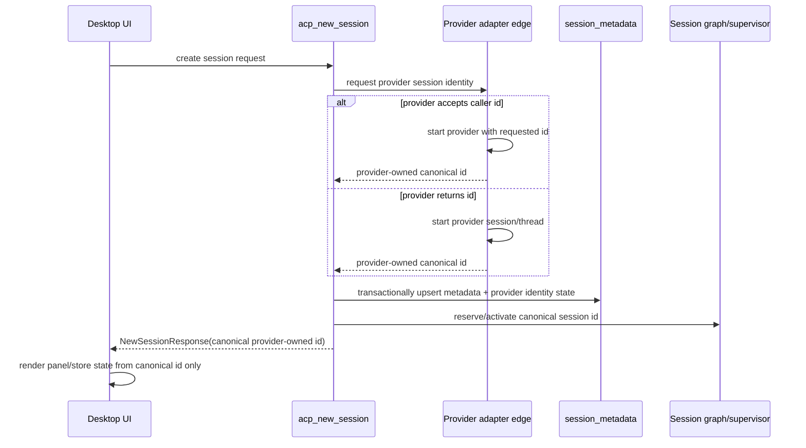

# refactor: Make provider session identity canonical

> Superseded by `docs/plans/2026-04-27-001-refactor-final-provider-identity-architecture-plan.md` and closed by `docs/solutions/architectural/provider-owned-session-identity-2026-04-27.md`. The final endpoint is stricter than this bridge plan: completed `session_metadata.id` is provider-canonical, `creation_attempts` owns pre-provider state, and `provider_session_id`/`provider_identity_kind` are removed from steady-state schema.

## Overview

Acepe currently violates the GOD architecture at the session identity seam. Provider-owned history is supposed to be the restore authority, and Acepe-owned local storage is supposed to keep only metadata. But live QA showed sessions that provider runtimes created and wrote to provider/log artifacts while Acepe failed to keep a durable `session_metadata` record that can reopen them.

This plan fixes the source boundary: a resumable session's canonical id must be provider-owned, and local identity metadata must explicitly record whether the provider id is known, provider-owned, and usable for restore. Temporary creation tokens may exist only as delivery mechanics; they must not become product session ids, UI panel ids, restore ids, or DB primary keys for completed provider sessions.

## Problem Frame

The final GOD architecture requires one authority path: provider facts/history/live events -> provider adapter edge -> canonical session graph -> revisioned materializations -> desktop selectors -> UI (see origin: `docs/brainstorms/2026-04-25-final-god-architecture-requirements.md`). The current code still has split identity authority:

- ACP subprocess providers such as Copilot already return a provider `sessionId` from `session/new`; Acepe adopts it as `NewSessionResponse.session_id`.
- Codex native receives a provider `threadId` synchronously from `thread/start`, but returns an Acepe-generated UUID v4 as the public session id and tries to bind the thread id later.
- Claude Code creates an Acepe UUID v4 and has cc-sdk options for `session_id`, but the vendored cc-sdk subprocess transport does not pass `--session-id` to the Claude CLI.
- `provider_session_id: Option<String>` overloads two different facts: "unknown provider id" and "provider id equals canonical id." This is incompatible with strict resume policies that treat `None` as missing.
- Several provider-id persistence paths swallow failures, so provider artifacts can exist without a durable, reopenable Acepe metadata record.

Live QA reproduced the failure class without relying on speculation: a Copilot provider artifact directory was created under `~/.copilot/session-state/d711250e-99ba-4744-9871-5a12bd3d9035/` with `workspace.yaml`, but no corresponding row appeared in `session_metadata`. Existing failing sessions show the same shape: provider or streaming artifacts exist, but the Acepe row is absent or not canonical enough to resume.

The evidence points to two root-cause classes that this plan must keep separate:

| Failure class | Symptom | Likely mechanism | Owning units |
|---|---|---|---|
| Creation/identity commit gap | Provider session starts but canonical metadata is not durably committed before the session is observable | Creation flow starts provider work before metadata/identity/supervisor/registry commit is atomic, or provider-id side effects are swallowed | Units 1-3 |
| Indexer/tombstone gap | Provider history exists but Acepe row later disappears or never reconciles | Provider-history indexer treats absence from one snapshot as deletion evidence and hard-deletes app-owned metadata | Units 4 and 7 |

The Copilot QA artifact is not assigned to only one mechanism until Unit 0 proves which path occurred. Unit 3 must prevent new creation commit gaps; Unit 4 must prevent indexer cleanup from erasing active Acepe-owned metadata.

Fixing only the silent write failures and making `provider_session_id` writes transactional is not enough as the final architecture. It would still preserve two product id meanings: some sessions would be addressed by local Acepe UUIDs and others by provider ids, while provider-owned restore and history indexing operate in provider id space. That leaves Codex thread-id rows, scanned provider-history rows, legacy aliases, and frontend session ids with no single canonical join key. The GOD endpoint therefore uses provider-owned canonical identity, with legacy alias support restricted to migration/recovery only.

## Requirements Trace

**Architecture & authority chain**
- R1. Preserve the GOD authority chain: provider identity/history/live facts enter only at provider edges and reduce into canonical session graph/materializations.
- R9. This work must not introduce local transcript, tool-call, or message-payload restore authority.

**Identity model**
- R2. Use provider-owned session identity as the canonical product session id for all resumable provider sessions.
- R3. Represent provider identity as an explicit state, not a nullable alias whose `None` value can mean either "same id" or "unknown id."

**Persistence & atomicity**
- R4. No provider session may become visible as a completed product session until its canonical identity and Acepe-owned metadata row are durably attached.
- R5. Provider-id writes must be transactional or error-propagating; no `let _ =`, silent `Ok(())`, or warn-only path may be responsible for resumability facts.

**History indexer**
- R6. History indexers must create/read provider-owned canonical ids without deleting Acepe-managed rows merely because provider history has not flushed yet.

**Error taxonomy & frontend**
- R7. Resume/open failure states must distinguish missing metadata, metadata missing identity facts, provider history unavailable, provider history missing, and provider history unparseable.
- R8. Frontend stores and panels must consume only backend-returned canonical session ids; optimistic creation tokens cannot become session ids or lifecycle truth.

## Scope Boundaries

- This plan does not redesign provider-native history formats.
- This plan does not add a durable provider-history cache or transcript fallback.
- This plan does not make non-restorable historical sessions magically restorable; it makes their failure explicit and recoverable where provider history exists.
- This plan may include a one-time metadata migration/backfill for Acepe-owned identity facts, but not a transcript migration.
- This plan does not redesign the agent panel UI. It only changes when panels may appear and which canonical ids they consume.

## Context & Research

### Relevant Code and Patterns

- `packages/desktop/src-tauri/src/acp/client/session_lifecycle.rs`: ACP subprocess `session/new` already treats provider `sessionId` as `NewSessionResponse.session_id`.
- `packages/desktop/src-tauri/src/acp/client/codex_native_client.rs`: Codex native currently generates an Acepe UUID, then obtains provider `threadId` from `thread/start`; provider-id persistence uses error-swallowing `let _ =` paths.
- `packages/desktop/src-tauri/src/acp/client/cc_sdk_client.rs`: Claude Code currently builds cc-sdk options with `builder.session_id(session_id)`, but the vendored transport does not pass that option to the Claude CLI.
- `packages/desktop/src-tauri/src/cc_sdk/transport/subprocess.rs` and `packages/desktop/src-tauri/cc-sdk-local/src/transport/subprocess.rs`: no `--session-id` argument is emitted despite local types supporting it.
- `packages/desktop/src-tauri/src/acp/provider.rs`: `BackendIdentityPolicy::normalize_provider_session_id` turns equal provider/local ids into `None`, which cannot distinguish "known same id" from "unknown."
- `packages/desktop/src-tauri/src/db/repository.rs`: `set_provider_session_id` returns `Ok(())` when the row is missing; tombstone deletion does not guard Acepe-managed rows strongly enough.
- `packages/desktop/src-tauri/src/history/indexer.rs`: provider scans use source ids as row ids, and tombstone deletion can remove rows absent from the current provider snapshot.
- `packages/desktop/src/lib/acp/store/services/session-connection-manager.ts`: frontend state is seeded from `NewSessionResponse.sessionId` after backend creation, but panel/list behavior must not observe a non-canonical creation token.

### Institutional Learnings

- `docs/brainstorms/2026-04-22-provider-authoritative-session-restore-requirements.md`: provider-owned files/logs/history are restore authority; Acepe durable storage is Acepe-owned metadata plus optional subordinate caches only.
- `docs/brainstorms/2026-04-25-final-god-architecture-requirements.md`: provider quirks stop at the backend/provider edge; delivery watermarks and open tokens are mechanics only, not semantic authority.
- `docs/plans/2026-04-25-002-refactor-final-god-architecture-stack-plan.md`: local restore fallbacks are removed; session metadata survives only as Acepe-owned metadata.
- `docs/concepts/reconnect-and-resume.md`: failed restore must be explicit rather than empty success.
- `docs/solutions/best-practices/provider-owned-policy-and-identity-not-ui-projections-2026-04-09.md`: provider identity policy belongs at provider boundaries, not UI projections.

### Local Probes

- `claude --help` reports `--session-id <uuid>`, proving Claude can be started with a specific provider session id.
- `codex resume --help` accepts a conversation/session id; Codex native `thread/start` already returns a `threadId` synchronously.
- `codex app-server generate-json-schema` for Codex CLI `0.121.0` shows `ThreadStartParams` has no `threadId` field. An isolated app-server probe that sent a synthetic `threadId` to `thread/start` ignored it and returned a different provider-generated `result.thread.id`, so Codex creation must promote the returned provider id rather than pre-seeding one.
- A live Copilot creation probe created provider state under `~/.copilot/session-state/d711250e-99ba-4744-9871-5a12bd3d9035/` with `workspace.yaml`, while `session_metadata` still had no matching row.
- Existing production DB stats showed `provider_session_id` is empty for Copilot/Cursor/Codex and nearly all Claude rows, proving the nullable alias model is not a reliable resumability source.
- Runtime audit on 2026-04-26 was a local contract probe, not the product runtime source of truth. Acepe already has a managed runtime installer/cache in `packages/desktop/src-tauri/src/acp/agent_installer.rs`: Claude comes through the vendored cc-sdk CLI cache, Copilot and Codex through official GitHub release downloads, and Cursor/OpenCode through the ACP registry. Provider launchers should prefer `agent_installer::get_cached_binary`/cached args before PATH fallback. The probed local runtimes were `Claude Code 2.1.119` and `codex-cli 0.121.0`; Claude's binary exposes `--session-id` strings, but final contract proof still requires Unit 2 to verify that the Acepe-managed Claude runtime reports the requested id in first stream/result. If not, creation fails with the typed identity error already defined.
- Immutable structural DB audit on 2026-04-26 found current `session_metadata` rows by provider:

| Agent | Rows | Missing `provider_session_id` | Acepe-managed | Existing `file_path` source | Canonical artifact match |
|---|---:|---:|---:|---:|---:|
| `claude-code` | 139 | 137 | 2 | 0 | 137 |
| `copilot` | 117 | 117 | 31 | 80 | 115 |
| `cursor` | 100 | 100 | 0 | 100 | source-path based |
| `codex` | 57 | 57 | 0 | 57 | 57 |

The same audit found `0` duplicate provider-alias groups, `0` rows where `id = provider_session_id`, `0` ids with path/control-character shape hazards, and many rows without `acepe_session_state` relationships (`claude-code`: 137, `copilot`: 86, `cursor`: 100, `codex`: 57). Migration must therefore treat missing relationship rows as normal legacy input, not corruption.
- Provider-history artifact counts on 2026-04-26 found broad recovery sources available: Copilot `session-state` directories: 371; Codex rollout files: 84; Claude project JSONL files: 5725; Cursor project dirs: 110, Cursor project JSON files: 1322, Cursor chat files: 468, Cursor workspace `state.vscdb` files: 17. Unit 7 must still validate project/agent/id proof before backfilling; counts are impact sizing, not permission to guess.

## Key Technical Decisions

- **Canonical session id is provider-owned for resumable sessions:** If the provider returns an id, Acepe uses it. If the provider can accept a requested id, Acepe passes the id to the provider and treats that id as provider-owned only after the provider accepts it.
- **Creation tokens are not session ids:** A pending creation may use a backend-only token, but UI/session stores/graph/repository cannot treat that token as a completed session id.
- **Provider identity becomes explicit state:** Replace nullable alias semantics with an identity fact that can represent `provider-owned canonical id` and `provider identity unavailable`. A distinct alias state may exist only inside migration/recovery helpers for legacy rows and must not become the steady-state identity model for newly created sessions.
- **Provider-id persistence must fail loudly:** Missing rows, failed upserts, or failed provider-id binding must produce typed errors and block `Ready`/resumable state.
- **Indexer tombstones cannot delete Acepe-managed active rows opportunistically:** Provider snapshot absence can mark history unavailable/stale, but cannot erase app-owned metadata without an explicit archive/delete path.
- **Provider id invariants are enforced at the edge:** The core model accepts only adapter-normalized provider session ids: non-empty, bounded, control-character-free, stable for provider resume/load, and unique within `(agent_id, provider_session_id)`. Provider-specific raw formats stay at the adapter/history-parser edge; desktop code treats canonical ids as opaque strings and must not assume UUID shape.

## Planning Decisions

All previously deferred architecture questions for this plan are resolved:

- **Should Acepe prefer provider ids?** Yes. Provider-owned restore requires the id sent to provider resume/load to be the canonical product session id whenever possible.
- **Can Claude participate without waiting for first stream output?** Yes. The CLI exposes `--session-id <uuid>`, and cc-sdk already has an option field; the bug is that the vendored subprocess transport ignores it.
- **Should equal provider/local ids be stored as `None`?** No. `None` must mean "unknown/unavailable," not "known same as canonical id."
- **Is Codex forced to use Acepe UUIDs?** No. Codex native receives provider `threadId` from `thread/start`; the plan should promote that returned id to canonical session id instead of hiding it behind a local UUID.
- **Is `provider-owned alias` permanent?** No. It is migration-only infrastructure for legacy rows that cannot yet be safely re-keyed. Unit 7 must either re-canonicalize rows under the provider id or mark them explicitly read-only/unrecoverable; new sessions may not enter a permanent alias state.
- **How should Claude CLI versions without reliable `--session-id` behave?** They are unsupported for provider-owned canonical creation. The plan should fail creation with a typed CLI-incompatible identity error rather than keeping an indefinite visible `Activating` fallback. First-turn stream/result ids still verify the contract and surface an identity-integrity error if the CLI ignores or supersedes the requested id.
- **Does Codex `thread/start` accept a caller-provided `threadId`?** No for the current Codex app-server contract. The schema has no `threadId` input and a live isolated probe ignored a supplied id. Unit 2 must use the provider-generated `result.thread.id` as canonical only after `thread/start` succeeds.
- **Exact migration/backfill trigger:** DB schema changes run through SeaORM migrations in `packages/desktop/src-tauri/src/db/migrations/`. Provider-history backfill is not a DB migration; it runs through the existing indexer reconciliation surfaces: startup full/incremental indexing via `IndexerHandle` and explicit manual `reindex_sessions`. Both paths must call the same idempotent reconciliation helper after Unit 1 identity facts exist.
- **Exact frontend transition copy:** Creation pending copy is `Starting session...`. Creation failure toast title/copy is `Session could not start` with the typed backend reason. Open/resume failures use the panel error state as the durable surface with the exact failure-state copy in Unit 5, not a synthetic empty connected panel.

## Terminology

| Term | Meaning | Authority boundary |
|---|---|---|
| Canonical session id | Provider-owned id accepted by the provider edge and used as the product session id after creation succeeds | Product state |
| Creation attempt token | Backend/UI request token used only while creation is pending before canonical id exists | Delivery mechanic only |
| Worktree launch token | Existing reserved worktree launch token consumed when a prepared worktree session is promoted to a provider-owned canonical session | Delivery mechanic only |
| Open token | Existing session-open claim/watermark mechanic referenced by the broader GOD plan | Delivery mechanic only |

## High-Level Technical Design

> *This illustrates the intended approach and is directional guidance for review, not implementation specification. The implementing agent should treat it as context, not code to reproduce.*

## Delivery Shape and Safe Checkpoints

This work is reviewable as a tightly ordered PR stack, but not every unit is a safe product checkpoint.

| Boundary | Safe to ship independently? | Reason |
|---|---|---|
| Unit 0 | Yes | Adds characterization and audit coverage only. |
| Units 1-3 | Ship together or behind disabled code paths | Identity schema, adapter identity, and atomic creation must agree before new sessions use the new contract. |
| Unit 4 | Yes after Units 1-3 | Tombstone hardening reduces deletion risk and does not require frontend rollout by itself. |
| Units 5-6 | Ship together | Backend error taxonomy and frontend pending/error-state handling must remain aligned. |
| Unit 7 | Required closure gate | Migration/backfill and QA prove the stack is complete; before Unit 7, legacy alias/local-id paths must be treated as transitional and not declared final. |

## Implementation Units

- [x] **Unit 0: Characterize current identity failure modes**

**Goal:** Lock the current broken behavior into targeted failing tests/probes before changing identity architecture.

**Requirements:** R1, R3, R5, R6, R7

**Dependencies:** None

**Files:**
- Test: `packages/desktop/src-tauri/src/db/repository_test.rs`
- Test: `packages/desktop/src-tauri/src/acp/commands/tests.rs`
- Test: `packages/desktop/src-tauri/src/acp/client/tests.rs`
- Test: `packages/desktop/src-tauri/src/acp/client/codex_native_client.rs`
- Test: `packages/desktop/src-tauri/src/history/indexer.rs`
- Test: `packages/desktop/src-tauri/src/cc_sdk/transport/subprocess.rs`
- Test: `packages/desktop/src-tauri/cc-sdk-local/src/transport/subprocess.rs`

**Approach:**
- Add characterization coverage for `set_provider_session_id` silently succeeding when a row is missing.
- Add coverage showing equal provider/local id currently normalizes to `None` and fails providers that require known provider identity.
- Add coverage for Codex provider-thread persistence swallowing row/bind failures.
- Add coverage for indexer tombstone behavior against Acepe-managed rows without provider history flushed.
- Add a narrow command-level test for "provider artifact exists but metadata row missing" mapping to an explicit missing-metadata failure, not `MissingResolvedFacts(CanonicalAgentId)`.
- Add subprocess transport characterization proving cc-sdk currently has a `session_id` option but does not emit the Claude CLI `--session-id` argument.
- Add a QA-audit query or fixture that counts provider rows with missing identity facts by agent so existing impact is quantified before migration.

**Execution note:** Start test-first. These tests should fail against current behavior for the root-cause seams, not by asserting source strings.

**Patterns to follow:**
- Existing resume-resolution tests in `packages/desktop/src-tauri/src/acp/commands/tests.rs`
- Existing repository tests in `packages/desktop/src-tauri/src/db/repository_test.rs`

**Test scenarios:**
- Error path — binding a provider session id for a missing row returns a typed error instead of `Ok(())`.
- Error path — a provider whose canonical id equals the provider id still records identity as known.
- Error path — Codex thread-id persistence failure propagates or records a typed failure instead of disappearing.
- Edge case — an Acepe-managed row missing from a provider snapshot is not deleted by tombstone cleanup while the session is not explicitly archived/deleted.
- Integration — resume of a session id with provider artifact but no metadata row surfaces missing metadata/reindex guidance, not generic missing canonical facts.
- Integration — Copilot orphan reproduction is classified as creation-commit gap, indexer/tombstone gap, or both before implementation assigns ownership.

**Verification:**
- Tests prove the current identity model cannot safely represent provider-owned canonical ids and cannot safely recover from missing metadata rows.

- [x] **Unit 1: Replace nullable provider alias with explicit identity facts**

**Goal:** Model provider identity as first-class Acepe-owned metadata with an unambiguous known/alias/unavailable state.

**Requirements:** R2, R3, R5, R7, R9

**Dependencies:** Unit 0

**Files:**
- Modify: `packages/desktop/src-tauri/src/acp/provider.rs`
- Modify: `packages/desktop/src-tauri/src/acp/parsers/provider_capabilities.rs`
- Modify: `packages/desktop/src-tauri/src/acp/session_descriptor.rs`
- Modify: `packages/desktop/src-tauri/src/db/entities/session_metadata.rs`
- Modify: `packages/desktop/src-tauri/src/db/repository.rs`
- Modify: `packages/desktop/src-tauri/src/db/migrations/`
- Test: `packages/desktop/src-tauri/src/db/repository_test.rs`
- Test: `packages/desktop/src-tauri/src/acp/session_descriptor.rs`

**Approach:**
- Introduce an explicit provider identity representation that separates canonical id ownership from optional alias value.
- Preserve the existing `provider_session_id` column only as alias storage or migrate it to a clearer field set; do not use `NULL` to mean "provider id equals canonical id."
- Update descriptor facts so `Canonical` compatibility can be satisfied by a known provider-owned canonical id even when no alias exists.
- Make provider identity policy answer "is provider identity known?" instead of "is alias column non-null?"
- Keep provider-native payloads out of metadata; only ids, ownership state, and restore eligibility belong here.

**Execution note:** Implement domain behavior test-first; this unit is the root model change.

**Patterns to follow:**
- `packages/desktop/src-tauri/src/acp/client/session_lifecycle.rs`: ACP subprocess providers already treat provider `session/new` ids as returned session ids.
- `packages/desktop/src-tauri/src/acp/session_descriptor.rs::resolve_existing_session_descriptor`: preserve strict descriptor compatibility while changing identity facts.
- `packages/desktop/src-tauri/src/acp/provider.rs::BackendIdentityPolicy`: preserve provider-edge identity policy dispatch while replacing nullable alias semantics.

**Test scenarios:**
- Happy path — canonical id marked provider-owned satisfies resume descriptor compatibility without alias text.
- Happy path — legacy canonical id plus distinct provider alias is accepted only through migration/recovery helpers and is not available as a new-session steady state.
- Error path — provider identity unavailable fails descriptor resolution with a typed missing-provider-identity fact.
- Edge case — migration of legacy rows with `provider_session_id = NULL` preserves read-only/open behavior until backfill proves provider identity.
- Integration — `history_session_id` resolves to the provider-owned canonical id when identity state says canonical id is provider-owned, and resolves through migration-only alias only for explicit legacy rows.

**Verification:**
- Provider identity can be known without duplicating the canonical id into an alias column, and unknown identity cannot masquerade as known.

- [ ] **Unit 2: Make provider adapters publish canonical provider ids at creation**

**Goal:** Ensure every provider adapter returns a provider-owned canonical id before a session is considered created.

**Requirements:** R1, R2, R4, R5, R8

**Dependencies:** Unit 1

**Files:**
- Modify: `packages/desktop/src-tauri/src/acp/client/session_lifecycle.rs`
- Modify: `packages/desktop/src-tauri/src/acp/client/cc_sdk_client.rs`
- Modify: `packages/desktop/src-tauri/src/cc_sdk/transport/subprocess.rs`
- Modify: `packages/desktop/src-tauri/cc-sdk-local/src/transport/subprocess.rs`
- Modify: `packages/desktop/src-tauri/src/cc_sdk/types.rs`
- Modify: `packages/desktop/src-tauri/cc-sdk-local/src/types.rs`
- Modify: `packages/desktop/src-tauri/src/acp/client/codex_native_client.rs`
- Modify: `packages/desktop/src-tauri/src/acp/client/codex_native_config.rs`
- Test: `packages/desktop/src-tauri/src/acp/client/tests.rs`
- Test: `packages/desktop/src-tauri/src/acp/client/codex_native_client.rs`
- Test: `packages/desktop/src-tauri/src/cc_sdk/transport/subprocess.rs`

**Approach:**
- Keep ACP subprocess providers on the existing pattern: provider `session/new` response id is canonical.
- For Claude Code, pass cc-sdk `session_id` through to the Claude CLI via `--session-id`, and mark the resulting id as provider-owned canonical identity only when the CLI supports that contract. If the CLI rejects, ignores, or supersedes the requested id, fail creation with a typed CLI-incompatible identity error rather than returning a completed product session.
- For Codex native, use the `thread/start` returned `result.thread.id` as `NewSessionResponse.session_id`; do not return an Acepe-generated local UUID as product id. Current Codex app-server does not accept caller-provided thread ids, so Codex creation remains pending until `thread/start` succeeds and returns the provider id.
- Remove provider-edge silent persistence of aliases from adapters. Adapters should return identity facts to `acp_new_session`; the command/repository seam owns durable attachment.
- Retain alias binding only for true legacy/reconnect cases where old rows have separate local and provider ids.
- Validate provider ids at the adapter edge before they enter repository or graph state: non-empty, bounded length, no embedded control characters, no path separators when used in filesystem-derived contexts, and provider-family-specific format checks when the provider contract promises UUIDs.

**Execution note:** Characterize provider adapter responses before editing; the unit changes external process invocation.

**Patterns to follow:**
- `packages/desktop/src-tauri/src/acp/client/session_lifecycle.rs` for ACP provider-owned ids
- `packages/desktop/src-tauri/src/acp/client/codex_native_client.rs::open_thread`

**Test scenarios:**
- Happy path — ACP `session/new` provider id is returned as canonical id and identity state is provider-owned.
- Happy path — Claude command construction includes `--session-id <canonical-id>` when starting a new session.
- Happy path — Codex `thread/start` returned `threadId` becomes `NewSessionResponse.session_id`.
- Error path — Codex `thread/start` response missing `threadId` fails creation before any product session is visible.
- Error path — Claude command construction rejects invalid/non-UUID session ids before invoking the CLI.
- Error path — Claude CLI without working `--session-id` support fails creation with a typed incompatible-runtime error instead of entering indefinite Activating state.
- Error path — first Claude stream/result reports a different provider session id than the requested id; the session fails with identity-integrity error and does not become resumable under the wrong id.
- Integration — no adapter writes provider identity by a swallowed side-effect; identity facts flow through the command result.

**Verification:**
- Provider adapters publish canonical provider identity as data, and creation callers do not need provider-specific alias repair or stream-time identity guessing.

- [ ] **Unit 3: Make session creation metadata atomic and observable**

**Goal:** Prevent provider sessions from becoming visible or live without a durable canonical metadata row and graph/supervisor reservation.

**Requirements:** R1, R4, R5, R7, R8

**Dependencies:** Unit 1; Unit 2

**Files:**
- Modify: `packages/desktop/src-tauri/src/acp/commands/session_commands.rs`
- Modify: `packages/desktop/src-tauri/src/acp/session_registry.rs`
- Modify: `packages/desktop/src-tauri/src/acp/lifecycle/`
- Modify: `packages/desktop/src-tauri/src/db/repository.rs`
- Test: `packages/desktop/src-tauri/src/acp/commands/tests.rs`
- Test: `packages/desktop/src-tauri/src/db/repository_test.rs`

**Approach:**
- Change `acp_new_session` so provider identity facts and metadata persistence are one ordered creation contract: provider accepts/returns id -> repository writes canonical metadata/identity -> supervisor reserves/activates -> registry stores client -> response returns to frontend.
- Replace `persist_session_metadata_for_cwd` with a creation helper that requires provider identity facts, project path, agent id, and initial lifecycle relationship.
- Make missing-row provider-id binding impossible for new sessions. Legacy binding helpers should either upsert through an explicit legacy path or return a typed error.
- Keep launch-token/worktree flows, but ensure reserved launch tokens are mechanics that promote to provider-owned canonical ids after provider acceptance.
- Ensure failures stop/cleanup provider clients and report typed creation failures rather than leaving orphan UI sessions.
- Define a cleanup contract for provider clients before registry storage: the provider adapter must expose a stop/kill handle usable after provider identity is obtained but before metadata commit. Creation cleanup logs cleanup failures as secondary diagnostics while returning the primary typed creation failure.

**Execution note:** This unit should be implemented with transaction-focused repository tests first.

**Patterns to follow:**
- `packages/desktop/src-tauri/src/db/repository.rs::consume_reserved_worktree_launch`
- `packages/desktop/src-tauri/src/acp/commands/session_commands.rs::acp_new_session`

**Test scenarios:**
- Happy path — provider identity returned from adapter is durably inserted before registry store and before `NewSessionResponse`.
- Error path — repository write failure stops the provider client and returns a typed creation error.
- Error path — supervisor reservation failure stops the provider client and does not leave a visible product session.
- Error path — provider cleanup after metadata or supervisor failure is attempted exactly once and cleanup failure is captured as diagnostic context without masking the primary creation failure.
- Edge case — launch-token reservation promotes to provider-owned canonical id and preserves worktree/project metadata.
- Integration — a provider artifact created during a timed-out or failed creation cannot appear as a completed session unless metadata commit succeeded.

**Verification:**
- No completed new-session response or registry entry can exist without a matching canonical `session_metadata` row.

- [ ] **Unit 4: Harden history indexer identity and tombstone semantics**

**Goal:** Align scanned provider history with provider-owned canonical ids without deleting app-owned metadata prematurely.

**Requirements:** R2, R3, R6, R7, R9

**Dependencies:** Unit 1

**Files:**
- Modify: `packages/desktop/src-tauri/src/history/indexer.rs`
- Modify: `packages/desktop/src-tauri/src/copilot_history/parser.rs`
- Modify: `packages/desktop/src-tauri/src/codex_history/scanner.rs`
- Modify: `packages/desktop/src-tauri/src/history/session_context.rs`
- Modify: `packages/desktop/src-tauri/src/db/repository.rs`
- Test: `packages/desktop/src-tauri/src/history/indexer.rs`
- Test: `packages/desktop/src-tauri/src/copilot_history/parser.rs`
- Test: `packages/desktop/src-tauri/src/codex_history/scanner.rs`
- Test: `packages/desktop/src-tauri/src/db/repository_test.rs`

**Approach:**
- Index provider-history records under provider-owned canonical ids when the history source itself proves the id.
- Backfill explicit identity state for scanned rows without treating provider content as Acepe-owned transcript truth.
- Add tombstone semantics that mark provider history missing/stale or archive only when allowed; do not hard-delete Acepe-managed active metadata solely because the provider snapshot is temporarily incomplete.
- Use an explicit deletion guard: provider indexer tombstones may target only non-Acepe-managed rows or rows whose `acepe_session_state` relationship is already `Archived`/deleted through an explicit user/session-delete path. `is_acepe_managed` is the default discriminator unless Unit 0 proves a stronger existing state field is required.
- Merge scanned rows with app-created rows through explicit provider identity facts, not ad hoc id/provider_session_id lookups.
- Preserve missing/unparseable provider history as explicit restore states rather than deleting evidence.

**Execution note:** Add regression tests around current tombstone deletion before changing cleanup semantics.

**Patterns to follow:**
- Existing `CopilotSource::fetch` duplicate lookup behavior in `packages/desktop/src-tauri/src/history/indexer.rs`
- Provider-owned restore requirements in `docs/brainstorms/2026-04-22-provider-authoritative-session-restore-requirements.md`

**Test scenarios:**
- Happy path — Copilot session-state directory id becomes provider-owned canonical id with explicit identity facts.
- Happy path — Codex rollout filename/thread id becomes provider-owned canonical id with explicit identity facts.
- Edge case — app-created row whose provider history has not flushed is retained and marked history-unavailable/stale, not deleted.
- Edge case — scanned row and app-created row for the same provider id merge rather than produce duplicate sidebar entries.
- Error path — provider history missing maps to explicit restore state and does not produce empty success.
- Integration — indexer cleanup cannot remove Acepe-managed rows unless an explicit archive/delete relationship permits it.
- Security — provider-history ids and project paths parsed from user-writable provider files are validated before metadata writes; invalid fields produce unparseable/unrecoverable state, not coerced DB values.

**Verification:**
- Provider history indexing reinforces the canonical provider id model and no longer races against live creation metadata.

- [ ] **Unit 5: Clarify resume/open error taxonomy**

**Goal:** Make failed reopen behavior diagnostically correct and user-actionable.

**Requirements:** R7, R8, R9

**Dependencies:** Unit 1; Unit 3; Unit 4

**Files:**
- Modify: `packages/desktop/src-tauri/src/acp/commands/session_commands.rs`
- Modify: `packages/desktop/src-tauri/src/acp/session_open_snapshot/mod.rs`
- Modify: `packages/desktop/src-tauri/src/acp/error.rs`
- Modify: `packages/desktop/src-tauri/src/history/commands/session_loading.rs`
- Modify: `packages/desktop/src/lib/acp/errors/`
- Test: `packages/desktop/src-tauri/src/acp/commands/tests.rs`
- Test: `packages/desktop/src-tauri/src/acp/session_open_snapshot/mod.rs`
- Test: `packages/desktop/src/lib/components/main-app-view/tests/open-persisted-session.test.ts`

**Approach:**
- Replace generic `MissingResolvedFacts(CanonicalAgentId)` for absent rows with explicit missing-metadata/not-indexed failures.
- Keep strict descriptor compatibility for rows with missing identity facts, but name the missing fact as provider identity rather than letting null alias semantics leak.
- Map provider-history unavailable/missing/unparseable/stale-lineage states to clear restore states and recovery actions.
- Ensure frontend surfaces the canonical failure state from backend rather than attempting local session repair.
- Define the user-visible recovery matrix for each failure state:

| Failure state | Primary surface | User affordance | Notes |
|---|---|---|---|
| Missing metadata / not indexed | Panel error state and sidebar warning marker | `Reindex provider history` when the provider source is known; otherwise `Archive session` | Title: `Session metadata is missing`. Body: `Acepe can see a session reference, but it is not indexed yet. Reindex provider history to look for the provider-owned session record.` Do not synthesize an empty session. |
| Provider identity unavailable | Panel error state | `Reindex provider history` when provider history exists; otherwise `Archive session` | Title: `Provider identity is unavailable`. Body: `This legacy session does not have a provider-owned id, so Acepe cannot safely resume it.` No send/resume actions. |
| Provider history unavailable | Panel retryable state | `Retry` | Title: `Provider history is unavailable`. Body: `Acepe could not read the provider history right now. Retry after the provider files or process are available.` Use when provider files/process are temporarily inaccessible. |
| Provider history missing | Panel explicit missing-history state | `Reindex provider history` or `Archive session` | Title: `Provider history is missing`. Body: `The provider-owned history for this session was not found. Acepe will not create a local transcript fallback.` |
| Provider history unparseable | Panel explicit parse-failure state | `Export diagnostics` | Title: `Provider history could not be read`. Body: `Acepe found provider history for this session, but it could not parse the identity metadata needed to reopen it.` Diagnostics exclude conversation/tool payload by default. |
| Stale lineage | Panel stale-lineage state | `Refresh from provider history` | Title: `Session history is stale`. Body: `Acepe needs to refresh this session from provider history before it can be resumed.` Recovery must materialize a fresh canonical snapshot. |
- Define safe diagnostics/export as structural identity and parser diagnostics only by default: session ids, provider family, file paths after redaction, parser error code/category, and restore state. Exclude message bodies, tool arguments/results, environment dumps, credentials, and large file contents unless a separately reviewed user intent flow adds them. Exports are user-triggered, written to OS-managed app data or user-chosen paths with private file permissions, and never uploaded automatically.

**Execution note:** Add failing tests using real command/result shapes before changing copy or error mapping.

**Patterns to follow:**
- `docs/concepts/reconnect-and-resume.md`
- Existing `SessionOpenResult::Error` paths in `packages/desktop/src-tauri/src/acp/session_open_snapshot/mod.rs`

**Test scenarios:**
- Error path — missing metadata row returns explicit not-indexed/missing-metadata state.
- Error path — metadata row with unknown provider identity returns identity-unavailable state.
- Error path — provider history missing returns provider-history-missing state with retry/reindex affordance when allowed.
- Error path — unparseable provider history returns unparseable state with safe diagnostics/export affordance.
- Security — diagnostic export excludes transcript/tool payloads, uses private file permissions, and requires explicit user action.
- Integration — frontend opening a failed session displays backend state and does not synthesize a connected/empty panel.

**Verification:**
- QA can tell whether a session cannot reopen because metadata is absent, provider identity is unknown, or provider history is unavailable.

- [ ] **Unit 6: Remove frontend optimistic identity/lifecycle authority**

**Goal:** Ensure desktop stores and panels only consume canonical ids and lifecycle/actionability materialized by backend creation/open flows.

**Requirements:** R1, R4, R8

**Dependencies:** Unit 3; Unit 5

**Files:**
- Modify: `packages/desktop/src/lib/acp/store/services/session-connection-manager.ts`
- Modify: `packages/desktop/src/lib/acp/store/session-store.svelte.ts`
- Modify: `packages/desktop/src/lib/components/main-app-view/logic/open-persisted-session.ts`
- Modify: `packages/desktop/src/lib/components/main-app-view/logic/managers/session-handler.ts`
- Test: `packages/desktop/src/lib/acp/store/services/session-connection-manager.test.ts`
- Test: `packages/desktop/src/lib/acp/store/__tests__/session-store-create-session.vitest.ts`
- Test: `packages/desktop/src/lib/components/main-app-view/tests/open-persisted-session.test.ts`
- Test: `packages/desktop/src/lib/components/main-app-view/tests/session-handler.test.ts`

**Approach:**
- Audit creation/open paths for any panel/store state inserted before backend returns canonical id and creation state.
- If a visible pending-create state is needed, represent it as a non-session creation attempt keyed by a creation attempt token, not as `SessionCold`.
- Keep model/mode capability optimism only after canonical session id exists and only as capability/config projection, not lifecycle truth.
- Ensure failed creation removes pending UI state and cannot leave a sidebar/panel session that has no DB row.
- Pending creation UX is intentionally narrow: show either a transient sidebar/panel placeholder keyed by creation attempt token or no session row until creation succeeds, but never a resumable `SessionCold`. If shown, the placeholder label is `Starting session...` and the panel status text is `Waiting for provider session id...`.
- The pending state clears on backend creation failure/timeout and emits a `svelte-sonner` error toast with title/copy `Session could not start` and detail text from the typed backend creation error. If the creation fails because Claude cannot honor `--session-id`, the detail is `This Claude Code runtime cannot start a provider-owned session. Update Claude Code and try again.`
- The plan does not expose a long-lived Activating fallback for Claude identity negotiation. If Claude identity cannot be confirmed through `--session-id`, creation fails before a completed session appears.

**Execution note:** This is a behavior change in UI timing; add store tests before modifying the session creation flow.

**Patterns to follow:**
- Current `sessionOpenHydrator` attempt-token pattern in `packages/desktop/src/lib/components/main-app-view/logic/open-persisted-session.ts`
- Agent panel MVC separation in repository instructions

**Test scenarios:**
- Happy path — session appears in store/panel only after backend returns canonical provider-owned id.
- Edge case — pending create attempt can show a loading placeholder keyed by creation attempt token but is not a `SessionCold` and is not resumable.
- Error path — backend creation timeout/failure clears pending create state, notifies the user, and does not leave an orphan panel.
- Integration — first-send creation does not flicker through disconnected orphan panel -> disappearance -> connected panel.
- Integration — model/mode selection applies to canonical session id only after creation response.

**Verification:**
- There is no frontend-created product session id that can diverge from backend/provider canonical identity.

- [ ] **Unit 7: Migrate/backfill existing identity metadata and prove QA matrix**

**Goal:** Repair existing metadata where provider history proves identity, explicitly mark unrecoverable rows, and verify live flows across providers.

**Requirements:** R1-R9

**Dependencies:** Units 1-6

**Files:**
- Modify: `packages/desktop/src-tauri/src/db/repository.rs`
- Modify: `packages/desktop/src-tauri/src/history/indexer.rs`
- Modify: `packages/desktop/src-tauri/src/history/commands/session_loading.rs`
- Create or modify: `packages/desktop/src-tauri/tests/`
- Test: `packages/desktop/src-tauri/src/db/repository_test.rs`
- Test: `packages/desktop/src-tauri/src/history/indexer.rs`
- Test: `packages/desktop/src/lib/acp/store/services/session-connection-manager.test.ts`

**Approach:**
- Add a one-time migration/backfill path that scans provider-owned history and writes explicit identity facts for rows whose provider id is provable.
- For rows with provider artifacts but missing metadata, decide by provider source: insert canonical provider-owned metadata if history proves project/agent/id, otherwise surface explicit not-indexed/unrecoverable state.
- For legacy local-id/alias rows, merge or tombstone duplicates through identity facts rather than keeping both rows as product sessions.
- Implement schema migration and filesystem backfill as separate steps. DB schema changes belong in `packages/desktop/src-tauri/src/db/migrations/` and only add/update identity-state columns/defaults. Provider-history scanning/backfill runs as an idempotent reconciliation helper called by the existing startup indexer path in `packages/desktop/src-tauri/src/lib.rs` (`IndexerHandle::full_scan` / `IndexerHandle::incremental_scan`) and by the manual `reindex_sessions` command in `packages/desktop/src-tauri/src/session_jsonl/commands.rs`. Do not read provider files from a SeaORM migration.
- Store a reconciliation version marker in app settings after a successful backfill pass so startup can retry incomplete/failed reconciliation without rerunning destructive merge logic blindly. Manual `reindex_sessions` always remains safe to run and reuses the same idempotent merge/rekey/archive decisions.
- Quantify existing impact before migration: record counts by provider for rows with unknown identity, rows with provider-history proof, duplicate local/provider rows, and rows that must remain read-only/unrecoverable. Codex rows with empty identity facts are not silently migrated; if the provider rollout/thread history cannot prove identity, they stay visible only as explicit legacy failures or are archived through user intent.
- Validate all provider-history-derived fields before writing metadata: ids are non-empty and bounded, expected UUID-shaped providers reject invalid ids, strings have bounded lengths and no embedded control characters, and paths are canonicalized/checked against expected provider roots.
- Run targeted QA for fresh create, first send, second send, reopen, app restart, provider history missing, provider history unparseable, and stale-lineage recovery for Copilot, Cursor, Codex, and Claude Code.
- Update concept docs if the final identity model changes wording around `provider_session_id` or canonical ids.

**Execution note:** Migration must be conservative: never invent provider identity from Acepe streaming logs alone when provider-owned history cannot prove it.

**Patterns to follow:**
- Provider-owned restore audit gate in `docs/plans/2026-04-25-002-refactor-final-god-architecture-stack-plan.md`

**Test scenarios:**
- Happy path — provider history proves identity for existing row and backfill marks canonical provider-owned identity.
- Happy path — provider artifact exists without row and scanner inserts canonical metadata from provider-owned history.
- Edge case — duplicate local-id and provider-id rows merge into one visible session.
- Error path — orphan streaming log without provider-owned history does not become a fake restorable session.
- Error path — legacy Codex row without provider-history proof remains explicit read-only/unrecoverable and is not guessed from local UUID or streaming log.
- Security — malformed provider-history ids, paths, or oversized metadata fields are rejected before DB writes.
- Integration — fresh sessions for Copilot, Cursor, Codex, and Claude Code can send first and second messages, reopen after restart, and render operations/tool calls from canonical graph selectors.
- Integration — all provider-history failure cases produce explicit non-empty failure states.

**Verification:**
- QA no longer produces sessions that ran but cannot be reopened due to missing metadata or ambiguous provider identity.

## System-Wide Impact

- **Interaction graph:** Provider adapters, session creation commands, repository metadata, lifecycle supervisor, history indexer, resume/open commands, desktop session store, and agent panel timing are affected.
- **Error propagation:** Provider identity failures become typed creation/open/resume failures instead of silent metadata gaps or generic protocol errors.
- **State lifecycle risks:** The highest-risk transition is replacing local UUID product ids in Codex/Claude paths with provider-owned canonical ids without losing legacy session visibility.
- **API surface parity:** `NewSessionResponse.sessionId` remains the frontend contract, but its meaning becomes stricter: provider-owned canonical id only.
- **Integration coverage:** Unit tests must be paired with live/manual Tauri QA because provider CLI behavior and provider-history flush timing cross process boundaries.
- **Unchanged invariants:** Provider-owned history remains restore authority; Acepe metadata remains small and Acepe-owned; `@acepe/ui` remains presentational.

## Alternative Approaches Considered

- **Keep dual local/provider ids and make binding more reliable:** Rejected as the endpoint. It preserves two id meanings and keeps the nullable alias model that caused the current ambiguity. Legacy aliases may exist only as migration support.
- **Require `provider_session_id` to be populated even when equal to `id`:** Partially workable but still encodes identity state in an alias column. The plan instead makes provider-owned canonical identity explicit.
- **Use streaming logs to reconstruct missing rows:** Rejected. Streaming logs are diagnostics/provenance, not provider-owned restore authority.
- **Disable tombstones entirely:** Rejected. Provider history cleanup still matters, but cleanup must become lifecycle-aware and identity-aware.

## Risks & Dependencies

| Risk | Likelihood | Impact | Mitigation |
|---|---|---|---|
| Existing legacy rows depend on local UUID aliases | High | High | Unit 7 migrates/backfills conservatively and keeps explicit read-only failures where identity cannot be proven. |
| Codex cannot accept caller-provided thread ids | Medium | Low | Use returned `threadId` as canonical id; no local product id is needed after provider acceptance. |
| Claude `--session-id` behavior differs between CLI versions | Medium | High | Unit 2 adds command-construction tests and a runtime capability check; unsupported or mismatched CLIs fail creation with typed incompatible-runtime/identity-integrity errors instead of entering indefinite Activating state. |
| Frontend creation timing changes could regress first-send UX | Medium | Medium | Unit 6 adds store/component behavior tests and preserves pending-create UI as non-session state. |
| Indexer changes could resurrect old sessions | Medium | Medium | Unit 4 distinguishes active metadata, archived metadata, provider-history missing, and explicit delete/archive. |
| Partial implementation recreates coexistence | High | High | Units are sequenced so Unit 7 is not complete until legacy alias/local-id paths are migrated or explicitly read-only. |

## Documentation / Operational Notes

- Update `docs/concepts/reconnect-and-resume.md` to define canonical provider-owned session id and creation tokens.
- Update `docs/concepts/session-graph.md` if provider identity state becomes part of graph/session facts.
- Add a solution note after implementation documenting the provider identity model and why nullable alias semantics were removed.
- PR description should include a provider matrix: ACP subprocess, Claude Code, Codex native, scanned history.
- Document diagnostic/streaming-log lifecycle explicitly: OS-managed storage location, private permissions, retention upper bound, purge-on-session-delete behavior, and whether logs may contain payload content. Streaming logs remain diagnostics only and must not be reintroduced as restore authority.

## Success Metrics

- Fresh Copilot, Cursor, Codex, and Claude Code sessions all have durable canonical metadata immediately after successful creation.
- A session cannot appear as a completed product session without a `session_metadata` row and explicit provider identity state.
- Resume/open failures distinguish metadata absence from provider-history absence.
- `rg "let _ = .*provider_session|set_provider_session_id" packages/desktop/src-tauri/src` no longer finds silent provider-identity persistence.
- Existing QA failures `89ab53c3...` and `b4cd2a67...` are either reopened through provider-owned history or shown as explicit, correctly classified restore failures.

## Sources & References

- **Origin document:** [docs/brainstorms/2026-04-25-final-god-architecture-requirements.md](../brainstorms/2026-04-25-final-god-architecture-requirements.md)
- Related requirements: `docs/brainstorms/2026-04-22-provider-authoritative-session-restore-requirements.md`
- Related plan: `docs/plans/2026-04-25-002-refactor-final-god-architecture-stack-plan.md`
- Related concept: `docs/concepts/reconnect-and-resume.md`
- Related concept: `docs/concepts/session-graph.md`
- Related code: `packages/desktop/src-tauri/src/acp/client/session_lifecycle.rs`
- Related code: `packages/desktop/src-tauri/src/acp/client/cc_sdk_client.rs`
- Related code: `packages/desktop/src-tauri/src/acp/client/codex_native_client.rs`
- Related code: `packages/desktop/src-tauri/src/db/repository.rs`
- Related code: `packages/desktop/src-tauri/src/history/indexer.rs`
