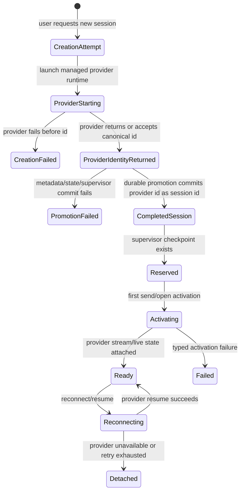
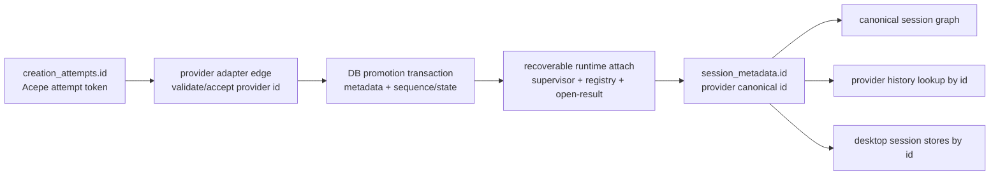

# refactor: Finalize provider-owned session identity architecture

## Overview

Acepe should stop asking, at runtime, what kind of identity a completed session row has. The final architecture makes one invariant true: every completed, resumable `session_metadata.id` is the provider-owned canonical session id. Local Acepe ids are allowed only before the provider session exists, as creation-attempt ids, worktree launch tokens, open tokens, or other delivery mechanics. They never become completed product session ids.

This plan replaces the current `provider_identity_kind` bridge with the clean endpoint:

1. `creation_attempts` owns pre-provider creation state.
2. Provider adapters validate or return canonical provider ids at the edge.
3. Promotion durably creates the completed Acepe-managed session row keyed by that provider id, then attaches in-memory runtime state through recoverable checkpoints.
4. Legacy local-id rows are rekeyed or explicitly marked migration-unresolved with user-visible recovery/diagnostic affordances.
5. Runtime resume/history/tombstone code uses `session_metadata.id` directly; alias routing is deleted.

## Problem Frame

The Final GOD Architecture requires one product authority path: provider facts/history/live events -> provider adapter edge -> canonical session graph -> revisioned materializations -> desktop stores/selectors -> presentation-safe UI DTOs (see origin: `docs/brainstorms/2026-04-25-final-god-architecture-requirements.md`).

The current identity bridge repaired real bugs but is not the final shape. `provider_identity_kind` exists because `session_metadata.id`, `provider_session_id`, frontend panel ids, provider history ids, and creation tokens can still describe different things. That forces product code to branch between `provider_owned_canonical`, `legacy_provider_alias`, `unknown`, and `unavailable`. A clean GOD architecture should not need those branches for ordinary sessions.

The final model separates lifecycle domains:

| Domain | Identifier | Product session row? | Purpose |
|---|---|---:|---|
| Creation attempt | Acepe-generated attempt id | No | Tracks a request before provider identity exists. |
| Worktree launch | Existing launch token | No | Reserves sequence/worktree intent before provider identity exists. |
| Completed session | Provider-owned canonical id | Yes | Durable product session id, provider resume/history key, graph/session key. |
| Open token | Backend-issued token | No | Delivery/claim mechanic for opening an existing session. |
| Legacy migration artifact | Old Acepe local id plus provider id | No steady-state | Input to rekey/backfill only. |

## Requirements Trace

- R1. Completed Acepe-managed sessions must be keyed by provider-owned canonical id. `session_metadata.id` is the provider resume/history id for all normal runtime paths.
- R2. Creation attempt ids, launch tokens, and open tokens must remain delivery mechanics only and must not become session ids, graph ids, panel ids, or restore ids.
- R3. `provider_identity_kind`, `provider_session_id`, `ProviderIdentityState::LegacyProviderAlias`, and alias-aware lookup are migration scaffolding, not runtime authority.
- R4. Provider adapters must validate provider-returned ids before DB promotion: non-empty, bounded, control-character-free, shell-metacharacter-free, opaque, and unique in Acepe's `(agent_id, provider_session_id)` namespace. Subprocess-facing ids must use an allowlist-only character policy and must be passed as argv/env data, never interpolated into shell command strings.
- R5. Session creation must be atomic from the product perspective: no completed session may be visible until provider id, metadata row, sequence/state relationship, supervisor reservation, registry binding, and session-open result agree on the same canonical id. Durability must be a two-phase contract: DB promotion commits metadata/sequence/session-state in one transaction, then in-memory supervisor/registry/open-result attachment either completes or leaves a typed recoverable promotion checkpoint. Provider-id uniqueness must be enforced by the DB insert/update constraint inside the promotion transaction, not by a pre-query that races concurrent attempts.
- R6. Provider creation failures before id assignment must clean up creation attempts or reserved launch rows deterministically.
- R7. Metadata commit failures after provider creation must surface as typed commit failures and leave enough attempt evidence for retry/recovery, never a silent connected-looking panel.
- R8. Legacy local-id rows must be rekeyed to provider ids, with all Acepe-owned foreign-key tables updated, before alias runtime code is deleted. Migration must create a DB backup or equivalent rollback artifact before writing user data, size the affected session set, and provide safe-mode startup if migration cannot complete.
- R9. Provider-history restore must use `session_metadata.id` directly after migration; provider-history missing/unavailable/unparseable states must be explicit and not filled from local transcript fallback.
- R10. History tombstones may delete only provider-discovered rows that are not Acepe-managed. They must not delete creation attempts or Acepe-managed completed rows merely because provider history has not flushed yet.
- R11. Frontend stores and panels may render creation attempts as pending UX, but may not insert a `SessionCold` product session until the backend returns or emits the canonical provider-owned session id.
- R12. The endpoint must include deletion proof: no product code path routes by `provider_identity_kind`, `provider_session_id`, local-id alias lookup, or UI-inferred provider identity.

## Scope Boundaries

- This plan does not redesign provider-native history formats.
- This plan does not add a provider-history content cache or local transcript restore authority.
- This plan does not redesign the visual shell of the agent panel; it changes the state model that decides when a panel represents a real session.
- This plan does not require offline restore when provider-owned history is unavailable.
- This plan may add typed error/copy surfaces needed to make creation and restore failures honest.
- This plan supersedes the endpoint of `docs/plans/2026-04-26-001-refactor-provider-session-identity-plan.md`; that bridge remains research and incremental repair context, not the final target.

## Context & Research

### Relevant Code and Patterns

- `packages/desktop/src-tauri/src/acp/commands/session_commands.rs`: `acp_new_session` currently starts the provider, then persists metadata, reserves supervisor state, stores the client, and returns `NewSessionResponse`.
- `packages/desktop/src-tauri/src/acp/client/session_lifecycle.rs`: ACP subprocess providers return `sessionId` from `session/new`; this is already the provider-owned canonical id for Copilot/Cursor/OpenCode-style providers.
- `packages/desktop/src-tauri/src/acp/client/codex_native_client.rs`: Codex `thread/start` returns `thread.id`; the current repaired path already promotes that returned id to canonical session id.
- `packages/desktop/src-tauri/src/acp/client/cc_sdk_client.rs`: Claude cc-sdk creation can request `--session-id`, but must still verify the provider accepted that id through first stream/result evidence.
- `packages/desktop/src-tauri/src/db/repository.rs`: `reserve_worktree_launch` and `consume_reserved_worktree_launch` already model temporary token -> canonical id promotion for worktree flows.
- `packages/desktop/src-tauri/src/db/entities/session_metadata.rs`: currently includes `provider_session_id` and `provider_identity_kind`; final runtime should not need either for completed managed rows.
- `packages/desktop/src-tauri/src/acp/session_descriptor.rs`: currently carries `ProviderIdentityState` and alias-sensitive history id routing; final runtime should use `id` directly.
- `packages/desktop/src-tauri/src/acp/provider.rs`: `BackendIdentityPolicy` currently carries alias/identity policy flags that should disappear from normal resume routing.
- `packages/desktop/src-tauri/src/history/indexer.rs`: provider scans collect live provider ids and tombstone discovered rows. Final tombstones compare against `id` only and keep Acepe-managed rows protected.
- `packages/desktop/src/lib/acp/store/services/session-connection-manager.ts`: frontend currently creates a `SessionCold` from `NewSessionResponse.sessionId`; final frontend must distinguish pending creation attempts from completed sessions.
- `packages/desktop/src/lib/acp/application/dto/session-identity.ts`: currently describes local Acepe session id as canonical reconnect key; this must be rewritten so provider-owned session id is the canonical reconnect key.

### Institutional Learnings

- `docs/brainstorms/2026-04-22-provider-authoritative-session-restore-requirements.md`: provider files/logs/history are restore authority; Acepe durable storage stores Acepe-owned metadata and optional subordinate caches only.
- `docs/brainstorms/2026-04-25-final-god-architecture-requirements.md`: delivery watermarks, open tokens, and buffering mechanics cannot become semantic authority.
- `docs/solutions/best-practices/provider-owned-policy-and-identity-not-ui-projections-2026-04-09.md`: provider identity policy belongs at backend/provider boundaries, not UI projections or local heuristics.
- `docs/solutions/architectural/final-god-architecture-2026-04-25.md`: compatibility authorities must be deleted or demoted behind diagnostics, not preserved as peer truth.

### Local Findings

- ACP subprocess providers already fit the final invariant because `session/new` returns the provider session id synchronously.
- Codex native fits the final invariant by promoting returned `thread/start` id; the final plan keeps this as the pattern for provider-returned ids.
- Claude cc-sdk is lazy-start today: `new_session()` can create an Acepe UUID and return before any provider subprocess starts, while the subprocess starts on first send. It cannot prove provider identity during `acp_new_session` without either eager-starting the runtime or deferring promotion until first-send stream evidence. This plan chooses deferred promotion for cc-sdk.
- `reserve_worktree_launch`/`consume_reserved_worktree_launch` is the clearest existing promotion pattern, but it is embedded in `session_metadata`; the final model should make pre-provider state a separate `creation_attempts` domain.
- Current creation failure windows can leave reserved launch rows stale or provider-created sessions without Acepe rows. The final model must handle provider-before-DB and DB-before-supervisor crash windows explicitly.

## Key Technical Decisions

- **Provider-owned id is the only completed session id:** Completed sessions do not carry local id vs provider id ambiguity. Normal resume, history lookup, graph identity, frontend routing, and tombstone matching all use `session_metadata.id`.
- **Creation attempts are first-class pre-session state:** Every UI-created session request gets an attempt id. Synchronous-id providers promote within the same command. Stream-verified providers such as Claude cc-sdk remain pending until first-send provider evidence proves the canonical id. In both cases, the attempt id is not a session id.
- **Promotion is the only bridge between domains:** Promotion consumes a creation attempt or launch token and inserts or rekeys a completed session row under the provider id. DB promotion is transactional; in-memory attachment is recoverable through explicit promotion checkpoints. Failed or incomplete promotion is a typed, visible error/recovery state.
- **Aliases are migration inputs only:** The implementation may read `provider_session_id` and `provider_identity_kind` inside migration/backfill code. Runtime product paths cannot keep reading them after migration.
- **Adapter edge validates identity:** Providers own id generation/acceptance, but Acepe owns boundary validation before the id enters product state. Validation must use an allowlist-only character set for ids that may reach subprocess arguments, reject shell metacharacters explicitly, and rely on DB uniqueness constraints during promotion for collision detection.
- **Frontend pending UI is attempt-scoped:** A pending panel/card may exist, but it is keyed by `creationAttemptId` and cannot be mistaken for a connected session panel. It promotes or fails; it does not disappear and reappear as a different session.
- **Typed errors replace string heuristics:** Creation, launch-token, metadata-commit, provider-history, and migration failures should travel as structured errors so frontend can render honest states without semantic repair.
- **Claude cc-sdk uses deferred promotion, not eager creation-time verification:** `acp_new_session` may return a pending attempt for cc-sdk. The first send starts the provider, buffers attempt-scoped events until identity is proven, then emits promotion or a typed identity-integrity failure.

## Open Questions

### Resolved During Planning

- **Is `provider_identity_kind` the clean endpoint?** No. It is a bridge used to repair current drift; the final endpoint removes runtime identity-kind branching.
- **Do we depend on installed provider runtimes?** No. Contract checks must apply to Acepe-managed runtimes from `packages/desktop/src-tauri/src/acp/agent_installer.rs`. PATH probes are evidence only.
- **Can all providers fit provider-owned ids?** Yes, by one of two provider-edge contracts: provider returns an id synchronously, or provider accepts a requested id and produces positive acceptance evidence. A provider that supports neither cannot create a resumable product session and must remain in attempt-failed/provider-incompatible state until the adapter/runtime contract changes.
- **Should creation attempts be universal or only for slow providers?** Universal. A single creation-attempt domain keeps frontend pending UX, worktree launches, retries, and crash cleanup consistent even when promotion happens synchronously.
- **Should the old alias model remain for backwards compatibility?** No. Existing aliases are migration input. Sessions that cannot be safely rekeyed become explicit restore/migration failures rather than permanent runtime branches.
- **Should Claude cc-sdk eager-start during `acp_new_session`?** No. Current cc-sdk behavior is lazy-start on first send, so the final plan keeps creation pending for cc-sdk and promotes only after first-send stream evidence. This avoids inventing a second startup timeout path inside `acp_new_session`.

### Deferred to Implementation

- **Exact provider id length bound:** The adapter-edge validation must define a bound after inspecting provider contracts and existing artifact ids. It must be finite and tested.
- **Whether `provider_session_id` is dropped or retained as nullable audit data:** Runtime product code must stop reading it either way. The implementation can decide whether a final cleanup migration drops it or leaves it inert for one release.

## High-Level Technical Design

> *This illustrates the intended approach and is directional guidance for review, not implementation specification. The implementing agent should treat it as context, not code to reproduce.*





## Implementation Units

- [ ] **Unit 0: Establish final-identity gates and audits**

**Goal:** Prove the implementation has enough visibility to safely delete alias routing rather than carrying it forward.

**Requirements:** R1, R3, R8, R9, R12

**Dependencies:** None

**Files:**
- Modify/Test: `packages/desktop/src-tauri/src/db/repository.rs`
- Test: `packages/desktop/src-tauri/src/db/repository_test.rs`
- Test: `packages/desktop/src-tauri/src/history/commands/session_loading.rs`

**Approach:**
- Add a final-identity audit helper that enumerates rows by current identity shape: provider-canonical, legacy alias, missing provider id, duplicate provider id, and unresolvable conflict.
- Size the migration blast radius before rekeying: count sessions that will migrate cleanly, sessions that will become migration-unresolved, and sessions whose provider history is missing/unparseable before the migration runs.
- Add a managed-runtime contract probe for Claude cc-sdk that records whether the current managed runtime can provide positive identity acceptance evidence after first send. This is a planning gate for Unit 2, not a runtime dependency on arbitrary PATH-installed CLIs.
- Audit all Acepe-owned tables that reference session ids before writing a rekey migration. At minimum cover `session_journal_event`, projection snapshots, checkpoints/runtime state, `acepe_session_state`, review state, and any table discovered by schema search.
- Add restore-audit fixtures for each supported provider before deleting alias lookup. Each provider needs a parseable non-empty history case, missing-history case, and unparseable-history case.

**Execution note:** Characterization-first. Capture current bridge behavior and migration inputs before deleting runtime branches.

**Patterns to follow:**
- Existing migration tests in `packages/desktop/src-tauri/src/db/migrations/`
- Restore authority gates in `docs/brainstorms/2026-04-25-final-god-architecture-requirements.md`

**Test scenarios:**
- Happy path: seeded DB with provider-canonical rows -> audit reports zero migration blockers.
- Edge case: seeded DB with one legacy alias row -> audit reports old id, provider id, and all local FK references.
- Error path: two rows claim the same provider id -> audit marks conflict and blocks alias deletion.
- Error path: Claude managed runtime produces no positive identity evidence after first send -> audit marks cc-sdk provider identity as blocked for Unit 2 until adapter/runtime contract changes.
- Integration: provider restore audit includes present, missing, and unparseable history cases per provider and produces explicit gate status.

**Verification:**
- The team can see exactly which rows will be rekeyed, skipped, or marked migration-unresolved before any runtime alias code is removed.

- [ ] **Unit 1: Introduce creation attempts as the pre-session domain**

**Goal:** Move local pre-provider identity out of `session_metadata` so completed session rows can be provider-canonical by invariant.

**Requirements:** R1, R2, R5, R6, R7, R11

**Dependencies:** Unit 0 audit shape understood

**Files:**
- Create: `packages/desktop/src-tauri/src/db/entities/creation_attempt.rs`
- Create: `packages/desktop/src-tauri/src/db/migrations/m20260427_000001_create_creation_attempts.rs`
- Modify: `packages/desktop/src-tauri/src/db/entities/mod.rs`
- Modify: `packages/desktop/src-tauri/src/db/migrations/mod.rs`
- Modify: `packages/desktop/src-tauri/src/db/repository.rs`
- Test: `packages/desktop/src-tauri/src/db/repository_test.rs`

**Approach:**
- Add `creation_attempts` with attempt id, agent id, project path, optional worktree path, optional launch token, status, typed failure reason, provider id once known, and timestamps.
- Generate attempt ids as cryptographically random Rust-side UUIDs or equivalent unpredictable values. Attempt ids must never be sequential, timestamp-derived, or user-supplied.
- Enforce a bounded number of concurrent pending attempts per project/agent at insert time and return a typed quota-exceeded error when the cap is reached.
- Allocate sequence ids during the DB promotion transaction for ordinary attempts so failed attempts do not consume durable session numbers. Existing worktree-launch flows that already reserve sequence/worktree intent may carry that reservation into promotion, but the default attempt path should order pending UI by created time rather than pre-allocating a completed-session sequence.
- Keep worktree launch token semantics, but stop representing a reserved launch as a fake `session_metadata.id`.
- Add stale-attempt GC for attempts that never promoted. GC runs as a startup/per-command sweep, not a new background scheduler, and must distinguish pending, failed, consumed, and expired attempts.

**Patterns to follow:**
- `reserve_worktree_launch` and `consume_reserved_worktree_launch` in `packages/desktop/src-tauri/src/db/repository.rs`
- `acepe_session_state` relationship tracking in `packages/desktop/src-tauri/src/db/entities/acepe_session_state.rs`

**Test scenarios:**
- Happy path: creating an attempt stores project/agent/worktree intent without creating a `session_metadata` row or consuming an ordinary session sequence id.
- Happy path: promoting an ordinary attempt allocates sequence id inside the completed provider-canonical session transaction.
- Edge case: a stale pending attempt older than the configured threshold is expired by GC while recent attempts are preserved.
- Edge case: attempt ids are generated as unpredictable UUIDs and cannot be supplied by frontend callers.
- Error path: creating more pending attempts than the configured per-project/agent cap returns a typed quota-exceeded error and writes no attempt row.
- Error path: attempting to promote an already consumed attempt returns a typed already-consumed error.
- Error path: attempting to promote an expired attempt returns a typed expired error and does not create a session row.

**Verification:**
- Pre-provider state lives only in `creation_attempts`; `session_metadata` no longer needs fake launch-token rows for newly planned flows.

- [ ] **Unit 2: Make provider creation promote through one canonical contract**

**Goal:** Route all provider creation paths through a single attempt -> provider id -> completed session promotion contract.

**Requirements:** R1, R4, R5, R6, R7

**Dependencies:** Unit 1

**Files:**
- Modify: `packages/desktop/src-tauri/src/acp/commands/session_commands.rs`
- Modify: `packages/desktop/src-tauri/src/acp/client/session_lifecycle.rs`
- Modify: `packages/desktop/src-tauri/src/acp/client/codex_native_client.rs`
- Modify: `packages/desktop/src-tauri/src/acp/client/cc_sdk_client.rs`
- Modify: `packages/desktop/src-tauri/src/acp/session_registry.rs`
- Test: `packages/desktop/src-tauri/src/acp/commands/tests.rs`
- Test: `packages/desktop/src-tauri/src/acp/client/codex_native_client.rs`
- Test: `packages/desktop/src-tauri/src/acp/client/cc_sdk_client.rs`

**Approach:**
- `acp_new_session` creates a creation attempt first. Synchronous-id providers start the managed provider runtime immediately and promote inside the command. Stream-verified providers may return a pending attempt and defer provider start/promotion until first send.
- Provider adapters return an edge-normalized canonical provider id, a pending-attempt response, or a typed creation error.
- ACP subprocess providers promote the returned `sessionId`.
- Codex promotes returned `thread.id`.
- Claude cc-sdk does not promote during `acp_new_session`. First send starts the managed runtime with the attempt's requested provider id, buffers attempt-scoped provider events, and promotes only after positive identity evidence proves the runtime accepted or reported the same id. If the runtime reports a different id or no positive identity evidence is available by the verification boundary, fail the attempt with a typed provider-identity-integrity error and do not create a completed session row.
- Promotion writes DB metadata/sequence/session-state in one transaction, then attaches supervisor/registry/session-open result using the same provider id. If runtime attachment fails after DB promotion, record a recoverable promotion checkpoint rather than pretending the entire DB+memory operation was atomic.
- Provider id validation happens before DB promotion and before frontend visibility.
- Provider id collision handling comes from the promotion insert/update failing the `session_metadata.id` uniqueness constraint inside the transaction. The typed creation-conflict error must be mapped from the DB constraint failure, not from a separate pre-check.

**Technical design:** Directional contract sketch only:

```text
create_attempt -> provider_edge.start(attempt)
  -> provider_id_validated
  -> promote_attempt_db(provider_id)
  -> attach_runtime(provider_id)
  -> completed_session(provider_id)
```

**Patterns to follow:**
- Existing `NewSessionResponse.session_id` handling for ACP providers.
- Codex `thread/start` returned id promotion.
- Managed runtime lookup in `packages/desktop/src-tauri/src/acp/agent_installer.rs`.

**Test scenarios:**
- Happy path: ACP provider returns `sessionId` -> attempt promotes -> `NewSessionResponse.sessionId` equals provider id.
- Happy path: Codex returns `thread.id` -> attempt promotes -> resume uses that same id.
- Happy path: Claude first send produces positive evidence that the managed runtime accepted the requested id -> buffered attempt events replay into the promoted provider-canonical session.
- Error path: Claude runtime returns a different id -> attempt fails with identity-integrity error and no session row is visible.
- Error path: Claude runtime produces no positive identity evidence by the verification boundary -> attempt fails with provider-identity-unverified and no session row is visible.
- Error path: provider fails before id with a worktree launch -> attempt/launch state is failed or discarded; no stale `Reserved` session row remains.
- Error path: metadata promotion fails after provider id exists -> attempt records typed metadata-commit failure and frontend receives creation failure rather than a connected session.
- Error path: DB promotion succeeds but supervisor/registry attachment fails -> completed row carries a recoverable promotion checkpoint and open/resume enters detached/recoverable state, not empty success.
- Edge case: provider returns empty, oversized, or control-character id -> adapter-edge validation fails before DB write.
- Edge case: provider returns shell metacharacters, spaces, quotes, backslashes, or other characters outside the provider-id allowlist -> adapter-edge validation fails before subprocess argument construction or DB write.
- Edge case: provider id collides with existing session row -> typed creation-conflict error and no overwrite.

**Verification:**
- There is one creation promotion path, and completed sessions cannot be created under local attempt ids.

- [ ] **Unit 3: Rework frontend creation UX around attempts, not fake sessions**

**Goal:** Stop the panel flicker class by ensuring frontend session stores do not create a real session entry until canonical provider id promotion succeeds.

**Requirements:** R2, R5, R7, R11

**Dependencies:** Units 1-2 backend response/event contract

**Files:**
- Modify: `packages/desktop/src/lib/acp/types/new-session-response.ts`
- Modify: `packages/desktop/src/lib/acp/store/services/session-connection-manager.ts`
- Modify: `packages/desktop/src/lib/acp/store/session-store.svelte.ts`
- Modify: `packages/desktop/src/lib/acp/store/services/session-repository.ts`
- Modify: `packages/desktop/src/lib/acp/application/dto/session-identity.ts`
- Modify: `packages/desktop/src/lib/components/main-app-view/types/create-session-options.ts`
- Test: `packages/desktop/src/lib/acp/store/services/session-connection-manager.test.ts`
- Test: `packages/desktop/src/lib/acp/store/session-store.test.ts`
- Test: `packages/desktop/src/lib/components/agent-panel/agent-panel-content.test.ts`

**Approach:**
- Add a creation-attempt projection/store keyed by `creationAttemptId`.
- Render pending copy from attempt state, using `Starting session...` or typed failure copy, without inserting a `SessionCold`. Pending attempts appear in the same chronological session list position their eventual sequence id would occupy, but must be visually labeled as starting/pending rather than connected.
- On successful promotion, remove the attempt and insert/hydrate exactly one `SessionCold` keyed by provider canonical id.
- Buffer or ignore pre-promotion session events by attempt id until a `SessionPromoted` event maps them to the provider-canonical session id. Early tool/planning events must not create a temporary session row.
- On failure, keep a failed attempt state long enough for user-visible error/retry/archive actions, then allow explicit dismissal. Retry re-runs the same creation config from a new attempt after user action; archive/dismiss hides the failed attempt but does not delete completed session data because no completed session exists.
- Define frontend states for pending, long-running pending, failed-retryable, failed-terminal, promoted, stale-promotion-ignored, and detached/recoverable session.
- Narrow `session-repository.ts` so repository APIs cannot create or upsert a `SessionCold` directly from creation response data before canonical promotion; any create-attempt persistence/projection helper must remain attempt-scoped.
- Rewrite DTO comments and types so provider-owned session id is the canonical reconnect key.

**Patterns to follow:**
- Neverthrow ResultAsync style already used in `session-connection-manager.ts`.
- Agent panel scene/controller split: presentational UI gets normalized attempt/session DTOs and callbacks.

**Test scenarios:**
- Happy path: create session returns promoted provider id -> frontend inserts one session with that id and no temporary session remains.
- Happy path: backend emits pending attempt before promotion -> UI renders pending attempt but `sessions` array is unchanged.
- Error path: creation fails before promotion -> UI shows failed attempt/error copy and does not show a connected panel.
- Edge case: stale promotion event arrives for an attempt already dismissed -> ignored without creating a session.
- Edge case: provider emits attempt-scoped events before promotion -> frontend buffers or ignores them until promotion maps attempt id to provider id; no temporary session panel appears.
- Integration: pending attempt -> promoted session keeps stable visible panel identity with no disappear/reappear flicker.

**Verification:**
- The frontend has separate attempt and session state, and product session routing never uses attempt ids.

- [ ] **Unit 4: Migrate legacy aliases to provider-canonical ids**

**Goal:** Convert existing local-id sessions into the final invariant or mark them explicitly migration-unresolved before runtime alias branches are deleted.

**Requirements:** R1, R3, R8, R9, R12

**Dependencies:** Unit 0 audit, Units 1-2 creation path stable

**Files:**
- Create: `packages/desktop/src-tauri/src/db/migrations/m20260427_000002_migrate_legacy_provider_aliases.rs`
- Create or Modify: `packages/desktop/src-tauri/src/db/entities/session_identity_migration_report.rs`
- Modify: `packages/desktop/src-tauri/src/db/migrations/mod.rs`
- Modify: `packages/desktop/src-tauri/src/db/repository.rs`
- Modify: `packages/desktop/src-tauri/src/acp/commands/session_commands.rs`
- Test: `packages/desktop/src-tauri/src/db/migrations/m20260427_000002_migrate_legacy_provider_aliases.rs`
- Test: `packages/desktop/src-tauri/src/db/repository_test.rs`

**Approach:**
- Before writing user data, create a DB backup or equivalent rollback artifact and record its location in app-managed diagnostics state. If backup creation fails, block migration and start in session-safe mode rather than mutating the DB.
- Run migration before any session command can open/resume/load sessions. If migration cannot complete, the app starts with session commands disabled and a migration-unresolved surface rather than partially using old and new identity models.
- For each legacy alias row with a valid provider id and no conflict, rekey the `session_metadata.id` to provider id and update all Acepe-owned FK references in the same transaction. SQLite foreign-key enforcement and `ON UPDATE` cascades are not reliable for this path, so the migration must enumerate each child-table update explicitly rather than assuming database cascades.
- Update `session_metadata.file_path` alongside `id` for Acepe-managed rows so `__session_registry__/{session_id}` sentinel paths remain keyed by the provider-canonical id and do not create stale unique-key holes.
- Clear `provider_session_id` for migrated rows and record migration outcomes for diagnostics and UI messaging. The default migration report must store only non-sensitive structural fields such as conflict type, row status, row counts, and timestamps; raw old/new provider ids are allowed only behind explicit user-initiated diagnostics export or recovery tooling.
- For conflicts or missing provider ids, record a migration failure row and surface the affected session as migration-unresolved, not as a normal resumable session. Migration-unresolved sessions remain visible with explanation, safe diagnostics/export where available, and an explicit archive/dismiss path; they must not disappear silently.
- Add post-migration assertion coverage that ordinary managed rows have no legacy alias state.

**Patterns to follow:**
- SeaORM migrations in `packages/desktop/src-tauri/src/db/migrations/`.
- Existing `acepe_session_state` migration/backfill patterns.

**Test scenarios:**
- Happy path: legacy alias row rekeys to provider id and all referenced Acepe-owned tables point at the new id.
- Happy path: rekeyed Acepe-managed row also updates `file_path` to the provider-canonical `__session_registry__/{id}` sentinel.
- Happy path: provider-canonical rows are untouched.
- Error path: alias row has missing provider id -> row is recorded as migration-unresolved and not silently treated as resumable.
- Error path: provider id conflicts with an existing row -> conflict recorded; no data overwritten.
- Error path: backup creation fails -> migration is blocked and session commands stay in safe mode with an explicit migration-blocked error.
- Error path: migration encounters unexpected FK shape -> current row is skipped/recorded, backup remains available, and app does not load mixed identity state as normal.
- Integration: after migration, repository lookup by old local id does not return a normal session; lookup by provider id does.

**Verification:**
- Legacy aliases are gone from normal managed rows, and unresolved rows are explicit diagnostics/recovery cases.

- [ ] **Unit 5: Delete runtime alias and identity-kind routing**

**Goal:** Remove the steady-state code that made `provider_identity_kind` necessary.

**Requirements:** R1, R3, R9, R10, R12

**Dependencies:** Unit 4 migration complete and covered

**Files:**
- Modify: `packages/desktop/src-tauri/src/db/entities/session_metadata.rs`
- Modify: `packages/desktop/src-tauri/src/db/repository.rs`
- Modify: `packages/desktop/src-tauri/src/acp/session_descriptor.rs`
- Modify: `packages/desktop/src-tauri/src/acp/provider.rs`
- Modify: `packages/desktop/src-tauri/src/acp/parsers/provider_capabilities.rs`
- Modify: `packages/desktop/src-tauri/src/history/indexer.rs`
- Modify: `packages/desktop/src-tauri/src/history/commands/scanning.rs`
- Modify: `packages/desktop/src-tauri/src/history/commands/session_loading.rs`
- Test: `packages/desktop/src-tauri/src/db/repository_test.rs`
- Test: `packages/desktop/src-tauri/src/acp/session_descriptor.rs`
- Test: `packages/desktop/src-tauri/src/history/commands/session_loading.rs`

**Approach:**
- Remove or quarantine `ProviderIdentityState` so product runtime cannot branch on `LegacyProviderAlias`.
- Make `history_session_id()` return `id`, or delete the helper and pass `id` directly.
- Delete `query_existing_session_by_id_or_provider_session_id` and replace with id-only lookup.
- Remove `BackendIdentityPolicy.requires_persisted_provider_session_id` and `prefers_incoming_provider_session_id_alias` from normal routing. Provider identity validation belongs at creation/resume adapter edges, not row interpretation.
- Update provider capability parsing so it no longer projects strict-provider alias requirements through `BackendIdentityPolicy`; provider capability metadata may describe launch/resume mechanics, but not alternate row-identity interpretation.
- Simplify tombstone exclusion to `id` only while preserving `is_acepe_managed` protection.
- Preserve open tokens as delivery/claim mechanics only: they may validate an open/resume claim for a provider-canonical session id, but they cannot be used as session lookup keys, graph ids, restore ids, or attempt ids.
- Add a concrete deletion-proof test that runs under the normal Rust test suite and fails if product runtime code reads `provider_identity_kind`, `ProviderIdentityState::LegacyProviderAlias`, id-or-provider lookup, or alias routing outside migration/reporting code.

**Patterns to follow:**
- Final GOD deletion-proof language in `docs/solutions/architectural/final-god-architecture-2026-04-25.md`.

**Test scenarios:**
- Happy path: resumed provider-canonical session uses `row.id` for provider history lookup.
- Happy path: tombstone scan deletes discovered non-managed rows absent from provider scan and preserves Acepe-managed rows.
- Happy path: open token validates an existing provider-canonical session open claim without changing the session id or becoming a lookup fallback.
- Error path: old local id lookup returns session-not-found or migration-report guidance, not alias fallback.
- Integration: repo search/deletion-proof test fails if product code imports or matches on `LegacyProviderAlias`.

**Verification:**
- Runtime session identity can be explained without `provider_identity_kind`: completed session id is the provider id.

- [x] **Unit 6: Make provider-history and creation failures typed and user-visible**

**Goal:** Replace success-shaped fallbacks and string-classified restore errors with typed failure states that frontend can render without guessing.

**Requirements:** R7, R9, R11

**Dependencies:** Units 2-5

**Files:**
- Modify: `packages/desktop/src-tauri/src/acp/types.rs`
- Modify: `packages/desktop/src-tauri/src/acp/commands/session_commands.rs`
- Modify: `packages/desktop/src-tauri/src/history/commands/session_loading.rs`
- Modify: `packages/desktop/src-tauri/src/acp/client/codex_native_client.rs`
- Modify: `packages/desktop/src-tauri/src/acp/client/cc_sdk_client.rs`
- Modify: `packages/desktop/src/lib/acp/store/services/session-connection-manager.ts`
- Modify: `packages/desktop/src/lib/acp/store/session-event-handler.ts`
- Test: `packages/desktop/src-tauri/src/history/commands/session_loading.rs`
- Test: `packages/desktop/src-tauri/src/acp/commands/tests.rs`
- Test: `packages/desktop/src/lib/acp/store/services/session-connection-manager.test.ts`

**Approach:**
- Introduce typed creation errors: provider failed before id, invalid provider id, provider identity mismatch, metadata commit failed, launch token not found/already consumed/expired, creation attempt expired.
- Introduce typed provider-history errors where provider edges can return unavailable, missing, unparseable, validation failed, and stale lineage states without string matching.
- Add migration-aware fields to history-missing errors when a migrated alias cannot be restored from provider history.
- Add safe export/diagnostics affordance flags without storing provider transcript content locally. Diagnostics exports are explicit user actions, must be redacted by default, must exclude provider transcript/tool bodies, and may include only structural metadata such as error kind, provider id hash/redacted suffix, timestamps, migration row status, and app/runtime versions unless a separately reviewed export path allows more.
- Ensure frontend renders failed attempts/restores as explicit error states, never as empty connected sessions.
- Define user-facing copy for each typed creation/restore class before implementation, including provider-incompatible, provider-identity-unverified, metadata-commit-failed, migration-unresolved, provider-history-missing, provider-history-unavailable, provider-history-unparseable, and detached/recoverable.

**Test scenarios:**
- Happy path: provider-history unavailable maps to retryable detached/open state.
- Error path: provider-history missing maps to non-success restore state with safe export affordance when available.
- Error path: provider-history unparseable maps to non-retryable diagnostics state.
- Error path: metadata commit failed after provider id maps to failed creation attempt with retry guidance.
- Error path: migration-unresolved row maps to a visible session-list state with explanation and no normal resume action.
- Integration: frontend receives typed creation failure and keeps failed attempt surface rather than creating/removing a session panel.

**Verification:**
- Creation and restore failures are semantically typed end to end from Rust provider edge to frontend presentation model.

- [x] **Unit 7: Final schema cleanup, documentation, and live verification**

**Goal:** Close the final architecture by removing bridge schema/code, documenting the invariant, and proving the original user-visible bugs stay fixed.

**Requirements:** R1-R12

**Dependencies:** Units 0-6

**Files:**
- Create: `packages/desktop/src-tauri/src/db/migrations/m20260427_000003_drop_provider_identity_bridge.rs`
- Modify: `packages/desktop/src-tauri/src/db/entities/session_metadata.rs`
- Modify: `packages/desktop/src-tauri/src/db/migrations/mod.rs`
- Modify: `docs/solutions/architectural/final-god-architecture-2026-04-25.md`
- Create or Modify: `docs/solutions/architectural/provider-owned-session-identity-2026-04-27.md`
- Modify: `docs/concepts/reconnect-and-resume.md`
- Modify: `docs/plans/2026-04-26-001-refactor-provider-session-identity-plan.md`
- Modify: `docs/plans/2026-04-12-002-refactor-god-clean-operation-model-plan.md`
- Modify: `docs/plans/2026-04-19-001-refactor-canonical-session-state-engine-plan.md`
- Modify: `docs/plans/2026-04-20-001-refactor-canonical-operation-state-model-plan.md`
- Modify: `docs/plans/2026-04-21-001-refactor-canonical-session-lifecycle-authority-plan.md`
- Modify: `docs/plans/2026-04-22-002-refactor-session-lifecycle-convergence-after-proof-plan.md`
- Modify: `docs/plans/2026-04-23-002-refactor-provider-owned-restore-authority-plan.md`
- Test: `packages/desktop/src-tauri/src/db/migrations/m20260427_000003_drop_provider_identity_bridge.rs`
- Test: deletion-proof tests or scripts added in Unit 5

**Approach:**
- Drop `provider_identity_kind` after product code no longer reads it. Decide during implementation whether `provider_session_id` is dropped in the same migration or retained inert for one release as migration diagnostics only.
- Update docs to name the final invariant: completed session id equals provider-owned canonical id.
- Document creation-attempt lifecycle and error states for future provider adapters.
- Add superseded-by pointers to the bridge plan and older active architecture plans whose endpoints conflict with this final identity architecture.
- Run Tauri MCP/manual verification against the original failure reports: tool calls render, planning-next-move renders, and create-session pending surface does not flicker into a false session panel.

**Patterns to follow:**
- Existing `docs/solutions/` YAML frontmatter.
- Acepe provider-authoritative restore requirements.

**Test scenarios:**
- Happy path: migration down/up behavior is safe for fresh DBs and seeded bridge DBs.
- Integration: provider-canonical create -> send -> tool call -> planning-next-move -> cold resume renders under the same session id.
- Integration: creation failure shows failed attempt; no connected session appears.
- Integration: app restart after promoted metadata but before ready state resumes as detached/recoverable, not auto-activated or empty success.
- Deletion proof: code search or test gate confirms no runtime product path reads `provider_identity_kind`, `provider_session_id` alias routing, or local-id fallback.

**Verification:**
- The final stack can be reviewed as a completed architecture, not a coexistence bridge.
- Automated checks passed for schema cleanup, typed failures, provider-history loading, repository behavior, and session commands. Tauri MCP live verification was attempted, but no bridge session was connected and `driver_session start` returned an empty MCP error, so the live UI smoke remains a manual follow-up rather than observed evidence in this session.

## System-Wide Impact

- **Interaction graph:** New session creation touches backend commands, provider adapters, repository promotion, supervisor reserve, registry storage, event bridge, frontend session stores, and agent-panel presentation.
- **Error propagation:** Creation and restore errors must remain typed from Rust to TypeScript. Broad string classification and warn-only alias persistence are not acceptable final behavior.
- **State lifecycle risks:** The dangerous windows are provider-created-before-DB, DB-before-supervisor, crash during launch-token reservation, pre-promotion provider events, and stale promotion events. Creation attempts, DB promotion transactions, and recoverable promotion checkpoints are designed to make those windows explicit.
- **API surface parity:** Tauri commands, generated TS types, session event payloads, and frontend DTOs must change together. No interface should expose attempt ids as session ids.
- **Integration coverage:** Unit tests alone will not prove panel flicker or provider-runtime identity acceptance. The final gate needs Tauri MCP/manual create/send/resume verification against managed runtimes.
- **Unchanged invariants:** Provider-owned history remains restore authority. Acepe does not store durable provider transcript/tool payload copies to compensate for missing history.

## Risks & Dependencies

| Risk | Mitigation |
|------|------------|
| Legacy rekey migration corrupts Acepe-owned metadata references | Run FK audit first, migrate per row in transactions, record conflicts instead of guessing, and test seeded FK tables. |
| Claude managed runtime cannot produce positive identity evidence | Keep cc-sdk session in attempt-failed/provider-incompatible state until adapter/runtime contract is fixed; do not create local-id sessions or pretend negative inference is proof. |
| Creation attempts add frontend complexity | Keep attempts separate from sessions and promote/fail through one event/response shape. This complexity replaces worse session flicker and identity drift. |
| Provider history is missing after rekey | Surface typed provider-history-missing state with migration context and safe diagnostics/export where available; do not preserve alias fallback indefinitely. |
| Bridge code remains because it feels safer | Add deletion-proof tests/search gates and mark bridge code migration-only. |
| Metadata commit or runtime attachment fails after provider session creation | Record typed failed attempt or recoverable promotion checkpoint; never surface a connected session without committed metadata and canonical id agreement. |
| Migration fails on user device | Use pre-migration backup/rollback artifact, per-row transactions, and session-safe mode so the app does not operate on mixed identity state. |

## Dependencies / Prerequisites

- Baseline assumption: the repository currently contains the 2026-04-26 provider-identity bridge schema/code, including the `provider_identity_kind` migration. Unit 0 audits that bridge-state baseline; this plan supersedes the bridge endpoint rather than replacing the historical bridge migration as if it never existed.
- Acepe-managed provider runtimes from `packages/desktop/src-tauri/src/acp/agent_installer.rs` must be the source of contract truth for Claude/Codex/Copilot/Cursor/OpenCode behavior.
- The final migration must run before any session open/resume command can use rows from the old identity model.

## Success Metrics

- New sessions for every supported resumable provider complete with `session_metadata.id` equal to the provider id used for resume/history.
- Claude cc-sdk either promotes after positive first-send identity evidence or fails as provider-identity-unverified without creating a completed session row.
- No completed managed session row requires `provider_identity_kind` to determine resumability.
- Frontend creation renders either a pending attempt, a failed attempt, or exactly one canonical session. It does not render a temporary connected-looking session and then replace it.
- Provider-history cold resume uses `row.id` directly and returns explicit missing/unavailable/unparseable states.
- Migration reports the count of cleanly rekeyed, migration-unresolved, and skipped sessions; unresolved sessions are visible and do not silently disappear.
- User-visible regression checks pass for the original failures: tool calls render, planning-next-move renders, and create-session pending/promoted flow has no false connected-panel flicker.
- Repo deletion-proof search confirms bridge symbols are absent from product runtime paths.

## Documentation / Operational Notes

- Update reconnect/resume docs to state that provider-owned session id is the canonical reconnect key.
- Add a solution note documenting creation attempts and provider-canonical promotion as the final identity pattern.
- Record migration conflict reports in app data/DB diagnostics, not the repository, and make them safe to share without provider transcript bodies or raw old/new provider ids unless the user explicitly exports recovery diagnostics.
- Keep raw provider diagnostics redacted and subordinate to user-visible troubleshooting/export affordances.

## Sources & References

- **Origin document:** [docs/brainstorms/2026-04-25-final-god-architecture-requirements.md](../brainstorms/2026-04-25-final-god-architecture-requirements.md)
- Related requirements: [docs/brainstorms/2026-04-22-provider-authoritative-session-restore-requirements.md](../brainstorms/2026-04-22-provider-authoritative-session-restore-requirements.md)
- Transitional bridge plan: [docs/plans/2026-04-26-001-refactor-provider-session-identity-plan.md](2026-04-26-001-refactor-provider-session-identity-plan.md)
- Institutional learning: [docs/solutions/best-practices/provider-owned-policy-and-identity-not-ui-projections-2026-04-09.md](../solutions/best-practices/provider-owned-policy-and-identity-not-ui-projections-2026-04-09.md)
- Final GOD solution: [docs/solutions/architectural/final-god-architecture-2026-04-25.md](../solutions/architectural/final-god-architecture-2026-04-25.md)
