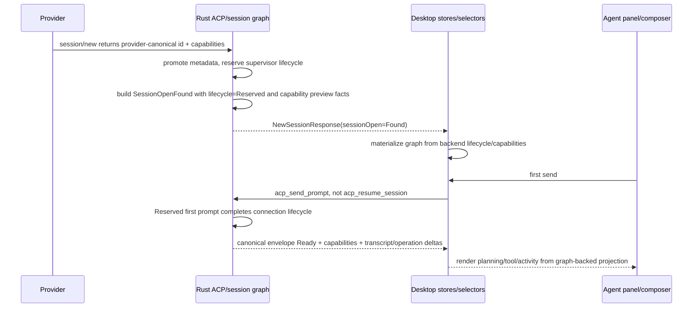

# fix: Restore session graph authority for new-session first send

## Overview

Fresh Cursor/Copilot sessions can be created successfully but then fail the first send because the desktop store sees `canSend: false`, falls back to `connectSession`, and invokes provider reopen/load semantics on a just-created live session. Cursor then reports the new session as unavailable to reopen, which turns a fresh panel into a connection error.

The fix is to close the authority gap rather than patch the fallback. Session open/create snapshots must carry backend-authored lifecycle, actionability, and capabilities into desktop materialization. Desktop may render and project that state, but must not synthesize lifecycle truth from `SessionOpenFound`, hot state, or timing.

User-observable outcome: a developer who creates a Cursor or Copilot session and sends the first prompt should see the prompt dispatch into the session; they should not see a restore/reopen connection error for a session that was just created.

## Problem Frame

The final GOD architecture requires one product-state authority path: provider facts/history/live events -> provider adapter edge -> canonical session graph -> revisioned materializations -> desktop stores/selectors -> UI (see origin: `docs/brainstorms/2026-04-25-final-god-architecture-requirements.md`). The reproduced bug shows that this path still has a gap:

- Backend `acp_new_session` creates a live provider client and reserves the supervisor lifecycle.
- The shipped/session-open authority gap was that `SessionOpenFound` materialization did not reliably carry lifecycle/capabilities end-to-end; current pre-plan WIP has added Rust fields in some places, but call sites and TypeScript materialization are still incomplete.
- Desktop `materializeSnapshotFromOpenFound` fills in lifecycle/capabilities locally.
- `replaceSessionOpenSnapshot` also writes a synthetic detached canonical projection for open snapshots before graph replacement, which is the exact class of local lifecycle authority this plan removes.
- First-send gating reads that projected state and can fall through to `connectSession`.
- `connectSession` calls `acp_resume_session`, which maps to provider `session/load` for Cursor/Copilot and is the wrong operation for a just-created live session.

This violates R10/R12/R13 from the origin requirements: lifecycle/actionability/capability state must come from backend-owned canonical selectors, not frontend-local compatibility logic.

## Requirements Trace

- R1. Keep session truth on the canonical graph authority path (origin R1, R4, R20).
- R2. Lifecycle/actionability/capability truth must be backend/supervisor-owned and revision-bearing (origin R10, R12, R13).
- R3. Preserve the lifecycle invariant that `Reserved` is the only pre-live state that allows first-send activation (`docs/concepts/session-lifecycle.md`).
- R4. Cold-open restored sessions must remain detached/resumable unless backend lifecycle says otherwise; a cold-open must not pretend a previous session is still live.
- R5. Fresh first-send must not route through provider reopen/load semantics.
- R6. Planning-next-moves, tool activity, ordering, retry/resume affordances, and connected/error UI must derive from canonical graph materializations rather than hot-state repair.
- R7. Deferred-creation providers must keep the existing pending-creation materialization boundary: no completed product session until provider identity is proven.

## Scope Boundaries

- This plan fixes the new-session/open hydration authority gap and the first-send fallback caused by that gap.
- This plan does not redesign provider-owned restore parsing, operation identity, raw-lane deletion, or local journal deletion beyond the code paths necessary to keep lifecycle/capability authority canonical.
- This plan does not introduce a new explicit `activate_with_first_prompt` command. The current backend contract already supports direct first `acp_send_prompt` from `Reserved` for synchronously created providers.
- This plan does not treat cached ready snapshots in `acp_resume_session` as the primary fix. Cached-snapshot reuse may remain as defense-in-depth, not as the architecture endpoint.
- This plan should be executed on the current main checkout; no worktree split is required.

## Context & Research

### Relevant Code and Patterns

- `packages/desktop/src-tauri/src/acp/commands/session_commands.rs` creates sessions, reserves supervisor lifecycle, builds open results, and serves canonical session-state snapshots.
- `packages/desktop/src-tauri/src/acp/session_open_snapshot/mod.rs` defines `SessionOpenFound`; current WIP already contains lifecycle/capability fields, so the remaining work is to complete call sites, exported types, and desktop materialization.
- `packages/desktop/src-tauri/src/acp/session_state_engine/bridge.rs` and `packages/desktop/src-tauri/src/acp/session_state_engine/snapshot_builder.rs` already know how to build graph snapshots when lifecycle/capabilities are provided.
- `packages/desktop/src-tauri/src/acp/session_state_engine/runtime_registry.rs` already stores canonical lifecycle/capabilities and applies `ConnectionComplete` into `Ready`.
- `packages/desktop/src-tauri/src/session_jsonl/export_types.rs` is the specta type export surface for `SessionOpenFound` and generated `acp-types.ts`.
- `packages/desktop/src/lib/acp/session-state/session-state-protocol.ts` currently materializes open snapshots by passing frontend default lifecycle/capabilities.
- `packages/desktop/src/lib/acp/store/services/session-open-hydrator.ts` applies open/create snapshots into desktop stores.
- `packages/desktop/src/lib/acp/store/session-store.svelte.ts` currently has a `replaceSessionOpenSnapshot` synthetic detached projection that must not override backend graph authority.
- `packages/desktop/src/lib/acp/store/services/first-send-activation.ts`, `packages/desktop/src/lib/acp/store/services/session-messaging-service.ts`, and `packages/desktop/src/lib/acp/store/session-store.svelte.ts` are the first-send actionability gates.

### Institutional Learnings

- `docs/solutions/architectural/final-god-architecture-2026-04-25.md` documents that `SessionHotState` is compatibility/config/telemetry projection, not lifecycle truth.
- `docs/solutions/architectural/provider-owned-session-identity-2026-04-27.md` documents that frontend materialization must happen from canonical graph snapshots after provider identity is proven.
- `docs/solutions/architectural/graph-backed-session-activity-authority-2026-04-23.md` documents that planning/tool/activity copy should flow from graph-backed activity instead of surface-local reconstruction.
- `docs/solutions/logic-errors/terminal-state-guard-missing-blocked-2026-04-25.md` is a reminder that raw/compatibility lanes may not regress canonical settled state.

### External References

- None. Local architecture docs and current runtime behavior are the governing source.

## Key Technical Decisions

- **Decision: `SessionOpenFound` carries lifecycle and capabilities.** The backend already has canonical runtime state; the open/create contract should transport it instead of forcing TypeScript to invent defaults.
- **Decision: keep new synchronously-created sessions canonically `Reserved`, not `Ready`.** `Reserved` is the documented pre-live first-send activation state. Direct first `acp_send_prompt` is already supported by backend send logic for synchronous providers.
- **Decision: cold-open provider-history snapshots default to backend-authored `Detached` when no live runtime snapshot exists.** Cold-open should render history and offer resume; it must not look live unless backend runtime says it is live.
- **Decision: remove frontend default lifecycle/capability materialization from the open/create path.** TypeScript may still derive activity from graph inputs, but lifecycle/actionability/capabilities must come from the backend snapshot payload.
- **Decision: missing or invalid canonical lifecycle fails closed.** A completed product session with no valid canonical lifecycle/capability projection must surface a recoverable materialization/send error; it must not infer sendability from hot state and must not silently allow sends.
- **Decision: leave deferred-creation pending sessions separate.** Claude cc-sdk-style pending creation has no completed product session yet and should not be forced through `SessionOpenFound`.

## Open Questions

### Resolved During Planning

- **Should created sessions become `Ready` immediately?** No. That would erase the meaningful `Reserved` first-send state and bypass the backend's existing synthetic `ConnectionComplete` capability materialization after the first prompt.
- **Should first send be a new explicit activation command now?** No. It may be a future lifecycle cleanup, but the current backend already supports direct send from `Reserved`; adding a command now is larger than needed and would expand the API while the immediate bug is an authority/materialization gap.
- **Should `acp_resume_session` special-case Cursor's fresh-session not-found error?** No as primary architecture. It is a fallback patch that masks an invalid frontend resume/load call.
- **Should `acp-types.ts` be manually edited?** No. It is specta-generated and should be regenerated through `packages/desktop/src-tauri/src/session_jsonl/export_types.rs` after Rust call sites compile.

### Deferred to Implementation

- **Exact runtime snapshot helper shape for history-open call sites:** implementation should choose the smallest Rust helper that keeps lifecycle/capability derivation in backend command/session-open layers without duplicating reducer logic.
- **Exact type-export command:** `packages/desktop/src-tauri/src/session_jsonl/export_types.rs` documents the export test entry point, but implementation should still verify the current repo command before regenerating.

## High-Level Technical Design

> *This illustrates the intended approach and is directional guidance for review, not implementation specification. The implementing agent should treat it as context, not code to reproduce.*

## Implementation Units

- [x] **Unit 1: Backend open snapshot call sites carry canonical lifecycle and capabilities**

**Goal:** Complete the backend `SessionOpenFound` contract so every open/create result carries backend-authored lifecycle/actionability and capabilities from all call sites.

**Requirements:** R1, R2, R3, R4, R7

**Dependencies:** None

**Files:**
- Modify: `packages/desktop/src-tauri/src/acp/commands/session_commands.rs`
- Verify/update: `packages/desktop/src-tauri/src/acp/session_open_snapshot/mod.rs`
- Verify/update: `packages/desktop/src-tauri/src/history/commands/session_loading.rs`
- Verify/update tests: `packages/desktop/src-tauri/src/acp/session_state_engine/bridge.rs`
- Verify/update tests: `packages/desktop/src-tauri/src/acp/session_state_engine/snapshot_builder.rs`
- Verify/update export surface: `packages/desktop/src-tauri/src/session_jsonl/export_types.rs`
- Test: `packages/desktop/src-tauri/src/acp/session_open_snapshot/mod.rs`
- Test: `packages/desktop/src-tauri/src/acp/commands/tests.rs`

**Approach:**
- Reconcile current pre-plan partial edits first: `SessionOpenFound`, `session_open_result_for_new_session`, `bridge.rs`, and `snapshot_builder.rs` may already contain the intended struct fields/signature shape, while `session_commands.rs` still has stale call sites that omit the fields or pass lifecycle/capabilities separately.
- For new non-deferred sessions, populate lifecycle from the supervisor reservation (`Reserved`) and capabilities from the provider `new_session` result when already normalized; otherwise use empty preview capabilities and rely on the existing `ConnectionComplete` path to publish authoritative `Ready` capabilities after first send.
- Treat provider capability data as an adapter-edge input: normalize it into `SessionGraphCapabilities` before writing it into `SessionOpenFound`, and use empty preview capabilities instead of passing through malformed or unnormalized provider payloads.
- For provider-history/cold-open results, keep backend-authored detached/restored lifecycle with empty capabilities when no live runtime snapshot exists. Only add a live-runtime override if the existing open path already has a reliable runtime snapshot for that session.
- Update all Rust `SessionOpenFound` struct literals and `session_open_result_for_new_session` call sites to provide lifecycle/capabilities in the struct rather than as separate bridge parameters.
- Verify the specta export surface includes `SessionOpenFound` and `SessionGraphCapabilities` so regenerated TypeScript receives the new fields.
- Keep deferred creation returning no `sessionOpen` until provider identity/materialization exists.

**Execution note:** Start by documenting the current compile mismatch in `session_commands.rs`, then add Rust characterization coverage around the corrected open-result contract.

**Patterns to follow:**
- `SessionGraphRuntimeRegistry::build_snapshot_envelope` in `packages/desktop/src-tauri/src/acp/session_state_engine/runtime_registry.rs`.
- `SessionGraphLifecycle::from_lifecycle_state` and `SessionGraphCapabilities::empty` in `packages/desktop/src-tauri/src/acp/session_state_engine/selectors.rs`.

**Test scenarios:**
- Happy path: new Cursor/Copilot-style session open result contains `lifecycle.status = Reserved`, `actionability.canSend = false`, and capability fields matching provider creation response.
- Happy path: cold-open provider-history result contains `lifecycle.status = Detached`, `actionability.canResume = true`, and does not look sendable.
- Edge case: deferred creation still returns no completed `sessionOpen`.
- Integration: `build_snapshot_envelope` created from `SessionOpenFound` preserves backend-provided lifecycle/capabilities in the graph.
- Integration: `acp_get_session_state` builds `SessionOpenFound` with runtime lifecycle/capabilities and calls the single-argument snapshot-envelope builder.

**Verification:**
- Backend open/create responses no longer require frontend lifecycle/capability defaults to form a canonical graph.

- [x] **Unit 2: Desktop materializes open snapshots from backend graph authority**

**Goal:** Remove frontend default lifecycle/capability synthesis from `SessionOpenFound` materialization.

**Requirements:** R1, R2, R5, R6

**Dependencies:** Unit 1

**Files:**
- Modify: `packages/desktop/src/lib/acp/session-state/session-state-protocol.ts`
- Regenerate: `packages/desktop/src/lib/services/acp-types.ts`
- Modify: `packages/desktop/src/lib/acp/store/services/session-open-hydrator.ts`
- Modify: `packages/desktop/src/lib/acp/store/session-store.svelte.ts`
- Export source: `packages/desktop/src-tauri/src/session_jsonl/export_types.rs`
- Test: `packages/desktop/src/lib/services/acp-types.test.ts`
- Test: `packages/desktop/src/lib/acp/store/services/__tests__/session-open-hydrator.test.ts`
- Test: `packages/desktop/src/lib/acp/store/__tests__/session-store-create-session.vitest.ts`

**Approach:**
- Update TypeScript `SessionOpenFound` typing to include lifecycle and capabilities.
- Change `materializeSnapshotFromOpenFound` so graph lifecycle/capabilities come from `found.lifecycle` and `found.capabilities`.
- Remove or demote `defaultSnapshotLifecycle` and `defaultSnapshotCapabilities` from product materialization paths.
- Remove the `replaceSessionOpenSnapshot` synthetic detached projection as lifecycle authority for open/create snapshots; if it remains for metadata/transcript hydration, it must not overwrite the graph applied from `materializeSnapshotFromOpenFound`.
- If the IPC payload lacks lifecycle/capabilities or deserialization produces an invalid shape, materialization must fail into a typed/recoverable error rather than constructing a default graph.
- Ensure created-session hydration and opened-session hydration both apply the backend-authored graph snapshot.

**Execution note:** Test-first: add assertions that a backend-provided `Ready`, `Reserved`, or `Detached` lifecycle survives materialization exactly, then regenerate specta TypeScript types instead of hand-editing generated files.

**Patterns to follow:**
- Existing `graphFromSessionOpenFound` and `createSnapshotEnvelope` tests in `packages/desktop/src/lib/services/acp-types.test.ts`.
- Store projection tests in `packages/desktop/src/lib/acp/store/__tests__/session-store-projection-state.vitest.ts`.

**Test scenarios:**
- Happy path: materializing a found result with `lifecycle.status = Reserved` produces a graph with `Reserved` and `canSend = false`.
- Happy path: materializing a found result with `lifecycle.status = Detached` produces a graph with `canResume = true`.
- Happy path: materializing a found result with `lifecycle.status = Ready` produces a graph with `Ready` and `canSend = true`.
- Edge case: operations/interactions still derive graph-backed activity from the same snapshot while lifecycle remains backend-provided.
- Error path: a missing or invalid backend lifecycle/capabilities payload fails closed and does not call frontend default lifecycle/capability constructors.
- Integration: created-session hydrator applies the lifecycle/capabilities from the session-open result and does not rebind a panel.

**Verification:**
- No product materialization path defaults open snapshots to frontend-authored lifecycle/capabilities.

- [x] **Unit 3: First-send send gate consumes canonical reserved activation correctly**

**Goal:** Ensure first send for a newly-created reserved session dispatches `acp_send_prompt` and never falls through to `connectSession`/`acp_resume_session`.

**Requirements:** R3, R5, R6, R7

**Dependencies:** Units 1-2

**Files:**
- Modify: `packages/desktop/src/lib/acp/store/services/first-send-activation.ts`
- Modify: `packages/desktop/src/lib/acp/store/services/session-messaging-service.ts`
- Modify: `packages/desktop/src/lib/acp/store/session-store.svelte.ts`
- Test: `packages/desktop/src/lib/acp/store/services/__tests__/session-messaging-service-send-message.test.ts`
- Test: `packages/desktop/src/lib/acp/store/__tests__/session-store-projection-state.vitest.ts`
- Test: `packages/desktop/src/lib/acp/store/services/session-connection-manager.test.ts`

**Approach:**
- Keep the narrow first-send activation gate for `sessionLifecycleState === "created"` (the desktop completed-session metadata state for a newly-created product session) and no `sourcePath`, but make its lifecycle check rely on backend-authored canonical `Reserved` projection only.
- Remove the pre-canonical hot-state fallback that can act as lifecycle truth for synchronously-created completed product sessions. If lifecycle status is `null` or invalid, return false/fail closed and surface a recoverable error rather than falling back to `hotState.isConnected`.
- Add regression coverage proving a created reserved session sends directly and `connectSession` is not called.
- Preserve detached/cold-open behavior: if canonical actionability says resume, the send path may connect/resume before sending.

**Execution note:** Add a failing regression test that matches the Tauri repro: created Cursor session, canonical `Reserved`, first message -> `api.sendPrompt`, no `api.resumeSession`.

**Patterns to follow:**
- Existing first-send tests in `packages/desktop/src/lib/acp/store/__tests__/session-store-projection-state.vitest.ts`.
- Existing messaging-service tests in `packages/desktop/src/lib/acp/store/services/__tests__/session-messaging-service-send-message.test.ts`.

**Test scenarios:**
- Happy path: created reserved session with no source path sends first prompt directly.
- Edge case: created session with `sourcePath` does not use first-send activation.
- Edge case: detached restored session routes through resume/connect instead of direct send.
- Error path: missing canonical projection for a synchronously-created completed product session fails closed, does not infer sendability from hot state, and surfaces a recoverable error.
- Integration: empty composer slow path creates session, hydrates backend reserved graph, updates panel session, and then sends prompt without invoking resume.

**Verification:**
- The exact `run a ls command` first-send flow cannot call `acp_resume_session` after `acp_new_session` for a non-deferred created Cursor/Copilot session.

- [x] **Unit 4: Preserve panel, activity, and retry UI behavior across open/create paths**

**Goal:** Ensure the graph-authority fix does not regress planning-next-moves, tool ordering, retry/resume affordances, panel flicker, or error rendering.

**Requirements:** R3, R4, R6

**Dependencies:** Units 1-3

**Files:**
- Modify: `packages/desktop/src/lib/acp/store/live-session-work.ts`
- Modify: `packages/desktop/src/lib/acp/store/queue/utils.ts`
- Modify: `packages/desktop/src/lib/acp/store/urgency-tabs-store.svelte.ts`
- Modify: `packages/desktop/src/lib/acp/components/agent-panel/components/agent-panel-content.svelte`
- Test: `packages/desktop/src/lib/acp/store/__tests__/live-session-work.test.ts`
- Test: `packages/desktop/src/lib/acp/store/__tests__/session-store-projection-state.vitest.ts`
- Test: `packages/desktop/src/lib/acp/components/agent-panel/components/__tests__/agent-panel-content.svelte.vitest.ts`

**Approach:**
- Audit downstream selectors that consume lifecycle/activity/capability projections. Modify only files where a concrete assumption that open snapshots lack canonical lifecycle is found; otherwise leave the file unchanged and rely on tests.
- Confirm `Reserved` is rendered as pre-live/waiting only until the first prompt dispatch path starts; active planning/tool states should still come from graph-backed activity.
- UI-state acceptance matrix:
  - `Reserved` + created/no `sourcePath`: composer remains usable; first send is enabled through the canonical first-send activation path; no restore/reopen error banner is shown.
  - `Detached`: transcript/history may render, normal send is disabled until resume/connect; the recovery affordance should communicate resume/reconnect rather than first-send retry.
  - send/activation failure on a fresh `Reserved` session: surface a send/activation failure, not "saved session unavailable to reopen."
- Preserve stable error rendering for truly stale/restored sessions without treating fresh sessions as stale restore failures.

**Patterns to follow:**
- Graph-backed activity guidance in `docs/solutions/architectural/graph-backed-session-activity-authority-2026-04-23.md`.
- Existing selector and panel-content tests that assert planning/tool/error states.

**Test scenarios:**
- Happy path: graph activity `awaiting_model` renders planning-next-moves consistently after first prompt.
- Happy path: running operation activity renders tool/work status in the same order as canonical transcript/operation data.
- Error path: stale cold-open missing-history remains a stable restore/resume error, not a fresh-session error.
- Integration: panel state does not flicker from optimistic conversation -> connection error for a newly-created reserved session.
- Integration: Reserved activation failure copy uses a send/start-session failure message, while Detached recovery copy uses resume/reconnect wording.

**Verification:**
- User-visible panel states come from canonical graph materialization and remain stable across create, send, reopen, and retry surfaces.

- [x] **Unit 5: Cross-boundary regression and live verification**

**Goal:** Prove the authority boundary works end-to-end for the reproduced user flow and for adjacent providers.

**Requirements:** R1-R7

**Dependencies:** Units 1-4

**Files:**
- Test: `packages/desktop/src-tauri/src/acp/commands/tests.rs`
- Test: `packages/desktop/src/lib/acp/store/__tests__/session-store-create-session.vitest.ts`
- Test: `packages/desktop/src/lib/acp/store/__tests__/session-store-projection-state.vitest.ts`
- Test: `packages/desktop/src/lib/acp/store/services/__tests__/session-messaging-service-send-message.test.ts`

**Approach:**
- Add Rust tests for new-session open result lifecycle/capability contract.
- Add TypeScript tests for materialization and first-send gating.
- Run Tauri MCP verification on the current main checkout after implementation and app rebuild/restart are available.
- Verify the exact repro prompt `run a ls command` for Cursor and at least one adjacent provider.

**Execution note:** Use live Tauri MCP only after automated checks pass and the running app reflects the implemented source changes.

**Test scenarios:**
- Integration: Cursor first-send logs `acp_new_session` followed by `acp_send_prompt`, not `acp_resume_session`.
- Integration: Copilot first-send follows the same no-resume path for a synchronously-created completed product session.
- Integration: Claude/deferred creation still uses pending creation and does not materialize a completed session prematurely.
- Error path: clicking retry on a true connection failure still routes through canonical retry/resume behavior.

**Verification:**
- The reproduced failure is absent in automated and live verification: no fresh session enters `"This saved session is no longer available to reopen"` after first send.

## System-Wide Impact

- **Interaction graph:** `acp_new_session`, session-open history loading, session graph snapshot building, desktop hydration, first-send messaging, panel rendering, queue/tab projections.
- **Error propagation:** Fresh-session first-send failures should surface as send/activation failures, not restore/reopen failures. Missing/invalid canonical lifecycle payloads fail closed with a recoverable materialization/send error. Cold-open provider-history failures remain explicit restore states.
- **State lifecycle risks:** `Reserved` must not be mistaken for detached/resumable; `Detached` must not be mistaken for first-send-activatable; deferred pending creation must not become a completed session.
- **API surface parity:** Rust `SessionOpenFound`, generated/exported TypeScript `SessionOpenFound`, specta export tests, and `packages/desktop/src-tauri/src/session_jsonl/export_types.rs` must include matching lifecycle/capability fields.
- **Token handling:** `open_token` remains a transient attach token on the session-open command payload. Do not add it to persisted transcript/session JSONL content or diagnostic logs while updating the type export surface.
- **Integration coverage:** Unit tests alone are insufficient; the exact Tauri MCP composer flow must be checked after automated gates.
- **Unchanged invariants:** Provider-specific load/resume policies remain adapter/backend concerns; UI components remain presentational and do not infer lifecycle.

## Alternative Approaches Considered

| Approach | Why rejected as endpoint |
|---|---|
| Frontend hydrator marks created sessions as reserved | Still makes frontend a lifecycle authority and does not fix cold-open/open snapshot authority. |
| Mark new sessions `Ready` immediately | Erases the documented `Reserved` first-send activation state and changes capability materialization semantics. |
| Add Cursor missing-session cached snapshot escape hatch in resume | Masks the wrong `resume/load` call and accumulates provider quirks in reconnect logic. |
| Add explicit `activate_with_first_prompt` command now | Architecturally plausible later, but larger than needed because direct first send from `Reserved` is already supported by backend send logic. |

## Risks & Dependencies

| Risk | Mitigation |
|------|------------|
| Type contract drift between Rust and TypeScript | Update generated/exported types and tests in the same unit as Rust contract changes. |
| Cold-open sessions accidentally become first-send activatable | Tests must prove `sourcePath`/detached restored sessions route through resume rather than direct send. |
| Deferred creation regresses | Keep deferred creation outside `SessionOpenFound` until canonical graph materialization exists. |
| Missing canonical lifecycle payload blocks first send | Fail closed with a recoverable materialization/send error; never default to hot-state lifecycle or silently allow a send. |
| Panel still flickers due unrelated optimistic state | Add selector/panel tests and live Tauri MCP verification after authority fix. |
| Partial in-progress edits predate this reviewed plan | During ce-work, reconcile current working tree changes against Unit 1 before continuing; do not treat pre-plan edits as reviewed until tests pass. |

## Documentation / Operational Notes

- No user-facing docs update is required unless implementation changes visible retry/resume copy.
- If the implementation reveals that explicit activation command work is required, stop and return to planning rather than expanding scope silently.
- After this fix lands, revisit whether the implicit `Reserved` -> direct-send activation contract should become an explicit backend command before adding new provider adapters.
- Live verification should use the exact repro prompt: `run a ls command`.

## Sources & References

- **Origin document:** [docs/brainstorms/2026-04-25-final-god-architecture-requirements.md](../brainstorms/2026-04-25-final-god-architecture-requirements.md)
- Concept: [docs/concepts/session-graph.md](../concepts/session-graph.md)
- Concept: [docs/concepts/session-lifecycle.md](../concepts/session-lifecycle.md)
- Learning: [docs/solutions/architectural/final-god-architecture-2026-04-25.md](../solutions/architectural/final-god-architecture-2026-04-25.md)
- Learning: [docs/solutions/architectural/provider-owned-session-identity-2026-04-27.md](../solutions/architectural/provider-owned-session-identity-2026-04-27.md)
- Learning: [docs/solutions/architectural/graph-backed-session-activity-authority-2026-04-23.md](../solutions/architectural/graph-backed-session-activity-authority-2026-04-23.md)
- Learning: [docs/solutions/logic-errors/terminal-state-guard-missing-blocked-2026-04-25.md](../solutions/logic-errors/terminal-state-guard-missing-blocked-2026-04-25.md)
- Related code: `packages/desktop/src-tauri/src/acp/session_open_snapshot/mod.rs`
- Related code: `packages/desktop/src/lib/acp/session-state/session-state-protocol.ts`
