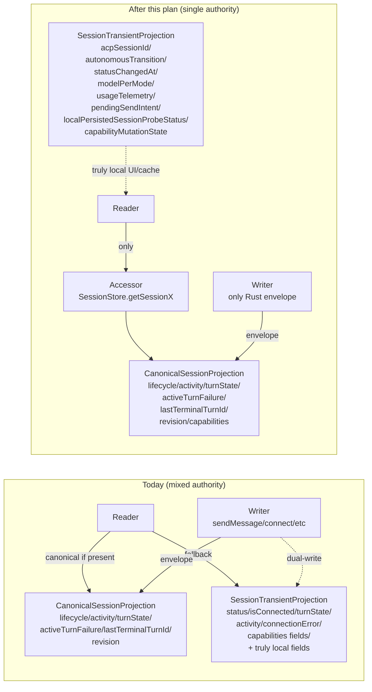

# refactor: Pure GOD canonical projection widening and hot-state retirement

## Overview

The canonical `SessionStateGraph` is already authoritative on the Rust side and flows to desktop via `LiveSessionStateEnvelopeRequest`. The TypeScript-side projection (`CanonicalSessionProjection`) is too narrow: it carries `lifecycle`, `activity`, `turnState`, `activeTurnFailure`, `lastTerminalTurnId`, `revision` — but **not** `capabilities`. As a result, every reader that needs `currentModel`, `currentMode`, `availableCommands`, `autonomousEnabled`, `configOptions`, `availableModels`, or `availableModes` has to fall back to `SessionTransientProjection` (hot state). That fallback forces every writer to keep dual-writing those fields to hot state, which keeps hot state alive as a parallel lifecycle authority.

This refactor closes the loop:

1. First fix the live envelope performance path so hot tool updates emit bounded canonical deltas instead of full snapshots.
2. Widen `CanonicalSessionProjection` to include `capabilities`.
3. Drop every canonical-overlapping field from `SessionTransientProjection`.
4. Migrate every reader to canonical-only accessors on `SessionStore` (no fallback).
5. Delete every duplicate hot-state write in messaging, connection, and store services.

After this work, hot state will retain only genuinely transient/local fields: `acpSessionId`, `autonomousTransition`, `statusChangedAt`, `modelPerMode`, `usageTelemetry`, `pendingSendIntent`, `localPersistedSessionProbeStatus`, and `capabilityMutationState`. Lifecycle, activity, capabilities, turn state, errors — all sole-source canonical.

User-observable outcome: zero behavior change **after** the hard gates clear: Unit 0 must prove bounded deltas still update canonical operation/activity/turn-state projection fields, Unit 0.5 must prove mode/model/config/autonomous capability changes emit canonical envelopes, and Unit 6 must prove the send affordance stays immediate via `pendingSendIntent`. The win is structural: a single source of truth for session-shaped state, eliminating the entire class of "stale hot state vs canonical projection" race bugs and removing the temptation for new dual-system code.

## Problem Frame

The final GOD architecture (origin: `docs/brainstorms/2026-04-25-final-god-architecture-requirements.md`) requires one product-state authority path. R13 explicitly requires that "`SessionHotState` and equivalent frontend-local lifecycle authorities must be removed from lifecycle truth and CTA behavior." R13a explicitly requires that "Fields currently housed near hot-state that are real graph-owned projections, such as capabilities, config options, available commands, autonomous state, telemetry, and budget state, must move to explicit canonical capability/config/activity/telemetry selectors rather than disappearing or remaining in hot-state as hidden authority."

Round 4 of the GOD migration eliminated the raw `acp-session-update` lane as an authority, removed client-side canonical synthesis, and migrated agent-panel readers to canonical-first. Round 5's audit (this session, prior to compaction) confirmed:

- The `acp-session-update` lane is fully diagnostic. ✅
- `@acepe/ui` package has zero Tauri/store coupling. ✅
- Provider-branching in TS is limited to one error-copy site. (Acceptable budget.)
- **Hot state still carries every canonical-overlapping field** because canonical projection is too narrow to replace it. ❌

Concretely, current code has 17+ `canonical != null ? canonical.X : hotState.X` dual-read sites and 30+ `updateHotState({...})` dual-write sites for fields that R13/R13a forbid.

This plan completes the GOD migration by widening canonical, deleting the dual reads, deleting the dual writes, and shrinking the hot-state type.

## Why Now

This structural work is worth doing before more user-facing agent features because hot state currently lets product code bypass the canonical graph whenever the graph is slow, incomplete, or inconvenient. That hides performance bugs (for example, hot tool events still emitting full snapshots), keeps session behavior split across two authorities, and makes every future feature choose between correctness and responsiveness.

The current cost is not just theoretical: long tool-heavy turns can repeatedly clone/serialize/replace the full transcript via Snapshot envelopes, and product code can continue to pass review while silently relying on stale hot-state capability or lifecycle values. This blocks the next layer of Acepe features that depend on trustworthy long-running sessions: multi-agent supervision/comparison, checkpoint-based resume/review flows, and PR-ready session review surfaces. Finishing this slice makes those features safer to build on because canonical envelopes become both the only authority and a fast enough authority for live UI.

The highest-priority blocked behavior is reliable long-session supervision: users need to trust that session cards, composer actionability, model/mode affordances, tool activity, and review surfaces all describe the same Rust-owned session state. Building more UI over today's dual authority would either duplicate the migration work inside each new feature or knowingly ship surfaces that can disagree during long-running turns. That is the opportunity cost this plan accepts: defer additional user-facing session features until the shared authority layer is clean.

## Requirements Trace

- **R1** (single product-state authority path): every reader of session-shaped state goes through canonical; no parallel TS authority remains.
- **R3** (legacy compatibility paths must be deleted, not retained "just in case"): the dual-read fallback pattern is exactly the legacy compatibility shape this rule names.
- **R4a** (provider adapters may not publish canonical lifecycle conclusions): deleting client-side dual writes preserves the boundary that only supervisor/graph reducers produce canonical lifecycle state.
- **R12** (desktop lifecycle/actionability/capability/activity selectors only): desktop lifecycle, actionability, model/mode availability, send enablement, retry/resume/archive affordances, compact status copy, and recovery UI derive from canonical lifecycle/actionability/capability/activity selectors only.
- **R13** (`SessionHotState` removed from lifecycle truth and CTA behavior): drop `status`, `isConnected`, `turnState`, `activity`, `connectionError`, `activeTurnFailure`, `lastTerminalTurnId` from `SessionTransientProjection`.
- **R13a** (hot-state-shaped graph projections must move to canonical selectors): drop `currentModel`, `currentMode`, `availableCommands`, `availableModels`, `availableModes`, `autonomousEnabled`, `configOptions`, `providerMetadata`, `modelsDisplay` from hot state; move them to canonical projection's `capabilities`. Exception: `usageTelemetry` remains a local aggregate mirror for keystroke-frequency composer reads (see Key Technical Decisions); it is not lifecycle or capability truth.
- **R23** (desktop stores must be consumers and projectors of canonical state, not semantic repair owners): no client-side optimistic writes to status/turnState during send.
- **R24** (presentation models derived from canonical selectors only): every UI presentational layer reads canonical via `SessionStore` accessors.

## Scope Boundaries

- This plan first fixes Rust live envelope routing for hot tool updates, then widens the TS-side `CanonicalSessionProjection`, migrates readers, deletes dual writes, and shrinks `SessionTransientProjection`. Rust remains the authority, but the current Rust envelope choice for `ToolCall` / `ToolCallUpdate` is not yet acceptable because it emits full snapshots for hot events.
- This plan changes the Delta payload shape in a backward-compatible way by adding canonical session projection fields (`activity`, `turnState`, `activeTurnFailure`, `lastTerminalTurnId`) to bounded deltas. `SessionGraphCapabilities` is already exported in `acp-types.ts`; the generated TS types must be refreshed if the Rust/Specta type export changes.
- This plan does **not** change UI/UX. All migrated readers must produce identical user-observable behavior.
- This plan does **not** introduce new presentational components in `@acepe/ui`. The DTO boundary is already clean.
- This plan does **not** address the provider-branching error-copy site in `open-persisted-session.ts` (low-priority follow-up).
- This plan introduces a narrow `pendingSendIntent` local field. It is not lifecycle truth; it only records "the user clicked Send and desktop is waiting for canonical acceptance/error" so Send disables immediately without writing `status`, `turnState`, or `isConnected`.
- This plan introduces a narrow `localPersistedSessionProbeStatus` local field for one pre-canonical persisted-session reattach gate. It is a typed enum (`"none" | "permanent-reattach-failure"`), never a provider error string, and must be written only by the local-created reattach failure path in `open-persisted-session.ts`.
- This plan introduces a narrow `capabilityMutationState` local field for mode/model mutation UI progress (`pendingMutationId`, `previewState`). It is not capability truth and may not contain model/mode/command/config/provider data.
- This plan executes on the current `main` checkout. No worktree split required.
- This plan does **not** delete the `usageTelemetry` hot-state field. It remains as a local snapshot mirror of the Telemetry envelope (kept for performance — telemetry is read on every keystroke in the composer footer).

## Context & Research

### Relevant Code and Patterns

**TS canonical projection and store:**
- `packages/desktop/src/lib/acp/store/canonical-session-projection.ts` — current narrow projection type.
- `packages/desktop/src/lib/acp/store/session-store.svelte.ts` — owns `canonicalProjections: SvelteMap<sessionId, CanonicalSessionProjection>`, has `getCanonicalSessionProjection`, `getSessionCanSend`, `getSessionLifecycleStatus`. New accessors land here.
- `packages/desktop/src/lib/acp/session-state/session-state-command-router.ts` — routes envelope payload to abstract commands (`applyLifecycle`, `applyGraphPatches`, `applyCapabilities`, `applyTelemetry`, `applyPlan`). Snapshot materialization enters through `session-store.svelte.ts` `applySessionStateGraph`.
- `packages/desktop/src/lib/acp/store/types.ts` — `SessionTransientProjection` and `DEFAULT_TRANSIENT_PROJECTION`. Target of field deletion.
- `packages/desktop/src/lib/acp/store/session-transient-projection-store.svelte.ts` — hot-state store impl; `getHotState`, `updateHotState`, `removeHotState`, `initializeHotState`.
- `packages/desktop/src/lib/acp/store/session-capabilities-store.svelte.ts` — current direct-write capability store; must be deleted as a state store.
- `packages/desktop/src/lib/acp/store/services/interfaces/capabilities-manager.ts` — authority-shaped capability manager interface; must be removed so connection services cannot write capability truth independently.
- `packages/desktop/src/lib/services/acp-types.ts` — auto-generated. Already exports `SessionGraphCapabilities`. No regen needed.

**TS readers (full inventory of canonical-overlap reads outside agent-panel):**
- `packages/desktop/src/lib/acp/store/live-session-work.ts` — 17 hot-state accesses in fallback branches.
- `packages/desktop/src/lib/acp/store/urgency-tabs-store.svelte.ts` — 5 reads.
- `packages/desktop/src/lib/acp/store/queue/utils.ts` — 4 reads.
- `packages/desktop/src/lib/acp/store/tab-bar-utils.ts` — 1 read (`currentModeId`).
- `packages/desktop/src/lib/acp/store/composer-machine-service.svelte.ts` — 2 reads (`autonomousEnabled`).
- `packages/desktop/src/lib/components/ui/session-item/session-item.svelte` — 1 read (`connectionError`).
- `packages/desktop/src/lib/components/main-app-view/components/content/kanban-view.svelte` — 1 read (`autonomousEnabled`).
- `packages/desktop/src/lib/components/main-app-view/logic/open-persisted-session.ts` — 2 reads (`status`, `connectionError`) — this case stays on hot state because it's a pre-canonical persisted-session probe, not live session UI. Will be specifically narrowed in Unit 7.
- `packages/desktop/src/lib/acp/components/tool-calls/permission-bar.svelte` — 1 read (`turnState`).
- `packages/desktop/src/lib/acp/store/session-store.svelte.ts` — internal reads at L513-514, L1194, L2474.
- `packages/desktop/src/lib/acp/store/services/session-connection-manager.ts` — ~10 reads (`isConnected`, `currentMode`, `autonomousEnabled`) that must migrate alongside Unit 7 write deletion.
- `packages/desktop/src/lib/acp/components/agent-input/agent-input-ui.svelte` and `packages/desktop/src/lib/acp/components/model-selector.metrics-chip.svelte` — capability reads through `sessionStore.getCapabilities()`.
- `packages/desktop/src/lib/acp/components/agent-input/logic/capability-source.ts` and `toolbar-loading.ts` — `modelsDisplay` / provider metadata projection helpers fed by live capabilities; migrate through canonical-derived capability projection helpers in Unit 1b.

**TS dual-writers (full inventory):**
- `packages/desktop/src/lib/acp/store/services/session-messaging-service.ts` — 11 `updateHotState` sites (sendMessage, sendPendingCreationMessage, retry paths, error handling).
- `packages/desktop/src/lib/acp/store/services/session-connection-manager.ts` — 8 sites (connect, disconnect, reconnect, mode/model setters).
- `packages/desktop/src/lib/acp/store/session-store.svelte.ts` — ~10 sites in lifecycle handlers.
- `packages/desktop/src/lib/acp/store/session-capabilities-store.svelte.ts` / `ICapabilitiesManager` — direct capability writes (`updateCapabilities`, `setCapabilities`, `removeCapabilities`) that become illegal unless driven exclusively by canonical projection updates.

**Envelope routing (no change but reference for understanding):**
- `packages/desktop/src-tauri/src/acp/session_state_engine/runtime_registry.rs:158-228` `build_live_session_state_envelope` dispatches Lifecycle/Capabilities/Snapshot/Delta/Telemetry/Plan envelopes carrying full `SessionGraphCapabilities`.
- `packages/desktop/src-tauri/src/acp/session_state_engine/runtime_registry.rs:528-540` currently classifies `ToolCall` and `ToolCallUpdate` as snapshot-triggering updates. That means hot tool events clone/serialize/replace full transcript and operation history in long sessions.
- `packages/desktop/src-tauri/src/acp/session_state_engine/protocol.rs:27-40` already supports bounded `SessionStatePayload::Delta` with `operation_patches` and `interaction_patches`.
- `packages/desktop/src-tauri/src/acp/session_state_engine/reducer.rs:42-64` already applies `operation_patches` and `interaction_patches` incrementally and recomputes activity.
- `packages/desktop/src-tauri/src/acp/projections/mod.rs:553-563` exposes `operation_for_tool_call(session_id, tool_call_id)`, which can be used to retrieve the patched operation after `ProjectionRegistry::apply_session_update` has applied the live tool event.
- `packages/desktop/src-tauri/src/acp/session_state_engine/protocol.rs:42-70` — `SessionStatePayload` enum; no change.

### Institutional Learnings

- `docs/solutions/architectural/final-god-architecture-2026-04-25.md` — documents that `SessionHotState` is compatibility/config/telemetry projection, not lifecycle truth. This plan operationalizes that classification.
- `docs/solutions/architectural/provider-owned-session-identity-2026-04-27.md` — frontend materialization happens from canonical graph snapshots after provider identity is proven. Reinforces canonical-only authority.
- `docs/solutions/architectural/graph-backed-session-activity-authority-2026-04-23.md` — planning/tool/activity copy must flow from graph-backed activity, not surface-local reconstruction. Same principle, different field.
- `docs/solutions/logic-errors/terminal-state-guard-missing-blocked-2026-04-25.md` — raw/compatibility lanes may not regress canonical settled state. The dual-write pattern this plan deletes is exactly that anti-pattern.

### External References

None. Local architecture docs and current runtime behavior are the governing source.

## Key Technical Decisions

- **Decision: widen `CanonicalSessionProjection` to carry `capabilities: SessionGraphCapabilities`.** The Rust envelope already carries it; TS just needs to retain it on the projection. This is a type change plus the six projection writers that can set or carry canonical projection state: `applySessionStateGraph` (Snapshot), `applyCapabilities`, `applyLifecycle`, `applyTelemetry`, `applyPlan`, and `applyGraphPatches`.
- **Decision: bound hot live updates before deleting hot-state writes.** `ToolCall` and `ToolCallUpdate` are high-frequency events. They must emit `SessionStatePayload::Delta` with a small `operation_patches` vector (and no full transcript replacement) after projection state has been updated. Full snapshots remain reserved for open/reconnect/frontier repair and explicit recovery cases such as connection failure.
- **Decision: when canonical is `null`, return `null`/empty consistently from accessors.** No "fallback to hot state." A `null` return means "the session does not yet have a canonical projection," and every caller must handle that case explicitly. For `acp_new_session`, this is usually the short window between acceptance and Rust's first lifecycle envelope. For `acp_resume_session`/persisted reopen, the null window can last through graph replay; migrated surfaces must use existing loading/skeleton/disabled affordances rather than stale hot-state values.
- **Decision: preserve `usageTelemetry` in hot state.** Composer footer reads telemetry on every keystroke. Avoid the round-trip churn through a canonical accessor for a field that is per-keystroke read and written at low frequency. The current `UsageTelemetryData` shape is aggregate-only (`costUsd`, token counts, `sourceModelId`, timestamp, context-window size); it contains no prompt text or keystroke content. Document this exception in the type.
- **Decision: preserve `acpSessionId`, `autonomousTransition`, `statusChangedAt`, `modelPerMode`, `pendingSendIntent`, `localPersistedSessionProbeStatus`, and `capabilityMutationState` in hot state.** These are genuinely local: `acpSessionId` is the provider-issued session id mapping; `autonomousTransition` is UI animation state; `statusChangedAt` is a local timestamp for stable-status display; `modelPerMode` is a per-session per-mode model preference cache; `pendingSendIntent` is a click guard cleared by canonical acceptance/error and never asserts lifecycle truth; `localPersistedSessionProbeStatus` is a typed pre-canonical persisted-session reattach gate; `capabilityMutationState` is local mode/model mutation UI progress.
- **Decision: route capability fields through canonical only.** `currentModel`, `currentMode`, `availableModels`, `availableModes`, `availableCommands`, `autonomousEnabled`, `configOptions`, `providerMetadata`, `modelsDisplay` — all sole-source canonical via `capabilities` accessor. Unit 0.5 owns the Rust-side provider metadata/config-option security gate; Unit 1 adds TS-side accessor documentation that references those constraints.
- **Decision: keep capability mutation UI state separate from capability truth.** `pendingMutationId` and `previewState` move out of `SessionCapabilitiesStore` into a small `capabilityMutationState` local UI field whose only purpose is showing mode/model mutation progress. It may be written from Capabilities envelopes, but it cannot contain `currentModel`, `currentMode`, available models/modes, commands, config options, or provider metadata.
- **Decision: replace optimistic lifecycle writes with `pendingSendIntent`.** `sendMessage` may set `pendingSendIntent` synchronously to disable Send while waiting for Rust's canonical acceptance or error envelope. It must not write `status: "streaming"`, `turnState: "running"`, `isConnected`, or any other semantic lifecycle fact. Clear it on any canonical lifecycle update that resolves the attempt (`actionability.canSend === true`, acceptance, final failure, Detached, Archived), session deletion, user-initiated disconnect, send promise rejection, or the existing send/lifecycle watchdog timing out.
- **Decision: retire hot-turn-state adapters.** `mapHotTurnStateToGraphTurnState` is deleted, and `mapCanonicalTurnStateToHotTurnState` is transitional only until Unit 5 migrates `permission-bar.svelte` to canonical `SessionTurnState`. After Unit 5, no permission-bar call site should require a hot-shaped turn-state adapter.
- **Decision: persist `lifecycle` and `capabilities` shape on first envelope, never null.** When Rust emits any envelope with a defined `SessionGraphCapabilities` (Snapshot or Capabilities envelope), the TS-side canonical projection carries forward whatever was last seen. Subsequent narrow envelopes (Lifecycle-only, Telemetry, Plan) preserve previously-seen capabilities by reading `previousProjection.capabilities` — same pattern already used for `turnState`/`activeTurnFailure` carry-forward in `applyLifecycle`.
- **Decision: delete `SessionCapabilitiesStore` as a state store.** It may not remain a second capability truth source. Any pure projection helpers may move to stateless functions, but by Unit 8 `sessionStore.getCapabilities()`, `ICapabilitiesManager`, and direct `capabilitiesManager.updateCapabilities`/`setCapabilities` writes are gone. If `pendingMutationId` or `previewState` are still needed for UI affordances, they move to separately named local mutation UI state that cannot contain capability truth.

## Open Questions

### Resolved During Planning

- **Q: Should optimistic UI on send remain?** A: Keep only a GOD-compatible local intent guard. Add `pendingSendIntent` to disable Send synchronously after click, then clear it on canonical `Activating` or error. Do not keep optimistic lifecycle writes.
- **Q: Where does `usageTelemetry` belong?** A: Stays in hot state for performance. Composer reads on every keystroke; canonical accessor round-trip would add unnecessary indirection. Document the exception.
- **Q: What about `availableModels` and `availableModes` field absence?** A: `SessionGraphCapabilities.models` and `.modes` are already optional in the wire format. Accessor returns empty array when null. Same shape current `mergeProjectedCapabilities` produces.
- **Q: Open-persisted-session probe (`hotState.status === "error"`)?** A: That code runs against local-created persisted sessions that may not yet have any envelope. Keep the concept local, but narrow it to typed `localPersistedSessionProbeStatus` (`"none" | "permanent-reattach-failure"`) and forbid provider error strings or lifecycle semantics.

### Deferred to Implementation

- Minor accessor helper names may change during implementation, but the plan-owned surface is canonical-only access through `SessionStore` (`getSessionTurnState`, `getSessionConnectionError`, `getSessionActiveTurnFailure`, `getSessionLastTerminalTurnId`, `getSessionAutonomousEnabled`, `getSessionCurrentModeId`, `getSessionCurrentModelId`, `getSessionAvailableCommands`, `getSessionConfigOptions`, `getSessionAvailableModels`, `getSessionAvailableModes`, `getSessionCapabilities`). Implementers may add aggregate helpers only when they delegate to the same canonical projection.
- Whether `live-session-work.ts` `LiveSessionWorkInput.hotState` field shrinks to zero or just to local residual state. It may not keep `currentMode`; current mode comes from canonical capabilities.
- Specific test mocks that need to update to populate `capabilities` on canonical projections instead of hot state. Surface count is large; enumerate during Unit 8.

## High-Level Technical Design

> *This illustrates the intended approach and is directional guidance for review, not implementation specification. The implementing agent should treat it as context, not code to reproduce.*



The shape change: **Reader → fallback chain (Canonical OR Hot)** becomes **Reader → Accessor → Canonical only.** Hot state shrinks to a small UI/cache surface that no reader confuses with lifecycle.

A representative accessor pseudo-shape (directional, not implementation):

```ts
// SessionStore (illustrative)
getSessionTurnState(id): SessionTurnState | null
  -> canonicalProjections.get(id)?.turnState ?? null

getSessionAutonomousEnabled(id): boolean
  -> canonicalProjections.get(id)?.capabilities.autonomousEnabled ?? false

getSessionCurrentModeId(id): string | null
  -> canonicalProjections.get(id)?.capabilities.modes?.currentModeId ?? null

getSessionAvailableCommands(id): readonly AvailableCommand[]
  -> canonicalProjections.get(id)?.capabilities.availableCommands ?? []
```

Reader migrations follow a uniform pattern: replace `canonical != null ? canonical.X : hot.X` with `store.getSessionX(id)` (or equivalent accessor).

## Implementation Units

- [x] **Unit 0: Emit bounded deltas for hot live tool updates**

**Goal:** Stop `ToolCall` and `ToolCallUpdate` from using full snapshot envelopes. Emit bounded `SessionStatePayload::Delta` envelopes with `operation_patches` for live tool updates so canonical UI updates stay fast enough to replace hot-state writes.

**Requirements:** R1, R3, R4a, R12, R23, R24

**Dependencies:** None. This is a prerequisite for deleting optimistic/hot-state lifecycle writes.

**Files:**
- Modify: `packages/desktop/src-tauri/src/acp/session_state_engine/runtime_registry.rs`
- Modify: `packages/desktop/src-tauri/src/acp/session_state_engine/protocol.rs` (Delta carries canonical session projection fields)
- Modify if needed: `packages/desktop/src-tauri/src/acp/session_state_engine/bridge.rs`
- Modify if needed: `packages/desktop/src-tauri/src/acp/projections/mod.rs`
- Modify: `packages/desktop/src/lib/acp/session-state/session-state-command-router.ts`
- Modify: `packages/desktop/src/lib/acp/store/session-store.svelte.ts` (`applyGraphPatches` updates canonical session projection fields)
- Test: `packages/desktop/src-tauri/src/acp/session_state_engine/runtime_registry.rs` (unit tests in existing test module)
- Test: `packages/desktop/src-tauri/src/acp/session_state_engine/reducer.rs` (extend delta patch coverage if needed)

**Approach:**
- Remove `SessionUpdate::ToolCall { .. }` and `SessionUpdate::ToolCallUpdate { .. }` from `should_emit_session_state_snapshot`.
- Add a bounded operation-delta path before the generic transcript-delta branch in `build_live_session_state_envelope`.
- For `ToolCall`, after projection registry application, retrieve the operation via `projection_registry.operation_for_tool_call(session_id, tool_call.id)` and emit `build_delta_envelope(..., transcript_operations, vec![operation], Vec::new(), changed_fields)`.
- For `ToolCallUpdate`, retrieve the operation via `projection_registry.operation_for_tool_call(session_id, update.tool_call_id)` and emit the same bounded delta shape.
- Add canonical `activity`, `turnState`, `activeTurnFailure`, and `lastTerminalTurnId` to `SessionStateDelta` and populate them from the Rust projection after the update has been applied. `applyGraphPatches` updates those fields on `canonicalProjections` from the Delta while preserving lifecycle and capabilities.
- Preserve transcript delta operations only after running the same frontier decision used by the generic transcript-delta branch. If frontier repair is required, emit Snapshot instead of bypassing the guard.
- Keep full snapshot envelopes only for open/reconnect/frontier repair and explicit recovery cases such as connection failure. Audit `PermissionRequest`, `QuestionRequest`, `TurnComplete`, and `TurnError` in `should_emit_session_state_snapshot`, but keep that audit documentation-only in Unit 0; migrating those events to bounded patches is a separate unit unless one of them is required to make ToolCall/ToolCallUpdate correct.

**Patterns to follow:**
- Existing `build_delta_envelope` in `packages/desktop/src-tauri/src/acp/session_state_engine/bridge.rs`.
- Existing reducer `operation_patches` upsert semantics in `packages/desktop/src-tauri/src/acp/session_state_engine/reducer.rs`.
- Existing projection lookup `operation_for_tool_call` in `packages/desktop/src-tauri/src/acp/projections/mod.rs`.

**Test scenarios:**
- Happy path: `ToolCall` produces a Delta payload with exactly one `operation_patches` entry and no Snapshot payload.
- Happy path: `ToolCallUpdate` produces a Delta payload with exactly one `operation_patches` entry and no Snapshot payload.
- Happy path: ToolCall/ToolCallUpdate Delta includes updated canonical activity and turn-state/failure fields, and TS `applyGraphPatches` updates `CanonicalSessionProjection.activity.activeOperationCount`/`dominantOperationId` and turn-state fields without a Snapshot.
- Edge case: when frontier decision requires repair, the same tool event may still produce a Snapshot; this is the only accepted full-history path for hot tool events.
- Edge case: missing operation projection for a tool update does not silently emit an empty success-shaped Delta; it falls back to an explicit repair Snapshot or logs/returns according to existing runtime error patterns.
- Integration: applying the bounded Delta through `SessionStateReducer` updates the target operation and canonical session projection fields without replacing transcript history.
- Performance guard: a long-session synthetic test with many transcript entries/tool operations asserts the emitted payload for a tool update contains only the patched operation, not the full transcript or full operations array.

**Verification:** Hot tool updates no longer clone/serialize/replace full session history. Canonical operation, activity, and turn-state UI updates remain correct and fast before any hot-state write deletion begins.

---

- [x] **Unit 0.5: Audit and repair canonical capability emits**

**Goal:** Prove that mode/model/config/autonomous capability changes reach TypeScript through canonical envelopes before TS-side capability writes are removed.

**Requirements:** R1, R12, R13a, R23

**Dependencies:** None. Can run in parallel with Unit 0; Unit 1 depends on both.

**Files:**
- Modify if needed: `packages/desktop/src-tauri/src/acp/session_state_engine/runtime_registry.rs` (`should_emit_session_state_capabilities`)
- Modify if needed: Rust mode/model/config/autonomous mutation command paths in `packages/desktop/src-tauri/src/acp/`
- Test: Rust capability-envelope tests around `setSessionMode` / `setSessionModel` / config-option updates / `acp_set_session_autonomous`

**Approach:**
- Treat this as a hard gate, not an optional audit. Before Unit 1 starts, prove `setSessionMode`, `setSessionModel`, config-option changes, and autonomous toggles produce either `SessionStatePayload::Capabilities` or a Snapshot carrying updated `SessionGraphCapabilities`.
- Current code already matches `AvailableCommandsUpdate`, `CurrentModeUpdate`, and `ConfigOptionUpdate` in `should_emit_session_state_capabilities`; explicitly check model-change coverage. If model changes only arrive via `ConnectionComplete` Snapshot, document that path and add a regression test. If any in-session model-change path lacks an envelope, add the Rust emit now.
- Autonomous toggle coverage is mandatory: `acp_set_session_autonomous` must emit a canonical capability change after the policy update succeeds. If no `SessionUpdate::AutonomousEnabledUpdate` (or equivalent) exists, add one and route it through the reducer/runtime registry so `autonomousEnabled` updates canonical before Unit 7 deletes TS hot-state writes.
- Unit 0.5 is responsible for these named paths only: set-session-mode, set-session-model, config-option updates, and autonomous toggle. Any additional mutation paths discovered during the audit are documented as follow-up unless they are required for one of these four paths.
- Audit `providerMetadata` fields at the Rust struct/type boundary. Add code comments asserting they must not contain credentials, provider-issued tokens, bearer-like auth material, or provider error strings.
- For `configOptions`, comments are not enough: define the runtime boundary validation/redaction rule that Unit 1 applies before writing canonical projection data. Provider-supplied `current_value` / option values must be constrained to safe scalar/enum shapes and credential-shaped strings must be nulled/redacted with an explicit warning.
- Go/no-go: if any of the four named mutation paths lacks a proven canonical Capabilities/Snapshot envelope in tests, Units 1–8 must not proceed until the gap is closed.

**Test scenarios:**
- Happy path: mode change emits canonical capabilities with updated current mode.
- Happy path: model change emits canonical capabilities or Snapshot with updated current model id.
- Happy path: config option change emits canonical capabilities with updated config options.
- Happy path: autonomous toggle emits canonical capabilities with updated `autonomousEnabled`.
- Security: provider metadata contains only display metadata; config option values are validated/redacted before entering canonical projection state.

**Verification:** TS-side capability writes can be deleted later without losing model/mode/config/autonomous UI updates.

---

- [x] **Unit 1: Widen `CanonicalSessionProjection` and add canonical-only accessors**

**Goal:** Extend the canonical projection type to carry `capabilities`, populate it in every applyXxx handler, and expose canonical-only accessors on `SessionStore` for every canonical-overlap field.

**Requirements:** R1, R13, R13a, R24

**Dependencies:** Units 0 and 0.5.

**Files:**
- Modify: `packages/desktop/src/lib/acp/store/canonical-session-projection.ts`
- Modify: `packages/desktop/src/lib/acp/store/session-store.svelte.ts` (`applySessionStateGraph`, `applyLifecycle`, `applyCapabilities`, `applyGraphPatches`, `applyTelemetry`, `applyPlan`; new accessors; `mergeProjectedCapabilities` carry-forward)
- Modify: `packages/desktop/src/lib/acp/store/types.ts` (add local residual fields before reader units need them)
- Modify: `packages/desktop/src/lib/acp/store/session-capabilities-store.svelte.ts` only as a deprecated bridge if needed during Units 1–7; do not delete until Unit 8 after all callers are migrated
- Create or modify: a stateless capability projection helper only if existing mapping logic is still needed by canonical accessors
- Modify: `packages/desktop/src/lib/acp/store/services/interfaces/capabilities-manager.ts` only as a deprecated bridge if needed during Units 1–7; do not delete until Unit 8
- Modify: `packages/desktop/src/lib/acp/components/agent-input/agent-input-ui.svelte` (migrate `sessionStore.getCapabilities()` reads)
- Modify: `packages/desktop/src/lib/acp/components/agent-input/logic/capability-source.ts` (adapt live capability input to canonical projection/helper shape)
- Modify: `packages/desktop/src/lib/acp/components/agent-input/logic/toolbar-loading.ts` if selector-loading inputs change
- Modify: `packages/desktop/src/lib/acp/components/model-selector.metrics-chip.svelte` (migrate `sessionStore.getCapabilities()` reads)
- Test: `packages/desktop/src/lib/acp/store/__tests__/session-store-projection-state.vitest.ts` (extend existing canonical projection tests)
- Test: `packages/desktop/src/lib/acp/store/__tests__/canonical-projection-accessors.test.ts` (new file)
- Test: `packages/desktop/src/lib/acp/store/__tests__/session-store-capabilities-revision.vitest.ts`
- Keep: `packages/desktop/src/lib/acp/store/__tests__/session-capabilities-store.vitest.ts` until Unit 8 deletes the deprecated bridge

**Approach:**
- Land this unit in two checkpoints: Unit 1a widens projection/handlers/accessors/local residual fields with no caller migrations; Unit 1b migrates the agent-input/model-selector consumers to the new canonical-derived capability view. Both checkpoints must pass `bun run check`.
- Add `capabilities: SessionGraphCapabilities` to `CanonicalSessionProjection`.
- Update `applySessionStateGraph` (the actual Snapshot path) to populate `capabilities` from `graph.capabilities` in the `canonicalProjections.set(...)` call.
- Update `replaceSessionOpenSnapshot` to populate `capabilities: graph.capabilities` when it writes `canonicalProjections`; cold-loaded persisted sessions must not see empty capabilities while waiting for the first live envelope.
- Update `applyCapabilities` to replace capabilities from the envelope and carry forward lifecycle/activity/turn-state fields from the previous projection.
- Update `applyCapabilities` freshness checks to read the previous revision from `canonicalProjections.get(sessionId)?.revision ?? null`, not from `SessionCapabilitiesStore`.
- Apply the Unit 0.5 config-options validation/redaction rule before writing capabilities into `canonicalProjections` in Snapshot, cold-open, and Capabilities paths.
- Update `applyLifecycle`, `applyTelemetry`, `applyPlan`, and `applyGraphPatches` to carry forward `previousProjection?.capabilities ?? emptyCapabilities()` whenever they write a canonical projection.
- New accessors on `SessionStore`: `getSessionTurnState`, `getSessionConnectionError`, `getSessionActiveTurnFailure`, `getSessionLastTerminalTurnId`, `getSessionAutonomousEnabled`, `getSessionCurrentModeId`, `getSessionCurrentModelId`, `getSessionAvailableCommands`, `getSessionConfigOptions`, `getSessionAvailableModels`, `getSessionAvailableModes`, `getSessionCapabilities`.
- Document on each accessor that `null`/empty means "no canonical projection yet" and that callers must default to a benign neutral state.
- Reroute `mergeProjectedCapabilities` now, not in Unit 8: when an incoming capabilities envelope omits models or modes, carry forward from `previousProjection.capabilities` by projecting the previous canonical capabilities shape, not from `SessionCapabilitiesStore` or `hotState.currentModel/currentMode`.
- Keep `SessionCapabilitiesStore`/`ICapabilitiesManager` only as deprecated bridge surfaces until their callers are removed in Units 6–7. No new reader may use them; no new write path may be added. Final deletion happens in Unit 8.
- Add local residual fields to `SessionTransientProjection` and `DEFAULT_TRANSIENT_PROJECTION` now so later reader units can reference them safely: `pendingSendIntent` (false/null pending object), `localPersistedSessionProbeStatus: "none"`, and `capabilityMutationState` (`pendingMutationId: null`, `previewState: null` or equivalent neutral state). These fields are local only and cannot contain lifecycle/capability truth.
- Decide the public accessor shape here: consumers that currently expect flat `SessionCapabilities` should receive a canonical-derived projected view (via `getSessionCapabilities` or a stateless helper) so `capability-source.ts`, `toolbar-loading.ts`, and `model-selector.metrics-chip.svelte` do not need to understand raw nested `SessionGraphCapabilities`.

**Patterns to follow:**
- Existing `getSessionCanSend(id)` and `getSessionLifecycleStatus(id)` shape in `session-store.svelte.ts:808-814`.
- Existing `applyLifecycle` carry-forward of `turnState`/`activeTurnFailure` pattern.

**Test scenarios:**
- Happy path: Snapshot envelope carrying capabilities populates `getSessionCapabilities` exactly.
- Happy path: subsequent Lifecycle envelope (no capabilities field) preserves capabilities from prior projection.
- Happy path: Capabilities envelope replaces capabilities; lifecycle/activity carry forward.
- Security: credential-shaped config option values are redacted/nulled before entering `canonicalProjections`.
- Happy path: cold-open `replaceSessionOpenSnapshot` writes canonical capabilities from the materialized graph.
- Happy path: `applyCapabilities` revision freshness is decided from canonical projection revision, not the deprecated bridge store.
- Happy path: new code stops using `sessionStore.getCapabilities()`; remaining legacy calls are marked bridge-only and removed in Unit 8.
- Happy path: model/mode changes emit canonical capabilities before the TS-side capability write paths are deleted.
- Happy path: omitted models/modes in a later capabilities envelope preserve previous canonical capabilities via `previousProjection.capabilities`, not hot state.
- Happy path: `capabilityMutationState` updates on Capabilities envelopes without carrying capability truth.
- Edge case: `getSessionTurnState` returns `null` when no canonical projection exists for the id.
- Edge case: `getSessionAutonomousEnabled` returns `false` when capabilities or autonomousEnabled is missing.
- Edge case: `getSessionAvailableCommands` returns empty array when capabilities or availableCommands is missing.
- Integration: applyLifecycle followed by applyCapabilities followed by applyLifecycle preserves the latest capabilities across the second lifecycle envelope.

**Verification:** New accessors return canonical-sourced values for live sessions; return null/empty when canonical projection absent. `bun run check` clean.

---

- [x] **Unit 2: Migrate `urgency-tabs-store.svelte.ts` to canonical-only**

**Goal:** Replace 5 dual-read sites with canonical accessors. No fallback to hot state.

**Requirements:** R12, R23, R24

**Dependencies:** Unit 1.

**Files:**
- Modify: `packages/desktop/src/lib/acp/store/urgency-tabs-store.svelte.ts`
- Test: `packages/desktop/src/lib/acp/store/__tests__/urgency-tabs-store.test.ts` (extend if exists, or add)

**Approach:**
- Replace `canonical != null ? canonical.lifecycle.errorMessage : hotState.connectionError` with `sessionStore.getSessionConnectionError(id)`.
- Same pattern for `activeTurnFailure`, `isConnecting` (derived from canonical lifecycle status).
- `statusChangedAt` continues to read from hot state — it's a truly-local field.
- Null-canonical contract: urgency tabs show no urgency signal and no failure badge/message when the canonical projection is absent; they never fall back to stale hot-state error copy.
- Null→Failed first-envelope transition is intentional: the failure badge/message appears when the first canonical Failed envelope arrives, not before.

**Patterns to follow:**
- Mirror agent-panel.svelte's canonical-first reads (Round 4 already-migrated reference).

**Test scenarios:**
- Happy path: failure message comes from canonical `lifecycle.errorMessage` for live sessions.
- Edge case: when canonical projection is absent, `failureMessage` is `null` (not hot state).
- Edge case: null→Failed first canonical envelope shows the canonical failure message in the same render cycle.
- Integration: switching from canonical-present to canonical-absent state (rare; e.g., session deletion) does not produce stale hot-state error message.

**Verification:** Urgency tabs render the same status/failure copy as before for all session lifecycle scenarios. `bun test urgency-tabs` clean.

---

- [x] **Unit 3: Migrate `queue/utils.ts` to canonical-only**

**Goal:** Replace 4 dual-read sites in `buildQueueSessionSnapshot` with canonical accessors. Drop `hotState` from the input shape if possible.

**Requirements:** R12, R23, R24

**Dependencies:** Unit 1.

**Files:**
- Modify: `packages/desktop/src/lib/acp/store/queue/utils.ts`
- Modify: `packages/desktop/src/lib/components/main-app-view/components/content/kanban-view.svelte` (caller may simplify input construction)
- Test: `packages/desktop/src/lib/acp/store/queue/__tests__/utils.test.ts` (extend)

**Approach:**
- Replace `canonical != null ? canonical.X : hotState.X` patterns with accessor calls.
- Audit whether the function still needs `hotState` parameter at all. If only `currentMode.id` survives, replace with `sessionStore.getSessionCurrentModeId(id)`.
- Null-canonical contract: queue snapshots use empty/safe defaults and disabled CTA state when canonical projection is absent.

**Test scenarios:**
- Happy path: queue snapshot reflects canonical lifecycle/capability state.
- Edge case: missing canonical projection produces empty/safe defaults (no fallback).
- Integration: kanban-view passes through queue snapshot to UI components without re-introducing hot-state fields.

**Verification:** Queue items render identical to current behavior. `bun test queue` clean.

---

- [x] **Unit 4: Migrate `live-session-work.ts` to canonical-only**

**Goal:** Restructure `LiveSessionWorkInput` to drop hot-state lifecycle dependencies. All 17 hot-state accesses removed.

**Requirements:** R1, R12, R23, R24

**Dependencies:** Units 1–3.

**Files:**
- Modify: `packages/desktop/src/lib/acp/store/live-session-work.ts`
- Modify: callers (`urgency-tabs-store.svelte.ts`, `kanban-view.svelte`, agent-panel files that already use canonical projection). Unit 4 changes these files only to update `LiveSessionWorkInput` call-site shape; Unit 2/3 reader migrations are prerequisites and must not be reverted.
- Test: `packages/desktop/src/lib/acp/store/__tests__/live-session-work.test.ts` (extensive test file; expect significant rewrite of mock setup)

**Approach:**
- Drop `status`, `connectionError`, `activeTurnFailure`, `activity`, `currentMode` from `LiveSessionWorkInput.hotState`. The input becomes `canonicalProjection` (now mandatory; non-null in practice; treat null as "no session").
- Keep the `runtimeState === null` guard in `normalizeLifecycle`, but remove every hot-state read inside it. That guard remains defensive for actor initialization/teardown; it derives from canonical lifecycle/activity when present and returns documented neutral defaults when the canonical projection is absent.
- Remove the `canonical == null && input.hotState.status === "streaming"` override in `liveActivityOverride`.
- `currentMode.id` reads migrate to canonical via `capabilities.modes.currentModeId`.
- Null-canonical contract: return the documented neutral "session not yet visible" state; do not inspect hot state for activity, errors, paused, or streaming status.
- Null→Failed first-envelope transition is intentional: live-session-work remains neutral while canonical is absent, then reflects Failed/error state as soon as the canonical envelope arrives.

**Patterns to follow:**
- Existing canonical-first branches in `normalizeLifecycle` (lines 49-75) become the only branches.

**Test scenarios:**
- Happy path: `deriveLiveSessionState` returns expected state for canonical projection in each lifecycle phase (Reserved/Activating/Ready/Reconnecting/Detached/Failed/Archived).
- Happy path: `deriveLiveCanonicalActivity` returns canonical activity for each `SessionGraphActivityKind`.
- Edge case: when `canonicalProjection` is null, function returns documented neutral defaults (and tests assert this — null projection = "session not yet visible").
- Edge case: null→Failed first canonical envelope transitions from neutral to canonical error state without consulting hot state.
- Edge case: canonical `activity.kind === "paused"` maps to the same paused presentation formerly produced by `hotState.status === "paused"`.
- Edge case: `runtimeState` is still consulted for transient streaming details (`showThinking`); confirm tests around this.
- Integration: pendingPlanApproval/permission/question still produce `waiting_for_user` activity override.
- Integration: error override fires from canonical signals only (no hot-state error path).

**Verification:** Existing live-session-work golden-snapshot tests pass after mock updates. UI rendering for active sessions identical. `bun test live-session-work` clean.

---

- [x] **Unit 5: Migrate `composer-machine-service.svelte.ts`, `tab-bar-utils.ts`, `session-item.svelte`, `permission-bar.svelte`, `kanban-view.svelte`**

**Goal:** Replace remaining canonical-overlap reads in these files with canonical accessors.

**Requirements:** R12, R13a, R23, R24

**Dependencies:** Units 3–4.

**Files:**
- Modify: `packages/desktop/src/lib/acp/store/composer-machine-service.svelte.ts` (`autonomousEnabled` read at L83, L116)
- Modify: `packages/desktop/src/lib/acp/store/tab-bar-utils.ts` (`currentMode.id` read at L268)
- Modify: `packages/desktop/src/lib/components/ui/session-item/session-item.svelte` (`connectionError` fallback at L369)
- Modify: `packages/desktop/src/lib/acp/components/tool-calls/permission-bar.svelte` (`turnState` read at L65)
- Modify: `packages/desktop/src/lib/components/main-app-view/components/content/kanban-view.svelte` (`autonomousEnabled` read at L316)
- Test: extend per-component test files where they exist; add new ones for tab-bar-utils if missing

**Approach:**
- Each file's pattern is the same: `hotState.X` → `sessionStore.getSessionX(id)`.
- Permission-bar's prop shape migrates to canonical `SessionTurnState`; remove the hot-shape adapter at this site rather than adding `getSessionTurnStateAsHotShape`.
- Composer-machine-service `committedAutonomousEnabled` keeps its discrete commit-on-transition semantics. Only the source changes: the commit transition reads `sessionStore.getSessionAutonomousEnabled(id)`. It is not a continuously derived value, so mid-turn canonical autonomous changes do not flicker the committed state until the next commit point.
- If canonical `autonomousEnabled` diverges from `committedAutonomousEnabled` mid-turn, render the toggle as pending-update/dimmed until the next commit point resolves the committed value. Do not silently show a confident stale toggle.
- Model selector displays the last canonical current model/mode while a mode/model mutation is pending, plus mutation progress from `capabilityMutationState`. While `pendingMutationId != null`, show the current canonical model name with a loading indicator and keep selector mutation controls non-interactive. On failed `previewState`, show the existing mutation failure affordance/copy; do not render a speculative new model name from `modelPerMode`.

**Null-canonical rendering contract:**

| Surface | When canonical projection is null |
|---------|-----------------------------------|
| `session-item.svelte` | Render neutral/loading copy; do not show stale error copy from hot state. |
| `permission-bar.svelte` | Hide the permission bar unless a concrete permission prop/request is present; do not infer turn state from hot state. |
| `kanban-view.svelte` | Render the card with action controls disabled and no autonomous-enabled assertion. |
| `tab-bar-utils.ts` | Return no mode badge/current mode id. |
| `composer-machine-service.svelte.ts` | Treat Send as disabled; `pendingSendIntent` may keep the local pending affordance visible, but it never authorizes a send without canonical actionability. |

**Patterns to follow:**
- Round 4 agent-panel.svelte canonical-first reads.

**Test scenarios:**
- Happy path: each component renders identical content for canonical-driven state.
- Edge case: each component handles null canonical projection (renders neutral/loading state, never a stale hot-state value).
- Composer state machine: autonomous toggle commit reads canonical value; existing composer transition tests still pass.
- Composer state machine: a mid-turn canonical autonomous-enabled change does not mutate `committedAutonomousEnabled` until the next explicit commit transition.
- Composer state machine: a mid-turn canonical autonomous-enabled divergence renders the pending-update affordance and resolves at the next commit point.
- Model selector: pending mode/model mutation does not render `modelPerMode` as canonical current-model truth.
- Model selector: pending mutation shows canonical current model plus loading state; failed mutation shows the failure affordance without changing current-model truth.

**Verification:** No visual regression in queue cells, tab bar, session items, permission bar, kanban cards. `bun test` clean.

---

- [x] **Unit 6: Delete hot-state writes in `session-messaging-service.ts`**

**Goal:** Remove all 11 `updateHotState` calls that write canonical-overlapping fields. Trust the Rust envelope as the sole writer.

**Requirements:** R1, R3, R4a, R23

**Dependencies:** Units 1–5 (readers must be migrated first to avoid stale-hot-state visual bugs during the transition window).

**Files:**
- Modify: `packages/desktop/src/lib/acp/store/services/session-messaging-service.ts`
- Modify: `packages/desktop/src/lib/acp/store/session-store.svelte.ts` or the canonical-envelope handler that clears local send intent
- Test: `packages/desktop/src/lib/acp/store/__tests__/session-messaging-service.test.ts` (or wherever messaging tests live)

**Approach:**
- Remove `updateHotState({ status, turnState, connectionError, activeTurnFailure, lastTerminalTurnId })` calls at L206, L234, L260, L281, L363, L492, L531, L546, L585, L610, L618.
- Any remaining `updateHotState` writes in this file may only target `acpSessionId`, `autonomousTransition`, `statusChangedAt`, `modelPerMode`, `usageTelemetry`, or `pendingSendIntent`. If a remaining call writes other fields, audit whether the field is canonical (then delete) or genuinely local (then keep with explicit doc comment).
- The "optimistic streaming UI" pattern (writing `status: "streaming"` immediately on send) is replaced by `pendingSendIntent`. `sendMessage` sets the intent synchronously before invoking Rust, and canonical resolution clears it.
- Clear `pendingSendIntent` on any canonical lifecycle update that resolves the pending send: `actionability.canSend === true`, `Activating`/`Streaming` acceptance, final failure, Detached, Archived, session deletion, user-initiated disconnect, send promise rejection, or the existing send/lifecycle watchdog timing out.
- Reconnect rule: Reconnecting clears the intent unless Rust explicitly carries the submitted turn forward and emits an `Activating`/`Streaming` or error envelope for the same attempt. This must be keyed by a local attempt id, not by lifecycle status alone.
- Before deleting the old optimistic lifecycle write, measure the send→canonical-Activating envelope path on the local test fixture. If the canonical transition remains visibly late even with immediate Send disablement from `pendingSendIntent`, pause before continuing to Unit 7.

**Execution note:** Add characterization coverage for current `sendMessage` behavior before deleting writes. The test should assert canonical-projection-driven UI state during a normal send/turn cycle, ensuring deletion of hot-state writes preserves user-visible behavior.

**Patterns to follow:**
- Round 4 cleanup of `failPendingCreationSession` in `session-store.svelte.ts` — same shape (delete the dual-write, trust the envelope).

**Test scenarios:**
- Happy path: `sendMessage` flow drives UI through Idle → Activating → Streaming → Idle states purely via canonical envelopes.
- Happy path: Send disables synchronously via `pendingSendIntent` before the canonical `Activating` envelope arrives, then clears when canonical acceptance/error arrives.
- Edge case: `sendMessage` with disconnected session returns canonical `canSend: false` error without writing hot state.
- Edge case: canonical Ready/Idle or `actionability.canSend === true` clears `pendingSendIntent` even if no explicit Activating envelope was observed.
- Edge case: disconnect/reconnect/archive/delete/watchdog timeout while `pendingSendIntent` is true clears the intent so Send cannot remain stuck disabled.
- Error path: turn error during streaming surfaces via canonical envelope; no client-side `updateHotState({ activeTurnFailure })` write.
- Integration: end-to-end test that asserts `getHotState(id).status` is undefined/loading throughout a send turn (because hot state no longer carries `status`).

**Verification:** Send/streaming/error UI behavior identical to current. `cargo test --lib` and `bun test` clean.

---

- [x] **Unit 7: Delete hot-state writes in `session-connection-manager.ts` (and audit `open-persisted-session.ts`)**

**Goal:** Remove all 8 `updateHotState` writes for canonical-overlapping fields. Narrow `open-persisted-session.ts` probe to non-lifecycle-authority shape.

**Requirements:** R1, R3, R23

**Dependencies:** Units 1–6.

**Files:**
- Modify: `packages/desktop/src/lib/acp/store/services/session-connection-manager.ts`
- Modify: `packages/desktop/src/lib/acp/store/session-store.svelte.ts` (telemetry current-model source and probe accessor/writer if owned there)
- Modify: `packages/desktop/src/lib/acp/store/types.ts` (`localPersistedSessionProbeStatus` enum field)
- Modify: `packages/desktop/src/lib/components/main-app-view/logic/open-persisted-session.ts`
- Test: connection-manager tests (existing suites)

**Approach:**
- Delete writes at L702, L762, L869, L1041, L1054, L1064, L1071, L1139.
- Migrate canonical-overlap reads in this file before the type shrink: `hotState.isConnected` at L684/L904/L944/L1053/L1088/L1120-L1128; `hotState.currentMode` at L911-L912/L1029; `hotState.autonomousEnabled` at L950/L1039.
- Replace `canSendFromCanonicalOrCompatibility(..., hotState.isConnected)` calls with canonical-only `getSessionCanSend`/actionability accessors. No compatibility fallback remains.
- Mode/model setters (`setSessionMode`, `setSessionModel`) must not write `currentMode`/`currentModel` to hot state — Rust capabilities envelope is the sole writer. Local `modelPerMode` cache may still update for the next-mode-switch UX.
- Move `applyTelemetry` current-model source off `hotState.currentModel` before deleting current-model writes. It reads `canonicalProjections.get(sessionId)?.capabilities.models?.currentModelId ?? null` (or the projected canonical helper) so context-budget telemetry stays accurate.
- Autonomous toggle code may continue writing `autonomousTransition`; it must not write `autonomousEnabled`. It clears on a canonical Capabilities envelope confirming the requested value, a canonical Capabilities envelope rejecting/rolling back the requested value, mutation failure, or the existing mutation watchdog timing out.
- For `open-persisted-session.ts`: remove `getHotState` from the local `SessionOpenStore` Pick type and delete the old `hasPermanentLocalReattachFailure` hot-state reader. Replace the call site with `sessionStore.getLocalPersistedSessionProbeStatus(id) === "permanent-reattach-failure"`. The field is a typed enum (`"none" | "permanent-reattach-failure"`), never a provider message string.
- Add a narrow helper such as `setLocalReattachFailureIfPermanent(sessionStore, sessionId, error)` whose only observable output is writing the enum or no-op. The helper may inspect raw provider error details for marker matching, but it must not return or store those details.
- The only writer for `localPersistedSessionProbeStatus` is the local-created reattach failure callback in `open-persisted-session.ts` (`connectSession(...).match` error branch when `isPermanentLocalReattachFailure(details)` is true). It writes `"permanent-reattach-failure"` before/alongside `setSessionOpenMissing(...)`; the connectSession success callback and the fresh local-created load path before `setLocalCreatedSessionLoaded(...)` explicitly clear it to `"none"`. No live lifecycle/connection path may write it.
- Failure copy remains the existing local-created unavailable copy owned by `localCreatedReattachUnavailableMessage(...)`; the enum selects that controlled copy and never renders provider error text.

**Test scenarios:**
- Happy path: connect → ready → disconnect drives canonical lifecycle envelopes; UI tracks them; hot state never carries `status`.
- Edge case: connect failure surfaces `failed` lifecycle from Rust; no client-side hot-state error write.
- Edge case: `setSessionMode` updates canonical via Rust capabilities envelope; UI re-reads via accessor.
- Edge case: telemetry context-budget source model remains correct after `currentModel` hot-state writes are deleted.
- Edge case: autonomousTransition clears on canonical confirm, canonical rollback, mutation failure, and watchdog timeout.
- Edge case: `open-persisted-session` probe correctly detects permanent-local-reattach-failure on a session without canonical envelope.
- Edge case: local persisted probe stores only the enum value and never provider error text.
- Edge case: `open-persisted-session.ts` no longer references `getHotState`, `hotState.connectionError`, or provider error strings for rendering.

**Verification:** Session connect/disconnect/reconnect/mode-switch flows identical. `bun test` clean.

---

- [x] **Unit 8: Delete hot-state writes in `session-store.svelte.ts`; shrink `SessionTransientProjection`**

**Goal:** Remove remaining ~10 hot-state writes for canonical-overlapping fields. Delete those fields from the type. Update `DEFAULT_TRANSIENT_PROJECTION`.

**Requirements:** R3, R13, R13a

**Dependencies:** Units 1–7. (Type deletion is the closing move — once nothing reads or writes the fields, the type can shrink without compile errors.)

**Files:**
- Modify: `packages/desktop/src/lib/acp/store/session-store.svelte.ts` (delete remaining writes; replace L1194 hot-status check with canonical lifecycle status)
- Modify: `packages/desktop/src/lib/acp/store/types.ts` (`SessionTransientProjection` shrinks; `DEFAULT_TRANSIENT_PROJECTION` shrinks)
- Modify: `packages/desktop/src/lib/acp/store/session-transient-projection-store.svelte.ts` if any field-specific helpers exist
- Delete: `packages/desktop/src/lib/acp/store/session-capabilities-store.svelte.ts`
- Delete: `packages/desktop/src/lib/acp/store/services/interfaces/capabilities-manager.ts`
- Create: `packages/desktop/src/lib/acp/store/__tests__/helpers/build-canonical-projection.ts`
- Delete or replace: `packages/desktop/src/lib/acp/store/__tests__/session-capabilities-store.vitest.ts`
- Test: extensive — many test mocks populate the deleted fields; expect ~30 test files to need adjustment

**Approach:**
- After Units 6–7, search for remaining `hotState.{status,isConnected,turnState,activity,connectionError,activeTurnFailure,lastTerminalTurnId,currentModel,currentMode,availableCommands,availableModels,availableModes,autonomousEnabled,configOptions,providerMetadata,modelsDisplay}` reads. None should remain in product code.
- Search for remaining `updateHotState({ ...same fields... })` writes. None should remain.
- Delete those fields from `SessionTransientProjection`.
- Update `DEFAULT_TRANSIENT_PROJECTION` to drop them and initialize only local residual fields: `acpSessionId`, `autonomousTransition`, `statusChangedAt`, `modelPerMode`, `usageTelemetry`, `pendingSendIntent`, `localPersistedSessionProbeStatus`, and `capabilityMutationState`.
- Delete the deprecated `SessionCapabilitiesStore` and `ICapabilitiesManager` bridge now that no readers/writers depend on them.
- Add a typed `buildCanonicalProjection(...)` test fixture helper, then update test fixtures and mocks to populate canonical projections instead of hot-state lifecycle/capability fields.

**Execution note:** After type shrink, run full `bun run check` to surface every remaining stale reference. Treat compile errors as the migration checklist.

**Pre-flight enumeration:** Before deleting fields, run a targeted search for canonical-overlap hot-state references in source and tests. Record the file count in the implementation notes/checkpoint. If the count is much larger than the expected mock surface, split Unit 8 into a type/write deletion checkpoint and a test-fixture migration checkpoint instead of declaring a partial shrink done.

**Test scenarios:**
- Happy path: `bun run check` clean — no type errors after shrink.
- Happy path: every existing canonical-projection test still passes.
- Happy path: `applyLifecycle` on a session that previously received a Snapshot envelope preserves capabilities fields.
- Happy path: `SessionCapabilitiesStore`, `ICapabilitiesManager`, and `sessionStore.getCapabilities()` are gone; canonical accessors/projection helpers cover all remaining consumers.
- Edge case: tests that previously asserted hot-state shape for `status` etc. now assert canonical-projection shape.
- Integration: snapshot-replay-vs-live-stream parity — feeding identical semantic session state through both cold-load and live paths produces identical canonical projections after normalizing dynamic revision/timestamp fields.

**Verification:** `bun run check` clean, `bun test` clean, `cargo test --lib` clean, `cargo clippy` clean.

---

- [x] **Unit 9: End-to-end verification and `god-architecture-check` skill clearance**

**Goal:** Confirm zero behavior regression and zero remaining canonical-overlap dual-system patterns.

**Requirements:** All

**Dependencies:** Units 0–8.

**Files:**
- New: `packages/desktop/src/lib/acp/store/__tests__/canonical-projection-parity.test.ts` — one parity test asserting cold-load vs live-stream produce identical canonical projection for a representative session.
- Production cleanup: `session_open_result_for_new_session` now accepts `NewSessionOpenResultInput` so the final clippy gate is warning-free without suppressing `too_many_arguments`.

**Approach:**
- Run `god-architecture-check` skill against the post-migration codebase. Output should report zero violations.
- Manual smoke test:
  1. Create a Cursor session, send a message, observe Send disabling immediately via `pendingSendIntent`, then Idle → Activating → Streaming → Idle transition from canonical envelopes.
  2. Switch model mid-session. Confirm UI updates without flash of stale model.
  3. Toggle autonomous mode. Confirm composer state machine commits canonical value.
  4. Trigger a turn error. Confirm error surface comes from canonical, not hot state.
  5. Reconnect a disconnected session. Confirm lifecycle UI tracks canonical Reconnecting → Ready.
  6. Open a local-created persisted session that has a permanent reattach failure. Confirm restore-failure UI message renders through `localPersistedSessionProbeStatus` without provider error text.
- Verify `SessionTransientProjection` after shrink contains only: `acpSessionId`, `autonomousTransition`, `statusChangedAt`, `modelPerMode`, `usageTelemetry`, `pendingSendIntent`, `localPersistedSessionProbeStatus`, and `capabilityMutationState`.

**Test scenarios:**
- Integration: cold-load path (history → graph reducer → canonical projection) vs live-stream path (envelopes → canonical projection) produce semantically identical projections for a representative session after normalizing dynamic revision/timestamp fields.
- Manual smoke checklist above.

**Verification:**
- `god-architecture-check` skill: zero violations.
- `bun run check` clean.
- `bun test` all green.
- `cargo test --lib` all green.
- `cargo clippy` clean.
- Manual smoke checklist was not run in this session because no Tauri MCP Bridge app was connected (`driver_session status` returned disconnected). Automated coverage and GOD scans are the closure evidence; a human live-app smoke pass remains appropriate before merge if the PR gate requires fresh Tauri evidence.
- If send-to-Activating canonical transition latency is perceptible even with `pendingSendIntent`, pause and surface; this validates whether Rust envelope routing is fast enough for live UI.

## System-Wide Impact

- **Interaction graph:** Composer state machine (`composer-machine-service.svelte.ts`) commits autonomous-enabled value from canonical. Permission bar consumes canonical turn state. Agent panel already migrated. Queue/kanban/tabs consume canonical lifecycle and capability state.
- **Error propagation:** `connectionError` / `activeTurnFailure` flow exclusively from canonical lifecycle envelope. Rust connection failures emit `ConnectionFailed` → `Failed` lifecycle envelope; client never synthesizes.
- **State lifecycle risks:** During the migration window between Unit 1 (widening) and Unit 8 (shrink), canonical and hot state may carry duplicate values. Sequencing mitigates: readers migrate first (Units 2–5), writers delete second (Units 6–8). Type shrink is the closing move.
- **API surface parity:** `SessionStore` accessor surface grows, and the internal `sessionStore.getCapabilities()`/`ICapabilitiesManager` API is removed. No external public API changes; deleted fields on `SessionTransientProjection` and `SessionCapabilitiesStore` were internal projection surfaces.
- **Integration coverage:** Snapshot-replay-vs-live-stream parity test (Unit 9) covers the joint correctness of all applyXxx handlers populating canonical capabilities consistently.
- **Unchanged invariants:**
  - `LiveSessionStateEnvelopeRequest` envelope routing shape — same event route, with Delta payload extended for canonical activity and turn-state projection fields.
  - `SessionGraphCapabilities` wire shape — already exported in `acp-types.ts`.
  - Raw `acp-session-update` lane — remains diagnostic-only (Round 5 step 1 already complete).
  - `failPendingCreationSession` raw-lane action — remains as transient pending-creation cleanup (already de-fanged in Round 4 Case 1).
  - `@acepe/ui` package boundary — remains presentational-only.
  - Provider-branching error copy in `open-persisted-session.ts` — explicitly out of scope for this plan.

## Risks & Dependencies

| Risk | Likelihood | Impact | Mitigation |
|------|-----------|--------|------------|
| Send→Activating canonical transition remains perceptibly slow after adding `pendingSendIntent` | Med | Med | Unit 0 bounds hot tool envelopes and Unit 6 validates that Send disables immediately while canonical lifecycle catches up before further hot-state deletion continues. |
| Test mock surface explosion when shrinking `SessionTransientProjection` | High | Low | Expected. Treat `bun run check` errors after Unit 8 type shrink as the migration checklist. Build a single test helper (`buildCanonicalProjection({...})`) to reduce churn. |
| `live-session-work.ts` runtime actor teardown regresses pre-runtime fallback | Low | Med | Unit 4 keeps the `runtimeState === null` guard but removes hot-state reads from it. Tests assert canonical-derived or neutral defaults. |
| Composer commit logic regresses on autonomous-mode toggle when read source changes | Low | Med | Unit 5 includes existing composer state machine tests. Add explicit canonical-source coverage. |
| Snapshot-replay vs live-stream divergence not caught | Med | Med | Unit 9 adds a parity test. Pre-existing canonical projection tests (`session-store-projection-state.vitest.ts`) provide additional coverage. |
| `mergeProjectedCapabilities` (`session-store.svelte.ts:486-524`) currently uses `hotState.currentModel`/`hotState.currentMode` to preserve models/modes when envelope lacks them. After widening, source becomes canonical capabilities — but the function exists precisely because envelopes sometimes arrive without models/modes. | Med | Med | Unit 1 reroutes the preserve-on-missing logic to read from `previousProjection.capabilities`. Already the pattern for lifecycle/turn-state carry-forward in Round 4. |
| Rust does not currently emit a Capabilities envelope on every mode/model/autonomous change | Med | High | Unit 0.5 audits and repairs emit sites before Unit 1 begins and before Units 5–7 remove TS-side capability writes. |

## Documentation / Operational Notes

- After Unit 9 lands, update `docs/solutions/architectural/final-god-architecture-2026-04-25.md` with a post-script noting the completion of `SessionHotState` shrinkage and the final hot-state field surface.
- Add a `docs/solutions/architectural/canonical-projection-widening-2026-04-28.md` solution doc capturing the widening rationale, the hot-state-residual fields and why they're allowed, and the parity-test pattern.
- Update the `god-architecture-check` skill at `.github/skills/god-architecture-check/SKILL.md` so its local-field allowlist includes `pendingSendIntent`, `localPersistedSessionProbeStatus`, and `capabilityMutationState`, while continuing to block lifecycle/capability fallbacks and hot-state semantic writes.

## Sources & References

- **Origin document:** `docs/brainstorms/2026-04-25-final-god-architecture-requirements.md` (R13, R13a directly drive this work)
- Related plans:
  - `docs/plans/2026-04-25-002-refactor-final-god-architecture-stack-plan.md` (the broader GOD stack plan, of which this is a closing slice)
  - `docs/plans/2026-04-28-001-fix-session-graph-authority-plan.md` (closed earlier today; established backend-authored lifecycle/capabilities flow)
  - `docs/plans/2026-04-23-001-refactor-canonical-session-activity-plan.md` (graph-backed activity foundation)
- Related solutions:
  - `docs/solutions/architectural/final-god-architecture-2026-04-25.md`
  - `docs/solutions/architectural/provider-owned-session-identity-2026-04-27.md`
  - `docs/solutions/architectural/graph-backed-session-activity-authority-2026-04-23.md`
  - `docs/solutions/logic-errors/terminal-state-guard-missing-blocked-2026-04-25.md`
- Related code (key files):
  - `packages/desktop/src/lib/acp/store/canonical-session-projection.ts`
  - `packages/desktop/src/lib/acp/store/session-store.svelte.ts`
  - `packages/desktop/src/lib/acp/store/session-capabilities-store.svelte.ts`
  - `packages/desktop/src/lib/acp/store/types.ts`
  - `packages/desktop/src/lib/acp/store/services/session-messaging-service.ts`
  - `packages/desktop/src/lib/acp/store/services/session-connection-manager.ts`
  - `packages/desktop/src-tauri/src/acp/session_state_engine/runtime_registry.rs`
- Skills: `.github/skills/god-architecture-check/SKILL.md` (pre-flight gate for this work)
