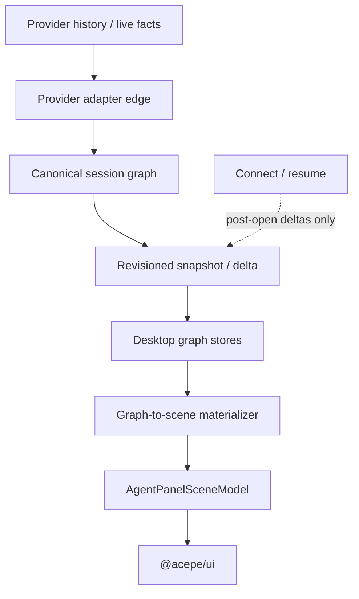
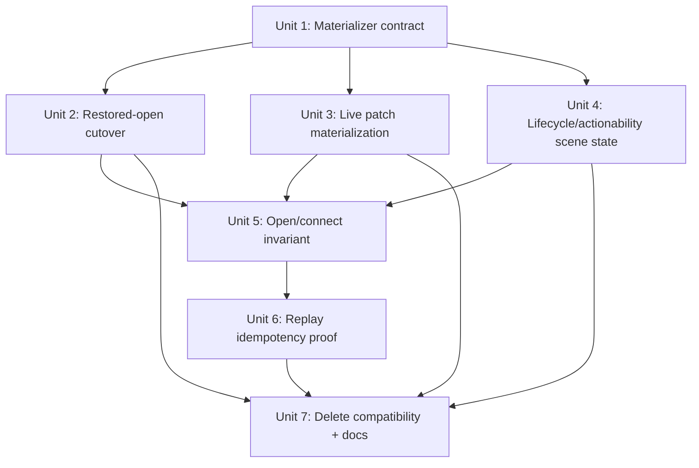

# refactor: Canonical graph-to-scene materialization

## Overview

Finish the restored-session rendering cut of Acepe's GOD architecture by making the canonical session graph materialize into render-ready agent-panel scene data before UI code sees transcript placeholders, legacy `ToolCallData` fallbacks, or legacy session-status compatibility.

The current tactical fix correctly installs operations before transcript snapshots and enriches transcript tool entries from `OperationStore`. That fixes the visible "minimal tool rows first, rich tool cards after connect" bug. This plan turns that fix into the clean endpoint: transcript remains the ordered conversation spine, operations remain runtime/tool truth, and one graph-to-scene materialization boundary joins them into presentation-safe DTOs. Connect/resume may attach live transport and deliver post-open deltas, but it must never be required to repair historical content.

## Problem Frame

The final GOD architecture requires one product-state authority path: provider facts/history/live events -> provider adapter edge -> canonical session graph -> revisioned materializations -> desktop stores/selectors -> UI (see origin: `docs/brainstorms/2026-04-25-final-god-architecture-requirements.md`).

Recent history explains the current gap:

| Change | Intended rationale | Remaining gap |
|---|---|---|
| PR #132, `be33666e` | Introduced backend-owned `TranscriptSnapshot` / `TranscriptDelta` so streaming and open-time conversation history have stable keyed rendering. Transcript tool rows were intentionally text-only. | Frontend compatibility converted text-only tool rows into fake `ToolCallData` placeholders. |
| PR #159, `20c8b65d` | Made operations canonical runtime/tool state, separate from transcript history. | Some render paths still consumed transcript-compatible tool DTOs before operation materialization. |
| PR #174, `c748f5b7` | Made provider history the sole restore authority for session content. | Provider-history/open-snapshot replay still needs idempotency proof at the operation-provenance seam. |
| PR #180, `1665f727` | Finalized the canonical session graph as the product authority. | Agent-panel materialization still has compatibility seams: transcript placeholder repair, legacy status input mapping, and connect-time replay/idempotency assumptions. |

User-visible impact: restored sessions can show placeholder or skeletal tool rows before connect completes, reconnect can appear to replace or reshape historical tool content, and canonical lifecycle states such as detached/resumable or archived can collapse into misleading status/CTA copy. The refactor is successful only if the panel feels stable and honest on first paint: historical content is already resolved, resume/retry/send affordances match canonical actionability, and reconnect does not visibly "fix" old rows.

The current tactical store repair is aligned with the architecture, but it is not the clean endpoint. The clean endpoint is:

```text
canonical graph snapshot/delta
  -> graph-to-scene materializer/selectors
  -> AgentPanelSceneModel
  -> presentational UI
```

The UI should never have to ask whether a transcript-derived tool placeholder can be repaired. It should receive an already-materialized scene entry or an explicit degraded/unresolved operation presentation derived from canonical graph state.

## Requirements Trace

- R1. Agent-panel session rendering must derive from the canonical graph and selectors only, preserving the origin document's single-authority path (origin R1, R4, R23, R24).
- R2. Transcript tool entries must behave as ordered operation references/spine entries, not as independent rich `ToolCallData` truth (origin R5, R9).
- R3. Operation and interaction selectors must own rich tool rendering, permission/question/approval state, blocked state, evidence, and degraded fallback presentation (origin R6, R6a, R7, R8, R9a, R9b).
- R4. Restored-session first paint must be fully materialized from the open graph snapshot before connect/resume attaches live transport.
- R5. Live operation patches must update materialized scene/tool presentation without waiting for a full transcript replacement and without using `ToolCallRouter` as a correctness repair fallback.
- R6. Agent-panel status, actionability, resume/retry/send affordances, and activity copy must derive from canonical seven-state lifecycle/actionability/activity, not the legacy `SessionStatus` / `SessionStatusUI` compatibility path (origin R10, R12, R13, R14).
- R7. Open/connect/replay must be idempotent by graph revision and operation provenance so repeated provider facts cannot duplicate or reshape historical rows (origin R19-R22a).
- R8. No new local provider-content cache, local transcript fallback, or durable duplicate authority may be introduced (origin R15-R18, R27).

## Scope Boundaries

- In scope is the agent-panel graph materialization boundary across restored open, live deltas, scene status/actionability, and operation presentation.
- In scope is removing product rendering's dependence on transcript-placeholder `ToolCallData` and `ToolCallRouter` repair.
- In scope is adding proof that connect/resume does not repair historical content and duplicate replay does not duplicate operations or rows.
- In scope is updating concept docs where the graph-to-scene boundary needs to be named.
- This plan does **not** change the visual design of agent-panel cards, strips, or composer controls.
- This plan does **not** replace `docs/plans/2026-04-28-002-refactor-pure-god-canonical-widening-plan.md`; that plan owns hot-state/capability projection widening. This plan owns graph-to-scene rendering materialization.
- This plan does **not** add a provider-history cache or reintroduce local durable transcript/tool content.
- This plan does **not** make transcript snapshots self-contained rich tool objects. That would duplicate operation truth.
- This plan does **not** require moving the entire `AgentPanelSceneModel` builder into Rust. Rust remains graph authority; desktop remains the presentation-materialization layer.

## Context & Research

### Relevant Code and Patterns

- `packages/desktop/src/lib/acp/session-state/session-state-protocol.ts` materializes `SessionOpenFound` into `SessionStateGraph`, derives graph activity, and asserts lifecycle/capability authority.
- `packages/desktop/src/lib/acp/store/session-store.svelte.ts` applies open snapshots, graph replacements, operation patches, interaction patches, lifecycle envelopes, and canonical projections.
- `packages/desktop/src/lib/acp/store/session-entry-store.svelte.ts` currently converts transcript snapshots to `SessionEntry[]`, enriches tool entries from `OperationStore`, and preserves structured entries across transcript replacement.
- `packages/desktop/src/lib/acp/store/services/transcript-snapshot-entry-adapter.ts` is the compatibility adapter that still creates placeholder `ToolCallData` for transcript tool rows.
- `packages/desktop/src/lib/acp/store/operation-store.svelte.ts` indexes operations by operation id, tool-call id, provenance key, and source entry id, then materializes current `ToolCall` views for compatibility consumers.
- `packages/desktop/src/lib/acp/components/tool-calls/tool-call-router.svelte` still resolves a tool call through `OperationStore` at render time; useful as presentation routing, but not acceptable as a correctness fallback endpoint.
- `packages/desktop/src/lib/acp/components/agent-panel/scene/desktop-agent-panel-scene.ts` builds `AgentPanelSceneModel` from `SessionEntry[]` and legacy `SessionStatus`.
- `packages/desktop/src/lib/acp/components/agent-panel/logic/session-status-mapper.ts` maps legacy `SessionStatus` into `SessionStatusUI` for older header paths, while `desktop-agent-panel-scene.ts` maps legacy `SessionStatus` into `AgentPanelSessionStatus`. The gap is the legacy input source, not merely enum size.
- `packages/ui/src/components/agent-panel/types.ts` is the active `@acepe/ui` scene/conversation contract consumed by desktop and website demos. `packages/agent-panel-contract` may need parity updates if implementation confirms it is still exported to downstream consumers, but it is not the only type owner.
- `packages/website/src/lib/components/agent-panel-demo.svelte`, `packages/website/src/lib/components/landing-single-demo.svelte`, and `packages/website/src/lib/components/landing-by-project-demo.svelte` construct `AgentPanelSceneModel` fixtures and must be kept in sync with scene-contract changes.
- `packages/desktop/src/lib/components/main-app-view/logic/open-persisted-session.ts` applies open hydration before calling connect; this is the correct ordering and needs invariant coverage.
- `packages/desktop/src/lib/acp/store/services/session-open-hydrator.ts` already has graph-revision guards for stale open results.
- `packages/desktop/src-tauri/src/acp/projections/mod.rs`, `packages/desktop/src-tauri/src/acp/session_state_engine/reducer.rs`, and `packages/desktop/src-tauri/src/history/commands/session_loading.rs` are the Rust seams for operation identity, provider-history translation, and replay/idempotency proof.

### Institutional Learnings

- `docs/concepts/session-graph.md` — transcript, operations, interactions, lifecycle, activity, and capabilities are graph nodes/materializations, not peer authorities. Transcript is not operation authority.
- `docs/concepts/operations.md` — transcript entry means "show this in history"; operation means "runtime truth of the work item." Shared UI should ask operation selectors, not rebuild semantics from transcript text.
- `docs/concepts/reconnect-and-resume.md` — connect/resume attaches live state after restored content is known; it should not reconstruct historical content from local fallback.
- `docs/solutions/architectural/revisioned-session-graph-authority-2026-04-20.md` — split-brain bugs happen when local projections, raw updates, or frontend stores become alternate session truth.
- `docs/solutions/architectural/final-god-architecture-2026-04-25.md` — product stores/selectors consume canonical graph envelopes; diagnostics are non-authoritative.
- `docs/solutions/architectural/provider-owned-session-identity-2026-04-27.md` — session identity and restore materialization must happen from provider/canonical graph authority after identity is proven.
- `docs/solutions/architectural/provider-owned-semantic-tool-pipeline-2026-04-18.md` — provider tool semantics must be captured at the edge and projected canonically; UI must not classify or repair raw payloads.
- `docs/solutions/best-practices/deterministic-tool-call-reconciler-2026-04-18.md` — replay and live classification must converge through the same deterministic path.

### External References

- None. Local architecture docs, prior PRs, and current code define the governing constraints.

## Key Technical Decisions

| Decision | Rationale |
|---|---|
| Introduce an explicit graph-to-scene materialization boundary | The current implicit chain (`SessionEntryStore` repair + `ToolCallRouter` lookup + scene builder mapping) is too easy to bypass. A named materializer makes the canonical join between transcript, operations, interactions, lifecycle, and activity reviewable and testable. |
| Keep transcript and operations separate | Tool execution has semantics that transcript cannot own safely. The materializer joins the lanes; it does not collapse them into a rich transcript snapshot. |
| Treat transcript tool rows as operation references for rendering | A transcript tool row supplies order and entry identity. The operation supplies kind, command/result, lifecycle, blocked state, evidence, and degradation reason. |
| Make missing operation data explicit, not silently generic | If a committed restored/open transcript tool row cannot resolve to a canonical operation, the scene should show an explicit display-safe degraded/unresolved operation presentation when product behavior calls for visibility, not a fake rich tool card that looks authoritative. During normal live streaming, a short-lived transcript-before-operation race should present a pending/loading state, not an error, until the canonical operation patch arrives or the graph reaches a terminal state without operation evidence. |
| Demote `ToolCallRouter` to presentation routing only | It can choose the visual card for a render-ready tool DTO, but it must not be the correctness path that recovers missing operation semantics at render time. |
| Scene status/actionability should come from canonical lifecycle/actionability/activity | The current scene can emit several display states, but its input is still legacy `SessionStatus` / `SessionStatusUI` rather than `LifecycleStatus`. The refactor must specify a canonical lifecycle -> scene status/action mapping and update the controller path that currently derives `mappedSessionStatus` from session work/hot state. |
| Scene DTO fields must be display-safe and bounded | The materializer is the last product boundary before webview rendering. It may emit user-facing command/output/result summaries, but raw provider payload fragments, provenance keys, credential-like text, and engine-internal diagnostics must stay in diagnostics/logging boundaries. Output fields such as stdout/stderr/result/task result need an explicit truncation policy before entering scene DTOs. |
| Connect/resume must be content-inert for pre-open history | Historical transcript/operation content is an open-snapshot/materialization concern. Connect delivers post-open lifecycle/capability/delta updates only. |
| Prove idempotency at both desktop and Rust seams | Store-level revision guards are necessary but not sufficient; provider-history/live replay must also converge on the same operation identity and not duplicate canonical rows. |

## Open Questions

### Resolved During Planning

- **Should this be folded into the existing Pure GOD hot-state plan?** No. That plan owns hot-state/capability authority. This focused plan owns graph-to-scene materialization and transcript/operation rendering authority.
- **Should transcript snapshots become rich self-contained tool records?** No. That would duplicate operation truth and fight the operation model.
- **Should Rust emit `AgentPanelSceneModel` directly?** No. Rust owns canonical graph truth. Desktop owns presentation materialization into `@acepe/ui` DTOs.
- **Should connect be allowed to improve old rows after open?** No. If old rows improve after connect, the open snapshot/materialization was incomplete or replay/idempotency is leaking.
- **Should missing operation data be hidden?** No as a blanket rule. The materializer should surface explicit degraded/unresolved presentation when a visible transcript tool row lacks operation truth, while preserving honest failure/degradation semantics.

### Deferred to Implementation

- **Exact helper/type names for the graph materializer:** the plan names the boundary and target files; implementation can choose final exported names that fit existing module style.
- **Exact additive scene status/actionability shape:** the plan requires canonical lifecycle/actionability fidelity and a tested lifecycle-to-scene mapping. Implementation should decide whether this is best expressed as additive `AgentPanelSessionStatus` values, a separate presentation lifecycle field, or a combination, while updating `packages/ui/src/components/agent-panel/types.ts` and website fixtures together.
- **Exact degraded/unresolved entry shape:** implementation should choose between a dedicated conversation-entry union variant and an explicit degraded flag/reason on tool entries, but the chosen shape must make degraded/unresolved entries structurally distinguishable from normal tool cards.
- **Exact output truncation thresholds:** Unit 1 must define bounded display limits for stdout, stderr, result text, task result text, and similar execution-output fields before they enter scene DTOs.
- **Provider-specific provenance gaps uncovered by replay tests:** if a provider cannot supply stable provenance for a tool/action, implementation should surface an explicit degraded restore/edge state rather than inventing a fuzzy join.
- **How much of `SessionEntryStore` remains as compatibility after scene cutover:** the endpoint is no product rendering dependency on placeholder tool truth; exact deletion timing depends on remaining non-panel consumers discovered during implementation.

## Alternative Approaches Considered

| Approach | Why not chosen |
|---|---|
| Keep the current `SessionEntryStore` enrichment and add more guards | Good tactical fix, but keeps semantic repair in a store that should only materialize canonical state. Future render paths can still see placeholder `ToolCallData`. |
| Make transcript snapshots carry full tool details | Duplicates operation truth, increases snapshot size, and revives transcript-as-operation-authority. |
| Let `ToolCallRouter` continue resolving placeholders at render time | Leaves correctness in a Svelte component boundary and makes first-paint correctness dependent on render-time context. |
| Have Rust emit `AgentPanelSceneModel` directly | Removes too much presentation flexibility from desktop/UI and couples backend graph authority to one visual contract. |

## High-Level Technical Design

> *This illustrates the intended approach and is directional guidance for review, not implementation specification. The implementing agent should treat it as context, not code to reproduce.*



The materializer consumes graph-backed transcript order, canonical operations, interactions, lifecycle/actionability, and activity. It produces presentation-safe scene entries. It does not expose transcript-placeholder `ToolCallData` as product truth.

## Implementation Units



- [x] **Unit 1: Define the graph-to-scene materialization contract**

**Goal:** Introduce the explicit boundary that turns canonical graph state into render-ready agent-panel scene/conversation data without exposing transcript-placeholder tool truth.

**Requirements:** R1, R2, R3, R6

**Dependencies:** None

**Pre-implementation audit:** Before Unit 1 begins, inventory current consumers of transcript snapshot conversion and agent-panel scene contracts. At minimum, search for `transcript-snapshot-entry-adapter`, `convertTranscriptEntryToSessionEntry`, `toToolCallMessage`, `AgentPanelSceneModel`, and `AgentPanelConversationEntry` across `packages/desktop`, `packages/ui`, and `packages/website`. Record non-panel consumers as explicitly in scope for this plan or explicitly deferred with a named follow-up.

**Files:**
- Create: `packages/desktop/src/lib/acp/session-state/agent-panel-graph-materializer.ts`
- Modify: `packages/ui/src/components/agent-panel/types.ts`
- Modify: `packages/ui/src/components/agent-panel/agent-panel-conversation-entry.svelte`
- Modify: `packages/ui/src/components/agent-panel-scene/agent-panel-scene-entry.svelte`
- Verify/update: `packages/agent-panel-contract/src/agent-panel-conversation-model.ts`
- Verify/update: `packages/agent-panel-contract/src/agent-panel-scene-model.ts`
- Modify: `packages/desktop/src/lib/acp/components/agent-panel/scene/desktop-agent-panel-scene.ts`
- Modify: `packages/website/src/lib/components/agent-panel-demo.svelte`
- Modify: `packages/website/src/lib/components/landing-single-demo.svelte`
- Modify: `packages/website/src/lib/components/landing-by-project-demo.svelte`
- Test: `packages/desktop/src/lib/acp/session-state/__tests__/agent-panel-graph-materializer.test.ts`
- Test: `packages/desktop/src/lib/acp/components/agent-panel/scene/desktop-agent-panel-scene.test.ts`

**Approach:**
- Define the materializer input around canonical graph/store facts: transcript order, operations, interactions, lifecycle/actionability, activity, and existing presentation inputs such as header/composer cards.
- Extract interaction data into plain materializer input objects before calling the materializer. The materializer must not call Svelte context helpers or store writers.
- Represent transcript tool rows as references to operation identity/provenance/source-entry identity during materialization, not as rich tool objects.
- Materialize `AgentPanelToolCallEntry` only from canonical operation/interaction selectors.
- Extend the active `@acepe/ui` contract so blocked, cancelled, degraded, and unresolved/pending operation presentations are first-class and display-safe. A degraded/unresolved row must not be indistinguishable from a normal `kind: "other"` tool card.
- When a transcript tool row has no resolvable operation, produce pending/loading presentation only for live in-flight races; produce explicit degraded/unresolved presentation for committed restored/open graph state that lacks operation truth.
- Define scene DTO content policy in the materializer: execution outputs are truncated before entering the scene, and raw provider payloads, provider-native IDs, provenance keys, credential-like content, and internal diagnostic detail do not enter `AgentPanelConversationEntry` fields.
- Keep the existing scene builder as the composition surface, but move graph semantic joining out of component/render-time paths and into the named materializer.
- Keep `@acepe/ui` as the active type/renderer owner. If `packages/agent-panel-contract` remains a public mirror, update it for parity rather than treating it as the only source of truth.

**Execution note:** Characterization-first: capture the current restored-session tool-row rendering behavior at the materializer seam before changing the scene builder.

**Patterns to follow:**
- `packages/desktop/src/lib/acp/session-state/session-state-protocol.ts`
- `packages/desktop/src/lib/acp/store/operation-store.svelte.ts`
- `packages/desktop/src/lib/acp/components/agent-panel/scene/desktop-agent-panel-scene.ts`
- `packages/ui/src/components/agent-panel/types.ts`

**Test scenarios:**
- Happy path: transcript contains a tool entry whose source/tool id resolves to an execute operation; materialization emits a tool-call scene entry with command, result, and completed status from the operation.
- Happy path: transcript contains user and assistant entries plus an operation-backed tool entry; output order matches transcript order while tool content comes from operations.
- Edge case: transcript contains a tool row with no operation; materialization emits an explicit degraded/unresolved presentation rather than an authoritative fake execute/search/read card.
- Edge case: an operation exists without a transcript source entry; materialization does not invent a historical transcript row unless the graph/activity selector says it is current runtime activity.
- Edge case: a live in-flight transcript-before-operation race renders pending/loading presentation, then upgrades to the operation-backed tool presentation when the operation patch arrives.
- Edge case: a parent task operation with child operations materializes nested `taskChildren` from canonical operation data, not nested transcript placeholders.
- Error path: degraded/unresolved presentation carries display-safe copy only; raw provider payloads, provenance keys, and internal diagnostics stay out of scene DTO fields.
- Structural: the materializer has no imports of Svelte context, session stores, or write-side session APIs; it consumes plain data and returns scene data.
- Integration: scene builder output no longer depends on `ToolCallRouter` resolving a placeholder to become semantically correct.
- Integration: website mock fixtures compile and render at least one newly introduced scene/tool status variant without crashing.

**Verification:**
- A restored graph fixture can produce a complete `AgentPanelSceneModel` without first constructing placeholder `ToolCallData` as product truth.

- [x] **Unit 2: Cut restored open rendering onto graph materialization**

**Goal:** Ensure restored-session first paint uses the graph materializer after open snapshot hydration, so rich historical tool content is correct before connect/resume starts.

**Requirements:** R1, R2, R3, R4

**Dependencies:** Unit 1

**Files:**
- Modify: `packages/desktop/src/lib/acp/store/session-store.svelte.ts`
- Modify: `packages/desktop/src/lib/acp/store/services/session-open-hydrator.ts`
- Modify: `packages/desktop/src/lib/acp/store/session-entry-store.svelte.ts`
- Modify: `packages/desktop/src/lib/acp/store/services/transcript-snapshot-entry-adapter.ts`
- Modify: `packages/desktop/src/lib/acp/components/agent-panel/components/agent-panel.svelte`
- Test: `packages/desktop/src/lib/acp/store/__tests__/session-store-projection-state.vitest.ts`
- Test: `packages/desktop/src/lib/acp/store/services/__tests__/session-open-hydrator.test.ts`
- Test: `packages/desktop/src/lib/acp/components/agent-panel/scene/desktop-agent-panel-scene.test.ts`

**Approach:**
- Keep the current operation-before-transcript ordering as a required invariant for open snapshots.
- Route restored-open scene data through the graph materializer rather than asking the panel to render transcript-derived tool DTOs and hope they are enriched.
- Keep transcript snapshot conversion for non-tool user/assistant/error history, but demote transcript tool conversion to an internal compatibility path that cannot be the scene's semantic source.
- Preserve request-token and graph-revision guards in `SessionOpenHydrator`; stale open completions must not replace a newer materialized graph scene.
- Add tests around the exact bug class: a restored session with transcript tool rows plus operations must render rich tool cards before any connect call or live envelope.

**Execution note:** Test-first: the first test should fail if transcript placeholders can appear in the first materialized restored scene.

**Patterns to follow:**
- `packages/desktop/src/lib/acp/store/__tests__/session-store-projection-state.vitest.ts`
- `packages/desktop/src/lib/acp/store/services/__tests__/session-open-hydrator.test.ts`
- `packages/desktop/src/lib/components/main-app-view/logic/open-persisted-session.ts`

**Test scenarios:**
- Happy path: `SessionOpenFound` with a transcript tool row and rich operation emits a rich scene tool entry immediately after hydration and before connect.
- Happy path: alias open rewrites to the canonical id and materializes the canonical scene once.
- Edge case: equal or stale graph revision open result does not downgrade an already-rich scene.
- Edge case: transcript snapshot with non-advancing revision does not erase previously materialized history.
- Integration: `openPersistedSession` hydrates content before invoking connect, and the scene is render-ready in the pre-connect window.

**Verification:**
- A restored panel's first visible scene no longer depends on connect/replay to show rich historical tool content.

- [x] **Unit 3: Materialize live operation patches without transcript repair**

**Goal:** Make operation deltas update existing materialized tool presentation directly, including the case where an operation arrives after a transcript entry, without requiring a full transcript replacement.

**Requirements:** R3, R5, R7

**Dependencies:** Unit 1

**Files:**
- Modify: `packages/desktop/src/lib/acp/store/session-store.svelte.ts`
- Modify: `packages/desktop/src/lib/acp/store/operation-store.svelte.ts`
- Modify: `packages/desktop/src/lib/acp/store/session-entry-store.svelte.ts`
- Modify: `packages/desktop/src/lib/acp/components/tool-calls/tool-call-router.svelte`
- Modify: `packages/desktop/src/lib/acp/components/agent-panel/components/virtualized-entry-list.svelte`
- Test: `packages/desktop/src/lib/acp/store/__tests__/operation-store.vitest.ts`
- Test: `packages/desktop/src/lib/acp/store/__tests__/session-store-projection-state.vitest.ts`
- Test: `packages/desktop/src/lib/acp/store/__tests__/session-event-service-streaming.vitest.ts`
- Test: `packages/desktop/src/lib/acp/components/agent-panel/components/__tests__/virtualized-entry-list.svelte.vitest.ts`

**Approach:**
- Treat `applySessionOperationPatches` as a materialization trigger for affected operation/source-entry ids, not only an `OperationStore` mutation.
- Ensure sparse later patches enrich or preserve operation presentation according to canonical monotonic rules; they must not downgrade terminal/richer operation evidence.
- Remove any dependency where a Svelte router resolves placeholder semantics as the only path to correctness.
- Keep `ToolCallRouter` as a renderer selector for already-materialized tool presentation while deleting its role as a hidden semantic repair layer.
- Preserve high-frequency live delta performance; do not replace bounded operation patches with full transcript snapshots to solve materialization.

**Execution note:** Characterization-first around the active gap: operation patch after a transcript placeholder must update presentation without waiting for a snapshot replacement.

**Patterns to follow:**
- `packages/desktop/src/lib/acp/store/operation-store.svelte.ts`
- `packages/desktop/src/lib/acp/store/__tests__/operation-store.vitest.ts`
- `packages/desktop/src/lib/acp/store/__tests__/session-event-service-streaming.vitest.ts`

**Test scenarios:**
- Happy path: an operation patch for an existing transcript tool source entry updates the materialized scene from unresolved/degraded to rich execute/search/read presentation.
- Happy path: repeated operation patch with richer evidence updates title/result/command without duplicating the scene entry.
- Edge case: sparse later patch does not erase command/result/title already present from richer evidence.
- Edge case: stale active patch does not regress terminal failed, cancelled, completed, or degraded operation state; `blocked` is an actionable non-terminal presentation state and may resume to `running` through canonical patches.
- Integration: live `SessionStatePayload::Delta` with operation patches updates panel tool presentation without a `replaceSnapshot` transcript operation.

**Verification:**
- Live operation deltas and restored snapshot operations use the same materialization path and preserve operation monotonicity.

- [x] **Unit 4: Replace legacy scene status with canonical lifecycle/actionability**

**Goal:** Stop mapping canonical session state through the legacy `SessionStatus` / `SessionStatusUI` compatibility path and make agent-panel status/CTA presentation derive from canonical lifecycle, actionability, and activity.

**Requirements:** R1, R6

**Dependencies:** Unit 1

**Files:**
- Modify: `packages/agent-panel-contract/src/agent-panel-scene-model.ts`
- Modify: `packages/ui/src/components/agent-panel/types.ts`
- Modify: `packages/desktop/src/lib/acp/components/agent-panel/logic/session-status-mapper.ts`
- Modify: `packages/desktop/src/lib/acp/components/agent-panel/components/agent-panel.svelte`
- Modify: `packages/desktop/src/lib/acp/components/agent-panel/scene/desktop-agent-panel-scene.ts`
- Modify: `packages/desktop/src/lib/acp/store/session-work-projection.ts`
- Modify: `packages/website/src/lib/components/agent-panel-demo.svelte`
- Modify: `packages/website/src/lib/components/landing-single-demo.svelte`
- Modify: `packages/website/src/lib/components/landing-by-project-demo.svelte`
- Test: `packages/desktop/src/lib/acp/components/agent-panel/logic/__tests__/session-status-mapper.test.ts`
- Test: `packages/desktop/src/lib/acp/components/agent-panel/scene/desktop-agent-panel-scene.test.ts`
- Test: `packages/desktop/src/lib/acp/store/__tests__/session-store-projection-state.vitest.ts`

**Approach:**
- Replace the scene builder's dependence on legacy `SessionStatus` with canonical lifecycle/actionability/activity input, or extend the scene contract so canonical status is preserved alongside display status.
- Name all three status layers before editing: canonical `LifecycleStatus`, legacy desktop `SessionStatus` / `SessionStatusUI`, and presentation `AgentPanelSessionStatus`. The target is replacing the legacy input path, including the `sessionStatus` / `mappedSessionStatus` derivation in `agent-panel.svelte`.
- Add an explicit lifecycle-to-scene mapping table and test fixture. The mapping must cover `reserved`, `activating`, `ready`, `reconnecting`, `detached`, `failed`, and `archived`, plus actionability-driven resume/retry/send/archive actions.
- Ensure `Reserved`, `Activating`, `Ready`, `Reconnecting`, `Detached`, `Failed`, and `Archived` have explicit presentation mappings and actionability behavior.
- Distinguish a detached/restorable historical session from a blank/empty panel. "Idle" must not hide resume semantics.
- Derive send/resume/retry/archive affordances from canonical `actionability` fields, not local booleans or status names.
- Add a typed resume action path for detached/resumable sessions instead of ad hoc status-action dispatch.
- Decide composer presentation for `Detached` / `canResume`, `Reserved`, and `Archived` states as presentation data from the desktop controller: e.g. submit label, disabled reason, read-only state, or resume/retry action descriptor. Presentational components must receive resolved copy/actions rather than infer from lifecycle.
- Keep presentational `@acepe/ui` components dumb: they receive resolved labels/actions/status props and do not infer lifecycle.

**Execution note:** Test-first for the `detached` / `detachedReason: "restoredRequiresAttach"` restored-session case; it must not map to the same semantics as an empty new panel.

**Patterns to follow:**
- `docs/concepts/session-lifecycle.md`
- `packages/desktop/src/lib/acp/store/canonical-session-projection.ts`
- `packages/desktop/src/lib/acp/store/session-work-projection.ts`

**Test scenarios:**
- Happy path: `Ready` lifecycle with `canSend` renders connected/sendable scene state.
- Happy path: `Detached` lifecycle with `canResume` renders resumable/restored scene state and does not look empty.
- Happy path: `Reserved` lifecycle renders the chosen activation presentation explicitly, without pretending the session is empty or live.
- Edge case: `Failed` lifecycle with retry actionability renders retry affordance and error status.
- Edge case: `Archived` lifecycle renders read-only state with no send/resume affordance.
- Integration: agent-panel header/status/composer actionability agree for each seven-state lifecycle fixture.

**Verification:**
- Agent-panel scene status and CTA behavior are explainable from canonical lifecycle/actionability/activity without legacy status compatibility fallback.

- [x] **Unit 5: Prove open/connect boundary is content-inert**

**Goal:** Make it explicit and tested that open snapshot materialization owns historical content, while connect/resume only attaches live transport and applies post-open canonical deltas.

**Requirements:** R4, R7, R8

**Dependencies:** Units 2-4

**Files:**
- Modify: `packages/desktop/src/lib/components/main-app-view/logic/open-persisted-session.ts`
- Modify: `packages/desktop/src/lib/acp/store/services/session-connection-manager.ts`
- Modify: `packages/desktop/src/lib/acp/store/services/session-open-hydrator.ts`
- Test: `packages/desktop/src/lib/components/main-app-view/tests/open-persisted-session.test.ts`
- Test: `packages/desktop/src/lib/components/main-app-view/tests/initialization-manager.test.ts`
- Test: `packages/desktop/src/lib/acp/store/services/__tests__/session-open-hydrator.test.ts`
- Test: `packages/desktop/src/lib/acp/store/services/session-connection-manager.test.ts`

**Approach:**
- Add tests that record the materialized scene/content after open hydration and assert connect does not mutate historical rows unless a strictly newer canonical delta says so.
- Keep open-token/reservation semantics as delivery mechanics only; they may claim post-open deltas but must not become semantic authority.
- Document and enforce the connection manager invariant: no transcript/operation reload or local replay repair belongs in connect.
- Ensure duplicate same-revision open attempts are ignored without clearing or reordering already-materialized scene content.
- Ensure restore startup and manual persisted open share the same materialize-before-connect behavior.

**Execution note:** Characterization-first around startup restore and manual persisted open so later cleanup cannot reintroduce connect-time historical repair.

**Patterns to follow:**
- `packages/desktop/src/lib/components/main-app-view/logic/open-persisted-session.ts`
- `packages/desktop/src/lib/acp/store/services/session-open-hydrator.ts`
- `docs/concepts/reconnect-and-resume.md`

**Test scenarios:**
- Happy path: restored open materializes rich historical scene content, then connect succeeds without changing historical scene entries.
- Happy path: connect delivers a newer post-open operation delta and only that affected operation presentation updates.
- Edge case: duplicate open result with the same graph revision is ignored and does not clear scene content.
- Edge case: connect failure changes lifecycle/error presentation but preserves historical transcript/tool content.
- Edge case: connect failure assertions use the canonical lifecycle/actionability presentation introduced in Unit 4, not the legacy `SessionStatus` path.
- Integration: app startup restore and manual open both call hydrate before connect and produce the same pre-connect scene.

**Verification:**
- Connect/resume is no longer part of historical content correctness for restored sessions.

- [x] **Unit 6: Prove replay and provider-history idempotency by operation provenance**

**Goal:** Ensure repeated provider facts, provider-history restore, and reconnect replay converge on the same canonical operation identities instead of duplicating or reshaping historical tool rows.

**Requirements:** R3, R7, R8

**Dependencies:** Unit 5

**Files:**
- Modify: `packages/desktop/src-tauri/src/acp/projections/mod.rs`
- Modify: `packages/desktop/src-tauri/src/acp/session_state_engine/reducer.rs`
- Modify: `packages/desktop/src-tauri/src/acp/session_state_engine/runtime_registry.rs`
- Modify: `packages/desktop/src-tauri/src/history/commands/session_loading.rs`
- Modify: `packages/desktop/src-tauri/src/acp/session_open_snapshot/mod.rs`
- Test: `packages/desktop/src-tauri/src/acp/projections/mod.rs`
- Test: `packages/desktop/src-tauri/src/acp/session_state_engine/reducer.rs`
- Test: `packages/desktop/src-tauri/src/history/commands/session_loading.rs`
- Test: `packages/desktop/src-tauri/src/acp/session_open_snapshot/mod.rs`

**Approach:**
- **Checkpoint 6a — characterization fixtures:** create realistic Rust fixtures/tests that replay the same provider tool/provenance id through provider-history restore and live/reconnect paths. This checkpoint should not make production changes beyond fixture support; it identifies the exact deduplication/provenance gaps.
- **Checkpoint 6b — minimal idempotency fix:** apply the smallest reducer/projection/session-open changes needed to make the characterization tests pass. If 6a reveals provider provenance instability larger than this plan can safely resolve, stop and return to requirements with the degraded-state evidence.
- Assert the graph has one canonical operation id, one transcript placement, and monotonic evidence enrichment.
- If provider facts conflict or cannot be ordered safely, materialize explicit degraded operation/restore state instead of duplicating or silently choosing one path.
- Keep provider-native payload details at the adapter edge or diagnostics boundary; shared reducer tests should reason in canonical operation/provenance terms.
- Degraded restore/edge state may expose only display-safe degradation reason categories in scene/product state. Raw provider ids, provider error bodies, provenance keys, and payload fragments remain in redacted diagnostics/logging.
- Ensure journal/event history used for Acepe-owned metadata cannot reapply provider transcript/tool payloads as product history.

**Execution note:** Create a new Rust test fixture representing a session with repeated provider tool/provenance IDs, then write failing tests against it before implementing idempotency guards.

**Patterns to follow:**
- `docs/solutions/best-practices/deterministic-tool-call-reconciler-2026-04-18.md`
- `docs/solutions/architectural/provider-owned-semantic-tool-pipeline-2026-04-18.md`
- `packages/desktop/src-tauri/src/acp/projections/mod.rs`

**Test scenarios:**
- Happy path: provider-history restore and live replay for the same provenance key produce the same canonical operation id.
- Happy path: repeated same provider tool id enriches existing operation evidence without duplicating operation or transcript row.
- Edge case: sparse replay after rich restore does not erase richer operation evidence.
- Edge case: conflicting provider facts create explicit degraded state with display-safe degradation reason rather than duplicate rows.
- Error path: missing provider provenance for a visible tool row surfaces an explicit degraded/unresolved operation state.
- Integration: `SessionOpenFound.operations` contains rich operations for provider-history tool rows and no duplicate operation snapshots for repeated provider facts.

**Verification:**
- A duplicate provider replay scenario is idempotent at Rust graph/projection level and at desktop materialized-scene level.

- [x] **Unit 7: Delete compatibility rendering authorities and document the boundary**

**Goal:** Remove or quarantine the old product rendering paths that allowed transcript placeholders, legacy status mapping, or render-time operation lookup to masquerade as semantic authority.

**Requirements:** R1, R2, R5, R6, R8

**Dependencies:** Units 1-6

**Files:**
- Modify: `packages/desktop/src/lib/acp/store/services/transcript-snapshot-entry-adapter.ts`
- Modify: `packages/desktop/src/lib/acp/store/session-entry-store.svelte.ts`
- Modify: `packages/desktop/src/lib/acp/components/tool-calls/tool-call-router.svelte`
- Modify: `packages/desktop/src/lib/acp/components/agent-panel/components/virtualized-entry-list.svelte`
- Modify: `docs/concepts/session-graph.md`
- Modify: `docs/concepts/operations.md`
- Modify: `docs/concepts/reconnect-and-resume.md`
- Test: `packages/desktop/src/lib/acp/store/services/__tests__/transcript-snapshot-entry-adapter.test.ts`
- Test: `packages/desktop/src/lib/acp/components/agent-panel/components/__tests__/virtualized-entry-list.svelte.vitest.ts`
- Test: `packages/desktop/src/lib/acp/components/agent-panel/scene/desktop-agent-panel-scene.test.ts`

**Approach:**
- Remove product rendering reliance on `toToolCallMessage()` placeholder semantics. If the adapter remains for non-panel compatibility, document it as non-authoritative and ensure panel rendering does not consume it for tool truth.
- Delete or narrow `preserveStructuredTranscriptEntry` branches whose only purpose is to repair placeholder/rich conflicts after the graph materializer owns the join.
- Keep defensive renderer null/teardown guards, but ensure they do not default semantic values.
- Update concept docs to name the graph-to-scene materializer boundary and the rule that transcript tool rows are operation references for rendering.
- Add behavior tests that fail if a restored rich operation can only render correctly through `ToolCallRouter.getToolCallById` fallback.

**Execution note:** Delete after proof, not before. Compatibility code can remain temporarily during earlier units, but the final unit should make remaining compatibility non-authoritative or remove it.

**Patterns to follow:**
- `docs/concepts/session-graph.md`
- `docs/concepts/operations.md`
- `packages/desktop/src/lib/acp/components/agent-panel/components/__tests__/virtualized-entry-list.svelte.vitest.ts`

**Test scenarios:**
- Happy path: virtualized entry rendering receives already-materialized tool scene data and does not need to resolve placeholder `ToolCallData` for correctness.
- Edge case: teardown/null guards still prevent crashes when entries disappear during Svelte teardown.
- Edge case: unresolved operation presentation remains explicit and does not masquerade as a valid rich tool card.
- Integration: restored session fixture with rich operations renders identical tool presentation before and after connect.
- Documentation: concept docs explain transcript spine, operation truth, graph materializer, and connect content-inertness consistently.

**Verification:**
- Product rendering no longer depends on transcript-placeholder tool DTOs, legacy status compatibility mapping, or render-time operation lookup as semantic authority.

## System-Wide Impact

- **Interaction graph:** Provider history/live facts feed Rust canonical graph; desktop stores consume envelopes; graph materializer feeds `AgentPanelSceneModel`; presentational UI remains prop-only.
- **Error propagation:** Missing provider history, missing operation provenance, and unresolved operation joins surface explicit missing/degraded/unresolved states rather than silent placeholder success.
- **State lifecycle risks:** Open hydration, operation patches, lifecycle envelopes, and connect/resume must preserve revision/provenance ordering. Stale open results and duplicate provider facts must not clear or duplicate scene entries.
- **API surface parity:** active scene contract changes in `@acepe/ui` affect desktop and website/mock renderers; any remaining `packages/agent-panel-contract` mirror must be audited for parity rather than assumed to drive the UI.
- **Integration coverage:** Unit tests alone are insufficient for the open/connect boundary; restored startup/manual-open flows need cross-layer tests and one manual Tauri smoke pass once implementation lands.
- **Unchanged invariants:** Provider-specific semantics remain at backend adapter/reducer edges; `@acepe/ui` remains presentational; no local durable provider-content cache is introduced.

## Risks & Dependencies

| Risk | Mitigation |
|---|---|
| Materializer becomes another authority rather than a projection | Treat it as pure/selective projection over canonical graph/store state. It cannot write graph/session state or invent lifecycle/tool semantics. |
| Scene contract widening creates UI churn | Keep `@acepe/ui` dumb and update website/mock fixtures alongside desktop tests. Prefer additive presentation fields only when they preserve canonical lifecycle/actionability fidelity. |
| Removing placeholder repair breaks non-panel consumers | Inventory consumers before Unit 1 and either route them through canonical selectors or quarantine compatibility adapters as non-authoritative. |
| Replay idempotency uncovers provider provenance instability | Surface explicit degraded/restore failure states and provider-specific edge fixes rather than adding fuzzy UI matching. |
| Hot-state retirement overlaps this plan | Keep capability/hot-state projection work in `docs/plans/2026-04-28-002-refactor-pure-god-canonical-widening-plan.md`; before Units 2-5 touch `session-store.svelte.ts`, `agent-panel.svelte`, `session-connection-manager.ts`, or `open-persisted-session.ts`, verify whether the relevant Plan 002 unit has landed or sequence the work to avoid writing against a soon-to-be-deleted hot-state shape. |
| Tauri MCP/live visual proof is unavailable | Use store/scene/open-flow tests as the primary proof, then run a manual Tauri smoke pass when driver connectivity is available. |

## Documentation / Operational Notes

- Update `docs/concepts/session-graph.md` to name graph-to-scene materialization as the presentation boundary.
- Update `docs/concepts/operations.md` to clarify that transcript tool rows are ordered operation references for rendering.
- Update `docs/concepts/reconnect-and-resume.md` to state that connect/resume is content-inert for pre-open history and only applies post-open canonical deltas.
- No deployment or data migration is planned. Any provider-history provenance issue discovered during Unit 6 should become a provider-edge fix or explicit degraded restore state.

## Success Metrics

- Restored session first paint shows rich historical tool cards without waiting for connect.
- Connecting a restored session does not change historical rows unless a newer canonical delta updates a specific operation.
- A repeated provider tool/provenance id produces one operation and one transcript placement across restore/live/replay.
- Agent-panel status/actionability distinguishes reserved, activating, ready, reconnecting, detached, failed, and archived semantics through canonical lifecycle/actionability.
- Transcript tool rows in restored-session fixtures carry no independent command/result/status truth into panel rendering; all rich tool semantics come from operation/interaction selectors.
- A visible transcript tool row with no resolvable operation renders explicit pending/loading or degraded/unresolved presentation according to graph state, never a fake authoritative tool card.
- A user opening a previously-run session sees fully resolved tool cards with command, result, and status on first paint before connect/resume completes, and historical panel content does not visibly change during or after reconnect.

## Sources & References

- **Origin document:** `docs/brainstorms/2026-04-25-final-god-architecture-requirements.md`
- Related plan: `docs/plans/2026-04-28-002-refactor-pure-god-canonical-widening-plan.md`
- Related PR: #132 `refactor(streaming): canonical transcript snapshot + delta pipeline`
- Related PR: #159 `refactor(acp): make operations canonical runtime state`
- Related PR: #174 `refactor(acp): make provider history the sole authority`
- Related PR: #180 `refactor: implement final GOD architecture (canonical session graph authority)`
- Related concepts: `docs/concepts/session-graph.md`, `docs/concepts/operations.md`, `docs/concepts/reconnect-and-resume.md`
