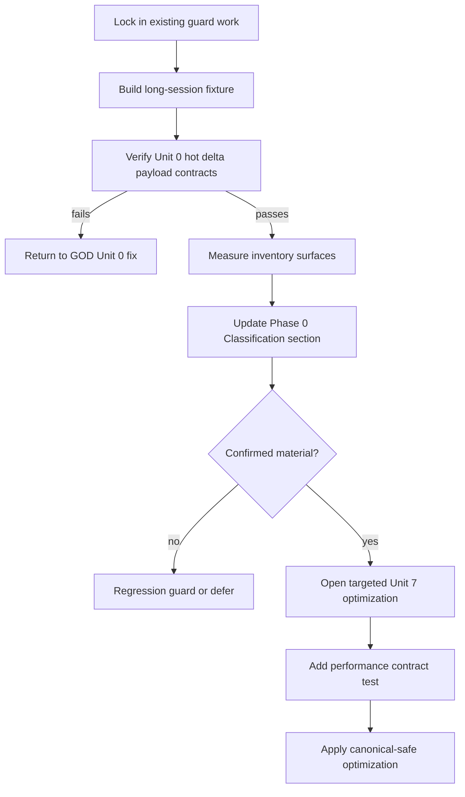

# fix: Add long-session performance contracts

## Overview

Acepe's original long-session overheating diagnosis traced the highest-confidence root cause to hot `ToolCall` / `ToolCallUpdate` events emitting full session snapshots. Unit 0 of the GOD canonical widening plan changed that path to bounded `operation_patches` deltas, and this plan makes that protection durable while ranking the remaining long-session surfaces with deterministic performance contracts.

The user clarified that overheating is not easy to reproduce reliably, so this plan does **not** depend on reproducing thermal behavior or sampling CPU directly. The proof mechanism is contract-driven: payload shape and size assertions, bounded DOM row assertions, no-materialization selector tests, deterministic render/update shape budgets, fixture-backed replay/update measurements, and an explicit Phase 0 classification table. Hard-red tests should use deterministic contracts such as row counts, payload shape/size, call counts, invalidation counts, materialization guards, and relative scaling checks; wall-clock timings are classification evidence, not normal CI assertions.

## Problem Frame

Long Acepe sessions can accumulate hundreds of transcript entries, hundreds of operations, and thousands of live events. A single high-frequency path that accidentally scales with total history can dominate main-thread or backend update work and make the app feel progressively worse. The requirements document reframes the next step as measure-first: verify the Unit 0 baseline, lock in already-written guard work, add representative long-session fixtures, then optimize only the surfaces proven material.

This plan preserves the canonical GOD boundary: performance work may add canonical-derived indexes/read models, but it must never restore `SessionHotState` or any parallel lifecycle/capability authority.

## Requirements Trace

- R1-R7. Establish Phase 0 baseline validation, fixture shape, performance budgets, and deterministic observability from `docs/brainstorms/2026-04-29-long-session-performance-requirements.md`.
- R8-R12. Keep transcript virtualization bounded and measure frontend transcript/reactivity work before broad refactors.
- R13-R15. Keep operation/session summary selectors bounded without introducing a parallel authority.
- R16-R17. Preserve the sidebar as a regression guard and audit multi-session summary surfaces only when evidence shows material selector multiplication.
- R18-R21. Measure backend snapshot/replay/projection growth and optimize only when budgets are exceeded or code evidence shows a low-risk structural fix.
- R22-R24. Preserve transcript/reconnect correctness and canonical-only authority; route any necessary repair/loading UI through a separate UX requirement.

## Scope Boundaries

- This plan does not require reproducing Mac overheating.
- This plan does not redesign the conversation UI or add repair/loading UI directly.
- This plan does not make the sidebar a current optimization target; it remains a regression guard unless measurement disproves that.
- This plan does not reintroduce `SessionHotState`, raw ACP updates, transcript rows, or TypeScript synthesis as lifecycle/activity/capability authority.
- This plan does not require solving every inventory surface in one pass. Phase 0 classification in this plan decides which conditional optimization units open.

## Context & Research

### Relevant Code and Patterns

- `packages/desktop/src-tauri/src/acp/session_state_engine/runtime_registry.rs` owns `SessionStatePayload::Snapshot` vs `Delta` routing and already contains Unit 0 tests for one-operation `operation_patches` on hot tool events.
- `packages/desktop/src-tauri/src/acp/session_state_engine/protocol.rs` defines `SessionStateDelta.operation_patches`.
- `packages/desktop/src-tauri/src/acp/transcript_projection/runtime.rs` clones transcript entries for snapshots and replay-related paths.
- `packages/desktop/src-tauri/src/acp/projections/mod.rs` tracks `completed_tool_call_ids` with a `Vec` and linear duplicate checks.
- `packages/desktop/src-tauri/src/db/repository.rs` loads full journal history in `SessionJournalEventRepository::list_serialized`.
- `packages/desktop/src/lib/acp/components/agent-panel/components/virtualized-entry-list.svelte` owns transcript virtualization, native fallback, and `thinkingNowMs`.
- `packages/desktop/src/lib/acp/components/agent-panel/components/__tests__/virtualized-entry-list.svelte.vitest.ts` already has the right pattern for bounded DOM row assertions.
- `packages/desktop/src/lib/acp/components/agent-panel/logic/virtualized-entry-display.ts` builds merged display entries by scanning the full session entry array.
- `packages/desktop/src/lib/acp/store/session-entry-store.svelte.ts` appends and updates by replacing session entry arrays.
- `packages/desktop/src/lib/acp/logic/aggregate-file-edits.ts` scans all entries recursively to derive modified file state.
- `packages/desktop/src/lib/acp/store/operation-store.svelte.ts` now has an O(1) current-streaming operation index in the working tree, but last-tool and last-todo selectors still materialize/scan session operations.
- `packages/desktop/src/lib/acp/components/session-list/session-list-ui.svelte` slices sidebar sessions through `getVisibleSessionsForProject`.
- `packages/desktop/src/lib/acp/components/session-list/session-list-logic.ts` defines `SESSION_LIST_PAGE_SIZE = 10`, confirming the sidebar is already visibly bounded.

### Institutional Learnings

- `docs/solutions/architectural/canonical-projection-widening-2026-04-28.md`: canonical projection is the durable authority; transient state has a narrow allowlist only.
- `docs/solutions/architectural/revisioned-session-graph-authority-2026-04-20.md`: `SessionEntryStore` renders transcript history, while `OperationStore` owns current/last tool semantics.
- `docs/solutions/architectural/final-god-architecture-2026-04-25.md`: performance caches must not recreate `SessionHotState` or a second lifecycle/capability system.
- `docs/solutions/ui-bugs/agent-panel-graph-materialization-rendering-bug-2026-04-28.md`: graph-to-scene rendering must match rows by id, not index, because assistant/thought merging shifts indexes.
- `docs/solutions/logic-errors/thinking-indicator-scroll-handoff-2026-04-07.md`: thinking row behavior must preserve separate reveal and resize-follow targets.
- `docs/solutions/logic-errors/terminal-state-guard-missing-blocked-2026-04-25.md`: terminal operation state must be a closed set and canonical patches must not be overwritten by lower-authority streaming updates.

### External References

No external web research is needed for this plan. The work is dominated by repo-specific canonical state routing, Svelte reactivity, and existing Virtua/OperationStore seams where local patterns are more authoritative than generic guidance. Local runtime profiling remains optional evidence when deterministic render/update budget tests do not explain observed performance.

## Key Technical Decisions

- **Deterministic proof over overheating repro:** Use payload-size, DOM-count, no-scan, call-count/invalidation-count, and fixture-backed render/update shape contracts. Do not require reproducing Mac overheating or sampling CPU directly.
- **Timing is evidence, not a flaky gate:** Millisecond timings may be recorded in fixture reports and used for Phase 0 classification, but hard-red tests should prefer deterministic gates: history-shaped arrays absent, DOM rows bounded, selector materialization avoided, helper call counts bounded, invalidation counts bounded, and long-vs-short scaling within budget.
- **Phase 0 is a hard gate:** Conditional optimization units do not open until Unit 0, guard work, fixture, and the Phase 0 Classification section in this plan are complete.
- **Hot-delta budgets are relative and absolute:** Hot `ToolCall` / `ToolCallUpdate` payloads should be independent of history length. The initial budget compares the same changed operation in a short fixture and long fixture: the long payload must contain no history-shaped arrays, must be no larger than `short + 1 KiB`, must be no larger than `short * 1.10`, and should stay under a normal-fixture absolute ceiling of 64 KiB. If the changed operation itself legitimately exceeds 64 KiB, the test must record that as an oversized-operation fixture and still prove no history-shaped data is included.
- **Canonical-derived indexes may store IDs, not lifecycle truth:** Last/current operation indexes may point to canonical operation IDs; operation status, lifecycle, activity, capabilities, and turn state must still be read from canonical projection/operation state.
- **Sidebar stays low priority:** The sidebar already renders a visible window per project; preserve that behavior but do not plan dedicated sidebar virtualization.
- **Repair/loading UI is out of this implementation plan:** If measurement proves existing reconnect/open blocking exceeds budget, this tranche may still land non-UX performance contracts, but it must create an immediate fast-follow UX requirement before claiming reconnect UX is resolved. If an optimization would introduce or worsen visible blocking, stop and plan the UX state before shipping that change.

## Phase 0 Classification Rules

Unit 6 owns this section. The implementation must update this table in this plan; the brainstorm requirements document should only be changed if the requirements themselves change.

| Surface | Classification | Evidence | Budget / threshold | Follow-up |
|---|---|---|---|---|
| Hot tool updates | regression guard | Rust tests `hot_tool_call_delta_payload_stays_history_independent` and `hot_tool_call_update_delta_payload_stays_history_independent` seed short/long/doubled histories and verify `ToolCall`/`ToolCallUpdate` emit `Delta` with one `operation_patches` item, no graph/snapshot payload, and history-independent serialized size. | Passed relative and absolute hot-delta budget. | Keep guard; no Unit 7 fix for this row unless it regresses. |
| Non-tool snapshot events | regression guard | Rust test `per_turn_terminal_updates_emit_history_independent_deltas` now verifies `TurnComplete` and `TurnError` emit history-independent deltas. Rust test `non_turn_snapshot_payloads_are_measurable_history_scaling_surfaces` keeps lower-frequency permission/question/connection snapshot surfaces characterized separately. | Per-turn terminal updates now pass the hot-delta budget. Remaining snapshot surfaces are lower-frequency and need real size/timing evidence before further migration. | Keep turn-delta guard; defer permission/question/connection snapshot migration unless measured material. |
| Transcript virtualization fallback | regression guard | Existing fallback tests plus the fixture-backed native fallback guard keep the fallback to the configured latest-entry tail window. | Passed bounded fallback tail-window contract. | Keep guard only. |
| Visible-row reactivity | regression guard | TS test `resolves tail thinking duration without scanning the full long-session display history` verifies tail thinking-duration work reads only the rendered tail entries; count guard verifies long/doubled display derivation does not amplify row count. | No total-history invalidation proved for visible tail rows; deterministic read-count guard passes. | Keep guard; revisit only if browser/profile evidence shows visible-row churn. |
| Transcript array churn | unmeasured/blocked | Not isolated in this tranche beyond hot-delta payload and display-entry count guards. `SessionEntryStore` replacement/invalidation behavior still needs a dedicated store-level instrumentation seam. | No hard evidence yet that latest-entry streaming rebuilds total arrays after Unit 0. | Follow-up only if real profiling or a store-level test proves total-array churn. |
| Modified files aggregation | regression guard | TS test `characterizes full-entry scan cost for unrelated long-session history` preserves the legacy entry-scan characterization, while `aggregates directly from operation-backed tool calls without transcript entries` and `materializes root session tool calls with nested children for operation-backed projections` guard the new active-panel path. The active panel and review fullscreen now derive modified files from `OperationStore.getSessionToolCalls(sessionId)`, not `sessionEntries`. | Active UI no longer rescans the transcript for unrelated assistant/text updates. Legacy entry aggregation remains for non-hot compatibility paths. | Keep operation-backed aggregation guard; revisit legacy call sites only if they become hot. |
| Operation selectors | regression guard | Unit 1 OperationStore tests prove current-streaming lookup uses the cached `currentStreamingOperationIdBySession` path without materializing all operations. | Passed no-materialization guard. | Keep guard; no Unit 7 fix for current-streaming selector. |
| Sidebar session list | regression guard | Requirements review confirmed sidebar content is already limited by visible-window/page slicing; no contrary measurement in this tranche. | Visible-window slice remains the guard. | Guard only unless disproven. |
| Rust projection tracking | deferred/non-material | Code audit confirms `completed_tool_call_ids` is only used internally for duplicate checks and grows as a `Vec`; hot completion updates perform an O(completed tools) linear scan even though the field is not emitted in hot deltas. No payload or deterministic timing failure remains after the higher-impact fixes. | Plain O(history) duplicate-check path exists, but it is not an IPC/render amplification path in this tranche. | Defer unless profiles still show Rust-side projection CPU after payload/UI fixes. |
| Transcript snapshot clone paths | deferred/non-material | Per-turn terminal updates no longer call the snapshot path. Remaining transcript snapshot clones are attached to lower-frequency permission/question/connection/open snapshot surfaces characterized by `non_turn_snapshot_payloads_are_measurable_history_scaling_surfaces`. | History-scaling shape confirmed for remaining snapshots; no wall-clock gate used and no hot per-turn snapshot remains. | Defer separate transcript clone optimization until remaining snapshot surfaces prove material. |
| Session journal replay | deferred/non-material | Rust test `long_replay_decodes_and_rebuilds_journaled_interactions_without_tool_payloads` verifies long journal replay correctness for permissions/questions and confirms tool-call payloads are not replayed from the journal. | No timing gate run; current journal content is lower-frequency interactions/turn state, not hot tool events. | Defer until real reopen/reconnect profile or fixture timing proves material. |
| Session journal append | deferred/non-material | Code audit confirms append is limited to journaled projection events; tool calls are not journaled. No lock/timing evidence collected. | Secondary concern remains below action threshold. | Defer unless persisted-event timing proves material. |
| Observability / render-update budgets | regression guard | Deterministic shape tests now cover hot-delta payload shape, terminal-turn delta shape, graph-only patch array stability, fallback row count, visible-tail read count, display-entry count, modified-file scanned-entry count, operation-backed modified-file aggregation, and journal replay shape. | Hard gates are deterministic; wall-clock timing remains evidence-only. | Add a new deterministic proxy before optimizing any newly discovered timed-only hotspot. |

Classifications must use one of: `confirmed hotspot`, `low-risk structural fix`, `regression guard`, `deferred/non-material`, or `unmeasured/blocked`. A low-risk structural fix may open Unit 7 only when the code path is plainly O(history) on a hot/repeated path, the bounded replacement is canonical-safe, and the test can prove the bounded contract. Any newly discovered hotspot outside the inventory must be added to this table before optimization.

## Open Questions

### Resolved During Planning

- **How do we prove performance without reproducing overheating?** Use deterministic performance contracts and fixtures, including render/update budget tests. These tests do not need to reproduce Mac overheating; they prove the known mechanisms that cause progressive slowness stay bounded.
- **Should the sidebar be optimized now?** No. It is already bounded by visible-session slicing and remains a regression guard.
- **Can performance work use caches/indexes?** Yes, if they are canonical-derived, rebuildable, and do not own lifecycle/activity/capability truth.
- **What happens if Unit 0 is not actually protected?** Stop this tranche and return to `docs/plans/2026-04-28-002-refactor-pure-god-canonical-widening-plan.md` Unit 0.
- **What happens if Unit 0 passes but a render/update budget still fails?** Keep the failing test, add the discovered hotspot to the Phase 0 Classification table, and open only the targeted follow-up that the evidence supports.
- **What happens if all contracts pass but the user still observes overheating or progressive slowness?** This plan is complete as a performance-contract tranche, not as a final thermal diagnosis. Open a follow-up profiling/debug plan with the observed session characteristics and any available runtime profile, then add the discovered hotspot to the Phase 0 table or a new requirements document.

### Deferred to Implementation

- Revised byte thresholds after the first fixture run, if the initial hot-delta budget proves too loose or too strict.
- Which non-tool snapshot events should migrate to bounded deltas; this depends on fixture-backed size/frequency measurements.
- Whether `thinkingNowMs`, display-entry derivation, entry-array churn, or modified-file aggregation is the hottest frontend path after Unit 0.
- Whether reconnect/replay needs backend optimization; this depends on long-session replay measurements.

## High-Level Technical Design

> *This illustrates the intended approach and is directional guidance for review, not implementation specification. The implementing agent should treat it as context, not code to reproduce.*

## Implementation Units

- [x] **Unit 1: Lock in existing guard work**

**Goal:** Convert already-written performance guard work into explicit prerequisites so the plan does not treat uncommitted changes as invisible baseline.

**Requirements:** R2, R5, R8, R13

**Dependencies:** None

**Files:**
- Modify if still uncommitted: `packages/desktop/src/lib/acp/components/agent-panel/components/virtualized-entry-list.svelte`
- Test: `packages/desktop/src/lib/acp/components/agent-panel/components/__tests__/virtualized-entry-list.svelte.vitest.ts`
- Modify if still uncommitted: `packages/desktop/src/lib/acp/store/operation-store.svelte.ts`
- Test: `packages/desktop/src/lib/acp/store/__tests__/operation-store.vitest.ts`

**Approach:**
- Treat bounded native fallback and O(1) current-streaming lookup as prerequisite deliverables.
- Preserve the native fallback tail-window behavior rather than expanding sidebar or transcript virtualization scope.
- Preserve OperationStore's current-streaming ID index as canonical-derived ID state, not operation status authority.

**Execution note:** Test-first posture. If any of these changes are not committed when implementation starts, keep their existing failing/passing regression tests as the proof before moving to Unit 2.

**Patterns to follow:**
- Existing DOM row-count assertion in `virtualized-entry-list.svelte.vitest.ts`.
- Existing OperationStore no-materialization test pattern in `operation-store.vitest.ts`.

**Test scenarios:**
- Happy path: 250+ transcript entries under native fallback mount no more than the configured bounded tail window.
- Edge case: native fallback preserves original display indexes for scroll/reveal behavior even when rendering only a tail slice.
- Happy path: `getCurrentStreamingOperation(sessionId)` returns the current operation without calling `getSessionOperations(sessionId)`.
- Edge case: replacing, patching, and clearing operations updates the current-streaming ID index consistently.

**Verification:**
- Existing guard work is either committed baseline or explicitly included as Phase 0 prerequisite work.

---

- [x] **Unit 2: Add long-session fixture and budget harness**

**Goal:** Create deterministic fixture support that can drive backend payload tests, frontend render tests, selector tests, and replay measurements without requiring thermal reproduction.

**Requirements:** R1, R4, R5, R6, R7

**Dependencies:** Unit 1

**Files:**
- Create: `packages/desktop/src/lib/acp/testing/long-session-fixture.ts`
- Test: `packages/desktop/src/lib/acp/components/agent-panel/components/__tests__/virtualized-entry-list.svelte.vitest.ts`
- Test: `packages/desktop/src/lib/acp/store/__tests__/operation-store.vitest.ts`
- Modify: `packages/desktop/src-tauri/src/acp/session_state_engine/runtime_registry.rs` test helpers

**Approach:**
- Before finalizing fixture size, record any known characteristics of the originally problematic sessions: approximate transcript entry count, operation count, large tool-output profile, and session duration. If those values are unavailable, state the assumption directly in the fixture helper.
- Define a TypeScript long-session fixture with hundreds of mixed transcript entries, hundreds of completed tool operations, and one active streaming turn.
- Include short, long, and doubled-history variants so relative scaling tests run at a meaningful size rather than near measurement noise.
- Keep Rust fixture helpers close to Rust tests instead of forcing a cross-language fixture format prematurely.
- Mark fixture assumptions explicitly. If real long-session data is not available, the fixture remains valid for deterministic regression contracts but is labeled unvalidated against production-like data.
- Define initial relative and absolute budgets rather than machine-specific thermal gates. For hot tool deltas, use the Key Technical Decisions budget until fixture evidence justifies tightening it.

**Execution note:** Characterization-first. Start by encoding the fixture shape and baseline measurements before optimizing any conditional surface.

**Patterns to follow:**
- Existing factory helpers in agent-panel and OperationStore tests.
- Existing Rust test modules colocated with `runtime_registry.rs`.

**Test scenarios:**
- Happy path: fixture contains mixed user, assistant, tool-call, completed-operation, and active-streaming entries.
- Edge case: fixture can generate short and long variants with the same changed operation payload, so payload-size tests compare history length rather than changed-operation size.
- Integration: the fixture can feed both transcript rendering tests and OperationStore selector tests without relying on live Tauri.
- Verification artifact: Phase 0 classification can cite fixture parameters, known or assumed failure-session characteristics, and whether real-session calibration exists.

**Verification:**
- Test helpers can create representative long sessions without starting the dev server or reproducing overheating.

---

- [x] **Unit 3: Regression-protect Unit 0 hot deltas**

**Goal:** Prove `ToolCall` and `ToolCallUpdate` live events stay bounded and history-independent.

**Requirements:** R2, R3, R4, R6, R7, R24

**Dependencies:** Unit 2

**Files:**
- Modify: `packages/desktop/src-tauri/src/acp/session_state_engine/runtime_registry.rs`
- Modify if needed: `packages/desktop/src-tauri/src/acp/session_state_engine/protocol.rs`
- Test: `packages/desktop/src-tauri/src/acp/session_state_engine/runtime_registry.rs`

**Approach:**
- Extend existing Unit 0 tests with long-session fixture state.
- Assert the payload kind is `Delta`, `operation_patches` contains only the changed operation, and transcript/full operation arrays are absent.
- Add serialized-size assertions comparing the same changed operation against short and long history depths, including the initial absolute ceiling for normal hot-delta fixtures.
- Keep full snapshots allowed only for explicit snapshot repair, session open, or reconnect paths that Phase 0 measures separately.
- Record deterministic long-fixture hot-event update timing. If payload contracts pass but update timing exceeds budget, add the unexplained cost to the Phase 0 Classification section and keep the failing budget test red until the hotspot is fixed.

**Execution note:** Test-first. The budget test is the hard gate; if it fails, implementation returns to the GOD Unit 0 plan before continuing.

**Patterns to follow:**
- Existing one-operation patch tests in `runtime_registry.rs`.
- Existing `SessionStatePayload::Delta` reducer shape.

**Test scenarios:**
- Happy path: `ToolCall` emits a Delta with one operation patch and no Snapshot payload in a long-session fixture.
- Happy path: `ToolCallUpdate` emits a Delta with one operation patch and no Snapshot payload in a long-session fixture.
- Performance contract: serialized hot-delta size remains within the approved relative budget when history grows from short to long fixture size.
- Performance contract: normal hot-delta fixture payload stays under the initial absolute ceiling, or records an oversized-operation exception that is independent of history length.
- Edge case: explicit repair/open/reconnect snapshot paths remain permitted and are excluded from hot-update assertions.

**Verification:**
- A future regression that routes hot tool updates through full snapshots fails a deterministic Rust test.

---

- [x] **Unit 4: Audit non-tool snapshots and backend replay costs**

**Goal:** Measure lower-frequency full snapshot paths before deciding whether they need bounded deltas or replay optimization.

**Requirements:** R3, R18, R19, R20, R21, R22, R23

**Dependencies:** Unit 2, Unit 3

**Files:**
- Modify: `packages/desktop/src-tauri/src/acp/session_state_engine/runtime_registry.rs`
- Modify if material: `packages/desktop/src-tauri/src/acp/transcript_projection/runtime.rs`
- Modify if material: `packages/desktop/src-tauri/src/db/repository.rs`
- Test: `packages/desktop/src-tauri/src/acp/session_state_engine/runtime_registry.rs`
- Test if material: `packages/desktop/src-tauri/src/acp/transcript_projection/runtime.rs`
- Test if material: `packages/desktop/src-tauri/src/acp/session_journal.rs` or existing repository test module

**Approach:**
- Audit `PermissionRequest`, `QuestionRequest`, `TurnComplete`, `TurnError`, `ConnectionComplete`, and `ConnectionFailed` snapshot payloads against the long-session fixture.
- Prioritize `TurnComplete` and `TurnError` because they occur once per turn and can still serialize large history.
- Measure transcript snapshot clone and journal replay time as deterministic fixture measurements, not as thermal repro.
- Keep `append()` separate from replay: append is a per-event round-trip concern with indexed sequence lookup, while replay is the O(history) path.
- Measure projection-growth surfaces such as completed tool-call tracking when they participate in hot updates, snapshots, duplicate checks, or payload-visible state.
- Preserve transcript/reconnect correctness while measuring replay: cold-open and live-stream projections must remain equivalent, permissions/questions must not be dropped, and reconnect behavior must stay explicit rather than hidden behind hot-state fallbacks.
- If existing reconnect/open blocking exceeds budget, classify it and create the immediate fast-follow UX requirement before claiming reconnect UX is resolved. If a proposed optimization would introduce or worsen visible blocking, stop and plan that UX state before shipping the change.

**Execution note:** Characterization-first. Do not migrate non-tool events to deltas until the audit identifies which events exceed budget.

**Patterns to follow:**
- `should_emit_session_state_snapshot` in `runtime_registry.rs`.
- Transcript clone path in `transcript_projection/runtime.rs`.
- Journal replay path in `SessionJournalEventRepository::list_serialized`.

**Test scenarios:**
- Happy path: audit records payload size for each snapshot-emitting non-tool event at long-session fixture depth.
- Edge case: `TurnComplete` and `TurnError` payloads are measured separately from connection failure/open repair paths.
- Performance contract: replay measurement reports event count, deserialization/rebuild time, and classification status without needing a live provider.
- Regression: reconnect/open replay preserves transcript correctness, permission/question state, and canonical projection parity.
- Error path: if a measurement cannot be produced for a surface, Phase 0 classifies it as unmeasured rather than silently passing it.

**Verification:**
- Phase 0 has evidence to decide whether non-tool snapshots, transcript cloning, or journal replay are confirmed hotspots.

---

- [x] **Unit 5: Measure frontend transcript/reactivity surfaces**

**Goal:** Classify frontend transcript costs before implementing broad reactive refactors.

**Requirements:** R5, R8, R9, R10, R11, R12, R22

**Dependencies:** Unit 2, Unit 3

**Files:**
- Instrument/test if needed: `packages/desktop/src/lib/acp/components/agent-panel/components/virtualized-entry-list.svelte`
- Instrument/test if needed: `packages/desktop/src/lib/acp/components/agent-panel/logic/virtualized-entry-display.ts`
- Instrument/test if needed: `packages/desktop/src/lib/acp/store/session-entry-store.svelte.ts`
- Instrument/test if needed: `packages/desktop/src/lib/acp/logic/aggregate-file-edits.ts`
- Test: `packages/desktop/src/lib/acp/components/agent-panel/components/__tests__/virtualized-entry-list.svelte.vitest.ts`
- Test: `packages/desktop/src/lib/acp/components/agent-panel/logic/__tests__/virtualized-entry-display.test.ts`
- Test: `packages/desktop/src/lib/acp/components/modified-files/logic/__tests__/aggregate-file-edits.test.ts`
- Test if material: `packages/desktop/src/lib/acp/store/__tests__/session-entry-store-streaming.vitest.ts`

**Approach:**
- Measure/characterize `thinkingNowMs` invalidation, display-entry rebuild behavior, entry-array churn, and modified-file aggregation against the fixture.
- Treat Virtua timer work as O(visible rows) unless tests prove total-history invalidation.
- If touching timer logic, remove or avoid `$effect`-driven interval logic rather than adding another effect.
- Preserve thinking indicator user-visible states when timer logic changes: active thinking/waiting with elapsed duration, completed/idle with final duration or no live ticking, error/cancelled terminal rows, and stale/no-active-turn rows. Do not collapse the separate reveal and resize-follow targets.
- If `aggregateFileEdits` is material, optimize at the shared function/selector layer so both reactive and imperative call sites benefit.

**Execution note:** Characterization-first. Do not implement broad frontend optimizations in this unit except to preserve Unit 1 prerequisite guards; confirmed material frontend fixes move to Unit 7 after Unit 6 updates the classification table.

**Patterns to follow:**
- Existing `virtualized-entry-display.test.ts` for display-entry merge semantics.
- Existing aggregate-file-edits functional tests through the compatibility re-export.
- Thinking indicator scroll/reveal separation from `docs/solutions/logic-errors/thinking-indicator-scroll-handoff-2026-04-07.md`.

**Test scenarios:**
- Happy path: native fallback remains bounded with long fixture entries.
- Characterization: timer tick measurement distinguishes visible-row invalidation from full-history derivation.
- Characterization: appending or updating the latest streaming entry reports display-entry derivation cost against fixture size.
- Characterization: `aggregateFileEdits` call count or scanned-entry count is measured under unrelated transcript updates.
- Regression: any optimization preserves assistant/thought merging, thinking/idle/error/stale indicator states, reveal target selection, modified-file totals, and scroll-follow behavior.

**Verification:**
- Frontend inventory rows are classified as confirmed hotspot, regression guard, or deferred/non-material with test evidence.

---

- [x] **Unit 6: Produce Phase 0 classification and follow-up gates**

**Goal:** Convert measurements into the implementation decision table in this plan so subsequent work is targeted and reviewable.

**Requirements:** R6, R7, R16, R17, R18, R19, R21, R22, R23

**Dependencies:** Units 1-5

**Files:**
- Modify: this plan's `Phase 0 Classification Rules` table
- Modify if requirements change: `docs/brainstorms/2026-04-29-long-session-performance-requirements.md`
- Modify if follow-up work opens: relevant test files named by confirmed hotspot units

**Approach:**
- Update the `Phase 0 Classification Rules` table for every row in the Current Performance Issue Inventory.
- Each row gets: classification, evidence, budget/threshold result, and follow-up unit or deferred rationale.
- Classify newly discovered hotspots by adding rows to the table instead of optimizing unlisted work.
- Open conditional optimization work only for rows classified as `confirmed hotspot` or `low-risk structural fix`.
- If three or more independent hotspots are confirmed, split Unit 7 execution into per-hotspot sub-units or commits so each optimization has its own failing/budget-exceeding contract before its fix.
- If reconnect/open repair exceeds the approved budget and cannot be made non-blocking, create the immediate fast-follow UX requirement before claiming reconnect UX is resolved. If an implementation change would introduce or worsen visible blocking, stop and plan the UX state before shipping that change.

**Execution note:** This is the handoff gate between measurement and optimization. Unit 7 must not start until this table is updated with the measurements from Units 1-5.

**Patterns to follow:**
- CE plan/update artifacts under `docs/plans/`.
- Existing requirements trace from `docs/brainstorms/2026-04-29-long-session-performance-requirements.md`.

**Test scenarios:**
- Test expectation: none for the document update itself. The classification must cite the tests/measurements from prior units.
- Sanity check: if a render/update budget test still fails after structural contracts pass, the table records the unexplained cost and opens a targeted follow-up instead of declaring success.
- Sanity check: if all deterministic contracts pass but the user still reports the symptom, this plan is marked complete only as a contracts tranche and a follow-up profiling/debug plan is created with the reported session characteristics.

**Verification:**
- Every inventory surface is either guarded, confirmed for optimization, or intentionally deferred with evidence.

---

- [x] **Unit 7: Add targeted canonical-safe optimizations for confirmed hotspots**

**Goal:** Implement only the optimizations Phase 0 proves material, while preserving canonical authority and user-visible transcript behavior.

**Requirements:** R9, R10, R11, R12, R13, R14, R15, R20, R22, R24

**Dependencies:** Unit 6 classification proving materiality

**Files:**
- Modify if material: `packages/desktop/src/lib/acp/components/agent-panel/components/virtualized-entry-list.svelte`
- Modify if material: `packages/desktop/src/lib/acp/components/agent-panel/logic/virtualized-entry-display.ts`
- Modify if material: `packages/desktop/src/lib/acp/store/session-entry-store.svelte.ts`
- Modify if material: `packages/desktop/src/lib/acp/logic/aggregate-file-edits.ts`
- Modify if material: `packages/desktop/src/lib/acp/components/agent-panel/components/agent-panel.svelte`
- Modify if material: `packages/desktop/src/lib/components/review-fullscreen/review-fullscreen-page.svelte`
- Modify if material: `packages/desktop/src/lib/acp/store/session-store.svelte.ts`
- Test if material: `packages/desktop/src/lib/acp/components/agent-panel/components/__tests__/virtualized-entry-list.svelte.vitest.ts`
- Test if material: `packages/desktop/src/lib/acp/components/agent-panel/logic/__tests__/virtualized-entry-display.test.ts`
- Test if material: `packages/desktop/src/lib/acp/components/modified-files/logic/__tests__/aggregate-file-edits.test.ts`
- Test if material: `packages/desktop/src/lib/acp/store/__tests__/session-entry-store-streaming.vitest.ts`
- Modify if material: `packages/desktop/src/lib/acp/store/operation-store.svelte.ts`
- Test if material: `packages/desktop/src/lib/acp/store/__tests__/operation-store.vitest.ts`
- Modify if material: `packages/desktop/src-tauri/src/acp/projections/mod.rs`
- Test if material: `packages/desktop/src-tauri/src/acp/projections/mod.rs`

**Approach:**
- For frontend transcript hotspots, prefer bounded derivation or narrower invalidation over broad component rewrites. Preserve assistant/thought merging, thinking indicator states, reveal target selection, modified-file totals, and scroll-follow behavior.
- If `aggregateFileEdits` is material, optimize the shared function/selector layer so reactive and imperative call sites benefit.
- For last-tool and last-todo selectors, prefer indexes that store operation IDs only. Materialize/read full operation state from canonical OperationStore at access time.
- For Rust completed-tool tracking, prefer deterministic set-like storage such as `IndexSet` if replacing `Vec`, since `indexmap` already exists in `Cargo.toml`.
- Preserve deterministic serialization if any projection field emitted to the frontend changes internal data structure.
- Keep terminal operation state guard semantics intact.

**Execution note:** Complete for this tranche. Test-first fixes covered per-turn terminal deltas, graph-only patch array stability, and operation-backed modified-file aggregation. Lower-frequency remaining snapshot surfaces and projection-internal duplicate tracking are deferred until measured material.

**Patterns to follow:**
- Current-streaming ID index in `OperationStore`.
- Existing `IndexSet` usage in `packages/desktop/src-tauri/src/acp/task_reconciler.rs`.
- Terminal-state guard behavior in `operation-store.svelte.ts`.

**Test scenarios:**
- Frontend hotspot: a budget-exceeding display derivation, entry-array update, timer invalidation, or modified-file scan becomes bounded while preserving existing rendering behavior.
- Happy path: last-tool selector returns the newest canonical tool without scanning/materializing every operation when an index is present.
- Happy path: last-todo selector returns the newest todo-writing tool through canonical-derived ID state.
- Edge case: terminal canonical operation state is not overwritten by later non-terminal raw/tool updates.
- Backend edge case: duplicate completed tool IDs are rejected in constant/bounded time while serialized session-state ordering remains deterministic.

**Verification:**
- Confirmed hotspots gain bounded contracts without adding lifecycle or capability authority outside canonical state or regressing transcript UX.

## System-Wide Impact

- **Interaction graph:** Rust session-state engine emits envelopes; TypeScript command router applies deltas/snapshots; SessionStore feeds OperationStore and transcript rendering; agent-panel derives scene, modified files, and visible rows.
- **Error propagation:** Missing or oversized hot delta contracts fail tests. Runtime repair paths remain explicit snapshots and must be measured rather than hidden.
- **State lifecycle risks:** Any index/read model introduced by this plan must be rebuildable from canonical events and may store IDs only unless the stored value is not lifecycle/activity/capability truth.
- **API surface parity:** Cold-open and live-stream canonical projections must remain equivalent; do not add a live-only performance path that breaks reopen.
- **Integration coverage:** Hot delta payloads, transcript fallback rendering, operation selectors, and replay measurements require fixture-backed integration-style tests in addition to unit coverage.
- **Unchanged invariants:** Transcript rows render conversation history; OperationStore owns tool semantics; canonical projection owns lifecycle/activity/capabilities.

## Risks & Dependencies

| Risk | Mitigation |
|------|------------|
| Fixture is under-representative | Use an initial hundreds/thousands scale floor and label fixture validation status explicitly. |
| Phase 0 becomes open-ended | Unit 6 requires classification of every inventory row before conditional work opens. |
| Hot delta regression slips back in | Unit 3 adds history-independent serialized payload tests. |
| Performance indexes become parallel authority | Unit 7 restricts indexes/read models to canonical-derived IDs and deterministic structures. |
| UI repair state sneaks into performance work | R23 is handled by an immediate fast-follow UX requirement when existing blocking exceeds budget, and blocks this tranche when a code change would introduce or worsen visible blocking. |
| All contracts pass but reported symptom persists | Mark this tranche complete only as performance-contract coverage, then create a follow-up profiling/debug plan anchored to the reported session characteristics. |
| Unrelated dirty worktree changes conflict | Implementation should only touch files named by the active unit and avoid reverting unrelated user/agent changes. |

## Documentation / Operational Notes

- Update this plan's `Phase 0 Classification Rules` table when measurement is complete. Update the requirements doc only if requirements change.
- If Phase 0 finds Unit 0 incomplete, stop this plan and update `docs/plans/2026-04-28-002-refactor-pure-god-canonical-widening-plan.md` instead.
- No production telemetry or privacy-sensitive logging is required for this tranche; tests and local deterministic fixtures are the primary proof.

## Success Metrics

- Hot tool update payload size is history-independent under short and long fixtures.
- Normal hot tool update payloads satisfy the initial absolute ceiling, or document an oversized-operation exception that remains history-independent.
- Native fallback DOM rows remain bounded.
- Current-streaming lookup remains O(1) and no-materialization guarded.
- Every inventory surface has a Phase 0 classification with evidence.
- Long-session render/update budget tests are recorded. If any remain red after structural contracts pass, the plan records the hotspot and does not claim the original performance symptom is resolved.
- Any implemented conditional hotspot fix has a failing/budget-exceeding test first and a passing bounded contract after the fix.

## Sources & References

- **Origin document:** `docs/brainstorms/2026-04-29-long-session-performance-requirements.md`
- **GOD Unit 0 source:** `docs/plans/2026-04-28-002-refactor-pure-god-canonical-widening-plan.md`
- **Canonical widening learning:** `docs/solutions/architectural/canonical-projection-widening-2026-04-28.md`
- **Revisioned graph authority:** `docs/solutions/architectural/revisioned-session-graph-authority-2026-04-20.md`
- **Graph materialization bug:** `docs/solutions/ui-bugs/agent-panel-graph-materialization-rendering-bug-2026-04-28.md`
- **Thinking scroll handoff:** `docs/solutions/logic-errors/thinking-indicator-scroll-handoff-2026-04-07.md`
- **Terminal operation guard:** `docs/solutions/logic-errors/terminal-state-guard-missing-blocked-2026-04-25.md`
