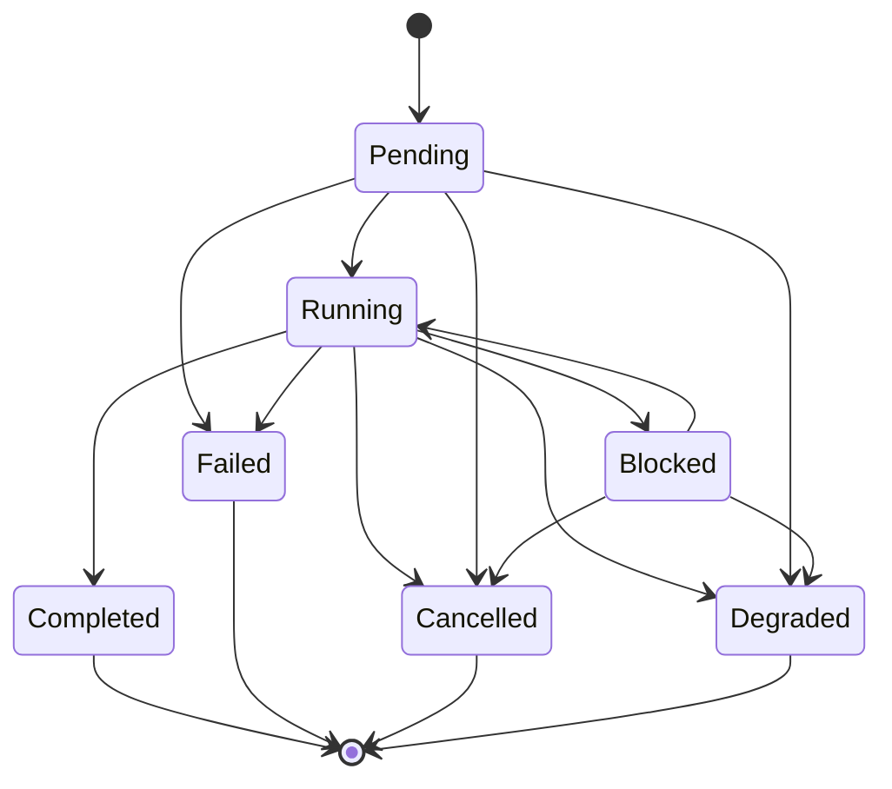
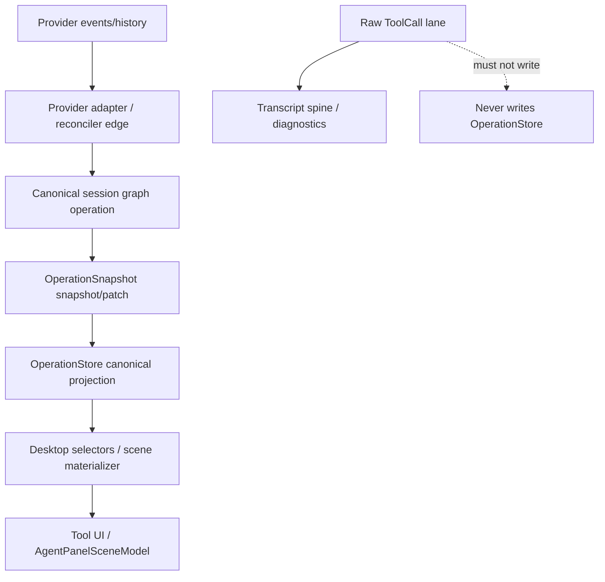
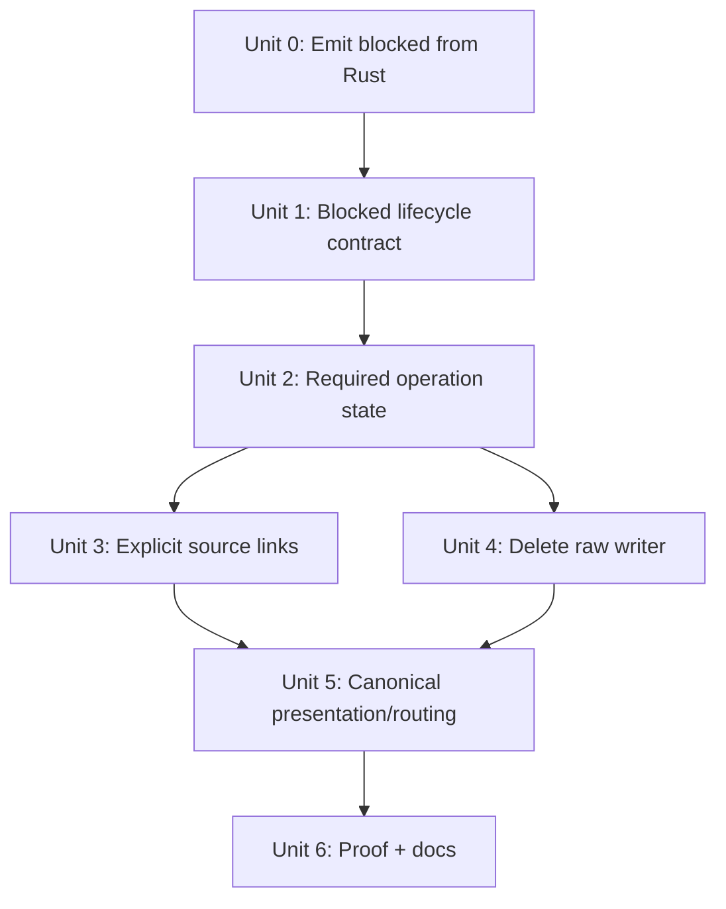

# refactor: Canonical operation authority and tool-call GOD cleanup

## Overview

Remove the remaining tool-call/operation authority leaks that let TypeScript infer, reconcile, or route operation truth outside the canonical Rust-owned session graph.

The target endpoint is strict:

```text
provider facts / history / live events
  -> provider adapter edge
  -> canonical session graph operations
  -> revisioned OperationSnapshot envelopes
  -> OperationStore canonical projection
  -> presentation-safe selectors / scene DTOs
  -> UI
```

`provider_status`, raw `ToolCall` DTOs, transcript placeholders, provider tool names, and display titles may remain as provenance or rendering evidence. They must not decide operation lifecycle, operation identity, transcript-to-operation joins, or product routing.

## Problem Frame

The final GOD architecture requires one product-state authority path for sessions and operations (see origin: `docs/brainstorms/2026-04-25-final-god-architecture-requirements.md`). The current tool-call/operation subsystem mostly follows that shape, but it still carries compatibility seams from the earlier raw `ToolCall` architecture:

| Seam | Current behavior | GOD issue |
|---|---|---|
| Optional `operation_state` | TS derives `OperationState` from `provider_status` when the field is missing | Frontend lifecycle synthesis |
| `blocked` terminal guards | TS treats `blocked` as terminal and rejects `blocked -> running` canonical patches | Resumable operation state becomes stuck |
| Raw ToolCall write path | `TranscriptToolCallBuffer` can still write `OperationStore` via `upsertFromToolCall` | Lower-authority dual writer |
| TS reconciler helpers | `session-state-query-service.ts` merges arguments/status for the raw path | Rust reconciler duplicated in TS |
| Ambiguous source joins | Scene materializer tries `sourceEntryId`, `toolCallId`, `provenanceKey`, then `operationId` | Four identities for one operation row |
| Provider-name routing | `read_lints` routes by raw name/title outside `ToolKind` | Provider quirks leak into UI |
| Provider-status presentation | Tool renderers and scene mappers derive display status from `toolCall.status` | Provenance status drives product UI |

This plan turns those seams into deletions or canonical schema constraints. The most important semantic decision is already resolved: **`blocked` is non-terminal and resumable**.

```text
pending -> running -> blocked -> running -> completed | failed | cancelled | degraded
```

`blocked` means "the operation is paused on an interaction or approval boundary." It is not "done." Terminal operation states are `completed`, `failed`, `cancelled`, and `degraded`.

## User-visible Outcomes

- A tool operation waiting on permission, a question, or plan approval shows as paused/actionable rather than completed, failed, or endlessly running.
- After the user resolves the blocker, the same operation resumes from `blocked` to `running` and then reaches its terminal state without duplicate rows or connect-time repair.
- Restored sessions display operation history from canonical graph evidence; if historical evidence is incomplete, users see an explicit partial/degraded state instead of a fake successful tool card.

## Requirements Trace

- R1. Operation lifecycle truth must be emitted by Rust as canonical `OperationState`; TS readers must not derive lifecycle from `provider_status`.
- R2. `blocked` must be a resumable, non-terminal operation state. Canonical `blocked -> running -> completed` patches must apply end-to-end.
- R3. Raw `ToolCall` / `ToolCallUpdate` events must not write `OperationStore` or become a second operation authority.
- R4. TS argument/status reconciliation that mirrors the Rust reconciler must be deleted once the raw operation writer is gone.
- R5. Transcript-to-operation rendering must use one explicit canonical source link, not a multi-key fallback chain.
- R6. Provider status, provider tool name, and display title may inform provenance or labels, but not lifecycle decisions, route identity, or product status.
- R7. Tests must exercise the canonical snapshot/patch path (`replaceSessionOperations`, `applySessionOperationPatches`, graph snapshot merge), not the dead raw ToolCall entry APIs.
- R8. Stale documentation that describes `blocked` as terminal must be corrected so future work does not reintroduce the wrong guard.

## Scope Boundaries

- In scope: operation lifecycle semantics, canonical operation snapshot shape, `OperationStore` write authority, transcript/operation join identity, tool presentation status routing, `read_lints` kind routing, and tests/docs directly tied to those areas.
- In scope: generated Rust-to-TS type updates when Rust snapshot/type changes require them.
- In scope: coordinating with `docs/plans/2026-04-28-002-refactor-pure-god-canonical-widening-plan.md` and `docs/plans/2026-04-28-003-refactor-graph-scene-materialization-plan.md`.
- Sequencing constraint: if `docs/plans/2026-04-28-003-refactor-graph-scene-materialization-plan.md` is not fully landed, Units 2, 3, and 5 must either run after its materializer changes merge or coordinate in the same implementation stack so `packages/desktop/src/lib/acp/session-state/agent-panel-graph-materializer.ts` and `packages/desktop/src/lib/acp/components/agent-panel/scene/desktop-agent-panel-scene.ts` do not receive divergent edits.
- Pre-flight for Units 2, 3, and 5: before editing those shared materializer/scene files, check the status of `docs/plans/2026-04-28-003-refactor-graph-scene-materialization-plan.md` and any active PR/branch for it. If it is in flight, pause standalone edits and run the changes in the same reviewed stack or wait for it to merge.
- Out of scope: the broader hot-state/capabilities migration owned by `docs/plans/2026-04-28-002-refactor-pure-god-canonical-widening-plan.md`.
- Out of scope: the full graph-to-scene cutover owned by `docs/plans/2026-04-28-003-refactor-graph-scene-materialization-plan.md`, except where this plan must remove operation-specific fallbacks that that cutover would otherwise inherit.
- Out of scope: visual redesign of tool cards, agent panel rows, badges, or composer controls.
- Out of scope: changing provider-native history formats beyond the adapter/projection normalization needed to emit canonical operation snapshots.

## Context & Research

### Relevant Code and Patterns

- `packages/desktop/src-tauri/src/acp/projections/mod.rs` defines `OperationState`, `OperationProviderStatus`, `OperationSnapshot`, operation projection merge logic, terminal-state checks, and source-entry fields.
- `packages/desktop/src-tauri/src/acp/session_state_engine/reducer.rs` and `packages/desktop/src-tauri/src/acp/session_state_engine/selectors.rs` apply and summarize graph operations/interactions.
- `packages/desktop/src/lib/services/acp-types.ts` is generated from Rust types and currently marks `operation_state` and `source_entry_id` as optional.
- `packages/desktop/src/lib/acp/store/operation-store.svelte.ts` is the canonical TS operation projection, but still contains `deriveOperationState`, `isTerminalOperationState` with `blocked`, and `upsertFromToolCall`.
- `packages/desktop/src/lib/acp/store/session-store.svelte.ts` merges operation snapshots and has a second `deriveOperationSnapshotState` fallback plus a second terminal-state guard that includes `blocked`.
- `packages/desktop/src/lib/acp/store/services/transcript-tool-call-buffer.svelte.ts` should be transcript-only, but still imports `OperationStore`, calls `upsertFromToolCall`, and depends on TS reconciliation helpers.
- `packages/desktop/src/lib/acp/session-state/session-state-query-service.ts` contains TS-side argument/status merge helpers used by the raw ToolCall path.
- `packages/desktop/src/lib/acp/session-state/agent-panel-graph-materializer.ts` and `packages/desktop/src/lib/acp/components/agent-panel/scene/desktop-agent-panel-scene.ts` contain operation-to-scene materialization logic that must not fall back to provider status or ambiguous IDs.
- `packages/desktop/src/lib/acp/utils/tool-state-utils.ts`, `packages/desktop/src/lib/acp/components/tool-call.svelte`, and tool-call components consume provider `ToolCall.status` for presentation flags today.
- `packages/desktop/src/lib/acp/components/tool-calls/resolve-tool-operation.ts` routes `read_lints` by raw name/title instead of a canonical `ToolKind`.

### Institutional Learnings

- `docs/concepts/session-graph.md` states that operations are graph nodes and lifecycle truth is backend-owned; UI must not reconstruct it from raw tool timing or transcript order.
- `docs/concepts/operations.md` states that transcript entries are history/order while operations are runtime truth, including lifecycle, blocked reason, permission linkage, source entry links, and evidence.
- `docs/solutions/architectural/final-god-architecture-2026-04-25.md` requires legacy compatibility authorities to be deleted rather than preserved as fallback.
- `docs/solutions/best-practices/deterministic-tool-call-reconciler-2026-04-18.md` requires streaming and replay classification to converge through one deterministic backend pipeline.
- `docs/solutions/logic-errors/terminal-state-guard-missing-blocked-2026-04-25.md` is now stale for this plan: it recorded `blocked` as terminal to protect against lower-authority raw updates. The correct fix is to delete the lower-authority raw writer and allow canonical `blocked -> running` patches.

### External References

- None. This is a repo-specific architecture refactor governed by Acepe's GOD/session-graph documentation and current code.

## Key Technical Decisions

| Decision | Rationale |
|---|---|
| `blocked` is non-terminal | A blocked operation is paused on a user/policy interaction and may resume. Treating it as terminal blocks the canonical resume cycle. |
| Rust must emit `Blocked` from real interaction state | `OperationState::Blocked` is currently a type-level possibility, but the plan must make it production-reachable. A pending permission/question/plan-approval interaction linked to an operation emits `Blocked`; resolving that interaction emits the canonical next state, usually `Running`. |
| Restored `Blocked` comes from interaction evidence, not provider status | `ToolCallStatus` has no blocked variant. Cold-open restore should reconstruct blocked state from unresolved canonical interaction metadata linked to the operation. If no interaction evidence exists, do not invent `Blocked` from provider status. |
| `operation_state` becomes required in the Rust snapshot contract | If Rust does not emit lifecycle, TS cannot safely guess it. Missing state must be resolved at the backend history/projection edge before emission. |
| Null historical operation state is normalized before reaching TS | Backward compatibility belongs at the Rust history/replay seam, not in product readers. Missing state can be reconstructed from provider facts when valid or emitted as explicit `degraded` with reason. |
| Null historical operation state scope must be provider-audited before Unit 2 edits | Implementation must inspect active provider history/replay seams before choosing reconstruction vs. `degraded`. If any provider lacks enough evidence for safe reconstruction, emit explicit `degraded` rather than guessing. |
| Transcript-to-operation linkage should be an explicit source-link contract | Some operations legitimately may not have transcript rows. A nullable `source_entry_id` cannot distinguish "not applicable" from "missing bug." A source-link shape should make that distinction explicit. |
| Source-link schema is fixed at plan time | Use an `OperationSourceLink`-style generated contract with `TranscriptLinked { entry_id }`, `Synthetic { reason }`, and `Degraded { reason }` variants. Exact Rust casing may follow serde/Specta conventions, but the discriminant meanings and required fields are not deferred. |
| `provider_status` remains provenance only | It may be displayed in diagnostics or retained on `Operation`, but product status and tool presentation derive from `operationState`. |
| Delete the raw ToolCall operation writer in one cut | Keeping a deprecated lower-authority writer invites accidental reactivation and keeps tests on the wrong seam. |
| Provider name/title routing moves to Rust classification | `read_lints` should be a canonical tool kind emitted by the Rust provider adapter/reconciler edge, not a UI special case. The Rust-generated `ToolKind` contract is the shared cross-provider boundary for this route. |

## Open Questions

### Resolved During Planning

- **Is `blocked` terminal?** No. `blocked` is resumable and non-terminal. TS guards that include `blocked` are wrong; Rust terminal checks that exclude `blocked` are directionally correct.
- **Should the audit's V-5 recommendation be applied?** No. The audit said to add `Blocked` to Rust's terminal set. That recommendation is superseded by this plan's lifecycle decision.
- **Should `source_entry_id` simply become mandatory?** No. Some operation records are synthetic/degraded or produced before a transcript entry is known. The clean endpoint is an explicit source-link contract that distinguishes transcript-linked operations from synthetic/no-entry operations.
- **Should raw ToolCall paths remain as compatibility?** No. They may remain only as diagnostics or transcript-spine coordination, never as operation-store writers.
- **Should this plan replace the graph-scene materialization plan?** No. This plan fixes operation authority and lifecycle seams. The graph-scene plan owns the broader agent-panel materialization boundary.
- **May `OperationState` be passed directly into `@acepe/ui`?** No. Desktop selectors/controllers must map canonical operation state into presentation-safe status/CTA DTOs before data reaches `@acepe/ui`.

### Deferred to Implementation

- **Exact historical-null normalization strategy:** implementation should inspect the history/replay seams and choose reconstruction vs. explicit `degraded` per provider evidence quality.
- **Exact UI selector field names for presentation status:** implementation may choose field names, but the boundary is fixed: desktop maps canonical `OperationState` into `AgentToolStatus` or an equivalent presentation DTO before `@acepe/ui` receives props.

## High-Level Technical Design

> *This illustrates the intended approach and is directional guidance for review, not implementation specification. The implementing agent should treat it as context, not code to reproduce.*





The implementation units are sequenced so the canonical contract tightens before lower-authority code is deleted and before presentation fallbacks are removed.



Unit 1 is a shippable correctness milestone once Unit 0 makes `Blocked` production-reachable: it fixes the user-visible `blocked -> running` resume path. Units 2-6 are the follow-on authority cleanup that prevents the same class of dual-system bug from reappearing.

## Implementation Units

- [x] **Unit 0: Make blocked state production-reachable from Rust**

**Goal:** Ensure real permission/question/approval blockers emit canonical `OperationState::Blocked`, and resolution emits the next canonical operation state instead of relying on raw ToolCall updates.

**Requirements:** R2, R3, R6, R7

**Dependencies:** None

**Files:**
- Modify: `packages/desktop/src-tauri/src/acp/session_state_engine/reducer.rs`
- Modify: `packages/desktop/src-tauri/src/acp/session_state_engine/selectors.rs`
- Modify: `packages/desktop/src-tauri/src/acp/projections/mod.rs`
- Modify: `packages/desktop/src-tauri/src/acp/inbound_request_router/mod.rs`
- Modify: `packages/desktop/src-tauri/src/acp/inbound_request_router/permission_handlers.rs`
- Modify: `packages/desktop/src-tauri/src/acp/inbound_request_router/forwarded_permission_request.rs`
- Modify: `packages/desktop/src-tauri/src/acp/inbound_request_router/types.rs`
- Test: `packages/desktop/src-tauri/src/acp/session_state_engine/reducer.rs`
- Test: `packages/desktop/src-tauri/src/acp/inbound_request_router/permission_handlers.rs`

**Approach:**
- Identify the Rust production path that creates pending permission, question, and plan-approval interactions linked to operations.
- Emit `PatchOperationState { new_state: Blocked }` when a linked interaction becomes pending.
- Emit the canonical resume state, usually `Running`, when that linked interaction is approved, answered, or otherwise resolved and the underlying operation can continue.
- Preserve `Blocked` as active activity in selectors while the linked interaction is pending.
- If a blocker arrives before the operation is fully materialized, attach the blocker through the existing operation provenance/linking path and patch the operation when the canonical operation appears.

**Execution note:** Start with a failing Rust integration test that exercises a real permission/approval flow and proves the operation enters `Blocked`.

**Patterns to follow:**
- `packages/desktop/src-tauri/src/acp/session_state_engine/reducer.rs`
- `packages/desktop/src-tauri/src/acp/session_state_engine/selectors.rs`
- `packages/desktop/src-tauri/src/acp/inbound_request_router/permission_handlers.rs`

**Test scenarios:**
- Happy path — a pending permission linked to an operation emits `OperationState::Blocked`.
- Happy path — resolving the permission emits `OperationState::Running` for the same operation.
- Happy path — pending question or plan approval linked to an operation follows the same blocked/resume contract.
- Edge case — an interaction that cannot be linked to an operation becomes an unresolved interaction state and does not invent a blocked operation.
- Integration — activity treats `Blocked` as active/waiting-for-user state, not terminal.

**Verification:**
- `OperationState::Blocked` is reachable from production Rust code, not only tests or synthetic patches.
- The first canonical `blocked -> running` path exists before TS terminal guards are loosened in Unit 1.

- [x] **Unit 1: Freeze the operation lifecycle contract**

**Goal:** Make `blocked` non-terminal everywhere TS applies or merges canonical operation snapshots, and document the corrected lifecycle semantics.

**Requirements:** R2, R7, R8

**Dependencies:** Unit 0

**Files:**
- Modify: `packages/desktop/src/lib/acp/store/operation-store.svelte.ts`
- Modify: `packages/desktop/src/lib/acp/store/session-store.svelte.ts`
- Modify: `packages/desktop/src-tauri/src/acp/projections/mod.rs`
- Modify: `packages/desktop/src-tauri/src/acp/session_state_engine/reducer.rs`
- Modify: `packages/desktop/src-tauri/src/acp/session_open_snapshot/mod.rs`
- Verify: `packages/desktop/src-tauri/src/acp/inbound_request_router/mod.rs`
- Verify: `packages/desktop/src-tauri/src/acp/inbound_request_router/permission_handlers.rs`
- Modify: `packages/desktop/src/lib/acp/store/__tests__/operation-store.vitest.ts`
- Modify: `packages/desktop/src/lib/acp/store/__tests__/session-store-projection-state.vitest.ts`
- Modify: `docs/solutions/logic-errors/terminal-state-guard-missing-blocked-2026-04-25.md`
- Modify: `docs/concepts/operations.md`

**Approach:**
- Remove `blocked` from every TS terminal-state guard that can reject canonical operation patches.
- Keep Rust terminal-state checks excluding `Blocked`; do not apply the old audit recommendation to add it.
- Consolidate duplicate Rust terminal-state helpers so reducer, projections, and session-open snapshot logic use one canonical `is_terminal_operation_state` definition.
- Add or update closed-set terminal-state tests so future `OperationState` additions force an explicit terminal/non-terminal decision.
- Verify the interaction-resolution path for permission grants, plan approvals, and question answers resumes blocked work through canonical operation patches instead of raw `ToolCall` updates.
- Update the stale learning doc to explain that the previous `blocked` terminal guard protected against a lower-authority raw lane that this plan deletes. The new invariant is "raw lane cannot write operation truth," not "`blocked` is terminal."

**Execution note:** Start with failing tests for `blocked -> running` via the canonical patch path before changing guards.

**Patterns to follow:**
- `packages/desktop/src/lib/acp/store/operation-store.svelte.ts`
- `packages/desktop/src/lib/acp/store/session-store.svelte.ts`
- `docs/concepts/operations.md`

**Test scenarios:**
- Happy path — existing operation snapshot `running`, patch `blocked` -> store operation state becomes `blocked`.
- Happy path — existing operation snapshot `blocked`, patch `running` -> store operation state becomes `running`.
- Happy path — `blocked -> running -> completed` patch sequence applies in order and ends terminal.
- Happy path — `blocked -> cancelled` and `blocked -> degraded` patch sequences apply and end terminal.
- Integration — `blocked` plus pending interaction, then approved/answered interaction, emits canonical `blocked -> running` operation state before completion.
- Integration — session graph snapshot merge accepts `blocked -> running` before `OperationStore` receives patches.
- Edge case — terminal `completed`, `failed`, `cancelled`, and `degraded` still reject stale non-terminal patches.
- Documentation — stale blocked-terminal guidance is replaced with the resumable lifecycle contract.

**Verification:**
- Canonical `blocked -> running` patches cannot be dropped by TS terminal guards.
- Rust and TS terminal sets agree that `blocked` is non-terminal.

- [x] **Unit 2: Make canonical operation state required**

**Goal:** Make Rust emit `operation_state` as a required canonical field and delete every TS fallback that synthesizes it from `provider_status`.

**Requirements:** R1, R6, R7

**Dependencies:** Unit 1

**Files:**
- Modify: `packages/desktop/src-tauri/src/acp/projections/mod.rs`
- Modify: `packages/desktop/src-tauri/src/acp/session_state_engine/reducer.rs`
- Modify: `packages/desktop/src-tauri/src/history/commands/session_loading.rs`
- Modify: `packages/desktop/src/lib/services/acp-types.ts`
- Modify: `packages/desktop/src/lib/acp/store/operation-store.svelte.ts`
- Modify: `packages/desktop/src/lib/acp/store/session-store.svelte.ts`
- Modify: `packages/desktop/src/lib/acp/session-state/agent-panel-graph-materializer.ts`
- Modify: `packages/website/src/lib/components/agent-panel-demo.svelte`
- Modify: `packages/website/src/lib/components/landing-single-demo.svelte`
- Modify: `packages/website/src/lib/components/landing-by-project-demo.svelte`
- Modify: `packages/desktop/src/lib/acp/store/__tests__/operation-store.vitest.ts`
- Modify: `packages/desktop/src/lib/acp/store/__tests__/session-store-projection-state.vitest.ts`
- Modify: `packages/desktop/src/lib/acp/session-state/__tests__/agent-panel-graph-materializer.test.ts`
- Test: `packages/desktop/src-tauri/src/acp/projections/mod.rs`
- Test: `packages/desktop/src-tauri/src/acp/session_state_engine/reducer.rs`

**Approach:**
- Change `OperationSnapshot.operation_state` from optional to required in Rust.
- Audit active provider history/replay seams before choosing per-provider handling for missing historical operation state. Record the decision at each code site so review can verify the audit happened.
- Retain Rust `derive_operation_state` in `projections/mod.rs` as the backend normalizer, and call it unconditionally where provider status must be promoted into canonical operation state. This is distinct from the TS `deriveOperationState` helpers that must be deleted.
- Normalize any historical or replay input that lacks operation state before building the snapshot. If provider evidence is insufficient, emit `degraded` with an explicit degradation reason rather than letting TS infer from `provider_status`.
- Remove `operation_has_terminal_evidence` dependence on `provider_status` once `operation_state` is required; terminal merge guards must use canonical operation state only.
- Refresh generated TS types so `OperationSnapshot.operation_state` is non-nullable.
- Delete `deriveOperationState` in `operation-store.svelte.ts`, `deriveOperationSnapshotState` in `session-store.svelte.ts`, and `deriveOperationState` in `agent-panel-graph-materializer.ts`; all three currently map `provider_status` to `OperationState`.
- Keep `provider_status` on the operation as provenance evidence only.

**Execution note:** Characterize current historical-null behavior before tightening the type so the implementation can choose reconstruction vs. `degraded` intentionally.

**Patterns to follow:**
- `packages/desktop/src-tauri/src/acp/projections/mod.rs`
- `packages/desktop/src/lib/acp/store/operation-store.svelte.ts`
- `packages/desktop/src/lib/acp/session-state/agent-panel-graph-materializer.ts`

**Test scenarios:**
- Happy path — a Rust operation projection with provider status `in_progress` emits `operation_state: running` explicitly.
- Happy path — TypeScript `operationFromSnapshot` reads `operation_state` directly and does not consult `provider_status`.
- Edge case — unclassified or insufficient historical evidence emits `operation_state: degraded` with a degradation reason.
- Error path — a malformed historical input without enough lifecycle evidence does not become silent `failed` in TS.
- Integration — each active provider history/replay seam has an explicit missing-state outcome: safe reconstruction or explicit `degraded`.
- Integration — each active provider restore fixture either reconstructs operation state or emits intentional degraded state; no operation becomes degraded solely because the TS fallback was deleted.
- Integration — generated `acp-types.ts` makes `operation_state` required and TS compile catches missing fixture fields.
- Integration — website fixtures compile after required `operation_state` fields are added.
- Regression — scene materializer no longer maps missing state from `provider_status`.

**Verification:**
- There is no product TS code path that maps `provider_status` to `OperationState`.
- `operation_state` is required at the generated type boundary.
- Unit 2 lands and passes before Unit 3 edits `session_loading.rs` for source-link changes.

- [x] **Unit 3: Replace ambiguous transcript-operation joins with explicit source links**

**Goal:** Remove the product rendering need for a four-key fallback join by making operation source linkage explicit and typed.

**Requirements:** R5, R7

**Dependencies:** Unit 2

**Files:**
- Modify: `packages/desktop/src-tauri/src/acp/projections/mod.rs`
- Modify: `packages/desktop/src-tauri/src/acp/session_state_engine/reducer.rs`
- Modify: `packages/desktop/src-tauri/src/acp/session_state_engine/selectors.rs`
- Modify: `packages/desktop/src-tauri/src/history/commands/session_loading.rs`
- Modify: `packages/desktop/src/lib/services/acp-types.ts`
- Modify: `packages/desktop/src/lib/acp/types/operation.ts`
- Modify: `packages/desktop/src/lib/acp/store/operation-store.svelte.ts`
- Modify: `packages/desktop/src/lib/acp/session-state/agent-panel-graph-materializer.ts`
- Modify: `packages/website/src/lib/components/agent-panel-demo.svelte`
- Modify: `packages/website/src/lib/components/landing-single-demo.svelte`
- Modify: `packages/website/src/lib/components/landing-by-project-demo.svelte`
- Modify: `packages/desktop/src/lib/acp/store/__tests__/operation-store.vitest.ts`
- Modify: `packages/desktop/src/lib/acp/session-state/__tests__/agent-panel-graph-materializer.test.ts`
- Test: `packages/desktop/src-tauri/src/acp/projections/mod.rs`
- Test: `packages/desktop/src-tauri/src/acp/session_state_engine/reducer.rs`

**Approach:**
- Replace ambiguous nullable source-entry semantics with an explicit `OperationSourceLink`-style contract using `TranscriptLinked { entry_id }`, `Synthetic { reason }`, and `Degraded { reason }` semantics.
- For transcript-linked operations, require a single transcript entry identifier and use it as the only product join key from transcript rows to operations.
- For synthetic/degraded operations, expose the absence of a transcript source as explicit source-link state so the scene materializer can render or ignore it intentionally.
- Preserve internal lookup indexes by operation id, provenance key, and tool-call id only behind store APIs that need them. Structurally separate those indexes from the transcript-row materializer path, whose lookup helper should accept only a transcript source entry id.
- Prove restored sessions and live updates preserve source linkage through operation evidence merging.

**Execution note:** Do not delete fallback maps until the new source-link contract has tests for restored snapshots, live patches, and degraded synthetic operations.

**Patterns to follow:**
- `docs/concepts/operations.md`
- `packages/desktop/src-tauri/src/acp/projections/mod.rs`
- `packages/desktop/src/lib/acp/session-state/agent-panel-graph-materializer.ts`

**Test scenarios:**
- Happy path — restored transcript tool row with matching operation source link materializes exactly one rich operation row.
- Happy path — live operation patch preserves an existing transcript source link from restored history.
- Edge case — synthetic/degraded operation without transcript source does not match a transcript row by coincidental `toolCallId`, `provenanceKey`, or `operationId`.
- Edge case — duplicate-looking provider ids in different sessions do not cross-match because operation identity remains session-scoped.
- Error path — transcript tool row with no canonical operation source link produces explicit pending/degraded scene state rather than fake successful tool content.
- Integration — materializer uses only the transcript source link for transcript-row joins.
- Integration — website fixtures compile after source-link fields are added.

**Verification:**
- Product transcript-to-operation rendering has one explicit join path.
- Four-way fallback joins are deleted from product materialization.
- Units 3 and 4 are independent after Unit 2 and may be executed in parallel or in either order.

- [x] **Unit 4: Delete the raw ToolCall operation writer and TS reconciler**

**Goal:** Remove the lower-authority raw `ToolCall` path that can write `OperationStore`, along with the TS reconciliation helpers that only support it.

**Requirements:** R3, R4, R7

**Dependencies:** Unit 2

**Files:**
- Modify: `packages/desktop/src/lib/acp/store/services/transcript-tool-call-buffer.svelte.ts`
- Modify: `packages/desktop/src/lib/acp/store/services/session-messaging-service.ts`
- Modify: `packages/desktop/src/lib/acp/store/session-entry-store.svelte.ts`
- Modify: `packages/desktop/src/lib/acp/store/operation-store.svelte.ts`
- Modify: `packages/desktop/src/lib/acp/session-state/session-state-query-service.ts`
- Modify: `packages/desktop/src/lib/acp/session-state/session-state-query-service.test.ts`
- Modify: `packages/desktop/src/lib/acp/store/services/interfaces/transcript-tool-call-buffer-interface.ts`
- Modify: `packages/desktop/src/lib/acp/store/services/interfaces/entry-store-internal.ts`
- Modify: `packages/desktop/src/lib/acp/store/__tests__/operation-store.vitest.ts`
- Modify: `packages/desktop/src/lib/acp/store/__tests__/tool-call-event-flow.test.ts`
- Modify: `packages/desktop/src/lib/acp/store/__tests__/session-entry-store-streaming.vitest.ts`

**Approach:**
- Remove `OperationStore.upsertFromToolCall` and the private raw DTO upsert path behind it.
- Remove every `OperationStore` import/write from `TranscriptToolCallBuffer`; this deletion is unconditional for operation truth.
- Remove `SessionMessagingService.createToolCallEntry` / `updateToolCallEntry` and corresponding `SessionEntryStore` methods for operation-writing responsibilities. If any transcript-only caller remains legitimate, it must be verified not to transitively reach `OperationStore`.
- Keep `TranscriptToolCallBuffer` responsible only for transcript row/progressive-argument coordination: remember streaming tool ids, update transcript rows, merge progressive arguments into transcript display state, and clear progressive arguments when transcript-only terminal updates arrive. It must not write operations, operation ids, operation state, or source links.
- Delete TS status/argument merge helpers from `session-state-query-service.ts` after callers are removed.
- Remove or rewrite `session-state-query-service.test.ts` coverage for deleted helpers.
- Rewrite tests that used the raw entry APIs to set up operations through canonical snapshots or operation patches.

**Execution note:** Treat this as deletion-first refactor after Unit 2. Do not replace the deleted writer with another fallback writer.

**Patterns to follow:**
- `packages/desktop/src/lib/acp/store/operation-store.svelte.ts`
- `packages/desktop/src/lib/acp/store/session-event-service.svelte.ts`
- `docs/concepts/session-graph.md`

**Test scenarios:**
- Happy path — canonical `replaceSessionOperations` creates operation state without raw ToolCall APIs.
- Happy path — canonical `applySessionOperationPatches` updates operation state without raw ToolCall APIs.
- Edge case — streaming-only raw tool update with no canonical operation remains ignored/logged and does not create operation truth.
- Regression — no production service exposes `createToolCallEntry`, `updateToolCallEntry`, or `upsertFromToolCall`.
- Integration — transcript progressive arguments still clear on terminal raw transcript updates where that transcript-only behavior remains valid.
- Deletion proof — tests no longer instantiate operation state through raw ToolCall entry methods.

**Verification:**
- `OperationStore` has only canonical snapshot/patch writers.
- TS argument/status reconciler code is gone or reduced to non-authoritative transcript-only helpers with no operation-store access.

- [x] **Unit 5: Route tool presentation through canonical operation data**

**Goal:** Stop tool UI and agent-panel scene presentation from treating provider status, raw name, or display title as product truth.

**Requirements:** R6, R7

**Dependencies:** Units 3 and 4

**Files:**
- Modify: `packages/desktop/src-tauri/src/acp/session_update/types/tool_calls.rs`
- Modify: `packages/desktop/src-tauri/src/acp/reconciler/classify_signals.rs`
- Modify: `packages/desktop/src-tauri/src/acp/reconciler/providers/claude_code.rs`
- Modify: `packages/desktop/src-tauri/src/acp/reconciler/providers/codex.rs`
- Modify: `packages/desktop/src-tauri/src/acp/reconciler/providers/copilot.rs`
- Modify: `packages/desktop/src-tauri/src/acp/reconciler/providers/cursor.rs`
- Modify: `packages/desktop/src-tauri/src/acp/reconciler/providers/open_code.rs`
- Modify: `packages/desktop/src-tauri/src/acp/reconciler/providers/shared_chat.rs`
- Modify: `packages/desktop/src-tauri/src/acp/parsers/types.rs`
- Modify: `packages/desktop/src-tauri/src/acp/parsers/arguments.rs`
- Modify: `packages/desktop/src-tauri/src/acp/projections/mod.rs`
- Modify: `packages/desktop/src/lib/services/acp-types.ts`
- Modify: `packages/desktop/src/lib/services/converted-session-types.ts`
- Modify: `packages/desktop/src/lib/acp/types/tool-kind.ts`
- Modify: `packages/desktop/src/lib/acp/components/tool-calls/resolve-tool-operation.ts`
- Modify: `packages/desktop/src/lib/acp/utils/tool-state-utils.ts`
- Modify: `packages/desktop/src/lib/acp/components/tool-call.svelte`
- Modify: `packages/desktop/src/lib/acp/components/agent-panel/scene/desktop-agent-panel-scene.ts`
- Modify: `packages/desktop/src/lib/acp/session-state/agent-panel-graph-materializer.ts`
- Modify: `packages/desktop/src/lib/acp/components/tool-calls/tool-call-router.svelte`
- Modify: `packages/desktop/src/lib/acp/components/tool-calls/tool-call-read-lints.svelte`
- Modify: `packages/desktop/src/lib/acp/components/tool-calls/shared/tool-status-header.svelte`
- Modify: `packages/desktop/src/lib/acp/components/tool-calls/tool-call-mini.svelte`
- Modify: `packages/desktop/src/lib/acp/components/tool-calls/__tests__/tool-call-read.svelte.vitest.ts`
- Modify: `packages/website/src/lib/components/agent-panel-demo.svelte`
- Modify: `packages/website/src/lib/components/landing-single-demo.svelte`
- Modify: `packages/website/src/lib/components/landing-by-project-demo.svelte`

**Approach:**
- Add a canonical `read_lints` tool kind at the Rust classification edge and carry it through generated TS types.
- Add provider classifier coverage before removing the TS special case. If an active provider cannot emit lint-style tool calls, record that provider as not applicable rather than adding dead mapping.
- Remove `ToolRouteKey = ToolKind | "read_lints"` and the name/title special case from `resolve-tool-operation.ts`.
- Ensure desktop presentation mappers receive a presentation status derived from canonical operation state, not raw `toolCall.status`, and do not pass `OperationState` directly into `@acepe/ui`.
- Update tool status utilities so `pending`, `running`, `blocked`, `completed`, `failed`, `cancelled`, and `degraded` map intentionally to presentation flags.
- `blocked` presentation must be visually distinct from running/completed/failed, convey waiting-for-user/actionable state, and clear any blocked-specific CTA/badge immediately when canonical state becomes `running`.
- `degraded` presentation must be visually distinct from `failed` and should communicate partial/data-quality state rather than user-caused operation failure.
- Keep provider status available only for provenance/diagnostic display where product behavior does not branch on it.
- Keep website/demo fixtures aligned with any `ToolKind` or presentation-status contract changes.

**Execution note:** If this unit touches Svelte components, invoke the Svelte skills required by the repository before editing Svelte files.

**Patterns to follow:**
- `packages/desktop/src/lib/acp/session-state/agent-panel-graph-materializer.ts`
- `packages/desktop/src/lib/acp/components/tool-calls/tool-call-router.svelte`
- `packages/ui/src/components/agent-panel/`

**Test scenarios:**
- Happy path — operation state `running` renders running/pending presentation even if provider status is stale.
- Happy path — operation state `blocked` renders a non-terminal blocked/actionable presentation, not success or failure.
- Happy path — `blocked -> running` clears blocked-specific presentation and renders running state from canonical update.
- Happy path — operation state `completed` renders done presentation regardless of provider status provenance.
- Error path — operation state `failed` renders error presentation with failure evidence.
- Edge case — operation state `degraded` renders explicit degraded/partial presentation, not generic success.
- Integration — `read_lints` routes by canonical kind without raw name/title matching.
- Integration — `read_lints` renders the expected lint card label/icon after ToolKind-based routing.
- Integration — website demo fixtures still render after the kind/status contract changes.

**Verification:**
- Product UI decisions for tool status route through canonical operation state or explicit presentation DTOs.
- `read_lints` has no UI-layer provider-name/title special case.

- [x] **Unit 6: Final deletion proof, docs, and integration coverage**

**Goal:** Prove the operation/tool-call subsystem has one canonical authority and update documentation so future work follows the corrected model.

**Requirements:** R1, R2, R3, R4, R5, R6, R7, R8

**Dependencies:** Units 0-5

**Files:**
- Modify: `docs/concepts/operations.md`
- Modify: `docs/concepts/session-graph.md`
- Modify: `docs/solutions/architectural/final-god-architecture-2026-04-25.md`
- Modify: `docs/solutions/architectural/god-architecture-verification-2026-04-25.md`
- Modify: `docs/plans/2026-04-28-003-refactor-graph-scene-materialization-plan.md`
- Modify: `packages/desktop/src/lib/acp/store/__tests__/operation-store.vitest.ts`
- Modify: `packages/desktop/src/lib/acp/store/__tests__/session-store-projection-state.vitest.ts`
- Modify: `packages/desktop/src/lib/acp/session-state/__tests__/agent-panel-graph-materializer.test.ts`
- Modify: `packages/desktop/src-tauri/src/acp/reconciler/tests/semantic_pipeline_characterization.rs`
- Modify: `packages/desktop/src-tauri/src/acp/reconciler/tests/streaming_semantic_characterization.rs`
- Modify: `packages/desktop/src-tauri/src/acp/projections/mod.rs`

**Approach:**
- Add deletion proof through compile-time/type removal and behavior tests, not grep/readFileSync structural tests. Deleted APIs such as `upsertFromToolCall`, operation-writing `createToolCallEntry`, and operation-writing `updateToolCallEntry` should fail to compile if product code calls them.
- Update concept docs to name `blocked` as a resumable operation state and terminal states as `completed`, `failed`, `cancelled`, `degraded`.
- Confirm the stale terminal-state learning updated in Unit 1 remains complete and no remaining docs describe `blocked` as terminal.
- Add only a narrow note to the graph-scene materialization plan that `blocked` is actionable non-terminal state, not degraded or terminal presentation; do not restructure that adjacent active plan.
- Ensure tests cover restored sessions, live patches, replay/idempotency, and presentation materialization for the corrected lifecycle.

**Execution note:** Run this as the final integration gate after implementation units land; do not claim the refactor complete until deletion proof passes.

**Patterns to follow:**
- `docs/concepts/session-graph.md`
- `docs/concepts/operations.md`
- `docs/solutions/architectural/god-architecture-verification-2026-04-25.md`

**Test scenarios:**
- Integration — restored session opens with a historical blocked operation and renders blocked/actionable state on first paint without connect-time repair.
- Integration — pending interaction approves, operation transitions `blocked -> running -> completed`, and activity remains graph-backed through the blocked phase.
- Integration — provider replay of a blocked-then-resumed operation produces one canonical operation, not duplicate blocked/completed rows.
- Regression — behavior tests and compile-time deletion prove product code cannot write operation state from raw `ToolCall` DTOs.
- Regression — behavior tests prove `OperationState` comes from canonical snapshots/patches, not provider-status fallback.
- Regression — materializer tests prove transcript rows join through source links only, not multi-key fallback.
- Documentation — final docs and active adjacent plans no longer describe `blocked` as terminal.

**Verification:**
- A reviewer can explain operation authority as Rust graph -> operation snapshot/patch -> `OperationStore` -> selector/UI, without caveats about raw ToolCall fallback.
- The corrected `blocked` lifecycle is covered at Rust, TS store, and presentation seams.

## System-Wide Impact

- **Interaction graph:** Permission, question, and approval interactions that block operations must continue to link to canonical operations and allow `blocked -> running` transitions after resolution.
- **Error propagation:** Missing lifecycle evidence becomes backend-emitted `degraded` state with reason, not frontend-inferred `failed`.
- **State lifecycle risks:** The biggest risk is deleting TS fallbacks before Rust snapshots guarantee required fields. Unit 2 must tighten schema first.
- **API surface parity:** Rust Specta exports and generated TS types must stay in sync for `OperationSnapshot`, `OperationState`, `ToolKind`, source-link types, and provider-status types.
- **Integration coverage:** Restored open, live streaming, reconnect/replay, blocked interaction resolution, and website fixture rendering all need coverage.
- **Unchanged invariants:** Transcript remains ordered conversation history; operations remain runtime truth; `@acepe/ui` remains presentational and receives already-normalized props.

## Risks & Dependencies

| Risk | Mitigation |
|---|---|
| Old docs/tests reintroduce `blocked` as terminal | Unit 1 updates the stale learning/doc semantics; Unit 6 verifies no remaining docs describe `blocked` as terminal. |
| Rust history/replay can emit missing operation state | Unit 2 normalizes missing state at the Rust edge before TS sees snapshots. |
| Source-entry linkage is not available for live-only operations | Unit 3 uses an explicit source-link contract rather than pretending every operation has a transcript source. |
| Deleting raw ToolCall writer breaks transcript progressive arguments | Unit 4 keeps transcript-only coordination while deleting operation-store writes. |
| Presentation refactor overlaps graph-scene plan | Unit 5 changes only operation-specific status/routing authority and references the graph-scene plan for the broader materialization cutover. |
| Generated type drift breaks website/demo fixtures | Unit 5 includes website fixture updates and generated type parity. |

## Documentation / Operational Notes

- Update stale learning in Unit 1 instead of deleting it, so future maintainers can see why the old terminal guard was reversed.
- Keep adjacent plans active but clarify responsibilities: hot-state/capability widening remains in `docs/plans/2026-04-28-002-refactor-pure-god-canonical-widening-plan.md`; graph-to-scene materialization remains in `docs/plans/2026-04-28-003-refactor-graph-scene-materialization-plan.md`.
- No rollout flag is planned. This is an internal authority refactor whose safety comes from schema tightening, deletion proof, and tests.

## Sources & References

- **Origin document:** `docs/brainstorms/2026-04-25-final-god-architecture-requirements.md`
- Related plan: `docs/plans/2026-04-28-002-refactor-pure-god-canonical-widening-plan.md`
- Related plan: `docs/plans/2026-04-28-003-refactor-graph-scene-materialization-plan.md`
- Related concept: `docs/concepts/session-graph.md`
- Related concept: `docs/concepts/operations.md`
- Related learning: `docs/solutions/architectural/final-god-architecture-2026-04-25.md`
- Related stale learning to correct: `docs/solutions/logic-errors/terminal-state-guard-missing-blocked-2026-04-25.md`
