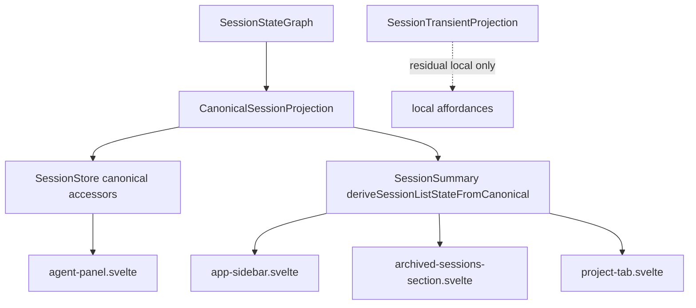

# refactor: Clear remaining GOD Svelte-check errors

## Overview

`packages/desktop` now passes the fast TypeScript gate, but `bun run check:svelte` still reports 13 errors in 5 files. Most of the remaining errors are not incidental type drift: they are proof that old UI surfaces still read lifecycle, connection, model, or activity truth from `SessionTransientProjection`, which the final GOD architecture has already shrunk to residual local-only state.

This plan clears that Svelte-check baseline by moving the affected readers to canonical-only projections and by fixing nearby Svelte type gaps that are not architecture decisions. The goal is not to make hot state compile again. The goal is deletion proof: Svelte components should no longer expect `SessionTransientProjection` to contain status, connection, turn, activity, or current-model truth.

## Problem Frame

The final GOD requirements define one product-state authority path: provider facts flow into the backend-owned canonical session graph, desktop stores consume revisioned canonical materializations, and UI projections render selector outputs. Frontend hot-state lifecycle authority is explicitly out of scope for the final architecture (see origin: `docs/brainstorms/2026-04-25-final-god-architecture-requirements.md`).

After the agent-panel viewport rewrite, the render-path Svelte errors were fixed, but broader GOD/sidebar/session-list Svelte errors remain. The current `check:svelte` output is useful migration evidence:

- `agent-panel-pre-composer-stack.svelte` references `SessionPrLinkMode` without importing it.
- `agent-panel.svelte` still reads `getHotState(sessionId)?.currentModel?.id`, passes a raw string where a canonical agent id is required, and passes a nullable title where the graph materializer requires a string.
- `archived-sessions-section.svelte`, `app-sidebar.svelte`, and `project-tab.svelte` build `SessionSummary` objects from removed `hot.status`, `hot.isConnected`, and `hot.turnState` fields.

Baseline error checklist for this plan:

| # | File | Baseline issue | Owning unit |
|---|------|----------------|-------------|
| 1 | `packages/desktop/src/lib/acp/components/agent-panel/components/agent-panel-pre-composer-stack.svelte` | Missing `SessionPrLinkMode` type import | Unit 1 |
| 2 | `packages/desktop/src/lib/acp/components/agent-panel/components/agent-panel.svelte` | `currentModel` read from `SessionTransientProjection` / hot state | Unit 2 |
| 3 | `packages/desktop/src/lib/acp/components/agent-panel/components/agent-panel.svelte` | Raw session agent id passed where `CanonicalAgentId | null` is required | Unit 1 |
| 4 | `packages/desktop/src/lib/acp/components/agent-panel/components/agent-panel.svelte` | Nullable display title passed where graph header input requires `string` | Unit 1 |
| 5 | `packages/desktop/src/lib/components/settings-page/sections/archived-sessions-section.svelte` | Removed `hot.status` field used for `SessionSummary.status` | Unit 4 |
| 6 | `packages/desktop/src/lib/components/settings-page/sections/archived-sessions-section.svelte` | Removed `hot.isConnected` field used for `SessionSummary.isConnected` | Unit 4 |
| 7 | `packages/desktop/src/lib/components/settings-page/sections/archived-sessions-section.svelte` | Removed `hot.turnState` field used for streaming summary derivation | Unit 4 |
| 8 | `packages/desktop/src/lib/components/main-app-view/components/sidebar/app-sidebar.svelte` | Removed `hot.status` field used for `SessionSummary.status` | Unit 4 |
| 9 | `packages/desktop/src/lib/components/main-app-view/components/sidebar/app-sidebar.svelte` | Removed `hot.isConnected` field used for `SessionSummary.isConnected` | Unit 4 |
| 10 | `packages/desktop/src/lib/components/main-app-view/components/sidebar/app-sidebar.svelte` | Removed `hot.turnState` field used for streaming summary derivation | Unit 4 |
| 11 | `packages/desktop/src/lib/components/settings/project-tab.svelte` | Removed `hot.status` field used for `SessionSummary.status` | Unit 4 |
| 12 | `packages/desktop/src/lib/components/settings/project-tab.svelte` | Removed `hot.isConnected` field used for `SessionSummary.isConnected` | Unit 4 |
| 13 | `packages/desktop/src/lib/components/settings/project-tab.svelte` | Removed `hot.turnState` field used for streaming summary derivation | Unit 4 |

## Requirements Trace

- R1, R4. Preserve one product-state authority path: canonical graph materialization -> desktop selectors -> UI.
- R12-R14. Derive desktop lifecycle, actionability, compact status, activity, model/mode availability, and status cells from canonical lifecycle/actionability/capability/activity selectors only.
- R23-R25. Keep desktop stores and renderers as consumers of canonical state, not semantic repair owners; renderer guards may avoid crashes but must not synthesize session semantics.
- R27. Provide deletion proof that product UI no longer depends on `SessionHotState` / `SessionTransientProjection` as lifecycle truth.
- R28a. Cover the TypeScript selector seam and presentation components with appropriate store/selector and component behavior tests.

## Scope Boundaries

- Do not re-add `status`, `isConnected`, `turnState`, `activity`, `currentModel`, `currentMode`, or capabilities to `SessionTransientProjection`.
- Do not add `canonical ?? hotState` fallbacks. If canonical projection is null, the reader should use a neutral non-authoritative presentation value or no session-specific value.
- Do not widen canonical projection in this plan unless research during implementation proves an actually missing canonical field. Current research shows the needed fields already exist.
- Do not redesign sidebar, settings, project-tab, or agent-panel UI copy. This is an authority/type cleanup, not a visual redesign.
- Do not address unrelated `check:svelte` warnings if new ones appear outside the 5-file baseline unless they are caused by this work.

## Context & Research

### Relevant Code and Patterns

- `packages/desktop/src/lib/acp/store/canonical-session-projection.ts` defines `CanonicalSessionProjection` with lifecycle, activity, turn state, active turn failure, last terminal turn id, capabilities, and revision.
- `packages/desktop/src/lib/acp/store/types.ts` defines `SessionTransientProjection` as residual local state only: `acpSessionId`, `autonomousTransition`, `modelPerMode`, `statusChangedAt`, `usageTelemetry`, `pendingSendIntent`, and `capabilityMutationState`.
- `packages/desktop/src/lib/acp/store/session-store.svelte.ts` already exposes canonical accessors: `getCanonicalSessionProjection`, `getSessionLifecycleStatus`, `getSessionTurnState`, `getSessionCurrentModelId`, `getSessionActiveTurnFailure`, and `getSessionLifecycleFailureReason`.
- `packages/desktop/src/lib/acp/components/agent-panel/logic/session-status-mapper.ts` already maps canonical lifecycle/activity/turn state for the agent panel, but it returns `SessionStatusUI` values for the agent-panel chrome and must not be reused for `SessionSummary.status`.
- `packages/desktop/src/lib/acp/application/dto/session-summary.ts` remains the compatibility DTO consumed by sidebar/settings/project list UI. It is the neutral home for a canonical-derived `SessionSummary` presentation helper because the consumers are not agent-panel internals.
- `packages/desktop/src/lib/acp/application/dto/session-linked-pr.ts` owns `SessionPrLinkMode`; `agent-panel-pre-composer-stack.svelte` currently uses the type without importing it.
- `packages/desktop/src/lib/acp/components/agent-panel/logic/connection-ui.ts` expects `CanonicalAgentId | null` for provider-specific failure copy.
- `packages/desktop/src/lib/acp/session-state/agent-panel-graph-materializer.ts` requires `AgentPanelGraphHeaderInput.title: string`, so `agent-panel.svelte` must normalize nullable display titles before passing them into scene materialization.

### Institutional Learnings

- `docs/solutions/architectural/canonical-projection-widening-2026-04-28.md` records that canonical projection now owns lifecycle, activity, turn state, active turn failure, last terminal turn id, and full capabilities. It forbids residual hot-state fallback for those fields.
- `docs/solutions/architectural/graph-backed-session-activity-authority-2026-04-23.md` requires queue, tab, sidebar, session item, and panel surfaces to consume graph-backed activity consistently instead of recomputing status independently.
- `docs/solutions/ui-bugs/agent-panel-composer-split-brain-canonical-actionability-2026-04-30.md` documents `deriveCanonicalAgentPanelSessionState` as the single actionability derivation and forbids `canonical ?? hotState` in agent-panel surfaces.
- `docs/solutions/best-practices/agent-panel-content-viewport-reactivity-renderer-2026-05-01.md` adds the concrete Svelte-check lesson from Plan 004: `bun run check` and `bun run check:svelte` catch different classes of errors, and new Svelte-only failures must be separated from legacy baseline noise.

### External References

No external research is needed. This is an internal authority cleanup with existing canonical selectors and Acepe-specific rules.

## Key Technical Decisions

- **Session list state gets a canonical selector helper beside `SessionSummary`.** Three surfaces repeat the same `SessionSummary` derivation. Add one helper in `packages/desktop/src/lib/acp/application/dto/session-summary.ts` that maps `CanonicalSessionProjection | null` into `{ status: SessionStatus; isConnected: boolean; isStreaming: boolean }`.
- **Null canonical projection is neutral, not hot-state fallback.** For list/sidebar rows where canonical is unavailable, the helper should return a non-authoritative idle/disconnected presentation so the UI stays safe without claiming lifecycle truth.
- **Ready + activity error is an error presentation.** In list/sidebar summaries, `lifecycle.status === "ready"` with `activity.kind === "error"` maps to `status: "error"`, `isConnected: false`, and `isStreaming: false`.
- **Use existing canonical accessors in `agent-panel.svelte`.** `sessionCurrentModelId` should call `getSessionCurrentModelId`, not inspect hot state. This keeps model/capability truth in canonical capabilities.
- **Empty string is the title fallback.** When `deriveAgentPanelHeaderDisplayTitle` returns `null`, pass `""` to the graph materializer so the visible behavior remains closest to the prior blank/null render instead of introducing placeholder copy.
- **Keep type-only fixes separate from authority fixes.** The missing `SessionPrLinkMode` import, canonical agent id typing, and nullable title normalization are necessary to clear Svelte-check, but they should not become a vehicle for broader UI changes.
- **Treat `check:svelte` as the proof gate.** Fast TypeScript already passes. This plan is complete only when `check:svelte` no longer reports the 13-error baseline across the 5 files above and no new Svelte errors are introduced by this work.

## Open Questions

### Resolved During Planning

- **Should the session-list/sidebar surfaces use hot-state fallback when canonical is missing?** No. GOD rules forbid that. Null canonical projection should become neutral presentation, not alternate session truth.
- **Is canonical projection missing the needed fields?** No. Lifecycle status, activity kind, turn state, and current model id are already available through projection/accessors.
- **Should this plan include broader GOD cleanup beyond the 13 Svelte-check errors?** No. The scope is deliberately bounded to the current Svelte-check baseline. Broader deletion proof can follow once this baseline is green.
- **Where should `deriveSessionListStateFromCanonical` live?** In `packages/desktop/src/lib/acp/application/dto/session-summary.ts`, because it derives fields for the `SessionSummary` DTO and is consumed by sidebar/settings/project list surfaces outside the agent-panel domain.
- **How should `activity.kind === "error"` render in session lists?** As `status: "error"`, `isConnected: false`, and `isStreaming: false`.
- **What title fallback should satisfy the graph materializer string contract?** Use `""` for `null` display titles to avoid introducing new visible placeholder copy.

### Deferred to Implementation

- **Exact test harness for sidebar/settings component coverage.** The plan requires proof for each affected surface, but the implementing agent may use existing component harnesses or add focused tests depending on what exists at execution time.

## High-Level Technical Design

> *This illustrates the target state after this plan and is directional guidance for review, not implementation specification. The implementing agent should treat it as context, not code to reproduce.*

The important boundary is the missing arrow: list/sidebar/panel surfaces do not read lifecycle, turn, activity, connection, or current-model truth from `SessionTransientProjection`.

`SessionTransientProjection` may still support residual local affordances such as ACP session id wiring, autonomous transition UI, model-per-mode local affordances, status timestamps, usage telemetry, pending-send intent, and capability mutation state. Those fields are not lifecycle, activity, connection, or current-model authority.

## Implementation Units

- [x] **Unit 1: Fix local Svelte type gaps**

**Goal:** Clear non-architectural Svelte type errors so the remaining work is focused on canonical authority.

**Requirements:** R23-R25

**Dependencies:** None

**Files:**
- Modify: `packages/desktop/src/lib/acp/components/agent-panel/components/agent-panel-pre-composer-stack.svelte`
- Modify: `packages/desktop/src/lib/acp/components/agent-panel/components/agent-panel.svelte`
- Test: Existing Svelte-check coverage; no new behavioral test expected unless implementation changes behavior

**Approach:**
- Import `SessionPrLinkMode` from the DTO module that defines PR-linking session state.
- Extend the existing ACP type import in `agent-panel.svelte` to cover canonical agent id typing for the `derivePanelErrorInfo` input.
- Normalize nullable display title to `""` before passing the header into graph scene materialization.
- Do not change PR-linking behavior, failure-copy behavior, or header display behavior beyond satisfying the declared contracts.
- R28a coverage is satisfied by Units 2-4 where canonical behavior changes occur.

**Patterns to follow:**
- `packages/desktop/src/lib/acp/application/dto/session-linked-pr.ts`
- `packages/desktop/src/lib/acp/components/agent-panel/logic/connection-ui.ts`
- `packages/desktop/src/lib/acp/session-state/agent-panel-graph-materializer.ts`

**Test scenarios:**
- Test expectation: none -- this unit repairs missing imports and type normalization without changing observable behavior.

**Verification:**
- The `SessionPrLinkMode`, canonical agent id, and nullable header title Svelte errors disappear without introducing new Svelte errors.

- [x] **Unit 2: Replace current-model hot-state read with canonical accessor**

**Goal:** Remove the `getHotState(sessionId)?.currentModel?.id` reader from `agent-panel.svelte`.

**Requirements:** R12-R13, R23-R24, R27

**Dependencies:** None. Unit 1 and Unit 2 both touch `agent-panel.svelte`, so they should be applied coherently, but Unit 2 does not causally depend on Unit 1.

**Files:**
- Modify: `packages/desktop/src/lib/acp/components/agent-panel/components/agent-panel.svelte`
- Test: `packages/desktop/src/lib/acp/store/__tests__/canonical-projection-accessors.test.ts`
- Test: `packages/desktop/src/lib/acp/components/agent-panel/components/__tests__/agent-panel-content.svelte.vitest.ts` if the model id path is already exercised there; otherwise add the narrowest focused test for `agent-panel.svelte` model-id propagation.

**Approach:**
- Use `sessionStore.getSessionCurrentModelId(sessionId)` for the current model id.
- Keep null behavior simple: no session id or no canonical capabilities yields `null`.
- Do not read capabilities or current model from `SessionTransientProjection`.

**Patterns to follow:**
- `packages/desktop/src/lib/acp/store/session-store.svelte.ts`
- `packages/desktop/src/lib/acp/store/__tests__/canonical-projection-accessors.test.ts`

**Test scenarios:**
- Happy path: canonical capabilities include a current model id; `agent-panel.svelte` obtains that id through `getSessionCurrentModelId` rather than hot state.
- Edge case: canonical projection or current model is absent; agent-panel receives `null` rather than a hot-state fallback.

**Verification:**
- Repo search in `agent-panel.svelte` no longer finds `getHotState` for current model.
- Existing canonical accessor tests still pass, or are extended if they do not cover current model id.

- [x] **Unit 3: Add canonical session-list presentation helper**

**Goal:** Provide one canonical-only derivation for the `SessionSummary` presentation fields still consumed by sidebar/settings/project list components.

**Requirements:** R12-R14, R23-R24, R27, R28a

**Dependencies:** None

**Files:**
- Modify: `packages/desktop/src/lib/acp/application/dto/session-summary.ts`
- Test: `packages/desktop/src/lib/acp/application/dto/session-summary.test.ts`

**Approach:**
- Add a helper that accepts `CanonicalSessionProjection | null`.
- Return exactly `{ status: SessionStatus; isConnected: boolean; isStreaming: boolean }`, where `SessionStatus` is imported from `packages/desktop/src/lib/acp/application/dto/session-status.ts`, not `SessionStatusUI`.
- Do not reuse `mapCanonicalSessionToPanelStatus` or `deriveCanonicalAgentPanelSessionState` as the base implementation. Those helpers return agent-panel `SessionStatusUI` values such as `warming`, `connected`, `running`, or `done`, which are not valid `SessionSummary.status` values.
- Map canonical lifecycle/activity/turn state to list summary fields:
  - null projection -> `status: "idle"`, `isConnected: false`, `isStreaming: false`
  - `lifecycle.status === "activating"` or `"reconnecting"` -> `status: "connecting"`, `isConnected: false`, `isStreaming: false`
  - `lifecycle.status === "failed"` -> `status: "error"`, `isConnected: false`, `isStreaming: false`
  - `lifecycle.status === "reserved"`, `"detached"`, or `"archived"` -> `status: "idle"`, `isConnected: false`, `isStreaming: false`
  - `lifecycle.status === "ready"` with `activity.kind === "error"` -> `status: "error"`, `isConnected: false`, `isStreaming: false`
  - `lifecycle.status === "ready"` with `activity.kind === "paused"` -> `status: "paused"`, `isConnected: true`, `isStreaming: false`
  - `lifecycle.status === "ready"` with `activity.kind === "running_operation"`, `"awaiting_model"`, or `"waiting_for_user"` -> `status: "streaming"`, `isConnected: true`, `isStreaming: true`
  - `lifecycle.status === "ready"` with `turnState === "Running"` -> `status: "streaming"`, `isConnected: true`, `isStreaming: true`
  - `lifecycle.status === "ready"` with `turnState === "Completed"` or `"Failed"` and idle activity -> `status: "ready"`, `isConnected: true`, `isStreaming: false`
  - `lifecycle.status === "ready"` with idle activity and idle turn -> `status: "ready"`, `isConnected: true`, `isStreaming: false`
- Keep this as a selector/presentation helper, not a new authority.

**Patterns to follow:**
- `packages/desktop/src/lib/acp/application/dto/session-summary.ts`
- `packages/desktop/src/lib/acp/store/live-session-work.ts`
- `docs/solutions/architectural/graph-backed-session-activity-authority-2026-04-23.md`

**Test scenarios:**
- Edge case: null canonical projection -> idle, disconnected, not streaming.
- Happy path: ready + idle + Idle turn -> ready, connected, not streaming.
- Happy path: ready + running_operation -> streaming, connected, streaming.
- Happy path: ready + awaiting_model -> streaming, connected, streaming.
- Happy path: ready + waiting_for_user -> streaming, connected, streaming.
- Edge case: ready + Running turn state even when activity is idle -> streaming, connected, streaming.
- Edge case: ready + activity.kind paused -> paused, connected, not streaming.
- Error path: ready + activity.kind error -> error, disconnected, not streaming.
- Edge case: ready + turnState Completed/Failed with idle activity -> ready, connected, not streaming.
- Error path: failed lifecycle -> error, disconnected, not streaming.
- Edge case: activating/reconnecting -> connecting, disconnected, not streaming.
- Edge case: reserved/detached/archived -> idle, disconnected, not streaming.

**Verification:**
- The helper has enough tests to encode the lifecycle/activity/turn mapping before it is used by UI components.
- No test fixture reintroduces removed `SessionTransientProjection` lifecycle fields.

- [x] **Unit 4: Move session summary surfaces to canonical helper**

**Goal:** Replace the remaining `hot.status`, `hot.isConnected`, and `hot.turnState` reads in sidebar/settings/project list surfaces.

**Requirements:** R12-R14, R23-R24, R27

**Dependencies:** Unit 3

**Files:**
- Modify: `packages/desktop/src/lib/components/settings-page/sections/archived-sessions-section.svelte`
- Modify: `packages/desktop/src/lib/components/main-app-view/components/sidebar/app-sidebar.svelte`
- Modify: `packages/desktop/src/lib/components/settings/project-tab.svelte`
- Test: `packages/desktop/src/lib/acp/application/dto/session-summary.test.ts`
- Test: Focused component coverage for each affected surface when an existing harness is available; otherwise document why the pure DTO helper test is the stable seam and add at least one render/path smoke test for the most central surface.

**Approach:**
- For each session list entry, read `sessionStore.getCanonicalSessionProjection(session.id)`.
- Feed that projection to the helper from Unit 3.
- Preserve existing `SessionSummary` shape and existing row sorting/filtering behavior.
- Do not read `getHotState` for lifecycle, connection, turn, or activity fields.

**Patterns to follow:**
- `packages/desktop/src/lib/acp/components/agent-panel/components/agent-panel-content.svelte` after Plan 004 review fixes: canonical-only turn/waiting derivation.
- `docs/solutions/ui-bugs/agent-panel-composer-split-brain-canonical-actionability-2026-04-30.md`

**Test scenarios:**
- Integration: a session list entry with canonical ready/idle projection renders as ready and not streaming in all three list surfaces.
- Integration: a session list entry with canonical running/awaiting projection renders as streaming consistently across sidebar, archived sessions, and project tab.
- Edge case: a session list entry without canonical projection renders neutral idle/disconnected values instead of reading hot state.

**Verification:**
- `rg "getHotState" packages/desktop/src/lib/components/settings-page/sections/archived-sessions-section.svelte packages/desktop/src/lib/components/main-app-view/components/sidebar/app-sidebar.svelte packages/desktop/src/lib/components/settings/project-tab.svelte` returns no hits.
- `rg "hot\\.(status|isConnected|turnState)|getHotState\\([^)]*\\)\\?\\.(status|isConnected|turnState)"` remains a supplementary field-specific check, not the only deletion proof.
- The three component Svelte-check errors are gone.

- [x] **Unit 5: Run deletion-proof verification and update baseline**

**Goal:** Prove this cleanup removed the current Svelte-check baseline without creating a new GOD violation.

**Requirements:** R27, R28a

**Dependencies:** Units 1-4

**Files:**
- Modify: `docs/plans/2026-05-01-005-refactor-god-svelte-check-cleanup-plan.md`
- Test: `packages/desktop` Svelte-check and relevant TypeScript/Vitest suites

**Approach:**
- Run `bun run check:svelte` from `packages/desktop` and compare to the captured 13-error baseline.
- Run the fast desktop check and relevant unit/component tests.
- Search for residual hot-state lifecycle/activity/current-model readers in the touched surfaces.
- Mark the implementation units complete only after proof is gathered.

**Patterns to follow:**
- `docs/solutions/best-practices/agent-panel-content-viewport-reactivity-renderer-2026-05-01.md` §8 on Svelte-check versus fast-check.
- `docs/solutions/architectural/canonical-projection-widening-2026-04-28.md` deletion-proof guidance.

**Test scenarios:**
- Integration: `check:svelte` no longer reports any of the 13 baseline errors enumerated in the Problem Frame.
- Integration: fast TypeScript check remains green.
- Integration: full or focused tests covering session status mapping, agent-panel content, sidebar/project settings surfaces, and canonical accessors remain green.

**Verification:**
- `bun run check:svelte` no longer reports the 13-error baseline across the 5 files identified in this plan.
- No new `SessionTransientProjection` lifecycle/capability fields are added.
- No new `canonical ?? hotState` fallback appears.

## System-Wide Impact

- **Interaction graph:** Sidebar, settings archived sessions, project tab, and agent-panel header/model surfaces all shift to canonical selectors/accessors for session summary state.
- **Error propagation:** Connection/failure copy still flows through existing `derivePanelErrorInfo`; this plan only satisfies its canonical id type contract.
- **State lifecycle risks:** Null canonical projection must not become a synthetic lifecycle. The helper returns neutral presentation only and should not be treated as session truth.
- **API surface parity:** `SessionSummary` remains the DTO shape consumed by current UI. Only its derivation changes.
- **Integration coverage:** The DTO helper test must encode the lifecycle/activity/turn matrix, and execution must add focused render/path coverage where an existing component harness can exercise the affected surface without brittle setup.
- **Unchanged invariants:** `SessionTransientProjection` remains residual local state. Canonical projection remains Rust/envelope-authored; this plan does not synthesize canonical projections or write hot state.

## Risks & Dependencies

| Risk | Mitigation |
|------|------------|
| Neutral null-canonical rows hide a missing projection bug | Keep null behavior presentation-only and rely on deletion proof/searches. If a real session lacks canonical projection unexpectedly, fix upstream emission rather than adding fallback. |
| Helper duplicates agent-panel-only status mapping semantics | Place it beside `SessionSummary`, return `SessionStatus` explicitly, and do not reuse `SessionStatusUI` helpers as the base implementation. |
| Sidebar/settings behavior changes subtly | Preserve `SessionSummary` shape and add focused render/path coverage where existing component harnesses make that stable. |
| `check:svelte` reveals new errors after the 13 are fixed | Treat new errors as separate from this baseline unless they are introduced by this plan's files. |

## Documentation / Operational Notes

- Update this plan's checkboxes during execution.
- No user-facing docs are required unless the mapping changes visible status copy, which is out of scope.
- If this cleanup surfaces additional GOD drift, create a follow-up plan rather than expanding this one opportunistically.

## Sources & References

- **Origin document:** [docs/brainstorms/2026-04-25-final-god-architecture-requirements.md](../brainstorms/2026-04-25-final-god-architecture-requirements.md)
- `packages/desktop/src/lib/acp/store/canonical-session-projection.ts`
- `packages/desktop/src/lib/acp/store/session-store.svelte.ts`
- `packages/desktop/src/lib/acp/store/types.ts`
- `packages/desktop/src/lib/acp/components/agent-panel/logic/session-status-mapper.ts`
- `packages/desktop/src/lib/acp/components/agent-panel/components/agent-panel.svelte`
- `packages/desktop/src/lib/components/main-app-view/components/sidebar/app-sidebar.svelte`
- `packages/desktop/src/lib/components/settings-page/sections/archived-sessions-section.svelte`
- `packages/desktop/src/lib/components/settings/project-tab.svelte`
- `docs/solutions/architectural/canonical-projection-widening-2026-04-28.md`
- `docs/solutions/architectural/graph-backed-session-activity-authority-2026-04-23.md`
- `docs/solutions/ui-bugs/agent-panel-composer-split-brain-canonical-actionability-2026-04-30.md`
- `docs/solutions/best-practices/agent-panel-content-viewport-reactivity-renderer-2026-05-01.md`
