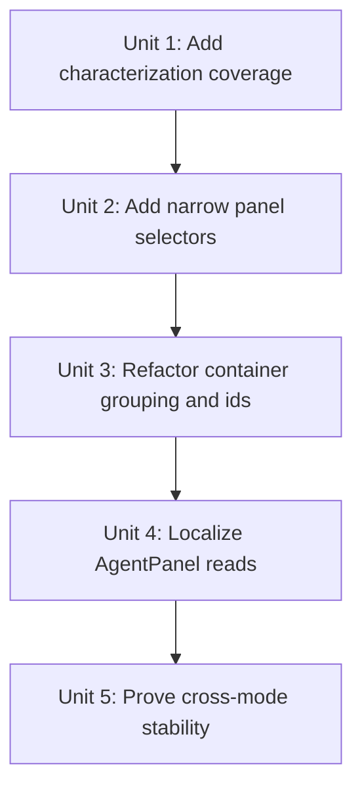
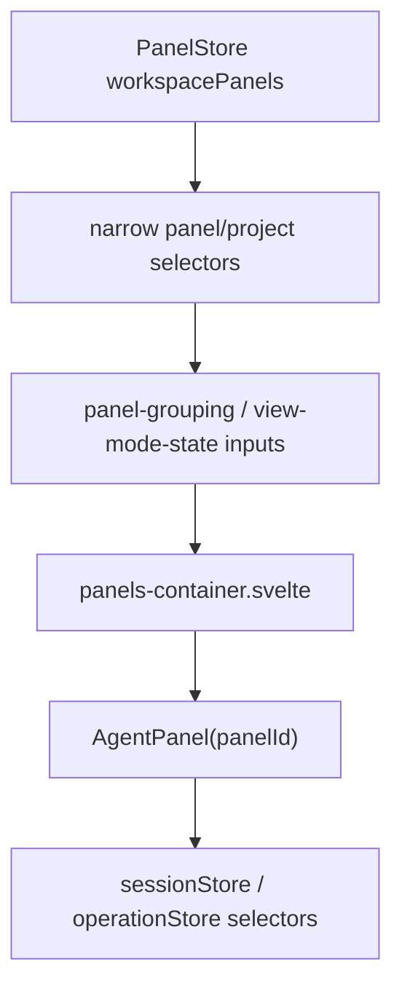

# refactor: Isolate agent-panel reactivity by panel id

## Overview

Changing the project on one disconnected agent panel currently causes sibling agent panels to flicker because the render path rebuilds fat per-panel objects for every top-level panel on any agent-panel mutation. The fix is not a visual patch. It is an authority-boundary refactor: keep `workspacePanels` as the canonical structural list, but stop using one coarse `Panel[] -> mapped object[] -> grouped object[]` projection as the reactive input for every agent panel in `panels-container.svelte`.

This plan introduces id-addressed panel render inputs, narrow panel/project/group selectors, and container rendering keyed by stable panel ids so local panel changes invalidate only the affected panel unless there is a real structural change such as open, close, reorder, or cross-project move.

## Problem Frame

Acepe's GOD architecture requires one owner per concern and forbids UI projections from becoming hidden semantic authority (see origin: `docs/brainstorms/2026-04-25-final-god-architecture-requirements.md`). The current multi-panel render path violates that principle at the desktop UI layer:

- `PanelStore` keeps canonical structural panel state in `workspacePanels`.
- `panels-container.svelte` immediately remaps that structure into `panelsWithState`, spreading panel data and hot state into fresh objects for every panel.
- Grouping, fullscreen lookup, and project metadata then derive from those rebuilt objects.
- A local change such as `setPanelProjectPath(panelId, projectPath)` reassigns the underlying panel list, which forces the whole projection chain to rebuild and causes every sibling `AgentPanel` to re-evaluate.

The visible result is flicker in unrelated agent panels when an unconnected panel changes project. The architectural problem is broader: structure and local state are flowing through the same coarse reactive channel.

## Requirements Trace

**Reactive isolation**

- **R1.** Changing local state for one top-level agent panel must not invalidate sibling agent-panel render graphs unless the change is structurally relevant to those siblings.
- **R4.** `panels-container.svelte` must iterate stable panel ids for agent panels and avoid allocating fresh fat panel render objects for unaffected siblings on every agent-panel mutation.

**Data model and grouping authority**

- **R2.** `workspacePanels` remains the canonical structural authority for top-level panel order, panel existence, fullscreen eligibility, and workspace persistence.
- **R3.** Grouping for project/single/multi layout must derive from a narrow project-assignment projection, not from fat per-panel render objects.

**Component reads**

- **R5.** `AgentPanel` should consume its own narrow panel/session state through existing or newly added store selectors rather than depending on a parent-owned mapped object for panel-local facts.

**Preservation and verification**

- **R6.** Existing semantics for fullscreen, focused project mode, multi-project cards, aux panels, review mode, attached files, and pending project selection must remain unchanged.
- **R7.** Behavioral tests must prove sibling stability across project selection and other non-structural agent-panel mutations, not just source shape.

## Scope Boundaries

- Do not replace `workspacePanels` with a second canonical registry. This plan narrows selectors over the existing authority instead of creating a parallel truth system.
- Do not redesign the project card, project badge, or fullscreen UI.
- Do not rewrite non-agent panel families into the same selector shape unless the work is required to keep grouped layout semantics coherent.
- Do not broaden this into a full `PanelStore` domain split. That is adjacent work covered by `docs/plans/2026-04-18-004-refactor-thin-desktop-panel-orchestration-plan.md`.
- Do not introduce `canonical ?? fallback` style UI authority. Neutral defaults are acceptable for missing local projections; duplicate authority is not.

## Context & Research

### Relevant Code and Patterns

- `packages/desktop/src/lib/acp/store/panel-store.svelte.ts` is the canonical owner of `workspacePanels`, focus, fullscreen, and panel lifecycle.
- `packages/desktop/src/lib/components/main-app-view/components/content/panels-container.svelte` currently creates `panelsWithState` by mapping all panels plus hot state into fresh objects, then derives `allGroups`, `viewModeState`, fullscreen snapshots, and grouped rendering from those rebuilt objects.
- `packages/desktop/src/lib/components/main-app-view/components/content/panel-grouping.ts` already shows the right separation for grouping as a pure projection over narrow panel/group inputs.
- `packages/desktop/src/lib/acp/logic/view-mode-state.ts` already depends only on minimal `{ id, projectPath }` panel refs and group refs; it does not require fat panel render objects.
- `packages/desktop/src/lib/acp/components/agent-panel/components/agent-panel.svelte` already reads much of its state from stores (`sessionStore`, `panelStore`, `operationStore`) and documents how parent-driven churn can cause visible flicker in local derived UI.
- `packages/desktop/src/lib/acp/store/__tests__/panel-store-workspace-panels.vitest.ts` and `packages/desktop/src/lib/acp/store/__tests__/workspace-fullscreen-migration.test.ts` are the strongest characterization anchors for preserving workspace panel semantics while narrowing selectors.
- `docs/plans/2026-03-30-001-refactor-panels-container-render-paths-plan.md` is related prior art for deduplicating `panels-container` render topology without breaking mount stability. This plan builds underneath that work by narrowing the reactive inputs first.

### Institutional Learnings

- `docs/solutions/best-practices/provider-owned-policy-and-identity-not-ui-projections-2026-04-09.md` — UI projections must not become the hidden owner of policy or identity.
- `docs/solutions/architectural/final-god-architecture-2026-04-25.md` — structure changes structure; projection layers consume canonical state instead of reconstructing it.
- `docs/solutions/best-practices/agent-panel-content-viewport-reactivity-renderer-2026-05-01.md` — broad reactive broadcasts create visible sibling invalidation and should be replaced with local ownership.

### External References

- None. The repo already contains the relevant architectural guidance and local patterns.

## Key Technical Decisions

| Decision | Rationale |
|---|---|
| Keep `workspacePanels` as canonical structural authority | This preserves one owner for panel existence, order, fullscreen targeting, and persistence. |
| Add narrow agent-panel selectors instead of rebuilding `panelsWithState` objects | The container needs stable ids and small per-panel projections, not merged hot-state/render DTOs. |
| Derive grouping from project assignment refs keyed by panel id | Grouping should react only to project membership and order, not to unrelated panel-local fields. |
| Pass only `panelId` as the panel-local render handle to `AgentPanel` and move panel-local reads into the child | The current `{#each}` already keys by panel id; the actual fix is eliminating fat panel render objects from the reactive input so unaffected siblings can keep stable references. |
| Keep aux panel/group layout semantics unchanged while narrowing agent-panel inputs first | The user-visible bug is sibling flicker in agent panels; layout semantics should stay intact while the reactive boundary is fixed. |
| Prefer characterization-first testing | This refactor changes invalidation shape, so proof must be behavioral rather than inferred from code structure. |

## Open Questions

### Resolved During Planning

- **Should this work create a second canonical panel registry beside `workspacePanels`?** No. Add narrow selectors/indexes over the existing store instead of creating a parallel authority.
- **Does `view-mode-state.ts` need fat agent-panel objects?** No. It already accepts minimal panel refs and group refs.
- **Should project metadata continue to be repeatedly looked up with `projectManager.projects.find(...)` in the template?** No. The container should derive a stable project metadata lookup once and reuse it.
- **Should `AgentPanel` become completely parent-data-free?** Not necessarily. Environment-wide inputs such as the project catalog and available agent list can stay shared, but panel-local facts should come from narrow selectors by `panelId`.

### Deferred to Implementation

- The exact selector surface names in `PanelStore` if implementation reveals a clearer local naming pattern than `getAgentPanelRenderRef` / `getAgentPanelProjectRef`.
- Whether the final grouped render path is best expressed as a small pure helper module or as a thinner set of local `$derived` blocks in `panels-container.svelte`.
- Whether non-agent group consumers should adopt the same stable project metadata lookup in the same PR or a short follow-up cleanup.

## High-Level Technical Design

> *This illustrates the intended approach and is directional guidance for review, not implementation specification. The implementing agent should treat it as context, not code to reproduce.*

```text
CURRENT

workspacePanels
  -> panelsWithState (map every panel + hot state into fresh objects)
  -> allGroups
  -> fullscreen snapshot
  -> AgentPanel props for every sibling

LOCAL MUTATION ON PANEL C
  -> rebuild A, B, C render objects
  -> sibling re-evaluation / flicker


TARGET

workspacePanels (canonical structure)
  -> topLevelAgentPanelIds
  -> projectAssignmentRefs { panelId, projectPath, sequenceId }
  -> groupedPanelIds
  -> AgentPanel panelId={id}

AgentPanel(panelId)
  -> narrow panel selector
  -> narrow session selectors
  -> local derived UI

LOCAL MUTATION ON PANEL C
  -> update panel C selector
  -> regroup only if project membership changed
  -> panel A/B stay stable unless structure really changed
```

## Implementation Dependency Graph



## Implementation Units

- [ ] **Unit 1: Add characterization coverage for sibling invalidation**

**Goal:** Freeze the current failure mode and the invariants the refactor must preserve before changing the render pipeline.

**Requirements:** R1, R6, R7

**Dependencies:** None

**Files:**
- Modify: `packages/desktop/src/lib/components/main-app-view/components/content/panels-container.component.test.ts`
- Modify: `packages/desktop/src/lib/acp/store/__tests__/panel-store-workspace-panels.vitest.ts`
- Modify: `packages/desktop/src/lib/acp/store/__tests__/workspace-fullscreen-migration.test.ts`

**Approach:**
- Add a real component-level test for `panels-container.svelte` that mounts multiple agent panels and counts sibling renders/mount continuity under non-structural mutations.
- Characterize at least the disconnected-project-selection case that currently flickers, plus one non-project local mutation such as agent selection or pending project-selection clearing.
- Keep the existing workspace-panel tests focused on canonical store semantics while adding assertions that the new selector path does not change fullscreen/focus/workspace behavior.
- If the earlier render-path refactor has not yet created `panels-container.component.test.ts`, create that file and seed both characterization suites there instead of forking a second test harness.

**Execution note:** Start with a failing characterization test for sibling stability before changing the selector shape.

**Patterns to follow:**
- `packages/desktop/src/lib/acp/store/__tests__/panel-store-workspace-panels.vitest.ts`
- `packages/desktop/src/lib/components/main-app-view/components/content/panels-container-hydration-action.test.ts`
- `docs/plans/2026-03-30-001-refactor-panels-container-render-paths-plan.md`

**Test scenarios:**
- Happy path: changing the project on one disconnected panel updates only that panel's visible project-selection state while sibling agent panels remain mounted and visually stable.
- Happy path: changing agent selection on one disconnected panel does not trigger sibling remounts.
- Edge case: a cross-project move re-groups only the moved panel while unaffected siblings in other groups keep stable keys.
- Integration: focused project mode still shows the same visible project after a project-path change on a non-focused disconnected panel.
- Integration: fullscreen and single-mode restoration semantics remain unchanged after the selector refactor.

**Verification:**
- The new test fails on the current broad invalidation path and passes once sibling updates are isolated.

- [ ] **Unit 2: Add narrow agent-panel and project-assignment selectors to `PanelStore`**

**Goal:** Expose minimal, stable, panel-id-addressed projections so the container no longer needs to rebuild fat render objects.

**Requirements:** R1, R2, R3, R5

**Dependencies:** Unit 1

**Files:**
- Modify: `packages/desktop/src/lib/acp/store/panel-store.svelte.ts`
- Modify: `packages/desktop/src/lib/acp/store/types.ts`
- Add: `packages/desktop/src/lib/acp/store/__tests__/panel-store-agent-selectors.vitest.ts`

**Approach:**
- Add selector-style accessors for top-level agent panel ids, panel-local structural refs, and project-assignment refs keyed by panel id.
- Keep `workspacePanels` as the only structural source of truth; the new selectors are thin projections, not duplicated state.
- Ensure the selectors expose only the fields the container actually needs for ordering, grouping, fullscreen resolution, and panel-local lookup.
- Avoid selector shapes that merge hot state and structural data into a new all-panels array.

**Patterns to follow:**
- `packages/desktop/src/lib/acp/logic/view-mode-state.ts`
- Existing `PanelStore` getters such as `getTopLevelWorkspacePanels()` and `getTopLevelPanel(...)`

**Test scenarios:**
- Happy path: top-level agent panel ids preserve workspace order.
- Happy path: a project-path update changes only the moved panel's project-assignment ref.
- Edge case: pending project-selection panels with `projectPath: null` still appear in the selector set with neutral grouping semantics.
- Integration: updating panel session metadata does not alter unrelated panel assignment refs.
- Integration: closing or opening panels updates selector order consistently with canonical `workspacePanels`.

**Verification:**
- `panels-container.svelte` can obtain top-level agent ids and grouping refs without constructing `panelsWithState`.

- [ ] **Unit 3: Refactor `panels-container` to render grouped stable panel ids**

**Goal:** Replace the current all-panels mapped-object render input with grouped stable panel ids and a stable project metadata lookup.

**Requirements:** R1, R3, R4, R6

**Dependencies:** Unit 2

**Files:**
- Modify: `packages/desktop/src/lib/components/main-app-view/components/content/panels-container.svelte`
- Modify: `packages/desktop/src/lib/components/main-app-view/components/content/panel-grouping.ts`
- Add: `packages/desktop/src/lib/components/main-app-view/components/content/panels-container-grouping.vitest.ts`

**Approach:**
- Remove `panelsWithState` as the authoritative grouped render input.
- Introduce a narrow container projection over agent panel ids and project assignment refs that feeds grouping and `getViewModeState(...)`.
- Precompute a stable project metadata lookup from `projectManager.projects` so the template stops repeatedly scanning the project list inline.
- Keep grouped aux panel rendering and fullscreen selection semantics intact, but have agent-panel loops iterate ids keyed by `panelId` rather than fat objects.
- Remove the two dev-only `$effect` logging blocks that iterate `panelsWithState`; replace them with focused debug reads only if the narrower selector path still needs development diagnostics.

**Technical design:** *(directional guidance, not implementation specification)*
- Container-level group items should look like `projectPath + panelIds[] + project metadata`, not `projectPath + full panel objects[]`.
- Fullscreen resolution should use a narrow lookup from `panelId -> projectPath/sessionId/width` instead of a rebuilt snapshot object graph.

**Patterns to follow:**
- `packages/desktop/src/lib/components/main-app-view/components/content/panel-grouping.ts`
- `packages/desktop/src/lib/acp/logic/view-mode-state.ts`

**Test scenarios:**
- Happy path: multi-project mode renders all groups from stable panel ids and preserves project ordering rules.
- Happy path: project mode hides non-active groups without rebuilding unrelated agent-panel ids.
- Edge case: cross-project moves update only the relevant group memberships.
- Integration: explicit fullscreen agent selection still resolves the same panel and project metadata.
- Integration: aux-only fullscreen paths keep their current behavior while agent panels move to id-based rendering.

**Verification:**
- `panels-container.svelte` no longer allocates a `panelsWithState` array of fresh fat panel render objects on each agent-panel mutation.

- [ ] **Unit 4: Localize panel-local reads inside `AgentPanel`**

**Goal:** Ensure panel-local facts are read by `AgentPanel` from narrow selectors keyed by `panelId` instead of being parent-owned mapped object fields.

**Requirements:** R1, R4, R5, R6

**Dependencies:** Unit 3

**Files:**
- Modify: `packages/desktop/src/lib/acp/components/agent-panel/components/agent-panel.svelte`
- Modify: `packages/desktop/src/lib/acp/components/agent-panel/types/agent-panel-props.ts`
- Modify: `packages/desktop/src/lib/acp/components/agent-panel/__tests__/agent-panel-component.test.ts`
- Modify: `packages/desktop/src/routes/test-agent-panel/+page.svelte`
- Modify: `packages/desktop/src/lib/test/test-agent-panel-view.svelte`

**Approach:**
- Audit which current `AgentPanel` props are panel-local versus environment-wide.
- Move panel-local reads such as selected agent, pending project selection context, and panel structural state to narrow store selectors by `panelId` where doing so reduces sibling invalidation.
- Keep genuinely shared environment inputs, such as the project catalog and available agent list, as shared props or context if that remains the simplest stable boundary.
- Preserve current action wiring and avoid introducing a second owner for panel lifecycle.

**Patterns to follow:**
- Existing `AgentPanel` store-selector usage inside `agent-panel.svelte`
- `docs/solutions/best-practices/provider-owned-policy-and-identity-not-ui-projections-2026-04-09.md`

**Test scenarios:**
- Happy path: an `AgentPanel` can derive its panel-local state from `panelId` without parent-mapped panel objects.
- Edge case: disconnected panels with `sessionId: null` still render project selection, agent selection, and pending-worktree state correctly.
- Integration: attached file panels, review mode, and fullscreen focus behavior remain intact after prop narrowing.
- Integration: parent re-renders with unchanged `panelId` do not reset panel-local derived UI.

**Verification:**
- The parent no longer owns fat panel render objects that duplicate store-owned state for each `AgentPanel`.

- [ ] **Unit 5: Prove stability across project, single, and fullscreen modes**

**Goal:** Close the refactor with behavior tests that prove the new reactive boundary preserves layout semantics while eliminating sibling flicker.

**Requirements:** R1, R6, R7

**Dependencies:** Units 1 through 4

**Files:**
- Modify: `packages/desktop/src/lib/components/main-app-view/components/content/panels-container.component.test.ts`
- Modify: `packages/desktop/src/lib/components/main-app-view/components/content/panels-container-grouping.vitest.ts`
- Modify: `packages/desktop/src/lib/acp/store/__tests__/workspace-fullscreen-migration.test.ts`

**Approach:**
- Extend characterization tests into final proof cases for multi/project/single/fullscreen behavior.
- Verify that the fix is specific: non-structural mutations stay local, while structural events still regroup or retarget the correct panels.
- Ensure the proof suite names the behavioral contract explicitly so future render-path changes do not reintroduce broad invalidation.

**Patterns to follow:**
- `packages/desktop/src/lib/acp/store/__tests__/workspace-fullscreen-migration.test.ts`
- `packages/desktop/src/lib/acp/logic/__tests__/view-mode-state.test.ts`

**Test scenarios:**
- Happy path: in multi mode, changing one disconnected panel's project does not cause unrelated sibling agent panels to remount or visibly re-render.
- Happy path: in project mode, hidden groups stay mounted and unaffected siblings remain stable.
- Edge case: in single/fullscreen mode, the focused panel remains authoritative and auxiliary layout behavior is unchanged.
- Error path: selector reads for removed panels resolve safely after close without causing teardown crashes or stale fullscreen refs.
- Integration: opening, closing, and cross-project moves still update the correct groups and focused project path.

**Verification:**
- The final test suite proves both halves of the contract: local mutations stay local, and real structural changes still propagate correctly.

## System-Wide Impact



- **Interaction graph:** `setPanelProjectPath()` and similar local panel mutations should affect narrow selector outputs first, then regroup only where project membership or structural visibility actually changes.
- **Error propagation:** missing panel ids after close or fullscreen changes should resolve to safe neutral lookups in the container rather than stale mapped-object reads.
- **State lifecycle risks:** cross-project moves, focus/fullscreen restoration, and pending project selection are the highest-risk transitions because they combine structural and local panel state.
- **API surface parity:** `getViewModeState(...)`, `panel-grouping.ts`, and container fullscreen helpers all need to keep working from minimal refs instead of fat panel objects.
- **Integration coverage:** the proof suite must cover disconnected project selection, grouped mode, focused project mode, single/fullscreen mode, open/close, and cross-project regrouping.
- **Unchanged invariants:** `workspacePanels` remains the canonical structural list; workspace persistence, fullscreen semantics, and non-agent panel behavior do not gain a second authority path.

## Risks & Dependencies

| Risk | Mitigation |
|------|------------|
| A new selector layer accidentally becomes a parallel panel authority | Keep selectors as thin projections over `workspacePanels` with tests that preserve canonical ordering and lifecycle semantics. |
| Grouped layout semantics regress while narrowing agent-panel inputs | Characterization-first tests lock project/single/fullscreen behavior before the refactor lands. |
| Parent/child responsibility shifts break `AgentPanel` features such as review mode or attached files | Narrow only panel-local facts; keep shared environment inputs stable and add focused `AgentPanel` behavior coverage. |
| Cross-project moves still need structural updates and may be mistaken for sibling-stability regressions | Explicitly test the difference between local non-structural mutations and structural regrouping events. |

## Documentation / Operational Notes

- If implementation introduces new selector surfaces on `PanelStore`, update any nearby store documentation/comments so future render work uses the narrow selectors instead of recreating `panelsWithState`.
- If this refactor materially supersedes assumptions in `docs/plans/2026-03-30-001-refactor-panels-container-render-paths-plan.md`, add a superseded-by or related-plan note there during execution.

## Sources & References

- **Origin document:** `docs/brainstorms/2026-04-25-final-god-architecture-requirements.md`
- Related plan: `docs/plans/2026-03-30-001-refactor-panels-container-render-paths-plan.md`
- Related plan: `docs/plans/2026-04-18-004-refactor-thin-desktop-panel-orchestration-plan.md`
- Related code: `packages/desktop/src/lib/acp/store/panel-store.svelte.ts`
- Related code: `packages/desktop/src/lib/components/main-app-view/components/content/panels-container.svelte`
- Related code: `packages/desktop/src/lib/components/main-app-view/components/content/panel-grouping.ts`
- Related code: `packages/desktop/src/lib/acp/logic/view-mode-state.ts`
