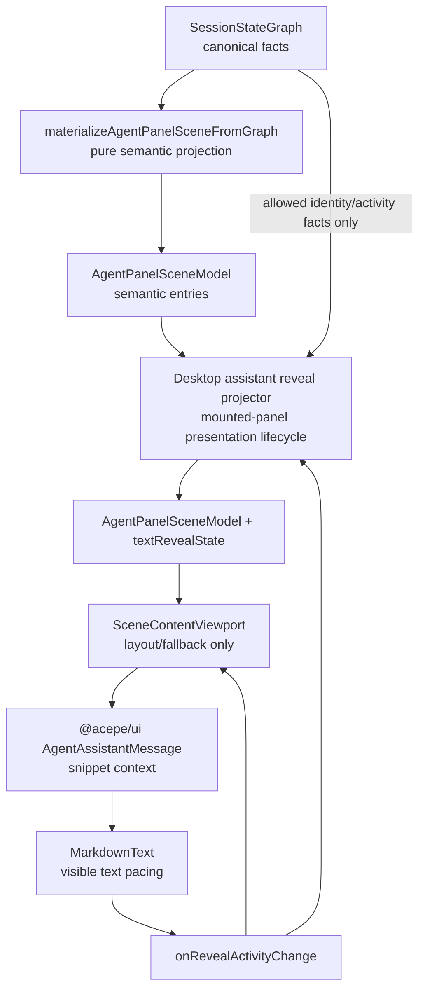

# fix: Pace assistant reveal with a presentation projector

## Overview

The assistant text can still appear as one final block because the current renderer treats canonical `isStreaming` as both session activity and text reveal policy. When a provider buffers a large assistant continuation, or when the UI first mounts/remounts after the turn has already completed, `MarkdownText` may never observe a local streaming session and therefore renders the settled markdown immediately.

The clean architecture is not to push reveal freshness into the canonical graph or into the pure graph materializer. Instead, keep the graph and materializer semantic, then add a desktop presentation projector that observes scene transitions in the mounted panel and decorates the current assistant row with presentation-only reveal state.

## Problem Frame

The user-visible failure is not primarily flicker. The core failure is: the current assistant response sometimes does not pace in at all. It stays absent or placeholder-sized, then the full final markdown block appears in one go. Flicker and height instability are side effects of renderer/viewport churn around a missing reveal lifecycle.

The April streaming-markdown requirements require live markdown to preserve reveal timing and never bypass animation (see origin: `docs/brainstorms/2026-04-15-streaming-markdown-during-reveal-requirements.md`). The May content reliability requirements require the viewport to stay layout-owned and scene-owned, not semantic-authority-owned (see `docs/brainstorms/2026-05-01-agent-panel-content-reliability-rewrite-requirements.md`). The plan therefore keeps row semantics out of `SceneContentViewport` and keeps presentation transition memory out of `SessionStateGraph`.

## Requirements Trace

- R1. Current assistant response text must be reveal-paced even when the full source text arrives before the component observes `isStreaming: true`.
- R2. Historical/restored assistant messages must render settled content immediately; cold-open completed sessions must not replay old assistant text.
- R3. `SessionStateGraph` and `materializeAgentPanelSceneFromGraph` must remain semantic authorities only. They must not own mounted-panel reveal freshness.
- R4. Presentation reveal state must be scoped to the mounted desktop panel, `sessionId`, assistant entry id, and scene transition history observed by that panel.
- R5. Live markdown must render only the controller's visible text; unrevealed source text must not influence displayed or accessible text.
- R6. The viewport may preserve active reveals from remount/fallback churn, but it must not decide row semantics or infer streaming identity.
- R7. Reduced-motion users must see the full content synchronously before the first paced frame; smooth/instant semantics must remain predictable.
- R8. The reveal start must not collapse the row to a blank/zero-height state.
- R9. Regressions must deterministically exercise the failure through the full path: completed/full-source current assistant -> presentation projector -> shared UI contract -> `MarkdownText` -> viewport protection.

## Scope Boundaries

- Do not redesign the markdown renderer or implement a new incremental parser.
- Do not add reveal freshness to `SessionStateGraph`.
- Do not make `materializeAgentPanelSceneFromGraph` stateful.
- Do not make `SceneContentViewport` the source of streaming/reveal truth.
- Do not introduce `canonical ?? hotState` fallbacks, client-side canonical synthesis, or provider-specific TypeScript branches.
- Do not make all completed assistant rows replay. Presentation reveal state applies only to responses observed live in the mounted panel.
- Do not solve unrelated long-session virtualization or broad content-viewport rewrite work in this slice.

## Context & Research

### Relevant Code and Patterns

- `packages/desktop/src/lib/acp/session-state/agent-panel-graph-materializer.ts` already maps canonical `SessionStateGraph` into `AgentPanelSceneModel`. It should stay pure and semantic.
- `packages/desktop/src/lib/acp/components/agent-panel/components/agent-panel.svelte` is the controller layer that already composes `sessionStateGraph`, `materializeAgentPanelSceneFromGraph`, and `AgentPanelContent`; this is the right place to host mounted-panel presentation transition state.
- `packages/ui/src/components/agent-panel/types.ts` defines `AgentAssistantEntry` and `AssistantRenderBlockContext`, the shared contract that desktop uses to inject host-specific markdown rendering.
- `packages/ui/src/components/agent-panel/agent-assistant-message.svelte` passes `isStreaming` and `revealKey` to the desktop render snippet, but has no distinct presentation reveal field.
- `packages/desktop/src/lib/acp/components/messages/markdown-text.svelte` currently starts a reveal only after it personally observes a streaming session; completed text with no local streaming history resets into settled rendering.
- `packages/desktop/src/lib/acp/components/messages/logic/create-streaming-reveal-controller.svelte.ts` owns pacing and should remain the place where visible text advances.
- `packages/desktop/src/lib/acp/components/agent-panel/components/scene-content-viewport.svelte` owns virtualization/native fallback/follow behavior; it should only consume reveal activity/presentation metadata, not infer content semantics.
- `packages/desktop/src/lib/acp/components/agent-panel/logic/virtualized-entry-display.ts` merges assistant entries into display rows and must preserve presentation fields when grouping.

### Institutional Learnings

- `docs/solutions/best-practices/canonical-session-projection-ui-derivation-2026-05-01.md`: UI-visible session truth must come from canonical projection, not hot-state fallbacks.
- `docs/solutions/best-practices/agent-panel-content-viewport-reactivity-renderer-2026-05-01.md`: viewport rows should stay scene-owned and timer-local; shared snippet context belongs in the shared contract; viewport must not own row semantics.
- `docs/solutions/architectural/final-god-architecture-2026-04-25.md`: canonical graph owns product truth; desktop stores/selectors/projectors produce presentation-safe UI DTOs; UI components render DTOs.

### External References

- External research is not needed. The problem is an internal state/contract boundary defect with strong local patterns and explicit existing requirements.

## Key Technical Decisions

- Keep the authority chain: `SessionStateGraph -> pure scene materializer -> desktop presentation projector -> viewport/MarkdownText`.
- Add a presentation-only shared field named `textRevealState`, not `revealIntent`. `intent` sounds semantic; `textRevealState` makes the ownership and scope explicit.
- Represent the presentation contract as `textRevealState?: { policy: "pace"; key: string }`. Absence means settled rendering.
- The presentation projector observes scene transitions while the panel is mounted. It records assistant ids that were observed as canonical-live, carries them through immediate completion, and clears them when reveal activity drains or identity changes.
- The projector may read only the minimal canonical identity/activity facts needed to bind mounted-panel presentation state: `sessionId`, `turnState`, `activity.kind`, and `lastAgentMessageId` when present. It must use the semantic scene for entries/content/order and must not become a second graph materializer.
- If the panel observes a live turn before an assistant id exists, the projector may hold a presentation-only pending reveal marker anchored to the semantic scene's latest user/turn boundary, then bind it to the first matching assistant entry that appears in that observed-live turn. If the first projector observation is already a completed cold scene, no marker is created and no replay happens.
- `materializeAgentPanelSceneFromGraph` remains a pure function of canonical inputs and does not read or mutate projector state.
- `SceneContentViewport` may use `textRevealState` only to protect layout/fallback while the child reveal initializes and runs. It must not create or infer reveal state.
- `MarkdownText` obeys explicit `textRevealState`; it does not infer "current response" from canonical session state, tail position, or local streaming history alone.

## Open Questions

### Resolved During Planning

- **Should reveal freshness live in canonical graph?** No. The canonical graph owns provider/session facts. "This mounted panel saw this response begin live and still owes a reveal" is presentation lifecycle.
- **Should reveal freshness live in the pure materializer?** No. A cold completed graph and an immediately completed graph can be semantically identical. Freshness requires observed transition history, so it belongs after pure materialization.
- **Should viewport fallback be the primary fix?** No. Viewport fallback can protect an active reveal, but it cannot make a first-mounted completed response reveal.
- **Should cross-mount progress caches be the main fix?** No. They can preserve a reveal across remounts but do not solve the first-mount completed/full-source case and risk replaying historical messages.
- **What field name should the shared contract use?** Use `textRevealState`.
- **Are task-child assistant entries in scope?** Yes for contract propagation only. If an assistant entry is copied through task-child mapping, optional `textRevealState` must be copied.
- **What about responses that complete before the panel ever observes a live turn?** Treat them as cold completed and render settled. Distinguishing them without any observed transition would require recency heuristics or canonical widening, which this fix explicitly avoids.
- **What about buffered providers where the assistant id appears only at completion?** If the mounted panel observed the turn live before completion, the projector can bind a pending presentation marker to the first assistant entry that appears after the latest semantic turn boundary.

### Deferred to Implementation

- **Exact projector helper shape:** The implementation may choose the helper/component boundary, but it must stay presentation-only, panel/session-scoped, and outside canonical/hot session truth.
- **Exact first-prefix strategy:** The implementation should choose the smallest non-collapsing reveal start that satisfies R8 without revealing the full source.

## High-Level Technical Design

> *This illustrates the intended approach and is directional guidance for review, not implementation specification. The implementing agent should treat it as context, not code to reproduce.*

Decision matrix:

| Row situation | Semantic `isStreaming` | `textRevealState` | Expected rendering |
|---|---:|---:|---|
| Historical completed assistant on cold mount | false | absent | Settled markdown immediately |
| Live assistant actively receiving text | true | `{ policy: "pace" }` | Paced visible markdown |
| Panel observed live assistant, then graph completes with full source | false | `{ policy: "pace" }` | Paced visible markdown until drain |
| Reduced motion enabled | any | `{ policy: "pace" }` | Synchronous full-content snap before first paint |
| Assistant/session identity changes | any | recomputed/cleared | New response starts its own presentation lifecycle |

## Implementation Units

- [ ] **Unit 1: Define text reveal state in the shared UI contract**

**Goal:** Add a presentation-only reveal state field to assistant scene entries and render snippet context without changing canonical session state semantics.

**Requirements:** R1, R3, R5

**Dependencies:** None

**Files:**
- Modify: `packages/ui/src/components/agent-panel/types.ts`
- Modify: `packages/ui/src/components/agent-panel/agent-assistant-message.svelte`
- Modify: `packages/ui/src/components/agent-panel/agent-panel-conversation-entry.svelte`
- Modify: `packages/ui/src/components/agent-panel-scene/agent-panel-scene-entry.svelte`
- Test: Create or update `packages/ui/src/components/agent-panel/__tests__/agent-assistant-message.svelte.vitest.ts`

**Approach:**
- Add `textRevealState?: { policy: "pace"; key: string }` to `AgentAssistantEntry`.
- Add the same optional field to `AssistantRenderBlockContext` and the local `RenderBlockContext` in `agent-assistant-message.svelte`.
- Pass `textRevealState` through `AgentPanelConversationEntry`, `AgentAssistantMessage`, and the desktop `renderAssistantBlock` snippet.
- Copy `textRevealState` through `agent-panel-scene-entry.svelte` assistant branches, including `mapTaskChildren`, for contract completeness.
- Preserve `isStreaming` behavior for thinking labels, collapsed thought state, and existing "running" visual states.
- Avoid importing desktop/session state into `packages/ui`.

**Execution note:** Contract change; run Svelte-aware checks after implementation.

**Patterns to follow:**
- `AssistantRenderBlockContext` already carries `isStreaming`, `revealKey`, and `onRevealActivityChange`.
- `docs/solutions/best-practices/agent-panel-content-viewport-reactivity-renderer-2026-05-01.md` section 5 on shared snippet context.

**Test scenarios:**
- Integration: an assistant entry with `textRevealState` passes that state through the render snippet context while preserving `isStreaming`.
- Edge case: an assistant entry without `textRevealState` keeps settled rendering behavior.
- Edge case: assistant entries copied through task-child mapping preserve optional `textRevealState`.

**Verification:**
- Shared UI type consumers compile without desktop imports.
- Desktop renderer receives distinct presentation reveal state in snippet context.

- [ ] **Unit 2: Add the desktop assistant reveal projector**

**Goal:** Derive `textRevealState` after pure scene materialization using mounted-panel transition history, while keeping canonical graph and the materializer semantic.

**Requirements:** R1, R2, R3, R4, R9

**Dependencies:** Unit 1

**Files:**
- Create: `packages/desktop/src/lib/acp/components/agent-panel/logic/assistant-text-reveal-projector.svelte.ts`
- Test: `packages/desktop/src/lib/acp/components/agent-panel/logic/__tests__/assistant-text-reveal-projector.test.ts`
- Modify: `packages/desktop/src/lib/acp/components/agent-panel/components/agent-panel.svelte`
- Modify: `packages/desktop/src/lib/acp/components/agent-panel/types/agent-panel-content-props.ts`
- Modify: `packages/desktop/src/lib/acp/components/agent-panel/components/agent-panel-content.svelte`
- Modify: `packages/desktop/src/lib/acp/components/agent-panel/logic/virtualized-entry-display.ts`
- Test: `packages/desktop/src/lib/acp/components/agent-panel/scene/desktop-agent-panel-scene.test.ts` if scene fixtures need contract updates.

**Approach:**
- Keep `materializeAgentPanelSceneFromGraph` unchanged except for any type fixture updates required by Unit 1.
- Add a projector that accepts the semantic scene, current graph identity/activity facts, and reveal-activity callbacks.
- The projector records an assistant id as reveal-eligible only after the mounted panel observes canonical live evidence for that id (`turnState: Running` and/or `activity.kind: awaiting_model` with `lastAgentMessageId`).
- If canonical live evidence exists but no assistant id exists yet, record only a pending presentation marker for the current semantic turn boundary; bind it later to the first matching assistant entry that appears after that boundary.
- The projector decorates the matching assistant entry with `textRevealState: { policy: "pace", key }` while live and through the immediate completed scene.
- The projector clears the reveal target when the child reports inactive, the session changes, a different live assistant id is observed, or the assistant entry disappears. A child `onRevealActivityChange(false)` must clear unconditionally even if no prior `true` was observed.
- A cold mount of an already completed session has no observed live transition and therefore receives no `textRevealState`.
- Propagate `textRevealState` through merged assistant display rows so grouping does not drop the field. When merging two assistant entries, preserve the active reveal state with `entry.textRevealState ?? previous.textRevealState` or an equivalent rule that keeps the single active reveal state in the grouped row.

**Execution note:** Start with failing tests for the just-completed-vs-historical distinction before wiring UI.

**Patterns to follow:**
- Pure materializer pattern in `packages/desktop/src/lib/acp/session-state/agent-panel-graph-materializer.ts`.
- Presentation/controller state location in `packages/desktop/src/lib/acp/components/agent-panel/components/agent-panel.svelte`.
- Canonical-only guidance in `docs/solutions/best-practices/canonical-session-projection-ui-derivation-2026-05-01.md`.

**Test scenarios:**
- Happy path: mounted panel observes `[user, assistant, tool]` with `lastAgentMessageId` and `awaiting_model`; projector decorates that assistant with `textRevealState`.
- Regression: projector observes the live assistant id, then the graph completes with full assistant text; semantic `isStreaming` is false but `textRevealState` remains present until reveal drains.
- Regression: projector observes an awaiting-model/live turn before an assistant id exists, then the completed assistant entry appears with full text; `textRevealState` binds to that new assistant entry.
- Edge case: cold completed scene with the same assistant id does not get `textRevealState`.
- Edge case: first projector observation is already completed/full-source with no prior live turn; no `textRevealState` is created.
- Edge case: prior assistant before latest user never gets `textRevealState`.
- Edge case: session switch clears projector state and prevents cross-session replay.
- Edge case: child reports inactive immediately without first reporting active; projector clears the decorated target rather than leaving stale reveal state.
- Integration: merged assistant display rows preserve `textRevealState` after `buildVirtualizedDisplayEntriesFromScene`.

**Verification:**
- Semantic scene materialization remains pure.
- Presentation reveal lifecycle is local to the mounted desktop panel and does not write canonical/hot session truth.

- [ ] **Unit 3: Teach MarkdownText to obey textRevealState**

**Goal:** Make `MarkdownText` pace text when `textRevealState.policy === "pace"`, even if `isStreaming` is false, while preserving settled rendering for historical content.

**Requirements:** R1, R2, R5, R7, R8, R9

**Dependencies:** Units 1 and 2

**Files:**
- Modify: `packages/desktop/src/lib/acp/components/messages/markdown-text.svelte`
- Modify: `packages/desktop/src/lib/acp/components/messages/acp-block-types/text-block.svelte`
- Modify: `packages/desktop/src/lib/acp/components/messages/content-block-router.svelte`
- Modify: `packages/desktop/src/lib/acp/components/messages/logic/create-streaming-reveal-controller.svelte.ts`
- Test: `packages/desktop/src/lib/acp/components/messages/markdown-text.svelte.vitest.ts`
- Test: `packages/desktop/src/lib/acp/components/messages/logic/__tests__/create-streaming-reveal-controller.test.ts`

**Approach:**
- Thread `textRevealState` into `MarkdownText`.
- Treat `textRevealState.policy === "pace"` as a request to pace `text` through the reveal controller, not as proof the session is semantically streaming.
- Evaluate explicit `textRevealState` before reading or applying module-level revealed-text caches. A textRevealState row must not be able to seed from a cached full source and snap settled on remount.
- Widen the existing local `hasStreamingSession` gate so explicit pacing state is a co-equal entry condition; first mount with `isStreaming: false` must not immediately call `reveal.reset()`.
- Include text reveal state in `isRenderingReveal` so async badge/repo enrichment cannot race the first reveal frame.
- Render live markdown from `reveal.displayedText` while reveal is active so unrevealed source text never paints or becomes accessible early.
- Preserve reduced-motion behavior by snapping synchronously before the first paced frame.
- Remove or bypass module-level cross-mount source/progress caches for `textRevealState` rows unless a failing remount test proves a scoped cache is still required.

**Execution note:** Test-first. The first failing test should mount full text with `isStreaming: false` and `textRevealState.policy: "pace"`, then assert the full block is not initially visible.

**Patterns to follow:**
- Existing reveal tests in `packages/desktop/src/lib/acp/components/messages/markdown-text.svelte.vitest.ts`.
- Existing controller pacing constants and reduced-motion handling in `create-streaming-reveal-controller.svelte.ts`.

**Test scenarios:**
- Regression: full assistant text, `isStreaming: false`, `textRevealState.policy: "pace"` -> initial DOM text is a non-empty visible prefix or stable non-collapsing placeholder, not full text; subsequent ticks grow toward the source.
- Regression: after multiple reveal ticks and reactive cycles, DOM text remains a strict prefix until completion rather than snapping or resetting.
- Regression: with a pre-existing module-level cached prior text for the same reveal key, `textRevealState.policy: "pace"` still starts from the reveal controller prefix/placeholder rather than full settled source.
- Happy path: `isStreaming: true` and `textRevealState.policy: "pace"` -> existing streaming pacing remains unchanged.
- Edge case: no `textRevealState` and `isStreaming: false` -> historical message renders settled full markdown immediately.
- Edge case: whitespace-only placeholder followed by visible text -> visible text paces instead of snapping.
- Edge case: reduced motion enabled -> full text appears synchronously before the first pacing tick.
- Accessibility: accessible text content follows the same prefix/placeholder contract and does not expose unrevealed full source before it is visible.

**Verification:**
- `MarkdownText` no longer depends on locally having observed `isStreaming: true` to pace the current assistant response.
- Visible and accessible markdown are always based on the controller's displayed text while reveal is active.

- [ ] **Unit 4: Keep viewport as reveal protection, not reveal authority**

**Goal:** Ensure virtualization/native fallback does not remount away an active reveal, while keeping the viewport out of streaming identity decisions.

**Requirements:** R6, R9

**Dependencies:** Units 1-3

**Files:**
- Modify: `packages/desktop/src/lib/acp/components/agent-panel/components/scene-content-viewport.svelte`
- Test: `packages/desktop/src/lib/acp/components/agent-panel/components/__tests__/scene-content-viewport.svelte.vitest.ts`

**Approach:**
- Consume `onRevealActivityChange` from child renderers to hold native fallback only while a row reveal is active.
- Treat viewport reveal protection as entry-level, keyed by assistant display row key, not by guessed block reveal keys such as `:message:0`.
- Include `entry.textRevealState?.policy === "pace"` anywhere the viewport currently seeds or detects a live assistant row from `entry.isStreaming === true`, including live-row detection and active reveal pre-seeding.
- Clear reveal-active state when the child reports inactive, the row identity changes, or the session changes.
- Do not derive reveal identity from tail position alone.

**Patterns to follow:**
- Existing `setLiveRevealActivity` / `activeRevealKeys` pattern, scoped to explicit text reveal state rather than global `isStreaming`.
- `docs/solutions/best-practices/agent-panel-content-viewport-reactivity-renderer-2026-05-01.md` guidance that viewport owns layout only.

**Test scenarios:**
- Regression: current assistant completes before child reveal activity reports back -> native fallback remains active until reveal activity is established.
- Edge case: historical completed assistant with no `textRevealState` -> viewport can use Virtua normally.
- Edge case: session switch clears active reveal keys and does not leak fallback state.
- Edge case: assistant row with thought + message groups holds fallback by entry key even when block-level reveal keys differ.

**Verification:**
- Viewport tests prove it preserves active reveals but does not create reveal semantics itself.

- [ ] **Unit 5: Full-path deterministic regression and cleanup**

**Goal:** Remove exploratory patches and prove the original final-block symptom through the full graph-to-render path.

**Requirements:** R1-R9

**Dependencies:** Units 1-4

**Files:**
- Modify: `packages/desktop/src/lib/acp/components/messages/markdown-text.svelte`
- Modify: `packages/desktop/src/lib/acp/components/messages/logic/create-streaming-reveal-controller.svelte.ts`
- Modify: affected tests from Units 2-4

**Approach:**
- Review the current dirty diff around reveal/viewport files and keep only changes that support the presentation-projector architecture.
- Ensure no temporary diagnostic logging remains.
- Ensure tests assert behavior, not source-code structure or implementation details.
- Keep unrelated user/worktree changes untouched.

**Patterns to follow:**
- Acepe TDD protocol: behavioral tests, no `readFileSync` structural contract tests.

**Test scenarios:**
- Integration: deterministic replay of final-block bug passes after the fix.
- Integration: full graph-to-scene-to-projector-to-viewport-to-`MarkdownText` path mounts a completed current assistant with full text and verifies the first paint is not the full block.
- Integration: post-tool current assistant continuation remains reveal-paced across streaming-to-completed transition.
- Regression: historical messages render immediately and do not replay.

**Verification:**
- Focused projector/reveal/controller/viewport tests pass.
- Svelte/type checks do not gain new errors from the shared contract change.
- Live QA can be limited to confirming behavior after deterministic tests are green, rather than being the primary proof.

## System-Wide Impact

- **Interaction graph:** `SessionStateGraph` -> pure scene materializer -> desktop presentation projector -> shared scene entry -> `AgentAssistantMessage` snippet context -> desktop `ContentBlockRouter` -> `MarkdownText` reveal controller -> viewport reveal activity callback.
- **Error propagation:** No new error propagation path. Invalid content blocks still degrade through existing `ContentBlockRouter` validation.
- **State lifecycle risks:** `textRevealState` must be scoped to panel/session/assistant identity and observed transitions. It must not become persistent session state or replay historical messages.
- **API surface parity:** Shared `@acepe/ui` assistant entry and snippet context consumers must be updated together, including scene renderer task-child mapping.
- **Integration coverage:** Unit tests on `MarkdownText` alone are insufficient; projector and viewport tests must prove presentation reveal state reaches the renderer and is held through completion.
- **Unchanged invariants:** Canonical graph remains the only source for session lifecycle, activity, and turn state. `isStreaming` keeps its existing meaning; `textRevealState` is presentation pacing only.

## Risks & Dependencies

| Risk | Mitigation |
|------|------------|
| Presentation reveal state accidentally replays historical sessions | Gate by observed mounted-panel live transition and add cold completed regression tests. |
| New shared prop becomes another streaming authority | Name it `textRevealState`, document it as presentation-only, and keep `isStreaming` unchanged. |
| Projector becomes a hidden materializer fork | Keep it a decorator over semantic scene entries; test pure materializer output separately from decorated output. |
| Viewport fallback masks root causes | Limit viewport changes to reveal preservation and cover root reveal behavior in projector/MarkdownText tests. |
| Svelte shared contract changes miss a consumer | Update `packages/ui` types, scene renderer, conversation entry, desktop render snippet, and run Svelte-aware checks. |
| Existing dirty worktree contains unrelated changes | Keep implementation units scoped to reveal/materializer-adjacent/shared UI files and avoid reverting unrelated files. |

## Documentation / Operational Notes

- If this fix succeeds, add or update a learning under `docs/solutions/ui-bugs/` explaining that streaming reveal is a presentation lifecycle distinct from canonical session streaming.
- No user-facing documentation or settings changes are planned.

## Sources & References

- **Origin document:** `docs/brainstorms/2026-04-15-streaming-markdown-during-reveal-requirements.md`
- Related requirements: `docs/brainstorms/2026-05-01-agent-panel-content-reliability-rewrite-requirements.md`
- Related learning: `docs/solutions/architectural/final-god-architecture-2026-04-25.md`
- Related learning: `docs/solutions/best-practices/canonical-session-projection-ui-derivation-2026-05-01.md`
- Related learning: `docs/solutions/best-practices/agent-panel-content-viewport-reactivity-renderer-2026-05-01.md`
- Related code: `packages/desktop/src/lib/acp/components/agent-panel/components/agent-panel.svelte`
- Related code: `packages/desktop/src/lib/acp/session-state/agent-panel-graph-materializer.ts`
- Related code: `packages/ui/src/components/agent-panel/types.ts`
- Related code: `packages/desktop/src/lib/acp/components/messages/markdown-text.svelte`
- Related code: `packages/desktop/src/lib/acp/components/agent-panel/components/scene-content-viewport.svelte`
