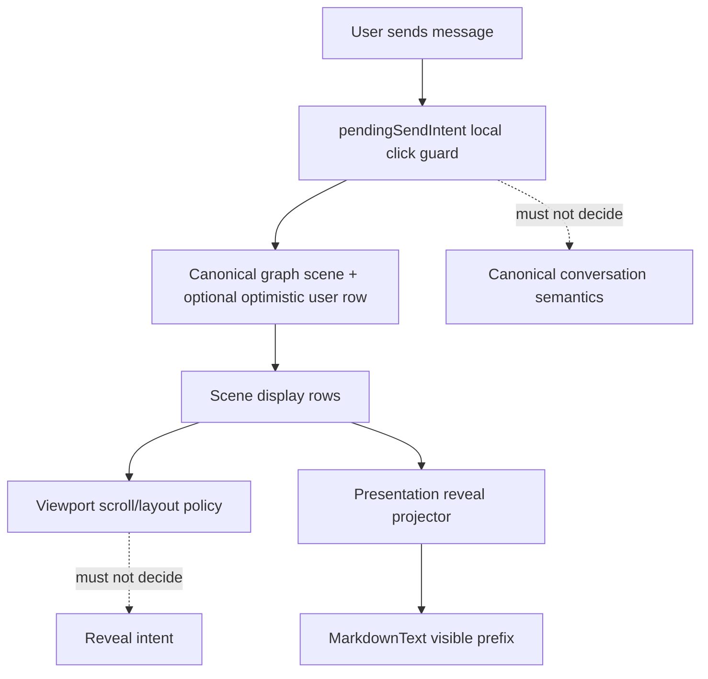

# fix: Debug and repair agent panel send/reveal regressions

## Overview

The previous reveal-projector fix did not resolve the user-visible behavior: assistant output still appears as a final block, and sending a new message appears to hide the previously visible message. Runtime QA now shows the second symptom is not data deletion: the previous row remains in the DOM and in `native-fallback`, but send/fallback scroll anchoring moves it out of the visible viewport as the new tail appears.

This plan treats both symptoms as linked until disproven. The shared seam is the agent-panel render pipeline:

```text
SessionStateGraph
  -> materializeAgentPanelSceneFromGraph
  -> desktop presentation decoration
  -> buildSceneDisplayRows / native fallback
  -> AgentPanelConversationEntry
  -> MarkdownText
```

The next fix must start with deterministic instrumentation/characterization, then repair the narrow causal seam. Do not add another speculative reveal flag.

## Problem Frame

Observed behavior after the first attempted fix:

- Assistant responses still appear in one block instead of visibly pacing.
- Sending a message appears to hide the previous response.
- Runtime DOM evidence shows the previous response is still present after send (`body.textContent` and `native-fallback.textContent` include it), so the disappearance is a viewport anchoring/fallback visibility issue rather than row deletion.
- The app is frequently in `native-fallback` for long sessions; fallback mode is currently entered for `isWaitingForResponse`, global `isStreaming`, live assistant rows, and active reveal keys.
- Local `pendingSendIntent` is allowed GOD-local state, but it must remain a click guard. It should not become semantic authority for conversation visibility or row lifecycle.

## Requirements Trace

- R1. Reproduce both symptoms deterministically with measurable DOM/state evidence: final-block reveal and previous-message hidden-on-send.
- R2. Preserve previous visible conversation context when a new user message is sent; previous rows must not disappear from view due to fallback/window/anchor churn unless the user was already following the tail and the scroll policy intentionally moves to the new message.
- R3. Reveal pacing must be driven by explicit presentation lifecycle, not by canonical `isStreaming` alone and not by viewport inference.
- R4. `SessionStateGraph` and `materializeAgentPanelSceneFromGraph` remain canonical/semantic; no reader-level hot-state fallback or client-side canonical synthesis.
- R5. `pendingSendIntent` may disable Send immediately, but must not by itself force a semantic conversation mode that drops, rewindows, or reanchors existing rows.
- R6. Native fallback should be a layout/recovery mechanism. It must not create an empty/truncated display window during send or reveal transitions.
- R7. Tests must cover long-history/native-fallback sessions, not just short synthetic conversations where all rows fit in the viewport.

## Scope Boundaries

- Do not redesign `SessionStateGraph` or add presentation reveal state to canonical graph fields.
- Do not make `SceneContentViewport` the source of reveal semantics.
- Do not add `canonical ?? hotState` fallbacks. GOD rule: canonical-owned fields remain canonical-only; `pendingSendIntent` remains truly local.
- Do not fix unrelated `check:svelte` fixture type failures in `panels-container.component.vitest.ts` as part of this plan.
- Do not optimize all long-session virtualization behavior. Fix only the send/reveal regression seam and add focused coverage.

## Context & Research

### Runtime QA Evidence

- Connected to the running Tauri app via MCP bridge.
- Before send, `native-fallback` existed with a large scroll height and a visible long previous assistant row.
- After sending `Reply with exactly three short sentences about deterministic UI debugging.`, the editor cleared, a new assistant response appeared, and the previous response seemed hidden.
- Follow-up DOM check showed:
  - `body.textContent` still included the previous response prefix.
  - `native-fallback.textContent` still included the previous response prefix.
  - `.markdown-content` still contained the previous response row.
  - The visible viewport had reanchored around the new tail and nearby rows.

This falsifies the first suspected causal chain ("previous row is deleted from scene data") and points to scroll/fallback anchoring.

### Relevant Code and Patterns

- `packages/desktop/src/lib/acp/components/agent-panel/components/agent-panel.svelte`
  - Computes `hasImmediatePendingSendIntent` from `sessionHotState.pendingSendIntent` and `panelHotState.pendingUserEntry`.
  - Passes `isWaitingForResponse={showPlanningIndicator || hasImmediatePendingSendIntent}` into content.
  - Materializes scene entries from `SessionStateGraph`, then applies `AssistantTextRevealProjector`.
- `packages/desktop/src/lib/acp/session-state/agent-panel-graph-materializer.ts`
  - Appends `optimistic.pendingUserEntry` to semantic conversation entries when provided.
  - Must remain pure and semantic.
- `packages/desktop/src/lib/acp/components/agent-panel/components/scene-content-viewport.svelte`
  - Builds `displayEntriesRaw` by appending a thinking indicator whenever `isWaitingForResponse` is true.
  - Uses `shouldUseNativeList` when `useNativeFallback || isWaitingForResponse || isStreaming || hasLiveAssistantDisplayEntry || liveRevealActive`.
  - Native fallback windows the last `NATIVE_FALLBACK_ENTRY_LIMIT` display rows.
- `packages/desktop/src/lib/acp/components/agent-panel/logic/viewport-fallback-controller.svelte.ts`
  - `buildNativeFallbackWindow` windows by row count only, preserving original display indexes.
- `packages/desktop/src/lib/acp/components/messages/markdown-text.svelte`
  - Handles explicit `textRevealState` pacing and cache behavior.
- `packages/desktop/src/lib/acp/components/agent-panel/logic/assistant-text-reveal-projector.svelte.ts`
  - Presentation-only projector that should decorate only rows observed live in the mounted panel.

### Institutional Learnings

- `docs/solutions/ui-bugs/assistant-text-reveal-streaming-block.md`: reveal lifecycle must be presentation-only and separate from canonical streaming state.
- `docs/solutions/best-practices/agent-panel-content-viewport-reactivity-renderer-2026-05-01.md`: viewport should own layout, not row semantics.
- `docs/solutions/ui-bugs/agent-panel-graph-materialization-rendering-bug-2026-04-28.md`: restored/live rendering must flow through the canonical graph scene and match rows by ID, not display index.
- `docs/solutions/best-practices/canonical-session-projection-ui-derivation-2026-05-01.md`: canonical projection remains the authority for session-shaped fields.

### GOD Architecture Check

`pendingSendIntent` is a permitted local/transient field, but only as a local click guard. The fix must not promote it into semantic session truth. If a needed field is canonical-owned, widen canonical upstream instead of adding hot-state fallbacks.

## Key Technical Decisions

- **Start with characterization instrumentation/tests.** The first fix failed because the chosen tests did not reproduce the user-visible runtime path. The next work must capture display row continuity, fallback scroll anchoring, and reveal pacing as observable outputs.
- **Treat `isWaitingForResponse` as a UI affordance, not a native-fallback authority.** Waiting may append a thinking row or disable controls, but it should not by itself force the viewport into a mode that reanchors existing long rows unexpectedly.
- **Separate fallback reasons.** Native fallback for Virtua failure, active reveal protection, canonical streaming assistant rows, and "waiting for response" are different states. The code should encode those distinctions so tests can assert each one independently.
- **Measure reveal by visible prefix growth.** Tests should assert that the visible text prefix grows over time for an explicitly paced response, not merely that `textRevealState` exists.

## Open Questions

### Resolved During Planning

- **Is the previous message actually deleted on send?** No. Runtime DOM checks show it remains in `body`, in `native-fallback`, and in `.markdown-content`; it is hidden by viewport/fallback anchoring.
- **Is `pendingSendIntent` canonical session truth?** No. GOD check classifies it as truly local click-guard state. It must not drive semantic conversation state.

### Deferred to Implementation

- **Exact minimal condition for `shouldUseNativeList`.** Implementation should characterize current behavior first, then narrow the fallback condition around measured causes. The planning default is to remove local `hasImmediatePendingSendIntent` as a native-fallback trigger, preserve canonical streaming/reveal protection unless measured evidence disproves it, and keep thinking-indicator rendering independent from fallback mode.
- **Exact reveal failure source after runtime sampling.** The next implementation should instrument whether `textRevealState` reaches `MarkdownText`, whether `MarkdownText` reports active reveal, and whether visible text grows in multiple frames. Do not assume the projector is still the failing component until this is measured.

## High-Level Technical Design

> *This illustrates the intended approach and is directional guidance for review, not implementation specification. The implementing agent should treat it as context, not code to reproduce.*



The fix should keep these authorities separate:

| Concern | Authority |
|---------|-----------|
| Session lifecycle/activity/turn state | `SessionStateGraph` canonical projection |
| Immediate click guard | `pendingSendIntent` local transient state |
| Conversation row semantics | graph materializer + optimistic user row only |
| Scroll/fallback mode | `SceneContentViewport` layout policy |
| Text pacing intent | `AssistantTextRevealProjector` presentation state |
| Visible text prefix | `MarkdownText` reveal controller |

## Implementation Units

- [ ] **Unit 1: Deterministic runtime characterization hooks**

**Goal:** Add temporary or test-only observable seams that let tests and manual QA capture the render pipeline state across send/reveal transitions.

**Requirements:** R1, R7

**Dependencies:** None

**Files:**
- Modify: `packages/desktop/src/lib/acp/components/agent-panel/components/scene-content-viewport.svelte`
- Modify: `packages/desktop/src/lib/acp/components/messages/markdown-text.svelte`
- Test: `packages/desktop/src/lib/acp/components/agent-panel/components/__tests__/scene-content-viewport.svelte.vitest.ts`
- Test: `packages/desktop/src/lib/acp/components/messages/markdown-text.svelte.vitest.ts`

**Approach:**
- Prefer existing DOM-observable state (`data-testid`, row counts, visible text, scroll offsets) over production debug globals.
- If additional observability is needed, expose it through test-only attributes or callbacks already in the component boundary rather than global mutable debug state.
- Capture at least: display row count, native fallback active/inactive, fallback scroll offset/height, active reveal key count, and visible MarkdownText prefix length.
- Acknowledge that jsdom component tests cannot faithfully prove real scroll geometry. Component tests should target deterministic proxy observables such as fallback active reason, row/window contents, display row count, and reveal prefix length; the Tauri runtime probe in Unit 5 is the authoritative scroll-geometry check.

**Execution note:** Characterization-first. Add failing tests that demonstrate the current broken send/reveal behavior before changing production logic.

**Patterns to follow:**
- Existing viewport tests in `packages/desktop/src/lib/acp/components/agent-panel/components/__tests__/scene-content-viewport.svelte.vitest.ts`
- Existing MarkdownText reveal tests in `packages/desktop/src/lib/acp/components/messages/markdown-text.svelte.vitest.ts`

**Test scenarios:**
- Integration: long native-fallback conversation with a visible prior assistant row -> send pending user message -> previous row remains in the fallback window/proxy row set and no fallback reason changes solely because local pending-send state exists.
- Integration: completed assistant text with `textRevealState.policy = "pace"` -> visible text length grows over multiple frames before full completion.
- Edge case: fallback window at/near `NATIVE_FALLBACK_ENTRY_LIMIT` -> adding user/thinking/assistant rows does not drop the immediately previous assistant row from the fallback window.

**Verification:**
- Tests fail against the current broken behavior for the right reason: wrong scroll/fallback anchoring or missing visible prefix growth.

- [ ] **Unit 2: Repair send-time viewport anchoring**

**Goal:** Stop local pending-send state from causing native fallback to hide/reanchor the previous visible row unexpectedly.

**Requirements:** R2, R5, R6

**Dependencies:** Unit 1

**Files:**
- Modify: `packages/desktop/src/lib/acp/components/agent-panel/components/scene-content-viewport.svelte`
- Modify: `packages/desktop/src/lib/acp/components/agent-panel/components/agent-panel.svelte` only if the parent is passing the wrong semantic signal
- Test: `packages/desktop/src/lib/acp/components/agent-panel/components/__tests__/scene-content-viewport.svelte.vitest.ts`

**Approach:**
- Split "waiting indicator should render" from "viewport must use native fallback."
- Replace the composite `isWaitingForResponse` fallback decision with granular reasons. Local `hasImmediatePendingSendIntent` must not force `shouldUseNativeList`; canonical planning/streaming and reveal-protection reasons may still do so when independently true.
- Preserve existing valid fallback reasons: actual Virtua failure (`zero_viewport`, `no_rendered_entries`) and active reveal protection.
- Preserve the ability to append a thinking indicator while waiting. When native fallback is not active, the thinking indicator should be a display-only row in the normal scroller, not a canonical graph entry and not a reason to window/reanchor the conversation by itself.
- Make scroll-follow behavior deterministic: if the user was attached to the tail before send, the viewport may follow the natural append to the new tail without changing fallback mode; if the user was detached or reading mid-history, send must not steal scroll control. In both cases, local pending-send state must not cause a fallback mode switch or row-window replacement.

**Technical design:** Directional decision matrix:

| State | Native fallback? | Thinking row? | Scroll behavior |
|-------|------------------|---------------|-----------------|
| Virtua failure | yes | current behavior | recovery/fallback |
| Active text reveal | yes/protected as needed | current behavior | protect revealing row |
| Canonical streaming assistant | yes, unless characterization proves `hasLiveAssistantDisplayEntry` alone is sufficient | current behavior | follow if attached |
| Local `pendingSendIntent` only | no by itself | yes if desired | no fallback mode switch |
| Local `pendingSendIntent` + `liveRevealActive` | yes because reveal is active, not because send is pending | yes if desired | preserve reveal anchor; no additional send-driven reanchor |

When multiple rows apply, the highest-priority reason wins: Virtua failure, active reveal, canonical streaming/live assistant, then local pending-send. Lower-priority local pending-send state may add UI affordances, but it cannot override the scroll/fallback decision made by a higher-priority reason.

**Patterns to follow:**
- `buildNativeFallbackWindow` row-index preservation in `packages/desktop/src/lib/acp/components/agent-panel/logic/viewport-fallback-controller.svelte.ts`
- `ThreadFollowController` explicit follow/detach behavior

**Test scenarios:**
- Happy path: long fallback conversation at bottom -> send message -> previous assistant row remains visible until canonical response or explicit follow policy moves to the new tail.
- Edge case: detached scroll position -> send message -> viewport does not steal scroll control back solely because `pendingSendIntent` exists.
- Integration: pending send still appends/renders a thinking indicator without forcing native fallback when Virtua is healthy.
- Integration: pending send while `liveRevealActive` is true -> fallback remains attributed to reveal protection and does not perform an additional send-driven reanchor.

**Verification:**
- The controlled Tauri repro no longer makes the previously visible assistant response appear to disappear immediately on send.

- [ ] **Unit 3: Verify and repair reveal pacing delivery**

**Goal:** Identify and fix the remaining reason explicit reveal pacing is not visible in the running app.

**Requirements:** R1, R3, R4

**Dependencies:** Units 1, 2

**Files:**
- Modify: `packages/desktop/src/lib/acp/components/agent-panel/logic/assistant-text-reveal-projector.svelte.ts`
- Modify: `packages/desktop/src/lib/acp/components/agent-panel/components/agent-panel.svelte`
- Modify: `packages/desktop/src/lib/acp/components/agent-panel/components/scene-content-viewport.svelte`
- Modify: `packages/desktop/src/lib/acp/components/messages/markdown-text.svelte`
- Test: `packages/desktop/src/lib/acp/components/agent-panel/logic/__tests__/assistant-text-reveal-projector.test.ts`
- Test: `packages/desktop/src/lib/acp/components/messages/markdown-text.svelte.vitest.ts`
- Test: `packages/desktop/src/lib/acp/components/agent-panel/components/__tests__/scene-content-viewport.svelte.vitest.ts`

**Approach:**
- Trace the actual runtime chain with assertions:
  - projector decorates the intended assistant entry,
  - `textRevealState` survives display-row merging,
  - `AgentAssistantMessage` passes it to the last message text group,
  - `ContentBlockRouter` and `TextBlock` pass it into `MarkdownText`,
  - `MarkdownText` emits multiple visible prefix states before completion.
- Fix only the first broken link in that chain.
- If all links are present but visible pacing still fails, inspect scheduler/timing in `createStreamingRevealController` rather than adding another presentation flag.

**Patterns to follow:**
- Existing projector and MarkdownText reveal tests.
- `docs/solutions/ui-bugs/assistant-text-reveal-streaming-block.md`

**Test scenarios:**
- Integration: live pending turn with no `lastAgentMessageId`, then completed assistant row arrives -> final full text is initially partially visible and grows across frames.
- Edge case: assistant message with multiple text groups and non-text blocks -> reveal state applies only to the last text group and deactivates with the same key used for protection.
- Edge case: cold restored completed session -> no replay; full settled content renders immediately.

**Verification:**
- Runtime probe with a long deterministic response shows visible prefix growth in at least two samples before full text appears.

- [ ] **Unit 4: Conditional graph scene continuity hardening**

**Goal:** Only if Unit 1 shows ordering-related fallback churn, ensure the graph scene plus optimistic user row preserves conversation ordering across pending send, canonical user echo, and assistant response arrival.

**Requirements:** R2, R4, R5

**Dependencies:** Unit 1

**Files:**
- Modify: `packages/desktop/src/lib/acp/components/agent-panel/logic/select-optimistic-user-entry-for-graph.ts`
- Modify: `packages/desktop/src/lib/acp/session-state/agent-panel-graph-materializer.ts` only if ordering belongs at the materializer boundary
- Test: `packages/desktop/src/lib/acp/components/agent-panel/logic/__tests__/select-optimistic-user-entry-for-graph.test.ts`
- Test: `packages/desktop/src/lib/acp/session-state/__tests__/agent-panel-graph-materializer.test.ts`

**Approach:**
- Treat this unit as conditional. Do not execute it for the confirmed runtime symptoms unless characterization shows canonical echo ordering or optimistic user reconciliation contributes to row-window churn.
- Characterize the ordering when:
  - prior assistant is the last canonical row,
  - local pending user exists,
  - canonical assistant output arrives before canonical user echo or while echo is delayed.
- Preserve ID-based matching and avoid display-index assumptions.
- Do not synthesize canonical user entries. An optimistic user row may be appended as presentation input, but canonical transcript ordering remains graph-owned.

**Test scenarios:**
- Integration: previous assistant + pending optimistic user + new assistant output before canonical user echo -> display rows do not merge previous and new assistant as adjacent messages.
- Edge case: repeated prompt text -> selector still distinguishes new local optimistic entry by ID, not content.
- Edge case: canonical user echo arrives -> optimistic row is removed/reconciled without duplicate user rows or assistant-row merge churn.

**Verification:**
- Scene entries remain ordered as prior assistant -> pending/new user -> new assistant throughout the transition.
- If Unit 1 does not implicate ordering, this unit is explicitly deferred to a separate hardening plan rather than blocking the confirmed regression fix.

- [ ] **Unit 5: End-to-end QA script and cleanup**

**Goal:** Make the manual bug reproducible and prove the fix against the running app.

**Requirements:** R1, R2, R3, R7

**Dependencies:** Units 2, 3. Unit 4 is required only if Unit 1 implicates ordering-related fallback churn.

**Files:**
- Modify: focused tests from previous units as needed
- No committed long-lived debug globals unless they are intentionally test-only and documented

**Approach:**
- Use Tauri MCP or an equivalent browser automation script to run a controlled send:
  - capture before state,
  - send deterministic prompt,
  - sample DOM over time,
  - assert previous-row visibility/continuity,
  - assert reveal prefix growth.
- Remove or gate any instrumentation that should not ship.

**Test scenarios:**
- Manual/E2E: long existing session with native fallback -> send prompt -> previous row remains present and expected visible context is preserved.
- Manual/E2E: long assistant response -> response text appears over multiple samples rather than all at final sample.

**Verification:**
- Focused unit/integration tests pass.
- Runtime QA evidence confirms both user-reported symptoms are gone.

## System-Wide Impact

- **Interaction graph:** `agent-panel.svelte` parent state, graph materializer, scene row builder, viewport fallback, thread follow controller, shared UI assistant renderer, and MarkdownText reveal controller all participate in the failure path.
- **Error propagation:** No new error path should be swallowed. Invalid row/missing entry warnings should remain visible in dev.
- **State lifecycle risks:** The main risk is local transient state (`pendingSendIntent`) leaking into semantic render authority. Keep it local to click guard/waiting affordance.
- **API surface parity:** Shared UI `textRevealState` remains presentational and prop-driven; `packages/ui` must stay free of desktop/store/Tauri imports.
- **Integration coverage:** Short unit tests are insufficient. Coverage must include native fallback/long-history rows and the send transition.
- **Unchanged invariants:** Canonical session lifecycle, turn state, and activity remain graph-owned. Viewport owns layout only. Materializer remains pure and semantic.

## Risks & Dependencies

| Risk | Mitigation |
|------|------------|
| Fixing scroll anchoring masks reveal pacing still being broken | Separate tests: one for previous-row visibility, one for visible prefix growth |
| Removing `isWaitingForResponse` from native fallback regresses thinking-tail visibility | Preserve thinking row as display data; test waiting indicator separately from fallback mode |
| Optimistic user ordering fix violates GOD by synthesizing canonical truth | Keep optimistic row as presentation input only; do not write canonical projection or hot-state lifecycle |
| Long-session fallback behavior differs from short test fixtures | Add long-history/native-fallback characterization tests |

## Documentation / Operational Notes

- Update `docs/solutions/ui-bugs/assistant-text-reveal-streaming-block.md` after the actual fix if the confirmed root cause differs from this plan's current hypothesis.
- PR description should include runtime QA evidence: before/after DOM samples or screenshots/GIF showing reveal pacing and send continuity.

## Sources & References

- Origin plan: `docs/plans/2026-05-02-002-fix-assistant-reveal-intent-plan.md`
- Learning: `docs/solutions/ui-bugs/assistant-text-reveal-streaming-block.md`
- Viewport learning: `docs/solutions/best-practices/agent-panel-content-viewport-reactivity-renderer-2026-05-01.md`
- Graph materialization learning: `docs/solutions/ui-bugs/agent-panel-graph-materialization-rendering-bug-2026-04-28.md`
- GOD architecture check: `.github/skills/god-architecture-check/SKILL.md`
