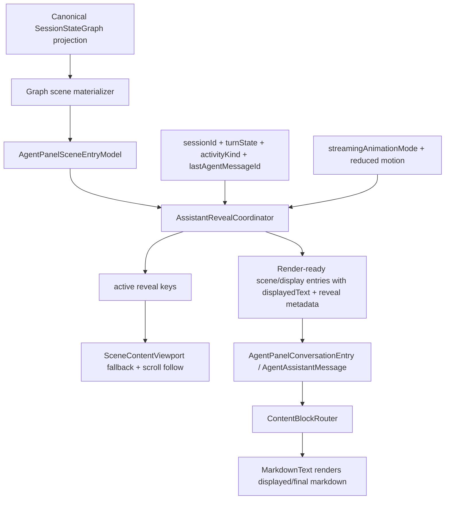

# refactor: Centralize assistant reveal coordination

## Overview

Replace the distributed assistant reveal lifecycle with one desktop-owned `AssistantRevealCoordinator` that sits after canonical graph scene materialization and before presentational rendering. The canonical `SessionStateGraph` remains the sole authority for assistant text, turn state, activity, and message identity; the coordinator owns only local presentation progress: target text, displayed text, pacing/catch-up/drain timers, active reveal state, and remount-safe progress keyed by stable semantic IDs.

The goal is to fix the current streaming regression where a valid assistant row can show a short prefix and then blank/stall during append-growth, while also removing the architectural cause: reveal lifecycle state is currently split across the projector, viewport, shared UI grouping, and `MarkdownText`.

## Problem Frame

The current pipeline treats reveal as a presentation concern, but its state is distributed:

- `AssistantTextRevealProjector` decides which assistant entry receives `textRevealState`.
- `SceneContentViewport` tracks active reveal keys for native fallback and scroll behavior.
- `@acepe/ui` `AgentAssistantMessage` groups chunks, hides trailing blocks while reveal is active, and participates in activity callbacks.
- `MarkdownText` owns pacing timers, displayed progress, module-global progress caches, remount recovery, markdown rendering, and child-to-parent activity reporting.

That creates a presentation-state distributed system. Parent callback loops and component remounts can reset the actual reveal controller while the canonical assistant row and semantic reveal key remain stable. The observed bug is consistent with this architecture: the canonical graph and scene entries are correct, but the visible renderer loses or blanks local reveal progress during append-growth.

This plan carries forward prior streaming requirements: live markdown must render only already-visible text, must preserve animation modes, must avoid repeated flicker/re-animation, and must hand off continuously to the final renderer (see origin: `docs/brainstorms/2026-04-15-streaming-markdown-during-reveal-requirements.md`). It also preserves the existing streaming animation mode requirements from `docs/brainstorms/2026-04-14-streaming-animation-modes-requirements.md`.

## Requirements Trace

- R1. Centralize assistant reveal presentation state in one desktop-owned coordinator.
- R2. Preserve GOD authority: canonical graph facts remain the only source for assistant content, turn/activity state, and message identity; reveal progress is local UI state only.
- R3. `MarkdownText` must render already-visible displayed text and final text, but must no longer own reveal eligibility, remount progress recovery, or cross-component reveal lifecycle.
- R4. Shared `@acepe/ui` components must stay presentational and must not own desktop reveal lifecycle policy.
- R5. Streaming append-growth must keep the same assistant row visible and monotonically growing instead of blanking/resetting.
- R6. Remounts, native fallback switches, fullscreen switches, and virtualization churn must preserve active reveal progress by stable semantic key.
- R7. Semantic completion before visual reveal catch-up must continue revealing until displayed text reaches canonical target, then drain and clear active reveal state.
- R8. Existing supported streaming animation semantics must remain predictable: `smooth` continues paced display, `instant` renders the current canonical target without paced timers, and this refactor must not claim or implement a missing `classic` mode unless that mode is separately introduced.
- R9. Live markdown rendering must continue to operate only on displayed text and must not reveal unrevealed canonical text.
- R10. Cold completed history must render final text immediately and must not replay reveal.

## Scope Boundaries

- No changes to provider-side streaming, transcript ingestion, or Rust canonical envelope authority.
- No `canonical ?? hotState` fallbacks or hot-state writes for canonical-overlap fields.
- No new production setting or user-facing streaming behavior mode.
- No rewrite of the full markdown renderer or new incremental markdown engine.
- No Tauri/store/runtime imports into `packages/ui`; shared UI remains presentational.
- No attempt to preserve the failed `MarkdownText` module-global reveal cache pattern as a long-term seam.

## Context & Research

### Relevant Code and Patterns

- `packages/desktop/src/lib/acp/components/agent-panel/components/agent-panel.svelte` currently creates `AssistantTextRevealProjector` and projects canonical scene entries with `sessionId`, `turnState`, `activity.kind`, and `lastAgentMessageId`.
- `packages/desktop/src/lib/acp/components/agent-panel/logic/assistant-text-reveal-projector.svelte.ts` currently owns target selection but not actual displayed progress.
- `packages/desktop/src/lib/acp/components/messages/logic/create-streaming-reveal-controller.svelte.ts` is the reusable low-level pacing primitive for smooth/classic/instant reveal, reduced-motion handling, completion catch-up, and drain timing.
- `packages/desktop/src/lib/acp/components/agent-panel/components/scene-content-viewport.svelte` owns layout, native fallback, scroll follow, and active reveal tracking today; after the refactor it should observe coordinator-provided activity, not infer reveal completion from child callbacks.
- `packages/desktop/src/lib/acp/components/agent-panel/logic/virtualized-entry-display.ts` merges adjacent assistant scene entries and currently adds `seedDisplayedText`; the coordinator should absorb this seed/progress responsibility.
- `packages/ui/src/components/agent-panel/agent-assistant-message.svelte` should keep chunk grouping and presentational rendering, but reveal activity policy should move out.
- `packages/desktop/src/lib/acp/components/messages/markdown-text.svelte` should keep partial/final markdown rendering behavior, but lose coordinator-like state and module-global reveal progress caches.
- `packages/desktop/src/lib/acp/components/agent-panel/components/__tests__/assistant-streaming-integration.svelte.vitest.ts` and `streaming-repro-real-render.svelte.vitest.ts` already contain red acceptance tests for append-growth blanking.

### Institutional Learnings

- `docs/solutions/ui-bugs/assistant-text-reveal-streaming-block.md`: `isStreaming` is canonical generation state, not presentation reveal state. Completed answers can still need local reveal catch-up, while cold history should not replay.
- `docs/solutions/best-practices/canonical-session-projection-ui-derivation-2026-05-01.md`: UI-visible session facts must derive from canonical projection; the coordinator may consume those facts but must not synthesize them.
- `docs/solutions/best-practices/agent-panel-content-viewport-reactivity-renderer-2026-05-01.md`: viewport owns layout/virtualization/fallback protection, not row semantics or global timers.
- `docs/solutions/ui-bugs/agent-panel-composer-split-brain-canonical-actionability-2026-04-30.md`: local optimistic or presentation state must not assert canonical-overlap truth.
- `docs/solutions/architectural/final-god-architecture-2026-04-25.md`: provider facts flow through canonical graph, materializations, selectors, and presentation-safe DTOs.
- `docs/solutions/ui-bugs/agent-panel-graph-materialization-rendering-bug-2026-04-28.md`: scene/display matching must use stable IDs, not display indexes, because assistant rows can merge.
- `docs/solutions/best-practices/reactive-state-async-callbacks-svelte-2026-04-15.md`: capture reactive keys before timer/async callbacks and keep controller policy outside presentational UI components.

### External References

- None used. Local repo patterns and institutional learnings are directly applicable.

## Key Technical Decisions

- **Coordinator is desktop-local and post-canonical:** Place the coordinator in the desktop agent-panel layer after graph materialization. It consumes canonical scene entries and canonical turn/activity facts, but owns only presentation progress.
- **Coordinator lifetime is above row/viewport remounts:** The coordinator must be scoped to the panel/session controller layer that survives message row, viewport, native fallback, fullscreen-content, and shared-component remount churn. If `agent-panel.svelte` itself is destroyed, the owning layer must either preserve the coordinator by `panelId + sessionId` or intentionally treat the newly mounted panel as a late-open scenario using the eligibility matrix below.
- **Reveal key contract uses stable semantic identity:** Use session ID plus canonical assistant entry/message identity plus stable semantic part (`message` or `thought`) rather than group index as the authoritative key. Indexes may be used only where no stable semantic part exists and must not be the primary remount key.
- **Coordinator owns completion and invalidation:** Reveal active/inactive state comes from the coordinator state machine, not child renderer callbacks. Every target change, reveal tick, drain transition, session cleanup, and record eviction must invalidate the Svelte render path through an explicit `onStateChange`/revision contract.
- **Markdown renderer becomes passive:** `MarkdownText` receives displayed text and active/render-mode metadata. It may still render partial markdown and apply local DOM fade styling, but it must not decide reveal target selection, keep module-global progress caches, or recover remount state independently.
- **Viewport observes active reveal state:** `SceneContentViewport` should use coordinator-provided active reveal keys to choose native fallback and scroll-follow behavior. It should not maintain a parallel reveal activity set based on child lifecycle callbacks.
- **Completion catch-up is explicit:** When canonical stream completes while displayed text lags target text, the coordinator stays active, continues pacing to target, drains CSS/motion state, then clears.
- **Cold history never replays:** The coordinator only reveals assistants that become targets through live/pending observation in the mounted panel. Completed historical entries with no active coordinator record render final text.
- **Non-prefix rewrites preserve non-empty continuity:** Same-key non-prefix source replacement should shrink to the longest safe grapheme-boundary common prefix when possible. After any non-empty text has been visible, the row must not visually collapse to empty; keep the last safe displayed text until replacement text has a non-empty visible prefix or show an explicit stable replacement state. It should never mix stale visible text with unrelated canonical text or snap to full final text while reveal is active.

## Coordinator Contracts

### Ownership And Lifetime

- The coordinator is a desktop-local presentation controller, not canonical state and not `SessionTransientProjection`.
- The preferred owner is the mounted panel controller layer keyed by `panelId + sessionId`, above `SceneContentViewport`, block rendering, and message row lifecycles.
- It must survive row unmount, native fallback switches, viewport remounts, and fullscreen content remounts for the same `panelId + sessionId`.
- It must expose `destroy()` and per-session cleanup. Destroying the coordinator cancels all timers/listeners and prevents future invalidation callbacks.
- If the entire panel controller is intentionally destroyed, a remount with the same canonical session is handled by the reveal eligibility matrix; it must not read or write canonical fallback state to recover progress.

### Key Schema

Authoritative reveal keys should follow this shape:

```text
sessionId / assistantEntryId / semanticPart
```

- `sessionId` is required. If no session ID exists, use `no-session` only for mounted test/debug flows; production flows without a session ID are reveal-ineligible unless already active in the coordinator.
- `assistantEntryId` is the canonical assistant scene entry ID or the graph-materialized stable assistant message ID.
- `semanticPart` is `message` or `thought`. A part index is allowed only as a final fallback for multiple same-kind parts within one canonical assistant entry, and only after preserving the stable assistant entry ID in the key.
- Merged adjacent assistant rows keep per-assistant-entry reveal records internally, but expose row-level active state as the union of active records represented by that row.
- Missing or unstable assistant IDs make the row ineligible for remount-safe reveal; render final/current text rather than inventing an index-only key.

### Reactivity And Invalidation

- `createAssistantRevealCoordinator({ onStateChange })` should be the coordination shape unless implementation reveals a better local pattern.
- The coordinator must call `onStateChange` when a reveal record is created, target text changes, displayed text advances, mode changes to/from active, catch-up completes, drain completes, a record is evicted, a session is cleared, or the coordinator is destroyed.
- `agent-panel.svelte` or the owning controller should keep a `$state` revision counter and read it when projecting render-ready entries, matching the existing projector revision pattern.
- Timer callbacks must capture their intended `sessionId` and `revealKey` before async boundaries and no-op if the record has been superseded or destroyed.

### Concurrency Model

- The coordinator owns a `Map<revealKey, revealRecord>` plus a session-level pending binder.
- Multiple reveal records may exist concurrently: for example, an old assistant can be draining while a new assistant begins, or a thought and message part can overlap during handoff.
- Aggregated state should expose `activeRevealKeys` and row-level active state. Viewport fallback uses the aggregate; trailing block visibility uses the relevant row/part active state.

### Reveal Eligibility Matrix

| Scenario | Reveal? | Starting displayed text |
|---|---:|---|
| Panel mounted before assistant starts | Yes | Empty or first paced prefix |
| Panel opens mid-stream for an active canonical turn | Yes | Current coordinator progress if preserved; otherwise a safe prefix of current canonical text |
| Panel opens after completion with no active coordinator record | No | Final canonical text |
| Reconnect mid-stream with stable assistant identity | Yes | Safe prefix/current canonical prefix; never stale cross-session progress |
| Row/viewport/fullscreen remount in same panel/session | Yes | Existing coordinator `displayedText` |
| Failed/cancelled turn with partial assistant target | Catch up then drain | Latest canonical assistant text |
| Failed/cancelled turn with no assistant target | No | Clear pending reveal |

### Mode Matrix

| State | smooth | instant | reduced motion |
|---|---|---|---|
| first token | Pace visible prefix from empty/current seed | Show current canonical target immediately | Show current canonical target immediately |
| append growth | Advance displayed text monotonically toward target | Replace visible text with current target per canonical update | Replace visible text with current target per canonical update |
| semantic complete while lagging | Continue catch-up, then drain | No catch-up timer; already at target | No catch-up timer; already at target |
| drain/fade | Keep active through bounded drain | Clear active after synchronous state cleanup | Clear active after synchronous state cleanup |
| remount | Resume coordinator `displayedText` | Render current target | Render current target |
| cancellation/failure | Catch up latest target if present, else clear pending | Render latest target if present, else clear pending | Render latest target if present, else clear pending |

`classic` is intentionally absent from this matrix because the current code does not expose a working `classic` mode. A future classic-mode change should get its own plan or a separate unit.

### Visible Text And Copy Text Boundary

- `visibleText` is the only assistant body text passed to markdown/rendered DOM while reveal is active.
- `copyText` is the canonical final/current grouped assistant text and is available only to the copy action path.
- Hidden DOM, accessibility labels, debug labels, markdown link previews, and rendered block props must not expose unrevealed canonical suffix while active.
- Tests must assert active DOM text does not contain unrevealed suffix and copy behavior still returns canonical text.

## Open Questions

### Resolved During Planning

- **Should reveal progress be canonical?** No. Reveal progress is local presentation state with no canonical counterpart.
- **Should `MarkdownText` keep module-global progress caches?** No. That duplicates coordinator state and makes remount behavior depend on component lifecycle ordering.
- **Should child renderer callbacks clear reveal completion?** No. Coordinator timers/state should be authoritative; child unmounts must not clear active reveals.
- **Should the first slice preserve word fade?** Yes, but only as render metadata over already-displayed text. If the existing word-fade implementation cannot be kept without hidden reveal lifecycle state, simplify it rather than reintroducing distributed authority.

### Deferred to Implementation

- **Exact coordinator class/helper names:** decide while fitting existing file organization.
- **Whether to keep `AgentTextRevealState` as a compatibility prop temporarily:** implementation may keep a narrow presentation DTO during the refactor, but the final architecture should remove reveal lifecycle policy from shared UI types when practical.
- **Exact common-prefix threshold for non-prefix rewrites:** choose the smallest deterministic policy that passes behavior tests and avoids stale text corruption.

## High-Level Technical Design

> This illustrates the intended approach and is directional guidance for review, not implementation specification. The implementing agent should treat it as context, not code to reproduce.



Coordinator state machine:

```text
idle
-> pending       (live canonical facts, no assistant target yet)
-> streaming     (assistant target exists and canonical live text can grow)
-> catchup       (canonical no longer live, displayedText < targetText)
-> draining      (displayedText == targetText, motion/fade drain still active)
-> complete      (inactive, render final text, record eligible for eviction)
-> aborted       (session switch, superseding user turn, no target after failure)
```

Render contract shape:

```text
assistant entry semantic content remains canonical-derived
local reveal metadata is presentation-only:
- revealKey
- targetText
- displayedText
- isRevealActive
- renderText = displayedText when active, canonical final text when inactive
```

## Implementation Units

- [ ] **Unit 1: Add coordinator state machine tests and core coordinator**

**Goal:** Introduce a desktop-local `AssistantRevealCoordinator` that owns reveal target selection, displayed progress, completion catch-up, draining, remount persistence, and activity state.

**Requirements:** R1, R2, R5, R6, R7, R8, R10

**Dependencies:** None

**Files:**
- Create: `packages/desktop/src/lib/acp/components/agent-panel/logic/assistant-reveal-coordinator.svelte.ts`
- Create: `packages/desktop/src/lib/acp/components/agent-panel/logic/__tests__/assistant-reveal-coordinator.test.ts`
- Modify: `packages/desktop/src/lib/acp/components/messages/logic/create-streaming-reveal-controller.svelte.ts` only if the coordinator needs a small reusable hook or observable surface from the existing controller

**Approach:**
- Start from existing behavior in `assistant-text-reveal-projector.svelte.ts` for live target selection and pending assistant binding.
- Reuse `createStreamingRevealController` for low-level pacing where possible rather than cloning timer math.
- Store progress by stable semantic reveal key in the coordinator instance, not in `MarkdownText` module globals.
- Model terminal states explicitly: completion catch-up, drain, clear, superseded, session switch.
- Capture session/reveal keys before timer callbacks to avoid stale callback writes.
- Compose existing primitives first. Do not rebuild target selection or pacing if the existing projector/controller behavior can be lifted behind the coordinator facade.
- Expose an explicit `onStateChange`/revision invalidation contract so timer-driven displayed text updates rerender the panel.
- Implement `destroy()` and per-record cleanup for completion eviction, supersession, session switch, and panel teardown.

**Execution note:** Test-first. The coordinator is the new authority and must be proven before wiring components to it.

**Patterns to follow:**
- `packages/desktop/src/lib/acp/components/agent-panel/logic/assistant-text-reveal-projector.svelte.ts` for current target selection.
- `packages/desktop/src/lib/acp/components/messages/logic/create-streaming-reveal-controller.svelte.ts` for pacing and drain semantics.

**Test scenarios:**
- Happy path: live assistant with text `"Umbrellas"` becomes a reveal target and exposes displayed text as a prefix of target text.
- Happy path: updating same assistant target from `"Umbrellas"` to a longer umbrella paragraph keeps displayed text non-empty and prefix-compatible.
- Integration: canonical completion while displayed text lags keeps reveal active until displayed reaches final text, then drains and clears.
- Edge case: remount/read projection for the same reveal key returns the cached displayed prefix rather than empty or full target.
- Edge case: session switch clears pending and active reveal records for the previous session.
- Edge case: new user turn supersedes a prior draining assistant and binds the next assistant to a new reveal key.
- Edge case: stale `lastAgentMessageId` after a new user boundary does not redecorate/reveal the old assistant.
- Failure path: failed/cancelled turn with partial assistant text catches up to latest canonical text and completes; failed/cancelled turn with no assistant clears pending reveal.
- Edge case: same-key non-prefix replacement never renders an empty row after non-empty text was visible and never renders text outside the current canonical target/common-safe prefix.
- Edge case: `instant`/reduced-motion mode snaps displayed text to target and leaves no pacing timers active.
- Edge case: old draining assistant plus new streaming assistant can coexist without overwriting each other's reveal records.
- Failure path: after `destroy()` or session switch, pending timers/listeners do not mutate state or call invalidation.

**Verification:**
- Coordinator tests prove target selection, progress monotonicity, remount persistence, completion catch-up, supersession, and session isolation without rendering Svelte components.

- [ ] **Unit 2: Project render-ready reveal metadata from coordinator**

**Goal:** Replace `AssistantTextRevealProjector`'s partial `textRevealState` decoration with coordinator-owned render metadata that includes displayed text and active state.

**Requirements:** R1, R2, R4, R5, R6, R7, R10

**Dependencies:** Unit 1

**Files:**
- Modify: `packages/desktop/src/lib/acp/components/agent-panel/components/agent-panel.svelte`
- Modify: `packages/desktop/src/lib/acp/components/agent-panel/logic/assistant-text-reveal-projector.svelte.ts` or replace it with the new coordinator
- Modify: `packages/desktop/src/lib/acp/components/agent-panel/logic/__tests__/assistant-text-reveal-projector.test.ts` or migrate relevant coverage into `assistant-reveal-coordinator.test.ts`
- Modify: `packages/ui/src/components/agent-panel/types.ts`

**Approach:**
- Keep canonical scene entries immutable as semantic inputs.
- Have the panel controller layer own or retrieve a coordinator instance scoped by `panelId + sessionId`, above row/viewport remount churn.
- Feed the coordinator canonical scene entries plus `sessionId`, `turnState`, `activity.kind`, `lastAgentMessageId`, and streaming animation mode.
- Output presentation-safe metadata for the targeted assistant entry without making it look canonical-owned.
- Prefer a new passive render metadata shape over overloading `AgentTextRevealState` with more lifecycle semantics.
- Define the render DTO before wiring: it must carry `visibleText`, `copyText`, `revealKey`, part/row active state, and enough identity to keep copy/final text separate from visible partial text.

**Execution note:** Test-first for the projection contract before deleting the old projector behavior.

**Patterns to follow:**
- `materializeAgentPanelSceneFromGraph` remains upstream semantic source.
- `AssistantTextRevealProjector` tests show existing live/pending/supersession cases to preserve.

**Test scenarios:**
- Happy path: projected live assistant includes displayed reveal text and stable reveal key.
- Happy path: completed historical assistant has no active reveal metadata and renders final text.
- Integration: pending reveal created during `Running/awaiting_model` binds first new assistant after latest user boundary.
- Edge case: projected metadata does not cross session IDs.
- Edge case: local reveal metadata does not alter canonical markdown/chunks fields.
- Edge case: DOM-visible text while active excludes unrevealed suffix, while copy action still uses canonical `copyText`.
- Edge case: missing/unstable assistant IDs make reveal ineligible rather than falling back to index-only remount keys.

**Verification:**
- Projection tests prove semantic entries remain canonical-derived while reveal metadata is local and coordinator-owned.

- [ ] **Unit 3: Move viewport reveal activity to coordinator output**

**Goal:** Make `SceneContentViewport` observe active reveal keys from the coordinator instead of maintaining a child-callback-driven reveal authority.

**Requirements:** R1, R4, R6, R7

**Dependencies:** Unit 2

**Files:**
- Modify: `packages/desktop/src/lib/acp/components/agent-panel/components/agent-panel-content.svelte`
- Modify: `packages/desktop/src/lib/acp/components/agent-panel/components/scene-content-viewport.svelte`
- Modify: `packages/desktop/src/lib/acp/components/agent-panel/components/__tests__/scene-content-viewport.svelte.vitest.ts`
- Modify: `packages/desktop/src/lib/acp/components/agent-panel/components/__tests__/fixtures/streaming-repro-real-render-harness.svelte`

**Approach:**
- Pass coordinator active reveal state into the viewport as explicit presentation input, e.g. `activeAssistantRevealKeys: readonly string[]` or an equivalent immutable prop.
- Keep native fallback and scroll-follow behavior in the viewport; only the source of active reveal truth changes.
- Remove or narrow `onTextRevealActivityChange` callback plumbing so child unmounts cannot clear reveal state.
- Preserve native fallback during semantic streaming and during completion catch-up/drain.
- Make empty/undefined active state release local fallback state after existing retry conditions; session switch or coordinator destroy must clear stale active keys.
- Preserve scroll intent: pinned-bottom users keep following during streaming/catch-up/drain, while users who manually scroll away keep their scroll anchor and are not pulled down by append growth or fallback restoration.

**Patterns to follow:**
- Existing `shouldUseNativeList` behavior in `scene-content-viewport.svelte`.
- Existing debug/repro harness path through `AgentPanelContent`.

**Test scenarios:**
- Happy path: active coordinator reveal forces native fallback even after canonical `turnState` is completed but reveal catch-up is active.
- Integration: inactive coordinator reveal allows viewport to return to normal Virtua behavior when retry conditions are met.
- Edge case: child message unmount does not clear active reveal state.
- Edge case: fullscreen/session switch does not leave stale active reveal keys in viewport.
- Edge case: user scrolled away during active reveal remains anchored and does not jump on append/catch-up/fallback restoration.
- Edge case: target entry disappears while active; fallback clears instead of staying permanently native.

**Verification:**
- Viewport tests show fallback/scroll behavior follows coordinator state, not child lifecycle callbacks.

- [ ] **Unit 4: Make shared UI and block rendering passive**

**Goal:** Keep `@acepe/ui` chunk grouping and presentational rendering while removing reveal lifecycle policy from shared UI and block-router props where possible.

**Requirements:** R3, R4, R5, R9

**Dependencies:** Units 2 and 3

**Files:**
- Modify: `packages/ui/src/components/agent-panel/agent-assistant-message.svelte`
- Modify: `packages/ui/src/components/agent-panel/agent-panel-conversation-entry.svelte`
- Modify: `packages/ui/src/components/agent-panel/types.ts`
- Modify: `packages/desktop/src/lib/acp/components/messages/content-block-router.svelte`
- Modify: `packages/desktop/src/lib/acp/components/messages/acp-block-types/text-block.svelte`
- Modify: `packages/desktop/src/lib/acp/components/agent-panel/components/__tests__/assistant-streaming-integration.svelte.vitest.ts`

**Approach:**
- Pass render-ready text/reveal metadata from desktop into `renderAssistantBlock` without asking shared UI to decide reveal activity.
- Preserve chunk grouping and copy behavior; copy should still use final canonical text, not partial displayed text.
- Ensure non-text trailing block hiding is driven by coordinator active state when still required, not by child callback state.
- Keep the endpoint explicit: `AgentTextRevealState` may remain only as a narrow passive DTO during the same implementation, not as a shippable second lifecycle authority. Verification must show old target-selection/activity semantics are gone from shared UI.
- Specify trailing non-text block behavior: hidden blocks may appear after text drain, but scroll anchoring must prevent jumps; safe block types may appear earlier only if they do not expose unrevealed text or destabilize layout.

**Patterns to follow:**
- Existing `renderAssistantBlock` snippet seam; desktop remains responsible for app-specific block rendering.
- `packages/ui` presentational-only rule from `AGENTS.md`.

**Test scenarios:**
- Happy path: shared assistant entry renders coordinator-provided displayed text and keeps canonical final text available for copy semantics.
- Integration: append-growth through shared conversation component grows visibly and never blanks the row.
- Edge case: trailing non-text blocks remain hidden only while coordinator says the message text reveal is active.
- Edge case: no Tauri/store/desktop imports are introduced into `packages/ui`.
- Edge case: hidden trailing blocks becoming visible after drain do not pull a pinned-away user or reveal unrevealed assistant text early.

**Verification:**
- Shared integration tests pass without child callbacks being authoritative for reveal lifecycle.

- [ ] **Unit 5: Simplify MarkdownText to render displayed/final markdown**

**Goal:** Remove reveal target selection, module-global progress caches, and remount recovery from `MarkdownText`; keep markdown rendering for partial displayed text and final settled text.

**Requirements:** R3, R5, R8, R9

**Dependencies:** Units 1 through 4

**Files:**
- Modify: `packages/desktop/src/lib/acp/components/messages/markdown-text.svelte`
- Modify: `packages/desktop/src/lib/acp/components/messages/markdown-text.svelte.vitest.ts`
- Modify: `packages/desktop/src/lib/acp/components/messages/logic/create-streaming-reveal-controller.svelte.ts` only if no longer needed by `MarkdownText`

**Approach:**
- `MarkdownText` should render the text it is given: partial displayed text during active reveal, final text when inactive.
- Keep existing partial markdown rendering requirements: headings, paragraphs, lists, blockquotes, inline emphasis/code/links, fenced code when available.
- Preserve final enriched renderer behavior when settled.
- Remove the temporary/scratch `revealedProgressTexts` and `revealedMessageTexts` authority from this component.
- If word fade cannot remain purely render-local, simplify it rather than keeping hidden reveal lifecycle state in `MarkdownText`.
- Only fully parsed links with complete `href` values should be interactive during partial render; incomplete links render as text until stable, and href changes during reveal should not create accidental navigation targets.

**Execution note:** Treat existing red/passing `MarkdownText` reveal tests as a migration suite. Update tests to assert renderer behavior, not coordinator behavior.

**Patterns to follow:**
- Existing sync/final markdown renderer path in `markdown-text.svelte`.
- Origin requirements for live markdown during reveal.

**Test scenarios:**
- Happy path: partial displayed text renders through canonical markdown renderer while active.
- Happy path: final settled text uses final markdown rendering path.
- Edge case: empty displayed text renders stable empty/loading state only when coordinator input is empty, not because of remount reset.
- Edge case: open fenced code block and incomplete markdown remain stable during partial render.
- Edge case: interactive reveal-time links remain clickable.
- Edge case: no module-global reveal progress cache is needed for remount preservation.
- Edge case: incomplete `[label](url` renders as safe text, not a clickable broken link.

**Verification:**
- `MarkdownText` tests prove it is a renderer of provided text and no longer owns reveal lifecycle authority.

- [ ] **Unit 6: Rewire deterministic repro and end-to-end regression tests**

**Goal:** Prove the original streaming regression is fixed through the real render paths and repro lab.

**Requirements:** R5, R6, R7, R9, R10

**Dependencies:** Units 1 through 5

**Files:**
- Modify: `packages/desktop/src/lib/acp/components/agent-panel/components/__tests__/assistant-streaming-integration.svelte.vitest.ts`
- Modify: `packages/desktop/src/lib/acp/components/agent-panel/components/__tests__/streaming-repro-real-render.svelte.vitest.ts`
- Modify: `packages/desktop/src/lib/acp/components/debug-panel/streaming-repro-lab.svelte` if its inspector needs coordinator state
- Modify: `packages/desktop/src/lib/acp/components/debug-panel/streaming-repro-controller.ts` if phase metadata needs coordinator hooks
- Modify: `packages/desktop/src/lib/acp/components/debug-panel/streaming-repro-graph-fixtures.ts` only if fixture identity needs stable reveal keys

**Approach:**
- Keep the existing red append-growth tests as acceptance tests.
- Update fixtures to route canonical scene entries through the coordinator, not direct `textRevealState` wiring.
- Add a pre-implementation characterization gate for the red append-growth path: assert canonical assistant text, scene entry text/chunks, coordinator target/displayed text, shared UI block input, `MarkdownText` input, and visible DOM text so the failing boundary is known before broad rewiring.
- Required work is test/fixture rewiring through the real render paths. Debug-panel inspector changes are optional and should happen only if existing manual repro evidence becomes stale after coordinator wiring.

**Test scenarios:**
- Integration: fresh streaming assistant row renders a visible prefix through shared conversation component.
- Integration: same assistant row grows from `"Umbrellas"` into the longer umbrella paragraph and never blanks.
- Integration: repro lab phase `first-token -> append-growth` keeps the same assistant row visible and growing.
- Integration: semantic completion while reveal is active keeps rendering through catch-up/drain.
- Edge case: cold completed repro phase renders final text without replaying reveal.
- Characterization: red append-growth path records non-empty canonical/scene/coordinator/block/markdown values before the DOM blanks, identifying the blanking boundary.

**Verification:**
- The existing red tests go green through the real shared conversation and repro lab render paths.

## System-Wide Impact

- **Interaction graph:** Canonical graph materialization remains upstream. The new coordinator becomes the only local reveal authority. `AgentPanel`, `AgentPanelContent`, `SceneContentViewport`, shared UI components, block router, and `MarkdownText` all receive narrower presentation-safe inputs.
- **Error propagation:** Turn failure/cancel facts remain canonical inputs. Coordinator responds by clearing pending reveal or catching up latest assistant target; it must not synthesize failure/activity state.
- **State lifecycle risks:** Active reveal records must be scoped by session and stable assistant identity. Timers must capture reveal/session keys before async callbacks. Completed records should be evicted after drain; session switch/removal should clear stale records.
- **API surface parity:** `@acepe/ui` types may need a new passive render metadata shape or a narrowed compatibility prop. The shared UI API must not acquire desktop runtime dependencies.
- **Integration coverage:** Unit tests alone are insufficient. The shared conversation and repro-lab real render tests must prove the coordinator works through Svelte grouping, block routing, markdown rendering, viewport fallback, and remount-like churn.

## Risks & Dependencies

- **Risk: accidental canonical duplication.** Mitigation: coordinator state is named and typed as presentation-only; it consumes canonical facts but does not write hot/canonical state.
- **Risk: over-scoped UI package changes.** Mitigation: keep `@acepe/ui` dumb; move policy to desktop coordinator and pass render metadata via props/snippets.
- **Risk: virtualization regressions.** Mitigation: preserve native fallback while active reveal exists and cover child unmount/fallback transitions.
- **Risk: word-fade regression.** Mitigation: preserve fade only as metadata/render effect over already-displayed text; prefer a simpler stable render over hidden lifecycle state in `MarkdownText`.
- **Risk: key collisions or reveal replay.** Mitigation: use session plus stable canonical assistant identity and semantic part; add session-switch and stale-ID tests.
- **Risk: large refactor hides the original bug.** Mitigation: keep existing red append-growth tests as acceptance tests and verify through the real render path.

## Alternative Approaches Considered

- **Patch `MarkdownText` caches further:** Rejected. It treats the symptom and keeps reveal lifecycle state below remounting parents, where it cannot be the clean authority.
- **Keep `AssistantTextRevealProjector` and only add `displayedText`:** Rejected as the final architecture because activity and progress would still be split between projector, viewport, and renderer.
- **Move reveal logic into `@acepe/ui`:** Rejected. The reveal lifecycle depends on desktop canonical facts, viewport policy, and local session lifecycle; shared UI must remain presentational.
- **Make reveal progress canonical:** Rejected. Reveal progress is mounted-view presentation state, not product/session truth.

## Success Metrics

- Existing red append-growth tests pass through both shared conversation and repro-lab real render paths.
- No valid assistant row blanks during same-key streaming text growth.
- Remount/native fallback/fullscreen churn preserves active reveal progress.
- Cold completed history renders immediately without reveal replay.
- `MarkdownText` no longer contains module-global reveal progress caches or target-selection lifecycle.
- No hot-state fallback or canonical-overlap write is introduced.

## Documentation / Operational Notes

- If the refactor changes debug-panel inspector fields, update the repro lab labels to show coordinator target length, displayed length, active reveal key, and phase.
- If execution uncovers a reusable reveal architecture lesson, capture it under `docs/solutions/` after implementation.

## Sources & References

- Origin document: `docs/brainstorms/2026-04-15-streaming-markdown-during-reveal-requirements.md`
- Related requirements: `docs/brainstorms/2026-04-14-streaming-animation-modes-requirements.md`
- Related plan: `docs/plans/2026-05-04-001-feat-streaming-repro-lab-plan.md`
- Relevant code: `packages/desktop/src/lib/acp/components/agent-panel/logic/assistant-text-reveal-projector.svelte.ts`
- Relevant code: `packages/desktop/src/lib/acp/components/messages/logic/create-streaming-reveal-controller.svelte.ts`
- Relevant code: `packages/desktop/src/lib/acp/components/agent-panel/components/scene-content-viewport.svelte`
- Relevant code: `packages/desktop/src/lib/acp/components/messages/markdown-text.svelte`
- Relevant code: `packages/ui/src/components/agent-panel/agent-assistant-message.svelte`
- Institutional learning: `docs/solutions/ui-bugs/assistant-text-reveal-streaming-block.md`
- Institutional learning: `docs/solutions/best-practices/canonical-session-projection-ui-derivation-2026-05-01.md`
- Institutional learning: `docs/solutions/best-practices/agent-panel-content-viewport-reactivity-renderer-2026-05-01.md`
- Institutional learning: `docs/solutions/architectural/final-god-architecture-2026-04-25.md`
