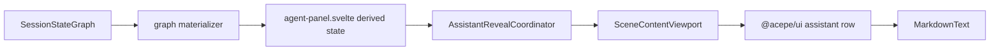
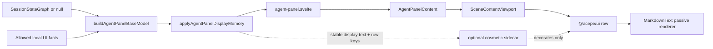

# refactor: Canonical agent-panel presentation graph

## Problem Frame

The streaming/markdown migration is not finished. The app now has too many places deciding what the user should see:



That chain looks clean at a distance, but in practice several layers still own behavior:

- `agent-panel.svelte` patches terminal turn state for display.
- `assistant-reveal-coordinator.svelte.ts` mutates assistant visible text and reveal activity.
- `SceneContentViewport` creates thinking rows, native fallback state, merged assistant rows, and layout protection.
- `MarkdownText` still chooses between full text and reveal text, then runs extra async markdown/badge work.
- The optional animation layer is inside the text rendering path, so a cosmetic bug can still blank text or freeze the panel.

The recent freeze shows the core failure clearly: backend session state completed, but the frontend render loop kept working until WebContent froze. That means the final architecture cannot be another small patch. The clean shape should be:

```text
canonical graph -> base display model -> display memory helper -> passive renderer -> optional cosmetic animation
```

The base display model is the only layer allowed to decide canonical-overlap display facts: rows, labels, status, waiting indicators, composer gates, row identity, and canonical assistant text. A small display memory helper may preserve bounded mounted-panel presentation memory, such as prior display text for no-blank replacement safety. Components render the final display model. Animation may decorate the already-correct model, but it must never become text truth.

## Requirements Trace

- R1. Preserve the one-authority direction from the final GOD requirements: provider facts -> canonical graph -> display-safe UI model. No component or display memory helper may repair lifecycle, turn state, assistant text, or row identity from local guesses. (see origin: `docs/brainstorms/2026-04-25-final-god-architecture-requirements.md`)
- R2. Finish the content reliability goal: all agent-panel rows render from one scene/presentation contract, with no hidden transcript fallback or split render path. (see origin: `docs/brainstorms/2026-05-01-agent-panel-content-reliability-rewrite-requirements.md`)
- R3. Keep live markdown readable, but only for text already present as `displayText` in the display model. Markdown must not reveal future text, reset `displayText`, or control reveal lifecycle. (see origin: `docs/brainstorms/2026-04-15-streaming-markdown-during-reveal-requirements.md`)
- R4. Once non-empty assistant `displayText` is rendered, replacement updates must not collapse it to blank. Same-key non-prefix rewrites must either keep prior `displayText` until replacement is ready or switch atomically to the replacement text.
- R5. A completed canonical graph turn must not leave the panel showing "Planning next moves" forever. If backend logs prove completion but canonical graph state remains stale, fix or widen canonical graph derivation rather than overriding it in the presentation layer.
- R6. Rendering and scroll work during streaming must stay bounded to current rows and the live tail. No per-token or per-frame work should scan or remount the full transcript.
- R7. The final code must delete old authority paths instead of leaving coexistence as the endpoint.

## Scope Boundaries

In scope:

- Agent-panel display state for conversation rows, assistant display text, status labels, waiting indicators, and scroll/follow inputs.
- Desktop Svelte components that consume the agent-panel scene.
- `@acepe/ui` agent-panel row types where the presentation contract needs to be clearer.
- Tests for the broken streaming cases, same-key rewrites, terminal turn cleanup, passive markdown rendering, and no-hang render behavior.

Out of scope:

- Provider protocol changes. If a missing canonical graph fact is discovered, stop and create a separate canonical graph plan instead of patching presentation.
- A new visual redesign of the agent panel.
- Restoring smooth typewriter animation as a requirement. The first goal is correctness and no freeze. Animation is optional after the passive renderer is proven.
- A durable provider-history or database migration.

## Context & Research

Relevant current code:

- `packages/desktop/src/lib/acp/session-state/agent-panel-graph-materializer.ts` already creates a shared agent-panel scene from `SessionStateGraph`, but it also accepts optimistic live entries, maps status, and still feeds later presentation rewriting.
- `packages/desktop/src/lib/acp/components/agent-panel/components/agent-panel.svelte` currently combines graph state, local terminal overrides, optimistic entries, reveal coordinator output, and status logic.
- `packages/desktop/src/lib/acp/components/agent-panel/logic/session-status-mapper.ts` maps canonical lifecycle/activity/turn state, including a local terminal override.
- `packages/desktop/src/lib/acp/components/agent-panel/logic/assistant-reveal-coordinator.svelte.ts` currently owns mounted-panel reveal state and visible assistant text.
- `packages/desktop/src/lib/acp/components/agent-panel/components/scene-content-viewport.svelte` owns row merging, thinking-row insertion, fallback, scroll/follow, and renderer dispatch.
- `packages/desktop/src/lib/acp/components/messages/markdown-text.svelte` renders markdown and still responds to reveal state directly.
- `packages/ui/src/components/agent-panel/agent-assistant-message.svelte` splits assistant message groups and passes reveal state down to desktop-rendered text groups.

Institutional learnings to follow:

- `docs/solutions/architectural/canonical-projection-widening-2026-04-28.md`: widen the upstream canonical/presentation contract instead of falling back to hot state.
- `docs/solutions/best-practices/canonical-session-projection-ui-derivation-2026-05-01.md`: UI-visible lifecycle, activity, and turn state should derive from canonical projection helpers.
- `docs/solutions/best-practices/agent-panel-content-viewport-reactivity-renderer-2026-05-01.md`: viewport owns layout, not row semantics, and timers should stay out of ordinary rows.
- `docs/solutions/ui-bugs/assistant-text-reveal-streaming-block.md`: reveal freshness is presentation-only, but the current implementation put too much lifecycle inside render components.

## Key Technical Decisions

- **Introduce one base display builder and one display memory helper.** Add `packages/desktop/src/lib/acp/components/agent-panel/logic/agent-panel-display-model.ts` for graph-to-display projection, and a small helper for bounded history-sensitive display memory.
- **Move all canonical-overlap display decisions into the base display builder.** Status, waiting label, composer gates, optimistic user placement, live assistant placement, canonical assistant text, row keys, and live-tail layout flags are computed before Svelte renders.
- **Split the graph materializer before wrapping it.** The display builder must not simply wrap `materializeAgentPanelSceneFromGraph(...)` while that function still owns status, optimistic/live overlays, or display ordering. First split out graph-only normalization, then make the display builder the only place where graph rows and allowed local facts combine.
- **Use the display memory helper only for bounded display memory.** The helper may preserve prior assistant `displayText`, fade range metadata, and reset boundaries by session/turn/row key. It must never invent lifecycle, activity, waiting state, provider status, row identity, canonical text, or composer authority.
- **Keep local facts on a strict allowlist.** Local facts may only describe mounted-panel intent or UI decoration: pending user entry before canonical acceptance, pending send intent, selected animation preference, scroll intent, and display memory. A local live assistant overlay is not allowed. Local facts may not invent lifecycle, activity, provider status, terminal completion, or assistant content.
- **Remove terminal override from display truth.** A locally observed terminal event may be used for diagnostics and tests that expose stale canonical state. It must not make the UI display `Completed` if the canonical graph still says `Running`.
- **Make renderer components passive.** `agent-panel.svelte`, `agent-panel-content.svelte`, `SceneContentViewport`, `AgentPanelConversationEntry`, and `MarkdownText` receive already-decided model fields. They do not decide whether text is streaming, complete, blank, or waiting.
- **Make display text correctness non-optional.** The model may return full text immediately. If animation is disabled or broken, the correct text still displays. Animation can only add CSS/opacity around already-visible text.
- **Delete the reveal coordinator as a text authority.** It can be removed entirely or replaced by a tiny cosmetic helper that never owns `canonicalText` or `displayText`. No `setTimeout`, `requestAnimationFrame`, child activity callback, or markdown cache may decide the actual text value.
- **Keep viewport layout-only.** `SceneContentViewport` should own scroll, virtualization/fallback, and row mounting. It should not create assistant reveal state, merge assistant rows, create thinking rows, clear reveal state, or infer waiting state from child lifecycle callbacks.
- **Move animation out of `MarkdownText`'s text path.** `MarkdownText` renders `text`. A wrapper or CSS-only sidecar may decorate the rendered text, but animation must not walk, split, or replace DOM text nodes in a way that can change `textContent`.
- **Allow a narrow thinking-duration decoration.** A thinking row may update its own elapsed display from a stable `startedAtMs`, but that timer must not invalidate every row or change session activity/waiting state.
- **Prefer behavior tests over source-shape tests.** Tests should exercise display-model inputs and rendered outputs. Do not add brittle tests that read source files and assert strings.

## Target Model

Directional shape, not implementation code:

```ts
interface AgentPanelDisplayInput {
  panelId: string;
  graph: SessionStateGraph | null;
  header: AgentPanelGraphHeaderInput;
  local: {
    pendingUserEntry: SessionEntry | null;
    pendingSendIntent: boolean;
    streamingAnimationMode: StreamingAnimationMode;
  };
}

interface AgentPanelBaseModel {
  status: AgentPanelSessionStatus;
  turnState: TurnState;
  waiting: {
    show: boolean;
    label: string;
  };
  composer: {
    canSubmit: boolean;
    showStop: boolean;
  };
  rows: readonly AgentPanelDisplayRow[];
  viewport: {
    shouldFollowTail: boolean;
    hasLiveTail: boolean;
  };
}

interface AgentPanelDisplayMemory {
  sessionId: string | null;
  displayTextByRowKey: ReadonlyMap<string, string>;
}

interface AgentPanelDisplayResult {
  model: AgentPanelDisplayModel;
  memory: AgentPanelDisplayMemory;
}
```

The intended helper shape is:

```ts
buildAgentPanelBaseModel(input: AgentPanelDisplayInput): AgentPanelBaseModel;

applyAgentPanelDisplayMemory(
  previousMemory: AgentPanelDisplayMemory,
  baseModel: AgentPanelBaseModel
): AgentPanelDisplayResult;
```

`displayText` is the text components render. `canonicalText` is the latest text from the graph. Animation metadata may decorate `displayText`, but it never changes `displayText`.



## Ownership Table

| Concern | Owner |
|---|---|
| lifecycle/activity/turn state | canonical graph |
| status and waiting label | `buildAgentPanelBaseModel` |
| composer gates | `buildAgentPanelBaseModel` from canonical actionability plus allowed pending-send intent |
| row identity and row order | `buildAgentPanelBaseModel` |
| assistant `canonicalText` | canonical graph-derived row |
| assistant `displayText` no-blank safety | `applyAgentPanelDisplayMemory` |
| markdown parsing/rendering | `MarkdownText`, from provided `text` only |
| scroll, user detach/follow, fallback window, row mounting | `SceneContentViewport` |
| fade/animation | optional cosmetic sidecar |

## Local Fact Allowlist

| Local input | Source | Allowed to affect | Must not affect | Reset/reject when |
|---|---|---|---|---|
| `pendingUserEntry` | panel transient send path | optimistic user row before canonical acceptance | canonical transcript, lifecycle, turn state | canonical user row is accepted, session changes, send fails |
| `pendingSendIntent` | panel transient send path | temporary composer disable / immediate waiting affordance | canonical actionability, terminal completion | canonical turn state or send failure arrives |
| `streamingAnimationMode` | chat preferences read by controller only | cosmetic animation metadata | text, status, waiting, row identity | preference changes |
| scroll intent | viewport/follow controller | scroll/follow behavior only | text, status, waiting, row identity | user detaches, session changes |
| display memory | `applyAgentPanelDisplayMemory` | assistant `displayText` and fade metadata | canonical text, status, waiting, composer gates | session changes, turn changes, row key changes, completed canonical turn, or tail-window eviction |
| live assistant overlay | not accepted | not allowed | canonical assistant text or row identity | reject always |

## Resolved Pre-Code Decisions

There are no architecture choices left open for implementation. These are the fixed decisions:

- **Materializer boundary:** split `materializeAgentPanelSceneFromGraph(...)` into graph-only normalization plus display building. The display builder may consume graph-only normalized rows. It must not wrap a materializer that still owns status, optimistic/live overlays, waiting state, or final display ordering.
- **Display memory reset rules:** display memory is keyed by `sessionId`, `turnId`, `rowKey`, and `canonicalTextRevision`. It is bounded to the live tail window. It resets on session change, turn change, row-key change, completed canonical turn, and tail-window eviction.
- **Completed-turn rule:** when the canonical graph says the turn is completed, assistant `displayText` must equal `canonicalText`. Display memory cannot preserve older text over completed canonical truth.
- **Same-key replacement rule:** while the canonical turn is running, same-key non-prefix replacement may keep prior non-empty `displayText` only until the new replacement is non-empty and ready to render. It may not keep text across a session, turn, or row-key boundary.
- **Stale terminal rule:** if local diagnostics say terminal complete but canonical graph says `Running`/`awaiting_model`, display stays running. That is a canonical graph bug, not a presentation fix.
- **Unit 1A tests:** characterize current behavior in current files, including local terminal override and reveal/markdown authority. These tests document what is being deleted.
- **Unit 1B tests:** fail against the new display contract until `buildAgentPanelBaseModel` and `applyAgentPanelDisplayMemory` exist.
- **Viewport flags:** the display model owns layout facts named `hasLiveTail` and `requiresStableTailMount`. The viewport may read those flags, but it may not inspect reveal state, assistant text, or animation metadata to choose fallback.
- **Live assistant overlay:** blocked. It is not part of the display input. Assistant text comes from graph-normalized rows only. If live graph data is stale, fix graph delivery/projection instead of overlaying transient assistant text.
- **Store-clean render path:** below `agent-panel.svelte`, main-path components may not call `getSessionStore`, `getInteractionStore`, `operationStore`, or `getChatPreferencesStore` for display truth. All such data arrives as explicit display model fields.
- **Animation location:** animation is outside `MarkdownText`'s text path. `MarkdownText` renders text only; animation can add CSS/classes around it but cannot walk or replace DOM text nodes.

## Implementation Units

- [ ] **Unit 1A: Characterize current broken behavior**

Goal: Capture what is broken today before deleting the old path.

Requirements: R4, R5, R6

Files:

- Create: `packages/desktop/src/lib/acp/components/agent-panel/logic/__tests__/agent-panel-display-model.test.ts`
- Modify: `packages/desktop/src/lib/acp/components/agent-panel/logic/__tests__/assistant-reveal-coordinator.test.ts`
- Modify: `packages/desktop/src/lib/acp/components/messages/markdown-text.svelte.vitest.ts`
- Modify: `packages/desktop/src/lib/acp/components/agent-panel/components/__tests__/scene-content-viewport.svelte.vitest.ts`

Test scenarios:

- Same-key assistant replacement with an empty common prefix never produces a blank assistant `displayText` after non-empty text was already displayed.
- A canonical graph with `Completed`/idle state produces no waiting indicator.
- A local terminal observation cannot override a canonical graph that still says `Running`/`awaiting_model`; instead the test should expose the stale canonical bug.
- A burst of tiny assistant updates produces bounded model changes and does not require child callbacks to clear activity.
- `MarkdownText` receives plain `text` and renders it; reveal/cosmetic props may change visual treatment but not the text truth.
- The viewport renders a model with rows and does not need child `onRevealActivityChange` to decide whether the session is active.

Verification:

- Characterization tests clearly document current behavior and name which behavior will be deleted.

- [ ] **Unit 1B: Write failing tests for the new display contract**

Goal: Add tests for the new base model and display memory contract before implementation.

Requirements: R1, R4, R5, R6

Files:

- Create: `packages/desktop/src/lib/acp/components/agent-panel/logic/__tests__/agent-panel-display-model.test.ts`
- Modify: `packages/desktop/src/lib/acp/components/agent-panel/logic/__tests__/session-status-mapper.test.ts`

Test scenarios:

- `buildAgentPanelBaseModel` produces waiting/status/composer state only from canonical graph plus the local allowlist.
- `applyAgentPanelDisplayMemory` keeps `displayText` non-blank for same session/turn/row replacement while canonical turn is running.
- Completed canonical turn forces `displayText === canonicalText`; stale memory cannot hide a completed canonical blank or replacement.
- Stale local terminal diagnostics cannot override canonical `Running`/`awaiting_model`.
- 100-500 tiny assistant updates keep row count bounded, update only the live-tail row, and do not require child callbacks to clear activity.

Verification:

- The tests fail until the new model/helper exists.

- [ ] **Unit 2: Add the base display model and display memory helper**

Goal: Create the single display authority that consumes graph-only normalized rows and allowed local facts, plus a narrow helper for no-blank display memory.

Requirements: R1, R2, R4, R5

Files:

- Create: `packages/desktop/src/lib/acp/components/agent-panel/logic/agent-panel-display-model.ts`
- Modify: `packages/desktop/src/lib/acp/components/agent-panel/logic/index.ts`
- Modify: `packages/desktop/src/lib/acp/components/agent-panel/logic/session-status-mapper.ts`
- Test: `packages/desktop/src/lib/acp/components/agent-panel/logic/__tests__/agent-panel-display-model.test.ts`
- Test: `packages/desktop/src/lib/acp/components/agent-panel/logic/__tests__/session-status-mapper.test.ts`

Approach:

- Split `materializeAgentPanelSceneFromGraph(...)` so the new display model consumes graph-only normalized rows rather than a pre-shaped display model.
- Remove or isolate materializer responsibilities that belong in the display model: status, optimistic/live overlays, waiting state, and final display ordering.
- Fold canonical status/waiting derivation into the display builder or make it a private helper used only by the display builder.
- Produce the waiting label, composer gates, stop-button state, and effective turn state in the model.
- The display builder must not use local terminal override. Stale terminal completion is a canonical graph bug by definition.
- Represent assistant rows with `canonicalText` from graph projection plus `displayText` from `applyAgentPanelDisplayMemory`.
- Keep display memory bounded by session id, turn id, row key, canonical text revision, and a small tail window. Session switch, turn boundary, row-key replacement, or completed canonical turn must reset stale memory.

Test scenarios:

- Null graph plus pending user entry produces one user row and a waiting label.
- Ready graph with completed turn produces no waiting label and no stop state.
- Canonical `Running`/`awaiting_model` stays running even if a local terminal diagnostic fact exists. This prevents hidden UI repair.
- Canonical `Completed`/idle clears waiting without any local terminal override.
- Same-key non-prefix assistant replacement preserves previous `displayText` or atomically switches to replacement text without blank while the canonical turn is running.
- Completed canonical assistant row with empty text does not show previous session/turn text.
- Older local live assistant text cannot overwrite newer graph assistant text.
- Optimistic user ordering is consistent with current user-visible expectations. Live assistant overlay is rejected.

Verification:

- Pure display-model tests pass without Svelte component mounting.
- `materializeAgentPanelSceneFromGraph(...)` no longer accepts `optimistic.liveAssistantEntry` as a display authority.
- No `try/catch`, no `any`, no untyped values, and no forbidden spread-based shape merges.

- [ ] **Unit 3: Wire `agent-panel.svelte` to consume only the display model**

Goal: Remove scattered derived display state from the controller and pass one model downward.

Requirements: R1, R5, R7

Files:

- Modify: `packages/desktop/src/lib/acp/components/agent-panel/components/agent-panel.svelte`
- Modify: `packages/desktop/src/lib/acp/components/agent-panel/types/agent-panel-content-props.ts`
- Modify: `packages/desktop/src/lib/acp/components/agent-panel/components/agent-panel-content.svelte`
- Test: `packages/desktop/src/lib/acp/components/agent-panel/components/__tests__/agent-panel-content.svelte.vitest.ts`

Approach:

- Replace `graphMaterializedScene`, `graphSceneEntries`, `showPlanningIndicator`, `effectiveTurnPresentation`, and local status wiring with fields from `AgentPanelDisplayModel`.
- Keep local facts explicit in the display input: pending user, pending send intent, and selected animation preference. Live assistant overlay is rejected.
- Keep local terminal observations as diagnostics only. If stale canonical state still causes stuck waiting, route the fix upstream to canonical graph/reducer code.
- Do not let `AgentPanelContent` fall back to store-derived waiting state when the model prop is present.

Test scenarios:

- Pre-session send shows the model-provided waiting label.
- Completed canonical graph clears the waiting label even if stale transient state still exists.
- Running canonical graph is not locally forced to completed by display code.
- A session switch replaces model rows without preserving old assistant reveal state.

Verification:

- `agent-panel.svelte` no longer imports or instantiates `AssistantRevealCoordinator`.
- `AgentPanelContent` receives model fields instead of recomputing waiting/turn state from stores for the main panel path.
- Main-path child components do not call session/interaction/chat preference stores for display truth.

- [ ] **Unit 4: Make assistant rows and markdown passive**

Goal: Remove reveal lifecycle ownership from message rendering.

Requirements: R3, R4, R7

Files:

- Modify: `packages/ui/src/components/agent-panel/types.ts`
- Modify: `packages/ui/src/components/agent-panel/agent-assistant-message.svelte`
- Modify: `packages/ui/src/components/agent-panel/agent-assistant-message-visible-groups.ts`
- Modify: `packages/desktop/src/lib/acp/components/messages/content-block-router.svelte`
- Modify: `packages/desktop/src/lib/acp/components/messages/acp-block-types/text-block.svelte`
- Modify: `packages/desktop/src/lib/acp/components/messages/markdown-text.svelte`
- Test: `packages/ui/src/components/agent-panel/__tests__/agent-assistant-message-visible-groups.test.ts`
- Test: `packages/desktop/src/lib/acp/components/messages/markdown-text.svelte.vitest.ts`

Approach:

- Replace `revealRenderState` as text authority with model-provided `displayText`.
- Let `MarkdownText` accept `text` plus optional cosmetic metadata. It should not cache reveal progress, seed reveal state, or decide whether a row is active.
- Keep live markdown rendering, but render only the passed text.
- Badge mounting and async markdown work may remain, but must be guarded so stale completions cannot overwrite newer text.
- Move word-fade behavior outside the markdown text path or make it CSS-only. It must not walk or replace DOM text nodes.

Test scenarios:

- Passive `MarkdownText` renders the exact `text` prop during live and final states.
- Updating cosmetic metadata never changes the rendered text content.
- Animation enabled and animation disabled produce identical `textContent`.
- Partial markdown renders as stable partial markdown without waiting for final completion.
- Async markdown completion for old text does not replace newer text.

Verification:

- `MarkdownText` has no reveal progress cache, no `StreamingRevealController`, no DOM text-node replacement animation, and no lifecycle callback for reveal activity.
- Any remaining effect in `MarkdownText` is about markdown enrichment or badges, not text authority.

- [ ] **Unit 5: Make `SceneContentViewport` layout-only**

Goal: Viewport renders presentation rows and manages scrolling, but does not own reveal or waiting semantics.

Requirements: R2, R6, R7

Files:

- Modify: `packages/desktop/src/lib/acp/components/agent-panel/components/scene-content-viewport.svelte`
- Modify: `packages/desktop/src/lib/acp/components/agent-panel/logic/virtualized-entry-display.ts`
- Modify: `packages/desktop/src/lib/acp/components/agent-panel/logic/scene-display-rows.ts`
- Test: `packages/desktop/src/lib/acp/components/agent-panel/logic/__tests__/virtualized-entry-display.test.ts`
- Test: `packages/desktop/src/lib/acp/components/agent-panel/components/__tests__/scene-content-viewport.svelte.vitest.ts`
- Test: `packages/desktop/src/lib/acp/components/agent-panel/components/__tests__/scene-content-viewport-streaming-regression.svelte.vitest.ts`

Approach:

- Feed viewport `AgentPanelDisplayRow[]` or a close equivalent, not raw scene entries plus scattered booleans.
- Move assistant merging and thinking-row insertion into the base display model where possible.
- Keep elapsed thinking duration as a row-local decoration seeded by `startedAtMs`; it must not be an input to session activity or row identity.
- Keep native fallback bounded and recoverable, but drive fallback from layout facts only.
- Remove child reveal activity callbacks from viewport authority.

Allowed viewport logic:

- scroll follow and user detach state,
- native fallback window and retry,
- mounted row range,
- row measurement and scroll-to-index calls.

Forbidden viewport logic:

- creating thinking/waiting rows,
- merging assistant rows,
- deciding waiting state or streaming completion,
- inspecting assistant reveal state to choose fallback,
- clearing reveal activity.

Test scenarios:

- Non-empty rows never render a blank viewport after hydration.
- Thinking/waiting row appears only when the model says it should.
- Live assistant row keeps stable key and text through append, replacement, and completion.
- Session switch clears layout state but does not preserve old row semantics.
- Native fallback renders only the bounded tail window and can recover.

Verification:

- Viewport code does not inspect assistant reveal state to decide session activity.
- Viewport tests assert visible rows or scroll calls, not just "does not throw".
- `SceneContentViewport` may read model-provided layout flags such as `hasLiveTail`, but it may not inspect `displayText`, `canonicalText`, or animation metadata to infer activity.

- [ ] **Unit 6: Add optional cosmetic animation after correctness is green**

Goal: Reintroduce polish only as a sidecar that cannot break text truth.

Requirements: R3, R4, R6

Files:

- Create or modify: `packages/desktop/src/lib/acp/components/agent-panel/logic/assistant-cosmetic-animation.ts`
- Modify: `packages/ui/src/components/agent-panel/agent-assistant-message.svelte`
- Modify: `packages/desktop/src/lib/acp/components/messages/markdown-text.svelte`
- Test: `packages/desktop/src/lib/acp/components/agent-panel/logic/__tests__/assistant-cosmetic-animation.test.ts`
- Test: `packages/desktop/src/lib/acp/components/messages/markdown-text.svelte.vitest.ts`

Approach:

- Treat animation as optional metadata: fade ranges, CSS classes, or one bounded scheduler.
- If animation is disabled, interrupted, or late, the same text still renders.
- Never schedule unbounded timers per row or per token.
- Do not use child activity callbacks to clear model state.
- Prefer CSS/class-based fade over text-node walking. Any scheduler must be bounded and removable.

Test scenarios:

- Animation disabled renders the same text as animation enabled.
- Same-key replacement does not blank text while animation metadata changes.
- Large text updates do not create one timer per token or one timer per row.
- Enabling animation does not change rendered `textContent` compared with animation disabled.

Verification:

- No code path depends on animation completion to clear "Planning next moves".
- No render component owns text progress.

- [ ] **Unit 7: QA and deletion proof**

Goal: Prove the old split authority is gone and the freeze class is not reproduced.

Requirements: R1-R7

Files:

- Modify: `docs/reports/2026-05-05-streaming-qa-incident-report.md`
- Create: `docs/solutions/ui-bugs/agent-panel-presentation-graph-streaming-freeze.md`

QA scenarios:

- Fresh session: send a short prompt, assistant completes, no hanging waiting label.
- Existing session: send a follow-up, no blank blink of the previous assistant text.
- Same-key replacement fixture: `displayText` never collapses to blank.
- Long streamed markdown with lists and paragraphs remains readable during streaming.
- App stays responsive after completion; WebContent CPU returns to idle range after the turn.
- Session switch during or after streaming does not carry old assistant `displayText` into the new session.

Search/deletion gates:

- No live import of `assistant-reveal-coordinator.svelte.ts` from `agent-panel.svelte`.
- No `onRevealActivityChange` authority in viewport or markdown rendering.
- No `MarkdownText` reveal progress cache.
- No DOM text-node replacement animation in `MarkdownText`.
- No `canonical ?? hotState` fallback for lifecycle, activity, or turn display.
- No main render-path store fallback below `agent-panel.svelte`.
- No materializer input that lets local live assistant text override graph assistant text.

Verification:

- Run `bun test` for the touched TypeScript/Svelte test files.
- Run `bun run check`.
- Run Svelte-aware checks if the baseline allows it, or compare before/after errors if the baseline is dirty.
- Manual app QA after the user restarts the dev app, because `bun dev` is user-owned in this repo.

## Sequencing

1. Land Unit 1 tests first.
2. Build the base display model and display memory helper in Unit 2.
3. Wire the controller to the model in Unit 3.
4. Make assistant/markdown rendering passive in Unit 4.
5. Shrink viewport authority in Unit 5.
6. Add cosmetic animation only after correctness tests are green in Unit 6.
7. Run QA and write the durable learning in Unit 7.

This order matters. If animation comes before passive rendering, we repeat the current mistake.

## Exact Execution Checklist

Follow these steps in order. Do not start a later step if the stop condition for the current step fails.

1. **Snapshot the current failing contract**
   - Add/adjust tests in `packages/desktop/src/lib/acp/components/agent-panel/logic/__tests__/agent-panel-display-model.test.ts`.
   - Add/adjust tests in `packages/desktop/src/lib/acp/components/agent-panel/logic/__tests__/session-status-mapper.test.ts`.
   - Cover: stale terminal cannot override canonical `Running`, completed canonical clears waiting, same-key replacement cannot blank `displayText`, and 100-500 tiny assistant updates stay bounded.
   - Stop condition: tests fail for the missing new display model or expose the old local-terminal/reveal authority behavior.

2. **Split graph-only normalization out of the materializer**
   - Modify `packages/desktop/src/lib/acp/session-state/agent-panel-graph-materializer.ts`.
   - Extract graph-only row normalization from `materializeAgentPanelSceneFromGraph(...)`.
   - Remove display authority from that lower layer: no status mapping, no waiting state, no optimistic/live assistant overlay, no final display ordering.
   - Keep tool/operation row normalization that genuinely belongs to graph-derived row data.
   - Stop condition: graph-only normalization can be tested without local optimistic inputs.

3. **Create the base display model**
   - Create `packages/desktop/src/lib/acp/components/agent-panel/logic/agent-panel-display-model.ts`.
   - Add `buildAgentPanelBaseModel(input: AgentPanelDisplayInput): AgentPanelBaseModel`.
   - Input: graph or graph-normalized rows, header, `pendingUserEntry`, `pendingSendIntent`, `streamingAnimationMode`.
   - Output: status, turn state, waiting label, composer gates, display rows, `hasLiveTail`, `requiresStableTailMount`.
   - Explicitly reject local terminal override and live assistant overlay.
   - Stop condition: base-model tests pass for status, waiting, composer gates, optimistic user ordering, and live-tail flags.

4. **Create the display memory helper**
   - In the same model file or a sibling file, add `applyAgentPanelDisplayMemory(previousMemory, baseModel)`.
   - Store only bounded `displayTextByRowKey`.
   - Key memory by `sessionId`, `turnId`, `rowKey`, and `canonicalTextRevision`.
   - Reset on session change, turn change, row-key change, completed canonical turn, and tail-window eviction.
   - Stop condition: tests prove completed canonical rows force `displayText === canonicalText`, while running same-key replacement never blanks after non-empty text.

5. **Export the new display model API**
   - Modify `packages/desktop/src/lib/acp/components/agent-panel/logic/index.ts`.
   - Export only the new display model helpers needed by `agent-panel.svelte`.
   - Avoid exporting graph-only internals as general UI APIs.
   - Stop condition: imports make the ownership boundary obvious.

6. **Wire `agent-panel.svelte` to build the display model**
   - Modify `packages/desktop/src/lib/acp/components/agent-panel/components/agent-panel.svelte`.
   - Replace `graphMaterializedScene`, `graphSceneEntries`, `assistantRevealCoordinator`, `showPlanningIndicator`, and `effectiveTurnPresentation` display wiring with the new display model result.
   - Keep store access here as the controller boundary.
   - Stop condition: `agent-panel.svelte` no longer imports or instantiates `AssistantRevealCoordinator`.

7. **Make `AgentPanelContent` model-only on the main path**
   - Modify `packages/desktop/src/lib/acp/components/agent-panel/types/agent-panel-content-props.ts`.
   - Modify `packages/desktop/src/lib/acp/components/agent-panel/components/agent-panel-content.svelte`.
   - Remove main-path fallback reads from `getSessionStore`, `getInteractionStore`, `operationStore`, and `deriveLiveSessionWorkProjection`.
   - It may render project selection/loading/error states, but conversation state must come from model props.
   - Stop condition: `AgentPanelContent` main conversation path is store-clean.

8. **Make `SceneContentViewport` layout-only**
   - Modify `packages/desktop/src/lib/acp/components/agent-panel/components/scene-content-viewport.svelte`.
   - Feed it display rows and layout flags.
   - Remove assistant merging, thinking-row creation, reveal-state inspection, and waiting-state decisions.
   - Keep scroll follow, user detach, native fallback, mounted row range, and row measurement.
   - Stop condition: viewport does not read `revealRenderState`, `displayText`, `canonicalText`, or stores to infer activity.

9. **Update shared UI row types**
   - Modify `packages/ui/src/components/agent-panel/types.ts`.
   - Replace reveal-text authority props with display fields: `canonicalText`, `displayText`, and optional cosmetic animation metadata.
   - Modify `packages/ui/src/components/agent-panel/agent-assistant-message.svelte`.
   - Modify `packages/ui/src/components/agent-panel/agent-assistant-message-visible-groups.ts`.
   - Stop condition: shared UI renders provided `displayText`; it does not decide reveal progress.

10. **Make MarkdownText passive**
    - Modify `packages/desktop/src/lib/acp/components/messages/markdown-text.svelte`.
    - Remove reveal progress cache, `StreamingRevealController`, and `revealRenderState.visibleText` text switching.
    - Keep markdown render cache only for derived HTML and stale async protection.
    - Stop condition: `MarkdownText` renders exactly the `text` prop in live and final states.

11. **Move fade animation outside text truth**
    - Create or modify `packages/desktop/src/lib/acp/components/agent-panel/logic/assistant-cosmetic-animation.ts`.
    - Remove DOM text-node replacement animation from `MarkdownText`.
    - Use CSS/classes or bounded metadata that cannot change `textContent`.
    - Stop condition: animation enabled and disabled produce identical rendered text content.

12. **Delete old authority and update tests**
    - Remove live use of `packages/desktop/src/lib/acp/components/agent-panel/logic/assistant-reveal-coordinator.svelte.ts`.
    - Update tests that still assert `revealRenderState.visibleText` as text truth.
    - Update viewport tests to assert visible rows and scroll/fallback behavior, not reveal activity.
    - Stop condition: searches pass for old authority in the main render path.

13. **Run targeted tests**
    - From `packages/desktop`, run the touched test files with `bun test`.
    - Include display model, session status, materializer, markdown text, shared assistant row, and viewport tests.
    - Stop condition: targeted tests pass.

14. **Run checks**
    - From `packages/desktop`, run `bun run check`.
    - If Svelte contract files changed and the baseline allows it, run the Svelte-aware check or compare before/after errors.
    - Stop condition: no new TypeScript/Svelte errors from this work.

15. **Manual QA after user restart**
    - Do not run `bun dev`.
    - After the user restarts the app, QA: short prompt completes, no stuck waiting label, no blank blink, same-key replacement fixture, long markdown stream, session switch, animation on/off text equality, WebContent CPU returns near idle.
    - Stop condition: QA evidence is added to `docs/reports/2026-05-05-streaming-qa-incident-report.md`.

16. **Write the durable learning**
    - Create `docs/solutions/ui-bugs/agent-panel-presentation-graph-streaming-freeze.md`.
    - Document root cause, new ownership model, tests, and prevention rules.
    - Stop condition: future maintainers can tell where text, waiting state, viewport layout, markdown, and animation belong.

## Risks and Mitigations

- **Risk: The refactor is large.** Mitigation: add characterization tests first and keep the model pure so most behavior can be tested without the app.
- **Risk: We lose nice streaming polish temporarily.** Mitigation: accept this. Correct text and no freeze are more important than animation. Polish returns only after the safe seam exists.
- **Risk: Existing component tests are brittle or hanging.** Mitigation: move the hardest behavior tests to pure display-model tests, then keep one or two component tests for real rendering.
- **Risk: Local terminal override hides a backend bug.** Mitigation: do not allow terminal override in display truth. If logs show terminal completion but canonical state is stale, fix canonical graph derivation.
- **Risk: The display model becomes a new dumping ground.** Mitigation: keep the input allowlist small, reject lifecycle/activity facts that do not come from canonical graph state, and require tests for every local-fact exception.
- **Risk: A stateless builder cannot preserve no-blank text safety.** Mitigation: use a display memory helper with bounded previous-display-text memory instead of putting this memory back into Svelte components.
- **Risk: The old materializer survives as a second authority.** Mitigation: split graph-only normalization from display decisions before wiring the new model.
- **Risk: Display memory hides canonical truth.** Mitigation: completed canonical turns force `displayText === canonicalText`, and memory is scoped by session id, turn id, row key, text revision, and tail bounds.
- **Risk: Animation still causes heavy DOM work.** Mitigation: move animation outside `MarkdownText`'s text path and prove animation enabled/disabled has identical `textContent`.
- **Risk: UI package API changes ripple to website/demo code.** Mitigation: update `@acepe/ui` tests and any demo fixtures in the same unit that changes the shared type.

## Review Gate Notes

Manual document review was run after drafting with coherence, feasibility, scope, design, and adversarial lenses.

- Coherence fix applied: local display facts now have a strict allowlist so the plan does not replace one hidden authority with another.
- Consensus fix applied: display now uses a base display builder plus a display memory helper, because no-blank reveal safety needs bounded memory.
- Feasibility/GOD fix applied: terminal display override is removed from display truth. Stale canonical terminal state must be fixed upstream.
- Design fix applied: thinking duration is named as a narrow row-local decoration, not a session activity input.
- Adversarial fix applied: cosmetic animation is now a sidecar after stable text/row keys, not a second display builder.
- Deepening fix applied: names are changed to base display model, display memory helper, `displayText`, and `canonicalText`.
- Deepening fix applied: resolved decisions now block materializer wrapping, live assistant overlay, store fallbacks below `agent-panel.svelte`, and DOM text-node animation.

## Definition of Done

- There is one base display model plus one display memory helper for agent-panel rows, status, waiting label, composer gates, and assistant `displayText`.
- Local terminal observations cannot override canonical lifecycle/activity/turn display state.
- `agent-panel.svelte` wires the model; it does not own reveal lifecycle.
- `SceneContentViewport` owns layout and scrolling only.
- `MarkdownText` is a passive markdown renderer of provided text.
- Animation enabled/disabled produces the same text content.
- Cosmetic animation can be removed or disabled without changing what text appears.
- The known freeze/hanging-planning flow is covered by tests and manual QA.
- `bun run check` passes after TypeScript/Svelte changes.
