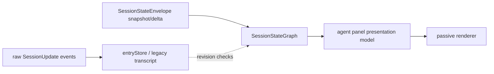
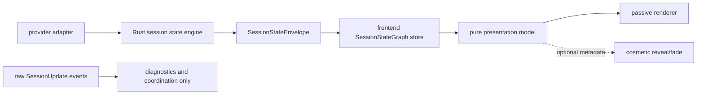

# refactor: Canonical transcript event authority

## Problem Frame

The current streaming bug is not only a markdown or reveal issue. Live QA showed a stronger split:

- The visible UI showed only `D` for the latest assistant answer.
- The streaming JSONL log had the complete assistant answer.
- The SQLite journal had all `396` assistant chunks for the same message.
- `acp_get_session_state` returned a completed canonical graph with the full assistant text.

So the provider, database, and Rust canonical graph were complete. The frontend render state was stale.

The likely cause is still having two event voices in the frontend:

That shape is unsafe because raw events can advance `entryStore` before the canonical envelope updates `sessionStateGraphs`. When the canonical delta arrives, frontend code can compare it against the already-advanced `entryStore` revision and skip the graph update. The UI then renders a stale graph, even though the backend graph is correct.

The target architecture must be:

Raw events may help diagnostics and narrow coordination. They must not own visible transcript text, transcript revisions, assistant row identity, turn completion, or render state.

## Requirements Trace

- R1. `SessionStateGraph` is the only product-state authority for transcript rows, assistant text, lifecycle, activity, turn state, actionability, and row identity. (see origin: `docs/brainstorms/2026-04-25-final-god-architecture-requirements.md`)
- R2. Raw `SessionUpdate` events may not mutate visible transcript state or decide whether canonical graph deltas are fresh. (see origin: `docs/solutions/architectural/revisioned-session-graph-authority-2026-04-20.md`)
- R3. The frontend graph store must route canonical deltas against its own graph revision, not against `entryStore` revision.
- R4. `entryStore` must either become a graph-derived compatibility cache or be removed from render-facing paths. It must not be a parallel source of transcript truth.
- R5. Agent panel rendering must use this plan to remove transcript fallbacks that can keep the `D`-only bug alive. The broader pure presentation migration remains in `docs/plans/2026-05-06-001-refactor-agent-panel-presentation-graph-plan.md`.
- R6. The reveal/fade animation stays allowed, but it can only decorate already-correct display text. It must not control text lifecycle, reset text, or hide completed text.
- R7. A completed backend canonical graph and a completed frontend canonical graph must render the same latest assistant text. The `D`-only bug is a release-blocking failure.
- R8. Implementation must be test-first. Characterization tests should prove the current split-brain before code changes.
- R9. The migration endpoint is clean replacement, not coexistence. Old raw transcript authority paths should be deleted or quarantined, not kept as fallback.

## Scope Boundaries

In scope:

- `SessionStateEnvelope` routing and frontend graph storage.
- Raw `SessionUpdate` handling in the frontend.
- `entryStore` responsibilities and its remaining consumers.
- Agent panel presentation model and render path only where needed to remove transcript fallback.
- Tests and MCP QA for the live `D`-only / hanging response failure.

Out of scope:

- Provider protocol redesign.
- Database schema migration.
- A visual redesign of the agent panel.
- A new recovery system based on raw JSONL logs.
- Keeping a second transcript pipeline for "safety". That is the bug class.

## Current Evidence

Live QA session:

- Session id: `019df8c6-6615-7c73-abc3-b7d64fce3191`
- Latest prompt: `Now give me the biography of Darth Maul.`
- UI visible answer: `D`
- Log path: `/Users/alex/Library/Application Support/Acepe/logs/streaming/019df8c6-6615-7c73-abc3-b7d64fce3191.jsonl`
- Log/journal assistant chunks: `396`
- Backend canonical graph:
  - `graphRevision: 767`
  - `lastEventSeq: 767`
  - `turnState: "Completed"`
  - latest assistant text length: `1632`

This proves the bug sits between frontend event application and presentation rendering.

## Existing Patterns To Follow

- `docs/solutions/architectural/revisioned-session-graph-authority-2026-04-20.md`: raw ACP frames may coordinate and observe only; canonical session envelopes own transcript state.
- `docs/solutions/architectural/canonical-projection-widening-2026-04-28.md`: when a UI needs missing canonical facts, widen canonical projection instead of reading hot state.
- `docs/solutions/best-practices/canonical-session-projection-ui-derivation-2026-05-01.md`: UI-visible session state should derive from canonical projection helpers.
- `docs/solutions/ui-bugs/agent-panel-composer-split-brain-canonical-actionability-2026-04-30.md`: split-brain UI state already broke Send/Stop and planning labels; transcript text is the same kind of bug.
- `.agent-guides/svelte.md`: keep Svelte components passive and prefer derived values over side-effect loops.

## Key Decisions

- **Canonical graph frontier is the only delta gate.** `routeSessionStateEnvelope(...)` and `applySessionStateEnvelope(...)` must use the current `SessionStateGraph.transcriptSnapshot.revision`, not `entryStore.getTranscriptRevision(...)`.
- **Raw transcript writes are not product writes.** Raw assistant/user chunks may be recorded for debug or narrow pending-send coordination, but they must not update render-visible transcript rows.
- **`entryStore` becomes compatibility, not truth.** Any remaining `SessionEntry[]` consumers must either read from the canonical graph/presentation model or use an `entryStore` cache that is populated from canonical graph snapshots/deltas.
- **No raw fallback for assistant text.** If canonical graph text is stale, fix envelope delivery, graph application, or canonical refresh. Do not overlay raw chunks into the agent panel.
- **Presentation model remains the eventual UI contract.** This plan only performs the presentation work required to remove raw/entryStore transcript authority. The full passive-renderer cleanup stays in the companion presentation plan.
- **Animation is cosmetic only.** Reveal/fade metadata may exist, but the displayed text must still be correct if animation is disabled or broken. Animation may not store replacement text, preserve one-character text, or own canonical/display text.
- **Backend canonical snapshot is the only recovery truth, but recovery is follow-up unless proven needed.** If Units 1-4 prove envelope delivery can still leave a stale frontend graph after graph-local gating is fixed, add a later recovery slice using `acp_get_session_state`. Do not add raw JSONL or `entryStore` recovery.

## Raw Event Allowlist

Raw `SessionUpdate` handling may keep only non-visible plumbing:

- debug recording in `raw-streaming-store`,
- sequence/order diagnostics,
- provider-session connection bookkeeping that does not affect labels, rows, text, lifecycle, activity, turn state, or composer gates,
- pre-canonical send bookkeeping needed to avoid double-submit before the canonical session exists.

Raw events may not write or imply:

- assistant text,
- user text after canonical acceptance,
- transcript revision/frontier,
- row id or row order,
- lifecycle,
- activity,
- turn state,
- waiting label,
- composer actionability,
- completed/error state,
- markdown/reveal state.

Tool, permission, and question UI facts are not migrated in this slice. If implementation discovers one of those facts is still raw-only and visible, stop that sub-slice and create a canonical widening follow-up. Do not keep the raw fact as visible product state in this plan.

## Canonical Frontier Definitions

- **Graph transcript revision:** `sessionStateGraphs.get(sessionId)?.transcriptSnapshot.revision`.
- **Envelope transcript revision:** the transcript revision carried by a canonical `SessionStateEnvelope` snapshot or delta.
- **Stale graph:** a frontend graph whose graph transcript revision is lower than an accepted canonical envelope transcript revision.
- **Envelope gap:** a missing canonical envelope sequence/revision proven only from canonical envelope metadata, not from raw chunks or `entryStore`.
- **Recovery trigger:** out of this plan unless Units 1-4 prove a canonical envelope gap remains after graph-local gating is fixed.

## Implementation Units

- [ ] **Unit 1: Characterize the split-brain regression**
  - Files:
    - `packages/desktop/src/lib/acp/store/__tests__/session-store-projection-state.vitest.ts`
    - `packages/desktop/src/lib/acp/store/__tests__/session-event-service-streaming.vitest.ts`
    - `packages/desktop/src/lib/acp/store/__tests__/canonical-projection-parity.test.ts`
  - Add a failing test where raw transcript handling advances `entryStore`, then a canonical transcript delta with a higher graph revision arrives. Expected: `sessionStateGraphs` updates to the full canonical text.
  - The current failing behavior to capture: `entryStore` advances first, the canonical delta is skipped, and `sessionStateGraphs` remains at the first chunk or an older text.
  - Add a failing test where raw assistant chunks are received without a canonical envelope. Expected: no visible canonical assistant row is created from raw chunks, and no transcript revision/frontier, row id, lifecycle/activity, or presentation output changes.
  - Add a parity test where live envelope application and cold snapshot replacement produce the same latest assistant text.

- [ ] **Unit 2: Route canonical envelopes by graph revision**
  - Files:
    - `packages/desktop/src/lib/acp/store/session-store.svelte.ts`
    - `packages/desktop/src/lib/acp/session-state/session-state-command-router.ts`
    - `packages/desktop/src/lib/acp/session-state/session-state-query-service.ts`
    - `packages/desktop/src/lib/acp/session-state/session-state-command-router.test.ts`
    - `packages/desktop/src/lib/acp/session-state/session-state-query-service.test.ts`
  - Replace `entryStore` transcript revision checks with graph-local transcript revision checks.
  - Make snapshot replacement compare incoming canonical graph revisions against existing canonical graph revisions.
  - After applying graph state, update any compatibility cache from the graph, not before it.
  - Tests:
    - direct command-router/query-service tests cover graph-revision routing rules.
    - `session-store-projection-state.vitest.ts` covers same-revision raw/graph races.
    - `canonical-projection-parity.test.ts` covers live-vs-cold equivalence.

- [ ] **Unit 3A: Quarantine raw user/assistant transcript handling**
  - Files:
    - `packages/desktop/src/lib/acp/store/session-event-service.svelte.ts`
    - `packages/desktop/src/lib/acp/store/session-entry-store.svelte.ts`
    - `packages/desktop/src/lib/acp/store/services/chunk-aggregator.ts`
    - `packages/desktop/src/lib/acp/store/raw-streaming-store.svelte.ts`
  - Delete or disable raw user/assistant chunk writes that create render-visible transcript entries or advance transcript revisions.
  - Keep raw chunk recording for diagnostics only.
  - Tests:
    - `session-event-service-streaming.vitest.ts` proves raw chunks do not create visible assistant transcript rows.
    - raw chunk tests prove raw chunks do not change transcript frontier, row ids, lifecycle/activity, waiting label, composer actionability, or presentation output.

- [ ] **Unit 3B: Keep tool/permission/question coordination working without widening this slice**
  - Files:
    - `packages/desktop/src/lib/acp/store/session-event-service.svelte.ts`
    - `packages/desktop/src/lib/acp/store/services/transcript-tool-call-buffer.svelte.ts`
  - Preserve existing non-transcript behavior only where it stays inside the raw event allowlist.
  - If a visible UI fact is raw-only, document it as a follow-up canonical widening item instead of solving it through raw UI authority here.
  - Tests:
    - existing tool/permission/question tests continue to pass or are marked for canonical widening if they assert raw visible authority.

- [ ] **Unit 4: Rebuild `entryStore` as graph-derived compatibility for required paths**
  - Files:
    - `packages/desktop/src/lib/acp/store/session-entry-store.svelte.ts`
    - `packages/desktop/src/lib/acp/store/session-store.svelte.ts`
    - `packages/desktop/src/lib/acp/store/types.ts`
    - render-facing consumers found by `rg "getEntries\\(|sessionEntries|entryStore" packages/desktop/src/lib/acp/components packages/desktop/src/lib/acp/store`
    - known review targets: `tab-bar-store.svelte`, `checkpoint-timeline.svelte`, `agent-panel-session-menu-workflow.ts`, and agent-panel logic helpers that receive `SessionEntry[]`.
  - For each render-facing consumer, choose one of two outcomes:
    - replace it with canonical graph or presentation model access,
    - or feed it from a graph-derived compatibility cache.
  - Non-render consumers can remain only if they do not affect canonical freshness, visible transcript text, status, waiting labels, or composer actionability.
  - Delete or privatize raw-facing `entryStore` mutators that append/update entries or transcript revisions. Leave a single graph-derived write path for compatibility cache updates.
  - No consumer may use `entryStore` revision to judge canonical freshness.
  - Tests:
    - update affected store tests to assert graph-derived entries match canonical transcript snapshots.
    - remove tests that require raw chunk aggregation for visible assistant text.

- [ ] **Unit 5: Remove transcript fallback from the agent-panel render path**
  - Files:
    - `packages/desktop/src/lib/acp/components/agent-panel/logic/agent-panel-display-model.ts`
    - `packages/desktop/src/lib/acp/session-state/agent-panel-graph-materializer.ts`
    - `packages/desktop/src/lib/acp/components/agent-panel/components/agent-panel.svelte`
    - `packages/desktop/src/lib/acp/components/agent-panel/components/agent-panel-content.svelte`
    - `packages/desktop/src/lib/acp/components/agent-panel/components/scene-content-viewport.svelte`
    - `packages/desktop/src/lib/acp/components/messages/markdown-text.svelte`
  - Remove the transcript fallback needed for the `D`-only bug. Do not expand this unit into the full presentation migration unless a direct fallback blocks the fix.
  - Agent panel rows and assistant text come from canonical graph-derived fields only.
  - `SceneContentViewport` must not inspect raw chunks or child reveal callbacks to decide visible text or waiting state.
  - `MarkdownText` must not cache reveal progress or override provided text.
  - Tests:
    - `agent-panel-display-model.test.ts` covers completed turns, live turns, pending user rows, and no-blank replacement.
    - `scene-content-viewport-streaming-regression.svelte.vitest.ts` proves child unmounts cannot clear reveal/waiting authority.
    - `markdown-text.svelte.vitest.ts` proves markdown does not own reveal lifecycle or text cache.

- [ ] **Unit 6: Decide whether canonical refresh is still needed**
  - Files:
    - `packages/desktop/src/lib/acp/store/session-store.svelte.ts`
    - `packages/desktop/src/lib/acp/store/session-event-service.svelte.ts`
  - After Units 1-5, re-run the stale-graph tests and MCP QA.
  - If the graph still goes stale without raw/entryStore gating, create a separate canonical refresh plan.
  - Any refresh trigger must use canonical envelope sequence/revision facts only.
  - Tests:
    - if a refresh slice is created, it must test backend `Completed` plus frontend stale graph recovering through `acp_get_session_state` without raw chunks or duplicate rows.

- [ ] **Unit 7: MCP QA harness for the real app**
  - Files:
    - `docs/reports/2026-05-05-streaming-qa-incident-report.md`
  - Use the Hypothesi Tauri MCP connection to inspect the running app without screenshots as the main proof.
  - Do not add debug UI in this slice. Use existing MCP/app inspection and update the report.
  - QA scenarios:
    - one-word answer completes and does not hang,
    - long biography answer renders more than the first character,
    - same session second prompt renders full answer,
    - completed canonical graph means no stuck `Planning next moves`,
    - UI latest assistant text equals backend `acp_get_session_state` latest assistant text,
    - raw JSONL and DB journal are only diagnostic evidence, not UI recovery input.

## Execution Order

1. Unit 1 first: make the current bug fail in tests.
2. Unit 2 second: fix the graph delta gate.
3. Unit 3A third: stop raw user/assistant events from writing visible transcript state.
4. Unit 3B fourth: keep non-transcript raw coordination working inside the allowlist.
5. Unit 4 fifth: remove or downgrade required `entryStore` render authority.
6. Unit 5 sixth: remove transcript fallback from the agent-panel render path.
7. Unit 6 seventh: decide whether canonical refresh remains necessary.
8. Unit 7 last: run MCP QA against the app and update the incident report.

## Verification Gates

- `cd packages/desktop && bun run check`
- `cd packages/desktop && bun test --run session-store-projection-state`
- `cd packages/desktop && bun test --run session-event-service-streaming`
- `cd packages/desktop && bun test --run canonical-projection-parity`
- `cd packages/desktop && bun test --run agent-panel-display-model`
- `cd packages/desktop && bun test --run scene-content-viewport`
- `cd packages/desktop && bun test --run markdown-text`
- MCP QA against the running app:
  - send a short answer prompt,
  - send a long answer prompt in the same session,
  - compare DOM latest assistant text with `acp_get_session_state`,
  - confirm no stuck `Planning next moves`.

## Review Checklist

- No `entryStore.getTranscriptRevision(...)` decides whether to apply a canonical graph delta.
- No raw assistant/user chunk path creates render-visible assistant/user transcript text after canonical session start.
- No `canonical ?? raw` or `canonical ?? entryStore` fallback exists for assistant text, lifecycle, activity, turn state, or actionability.
- Agent panel child components receive display model fields and do not call stores for session truth.
- `MarkdownText` has no reveal progress cache, remount recovery, or activity callbacks.
- Reveal/fade remains visually possible but cannot change `textContent`.
- The live `D`-only repro is covered by an automated test and by MCP QA.

## Risks

- Some interaction or tool-call UI may still depend on raw events. If so, classify the fact carefully. If it overlaps visible session state, widen canonical graph instead of keeping raw UI authority.
- Removing raw assistant aggregation may break tests that were testing the old architecture. Those tests should move to canonical envelope fixtures.
- Canonical refresh can become a hidden fallback if added too early. It should only handle missed canonical envelopes or graph frontier gaps, not normal streaming.
- The presentation plan and this event-authority plan touch nearby files. Keep commits or work slices small enough that review can see which authority was removed in each step.

## Non-Goals

- Do not preserve both transcript pipelines.
- Do not patch the `D` bug by reading JSONL or SQLite directly in the UI.
- Do not add a raw assistant overlay to make the panel look correct.
- Do not make animation responsible for correctness.

## Definition of Done

- The frontend canonical graph advances to the same latest assistant text as the backend canonical graph.
- The agent panel renders from the pure presentation model only.
- Raw events are diagnostics/coordination only.
- The reveal/fade animation still exists as a cosmetic layer, but disabling it does not change visible text correctness.
- Tests and MCP QA prove that repeated prompts in one session do not hang, do not blink to blank, and do not stop at the first character.
