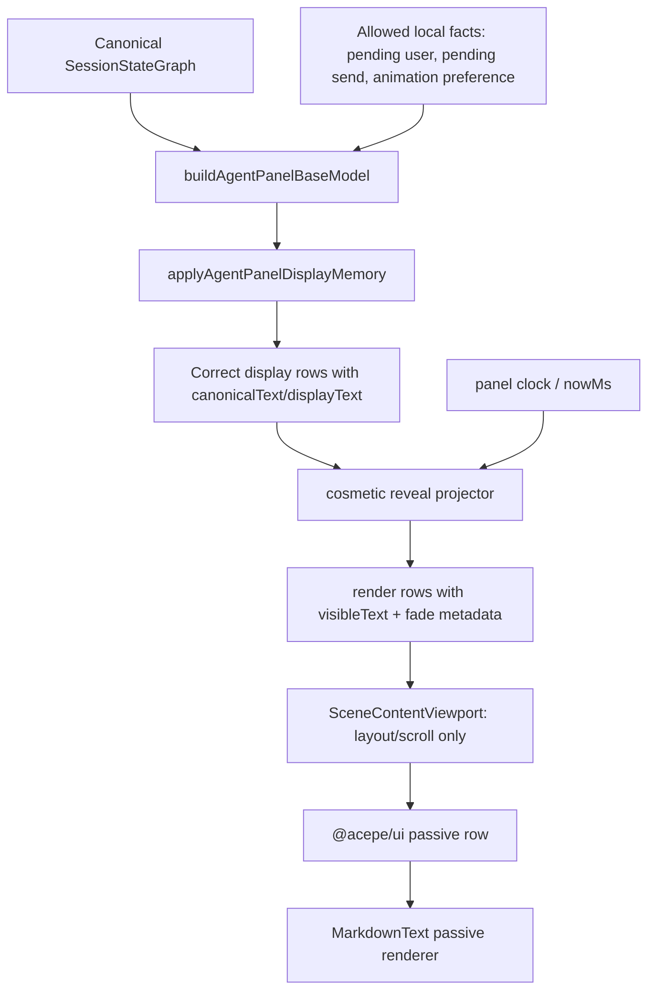

# refactor: Restore cosmetic assistant reveal projection

## Overview

Restore the nice part-by-part assistant reveal animation without bringing back the fragile architecture that caused freezes, blank rows, first-word-only replies, and split reveal authority.

The final shape is:

```text
canonical graph
  -> pure agent-panel display model
  -> cosmetic reveal projector
  -> passive renderer
```

The reveal projector is allowed to delay how much already-known assistant text is visible. It is not allowed to own session truth, assistant truth, turn truth, markdown lifecycle, viewport lifecycle, or child activity callbacks. If the reveal layer breaks, the fallback behavior must be boring and safe: show the full current display text immediately.

## Problem Frame

The old reveal animation felt good because assistant answers appeared in a smooth, readable, part-by-part way, with newly visible words fading in. During the streaming incident work, that behavior was removed or neutralized while fixing deeper correctness bugs.

The instinct to restore it is right, but simply re-adding the old reveal coordinator would reintroduce the problem:

- `MarkdownText` used to own reveal progress, remount recovery, and module-level caches.
- The viewport used to accept child reveal activity callbacks as authority.
- Shared UI and markdown rendering could influence whether the panel thought reveal was active.
- Cosmetic animation could become a text authority and create visible bugs.

The current desired architecture from `docs/plans/2026-05-06-001-refactor-agent-panel-presentation-graph-plan.md` is stricter: the display model decides rows and text, then the renderer paints passively. This plan adds animation back only after that boundary, as a cosmetic projection over the display model.

## Requirements Trace

### Authority Boundaries

- R1. Preserve canonical graph authority: assistant canonical text, row identity, lifecycle, activity, and turn state come only from canonical graph/display-model inputs.
- R4. Keep `MarkdownText` passive: it receives text and fade metadata; it does not own pacing, target selection, session lifecycle, remount recovery, or reveal caches.
- R5. Keep viewport passive with respect to reveal authority: it may receive layout hints, but child unmounts or callbacks must not decide reveal activity.
- R8. Completion must not wait on animation for truth. Canonical completion can finish while cosmetic reveal catches up or snaps to final text.

### Reveal Behavior

- R2. Restore smooth part-by-part reveal for the live assistant tail.
- R3. Preserve word/part fade for newly visible text, using metadata over visible text only.
- R6. Never replay reveal for cold completed history or restored completed turns.
- R9. Reduced motion and instant mode must show current text immediately while preserving correctness.

### Correctness and Performance

- R7. Same-key rewrites and non-prefix replacements must never collapse a previously non-empty assistant row to blank, and must not keep stale text visible beyond one projection step.
- R10. Long responses and bursty updates must stay bounded; the reveal projector must not scan or remount the full transcript per tick.

### Verification

- R11. The implementation must be test-first because this is a behavior change in a historically fragile area.

## Scope Boundaries

- In scope: live assistant tail reveal, fade metadata, display model memory, passive markdown rendering, and tests around the agent-panel render path.
- In scope: deleting or keeping dead reveal code only insofar as it affects the final architecture.
- Out of scope: provider protocol changes, Rust session graph changes, durable transcript storage, or database migrations.
- Out of scope: new user settings beyond honoring the existing streaming animation mode and reduced-motion behavior.
- Out of scope: rebuilding markdown parsing or adding a fully incremental markdown engine.
- Out of scope: making animation a hard dependency for correctness.

## Context & Research

### Relevant Code and Patterns

- `packages/desktop/src/lib/acp/components/agent-panel/logic/agent-panel-display-model.ts` is the right layer for pure graph-to-display rows and bounded display memory.
- `packages/desktop/src/lib/acp/components/agent-panel/components/agent-panel.svelte` owns panel-scoped presentation state and can host a lightweight tick source without pushing state into child rows.
- `packages/desktop/src/lib/acp/components/agent-panel/components/scene-content-viewport.svelte` should own layout, virtualization, scroll, and fallback only.
- `packages/desktop/src/lib/acp/components/messages/markdown-text.svelte` already supports fade metadata through `revealRenderState`, and should remain a passive renderer.
- `packages/ui/src/components/agent-panel/agent-assistant-message.svelte` and `packages/ui/src/components/agent-panel/agent-panel-conversation-entry.svelte` should stay presentational and receive already-decided render props.
- `packages/desktop/src/lib/acp/components/debug-panel/streaming-repro-lab.svelte` is useful for QA after implementation because it already exposes reveal state and visible text length.

### Institutional Learnings

- `docs/solutions/ui-bugs/assistant-text-reveal-streaming-block.md`: canonical streaming state is not reveal lifecycle. A completed answer can still be visually catching up, and cold history must not replay.
- `docs/solutions/architectural/revisioned-session-graph-authority-2026-04-20.md`: canonical session graph is the only product-state authority.
- `docs/solutions/best-practices/canonical-session-projection-ui-derivation-2026-05-01.md`: UI-visible session state must derive from canonical projection, not hot state or local guesses.
- `docs/solutions/best-practices/agent-panel-content-viewport-reactivity-renderer-2026-05-01.md`: viewport owns layout protection, not row semantics.
- `docs/plans/2026-05-04-002-refactor-assistant-reveal-coordinator-plan.md`: useful target-selection research, but too much coordinator lifecycle should be avoided in the final design.
- `docs/plans/2026-05-06-001-refactor-agent-panel-presentation-graph-plan.md`: final direction is a pure display model, a bounded display memory helper, passive rendering, and optional cosmetic animation.

### External References

- None used. This is an internal architecture boundary problem with direct repo patterns and recent incident evidence.

## Product Justification

Acepe is a developer workspace for supervising long-running agents. The reveal animation is not just decoration: it makes live assistant output feel readable while work is happening, and it helps users understand that a session is actively producing text rather than dumping a large, sudden block into the panel.

Doing nothing is acceptable for correctness, but it weakens the product feel that users already noticed losing during the incident fixes. The plan is worth doing only because it restores that live-work reading experience while keeping the safe fallback: instant full text if the cosmetic layer cannot behave.

The smallest acceptable product result is:

- Live assistant text appears quickly, then grows in readable parts.
- Completed and restored history never replays.
- The animation never creates doubt about correctness: no blank rows, no one-word replies, no hanging status, and no stale text beyond one projection step.
- Reduced-motion users get immediate stable text.

## Key Technical Decisions

- **Reveal is cosmetic projection, not state authority.** It consumes display rows and returns visible prefixes plus fade metadata. It cannot write canonical graph, session store, viewport state, or markdown caches.
- **Display model remains complete without animation.** The base display model must always contain the correct canonical/current assistant text. Reveal can only choose a temporary visible prefix.
- **Projector lives after display memory.** The no-blank replacement safety belongs to display memory. Reveal pacing happens after that, so animation cannot erase the model's safe text.
- **Only the live assistant tail is reveal-eligible.** A row is the live assistant tail only when the display model marks it as the current assistant output for a graph whose active turn is still running or preparing completion in the current session. Completed history, restored completed sessions, old assistant rows, tool rows, user rows, and missing rows render immediately. This signal must be derived before the projector runs; the projector must not infer liveness from text length or markdown activity.
- **A panel-level clock drives cosmetic progress.** The projector should be pure with respect to `nowMs`. A Svelte owner can keep a small tick/revision while active, but child rows and markdown must not run the reveal lifecycle.
- **Fade metadata remains passive.** Newly visible text gets a `fadeStartOffset` and stable key. `MarkdownText` may wrap newly visible words for CSS fade, but it may not decide pacing or target text.
- **Rewrite policy is safe-first.** For same-key non-prefix rewrites, the projector may preserve the old non-empty visible text for one projection step to avoid a blank blink, but the next projection must snap or advance to the new replacement text. It must never continue revealing text that is no longer present in the display model.
- **Completion policy is deterministic.** On canonical completion, instant mode and reduced-motion snap to full text immediately. Animated mode may accelerate for at most 450 ms, then must show full text and mark reveal inactive. It must not leave the panel stuck waiting for animation.
- **No child activity callbacks.** The render path should not have `onRevealActivityChange` or equivalent child-to-parent lifecycle authority.
- **No module-global reveal caches.** Any reveal memory is local, bounded, and reset by session/turn/row identity.
- **No full transcript scans per tick.** The tick path should only touch active reveal rows and the live tail. Non-active scene entries must remain stable across reveal ticks.
- **Reduced-motion source is explicit.** The Svelte owner derives a panel-level boolean from `window.matchMedia("(prefers-reduced-motion: reduce)")` when the browser API exists, uses a testable false default when it does not, and cleans up the listener on unmount.

## Open Questions

### Resolved During Planning

- **Should we restore the old `AssistantRevealCoordinator`?** No. Restore the visual behavior, not the old ownership model.
- **Should `MarkdownText` own pacing again?** No. It stays passive.
- **Should reveal progress become canonical or hot-state?** No. It is local presentation memory.
- **Should completed history replay reveal?** No.
- **Should reveal be allowed to fail closed to instant text?** Yes. Correct full text is a safer failure than blank or frozen animated text.
- **Should legacy reveal props remain as a second path?** No. The endpoint is one passive render metadata path. A temporary rename may happen during implementation, but the final architecture must not keep old lifecycle props active.

### Deferred to Implementation

- **Exact helper names:** Decide while fitting current file organization.

## High-Level Technical Design

> This illustrates the intended approach and is directional guidance for review, not implementation specification. The implementing agent should treat it as context, not code to reproduce.



State ownership:

```text
canonicalText     -> canonical graph/display model
displayText       -> display memory helper
visibleText       -> cosmetic reveal projector
fadeStartOffset   -> cosmetic reveal projector
markdown DOM      -> passive renderer
scroll/fallback   -> viewport
```

Reveal eligibility matrix:

| Scenario | Reveal? | Behavior |
|---|---:|---|
| Live assistant tail receives first text | Yes | Start from empty or safe prefix and advance part by part |
| Live assistant tail receives more text | Yes | Keep visible text monotonic and move toward target |
| Same-key rewrite while running | Yes, guarded | Preserve non-empty text for at most one projection step, then snap or advance to the new replacement |
| Canonical turn completes while reveal is behind | Yes, bounded | Instant/reduced-motion snap immediately; animated mode catches up within 450 ms, then becomes inactive |
| Cold completed history | No | Render final text immediately |
| Restored completed thread after connect | No | Render final text immediately and no sound/reveal replay |
| Reduced motion | No pacing | Render current text immediately; fade optional off |
| Instant mode | No pacing | Render current text immediately |
| Session/turn/row key changes | Reset | Do not carry old visible text across identity boundary |

Design acceptance criteria:

- First visible assistant text appears on the first projection step where non-empty canonical text exists.
- Animated reveal advances in word or phrase-sized parts, not one letter at a time for normal prose.
- Before completion, each active tick reveals at least one full word or 12 characters, whichever is larger, while respecting markdown-safe boundaries where practical.
- A completed assistant row must reach full visible text within 450 ms even if the final chunk is large.
- The largest repro-lab first chunk must never stay partially visible after completion.
- Fade is allowed to be subtle or disabled, but it must never delay text correctness.

## Implementation Units

- [ ] **Unit 1: Define reveal projection contract with failing tests**

**Goal:** Add tests for a pure cosmetic reveal projection contract before implementation.

**Requirements:** R1, R2, R3, R6, R7, R8, R9, R10, R11

**Dependencies:** None

**Files:**
- Create: `packages/desktop/src/lib/acp/components/agent-panel/logic/__tests__/agent-panel-reveal-projector.test.ts`
- Create: `packages/desktop/src/lib/acp/components/agent-panel/logic/agent-panel-reveal-projector.ts`
- Modify: `packages/desktop/src/lib/acp/components/agent-panel/logic/__tests__/agent-panel-display-model.test.ts`

**Approach:**
- Start with a pure function/class that consumes display rows, previous reveal memory, `nowMs`, streaming mode, and reduced-motion intent.
- The output is render-ready rows plus next reveal memory.
- The projector should not import Svelte, Tauri, stores, markdown, viewport code, or session services.
- Memory is keyed by session ID, turn ID, row ID, and text revision.
- Reveal eligibility is an explicit input from the display model. The projector must not decide that a row is live by guessing from text growth, markdown state, or viewport state.
- Same-key non-prefix replacement is explicit behavior: avoid a blank blink, but do not keep old text beyond one projection step when it no longer exists in display text.

**Execution note:** Test-first. The first test must fail because current display memory immediately exposes the full assistant text instead of a paced visible prefix.

**Patterns to follow:**
- `packages/desktop/src/lib/acp/components/agent-panel/logic/agent-panel-display-model.ts`
- `packages/desktop/src/lib/acp/components/messages/markdown-text.svelte.vitest.ts`

**Test scenarios:**
- Happy path: live assistant text `"Umbrellas keep people dry"` reveals a shorter visible prefix at `nowMs = start`.
- Happy path: advancing `nowMs` increases visible text until it reaches the target.
- Happy path: newly visible suffix returns `fadeStartOffset` equal to the previous visible text length.
- Edge case: cold completed assistant returns full text and inactive reveal metadata.
- Edge case: reduced-motion input returns full text immediately and no active pacing.
- Edge case: instant mode returns full text immediately and no active pacing.
- Edge case: same-key non-prefix rewrite after non-empty visible text does not return blank.
- Edge case: same-key non-prefix rewrite replaces stale visible text with the new replacement by the next projection step.
- Edge case: session/turn/row key change resets memory and does not leak old text.
- Edge case: a 150-update burst keeps memory bounded to active/live rows.
- Failure path: malformed or empty canonical text while previous visible text exists cannot erase visible text unless canonical completion explicitly settles empty text.

**Verification:**
- The projector tests fail before implementation and pass after implementation.
- The tests prove reveal can be removed or disabled without losing correct display text.

- [ ] **Unit 2: Wire cosmetic reveal after display memory**

**Goal:** Insert the reveal projector between `applyAgentPanelDisplayMemory` and `applyAgentPanelDisplayModelToSceneEntries`.

**Requirements:** R1, R2, R3, R4, R7, R8, R9, R10

**Dependencies:** Unit 1

**Files:**
- Modify: `packages/desktop/src/lib/acp/components/agent-panel/components/agent-panel.svelte`
- Modify: `packages/desktop/src/lib/acp/components/agent-panel/logic/agent-panel-display-model.ts`
- Modify: `packages/desktop/src/lib/acp/components/agent-panel/logic/index.ts`
- Test: `packages/desktop/src/lib/acp/components/agent-panel/logic/__tests__/agent-panel-display-model.test.ts`
- Test: `packages/desktop/src/lib/acp/components/agent-panel/logic/__tests__/agent-panel-reveal-projector.test.ts`

**Approach:**
- Keep `buildAgentPanelBaseModel` and `applyAgentPanelDisplayMemory` responsible for correctness.
- Add a reveal projection step that changes only render text and reveal/fade metadata.
- Panel-level Svelte state may keep reveal memory and a tick/revision while there are active reveal rows.
- The tick should stop when no rows are active.
- The tick must not read child lifecycle callbacks.
- Respect existing `streamingAnimationMode`; map unsupported modes to a safe current behavior rather than inventing a new mode.
- Derive reduced-motion once at the panel owner from `window.matchMedia("(prefers-reduced-motion: reduce)")`, use a deterministic false default in non-browser tests, clean up the listener on unmount, and pass only the boolean into the pure projector.
- Avoid rebuilding the full scene entry list on every reveal tick. Keep non-active entries stable and apply the visible-text override through a small keyed render map or an equivalent keyed patch that only touches active reveal rows.
- A reveal tick must not call the full graph-to-display pipeline for cold history rows.

**Execution note:** Test-first for the wired projection contract before visual tuning.

**Patterns to follow:**
- Current `agentPanelDisplayMemory` ownership in `agent-panel.svelte`.
- Existing `revealRenderState` flow from assistant entries into `MarkdownText`.

**Test scenarios:**
- Integration: running graph with live assistant row produces scene entry markdown equal to visible prefix, not full target.
- Integration: after projector completes, scene entry markdown equals full display text.
- Edge case: completed graph bypasses reveal and renders final text.
- Edge case: same-key empty replacement while running preserves non-empty rendered markdown.
- Edge case: same-key non-prefix replacement swaps stale visible markdown for the new display text by the next projection step.
- Edge case: stopping active reveal clears the panel tick/revision path.
- Edge case: switching sessions clears reveal memory and stops stale tick callbacks.
- Performance: a reveal tick for one live row does not reprocess cold history rows.

**Verification:**
- Agent-panel display tests prove render-ready scene entries use visible text while canonical/display text remains complete.

- [ ] **Unit 3: Keep MarkdownText and shared UI passive**

**Goal:** Ensure markdown and shared UI render the provided visible text and fade metadata without owning reveal lifecycle.

**Requirements:** R3, R4, R5, R9

**Dependencies:** Units 1 and 2

**Files:**
- Modify: `packages/desktop/src/lib/acp/components/messages/markdown-text.svelte`
- Modify: `packages/desktop/src/lib/acp/components/messages/markdown-text.svelte.vitest.ts`
- Modify: `packages/desktop/src/lib/acp/components/messages/content-block-router.svelte`
- Modify: `packages/desktop/src/lib/acp/components/messages/acp-block-types/text-block.svelte`
- Modify: `packages/ui/src/components/agent-panel/agent-assistant-message.svelte`
- Modify: `packages/ui/src/components/agent-panel/agent-panel-conversation-entry.svelte`
- Modify: `packages/ui/src/components/agent-panel/types.ts`
- Test: `packages/desktop/src/lib/acp/components/messages/markdown-text.svelte.vitest.ts`
- Test: `packages/ui/src/components/agent-panel/__tests__/agent-assistant-message-visible-groups.test.ts`

**Approach:**
- Remove any remaining reveal pacing, target selection, or remount recovery from markdown/shared UI.
- Keep fade rendering as a passive DOM decoration over already-provided visible text.
- Make sure hidden DOM, markdown parsing inputs, accessibility labels, and copy paths do not expose unrevealed suffix while reveal is active.
- Accessibility contract: during active reveal, assistive tech receives the same visible text as sighted users, reveal-only fade spans are not separate announcement units, and reduced-motion mode renders stable full text without word-by-word updates.
- If passive fade cannot be kept cleanly, prefer no fade over putting lifecycle back inside markdown.

**Execution note:** Characterization first, then removal. This area previously hid lifecycle in renderer code.

**Patterns to follow:**
- Existing `revealRenderState` tests in `markdown-text.svelte.vitest.ts`.
- `packages/ui/src/components/agent-panel/agent-assistant-message-visible-groups.ts` for pure grouping behavior.

**Test scenarios:**
- Happy path: provided visible text `"The answer"` renders exactly that text, not the full canonical target.
- Happy path: fade metadata wraps only newly visible words.
- Edge case: rerender with same visible text does not restart fade.
- Edge case: rerender with longer visible text fades only the new suffix.
- Edge case: renderer unmount/remount does not decide reveal completion.
- Edge case: shared UI grouping does not hide or reveal blocks based on lifecycle callbacks.
- Edge case: screen-reader-facing text matches visible text during active reveal.
- Edge case: reduced-motion render does not create repeated word-by-word announcements.
- Failure path: missing reveal metadata renders plain visible text without error.

**Verification:**
- Markdown and shared UI tests prove they are passive renderers of provided props.

- [ ] **Unit 4: Make viewport consume layout hints only**

**Goal:** Remove reveal authority from viewport and keep it responsible only for layout, scroll, virtualization, and fallback.

**Requirements:** R5, R10

**Dependencies:** Units 1 and 2

**Files:**
- Modify: `packages/desktop/src/lib/acp/components/agent-panel/components/agent-panel-content.svelte`
- Modify: `packages/desktop/src/lib/acp/components/agent-panel/components/scene-content-viewport.svelte`
- Modify: `packages/desktop/src/lib/acp/components/agent-panel/components/__tests__/scene-content-viewport.svelte.vitest.ts`
- Modify: `packages/desktop/src/lib/acp/components/agent-panel/components/__tests__/scene-content-viewport-streaming-regression.svelte.vitest.ts`

**Approach:**
- Pass viewport-friendly layout facts from the display/reveal result, such as live-tail presence or stable-tail requirement.
- Do not pass child activity callbacks that can clear reveal.
- Viewport may keep native fallback during active reveal if the model says stable tail mount is required.
- Viewport must not inspect markdown text or reveal internals to determine session activity.

**Patterns to follow:**
- Existing viewport fallback tests.
- `docs/solutions/best-practices/agent-panel-content-viewport-reactivity-renderer-2026-05-01.md`.

**Test scenarios:**
- Happy path: active live-tail reveal can request stable native fallback.
- Happy path: inactive reveal allows viewport to use normal virtualization when safe.
- Edge case: child row unmount does not end reveal.
- Edge case: fullscreen/session switch clears stale layout hints.
- Edge case: user who scrolled away is not pulled down by reveal ticks.
- Failure path: missing live-tail row clears stable fallback instead of staying native forever.

**Verification:**
- Viewport tests prove fallback follows model-provided layout facts, not child lifecycle.

- [ ] **Unit 5: Add repro-lab and live QA coverage**

**Goal:** Make the restored reveal easy to validate without manual guesswork.

**Requirements:** R2, R3, R6, R7, R8, R9, R10

**Dependencies:** Units 1-4

**Files:**
- Modify: `packages/desktop/src/lib/acp/components/debug-panel/streaming-repro-lab.svelte`
- Modify: `packages/desktop/src/lib/acp/components/debug-panel/streaming-repro-controller.ts`
- Test: `packages/desktop/src/lib/acp/components/debug-panel/streaming-repro-controller.test.ts`
- Test: `packages/desktop/src/lib/acp/components/agent-panel/components/__tests__/scene-content-viewport-streaming-regression.svelte.vitest.ts`

**Approach:**
- Add repro cases for large first chunk, chunk growth, same-key rewrite, completion catch-up, reduced motion, and instant mode.
- Surface debug values that matter: canonical length, display length, visible length, active reveal key, and fade start offset.
- Surface liveness and performance debug values that matter: live-tail eligibility source, active reveal row count, and whether the last tick touched only active rows.
- Keep repro lab diagnostic-only. It must not become a product fallback or authority path.

**Test scenarios:**
- Happy path: large first canonical assistant text starts with partial visible text and progresses.
- Happy path: chunk growth reveals part by part and never exposes future suffix early.
- Edge case: same-key non-prefix rewrite does not blink blank.
- Edge case: completion settles visible text to full text.
- Edge case: instant/reduced-motion cases show full text immediately.
- Edge case: restored completed thread does not replay reveal.
- Edge case: same-key non-prefix rewrite never shows stale text beyond one projection step.

**Verification:**
- Repro lab scenarios make QA observable through debug values and DOM text.
- Live QA should use the Tauri MCP against the dev app when available: send one short response, one large first-chunk response, one same-key replacement scenario, and one completion catch-up scenario; inspect DOM/debug values rather than relying only on screenshots.

- [ ] **Unit 6: Delete or quarantine obsolete reveal authority**

**Goal:** Remove old paths that could fight the new architecture.

**Requirements:** R1, R4, R5, R6, R7

**Dependencies:** Units 1-5

**Files:**
- Delete or simplify: `packages/desktop/src/lib/acp/components/agent-panel/logic/assistant-reveal-coordinator.svelte.ts` if still present and not reduced to a pure helper.
- Delete or simplify: `packages/desktop/src/lib/acp/components/agent-panel/logic/assistant-text-reveal-projector.svelte.ts` if still present.
- Modify: `packages/desktop/src/lib/acp/components/agent-panel/logic/index.ts`
- Modify: `packages/desktop/src/lib/acp/components/agent-panel/logic/__tests__/virtualized-entry-display.test.ts`
- Modify: `packages/desktop/src/lib/acp/components/agent-panel/components/__tests__/scene-content-viewport.svelte.vitest.ts`

**Approach:**
- Remove old lifecycle-owning classes and child activity callback contracts.
- Keep only pure helpers that operate on inputs and return outputs.
- Update tests to assert behavior, not source shape.
- Avoid compatibility endpoints that keep both old and new reveal authority active. The final code should have one passive metadata path for visible text and fade metadata.

**Test scenarios:**
- Integration: no old child activity callback is needed for reveal to start, progress, or finish.
- Integration: no markdown module-global cache is needed for remount behavior.
- Edge case: assistant reveal still works after viewport remount.
- Edge case: deleting old coordinator does not change completed-history rendering.

**Verification:**
- Search confirms no production path lets MarkdownText, child callbacks, or viewport state own reveal lifecycle.
- Behavior tests pass after old authority paths are removed or reduced to pure helpers.

## System-Wide Impact

- **Interaction graph:** No session store or provider event behavior should change. This is purely display-side.
- **Error propagation:** Reveal errors should degrade to full text, not user-visible session errors.
- **State lifecycle risks:** Main risk is stale reveal memory. Mitigate with keys based on session, turn, row, and text revision, plus session-switch cleanup.
- **API surface parity:** `@acepe/ui` types may need a clearer passive reveal/fade metadata shape. They must not import desktop logic.
- **Integration coverage:** Must cover display model, markdown rendering, viewport fallback, and repro lab. Unit tests alone are not enough because prior bugs happened between layers.
- **Unchanged invariants:** Canonical graph remains truth; display memory remains bounded; viewport remains layout-only; markdown remains renderer-only.

## Risks & Dependencies

| Risk | Likelihood | Impact | Mitigation |
|------|------------|--------|------------|
| Animation reintroduces blank/freeze bugs | Medium | High | Test-first pure projector, passive renderer, safe instant fallback |
| Reveal feels too slow on large chunks | Medium | Medium | Tune constants after functional tests; add large first-chunk repro |
| Markdown fade requires DOM mutation | Medium | Medium | Keep mutation cosmetic only; prefer no fade over lifecycle in renderer |
| Old coordinator paths remain active | Medium | High | Final unit deletes/quarantines obsolete authority paths |
| Viewport scroll jank during tick | Medium | Medium | Tick only while active and touch live tail only |
| Tests become structural | Low | Medium | Test behavior through model/DOM outputs, not source strings |

## Documentation / Operational Notes

- After implementation, add or update a `docs/solutions/` note explaining that reveal animation is a cosmetic projection over the display model, not a lifecycle authority.
- QA should use the streaming repro lab and one live dev-app session. The expected failure mode for reveal is instant full text, not blank text or hanging state.
- Do not run `bun dev`; the user owns the dev server.

## Sources & References

- Origin document: `docs/brainstorms/2026-04-15-streaming-markdown-during-reveal-requirements.md`
- Prior reveal plan: `docs/plans/2026-05-04-002-refactor-assistant-reveal-coordinator-plan.md`
- Current presentation graph plan: `docs/plans/2026-05-06-001-refactor-agent-panel-presentation-graph-plan.md`
- Streaming incident plan: `docs/plans/2026-05-05-001-fix-streaming-session-state-incident-plan.md`
- Learning: `docs/solutions/ui-bugs/assistant-text-reveal-streaming-block.md`
- Learning: `docs/solutions/architectural/revisioned-session-graph-authority-2026-04-20.md`
- Learning: `docs/solutions/best-practices/canonical-session-projection-ui-derivation-2026-05-01.md`
- Related code: `packages/desktop/src/lib/acp/components/agent-panel/logic/agent-panel-display-model.ts`
- Related code: `packages/desktop/src/lib/acp/components/messages/markdown-text.svelte`
- Related code: `packages/desktop/src/lib/acp/components/agent-panel/components/scene-content-viewport.svelte`
- Related code: `packages/ui/src/components/agent-panel/agent-assistant-message.svelte`
