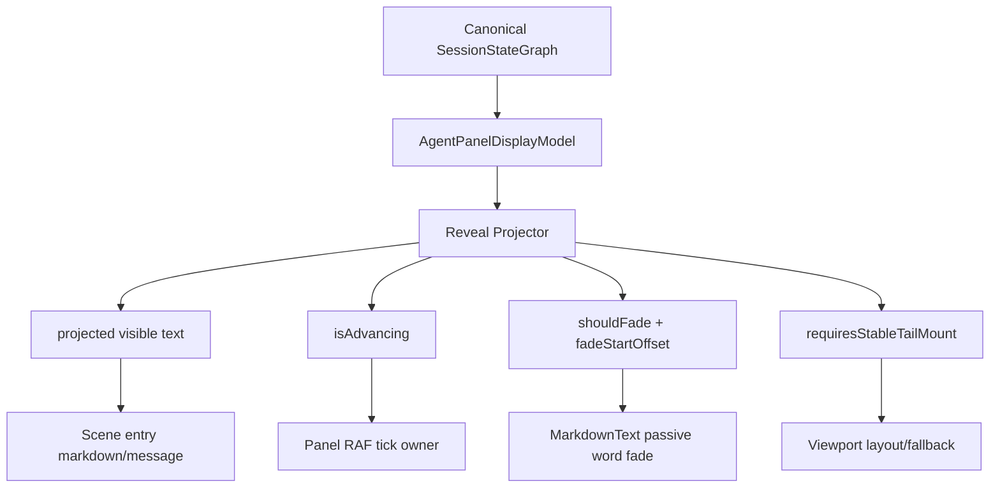
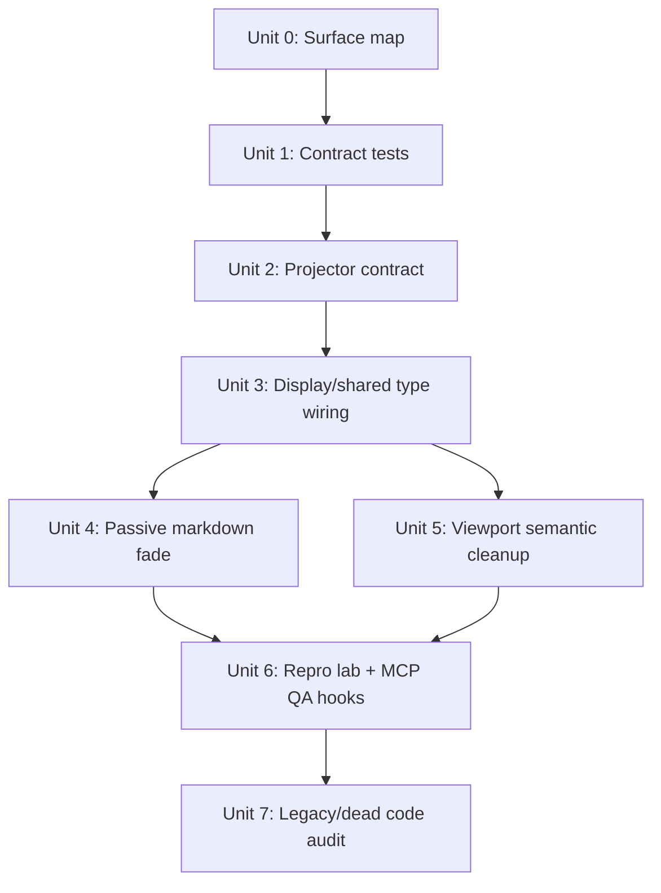
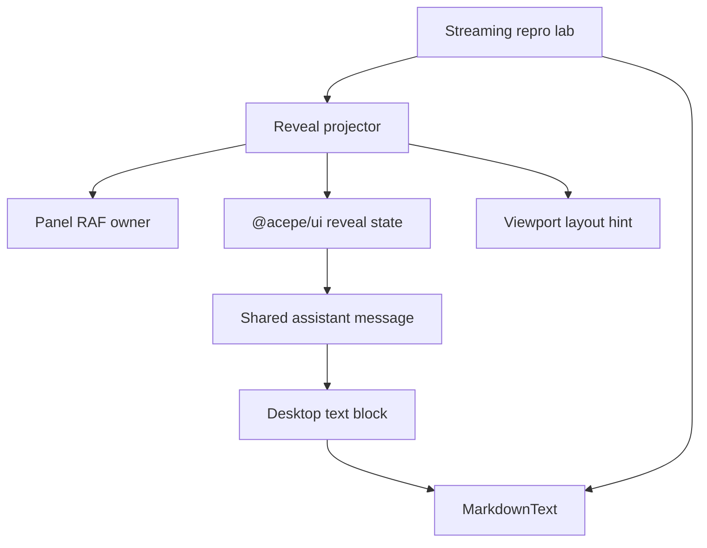

# refactor: Finish reveal fade cleanup contract

## Overview

Finish the assistant reveal migration by restoring the visible word fade animation and removing the remaining unclear reveal contracts.

The current repo can still reveal text in parts, but it does not reliably fade new words. The root design bug is that `revealRenderState.isActive` is doing two jobs:

| Concept | Meaning | Owner |
|---|---|---|
| Reveal advancement | The projector needs another tick because visible text is not settled | `agent-panel-reveal-projector.ts` |
| Fade intent | The renderer should decorate newly visible words for a short CSS fade | passive render metadata |

Those must be separate. The clean endpoint remains:

```text
canonical graph
  -> pure display model
  -> cosmetic reveal projector
  -> passive renderer
  -> word fade decoration
```

## Problem Frame

The previous cleanup removed the dangerous parts of the old reveal stack: production child activity callbacks, old reveal controller files, and markdown-owned pacing. That was correct for stability. But while debugging freezes and one-word replies, we weakened the visual behavior the user liked.

The repo now proves a halfway state:

- Visible text can advance over time.
- Fade CSS and fade DOM code still exist.
- The renderer only activates fade while `revealRenderState.isActive === true`.
- The projector sets `isActive` based on whether more reveal ticks are needed.
- When the final newly visible words arrive, the projector can mark `isActive: false`, so markdown does not apply `.sd-word-fade`.
- The same flag also influences viewport fallback and group hiding, so it is too easy for one layer's cleanup to break another layer's behavior.

That gives token/part reveal with little or no fade. It also leaves the contract too ambiguous for future cleanup.

## Requirements Trace

- R1. Restore visible fade for newly revealed assistant words while keeping text correctness independent from animation.
- R2. Split reveal advancement from fade intent; no boolean may mean both "needs a tick" and "should visually fade."
- R3. Keep `MarkdownText` passive: it may decorate already-visible text, but it must not own pacing, target text, remount recovery, or reveal lifecycle.
- R4. Keep `SceneContentViewport` layout-only: it may react to model-provided layout hints, but it must not create or clear reveal truth.
- R5. Keep canonical graph/display model as text authority; reveal must never fix canonical text, turn state, or provider state.
- R6. Same-key rewrites must never blank a non-empty row and must not keep stale text beyond one projection step.
- R7. Restored completed history must never replay reveal or fade.
- R8. Reduced motion and instant mode must show full current text immediately and must not run word fade.
- R9. Non-text blocks must keep their order while text chunks are revealed.
- R10. Production code should have no dead legacy reveal authority path after this work.
- R11. Implementation must be TDD/characterization-first because this area has caused freezes, blank rows, and first-word-only replies.

## Scope Boundaries

- In scope: reveal projector contract, shared `@acepe/ui` reveal metadata type, `MarkdownText` passive fade behavior, viewport fallback inputs, repro lab QA, and dead reveal cleanup.
- In scope: test fixtures that still model child reveal callbacks, if they hide obsolete behavior.
- Out of scope: provider protocol changes, database/session storage changes, Rust graph projection changes, and new user-facing animation settings.
- Out of scope: a full markdown parser rewrite or an incremental markdown engine.
- Out of scope: preserving old reveal type names or adding compatibility shims. Unit 0 must map consumers, and implementation must update every local consumer to the clean contract.

## Context & Research

### Relevant Code and Patterns

- `packages/desktop/src/lib/acp/components/agent-panel/logic/agent-panel-reveal-projector.ts` owns `visibleTextByRowKey`, `fadeStartOffsetByRowKey`, `activeRowIds`, and `isActive`.
- `packages/desktop/src/lib/acp/components/agent-panel/logic/agent-panel-display-model.ts` turns display rows into scene entries and creates `revealRenderState`.
- `packages/desktop/src/lib/acp/components/agent-panel/components/agent-panel.svelte` owns the panel-level reveal tick and reveal memory.
- `packages/desktop/src/lib/acp/components/messages/markdown-text.svelte` has passive CSS fade machinery through `canonicalStreamingWordFade`.
- `packages/ui/src/components/agent-panel/types.ts` defines the shared `AgentAssistantRevealRenderState` contract.
- `packages/ui/src/components/agent-panel/agent-assistant-message.svelte` forwards `revealRenderState` to the desktop render snippet.
- `packages/desktop/src/lib/acp/components/agent-panel/components/scene-content-viewport.svelte` consumes `entry.revealRenderState?.isActive` for layout/fallback decisions.
- `packages/desktop/src/lib/acp/components/debug-panel/streaming-repro-lab.svelte` and `packages/desktop/src/lib/acp/components/debug-panel/streaming-repro-controller.ts` are the right QA harness for visible length, active state, and fade metadata.
- `packages/desktop/src/lib/acp/components/messages/assistant-message.svelte` is a desktop-only assistant renderer with an older `isStreaming`/`revealKey` path. It must be audited before declaring cleanup complete.
- `packages/desktop/src/lib/acp/components/agent-panel/logic/virtualized-entry-display.ts` still contains legacy `SessionEntry` display merging alongside the newer scene path. The cleanup should distinguish active production surfaces from legacy compatibility surfaces.

### Institutional Learnings

- `docs/solutions/ui-bugs/assistant-text-reveal-streaming-block.md`: canonical streaming state and mounted-panel reveal lifecycle are different. This plan keeps that separation, but removes renderer-owned pacing.
- `docs/solutions/best-practices/agent-panel-content-viewport-reactivity-renderer-2026-05-01.md`: viewport owns layout, scroll, virtualization, and fallback only. It must not decide reveal semantics.
- `docs/solutions/best-practices/canonical-session-projection-ui-derivation-2026-05-01.md`: UI-visible lifecycle and activity must come from canonical projection, not hot-state fallbacks.
- `docs/solutions/ui-bugs/agent-panel-graph-materialization-rendering-bug-2026-04-28.md`: scene/render rows must use stable IDs and preserve structured assistant messages.
- `docs/plans/2026-05-07-001-refactor-cosmetic-reveal-projector-plan.md`: the current best plan direction is a pure cosmetic projection over already-correct display rows.

### External References

- None used. This is internal architecture cleanup with strong local patterns and recent incident evidence.

## Key Technical Decisions

- **Split the reveal render state.** Replace the overloaded `isActive` meaning with explicit fields: `isAdvancing` for projector advancement, `shouldFade` for visual fade, `fadeStartOffset` for the fade window, and `requiresStableTailMount` for viewport layout protection.
- **Keep text reveal and word fade related but separate.** The projector decides visible text and fade window. `MarkdownText` only decorates the visible text for a short time.
- **Completion favors correctness.** Completed turns snap text to full immediately. When newly visible text appears in that snap, fade intent is kept for the current render except in reduced motion or instant mode. Fade on completion is allowed only for rows that were live/revealing in current projector memory; cold completed rows with no live reveal memory get full text with no fade.
- **Large completion snaps get comfort limits.** When a completion snap reveals a very large suffix, the projector caps fade to the final 40 words. Correct text still appears immediately; the cap only prevents a noisy page-wide animation.
- **`isStreaming` stays semantic.** Do not keep rows "streaming" only because cosmetic reveal is active. Use reveal metadata for reveal and viewport protection.
- **No source-string contract tests.** Tests must exercise behavior through projector output, scene entry output, rendered DOM, or repro-lab state.
- **Legacy cleanup is production-first.** Remove production legacy paths. Test fixtures with special behavior must be renamed and scoped clearly as fake test drivers.
- **Projected text must have one render owner.** Scene entry `markdown` and `message.chunks` own projected visible text. Shared `revealRenderState` should contain passive metadata only, not a second render text authority. Any debug-visible text should live in repro-lab diagnostics, not the shared render contract.

## Resolved Decisions

- **Should we restore fade by making `MarkdownText` own reveal again?** No. That would revive the old architecture.
- **Should completion always omit fade?** No. Completion should not delay correctness, but a passive fade may still decorate newly visible text on the render that snaps to full.
- **Should reduced motion fade?** No. Reduced motion and instant mode should show full text with no active pacing and no word fade.
- **Should we update the existing 2026-05-07-001 plan instead?** No. This is a focused closure plan after review findings and live observation. Keeping it separate makes the cleanup reviewable.
- **What are the final reveal field names?** Use `isAdvancing`, `shouldFade`, `fadeStartOffset`, and `requiresStableTailMount`. No production `revealRenderState.isActive` remains.
- **What is the fade duration?** Keep the current 300 ms CSS word fade.
- **How is reduced motion detected?** Use the browser/OS `prefers-reduced-motion: reduce` signal plus the existing instant animation mode. Do not add a new setting in this refactor.
- **How do large completion snaps fade?** Full text appears immediately, and fade is capped to the final 40 words of the newly visible suffix.
- **Do we keep compatibility adapters?** No. The final production tree has no legacy `textRevealState`, `AgentTextRevealState`, `onRevealActivityChange`, `StreamingRevealController`, or `revealRenderState.isActive` path.
- **What must the repro lab cover?** Final-step fade, completion snap-with-fade, restored completed history, reduced motion, instant mode, same-key rewrite, and text/resource/text chunks are all required.

## High-Level Technical Design

> This is the implementation contract. The implementing agent should keep these ownership boundaries and field meanings intact.



Contract target:

| Field concept | Used by | Must not be used for |
|---|---|---|
| projected visible text | scene entry markdown/message text | canonical storage or shared reveal metadata |
| `fadeStartOffset` | passive word fade | deciding how much text exists |
| `shouldFade` | `MarkdownText` CSS decoration | scheduling RAF ticks |
| `isAdvancing` | panel RAF tick scheduling | deciding DOM fade |
| `requiresStableTailMount` | viewport fallback/anchor | text lifecycle authority |

## Implementation Units



- [x] **Unit 0: Map shared and legacy reveal surfaces**

**Goal:** Bound the cleanup before code changes so implementation does not turn into an open-ended renderer migration.

**Requirements:** R2, R4, R10, R11

**Dependencies:** None

**Files:**
- Modify: `docs/plans/2026-05-07-002-refactor-reveal-fade-cleanup-contract-plan.md` only if the audit discovers a plan-blocking surface mismatch.
- Test expectation: none -- this unit is a pre-implementation audit and scoping gate.

**Approach:**
- Search local production and test consumers of `AgentAssistantRevealRenderState`, `revealRenderState.isActive`, `textRevealState`, `AgentTextRevealState`, `onRevealActivityChange`, `assistant-message.svelte`, `buildVirtualizedDisplayEntries`, and the deleted reveal controller/projector files.
- Classify each surface as active production path, test-only fixture, debug-only path, compatibility path, or unused.
- Hard stop rule: active production paths must align to the split reveal contract in this plan. Test-only, debug-only, and unused paths must be deleted when safe or renamed as clearly scoped fakes in the same implementation.
- Shared UI type rule: every local consumer gets the clean contract. No compatibility adapter remains in production.
- The desktop-only `packages/desktop/src/lib/acp/components/messages/assistant-message.svelte` audit happens here, before markdown work. If it is production-used, Unit 3 or Unit 4 must include it; do not wait until final cleanup.

**Execution note:** Characterization-first. Do this before Unit 1 changes shared types.

**Patterns to follow:**
- `packages/ui/src/components/agent-panel/types.ts`
- `packages/desktop/src/lib/acp/components/messages/assistant-message.svelte`
- `packages/desktop/src/lib/acp/components/agent-panel/logic/virtualized-entry-display.ts`

**Test scenarios:**
- Test expectation: none -- classification is verified by code search and import/use mapping, not by runtime behavior.

**Verification:**
- The implementer can name which renderer paths are production paths and which are not before editing shared reveal types.

- [x] **Unit 1: Add contract tests for reveal advancement versus fade intent**

**Goal:** Prove the current failure before changing implementation: text can finish advancing while the final visible words still need fade metadata.

**Requirements:** R1, R2, R6, R7, R8, R11

**Dependencies:** Unit 0

**Files:**
- Modify: `packages/desktop/src/lib/acp/components/agent-panel/logic/__tests__/agent-panel-reveal-projector.test.ts`
- Modify: `packages/desktop/src/lib/acp/components/agent-panel/logic/__tests__/agent-panel-display-model.test.ts`
- Modify: `packages/desktop/src/lib/acp/components/messages/markdown-text.svelte.vitest.ts`

**Approach:**
- Add a failing projector test for the last reveal step: visible text reaches full target, no more tick is needed, but newly visible suffix should still carry fade intent.
- Add a failing display-model test proving `revealRenderState` carries separate advancement and fade fields into scene entries.
- Add a failing markdown test proving passive fade runs when fade intent is true even if reveal advancement is false.

**Execution note:** TDD-first. These tests should fail on the current overloaded `isActive` contract.

**Patterns to follow:**
- Existing projector tests in `packages/desktop/src/lib/acp/components/agent-panel/logic/__tests__/agent-panel-reveal-projector.test.ts`.
- Existing fade tests in `packages/desktop/src/lib/acp/components/messages/markdown-text.svelte.vitest.ts`.

**Test scenarios:**
- Happy path: first reveal step returns non-empty visible text, `isAdvancing: true`, and fade intent for visible words.
- Happy path: final reveal step returns full visible text, `isAdvancing: false`, and fade intent for the newly added suffix.
- Edge case: completed live turn snaps to full text and still marks newly visible suffix for fade, except when reduced motion or instant mode is active.
- Edge case: cold completed history returns no projection entry, no advancement, and no fade intent.
- Edge case: completion fade applies only when prior live projector memory exists.
- Edge case: large completion snap caps or skips fade according to the comfort rule while still rendering full text.
- Edge case: reduced motion returns full text, no advancement, and no fade intent.
- Edge case: instant mode returns full text, no advancement, and no fade intent.
- Edge case: same-key non-prefix rewrite keeps old non-empty visible text for one projection step, then replaces it and fades the new text.

**Verification:**
- Tests fail before the contract split and pass after Unit 2-4.

- [x] **Unit 2: Split projector output into advancement and fade metadata**

**Goal:** Make the pure projector return separate, explicit facts for text progress and visual fade.

**Requirements:** R1, R2, R5, R6, R7, R8, R11

**Dependencies:** Unit 1

**Files:**
- Modify: `packages/desktop/src/lib/acp/components/agent-panel/logic/agent-panel-reveal-projector.ts`
- Modify: `packages/desktop/src/lib/acp/components/agent-panel/components/agent-panel.svelte`
- Modify: `packages/desktop/src/lib/acp/components/agent-panel/logic/__tests__/agent-panel-reveal-projector.test.ts`
- Test: `packages/desktop/src/lib/acp/components/agent-panel/components/__tests__/scene-content-viewport-streaming-regression.svelte.vitest.ts`

**Approach:**
- Replace `activeRowIds`/`isActive` production usage with separate concepts:
  - rows that need another advancement tick,
  - rows whose current visible text has a fresh fade window.
- No production field named `isActive` should remain on `revealRenderState`; if `activeRowIds` remains inside the projector, define it only as advancement state.
- Update the panel RAF owner in `agent-panel.svelte` in this same unit. `scheduleAgentPanelRevealTick` must consume the advancement-only field, not fade intent.
- Keep projector pure: no Svelte, no DOM, no stores, no markdown.
- Preserve same-key rewrite protection: one stale step max, then new text wins.
- Keep memory bounded to live eligible rows.
- Completion behavior is explicit: correctness snaps to full text; passive fade may run for the final newly visible suffix only when the row has live projector memory and the suffix is within the comfort rule.

**Execution note:** Implement the smallest contract change that makes the failing Unit 1 projector tests pass.

**Patterns to follow:**
- `packages/desktop/src/lib/acp/components/agent-panel/logic/agent-panel-reveal-projector.ts`
- `packages/desktop/src/lib/acp/components/agent-panel/logic/agent-panel-display-model.ts`

**Test scenarios:**
- Happy path: prefix growth produces advancement and fade metadata.
- Happy path: final prefix growth stops advancement but keeps one fade window.
- Edge case: stale replacement projection is advancing even when old visible length is longer than new target.
- Edge case: next projection after stale replacement uses the new text and does not include removed stale words.
- Edge case: completed cold row has no projector memory and no fade metadata.
- Edge case: live completion with prior projector memory gets full text immediately and fade intent for the allowed fresh suffix.
- Edge case: large live completion suffix does not animate the whole response.
- Edge case: memory resets on session ID, turn ID, or row key change.
- Performance: many completed assistant rows plus one live row leaves projector memory scoped to the live row only.
- Integration: fade-only state does not schedule another RAF tick.
- Integration: session or turn change clears stale RAF state and reveal memory.

**Verification:**
- Projector tests prove `isAdvancing` and fade intent can differ.

- [x] **Unit 3: Update shared render contract and display-model wiring**

**Goal:** Thread the split reveal contract through shared UI and scene entries without widening authority.

**Requirements:** R1, R2, R3, R5, R9, R10

**Dependencies:** Unit 2

**Files:**
- Modify: `packages/ui/src/components/agent-panel/types.ts`
- Modify: `packages/ui/src/components/agent-panel/index.ts`
- Modify: `packages/ui/src/components/agent-panel/agent-assistant-message.svelte`
- Modify: `packages/ui/src/components/agent-panel/agent-panel-conversation-entry.svelte`
- Modify: `packages/ui/src/components/agent-panel-scene/agent-panel-scene-entry.svelte`
- Modify: `packages/desktop/src/lib/acp/components/agent-panel/logic/agent-panel-display-model.ts`
- Modify: `packages/desktop/src/lib/acp/components/agent-panel/logic/__tests__/agent-panel-display-model.test.ts`
- Test: `packages/ui/src/components/agent-panel/__tests__/agent-assistant-message-visible-groups.test.ts`

**Approach:**
- Rename or split `AgentAssistantRevealRenderState.isActive` so the shared type cannot be misunderstood. The final shared type should contain passive metadata only: stable key, fade intent, fade start offset, and any layout-safe reveal hint agreed in Unit 2.
- Keep `AgentAssistantRevealRenderState` presentational and dependency-free.
- Ensure `agent-assistant-message.svelte` forwards the full reveal state to only the final message text group.
- Do not assume the final text group is always where fade belongs. For text/resource/text messages, either compute per-group fade windows or forward metadata to the text group whose visible text changed.
- Include `agent-panel-scene-entry.svelte` in the shared contract update, because nested scene assistant entries also forward `revealRenderState`.
- Keep non-text block visibility independent from advancement except while an active text reveal explicitly hides trailing blocks.
- Keep text distribution across text/resource/text chunks in canonical order.
- If old type names are still imported in production, update them to the new contract. If test fixtures use old names, rename those fixtures so they cannot be mistaken for production reveal lifecycle.
- Remove `visibleText` from the shared reveal state. Repro lab diagnostics may expose visible text separately, but renderer text must come only from scene entry props.

**Execution note:** Characterization-first for shared type consumers; this touches a shared package surface.

**Patterns to follow:**
- `packages/ui/src/components/agent-panel/agent-assistant-message-visible-groups.ts`
- `packages/desktop/src/lib/acp/components/agent-panel/logic/agent-panel-display-model.ts`

**Test scenarios:**
- Integration: display model scene entry carries full visible text plus separate advancement and fade fields.
- Integration: shared assistant message snippet receives reveal metadata for the last message text group.
- Edge case: inactive advancement but active fade does not hide trailing non-text blocks forever.
- Edge case: text/resource/text chunks keep resource position after visible-text projection.
- Edge case: text/resource/text chunks fade the text group that actually changed, not always the final text group.
- Edge case: message with no text chunks can receive visible text fallback without losing non-text chunks.
- Integration: `agent-panel-scene-entry.svelte` remains pass-through-compatible with the new reveal metadata.
- Compatibility: no production import still expects the old lifecycle callback or old text reveal type.
- Cleanup: `visibleText` is removed from the shared reveal state.

**Verification:**
- Desktop and UI tests pass with the new type contract.
- A code search shows no production `textRevealState`, `AgentTextRevealState`, or `onRevealActivityChange` usage.

- [x] **Unit 4: Make MarkdownText a passive fade renderer**

**Goal:** Restore fade animation while keeping markdown out of reveal pacing.

**Requirements:** R1, R2, R3, R8, R11

**Dependencies:** Unit 3

**Files:**
- Modify: `packages/desktop/src/lib/acp/components/messages/markdown-text.svelte`
- Modify: `packages/desktop/src/lib/acp/components/messages/markdown-text.svelte.vitest.ts`
- Modify: `packages/desktop/src/lib/acp/components/messages/content-block-router.svelte`
- Modify: `packages/desktop/src/lib/acp/components/messages/acp-block-types/text-block.svelte`
- Modify: `packages/desktop/src/lib/acp/components/messages/assistant-message.svelte`

**Approach:**
- Replace `isCoordinatorRevealActive` with render decisions based on the split contract.
- Rendering partial text should depend on the text prop already being partial, not on markdown owning reveal lifecycle.
- Word fade should depend on passive fade intent and `fadeStartOffset`.
- The action that wraps `.sd-word-fade` spans may stay, but it must be framed as DOM decoration only.
- Reduced motion and instant mode should result in no active fade.
- Include a test or QA seam that simulates `prefers-reduced-motion: reduce`, not only metadata passed by hand.
- Ensure special-block rendering has a clear behavior. If fade cannot safely wrap special content, render correct text/blocks without fade rather than adding lifecycle back.
- Unit 0 must classify the desktop-only `assistant-message.svelte` path. Production use means same passive render contract. Non-production use means remove or quarantine the old reveal API in the same implementation.

**Execution note:** Keep existing fade tests, then add the missing final-step fade test.

**Patterns to follow:**
- `packages/desktop/src/lib/acp/components/messages/markdown-text.svelte`
- `packages/ui/src/components/markdown/markdown-prose.css`

**Test scenarios:**
- Happy path: visible text `"Already visible new text"` with fade start after `"Already visible "` wraps only `"new"` and `"text"` in `.sd-word-fade`.
- Happy path: final reveal step with no further advancement still wraps the final newly visible words.
- Edge case: same visible text rerender does not restart fade.
- Edge case: reduced-motion/instant metadata does not create `.sd-word-fade`.
- Edge case: simulated `prefers-reduced-motion: reduce` renders full text immediately and does not run `.sd-word-fade` animation.
- Edge case: missing reveal metadata renders plain text without error.
- Edge case: streaming special blocks render correct visible content even if fade is skipped.
- Accessibility: accessible text equals visible text exactly during final-step fade, after fade, and in reduced motion; there are no hidden suffix containers or duplicated aria text.

**Verification:**
- Markdown DOM tests prove fade exists as `.sd-word-fade` on newly visible words.
- Tests also prove markdown never reveals text that was not passed in through props.

- [x] **Unit 5: Clean viewport and streaming semantics**

**Goal:** Ensure viewport and `isStreaming` do not become hidden reveal authority.

**Requirements:** R3, R4, R5, R7, R10

**Dependencies:** Unit 3

**Files:**
- Modify: `packages/desktop/src/lib/acp/components/agent-panel/components/scene-content-viewport.svelte`
- Modify: `packages/desktop/src/lib/acp/components/agent-panel/components/agent-panel-content.svelte`
- Modify: `packages/desktop/src/lib/acp/components/agent-panel/components/__tests__/scene-content-viewport.svelte.vitest.ts`
- Modify: `packages/desktop/src/lib/acp/components/agent-panel/components/__tests__/scene-content-viewport-streaming-regression.svelte.vitest.ts`
- Modify: `packages/desktop/src/lib/acp/components/agent-panel/logic/agent-panel-display-model.ts`
- Modify: `packages/desktop/src/lib/acp/components/agent-panel/logic/virtualized-entry-display.ts`
- Test: `packages/desktop/src/lib/acp/components/agent-panel/logic/__tests__/agent-panel-display-model.test.ts`
- Test: `packages/desktop/src/lib/acp/components/agent-panel/logic/__tests__/virtualized-entry-display.test.ts`

**Approach:**
- Make viewport fallback consume a layout-safe reveal field, not overloaded advancement or markdown activity.
- Keep `isStreaming` semantic. It should not be set to true only because a row is cosmetically revealing.
- Update `applyDisplayRowToAssistantEntry`; `entry.isStreaming` should not become true solely because `row.isLiveTail` is cosmetically revealing. Use reveal/layout metadata for cosmetic reveal instead.
- Keep stable tail mount while reveal advancement is active, but do not use fade-only state to force long fallback.
- Ensure user scroll-away behavior is preserved; reveal/fade should not keep pulling the user to bottom.
- Audit `buildVirtualizedDisplayEntries` versus `buildVirtualizedDisplayEntriesFromScene`. Product-used paths must align with the split reveal contract. Debug-only, test-only, and unused paths must be deleted or renamed as scoped fakes.
- Stop rule: no legacy reveal authority path remains in production after this unit.

**Patterns to follow:**
- `docs/solutions/best-practices/agent-panel-content-viewport-reactivity-renderer-2026-05-01.md`
- `packages/desktop/src/lib/acp/components/agent-panel/logic/virtualized-entry-display.ts`

**Test scenarios:**
- Happy path: advancing live reveal can request stable tail layout.
- Happy path: fade-only state does not keep native fallback active after text is settled.
- Edge case: cold completed history has no reveal-driven fallback.
- Edge case: session switch clears stale reveal layout protection.
- Edge case: child row unmount cannot end or start reveal.
- Edge case: user scroll-away is respected while fade is still decorating text.
- Integration: a cosmetically revealing but canonically completed row carries reveal metadata without setting `entry.isStreaming` only because reveal is active.

**Verification:**
- Viewport tests prove layout follows model-provided hints only.
- Search confirms no production child-to-parent reveal lifecycle callback remains.

- [x] **Unit 6: Expand repro lab and MCP QA observability**

**Goal:** Make "tokens with no animation" and related regressions easy to prove through DOM/debug state.

**Requirements:** R1, R2, R6, R7, R8, R9, R11

**Dependencies:** Units 2-5

**Files:**
- Modify: `packages/desktop/src/lib/acp/components/debug-panel/streaming-repro-lab.svelte`
- Modify: `packages/desktop/src/lib/acp/components/debug-panel/streaming-repro-controller.ts`
- Modify: `packages/desktop/src/lib/acp/components/debug-panel/streaming-repro-graph-fixtures.ts`
- Test: `packages/desktop/src/lib/acp/components/debug-panel/__tests__/streaming-repro-graph-fixtures.test.ts`
- Test: `packages/desktop/src/lib/acp/components/debug-panel/streaming-repro-controller.test.ts`
- Test: `packages/desktop/src/lib/acp/components/debug-panel/streaming-repro-lab.svelte.vitest.ts`

**Approach:**
- Required scope: add presets for final-step fade, completion snap-with-fade, restored completed history, reduced motion, instant mode, same-key rewrite, and text/resource/text chunks.
- Required scope: expose machine-checkable values for visible text, advancement state, fade intent, fade start offset, stable-tail hint, and `.sd-word-fade` span count.
- Required scope: add a QA check that inspects computed styles over time for at least one faded word: animation duration, initial/mid/final opacity, and settled state.
- Keep DOM-derived diagnostics in `streaming-repro-lab.svelte` or a small injected diagnostics helper. Do not put `.sd-word-fade` DOM counts inside the pure `streaming-repro-controller.ts`.
- Keep the repro lab diagnostic-only. It must not become a fallback behavior path.
- QA should prefer MCP/DOM inspection over screenshots: visible text length, canonical length, advancement state, fade intent, and `.sd-word-fade` count.

**Test scenarios:**
- Happy path: final-step preset shows full visible text, no advancement, and positive fade span count.
- Happy path: final-step preset shows an actual running CSS animation through computed style, not only a span class.
- Happy path: live growth preset shows visible length increasing across phases.
- Edge case: reduced-motion preset has full visible text and zero fade spans.
- Edge case: restored completed preset has no advancement and no fade replay.
- Edge case: same-key rewrite preset never reports visible length zero after non-empty text.
- Edge case: text/resource/text preset preserves non-text block order.

**Verification:**
- Repro lab tests prove the QA harness exposes the values needed for MCP inspection.
- Manual QA can confirm animation by checking `.sd-word-fade`, not only by visual impression.
- Manual QA can confirm animation through computed style over time; `.sd-word-fade` span count alone is not enough.

- [x] **Unit 7: Audit and remove obsolete reveal paths**

**Goal:** Finish cleanup so future work cannot accidentally revive split reveal authority.

**Requirements:** R3, R4, R10, R11

**Dependencies:** Units 1-6

**Files:**
- Delete or keep deleted: `packages/desktop/src/lib/acp/components/agent-panel/logic/assistant-text-reveal-projector.svelte.ts`
- Delete or keep deleted: `packages/desktop/src/lib/acp/components/messages/logic/create-streaming-reveal-controller.svelte.ts`
- Modify: `packages/desktop/src/lib/acp/components/messages/__tests__/fixtures/content-block-router-growing-stub.svelte`
- Modify: `packages/desktop/src/lib/acp/components/messages/assistant-message.svelte`
- Modify: `packages/desktop/src/lib/acp/components/messages/assistant-message.svelte.vitest.ts`
- Modify: `packages/desktop/src/lib/acp/components/agent-panel/logic/index.ts`
- Test: `packages/desktop/src/lib/acp/components/messages/assistant-message.svelte.vitest.ts`

**Approach:**
- Confirm old deleted files are not reintroduced and no exports point at them.
- Remove or rename test fixture `onRevealActivityChange` behavior so it is not mistaken for a production contract.
- Use the Unit 0 surface map for `messages/assistant-message.svelte`. If it is active production, bring its props into the same passive reveal contract. If it is not active production, remove or quarantine the old reveal API so it cannot be revived by accident.
- Keep tests behavior-based. Do not add tests that read source files and assert strings.

**Execution note:** Characterization-first before changing the desktop-only assistant message path, because it may serve older render surfaces.

**Patterns to follow:**
- `packages/ui/src/components/agent-panel/agent-assistant-message.svelte`
- `packages/desktop/src/lib/acp/components/messages/assistant-message.svelte`

**Test scenarios:**
- Integration: production agent-panel path reveals and fades without any child activity callback.
- Integration: desktop-only assistant message path either receives passive reveal metadata or is proven outside the target render path.
- Edge case: old growing fixture still supports viewport resize tests without claiming reveal lifecycle authority.
- Search verification: no production `onRevealActivityChange`, `textRevealState`, `AgentTextRevealState`, `StreamingRevealController`, or old reveal projector import remains.

**Verification:**
- Production search is clean for old reveal authority names.
- Remaining test-only references are named and commented as test fakes.

## System-Wide Impact



- **Interaction graph:** display model, reveal projector, shared UI render context, markdown text renderer, viewport fallback, and repro lab all interact.
- **Error propagation:** reveal/fade failure should degrade to full correct text. It should not produce session errors, blank rows, one-word rows, or hanging planning labels.
- **State lifecycle risks:** stale reveal memory and stale RAF callbacks are the highest risks. Reset by session/turn/row identity and stop ticks when no advancement is needed.
- **API surface parity:** `@acepe/ui` reveal metadata is a shared contract. Update all local consumers to the clean contract; no compatibility adapter remains.
- **Integration coverage:** Unit tests must cover projector and markdown separately; repro lab/MCP QA must cover the full path.
- **Unchanged invariants:** canonical graph owns truth, display model owns current text, viewport owns layout only, markdown owns rendering only.

## Alternative Approaches Considered

| Approach | Decision | Reason |
|---|---|---|
| Put fade lifecycle back in `MarkdownText` | Rejected | This recreates split authority and remount/cache bugs |
| Keep `isActive` and infer fade from `fadeStartOffset` | Rejected | Too implicit; future code will confuse tick activity and visual fade again |
| Snap on completion with no fade | Rejected as final UX | Safe but loses the user-requested animation at the exact moment many replies appear |
| Animate all completed history on mount | Rejected | Cold history must stay stable and readable |
| Add a new user setting now | Rejected | Existing streaming animation mode plus browser reduced motion are enough |

## Success Metrics

- New live assistant words receive `.sd-word-fade` during normal animated reveal.
- The final reveal step can have no advancement tick pending and still fade newly visible words.
- Same-key rewrite tests prove no blank blink after non-empty text.
- Restored completed sessions show full text immediately with no replay.
- Reduced motion and instant mode show full text immediately with no fade.
- Production code search finds no old reveal lifecycle authority path.

## Risk Analysis & Mitigation

| Risk | Likelihood | Impact | Mitigation |
|---|---:|---:|---|
| Fade fix reintroduces freeze loop | Medium | High | Keep fade passive; no child callbacks; no markdown pacing |
| Shared type rename breaks consumers | Medium | Medium | Unit 0 maps consumers first; Unit 3 updates all local consumers to the clean contract |
| Completion fade delays correctness | Low | High | Text snaps immediately; fade only decorates visible text |
| Special markdown blocks lose fade | Medium | Low | Prefer correct content without fade for special blocks |
| Viewport fallback stays active too long | Medium | Medium | Separate advancement/layout state from fade-only state |
| Tests prove flags but not UX | Medium | Medium | Add DOM `.sd-word-fade` checks and repro-lab MCP observability |

## Documentation / Operational Notes

- Update `docs/solutions/ui-bugs/assistant-text-reveal-streaming-block.md` after implementation. The learning should say the final architecture uses cosmetic visible text plus passive fade metadata, not markdown-owned pacing.
- Do not run `bun dev`; the user manages the dev server.
- QA order after implementation: focused unit tests, `bun run --cwd packages/ui check`, `bun run --cwd packages/ui test`, `bun run --cwd packages/desktop check`, focused desktop tests, repro lab via MCP/DOM values, then one live dev-app session.

## Sources & References

- Origin plan: `docs/plans/2026-05-07-001-refactor-cosmetic-reveal-projector-plan.md`
- Presentation graph plan: `docs/plans/2026-05-06-001-refactor-agent-panel-presentation-graph-plan.md`
- Prior reveal learning: `docs/solutions/ui-bugs/assistant-text-reveal-streaming-block.md`
- Viewport learning: `docs/solutions/best-practices/agent-panel-content-viewport-reactivity-renderer-2026-05-01.md`
- Canonical projection learning: `docs/solutions/best-practices/canonical-session-projection-ui-derivation-2026-05-01.md`
- Related code: `packages/desktop/src/lib/acp/components/agent-panel/logic/agent-panel-reveal-projector.ts`
- Related code: `packages/desktop/src/lib/acp/components/agent-panel/logic/agent-panel-display-model.ts`
- Related code: `packages/desktop/src/lib/acp/components/messages/markdown-text.svelte`
- Related code: `packages/ui/src/components/agent-panel/types.ts`
- Related code: `packages/desktop/src/lib/acp/components/agent-panel/components/scene-content-viewport.svelte`
