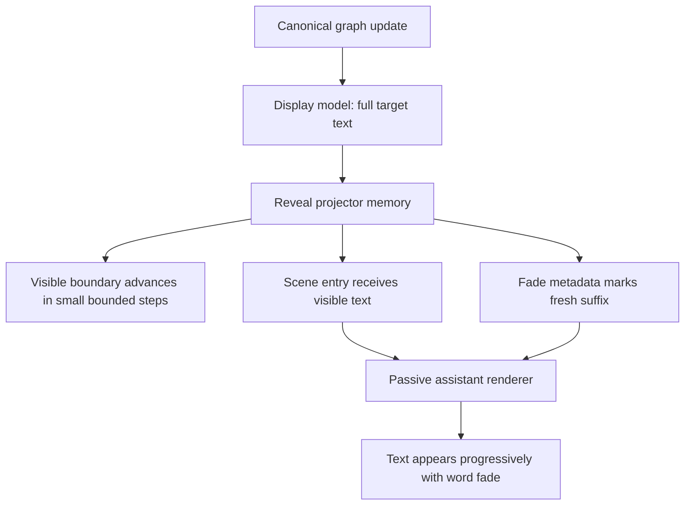

# fix: Restore fine-grained assistant reveal pacing

## Overview

Restore the old “new words gently appear” feeling without bringing back the old architecture.

The current code is correct in one important way: canonical text still comes from the graph/display model, and `MarkdownText` no longer owns text truth. But the migration lost the nice streaming feel. Assistant text now appears in coarse blocks because the old local pacing controller was removed before the new projector matched its behavior.

The target stays:

```text
canonical graph
  -> pure display model
  -> projector-owned reveal pacing
  -> passive renderer
  -> optional word fade
```

## Problem Frame

The debug session found a combination regression, not one single broken line.

- `packages/ui/src/components/agent-panel/agent-assistant-message-visible-groups.ts` hard-disables assistant text streaming through `shouldStreamAssistantTextContent()`.
- `packages/ui/src/components/agent-panel/agent-assistant-message.svelte` only passes streaming state to the desktop text renderer when that helper returns true.
- `packages/desktop/src/lib/acp/components/messages/markdown-text.svelte` no longer owns a local `StreamingRevealController`, which is good for architecture but removed the old fine-grained pacing.
- `packages/desktop/src/lib/acp/components/agent-panel/logic/agent-panel-reveal-projector.ts` currently advances by elapsed wall-clock time and a 12-character word-boundary step. Long gaps between updates can jump directly to a full new block.
- The fade CSS/action still exists, but it can only fade text after the projector has already made that text visible.

So the current behavior is technically “projected reveal,” but not the old user experience. It feels like block replacement instead of token/part-by-part reveal.

## Requirements Trace

- R1. Assistant text should reveal in small, visible parts during live streaming.
- R2. Newly visible words should fade in, preserving the nice old feel.
- R3. Sparse updates or manual repro `Next` clicks must not cause the projector to jump directly to the whole next block.
- R4. `MarkdownText` must remain passive. It renders provided text and decorates fade; it must not own target text, pacing truth, or remount recovery.
- R5. The canonical graph/display model remains the source of text truth.
- R6. Reduced motion and instant mode still render full text immediately with no fade.
- R7. Completed cold history must not replay reveal.
- R8. Live completion should show full correct text while allowing the final fresh suffix to fade when appropriate.
- R9. Repro lab must represent real agent-panel behavior: each `Next` click is one canonical graph update for the same assistant message.
- R10. Tests must catch the blocky-regression class before implementation changes.

## Scope Boundaries

- In scope: reveal projector pacing, display/reveal metadata, shared assistant message streaming gate, passive markdown fade usage, repro lab behavior, and tests.
- In scope: removing or replacing misleading tests that only prove labels/buttons while not proving visible assistant text.
- Out of scope: provider protocol changes, backend transcript projection, database schema, and new user settings.
- Out of scope: reintroducing `textRevealState`, `AgentTextRevealState`, `StreamingRevealController`, or child reveal activity callbacks.
- Out of scope: making Markdown parse incrementally by token. The plan restores visual pacing without changing markdown parsing ownership.

## Context & Research

### Relevant Code and Patterns

- `packages/desktop/src/lib/acp/components/agent-panel/logic/agent-panel-reveal-projector.ts` owns current visible text projection and reveal memory.
- `packages/desktop/src/lib/acp/components/agent-panel/logic/agent-panel-display-model.ts` applies projected visible text to scene entries.
- `packages/desktop/src/lib/acp/components/agent-panel/components/agent-panel.svelte` schedules reveal RAF ticks in the real panel.
- `packages/desktop/src/lib/acp/components/debug-panel/streaming-repro-lab.svelte` is the manual QA surface for this behavior.
- `packages/ui/src/components/agent-panel/agent-assistant-message-visible-groups.ts` currently prevents assistant text from entering streaming text mode.
- `packages/ui/src/components/agent-panel/agent-assistant-message.svelte` forwards reveal metadata to the desktop render snippet.
- `packages/desktop/src/lib/acp/components/messages/markdown-text.svelte` has the passive word-fade action.
- `packages/ui/src/components/markdown/markdown-prose.css` defines `.sd-word-fade`.

### Institutional Learnings

- `.planning/debug/streaming-reveal-regression.md`: old local reveal pacing was removed, new projector pacing is too coarse and gap-sensitive.
- `.planning/debug/resolved/streaming-repro-lab-blank-assistant-row.md`: mutating Svelte-managed `{@html}` islands can blank rows; tests must include real DOM behavior, not only model state.
- `docs/solutions/ui-bugs/assistant-text-reveal-streaming-block.md`: canonical streaming state and presentation reveal lifecycle are different.
- `docs/solutions/best-practices/agent-panel-content-viewport-reactivity-renderer-2026-05-01.md`: viewport must stay layout-only, not become reveal authority.

### External References

- None. This is internal UI architecture with strong local evidence.

## Key Technical Decisions

- **Keep projector ownership.** Do not put pacing back in `MarkdownText`. The projector owns what text is visible now and what suffix is fresh.
- **Stop using idle wall-clock gaps as catch-up permission.** A long pause between provider/repro updates should not reveal the whole next block instantly.
- **Reveal by bounded increments.** Each projector tick should advance by a small, human-visible increment from previous visible text toward the current target.
- **Separate target freshness from animation frames.** When the canonical target grows, record the new target but advance visible text through bounded ticks.
- **Make fade follow the visible boundary.** The fade window starts at the previous visible boundary and applies only to newly visible words.
- **Reconnect assistant text streaming deliberately.** The shared UI gate must stop being a permanent `false`, but implementation should not blindly force every assistant text block into Markdown streaming mode. First fix projector pacing; then use tests to decide whether the shared policy should enable the desktop streaming branch, preserve the settled branch with fade metadata, or remove the helper entirely.
- **Repro lab should be a visual contract.** The default scenario should use one assistant id and growing text; tests must prove the rendered assistant text changes, not just the step label.

## Open Questions

### Resolved During Planning

- **Should we restore the old `StreamingRevealController`?** No. It gave the old feel but put lifecycle state back inside the renderer.
- **Should `MarkdownText` pace characters again?** No. It should only render and fade what the projector gives it.
- **Should the repro lab keep many selectable cases?** No for the default UI. Extra scenarios can remain in controller tests, but the visible lab should be one simple real-flow stepper.
- **Should completion wait for reveal before showing full text?** No. Completion should show correct full text immediately, with optional fade decoration for the fresh suffix.

### Deferred to Implementation

- **Exact pacing constants:** choose during test-first implementation by matching the desired visual feel; plan requires small bounded increments, not exact numbers.
- **Exact naming for any new projector fields:** use names that express visible boundary / fresh suffix clearly, but avoid putting text authority into shared renderer metadata.
- **Whether the shared UI helper becomes a boolean policy or disappears:** decide after projector pacing tests are green. The shared UI must not keep a permanent `false`, but the final shape should be whatever keeps `MarkdownText` passive and avoids the old blank-`{@html}` failure.

## High-Level Technical Design

> This illustrates the intended approach and is directional guidance for review, not implementation specification. The implementing agent should treat it as context, not code to reproduce.



Important behavior:

| Situation | Desired behavior |
|---|---|
| First assistant text arrives | Show a small prefix quickly, fade it in |
| More text arrives after a long pause | Do not jump to full target; continue bounded reveal |
| RAF ticks continue | Visible boundary moves forward until target catches up |
| Turn completes | Full text becomes visible; fresh suffix can fade |
| Cold history mounts | Full text, no replay |
| Reduced motion / instant | Full text, no fade, no pacing |

## Implementation Units

- [x] **Unit 1: Add failing characterization tests for blocky reveal**

**Goal:** Prove the current regression before changing the implementation.

**Requirements:** R1, R2, R3, R10

**Dependencies:** None

**Files:**
- Modify: `packages/desktop/src/lib/acp/components/agent-panel/logic/__tests__/agent-panel-reveal-projector.test.ts`
- Modify: `packages/desktop/src/lib/acp/components/debug-panel/__tests__/streaming-repro-graph-fixtures.test.ts`
- Modify: `packages/desktop/src/lib/acp/components/debug-panel/__tests__/streaming-repro-lab.svelte.vitest.ts`

**Approach:**
- Add a projector test where the same assistant message target grows after a long delay. Expected: visible text advances by a bounded amount, not directly to the full new target.
- Add a projector test where repeated RAF-like projections reveal several small parts before reaching full target.
- Add a repro-lab test that verifies the viewport receives assistant text after `Next`, and a later `Next` grows the same assistant row rather than only changing the header label.

**Execution note:** TDD-first. These tests should fail on the current behavior.

**Patterns to follow:**
- Existing projector tests in `packages/desktop/src/lib/acp/components/agent-panel/logic/__tests__/agent-panel-reveal-projector.test.ts`.
- Existing lab tests in `packages/desktop/src/lib/acp/components/debug-panel/__tests__/streaming-repro-lab.svelte.vitest.ts`.

**Test scenarios:**
- Happy path: first assistant update produces visible non-empty prefix plus fade metadata.
- Edge case: second assistant update after a long idle gap does not reveal full target in one projection.
- Edge case: several reveal ticks advance monotonically and eventually settle at full target.
- Integration: repro lab `Next` changes the assistant row content, not only the phase label.

**Verification:**
- The tests fail against the current blocky implementation and describe the behavior users are seeing.

- [x] **Unit 2: Make projector pacing independent from idle update gaps**

**Goal:** Give the projector fine-grained, deterministic reveal pacing that cannot collapse into block replacement after sparse updates.

**Requirements:** R1, R2, R3, R5, R6, R7, R8

**Dependencies:** Unit 1

**Files:**
- Modify: `packages/desktop/src/lib/acp/components/agent-panel/logic/agent-panel-reveal-projector.ts`
- Modify: `packages/desktop/src/lib/acp/components/agent-panel/logic/__tests__/agent-panel-reveal-projector.test.ts`

**Approach:**
- Track enough memory to distinguish “time since last reveal tick” from “time since canonical target changed.”
- When the target grows, keep the previous visible boundary and reveal the newly available suffix in bounded increments.
- Avoid catch-up behavior that uses a long idle gap to jump directly to the full new target.
- Keep same-key rewrite protection: non-prefix replacement keeps old non-empty text for at most one projection before revealing the new target.
- Keep completed-history rules unchanged.

**Patterns to follow:**
- Existing `AgentPanelRevealMemory` shape in `agent-panel-reveal-projector.ts`.
- Existing reduced-motion and instant-mode tests.

**Test scenarios:**
- Happy path: append-only growth reveals in multiple small steps.
- Edge case: long idle before target growth still produces a bounded next visible length.
- Edge case: no target growth lets reveal ticks continue toward the current target.
- Edge case: same-key non-prefix replacement never blanks a non-empty row.
- Edge case: reduced motion and instant mode bypass pacing and fade.
- Edge case: cold completed history does not create projector memory or fade metadata.

**Verification:**
- Projector output includes progressive visible text, correct advancement state, and correct fade window through the full lifecycle.

- [x] **Unit 3: Reconnect shared assistant streaming policy to reveal metadata**

**Goal:** Remove the permanent hard-disable that prevents assistant message text from receiving the correct reveal treatment.

**Requirements:** R1, R2, R4, R5

**Dependencies:** Unit 2

**Files:**
- Modify: `packages/ui/src/components/agent-panel/agent-assistant-message-visible-groups.ts`
- Modify: `packages/ui/src/components/agent-panel/agent-assistant-message.svelte`
- Modify: `packages/ui/src/components/agent-panel/__tests__/agent-assistant-message-visible-groups.test.ts`

**Approach:**
- Replace `shouldStreamAssistantTextContent()` as a hard-coded false gate.
- Use reveal metadata and semantic streaming state to decide how the last assistant text group reaches the desktop render snippet.
- Treat the helper as a policy seam, not as text authority. It may return true only when tests prove the streaming branch is required for the desired behavior; otherwise remove or narrow it so reveal metadata drives fade without reviving renderer-owned pacing.
- Keep non-text group visibility controlled by `isAdvancing` so tools/resources do not jump ahead of a still-revealing text tail.
- Do not add text content to `revealRenderState`; text authority remains in scene entry markdown/message chunks.

**Patterns to follow:**
- Current `resolveVisibleAssistantMessageGroups` behavior.
- Shared type in `packages/ui/src/components/agent-panel/types.ts`.

**Test scenarios:**
- Happy path: assistant text with reveal metadata reaches the desktop renderer with enough state to show progressive reveal/fade.
- Edge case: assistant text without reveal metadata renders normally.
- Edge case: enabling or removing the helper does not route text back into a renderer-owned pacing lifecycle.
- Edge case: non-text groups after an advancing text group stay hidden until advancement settles.
- Edge case: non-text groups remain visible when reveal is not advancing.

**Verification:**
- The shared UI no longer blocks the desktop renderer from applying the projector-owned reveal path, and it does not recreate the old Markdown-owned reveal lifecycle.

- [x] **Unit 4: Keep MarkdownText passive while making fade visibly reliable**

**Goal:** Ensure the renderer shows and fades newly visible text without owning pacing.

**Requirements:** R2, R4, R6, R8

**Dependencies:** Unit 3

**Files:**
- Modify: `packages/desktop/src/lib/acp/components/messages/markdown-text.svelte`
- Modify: `packages/desktop/src/lib/acp/components/messages/markdown-text.svelte.vitest.ts`
- Modify: `packages/ui/src/components/markdown/markdown-prose.css` if the fade is too subtle after tests expose it.

**Approach:**
- Keep `canonicalStreamingWordFade` as decoration only.
- Verify the fade action still receives active metadata when text is progressive and when completion snaps to full.
- Keep keyed `{@html}` behavior that prevents blank-row regressions.
- Tune fade visibility only if tests and manual QA show `.sd-word-fade` exists but is visually too weak.

**Patterns to follow:**
- Existing MarkdownText fade tests.
- `.planning/debug/resolved/streaming-repro-lab-blank-assistant-row.md` warning about mutating `{@html}` islands.

**Test scenarios:**
- Happy path: newly visible words receive `.sd-word-fade`.
- Edge case: old visible words are not re-faded on every render.
- Edge case: keyed streaming HTML does not collapse to comment-only DOM.
- Edge case: reduced motion disables fade.
- Edge case: instant mode produces no fade spans.

**Verification:**
- DOM tests prove fade spans exist only for the fresh suffix and content never blanks.

- [x] **Unit 5: Make the repro lab a real visual contract**

**Goal:** Turn the repro lab into a simple, trustworthy check for the real streaming path.

**Requirements:** R1, R2, R3, R9, R10

**Dependencies:** Units 2-4

**Files:**
- Modify: `packages/desktop/src/lib/acp/components/debug-panel/streaming-repro-controller.ts`
- Modify: `packages/desktop/src/lib/acp/components/debug-panel/streaming-repro-lab.svelte`
- Modify: `packages/desktop/src/lib/acp/components/debug-panel/streaming-repro-graph-fixtures.ts`
- Modify: `packages/desktop/src/lib/acp/components/debug-panel/__tests__/streaming-repro-controller.test.ts`
- Modify: `packages/desktop/src/lib/acp/components/debug-panel/__tests__/streaming-repro-graph-fixtures.test.ts`
- Modify: `packages/desktop/src/lib/acp/components/debug-panel/__tests__/streaming-repro-lab.svelte.vitest.ts`

**Approach:**
- Keep the visible lab as one `Next` button and one same-id assistant answer that grows.
- Make each step represent one canonical graph update, not a manually invented UI state.
- Ensure waiting/preparing appears only before assistant text exists.
- Tests must inspect the assistant entry/content passed to the viewport, not just the step title.
- Keep special scenarios such as reduced motion, instant mode, same-key rewrite, and resource ordering in controller/fixture tests, not as visible cockpit controls.

**Patterns to follow:**
- Current simple lab UI.
- `buildStreamingReproGraphMaterializerInput` for graph-backed fixture input.

**Test scenarios:**
- Happy path: first `Next` creates assistant text for the same assistant id.
- Happy path: second `Next` grows that assistant text.
- Edge case: final step completes the turn but keeps full text visible.
- Edge case: resetting/looping returns to preparing state without stale reveal memory.
- Integration: viewport receives `isWaitingForResponse=false` after assistant text exists.

**Verification:**
- Manual QA: clicking `Next` visibly reveals new text instead of replacing a block.

- [x] **Unit 6: Guard viewport and completion behavior**

**Goal:** Make sure restored reveal does not reintroduce previous freezes, blank rows, first-word-only output, or layout authority leaks.

**Requirements:** R5, R6, R7, R8, R10

**Dependencies:** Units 2-5

**Files:**
- Modify: `packages/desktop/src/lib/acp/components/agent-panel/components/scene-content-viewport.svelte`
- Modify: `packages/desktop/src/lib/acp/components/agent-panel/components/__tests__/scene-content-viewport-streaming-regression.svelte.vitest.ts`
- Modify: `packages/desktop/src/lib/acp/components/agent-panel/logic/__tests__/agent-panel-display-model.test.ts`

**Approach:**
- Keep viewport as layout/fallback only. It can read `requiresStableTailMount`, but must not create reveal truth.
- Verify native fallback still renders progressive assistant text.
- Verify completion snap shows full text and does not keep the panel permanently advancing.
- Verify display model keeps canonical full text separate from projected visible text.

**Patterns to follow:**
- Existing native fallback tests.
- `docs/solutions/best-practices/agent-panel-content-viewport-reactivity-renderer-2026-05-01.md`.

**Test scenarios:**
- Integration: native fallback renders the progressive text prefix and later the grown text.
- Edge case: completion does not append a waiting row after assistant text exists.
- Edge case: completed history mounts full text without reveal.
- Edge case: first-word to full-text replacement does not stay stuck on the first word.

**Verification:**
- Focused viewport/display tests pass and manual QA no longer shows hanging waiting labels or hidden assistant text.

## System-Wide Impact

- **Interaction graph:** Canonical graph and display model remain text authority. Projector owns only presentation pacing. Renderer owns only DOM decoration.
- **Error propagation:** No new provider/backend errors are introduced; failures should remain visual/test failures, not canonical data repairs.
- **State lifecycle risks:** Reveal memory must reset on session/turn changes and must not leak old targets across repro resets.
- **API surface parity:** Shared UI `AgentAssistantRevealRenderState` stays passive. Any policy helper must not become a second text authority.
- **Integration coverage:** Unit tests alone are not enough. The repro lab and viewport tests must prove the real panel path receives and renders growing assistant text.
- **Unchanged invariants:** Cold history does not replay; reduced motion and instant mode do not animate; non-text chunks keep order.

## Risks & Dependencies

| Risk | Mitigation |
|------|------------|
| Reintroducing renderer-owned lifecycle | Keep `MarkdownText` passive and test that text authority stays in scene entries |
| Projector pacing becomes too slow | Use bounded increments but tune constants during manual QA |
| Fade DOM action blanks `{@html}` again | Preserve keyed HTML tests and prior blank-row regression coverage |
| Re-enabling assistant streaming revives hidden non-text block bugs | Keep `resolveVisibleAssistantMessageGroups` tests for text/resource ordering |
| Completion leaves RAF running forever | Test `isAdvancing` settles while fade can still decorate the fresh suffix |

## Documentation / Operational Notes

- Update `docs/solutions/ui-bugs/assistant-text-reveal-streaming-block.md` after implementation if the final projector pacing model differs from this plan.
- Keep `.planning/debug/streaming-reveal-regression.md` as the root-cause evidence for this fix.

## Sources & References

- Debug source: `.planning/debug/streaming-reveal-regression.md`
- Related plan: `docs/plans/2026-05-07-002-refactor-reveal-fade-cleanup-contract-plan.md`
- Related learning: `docs/solutions/ui-bugs/assistant-text-reveal-streaming-block.md`
- Related code: `packages/desktop/src/lib/acp/components/agent-panel/logic/agent-panel-reveal-projector.ts`
- Related code: `packages/ui/src/components/agent-panel/agent-assistant-message-visible-groups.ts`
- Related code: `packages/desktop/src/lib/acp/components/messages/markdown-text.svelte`
