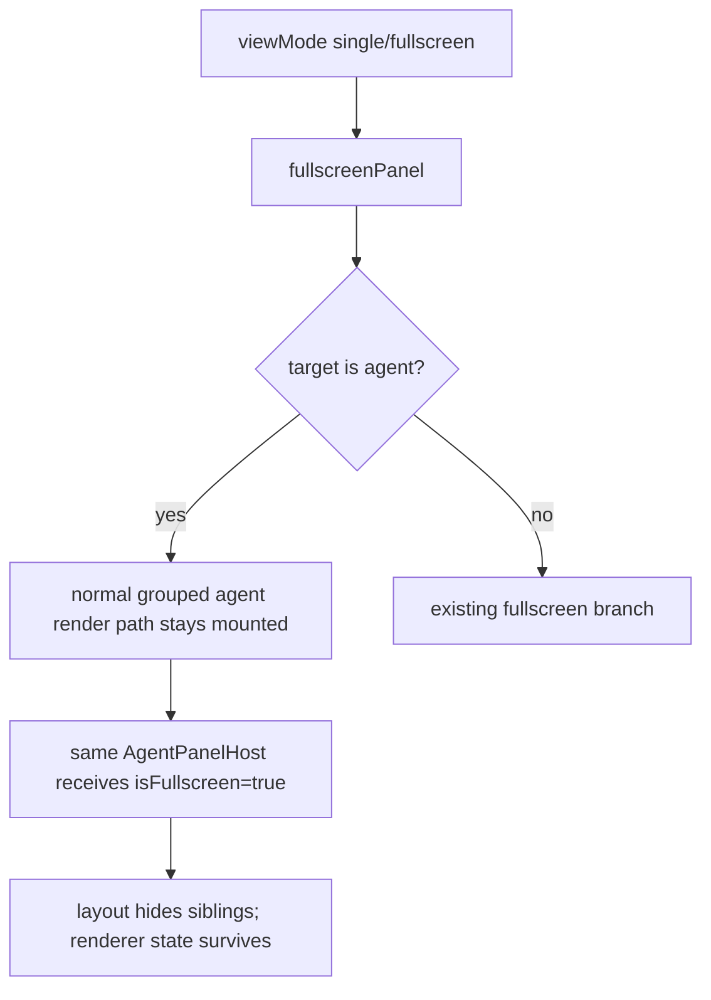

# refactor: Stable agent fullscreen identity

## Overview

Make agent fullscreen a layout state, not a remount path.

Today, switching an agent panel into fullscreen moves it into a separate fullscreen branch in
`packages/desktop/src/lib/components/main-app-view/components/content/panels-container.svelte`.
That destroys and recreates the mounted `AgentPanelHost` tree. The recreated tree then reruns
viewport hydration, virtual list setup, scroll/follow setup, display memory setup, and cosmetic
reveal setup. The visible symptom is content flicker.

The target invariant is:

```text
panelId owns one mounted AgentPanelHost
fullscreen changes layout only
renderer state survives the mode switch
```

## Problem Frame

This is not primarily a fade bug, markdown bug, or virtualizer bug. Those layers can make the
flicker easier to notice, but the root cause is higher:

- Normal mode renders agent panels from the grouped project/card branch.
- Fullscreen mode renders a separate top-level fullscreen branch.
- Entering fullscreen therefore changes component identity for the focused agent panel.
- `SceneContentViewport` intentionally has mount-time hydration behavior, so a remount can briefly
  produce empty or rebuilt content.

For production-grade behavior, a view mode change must not reset the conversation renderer.

## Requirements Trace

- R1. Entering agent fullscreen must not mount a new `AgentPanelHost` for the focused `panelId`.
- R2. Exiting agent fullscreen must not mount a new `AgentPanelHost` for the focused `panelId`.
- R3. Agent fullscreen must pass `isFullscreen=true` to the already-mounted agent panel.
- R4. Non-focused panels must not be visible while an agent panel is fullscreen.
- R5. File, review, terminal, and browser fullscreen behavior must remain unchanged in this slice.
- R6. The fix must not move scroll, reveal, markdown, or virtualizer state into a new cache.
- R7. Tests must prove the identity invariant instead of only checking pixels or screenshots.

## Scope Boundaries

- In scope: agent fullscreen rendering in `panels-container.svelte`.
- In scope: component tests proving agent panel mount stability during fullscreen enter/exit.
- Out of scope: redesigning `ProjectCard`, tabs, terminal fullscreen, file fullscreen, browser fullscreen, or review fullscreen.
- Out of scope: changing reveal pacing, markdown rendering, backend streaming, or database state.
- Out of scope: adding cache-based remount recovery. The renderer should not remount in the first place.

## Context & Research

### Relevant Code and Patterns

- `packages/desktop/src/lib/components/main-app-view/components/content/panels-container.svelte`
  currently has separate branches for fullscreen and normal grouped rendering.
- `packages/desktop/src/lib/components/main-app-view/components/content/agent-panel-host.svelte`
  centralizes the `AgentPanel` boundary and props. This is the right long-lived identity component.
- `packages/desktop/src/lib/components/main-app-view/components/content/panels-container.component.vitest.ts`
  already contains stability tests for sibling panels and fullscreen panels during unrelated updates.
- `packages/desktop/src/lib/acp/logic/view-mode-state.ts` defines single mode as fullscreen layout and exposes
  `fullscreenPanel`.
- `packages/desktop/src/lib/acp/store/panel-store.svelte.ts` maps top-level agent fullscreen into
  `viewMode = "single"` plus `focusedPanelId`.

### Institutional Learnings

- `docs/plans/2026-05-06-001-refactor-agent-panel-presentation-graph-plan.md`: renderer components should be passive and should not repair lifecycle problems with local guesses.
- `docs/plans/2026-05-08-001-fix-streaming-reveal-pacing-plan.md`: reveal state belongs to presentation projection and cosmetic rendering; it should not be forced to recover from unrelated remounts.

### External References

- None. This is internal Svelte layout architecture with enough local evidence.

## Key Technical Decisions

- **Agent fullscreen uses the normal agent render path.** When the fullscreen target is an agent panel, keep rendering through the grouped agent panel branch instead of the separate fullscreen branch.
- **Non-agent fullscreen keeps the existing branch.** File, review, terminal, and browser fullscreen are left alone for this slice.
- **Identity is the contract.** The selected `panelId` keeps the same mounted `AgentPanelHost`; mode changes only update props and layout classes.
- **No recovery cache.** Do not preserve viewport/reveal state across remount, because the clean fix is to avoid the remount.
- **Use component behavior tests.** The test should count mount/destroy events for the focused `panelId` across enter and exit.

## High-Level Technical Design

This illustrates the intended approach and is directional guidance for review, not implementation specification.



## Implementation Units

- [x] **Unit 1: Characterize fullscreen remount**

**Goal:** Prove the current bug with a small component test.

**Requirements:** R1, R2, R7

**Dependencies:** None

**Files:**
- Modify: `packages/desktop/src/lib/components/main-app-view/components/content/panels-container.component.vitest.ts`

**Approach:**
- Add a test that renders an agent panel in normal mode, resets mount counters, enters fullscreen for that same panel, and expects zero new mounts and zero destroys.
- Add a matching exit-fullscreen assertion so the invariant holds in both directions.

**Execution note:** Test-first. The enter-fullscreen part should fail before the fix because the current branch switch mounts a new panel.

**Patterns to follow:**
- Existing mount-count tests in `panels-container.component.vitest.ts`.
- Existing stubs in `packages/desktop/src/lib/components/main-app-view/components/content/__tests__/fixtures/`.

**Test scenarios:**
- Happy path: entering fullscreen updates the panel but does not mount or destroy the focused panel.
- Happy path: exiting fullscreen updates the panel but does not mount or destroy the focused panel.
- Edge case: the focused panel still receives `isFullscreen=true` while fullscreen is active.

**Verification:**
- The test fails before the implementation and passes after the implementation.

- [x] **Unit 2: Keep agent fullscreen on the stable render path**

**Goal:** Make agent fullscreen reuse the already-mounted grouped agent panel path.

**Requirements:** R1, R2, R3, R4, R5, R6

**Dependencies:** Unit 1

**Files:**
- Modify: `packages/desktop/src/lib/components/main-app-view/components/content/panels-container.svelte`
- Modify: `packages/desktop/src/lib/components/main-app-view/components/content/panels-container.component.vitest.ts`

**Approach:**
- Derive the active fullscreen agent panel id from `viewModeState.fullscreenPanel`.
- Route only non-agent fullscreen targets through the existing fullscreen branch.
- Let agent fullscreen fall through to the normal grouped agent panel rendering.
- Pass `isFullscreen=true` to the selected `AgentPanelHost` based on `viewModeState`, not only `panelStore.fullscreenPanelId`.
- Hide non-selected top-level panels while an agent is fullscreen.
- Keep the selected `AgentPanelHost` in the same keyed `#each` position so Svelte updates props instead of remounting.

**Patterns to follow:**
- Existing `isGroupHidden(...)` focused-view helper.
- Existing `AgentPanelHost` wrapper that centralizes agent panel props.

**Test scenarios:**
- Happy path: selected agent panel remains mounted when entering fullscreen.
- Happy path: selected agent panel remains mounted when exiting fullscreen.
- Happy path: selected agent panel receives fullscreen prop while active.
- Regression: non-agent fullscreen targets still render through the existing fullscreen branch.

**Verification:**
- `panels-container.component.vitest.ts` passes, including the new identity test.

- [x] **Unit 3: Verify integration health**

**Goal:** Make sure the focused fix does not break the broader desktop checks.

**Requirements:** R5, R6, R7

**Dependencies:** Unit 2

**Files:**
- No production files expected beyond Unit 2.

**Approach:**
- Run the focused component test.
- Run nearby panel-container tests.
- Run `bun run check` because the change touches Svelte/TypeScript.

**Test scenarios:**
- Focused component tests pass.
- Type checking passes.

**Verification:**
- No type errors from the Svelte/TypeScript checker.

## Alternative Approaches Considered

| Approach | Why Not |
|---|---|
| Cache viewport state across remount | It accepts remount as normal and spreads state recovery into the renderer. |
| Disable hydration defer in fullscreen | It treats one flicker symptom and risks virtualizer sizing bugs. |
| Move reveal state into a global store | It makes reveal more complex and still leaves fullscreen remounting unresolved. |
| Rewrite all fullscreen modes now | Cleaner long-term, but this slice can fix agent identity without changing terminal/file/browser behavior. |

## Risk Analysis & Mitigation

- **Risk:** Multiple projects may still show project-card chrome around the selected agent in fullscreen.
  **Mitigation:** Preserve behavior first. If visual chrome is wrong after identity is fixed, handle it as a layout polish follow-up without remounting.
- **Risk:** Hiding siblings could accidentally unmount them.
  **Mitigation:** Prefer CSS hiding for agent siblings where practical; tests focus on the selected agent identity for this slice.
- **Risk:** The selected panel may not receive `isFullscreen=true` after falling through to the normal branch.
  **Mitigation:** Test the prop through the existing stub.

## Success Metrics

- Entering agent fullscreen does not trigger a new mount for the selected `panelId`.
- Exiting agent fullscreen does not trigger a new mount for the selected `panelId`.
- The selected panel receives fullscreen layout props.
- The content no longer flickers from renderer remount during fullscreen transitions.
